# Kubernetes Notes

## Table of Contents

1. [Introduction & Overview of Kubernetes Concepts](#introduction--overview-of-kubernetes-concepts)
2. [Kubernetes History](#kubernetes-history)
3. [Why Should We Learn Kubernetes?](#why-should-we-learn-kubernetes)
4. [Monolithic vs Microservices Architecture](#monolithic-vs-microservices-architecture)
5. [Kubernetes Architecture](#kubernetes-architecture)
6. [Kubernetes Setup](#kubernetes-setup)
7. [Kubernetes Concepts](#kubernetes-concepts)
   - [Kubernetes Objects and its Management](#kubernetes-objects-and-its-management)
   - [Field Selectors](#field-selectors)
   - [Namespaces](#namespaces)

---

## Introduction & Overview of Kubernetes Concepts

### What is Kubernetes?

**Kubernetes** (often abbreviated as **K8s**) is an open-source container orchestration platform that automates the deployment, scaling, and management of containerized applications.

#### Key Concepts:

- **Container Orchestration:** Manages multiple containers across multiple hosts
- **Automated Deployment:** Deploys and updates applications automatically
- **Scaling:** Automatically scales applications up or down based on demand
- **Self-Healing:** Automatically restarts failed containers, replaces containers, and reschedules containers when nodes die
- **Service Discovery:** Automatically assigns IP addresses and DNS names to containers
- **Load Balancing:** Distributes traffic across containers
- **Rolling Updates:** Updates applications with zero downtime

#### Kubernetes in Simple Terms:

**Think of Kubernetes as:**
- A **conductor** for an orchestra of containers
- A **manager** that ensures your applications are running, healthy, and accessible
- An **autopilot** for containerized applications

**Without Kubernetes:**
- You manually manage containers
- You handle scaling manually
- You manage failures manually
- You configure networking manually

**With Kubernetes:**
- Kubernetes manages everything automatically
- It scales based on demand
- It heals failures automatically
- It handles networking automatically

---

## Kubernetes History

### The Origin Story

**2013-2014: Google's Internal System**
- Kubernetes was inspired by **Borg**, Google's internal container orchestration system
- Google had been running containers at scale for over a decade
- They decided to open-source their container orchestration knowledge

**2014: Kubernetes is Born**
- **June 2014:** Kubernetes was announced by Google at DockerCon
- Initially developed by Google engineers
- Written in Go language
- Designed to work with Docker containers

**2015: Cloud Native Computing Foundation (CNCF)**
- **July 2015:** Kubernetes v1.0 was released
- **July 2015:** Google donated Kubernetes to the **Cloud Native Computing Foundation (CNCF)**
- CNCF was founded to advance container technology
- Kubernetes became the first CNCF project

**2016-2017: Rapid Growth**
- Major cloud providers adopted Kubernetes
- AWS, Azure, and GCP all launched managed Kubernetes services
- Community grew rapidly
- Many companies contributed to the project

**2018: Industry Standard**
- Kubernetes became the de facto standard for container orchestration
- **March 2018:** Kubernetes won the container orchestration war
- Docker Swarm and other competitors faded
- Enterprise adoption increased significantly

**2019-Present: Maturity and Innovation**
- Kubernetes reached maturity with stable releases
- New features: Operators, Service Mesh integration, Serverless
- Kubernetes 1.20+ with enhanced security and performance
- Widespread enterprise adoption

### Key Milestones

| Year | Milestone |
|------|-----------|
| **2014** | Kubernetes announced by Google |
| **2015** | v1.0 released, donated to CNCF |
| **2016** | Major cloud providers launch managed K8s |
| **2017** | Kubernetes becomes mainstream |
| **2018** | Industry standard established |
| **2019+** | Maturity, innovation, enterprise adoption |

### Why "Kubernetes"?

- **Greek origin:** "Kubernetes" means "helmsman" or "pilot" (someone who steers a ship)
- **Abbreviation:** Often called **K8s** (K + 8 letters + s)
- **Symbolism:** Represents steering/guiding containerized applications

---

## Why Should We Learn Kubernetes?

### 1. Industry Standard

- **De Facto Standard:** Kubernetes is the industry standard for container orchestration
- **Widespread Adoption:** Used by 83% of organizations running containers (CNCF survey)
- **Job Market:** High demand for Kubernetes skills in the job market
- **Future-Proof:** Skills will remain relevant for years to come

### 2. Career Opportunities

- **High Demand:** Kubernetes skills are in high demand
- **Good Salaries:** Kubernetes engineers command high salaries
- **Career Growth:** Opens doors to DevOps, SRE, and Cloud Engineering roles
- **Versatility:** Skills transfer across companies and industries

### 3. Scalability and Reliability

- **Auto-Scaling:** Automatically scales applications based on demand
- **High Availability:** Ensures applications are always available
- **Self-Healing:** Automatically recovers from failures
- **Zero Downtime:** Rolling updates with no service interruption

### 4. Cloud-Native Development

- **Cloud Agnostic:** Works on AWS, Azure, GCP, and on-premises
- **Microservices:** Perfect for microservices architecture
- **Modern Applications:** Essential for modern, cloud-native applications
- **CI/CD Integration:** Integrates seamlessly with CI/CD pipelines

### 5. Cost Efficiency

- **Resource Optimization:** Efficiently uses compute resources
- **Multi-Tenancy:** Run multiple applications on same infrastructure
- **Cost Reduction:** Reduces infrastructure costs through better resource utilization

### 6. Developer Productivity

- **Declarative Configuration:** Define desired state, Kubernetes makes it happen
- **Automation:** Reduces manual operations
- **Consistency:** Same environment from dev to production
- **Faster Deployments:** Deploy applications faster and more reliably

### 7. Ecosystem and Community

- **Large Community:** Massive open-source community
- **Rich Ecosystem:** Thousands of tools and extensions
- **Continuous Innovation:** Regular updates and new features
- **Extensive Documentation:** Great learning resources available

### 8. Enterprise Adoption

- **Fortune 500:** Used by most Fortune 500 companies
- **Startups:** Also adopted by startups for scalability
- **Government:** Used by government organizations
- **Global:** Worldwide adoption across industries

### Who Should Learn Kubernetes?

✅ **DevOps Engineers** - Essential skill for modern DevOps
✅ **Software Engineers** - For deploying and managing applications
✅ **System Administrators** - For managing infrastructure
✅ **Cloud Engineers** - For cloud-native development
✅ **Site Reliability Engineers (SRE)** - For ensuring reliability
✅ **Anyone in Tech** - Valuable skill for career growth

---

## Monolithic vs Microservices Architecture

Understanding the difference between monolithic and microservices architecture is crucial for understanding why Kubernetes is important.

### Monolithic Architecture

**Definition:** A monolithic application is built as a single, unified unit where all components are tightly coupled and deployed together.

**Characteristics:**
- Single codebase, single deployment
- Tight coupling between components
- Shared database
- Single technology stack

**Advantages:** ✅ Simple development, easy testing, simple deployment, no network latency

**Disadvantages:** ❌ Must scale entire app, technology lock-in, single point of failure, difficult team collaboration

### Microservices Architecture

**Definition:** A microservices architecture is an approach where an application is built as a collection of small, independent services that communicate over well-defined APIs.

**Characteristics:**
- Multiple independent services
- Independent deployment per service
- Loose coupling via APIs
- Database per service
- Technology diversity

**Advantages:** ✅ Independent scaling, technology flexibility, fault isolation, team autonomy

**Disadvantages:** ❌ More complexity, network latency, distributed transactions, operational overhead

### Comparison Table

| Aspect | Monolithic | Microservices |
|--------|-----------|---------------|
| **Structure** | Single unified application | Collection of independent services |
| **Deployment** | Single deployment unit | Multiple independent deployments |
| **Scaling** | Scale entire application | Scale individual services |
| **Technology** | Single technology stack | Multiple technologies possible |
| **Database** | Usually single database | Database per service |
| **Complexity** | Simple initially | Complex from start |
| **Fault Tolerance** | Single point of failure | Isolated failures |

### When to Use?

**Monolithic:** Small applications, small teams, simple requirements, rapid prototyping

**Microservices:** Large applications, large teams, scalability needs, technology diversity, cloud-native

### Kubernetes and Microservices

**Kubernetes is Perfect for Microservices:**
- Manages multiple services easily
- Independent scaling per service
- Automatic service discovery
- Load balancing across instances
- Health monitoring and rolling updates

**Example:**
```
Kubernetes Cluster
├── User Service (3 pods)
├── Order Service (5 pods)
├── Payment Service (2 pods)
└── Inventory Service (4 pods)
```

### Key Takeaways

1. **Monolithic** is simpler for small applications and teams
2. **Microservices** are better for large, complex applications
3. **Kubernetes** makes managing microservices much easier
4. **Choose architecture** based on your specific needs and scale

---

## Kubernetes Architecture

Kubernetes follows a master-worker (control plane-worker node) architecture where the control plane manages the cluster and worker nodes run the applications.

### Architecture Overview

Kubernetes cluster consists of:
- **Control Plane (Master Nodes):** Manages the cluster
- **Worker Nodes:** Run the application workloads
- **etcd:** Distributed key-value store for cluster state
- **Networking:** Pod network for communication

### Architecture Diagram

```mermaid
graph TB
    subgraph "Control Plane (Master Node)"
        API[API Server<br/>Entry Point for all Operations]
        Scheduler[Scheduler<br/>Assigns Pods to Nodes]
        CM[Controller Manager<br/>Manages Controllers]
        etcd[etcd<br/>Cluster State Store]
        CC[Cloud Controller<br/>Cloud Provider Integration]
    end
    
    subgraph "Worker Node 1"
        Kubelet1[kubelet<br/>Node Agent]
        KubeProxy1[kube-proxy<br/>Network Proxy]
        Runtime1[Container Runtime<br/>Docker/containerd/CRI-O]
        Pod1[Pods<br/>Application Containers]
    end
    
    subgraph "Worker Node 2"
        Kubelet2[kubelet<br/>Node Agent]
        KubeProxy2[kube-proxy<br/>Network Proxy]
        Runtime2[Container Runtime<br/>Docker/containerd/CRI-O]
        Pod2[Pods<br/>Application Containers]
    end
    
    subgraph "Worker Node N"
        KubeletN[kubelet<br/>Node Agent]
        KubeProxyN[kube-proxy<br/>Network Proxy]
        RuntimeN[Container Runtime<br/>Docker/containerd/CRI-O]
        PodN[Pods<br/>Application Containers]
    end
    
    API --> etcd
    API --> Scheduler
    API --> CM
    API --> CC
    
    API --> Kubelet1
    API --> Kubelet2
    API --> KubeletN
    
    Kubelet1 --> Runtime1
    Kubelet1 --> Pod1
    KubeProxy1 --> Pod1
    
    Kubelet2 --> Runtime2
    Kubelet2 --> Pod2
    KubeProxy2 --> Pod2
    
    KubeletN --> RuntimeN
    KubeletN --> PodN
    KubeProxyN --> PodN
    
    style API fill:#326ce5,color:#fff
    style Scheduler fill:#326ce5,color:#fff
    style CM fill:#326ce5,color:#fff
    style etcd fill:#326ce5,color:#fff
    style CC fill:#326ce5,color:#fff
    style Kubelet1 fill:#00d4aa,color:#fff
    style Kubelet2 fill:#00d4aa,color:#fff
    style KubeletN fill:#00d4aa,color:#fff
    style Pod1 fill:#f4a261,color:#000
    style Pod2 fill:#f4a261,color:#000
    style PodN fill:#f4a261,color:#000
```



### Control Plane Components

The control plane (formerly called master node) is the brain of the Kubernetes cluster. It makes global decisions about the cluster and responds to cluster events.

#### 1. API Server (kube-apiserver)

**What it is:** The front-end for the Kubernetes control plane.

**Responsibilities:**
- Exposes Kubernetes API (REST API)
- Validates and processes API requests
- Authenticates and authorizes requests
- Updates etcd with cluster state
- Serves as the only component that talks to etcd

**Key Features:**
- RESTful API
- Horizontal scaling (can run multiple instances)
- Stateless (can be load balanced)

**Example:**
```bash
# All kubectl commands go through API Server
kubectl get pods
# → kubectl → API Server → etcd → Response
```

#### 2. etcd

**What it is:** Distributed, consistent key-value store used as Kubernetes' backing store.

**Responsibilities:**
- Stores all cluster data (configurations, state, metadata)
- Provides watch functionality for change notifications
- Ensures consistency across the cluster

**Key Features:**
- Highly available (can run in HA mode)
- Persistent storage
- Fast reads and writes
- Watch API for real-time updates

**Important:**
- ⚠️ **Backup etcd regularly** - Contains all cluster state
- ⚠️ **etcd is the source of truth** - If lost, cluster state is lost

#### 3. Scheduler (kube-scheduler)

**What it is:** Control plane component that watches for newly created Pods with no assigned node, and selects a node for them to run on.

**Responsibilities:**
- Assigns Pods to Nodes
- Considers resource requirements
- Considers hardware/software constraints
- Considers affinity and anti-affinity rules
- Considers data locality

**Scheduling Process:**
1. Filter nodes (find nodes that can run the pod)
2. Score nodes (rank nodes by preference)
3. Select best node
4. Bind pod to node

**Example:**
```
New Pod Created → Scheduler → Evaluates Nodes → Assigns to Best Node
```

#### 4. Controller Manager (kube-controller-manager)

**What it is:** Runs controller processes that regulate the state of the cluster.

**Controllers:**
- **Replication Controller:** Maintains correct number of pod replicas
- **Deployment Controller:** Manages deployments
- **StatefulSet Controller:** Manages stateful applications
- **DaemonSet Controller:** Ensures pods run on all/some nodes
- **Job Controller:** Manages job completion
- **Node Controller:** Monitors node health
- **Service Controller:** Manages load balancers
- **Endpoint Controller:** Populates endpoint objects

**How it works:**
- Watches desired state vs actual state
- Takes corrective action to match desired state
- Continuously reconciles state

#### 5. Cloud Controller Manager (cloud-controller-manager)

**What it is:** Links your cluster into your cloud provider's API.

**Responsibilities:**
- Node controller (cloud-specific)
- Route controller (cloud-specific)
- Service controller (load balancers)
- Volume controller (storage)

**Note:** Only runs when cloud provider integration is enabled.

### Worker Node Components

Worker nodes (formerly called minions) run your application workloads. Each node must have the components below.

#### 1. kubelet

**What it is:** An agent that runs on each node in the cluster.

**Responsibilities:**
- Communicates with API Server
- Manages Pods and their containers
- Reports node and pod status
- Executes health checks
- Mounts volumes
- Downloads secrets

**Key Features:**
- Registers node with API Server
- Monitors pod health
- Restarts failed containers
- Reports resource usage

**Communication:**
- Receives Pod specifications from API Server
- Ensures containers are running and healthy
- Reports back to API Server

#### 2. kube-proxy

**What it is:** Network proxy that runs on each node in your cluster.

**Responsibilities:**
- Maintains network rules on nodes
- Enables Service abstraction
- Load balances traffic to pods
- Implements Service types (ClusterIP, NodePort, LoadBalancer)

**Modes:**
- **iptables mode (default):** Uses iptables rules
- **IPVS mode:** Uses IPVS for better performance
- **userspace mode (legacy):** Proxy in userspace

**How it works:**
```
Service → kube-proxy → Routes to Pods
```

#### 3. Container Runtime

**What it is:** Software responsible for running containers.

**Supported Runtimes:**
- **containerd:** Industry-standard container runtime
- **CRI-O:** Lightweight container runtime
- **Docker:** Via containerd (Docker Engine uses containerd)
- **Mirantis Container Runtime:** Docker alternative

**Responsibilities:**
- Pulling container images
- Starting and stopping containers
- Managing container lifecycle
- Container isolation

**Container Runtime Interface (CRI):**
- Standard interface for container runtimes
- Allows Kubernetes to work with different runtimes
- Abstraction layer between kubelet and runtime

### How Components Work Together

#### Example: Deploying a Pod

```
1. User runs: kubectl create -f pod.yaml
   ↓
2. kubectl sends request to API Server
   ↓
3. API Server validates and stores in etcd
   ↓
4. Scheduler watches for unscheduled pods
   ↓
5. Scheduler selects node and updates pod spec
   ↓
6. API Server updates etcd
   ↓
7. kubelet on selected node watches for new pods
   ↓
8. kubelet instructs Container Runtime to create container
   ↓
9. Container Runtime pulls image and starts container
   ↓
10. kubelet reports pod status to API Server
    ↓
11. API Server updates etcd
```

### High Availability (HA) Architecture

For production, the control plane should be highly available:

```
Control Plane (HA Setup)
├── API Server (3+ instances, load balanced)
├── etcd (3+ instances, clustered)
├── Scheduler (3+ instances, leader election)
└── Controller Manager (3+ instances, leader election)
```

**Benefits:**
- No single point of failure
- Automatic failover
- Continuous availability

### Key Architecture Concepts

#### Declarative Model

- **You declare desired state** (YAML files)
- **Kubernetes makes it happen** (controllers reconcile)
- **Kubernetes maintains state** (self-healing)

#### API-Driven

- **Everything is an API call** to API Server
- **kubectl is just a client** - Makes API calls
- **Other tools can use API** - CI/CD, monitoring, etc.

#### Event-Driven

- **Components watch for changes** (etcd watch API)
- **Controllers react to events** (pod created, node failed)
- **Real-time reconciliation** (continuous monitoring)

### Architecture Best Practices

1. **Separate Control Plane and Worker Nodes**
   - Control plane nodes should be dedicated
   - Worker nodes can be shared

2. **High Availability**
   - Run multiple control plane nodes
   - Use load balancer for API Server
   - Cluster etcd for redundancy

3. **Resource Allocation**
   - Control plane needs sufficient resources
   - Worker nodes sized for workloads

4. **Security**
   - Secure API Server (TLS, authentication)
   - Secure etcd (encryption at rest)
   - Network policies for pod communication

5. **Monitoring**
   - Monitor control plane components
   - Monitor worker node health
   - Monitor etcd performance

---

## Kubernetes Setup

There are several ways to set up a Kubernetes cluster, each suited for different use cases. This section provides an overview of the main setup methods.

### Setup Methods Overview

| Method | Use Case | Complexity | Best For |
|--------|----------|------------|----------|
| **Minikube** | Local development | Low | Learning, local testing |
| **KIND** | Local development | Low | CI/CD, local testing |
| **kubeadm** | On-premises/Cloud | Medium | Production, custom setups |
| **Cloud Managed** | Production | Low | Production, enterprise |

---

### 1. Minikube

**What it is:** Tool that runs a single-node Kubernetes cluster inside a VM on your local machine.

**Characteristics:**
- ✅ Simple setup and installation
- ✅ Runs on Windows, macOS, and Linux
- ✅ Good for learning Kubernetes
- ✅ Supports multiple container runtimes (Docker, containerd, CRI-O)
- ⚠️ Single node only (not for production)
- ⚠️ Requires virtualization support

**When to Use:**
- Learning Kubernetes concepts
- Local development and testing
- Quick experimentation
- Testing Kubernetes features

**Installation:**
- Download from: https://minikube.sigs.k8s.io/docs/start/
- Supports multiple drivers (Docker, VirtualBox, Hyper-V, etc.)

**Basic Commands:**
```bash
minikube start
minikube stop
minikube delete
minikube status
```

---

### 2. KIND (Kubernetes in Docker)

**What it is:** Tool for running local Kubernetes clusters using Docker container "nodes".

**Characteristics:**
- ✅ Very fast startup
- ✅ Lightweight (uses Docker containers)
- ✅ Can run multiple clusters
- ✅ Great for CI/CD pipelines
- ✅ No VM required
- ⚠️ Limited to Docker runtime
- ⚠️ Not for production workloads

**When to Use:**
- CI/CD pipeline testing
- Local development
- Quick cluster testing
- Multi-cluster scenarios

**Installation:**
- Install via: `go install` or download binaries
- Requires Docker to be running

**Basic Commands:**
```bash
kind create cluster
kind delete cluster
kind get clusters
```

---

### 3. kubeadm

**What it is:** Tool that provides a simple way to create a Kubernetes cluster by following best practices.

**Characteristics:**
- ✅ Production-ready setup
- ✅ Full control over cluster configuration
- ✅ Can create multi-node clusters
- ✅ Works on any Linux machine
- ⚠️ Requires manual setup and configuration
- ⚠️ More complex than managed solutions
- ⚠️ You manage cluster lifecycle

**When to Use:**
- On-premises deployments
- Custom infrastructure requirements
- Learning cluster internals
- Production environments (when managed services aren't suitable)

**Installation:**
- Install kubeadm, kubelet, and kubectl on each node
- Initialize control plane node
- Join worker nodes to cluster

**Basic Commands:**
```bash
kubeadm init
kubeadm join
kubeadm reset
```

---

### 4. Cloud Managed Kubernetes Services

Cloud providers offer fully managed Kubernetes services that handle cluster setup, upgrades, and maintenance.

#### Amazon EKS (Elastic Kubernetes Service)

**What it is:** AWS managed Kubernetes service.

**Characteristics:**
- ✅ Fully managed control plane
- ✅ Integrates with AWS services (IAM, VPC, ELB)
- ✅ High availability
- ✅ Automatic updates
- ⚠️ Cost: Pay for control plane + worker nodes
- ⚠️ AWS-specific

**When to Use:**
- Production workloads on AWS
- Need AWS service integration
- Want managed control plane

**Setup:**
- Create cluster via AWS Console, CLI, or Terraform
- Configure worker nodes (EC2 or Fargate)
- Connect using kubectl

---

#### Azure AKS (Azure Kubernetes Service)

**What it is:** Azure managed Kubernetes service.

**Characteristics:**
- ✅ Fully managed control plane
- ✅ Integrates with Azure services (Active Directory, Azure Monitor)
- ✅ High availability
- ✅ Automatic scaling
- ⚠️ Cost: Pay for worker nodes (control plane free)
- ⚠️ Azure-specific

**When to Use:**
- Production workloads on Azure
- Need Azure service integration
- Enterprise Azure environments

**Setup:**
- Create cluster via Azure Portal, CLI, or ARM/Terraform
- Configure node pools
- Connect using kubectl

---

#### Google GKE (Google Kubernetes Engine)

**What it is:** Google Cloud managed Kubernetes service.

**Characteristics:**
- ✅ Fully managed (original Kubernetes creator)
- ✅ Integrates with GCP services
- ✅ Advanced features (Autopilot mode)
- ✅ High availability
- ⚠️ Cost: Pay for cluster resources
- ⚠️ GCP-specific

**When to Use:**
- Production workloads on GCP
- Need GCP service integration
- Want latest Kubernetes features

**Setup:**
- Create cluster via GCP Console, gcloud CLI, or Terraform
- Configure node pools
- Connect using kubectl

---

### Comparison Summary

| Feature | Minikube | KIND | kubeadm | Cloud Managed |
|---------|----------|------|---------|---------------|
| **Setup Time** | Minutes | Seconds | Hours | Minutes |
| **Cost** | Free | Free | Free (infrastructure) | Pay per use |
| **Production Ready** | ❌ No | ❌ No | ✅ Yes | ✅ Yes |
| **Multi-Node** | ❌ No | ✅ Yes | ✅ Yes | ✅ Yes |
| **Managed** | ❌ No | ❌ No | ❌ No | ✅ Yes |
| **Learning** | ✅ Excellent | ✅ Good | ✅ Good | ⚠️ Less control |
| **CI/CD** | ⚠️ Limited | ✅ Excellent | ⚠️ Complex | ✅ Good |

---

### Choosing the Right Setup Method

**For Learning:**
- Start with **Minikube** or **KIND** for local development

**For Development:**
- Use **Minikube**, **KIND**, or cloud managed service

**For CI/CD:**
- Use **KIND** for fast, lightweight testing

**For Production:**
- Use **Cloud Managed** services (EKS/AKS/GKE) for ease of management
- Use **kubeadm** for on-premises or custom requirements

**For On-Premises:**
- Use **kubeadm** for full control
- Consider managed solutions like Rancher, OpenShift

---

### Quick Start Recommendations

1. **Beginners:** Start with Minikube for hands-on learning
2. **Developers:** Use KIND for fast local development
3. **Production:** Use cloud managed services (EKS/AKS/GKE)
4. **Custom Needs:** Use kubeadm for full control

Each method has its place in the Kubernetes ecosystem, and you may use different methods for different purposes.

---

## Kubernetes Concepts

This section covers fundamental Kubernetes concepts that you need to understand to work effectively with Kubernetes clusters.

### Kubernetes Objects and its Management

Kubernetes objects are persistent entities in the Kubernetes system that represent the state of your cluster. They describe what containerized applications are running, what resources they're using, and policies around how those applications behave.

#### What are Kubernetes Objects?

**Kubernetes Objects** are records of intent - you create objects to describe the desired state of your cluster. Kubernetes continuously works to ensure the actual state matches your desired state.

**Key Characteristics:**
- **Persistent:** Objects persist in etcd (cluster state store)
- **Declarative:** You describe desired state, Kubernetes makes it happen
- **Managed:** Kubernetes controllers manage object lifecycle
- **Namespaced or Cluster-scoped:** Objects belong to namespaces or cluster-wide

#### Object Spec and Status

Every Kubernetes object has two important fields:

1. **spec:** Describes the desired state
   - What you want the object to look like
   - Defined by you when creating the object

2. **status:** Describes the actual state
   - Current state of the object
   - Managed by Kubernetes

**Example:**
```yaml
apiVersion: v1
kind: Pod
metadata:
  name: my-pod
spec:                    # Desired state
  containers:
  - name: nginx
    image: nginx:latest
status:                  # Actual state (managed by Kubernetes)
  phase: Running
  conditions: [...]
```

#### Common Kubernetes Objects

**Workload Objects:**
- **Pod:** Smallest deployable unit (one or more containers)
- **Deployment:** Manages pod replicas and updates
- **ReplicaSet:** Ensures specified number of pod replicas
- **StatefulSet:** Manages stateful applications
- **DaemonSet:** Ensures pod runs on all/some nodes
- **Job:** Runs a task to completion
- **CronJob:** Runs jobs on a schedule

**Service Objects:**
- **Service:** Exposes pods as network service
- **Ingress:** Manages external HTTP/HTTPS access

**Configuration Objects:**
- **ConfigMap:** Stores configuration data
- **Secret:** Stores sensitive data
- **Namespace:** Logical grouping of resources

**Storage Objects:**
- **PersistentVolume:** Cluster-wide storage
- **PersistentVolumeClaim:** Request for storage
- **StorageClass:** Defines storage classes

**Policy Objects:**
- **ResourceQuota:** Limits resource usage
- **LimitRange:** Constraints on resources
- **NetworkPolicy:** Network access control

#### Object Management Methods

Kubernetes provides three ways to manage objects:

**1. Imperative Commands**
- Direct commands that immediately perform operations
- Good for learning and quick tasks
- Not recommended for production

```bash
# Create object
kubectl create deployment myapp --image=nginx

# Update object
kubectl scale deployment myapp --replicas=3

# Delete object
kubectl delete deployment myapp
```

**2. Imperative Object Configuration**
- Commands that specify the operation and configuration
- Configuration stored in files
- Operations are explicit

```bash
# Create from file
kubectl create -f deployment.yaml

# Replace object
kubectl replace -f deployment.yaml

# Delete object
kubectl delete -f deployment.yaml
```

**3. Declarative Object Configuration (Recommended)**
- You describe desired state in files
- Kubernetes determines operations needed
- Best for production and version control

```bash
# Apply configuration
kubectl apply -f deployment.yaml

# Kubernetes automatically:
# - Creates object if it doesn't exist
# - Updates object if it exists
# - Maintains desired state
```

#### Object YAML Structure

All Kubernetes objects follow a similar YAML structure:

```yaml
apiVersion: v1          # API version
kind: Pod              # Object type
metadata:              # Object metadata
  name: my-pod         # Object name
  namespace: default   # Namespace (optional)
  labels:              # Labels (optional)
    app: nginx
spec:                  # Desired state
  # Object-specific configuration
status:                # Actual state (read-only, managed by K8s)
  # Current state
```

**Required Fields:**
- `apiVersion`: Which version of Kubernetes API
- `kind`: What kind of object
- `metadata`: Object identification (name, namespace, labels)
- `spec`: Desired state (varies by object type)

#### Object Metadata

**Common Metadata Fields:**

```yaml
metadata:
  name: my-pod                    # Object name (required)
  namespace: default              # Namespace (optional)
  labels:                         # Key-value pairs for selection
    app: nginx
    env: production
  annotations:                    # Non-identifying metadata
    description: "Web server pod"
  uid: "123e4567-e89b-12d3..."   # Unique ID (auto-generated)
  resourceVersion: "12345"        # Version for optimistic concurrency
  generation: 1                   # Generation number
  creationTimestamp: "2024-01-01T00:00:00Z"
```

**Labels:**
- Key-value pairs attached to objects
- Used for selection and organization
- Example: `app=nginx`, `env=production`

**Annotations:**
- Key-value pairs for metadata
- Not used for selection
- Example: `description`, `contact-info`

#### Object Lifecycle

**Lifecycle Stages:**

1. **Creation:** Object created via API
2. **Validation:** Kubernetes validates the object
3. **Storage:** Object stored in etcd
4. **Reconciliation:** Controllers reconcile desired vs actual state
5. **Deletion:** Object marked for deletion
6. **Finalization:** Finalizers run (if any)
7. **Removal:** Object removed from etcd

#### Managing Objects with kubectl

**Viewing Objects:**

```bash
# List objects
kubectl get <object-type>
kubectl get pods
kubectl get deployments

# Get specific object
kubectl get <object-type> <object-name>
kubectl get pod my-pod

# Describe object (detailed info)
kubectl describe <object-type> <object-name>
kubectl describe pod my-pod

# Get object YAML
kubectl get <object-type> <object-name> -o yaml

# Get object JSON
kubectl get <object-type> <object-name> -o json
```

**Creating Objects:**

```bash
# From YAML file
kubectl apply -f object.yaml
kubectl create -f object.yaml

# From stdin
cat object.yaml | kubectl apply -f -

# Multiple files
kubectl apply -f file1.yaml -f file2.yaml

# Directory
kubectl apply -f ./manifests/
```

**Updating Objects:**

```bash
# Apply changes (declarative)
kubectl apply -f updated-object.yaml

# Edit object interactively
kubectl edit <object-type> <object-name>

# Patch object
kubectl patch <object-type> <object-name> -p '{"spec":{"replicas":3}}'

# Replace object
kubectl replace -f object.yaml
```

**Deleting Objects:**

```bash
# Delete by name
kubectl delete <object-type> <object-name>

# Delete from file
kubectl delete -f object.yaml

# Delete by label
kubectl delete <object-type> -l app=nginx

# Delete all objects of type
kubectl delete <object-type> --all
```

#### Object Relationships

Objects in Kubernetes often relate to each other:

**Owner References:**
- Objects can have owners
- Deleting owner deletes owned objects (cascading deletion)
- Example: ReplicaSet owns Pods

**Labels and Selectors:**
- Objects use labels to identify related objects
- Selectors match labels
- Example: Service selects Pods by labels

**Dependencies:**
- Some objects depend on others
- Example: Pod depends on ConfigMap/Secret

#### Best Practices for Object Management

**1. Use Declarative Configuration**
```bash
# ✅ Good: Declarative
kubectl apply -f deployment.yaml

# ⚠️ Avoid: Imperative
kubectl create deployment myapp --image=nginx
```

**2. Version Control Your Configurations**
- Store YAML files in Git
- Track changes over time
- Enable rollback capability

**3. Use Meaningful Names**
```yaml
# ✅ Good
name: frontend-deployment

# ⚠️ Avoid
name: app1
```

**4. Use Labels Consistently**
```yaml
labels:
  app: frontend
  env: production
  team: web
```

**5. Organize with Namespaces**
- Group related objects in namespaces
- Separate environments
- Apply policies per namespace

**6. Use kubectl apply**
- Idempotent operations
- Handles creation and updates
- Better for automation

#### Common kubectl Commands

```bash
# Get objects
kubectl get <resource>
kubectl get pods
kubectl get deployments
kubectl get services

# Describe object
kubectl describe <resource> <name>

# Create/Apply
kubectl apply -f <file>
kubectl create -f <file>

# Edit
kubectl edit <resource> <name>

# Delete
kubectl delete <resource> <name>
kubectl delete -f <file>

# Watch
kubectl get <resource> -w

# Output formats
kubectl get <resource> -o yaml
kubectl get <resource> -o json
kubectl get <resource> -o wide
```

#### Key Takeaways

1. **Objects are persistent entities** - Represent cluster state
2. **Declarative approach** - Describe desired state, Kubernetes makes it happen
3. **spec vs status** - spec is desired, status is actual
4. **Use kubectl apply** - Recommended for object management
5. **Version control** - Store YAML files in Git
6. **Labels and selectors** - Organize and select objects
7. **Namespaces** - Organize objects logically
8. **Object relationships** - Objects relate through owners and selectors

Understanding Kubernetes objects and their management is fundamental to working with Kubernetes effectively.

---

### Field Selectors

**Field Selectors** allow you to filter Kubernetes objects based on field values. They provide a way to select objects using specific field values rather than labels.

#### What are Field Selectors?

Field selectors let you select Kubernetes objects based on the values of one or more resource fields. Unlike label selectors, field selectors filter by actual field values in the object.

**Key Characteristics:**
- Filter objects by field values
- Different from label selectors
- Support different fields per resource type
- Used with `kubectl get` commands

#### Field Selector Syntax

```bash
# Basic syntax
kubectl get <resource> --field-selector <field>=<value>

# Multiple selectors (AND logic)
kubectl get <resource> --field-selector <field1>=<value1>,<field2>=<value2>
```

#### Common Field Selectors

**For Pods:**

```bash
# Select pods by node
kubectl get pods --field-selector spec.nodeName=node-1

# Select pods by phase (Running, Pending, Succeeded, Failed)
kubectl get pods --field-selector status.phase=Running

# Select pods not assigned to any node
kubectl get pods --field-selector spec.nodeName=

# Multiple selectors
kubectl get pods --field-selector status.phase=Running,spec.nodeName=node-1
```

**For Nodes:**

```bash
# Select nodes by condition
kubectl get nodes --field-selector status.conditions[?(@.type=="Ready")].status=True

# Select nodes by unschedulable status
kubectl get nodes --field-selector spec.unschedulable=false
```

**For PersistentVolumes:**

```bash
# Select by phase
kubectl get pv --field-selector status.phase=Available

# Select by storage class
kubectl get pv --field-selector spec.storageClassName=fast-ssd
```

#### Field Selector vs Label Selector

| Aspect | Field Selector | Label Selector |
|--------|---------------|----------------|
| **Syntax** | `--field-selector` | `-l` or `--selector` |
| **Filters by** | Object field values | Label key-value pairs |
| **Use Case** | System fields (status, spec) | Custom organization |
| **Examples** | `status.phase=Running` | `app=nginx` |
| **Flexibility** | Limited to specific fields | Any custom labels |

**When to Use Field Selectors:**
- Filter by system fields (status, phase, node assignment)
- Find objects in specific states
- Filter by infrastructure-related fields

**When to Use Label Selectors:**
- Filter by application/team/environment
- Custom organization and grouping
- Application-specific filtering

#### Practical Examples

**Example 1: Find Running Pods**

```bash
# Get all running pods
kubectl get pods --field-selector status.phase=Running

# Get running pods in specific namespace
kubectl get pods -n production --field-selector status.phase=Running
```

**Example 2: Find Pods on Specific Node**

```bash
# Get all pods on node-1
kubectl get pods --field-selector spec.nodeName=node-1

# Get pods on node-1 that are running
kubectl get pods --field-selector spec.nodeName=node-1,status.phase=Running
```

**Example 3: Find Unassigned Pods**

```bash
# Pods not yet assigned to a node
kubectl get pods --field-selector spec.nodeName=

# Useful for debugging scheduling issues
```

**Example 4: Find Available PersistentVolumes**

```bash
# Get available persistent volumes
kubectl get pv --field-selector status.phase=Available

# Get bound persistent volumes
kubectl get pv --field-selector status.phase=Bound
```

**Example 5: Combine with Other Filters**

```bash
# Running pods in production namespace on node-1
kubectl get pods -n production \
  --field-selector status.phase=Running,spec.nodeName=node-1

# With label selector
kubectl get pods -l app=nginx \
  --field-selector status.phase=Running
```

#### Available Field Selectors by Resource

**Pods:**
- `spec.nodeName` - Node name
- `spec.restartPolicy` - Restart policy
- `status.phase` - Pod phase (Pending, Running, Succeeded, Failed)
- `status.podIP` - Pod IP address
- `metadata.namespace` - Namespace

**Nodes:**
- `metadata.name` - Node name
- `spec.unschedulable` - Schedulable status

**PersistentVolumes:**
- `status.phase` - Volume phase (Available, Bound, Released, Failed)
- `spec.storageClassName` - Storage class name

**PersistentVolumeClaims:**
- `status.phase` - Claim phase
- `spec.storageClassName` - Storage class name

#### Field Selector Limitations

**Not All Fields are Supported:**
- Only specific fields can be used in field selectors
- Complex fields (arrays, nested objects) may not be supported
- Field selector support varies by resource type

**Comparison Operators:**
- Field selectors support equality (`=`) only
- No support for `!=`, `>`, `<`, `in`, `notin` like label selectors
- For complex filtering, use label selectors or `jq`/`grep`

#### Combining Field and Label Selectors

You can combine both selectors for powerful filtering:

```bash
# Pods with label app=nginx that are running
kubectl get pods -l app=nginx --field-selector status.phase=Running

# Pods with label env=production on node-1
kubectl get pods -l env=production --field-selector spec.nodeName=node-1
```

#### Field Selector Best Practices

1. **Use for System Fields**
   - Status, phase, node assignment
   - Infrastructure-related filtering

2. **Combine with Labels**
   - Use field selectors for system state
   - Use label selectors for application logic

3. **Know the Limitations**
   - Not all fields are supported
   - Only equality comparison

4. **Use for Debugging**
   - Find pods in specific states
   - Debug scheduling issues
   - Monitor resource status

#### Field Selector Commands Summary

```bash
# Basic field selector
kubectl get <resource> --field-selector <field>=<value>

# Multiple field selectors
kubectl get <resource> --field-selector <field1>=<value1>,<field2>=<value2>

# Combine with label selector
kubectl get <resource> -l <label> --field-selector <field>=<value>

# Common pod field selectors
kubectl get pods --field-selector status.phase=Running
kubectl get pods --field-selector spec.nodeName=node-1
kubectl get pods --field-selector spec.nodeName=

# Common PV field selectors
kubectl get pv --field-selector status.phase=Available
```

#### Key Takeaways

1. **Field selectors filter by field values** - Not labels
2. **Use for system fields** - Status, phase, node assignment
3. **Limited to equality** - Only `=` operator supported
4. **Combine with labels** - Use both for powerful filtering
5. **Not all fields supported** - Check documentation for available fields
6. **Useful for debugging** - Find objects in specific states
7. **Different from label selectors** - Each has its use case

Field selectors are a powerful tool for filtering Kubernetes objects based on their actual field values, especially useful for system-level filtering and debugging.

---

### Namespaces

**Namespaces** in Kubernetes provide a way to divide cluster resources between multiple users, teams, or projects. Think of namespaces as virtual clusters within a physical Kubernetes cluster.

#### What are Namespaces?

Namespaces are a mechanism for organizing and isolating resources in a Kubernetes cluster. They provide:

- **Resource Isolation:** Resources in different namespaces are isolated from each other
- **Resource Quotas:** Set resource limits per namespace
- **Access Control:** Apply RBAC policies per namespace
- **Organization:** Group related resources together

#### Default Namespaces

Kubernetes comes with several built-in namespaces:

1. **default**
   - Default namespace for resources when no namespace is specified
   - Where your resources go if you don't specify a namespace

2. **kube-system**
   - System namespace for Kubernetes system components
   - Contains system pods (kube-proxy, kube-dns, etc.)
   - ⚠️ **Don't create user resources here**

3. **kube-public**
   - Publicly accessible namespace
   - Contains cluster information readable by all users
   - Rarely used

4. **kube-node-lease**
   - Used for node heartbeat
   - Helps detect node failures
   - Managed by Kubernetes automatically

#### Why Use Namespaces?

**1. Resource Organization**
```
Production Environment
├── production namespace
│   ├── frontend pods
│   ├── backend pods
│   └── database pods
└── staging namespace
    ├── frontend pods
    ├── backend pods
    └── database pods
```

**2. Resource Quotas**
- Limit CPU and memory per namespace
- Prevent one team from consuming all resources
- Enforce resource limits per project

**3. Access Control**
- Different teams can have access to different namespaces
- Isolate sensitive environments (production)
- Apply different security policies

**4. Environment Separation**
- Separate development, staging, and production
- Avoid conflicts between environments
- Easy to clean up (delete namespace)

#### Creating Namespaces

**Method 1: Using kubectl**

```bash
# Create namespace
kubectl create namespace <namespace-name>

# Example
kubectl create namespace development
kubectl create namespace production
```

**Method 2: Using YAML**

```yaml
apiVersion: v1
kind: Namespace
metadata:
  name: development
```

```bash
# Apply YAML
kubectl apply -f namespace.yaml
```

**Example Reference:**
- **[nginx/namespace.yml](./nginx/namespace.yml)** - Example namespace YAML file for nginx namespace

**Method 3: Using kubectl with YAML (one-liner)**

```bash
kubectl create namespace development --dry-run=client -o yaml | kubectl apply -f -
```

#### Viewing Namespaces

```bash
# List all namespaces
kubectl get namespaces
# or
kubectl get ns

# View specific namespace
kubectl get namespace <namespace-name>
# or
kubectl get ns <namespace-name>

# Describe namespace
kubectl describe namespace <namespace-name>
```

#### Working with Namespaces

**Creating Resources in a Namespace**

```bash
# Method 1: Use --namespace or -n flag
kubectl create deployment myapp --image=nginx -n development

# Method 2: Set default namespace context
kubectl config set-context --current --namespace=development
kubectl create deployment myapp --image=nginx

# Method 3: Specify in YAML
```

**YAML Example:**
```yaml
apiVersion: v1
kind: Pod
metadata:
  name: my-pod
  namespace: development  # Specify namespace here
spec:
  containers:
  - name: nginx
    image: nginx:latest
```

**Viewing Resources in Namespaces**

```bash
# List pods in specific namespace
kubectl get pods -n development

# List all resources in namespace
kubectl get all -n development

# List resources across all namespaces
kubectl get pods --all-namespaces
# or
kubectl get pods -A
```

**Switching Namespace Context**

```bash
# Set default namespace for current context
kubectl config set-context --current --namespace=development

# Verify current namespace
kubectl config view --minify | grep namespace

# List current namespace
kubectl config view --minify -o jsonpath='{..namespace}'
```

#### Deleting Namespaces

```bash
# Delete namespace (deletes all resources in it)
kubectl delete namespace <namespace-name>

# Example
kubectl delete namespace development

# ⚠️ Warning: This deletes ALL resources in the namespace!
```

**Important Notes:**
- ⚠️ Deleting a namespace deletes **all resources** in that namespace
- ⚠️ Default and kube-system namespaces **cannot be deleted**
- ⚠️ Namespace deletion is asynchronous (may take time)

#### Namespace Best Practices

**1. Use Namespaces for Environments**
```
development namespace → Development environment
staging namespace → Staging environment
production namespace → Production environment
```

**2. Use Namespaces for Teams**
```
team-a namespace → Team A's resources
team-b namespace → Team B's resources
```

**3. Use Namespaces for Applications**
```
app-frontend namespace → Frontend application
app-backend namespace → Backend application
```

**4. Set Resource Quotas**
```yaml
apiVersion: v1
kind: ResourceQuota
metadata:
  name: compute-quota
  namespace: development
spec:
  hard:
    requests.cpu: "4"
    requests.memory: 8Gi
    limits.cpu: "8"
    limits.memory: 16Gi
```

**5. Apply RBAC Policies**
- Use Role and RoleBinding for namespace-level permissions
- Grant access only to necessary namespaces

#### Common Namespace Patterns

**Pattern 1: Environment-Based**
```
production
staging
development
testing
```

**Pattern 2: Team-Based**
```
team-frontend
team-backend
team-devops
```

**Pattern 3: Application-Based**
```
app-user-service
app-order-service
app-payment-service
```

**Pattern 4: Hybrid**
```
production-frontend
production-backend
staging-frontend
staging-backend
```

#### Namespace Limitations

**What Namespaces DON'T Provide:**
- ❌ **Network Isolation:** Pods in different namespaces can still communicate
- ❌ **Complete Security:** Not a security boundary by itself
- ❌ **Resource Isolation:** Resources are still in the same cluster

**What You Need for True Isolation:**
- Network Policies (for network isolation)
- RBAC (for access control)
- Resource Quotas (for resource limits)

#### Namespace Commands Summary

```bash
# Create
kubectl create namespace <name>

# List
kubectl get namespaces
kubectl get ns

# Describe
kubectl describe namespace <name>

# Delete
kubectl delete namespace <name>

# Set default
kubectl config set-context --current --namespace=<name>

# View resources in namespace
kubectl get <resource> -n <namespace>

# View resources in all namespaces
kubectl get <resource> --all-namespaces
kubectl get <resource> -A
```

#### Practical Examples

**Example 1: Create Development Environment**

```bash
# Create namespace
kubectl create namespace development

# Create deployment in development namespace
kubectl create deployment myapp --image=nginx -n development

# View pods in development
kubectl get pods -n development
```

**Example 2: Switch Between Namespaces**

```bash
# Work in development
kubectl config set-context --current --namespace=development
kubectl get pods

# Switch to production
kubectl config set-context --current --namespace=production
kubectl get pods
```

**Example 3: Compare Resources Across Namespaces**

```bash
# View all pods across namespaces
kubectl get pods --all-namespaces

# View deployments in specific namespaces
kubectl get deployments -n development
kubectl get deployments -n production
```

#### Example Reference

For a practical example of a namespace YAML file, check out:

- **[nginx/namespace.yml](./nginx/namespace.yml)** - Example namespace definition for creating an nginx namespace

This example demonstrates:
- Basic namespace YAML structure
- How to define a namespace with metadata
- Simple namespace creation pattern

#### Key Takeaways

1. **Namespaces organize resources** - Group related resources together
2. **Namespaces provide isolation** - Separate environments, teams, or applications
3. **Use --namespace or -n flag** - Specify namespace in commands
4. **Set default namespace** - Use `kubectl config set-context` for convenience
5. **Namespaces don't provide network isolation** - Use Network Policies for that
6. **Delete namespace carefully** - It deletes all resources in it
7. **Use Resource Quotas** - Limit resources per namespace
8. **Apply RBAC** - Control access per namespace

Namespaces are a fundamental concept in Kubernetes that help you organize and manage resources effectively in your cluster.
