# Kubernetes Notes

## Table of Contents

1. [Introduction & Overview of Kubernetes Concepts](#introduction--overview-of-kubernetes-concepts)
2. [Kubernetes History](#kubernetes-history)
3. [Why Should We Learn Kubernetes?](#why-should-we-learn-kubernetes)
4. [Monolithic vs Microservices Architecture](#monolithic-vs-microservices-architecture)
5. [Kubernetes Architecture](#kubernetes-architecture)
6. [Kubernetes Setup](#kubernetes-setup)
7. [Kubernetes Concepts](#kubernetes-concepts)
   - [Kubernetes Objects and its Management](#kubernetes-objects-and-its-management)
   - [Field Selectors](#field-selectors)
   - [Namespaces](#namespaces)
   - [Pods](#pods)
   - [Labels and Selectors](#labels-and-selectors)
   - [Annotations](#annotations)
   - [ReplicaSet](#replicaset)
   - [Deployments](#deployments)
   - [StatefulSet](#statefulset)
   - [DaemonSet](#daemonset)
   - [Jobs](#jobs)
   - [CronJobs](#cronjobs)
   - [Storage](#storage)
     - [StorageClass](#storageclass)
     - [PersistentVolume](#persistentvolume-pv)
     - [PersistentVolumeClaim](#persistentvolumeclaim-pvc)
   - [Services](#services)
   - [Ingress](#ingress)

---

## Introduction & Overview of Kubernetes Concepts

### What is Kubernetes?

**Kubernetes** (often abbreviated as **K8s**) is an open-source container orchestration platform that automates the deployment, scaling, and management of containerized applications.

#### Key Concepts:

- **Container Orchestration:** Manages multiple containers across multiple hosts
- **Automated Deployment:** Deploys and updates applications automatically
- **Scaling:** Automatically scales applications up or down based on demand
- **Self-Healing:** Automatically restarts failed containers, replaces containers, and reschedules containers when nodes die
- **Service Discovery:** Automatically assigns IP addresses and DNS names to containers
- **Load Balancing:** Distributes traffic across containers
- **Rolling Updates:** Updates applications with zero downtime

#### Kubernetes in Simple Terms:

**Think of Kubernetes as:**
- A **conductor** for an orchestra of containers
- A **manager** that ensures your applications are running, healthy, and accessible
- An **autopilot** for containerized applications

**Without Kubernetes:**
- You manually manage containers
- You handle scaling manually
- You manage failures manually
- You configure networking manually

**With Kubernetes:**
- Kubernetes manages everything automatically
- It scales based on demand
- It heals failures automatically
- It handles networking automatically

---

## Kubernetes History

### The Origin Story

**2013-2014: Google's Internal System**
- Kubernetes was inspired by **Borg**, Google's internal container orchestration system
- Google had been running containers at scale for over a decade
- They decided to open-source their container orchestration knowledge

**2014: Kubernetes is Born**
- **June 2014:** Kubernetes was announced by Google at DockerCon
- Initially developed by Google engineers
- Written in Go language
- Designed to work with Docker containers

**2015: Cloud Native Computing Foundation (CNCF)**
- **July 2015:** Kubernetes v1.0 was released
- **July 2015:** Google donated Kubernetes to the **Cloud Native Computing Foundation (CNCF)**
- CNCF was founded to advance container technology
- Kubernetes became the first CNCF project

**2016-2017: Rapid Growth**
- Major cloud providers adopted Kubernetes
- AWS, Azure, and GCP all launched managed Kubernetes services
- Community grew rapidly
- Many companies contributed to the project

**2018: Industry Standard**
- Kubernetes became the de facto standard for container orchestration
- **March 2018:** Kubernetes won the container orchestration war
- Docker Swarm and other competitors faded
- Enterprise adoption increased significantly

**2019-Present: Maturity and Innovation**
- Kubernetes reached maturity with stable releases
- New features: Operators, Service Mesh integration, Serverless
- Kubernetes 1.20+ with enhanced security and performance
- Widespread enterprise adoption

### Key Milestones

| Year | Milestone |
|------|-----------|
| **2014** | Kubernetes announced by Google |
| **2015** | v1.0 released, donated to CNCF |
| **2016** | Major cloud providers launch managed K8s |
| **2017** | Kubernetes becomes mainstream |
| **2018** | Industry standard established |
| **2019+** | Maturity, innovation, enterprise adoption |

### Why "Kubernetes"?

- **Greek origin:** "Kubernetes" means "helmsman" or "pilot" (someone who steers a ship)
- **Abbreviation:** Often called **K8s** (K + 8 letters + s)
- **Symbolism:** Represents steering/guiding containerized applications

---

## Why Should We Learn Kubernetes?

### 1. Industry Standard

- **De Facto Standard:** Kubernetes is the industry standard for container orchestration
- **Widespread Adoption:** Used by 83% of organizations running containers (CNCF survey)
- **Job Market:** High demand for Kubernetes skills in the job market
- **Future-Proof:** Skills will remain relevant for years to come

### 2. Career Opportunities

- **High Demand:** Kubernetes skills are in high demand
- **Good Salaries:** Kubernetes engineers command high salaries
- **Career Growth:** Opens doors to DevOps, SRE, and Cloud Engineering roles
- **Versatility:** Skills transfer across companies and industries

### 3. Scalability and Reliability

- **Auto-Scaling:** Automatically scales applications based on demand
- **High Availability:** Ensures applications are always available
- **Self-Healing:** Automatically recovers from failures
- **Zero Downtime:** Rolling updates with no service interruption

### 4. Cloud-Native Development

- **Cloud Agnostic:** Works on AWS, Azure, GCP, and on-premises
- **Microservices:** Perfect for microservices architecture
- **Modern Applications:** Essential for modern, cloud-native applications
- **CI/CD Integration:** Integrates seamlessly with CI/CD pipelines

### 5. Cost Efficiency

- **Resource Optimization:** Efficiently uses compute resources
- **Multi-Tenancy:** Run multiple applications on same infrastructure
- **Cost Reduction:** Reduces infrastructure costs through better resource utilization

### 6. Developer Productivity

- **Declarative Configuration:** Define desired state, Kubernetes makes it happen
- **Automation:** Reduces manual operations
- **Consistency:** Same environment from dev to production
- **Faster Deployments:** Deploy applications faster and more reliably

### 7. Ecosystem and Community

- **Large Community:** Massive open-source community
- **Rich Ecosystem:** Thousands of tools and extensions
- **Continuous Innovation:** Regular updates and new features
- **Extensive Documentation:** Great learning resources available

### 8. Enterprise Adoption

- **Fortune 500:** Used by most Fortune 500 companies
- **Startups:** Also adopted by startups for scalability
- **Government:** Used by government organizations
- **Global:** Worldwide adoption across industries

### Who Should Learn Kubernetes?

✅ **DevOps Engineers** - Essential skill for modern DevOps
✅ **Software Engineers** - For deploying and managing applications
✅ **System Administrators** - For managing infrastructure
✅ **Cloud Engineers** - For cloud-native development
✅ **Site Reliability Engineers (SRE)** - For ensuring reliability
✅ **Anyone in Tech** - Valuable skill for career growth

---

## Monolithic vs Microservices Architecture

Understanding the difference between monolithic and microservices architecture is crucial for understanding why Kubernetes is important.

### Monolithic Architecture

**Definition:** A monolithic application is built as a single, unified unit where all components are tightly coupled and deployed together.

**Characteristics:**
- Single codebase, single deployment
- Tight coupling between components
- Shared database
- Single technology stack

**Advantages:** ✅ Simple development, easy testing, simple deployment, no network latency

**Disadvantages:** ❌ Must scale entire app, technology lock-in, single point of failure, difficult team collaboration

### Microservices Architecture

**Definition:** A microservices architecture is an approach where an application is built as a collection of small, independent services that communicate over well-defined APIs.

**Characteristics:**
- Multiple independent services
- Independent deployment per service
- Loose coupling via APIs
- Database per service
- Technology diversity

**Advantages:** ✅ Independent scaling, technology flexibility, fault isolation, team autonomy

**Disadvantages:** ❌ More complexity, network latency, distributed transactions, operational overhead

### Comparison Table

| Aspect | Monolithic | Microservices |
|--------|-----------|---------------|
| **Structure** | Single unified application | Collection of independent services |
| **Deployment** | Single deployment unit | Multiple independent deployments |
| **Scaling** | Scale entire application | Scale individual services |
| **Technology** | Single technology stack | Multiple technologies possible |
| **Database** | Usually single database | Database per service |
| **Complexity** | Simple initially | Complex from start |
| **Fault Tolerance** | Single point of failure | Isolated failures |

### When to Use?

**Monolithic:** Small applications, small teams, simple requirements, rapid prototyping

**Microservices:** Large applications, large teams, scalability needs, technology diversity, cloud-native

### Kubernetes and Microservices

**Kubernetes is Perfect for Microservices:**
- Manages multiple services easily
- Independent scaling per service
- Automatic service discovery
- Load balancing across instances
- Health monitoring and rolling updates

**Example:**
```
Kubernetes Cluster
├── User Service (3 pods)
├── Order Service (5 pods)
├── Payment Service (2 pods)
└── Inventory Service (4 pods)
```

### Key Takeaways

1. **Monolithic** is simpler for small applications and teams
2. **Microservices** are better for large, complex applications
3. **Kubernetes** makes managing microservices much easier
4. **Choose architecture** based on your specific needs and scale

---

## Kubernetes Architecture

Kubernetes follows a master-worker (control plane-worker node) architecture where the control plane manages the cluster and worker nodes run the applications.

### Architecture Overview

Kubernetes cluster consists of:
- **Control Plane (Master Nodes):** Manages the cluster
- **Worker Nodes:** Run the application workloads
- **etcd:** Distributed key-value store for cluster state
- **Networking:** Pod network for communication

### Architecture Diagram

```mermaid
graph TB
    subgraph "Control Plane (Master Node)"
        API[API Server<br/>Entry Point for all Operations]
        Scheduler[Scheduler<br/>Assigns Pods to Nodes]
        CM[Controller Manager<br/>Manages Controllers]
        etcd[etcd<br/>Cluster State Store]
        CC[Cloud Controller<br/>Cloud Provider Integration]
    end
    
    subgraph "Worker Node 1"
        Kubelet1[kubelet<br/>Node Agent]
        KubeProxy1[kube-proxy<br/>Network Proxy]
        Runtime1[Container Runtime<br/>Docker/containerd/CRI-O]
        Pod1[Pods<br/>Application Containers]
    end
    
    subgraph "Worker Node 2"
        Kubelet2[kubelet<br/>Node Agent]
        KubeProxy2[kube-proxy<br/>Network Proxy]
        Runtime2[Container Runtime<br/>Docker/containerd/CRI-O]
        Pod2[Pods<br/>Application Containers]
    end
    
    subgraph "Worker Node N"
        KubeletN[kubelet<br/>Node Agent]
        KubeProxyN[kube-proxy<br/>Network Proxy]
        RuntimeN[Container Runtime<br/>Docker/containerd/CRI-O]
        PodN[Pods<br/>Application Containers]
    end
    
    API --> etcd
    API --> Scheduler
    API --> CM
    API --> CC
    
    API --> Kubelet1
    API --> Kubelet2
    API --> KubeletN
    
    Kubelet1 --> Runtime1
    Kubelet1 --> Pod1
    KubeProxy1 --> Pod1
    
    Kubelet2 --> Runtime2
    Kubelet2 --> Pod2
    KubeProxy2 --> Pod2
    
    KubeletN --> RuntimeN
    KubeletN --> PodN
    KubeProxyN --> PodN
    
    style API fill:#326ce5,color:#fff
    style Scheduler fill:#326ce5,color:#fff
    style CM fill:#326ce5,color:#fff
    style etcd fill:#326ce5,color:#fff
    style CC fill:#326ce5,color:#fff
    style Kubelet1 fill:#00d4aa,color:#fff
    style Kubelet2 fill:#00d4aa,color:#fff
    style KubeletN fill:#00d4aa,color:#fff
    style Pod1 fill:#f4a261,color:#000
    style Pod2 fill:#f4a261,color:#000
    style PodN fill:#f4a261,color:#000
```

### Control Plane Components

The control plane (formerly called master node) is the brain of the Kubernetes cluster. It makes global decisions about the cluster and responds to cluster events.

#### 1. API Server (kube-apiserver)

**What it is:** The front-end for the Kubernetes control plane.

**Responsibilities:**
- Exposes Kubernetes API (REST API)
- Validates and processes API requests
- Authenticates and authorizes requests
- Updates etcd with cluster state
- Serves as the only component that talks to etcd

**Key Features:**
- RESTful API
- Horizontal scaling (can run multiple instances)
- Stateless (can be load balanced)

**Example:**
```bash
# All kubectl commands go through API Server
kubectl get pods
# → kubectl → API Server → etcd → Response
```

#### 2. etcd

**What it is:** Distributed, consistent key-value store used as Kubernetes' backing store.

**Responsibilities:**
- Stores all cluster data (configurations, state, metadata)
- Provides watch functionality for change notifications
- Ensures consistency across the cluster

**Key Features:**
- Highly available (can run in HA mode)
- Persistent storage
- Fast reads and writes
- Watch API for real-time updates

**Important:**
- ⚠️ **Backup etcd regularly** - Contains all cluster state
- ⚠️ **etcd is the source of truth** - If lost, cluster state is lost

#### 3. Scheduler (kube-scheduler)

**What it is:** Control plane component that watches for newly created Pods with no assigned node, and selects a node for them to run on.

**Responsibilities:**
- Assigns Pods to Nodes
- Considers resource requirements
- Considers hardware/software constraints
- Considers affinity and anti-affinity rules
- Considers data locality

**Scheduling Process:**
1. Filter nodes (find nodes that can run the pod)
2. Score nodes (rank nodes by preference)
3. Select best node
4. Bind pod to node

**Example:**
```
New Pod Created → Scheduler → Evaluates Nodes → Assigns to Best Node
```

#### 4. Controller Manager (kube-controller-manager)

**What it is:** Runs controller processes that regulate the state of the cluster.

**Controllers:**
- **Replication Controller:** Maintains correct number of pod replicas
- **Deployment Controller:** Manages deployments
- **StatefulSet Controller:** Manages stateful applications
- **DaemonSet Controller:** Ensures pods run on all/some nodes
- **Job Controller:** Manages job completion
- **Node Controller:** Monitors node health
- **Service Controller:** Manages load balancers
- **Endpoint Controller:** Populates endpoint objects

**How it works:**
- Watches desired state vs actual state
- Takes corrective action to match desired state
- Continuously reconciles state

#### 5. Cloud Controller Manager (cloud-controller-manager)

**What it is:** Links your cluster into your cloud provider's API.

**Responsibilities:**
- Node controller (cloud-specific)
- Route controller (cloud-specific)
- Service controller (load balancers)
- Volume controller (storage)

**Note:** Only runs when cloud provider integration is enabled.

### Worker Node Components

Worker nodes (formerly called minions) run your application workloads. Each node must have the components below.

#### 1. kubelet

**What it is:** An agent that runs on each node in the cluster.

**Responsibilities:**
- Communicates with API Server
- Manages Pods and their containers
- Reports node and pod status
- Executes health checks
- Mounts volumes
- Downloads secrets

**Key Features:**
- Registers node with API Server
- Monitors pod health
- Restarts failed containers
- Reports resource usage

**Communication:**
- Receives Pod specifications from API Server
- Ensures containers are running and healthy
- Reports back to API Server

#### 2. kube-proxy

**What it is:** Network proxy that runs on each node in your cluster.

**Responsibilities:**
- Maintains network rules on nodes
- Enables Service abstraction
- Load balances traffic to pods
- Implements Service types (ClusterIP, NodePort, LoadBalancer)

**Modes:**
- **iptables mode (default):** Uses iptables rules
- **IPVS mode:** Uses IPVS for better performance
- **userspace mode (legacy):** Proxy in userspace

**How it works:**
```
Service → kube-proxy → Routes to Pods
```

#### 3. Container Runtime

**What it is:** Software responsible for running containers.

**Supported Runtimes:**
- **containerd:** Industry-standard container runtime
- **CRI-O:** Lightweight container runtime
- **Docker:** Via containerd (Docker Engine uses containerd)
- **Mirantis Container Runtime:** Docker alternative

**Responsibilities:**
- Pulling container images
- Starting and stopping containers
- Managing container lifecycle
- Container isolation

**Container Runtime Interface (CRI):**
- Standard interface for container runtimes
- Allows Kubernetes to work with different runtimes
- Abstraction layer between kubelet and runtime

### How Components Work Together

#### Example: Deploying a Pod

```
1. User runs: kubectl create -f pod.yaml
   ↓
2. kubectl sends request to API Server
   ↓
3. API Server validates and stores in etcd
   ↓
4. Scheduler watches for unscheduled pods
   ↓
5. Scheduler selects node and updates pod spec
   ↓
6. API Server updates etcd
   ↓
7. kubelet on selected node watches for new pods
   ↓
8. kubelet instructs Container Runtime to create container
   ↓
9. Container Runtime pulls image and starts container
   ↓
10. kubelet reports pod status to API Server
    ↓
11. API Server updates etcd
```

### High Availability (HA) Architecture

For production, the control plane should be highly available:

```
Control Plane (HA Setup)
├── API Server (3+ instances, load balanced)
├── etcd (3+ instances, clustered)
├── Scheduler (3+ instances, leader election)
└── Controller Manager (3+ instances, leader election)
```

**Benefits:**
- No single point of failure
- Automatic failover
- Continuous availability

### Key Architecture Concepts

#### Declarative Model

- **You declare desired state** (YAML files)
- **Kubernetes makes it happen** (controllers reconcile)
- **Kubernetes maintains state** (self-healing)

#### API-Driven

- **Everything is an API call** to API Server
- **kubectl is just a client** - Makes API calls
- **Other tools can use API** - CI/CD, monitoring, etc.

#### Event-Driven

- **Components watch for changes** (etcd watch API)
- **Controllers react to events** (pod created, node failed)
- **Real-time reconciliation** (continuous monitoring)

### Architecture Best Practices

1. **Separate Control Plane and Worker Nodes**
   - Control plane nodes should be dedicated
   - Worker nodes can be shared

2. **High Availability**
   - Run multiple control plane nodes
   - Use load balancer for API Server
   - Cluster etcd for redundancy

3. **Resource Allocation**
   - Control plane needs sufficient resources
   - Worker nodes sized for workloads

4. **Security**
   - Secure API Server (TLS, authentication)
   - Secure etcd (encryption at rest)
   - Network policies for pod communication

5. **Monitoring**
   - Monitor control plane components
   - Monitor worker node health
   - Monitor etcd performance

---

## Kubernetes Setup

There are several ways to set up a Kubernetes cluster, each suited for different use cases. This section provides an overview of the main setup methods.

### Setup Methods Overview

| Method | Use Case | Complexity | Best For |
|--------|----------|------------|----------|
| **Minikube** | Local development | Low | Learning, local testing |
| **KIND** | Local development | Low | CI/CD, local testing |
| **kubeadm** | On-premises/Cloud | Medium | Production, custom setups |
| **Cloud Managed** | Production | Low | Production, enterprise |

---

### 1. Minikube

**What it is:** Tool that runs a single-node Kubernetes cluster inside a VM on your local machine.

**Characteristics:**
- ✅ Simple setup and installation
- ✅ Runs on Windows, macOS, and Linux
- ✅ Good for learning Kubernetes
- ✅ Supports multiple container runtimes (Docker, containerd, CRI-O)
- ⚠️ Single node only (not for production)
- ⚠️ Requires virtualization support

**When to Use:**
- Learning Kubernetes concepts
- Local development and testing
- Quick experimentation
- Testing Kubernetes features

**Installation:**
- Download from: https://minikube.sigs.k8s.io/docs/start/
- Supports multiple drivers (Docker, VirtualBox, Hyper-V, etc.)

**Basic Commands:**
```bash
minikube start
minikube stop
minikube delete
minikube status
```

---

### 2. KIND (Kubernetes in Docker)

**What it is:** Tool for running local Kubernetes clusters using Docker container "nodes".

**Characteristics:**
- ✅ Very fast startup
- ✅ Lightweight (uses Docker containers)
- ✅ Can run multiple clusters
- ✅ Great for CI/CD pipelines
- ✅ No VM required
- ⚠️ Limited to Docker runtime
- ⚠️ Not for production workloads

**When to Use:**
- CI/CD pipeline testing
- Local development
- Quick cluster testing
- Multi-cluster scenarios

**Installation:**
- Install via: `go install` or download binaries
- Requires Docker to be running

**Basic Commands:**
```bash
kind create cluster
kind delete cluster
kind get clusters
```

---

### 3. kubeadm

**What it is:** Tool that provides a simple way to create a Kubernetes cluster by following best practices.

**Characteristics:**
- ✅ Production-ready setup
- ✅ Full control over cluster configuration
- ✅ Can create multi-node clusters
- ✅ Works on any Linux machine
- ⚠️ Requires manual setup and configuration
- ⚠️ More complex than managed solutions
- ⚠️ You manage cluster lifecycle

**When to Use:**
- On-premises deployments
- Custom infrastructure requirements
- Learning cluster internals
- Production environments (when managed services aren't suitable)

**Installation:**
- Install kubeadm, kubelet, and kubectl on each node
- Initialize control plane node
- Join worker nodes to cluster

**Basic Commands:**
```bash
kubeadm init
kubeadm join
kubeadm reset
```

---

### 4. Cloud Managed Kubernetes Services

Cloud providers offer fully managed Kubernetes services that handle cluster setup, upgrades, and maintenance.

#### Amazon EKS (Elastic Kubernetes Service)

**What it is:** AWS managed Kubernetes service.

**Characteristics:**
- ✅ Fully managed control plane
- ✅ Integrates with AWS services (IAM, VPC, ELB)
- ✅ High availability
- ✅ Automatic updates
- ⚠️ Cost: Pay for control plane + worker nodes
- ⚠️ AWS-specific

**When to Use:**
- Production workloads on AWS
- Need AWS service integration
- Want managed control plane

**Setup:**
- Create cluster via AWS Console, CLI, or Terraform
- Configure worker nodes (EC2 or Fargate)
- Connect using kubectl

---

#### Azure AKS (Azure Kubernetes Service)

**What it is:** Azure managed Kubernetes service.

**Characteristics:**
- ✅ Fully managed control plane
- ✅ Integrates with Azure services (Active Directory, Azure Monitor)
- ✅ High availability
- ✅ Automatic scaling
- ⚠️ Cost: Pay for worker nodes (control plane free)
- ⚠️ Azure-specific

**When to Use:**
- Production workloads on Azure
- Need Azure service integration
- Enterprise Azure environments

**Setup:**
- Create cluster via Azure Portal, CLI, or ARM/Terraform
- Configure node pools
- Connect using kubectl

---

#### Google GKE (Google Kubernetes Engine)

**What it is:** Google Cloud managed Kubernetes service.

**Characteristics:**
- ✅ Fully managed (original Kubernetes creator)
- ✅ Integrates with GCP services
- ✅ Advanced features (Autopilot mode)
- ✅ High availability
- ⚠️ Cost: Pay for cluster resources
- ⚠️ GCP-specific

**When to Use:**
- Production workloads on GCP
- Need GCP service integration
- Want latest Kubernetes features

**Setup:**
- Create cluster via GCP Console, gcloud CLI, or Terraform
- Configure node pools
- Connect using kubectl

---

### Comparison Summary

| Feature | Minikube | KIND | kubeadm | Cloud Managed |
|---------|----------|------|---------|---------------|
| **Setup Time** | Minutes | Seconds | Hours | Minutes |
| **Cost** | Free | Free | Free (infrastructure) | Pay per use |
| **Production Ready** | ❌ No | ❌ No | ✅ Yes | ✅ Yes |
| **Multi-Node** | ❌ No | ✅ Yes | ✅ Yes | ✅ Yes |
| **Managed** | ❌ No | ❌ No | ❌ No | ✅ Yes |
| **Learning** | ✅ Excellent | ✅ Good | ✅ Good | ⚠️ Less control |
| **CI/CD** | ⚠️ Limited | ✅ Excellent | ⚠️ Complex | ✅ Good |

---

### Choosing the Right Setup Method

**For Learning:**
- Start with **Minikube** or **KIND** for local development

**For Development:**
- Use **Minikube**, **KIND**, or cloud managed service

**For CI/CD:**
- Use **KIND** for fast, lightweight testing

**For Production:**
- Use **Cloud Managed** services (EKS/AKS/GKE) for ease of management
- Use **kubeadm** for on-premises or custom requirements

**For On-Premises:**
- Use **kubeadm** for full control
- Consider managed solutions like Rancher, OpenShift

---

### Quick Start Recommendations

1. **Beginners:** Start with Minikube for hands-on learning
2. **Developers:** Use KIND for fast local development
3. **Production:** Use cloud managed services (EKS/AKS/GKE)
4. **Custom Needs:** Use kubeadm for full control

Each method has its place in the Kubernetes ecosystem, and you may use different methods for different purposes.

---

## Kubernetes Concepts

This section covers fundamental Kubernetes concepts that you need to understand to work effectively with Kubernetes clusters.

### Kubernetes Objects and its Management

Kubernetes objects are persistent entities in the Kubernetes system that represent the state of your cluster. They describe what containerized applications are running, what resources they're using, and policies around how those applications behave.

#### What are Kubernetes Objects?

**Kubernetes Objects** are records of intent - you create objects to describe the desired state of your cluster. Kubernetes continuously works to ensure the actual state matches your desired state.

**Key Characteristics:**
- **Persistent:** Objects persist in etcd (cluster state store)
- **Declarative:** You describe desired state, Kubernetes makes it happen
- **Managed:** Kubernetes controllers manage object lifecycle
- **Namespaced or Cluster-scoped:** Objects belong to namespaces or cluster-wide

#### Object Spec and Status

Every Kubernetes object has two important fields:

1. **spec:** Describes the desired state
   - What you want the object to look like
   - Defined by you when creating the object

2. **status:** Describes the actual state
   - Current state of the object
   - Managed by Kubernetes

**Example:**
```yaml
apiVersion: v1
kind: Pod
metadata:
  name: my-pod
spec:                    # Desired state
  containers:
  - name: nginx
    image: nginx:latest
status:                  # Actual state (managed by Kubernetes)
  phase: Running
  conditions: [...]
```

#### Common Kubernetes Objects

**Workload Objects:**
- **Pod:** Smallest deployable unit (one or more containers)
- **Deployment:** Manages pod replicas and updates
- **ReplicaSet:** Ensures specified number of pod replicas
- **StatefulSet:** Manages stateful applications
- **DaemonSet:** Ensures pod runs on all/some nodes
- **Job:** Runs a task to completion
- **CronJob:** Runs jobs on a schedule

**Service Objects:**
- **Service:** Exposes pods as network service
- **Ingress:** Manages external HTTP/HTTPS access

**Configuration Objects:**
- **ConfigMap:** Stores configuration data
- **Secret:** Stores sensitive data
- **Namespace:** Logical grouping of resources

**Storage Objects:**
- **PersistentVolume:** Cluster-wide storage
- **PersistentVolumeClaim:** Request for storage
- **StorageClass:** Defines storage classes

**Policy Objects:**
- **ResourceQuota:** Limits resource usage
- **LimitRange:** Constraints on resources
- **NetworkPolicy:** Network access control

#### Object Management Methods

Kubernetes provides three ways to manage objects:

**1. Imperative Commands**
- Direct commands that immediately perform operations
- Good for learning and quick tasks
- Not recommended for production

```bash
# Create object
kubectl create deployment myapp --image=nginx

# Update object
kubectl scale deployment myapp --replicas=3

# Delete object
kubectl delete deployment myapp
```

**2. Imperative Object Configuration**
- Commands that specify the operation and configuration
- Configuration stored in files
- Operations are explicit

```bash
# Create from file
kubectl create -f deployment.yaml

# Replace object
kubectl replace -f deployment.yaml

# Delete object
kubectl delete -f deployment.yaml
```

**3. Declarative Object Configuration (Recommended)**
- You describe desired state in files
- Kubernetes determines operations needed
- Best for production and version control

```bash
# Apply configuration
kubectl apply -f deployment.yaml

# Kubernetes automatically:
# - Creates object if it doesn't exist
# - Updates object if it exists
# - Maintains desired state
```

#### Object YAML Structure

All Kubernetes objects follow a similar YAML structure:

```yaml
apiVersion: v1          # API version
kind: Pod              # Object type
metadata:              # Object metadata
  name: my-pod         # Object name
  namespace: default   # Namespace (optional)
  labels:              # Labels (optional)
    app: nginx
spec:                  # Desired state
  # Object-specific configuration
status:                # Actual state (read-only, managed by K8s)
  # Current state
```

**Required Fields:**
- `apiVersion`: Which version of Kubernetes API
- `kind`: What kind of object
- `metadata`: Object identification (name, namespace, labels)
- `spec`: Desired state (varies by object type)

#### Object Metadata

**Common Metadata Fields:**

```yaml
metadata:
  name: my-pod                    # Object name (required)
  namespace: default              # Namespace (optional)
  labels:                         # Key-value pairs for selection
    app: nginx
    env: production
  annotations:                    # Non-identifying metadata
    description: "Web server pod"
  uid: "123e4567-e89b-12d3..."   # Unique ID (auto-generated)
  resourceVersion: "12345"        # Version for optimistic concurrency
  generation: 1                   # Generation number
  creationTimestamp: "2024-01-01T00:00:00Z"
```

**Labels:**
- Key-value pairs attached to objects
- Used for selection and organization
- Example: `app=nginx`, `env=production`

**Annotations:**
- Key-value pairs for metadata
- Not used for selection
- Example: `description`, `contact-info`

#### Object Lifecycle

**Lifecycle Stages:**

1. **Creation:** Object created via API
2. **Validation:** Kubernetes validates the object
3. **Storage:** Object stored in etcd
4. **Reconciliation:** Controllers reconcile desired vs actual state
5. **Deletion:** Object marked for deletion
6. **Finalization:** Finalizers run (if any)
7. **Removal:** Object removed from etcd

#### Managing Objects with kubectl

**Viewing Objects:**

```bash
# List objects
kubectl get <object-type>
kubectl get pods
kubectl get deployments

# Get specific object
kubectl get <object-type> <object-name>
kubectl get pod my-pod

# Describe object (detailed info)
kubectl describe <object-type> <object-name>
kubectl describe pod my-pod

# Get object YAML
kubectl get <object-type> <object-name> -o yaml

# Get object JSON
kubectl get <object-type> <object-name> -o json
```

**Creating Objects:**

```bash
# From YAML file
kubectl apply -f object.yaml
kubectl create -f object.yaml

# From stdin
cat object.yaml | kubectl apply -f -

# Multiple files
kubectl apply -f file1.yaml -f file2.yaml

# Directory
kubectl apply -f ./manifests/
```

**Updating Objects:**

```bash
# Apply changes (declarative)
kubectl apply -f updated-object.yaml

# Edit object interactively
kubectl edit <object-type> <object-name>

# Patch object
kubectl patch <object-type> <object-name> -p '{"spec":{"replicas":3}}'

# Replace object
kubectl replace -f object.yaml
```

**Deleting Objects:**

```bash
# Delete by name
kubectl delete <object-type> <object-name>

# Delete from file
kubectl delete -f object.yaml

# Delete by label
kubectl delete <object-type> -l app=nginx

# Delete all objects of type
kubectl delete <object-type> --all
```

#### Object Relationships

Objects in Kubernetes often relate to each other:

**Owner References:**
- Objects can have owners
- Deleting owner deletes owned objects (cascading deletion)
- Example: ReplicaSet owns Pods

**Labels and Selectors:**
- Objects use labels to identify related objects
- Selectors match labels
- Example: Service selects Pods by labels

**Dependencies:**
- Some objects depend on others
- Example: Pod depends on ConfigMap/Secret

#### Best Practices for Object Management

**1. Use Declarative Configuration**
```bash
# ✅ Good: Declarative
kubectl apply -f deployment.yaml

# ⚠️ Avoid: Imperative
kubectl create deployment myapp --image=nginx
```

**2. Version Control Your Configurations**
- Store YAML files in Git
- Track changes over time
- Enable rollback capability

**3. Use Meaningful Names**
```yaml
# ✅ Good
name: frontend-deployment

# ⚠️ Avoid
name: app1
```

**4. Use Labels Consistently**
```yaml
labels:
  app: frontend
  env: production
  team: web
```

**5. Organize with Namespaces**
- Group related objects in namespaces
- Separate environments
- Apply policies per namespace

**6. Use kubectl apply**
- Idempotent operations
- Handles creation and updates
- Better for automation

#### Common kubectl Commands

```bash
# Get objects
kubectl get <resource>
kubectl get pods
kubectl get deployments
kubectl get services

# Describe object
kubectl describe <resource> <name>

# Create/Apply
kubectl apply -f <file>
kubectl create -f <file>

# Edit
kubectl edit <resource> <name>

# Delete
kubectl delete <resource> <name>
kubectl delete -f <file>

# Watch
kubectl get <resource> -w

# Output formats
kubectl get <resource> -o yaml
kubectl get <resource> -o json
kubectl get <resource> -o wide
```

#### Key Takeaways

1. **Objects are persistent entities** - Represent cluster state
2. **Declarative approach** - Describe desired state, Kubernetes makes it happen
3. **spec vs status** - spec is desired, status is actual
4. **Use kubectl apply** - Recommended for object management
5. **Version control** - Store YAML files in Git
6. **Labels and selectors** - Organize and select objects
7. **Namespaces** - Organize objects logically
8. **Object relationships** - Objects relate through owners and selectors

Understanding Kubernetes objects and their management is fundamental to working with Kubernetes effectively.

---

### Field Selectors

**Field Selectors** allow you to filter Kubernetes objects based on field values. They provide a way to select objects using specific field values rather than labels.

#### What are Field Selectors?

Field selectors let you select Kubernetes objects based on the values of one or more resource fields. Unlike label selectors, field selectors filter by actual field values in the object.

**Key Characteristics:**
- Filter objects by field values
- Different from label selectors
- Support different fields per resource type
- Used with `kubectl get` commands

#### Field Selector Syntax

```bash
# Basic syntax
kubectl get <resource> --field-selector <field>=<value>

# Multiple selectors (AND logic)
kubectl get <resource> --field-selector <field1>=<value1>,<field2>=<value2>
```

#### Common Field Selectors

**For Pods:**

```bash
# Select pods by node
kubectl get pods --field-selector spec.nodeName=node-1

# Select pods by phase (Running, Pending, Succeeded, Failed)
kubectl get pods --field-selector status.phase=Running

# Select pods not assigned to any node
kubectl get pods --field-selector spec.nodeName=

# Multiple selectors
kubectl get pods --field-selector status.phase=Running,spec.nodeName=node-1
```

**For Nodes:**

```bash
# Select nodes by condition
kubectl get nodes --field-selector status.conditions[?(@.type=="Ready")].status=True

# Select nodes by unschedulable status
kubectl get nodes --field-selector spec.unschedulable=false
```

**For PersistentVolumes:**

```bash
# Select by phase
kubectl get pv --field-selector status.phase=Available

# Select by storage class
kubectl get pv --field-selector spec.storageClassName=fast-ssd
```

#### Field Selector vs Label Selector

| Aspect | Field Selector | Label Selector |
|--------|---------------|----------------|
| **Syntax** | `--field-selector` | `-l` or `--selector` |
| **Filters by** | Object field values | Label key-value pairs |
| **Use Case** | System fields (status, spec) | Custom organization |
| **Examples** | `status.phase=Running` | `app=nginx` |
| **Flexibility** | Limited to specific fields | Any custom labels |

**When to Use Field Selectors:**
- Filter by system fields (status, phase, node assignment)
- Find objects in specific states
- Filter by infrastructure-related fields

**When to Use Label Selectors:**
- Filter by application/team/environment
- Custom organization and grouping
- Application-specific filtering

#### Practical Examples

**Example 1: Find Running Pods**

```bash
# Get all running pods
kubectl get pods --field-selector status.phase=Running

# Get running pods in specific namespace
kubectl get pods -n production --field-selector status.phase=Running
```

**Example 2: Find Pods on Specific Node**

```bash
# Get all pods on node-1
kubectl get pods --field-selector spec.nodeName=node-1

# Get pods on node-1 that are running
kubectl get pods --field-selector spec.nodeName=node-1,status.phase=Running
```

**Example 3: Find Unassigned Pods**

```bash
# Pods not yet assigned to a node
kubectl get pods --field-selector spec.nodeName=

# Useful for debugging scheduling issues
```

**Example 4: Find Available PersistentVolumes**

```bash
# Get available persistent volumes
kubectl get pv --field-selector status.phase=Available

# Get bound persistent volumes
kubectl get pv --field-selector status.phase=Bound
```

**Example 5: Combine with Other Filters**

```bash
# Running pods in production namespace on node-1
kubectl get pods -n production \
  --field-selector status.phase=Running,spec.nodeName=node-1

# With label selector
kubectl get pods -l app=nginx \
  --field-selector status.phase=Running
```

#### Available Field Selectors by Resource

**Pods:**
- `spec.nodeName` - Node name
- `spec.restartPolicy` - Restart policy
- `status.phase` - Pod phase (Pending, Running, Succeeded, Failed)
- `status.podIP` - Pod IP address
- `metadata.namespace` - Namespace

**Nodes:**
- `metadata.name` - Node name
- `spec.unschedulable` - Schedulable status

**PersistentVolumes:**
- `status.phase` - Volume phase (Available, Bound, Released, Failed)
- `spec.storageClassName` - Storage class name

**PersistentVolumeClaims:**
- `status.phase` - Claim phase
- `spec.storageClassName` - Storage class name

#### Field Selector Limitations

**Not All Fields are Supported:**
- Only specific fields can be used in field selectors
- Complex fields (arrays, nested objects) may not be supported
- Field selector support varies by resource type

**Comparison Operators:**
- Field selectors support equality (`=`) only
- No support for `!=`, `>`, `<`, `in`, `notin` like label selectors
- For complex filtering, use label selectors or `jq`/`grep`

#### Combining Field and Label Selectors

You can combine both selectors for powerful filtering:

```bash
# Pods with label app=nginx that are running
kubectl get pods -l app=nginx --field-selector status.phase=Running

# Pods with label env=production on node-1
kubectl get pods -l env=production --field-selector spec.nodeName=node-1
```

#### Field Selector Best Practices

1. **Use for System Fields**
   - Status, phase, node assignment
   - Infrastructure-related filtering

2. **Combine with Labels**
   - Use field selectors for system state
   - Use label selectors for application logic

3. **Know the Limitations**
   - Not all fields are supported
   - Only equality comparison

4. **Use for Debugging**
   - Find pods in specific states
   - Debug scheduling issues
   - Monitor resource status

#### Field Selector Commands Summary

```bash
# Basic field selector
kubectl get <resource> --field-selector <field>=<value>

# Multiple field selectors
kubectl get <resource> --field-selector <field1>=<value1>,<field2>=<value2>

# Combine with label selector
kubectl get <resource> -l <label> --field-selector <field>=<value>

# Common pod field selectors
kubectl get pods --field-selector status.phase=Running
kubectl get pods --field-selector spec.nodeName=node-1
kubectl get pods --field-selector spec.nodeName=

# Common PV field selectors
kubectl get pv --field-selector status.phase=Available
```

#### Key Takeaways

1. **Field selectors filter by field values** - Not labels
2. **Use for system fields** - Status, phase, node assignment
3. **Limited to equality** - Only `=` operator supported
4. **Combine with labels** - Use both for powerful filtering
5. **Not all fields supported** - Check documentation for available fields
6. **Useful for debugging** - Find objects in specific states
7. **Different from label selectors** - Each has its use case

Field selectors are a powerful tool for filtering Kubernetes objects based on their actual field values, especially useful for system-level filtering and debugging.

---

### Namespaces

**Namespaces** in Kubernetes provide a way to divide cluster resources between multiple users, teams, or projects. Think of namespaces as virtual clusters within a physical Kubernetes cluster.

#### What are Namespaces?

Namespaces are a mechanism for organizing and isolating resources in a Kubernetes cluster. They provide:

- **Resource Isolation:** Resources in different namespaces are isolated from each other
- **Resource Quotas:** Set resource limits per namespace
- **Access Control:** Apply RBAC policies per namespace
- **Organization:** Group related resources together

#### Default Namespaces

Kubernetes comes with several built-in namespaces:

1. **default**
   - Default namespace for resources when no namespace is specified
   - Where your resources go if you don't specify a namespace

2. **kube-system**
   - System namespace for Kubernetes system components
   - Contains system pods (kube-proxy, kube-dns, etc.)
   - ⚠️ **Don't create user resources here**

3. **kube-public**
   - Publicly accessible namespace
   - Contains cluster information readable by all users
   - Rarely used

4. **kube-node-lease**
   - Used for node heartbeat
   - Helps detect node failures
   - Managed by Kubernetes automatically

#### Why Use Namespaces?

**1. Resource Organization**
```
Production Environment
├── production namespace
│   ├── frontend pods
│   ├── backend pods
│   └── database pods
└── staging namespace
    ├── frontend pods
    ├── backend pods
    └── database pods
```

**2. Resource Quotas**
- Limit CPU and memory per namespace
- Prevent one team from consuming all resources
- Enforce resource limits per project

**3. Access Control**
- Different teams can have access to different namespaces
- Isolate sensitive environments (production)
- Apply different security policies

**4. Environment Separation**
- Separate development, staging, and production
- Avoid conflicts between environments
- Easy to clean up (delete namespace)

#### Creating Namespaces

**Method 1: Using kubectl**

```bash
# Create namespace
kubectl create namespace <namespace-name>

# Example
kubectl create namespace development
kubectl create namespace production
```

**Method 2: Using YAML**

```yaml
apiVersion: v1
kind: Namespace
metadata:
  name: development
```

```bash
# Apply YAML
kubectl apply -f namespace.yaml
```

**Example Reference:**
- **[nginx/namespace.yml](./nginx/namespace.yml)** - Example namespace YAML file for nginx namespace

**Method 3: Using kubectl with YAML (one-liner)**

```bash
kubectl create namespace development --dry-run=client -o yaml | kubectl apply -f -
```

#### Viewing Namespaces

```bash
# List all namespaces
kubectl get namespaces
# or
kubectl get ns

# View specific namespace
kubectl get namespace <namespace-name>
# or
kubectl get ns <namespace-name>

# Describe namespace
kubectl describe namespace <namespace-name>
```

#### Working with Namespaces

**Creating Resources in a Namespace**

```bash
# Method 1: Use --namespace or -n flag
kubectl create deployment myapp --image=nginx -n development

# Method 2: Set default namespace context
kubectl config set-context --current --namespace=development
kubectl create deployment myapp --image=nginx

# Method 3: Specify in YAML
```

**YAML Example:**
```yaml
apiVersion: v1
kind: Pod
metadata:
  name: my-pod
  namespace: development  # Specify namespace here
spec:
  containers:
  - name: nginx
    image: nginx:latest
```

**Viewing Resources in Namespaces**

```bash
# List pods in specific namespace
kubectl get pods -n development

# List all resources in namespace
kubectl get all -n development

# List resources across all namespaces
kubectl get pods --all-namespaces
# or
kubectl get pods -A
```

**Switching Namespace Context**

```bash
# Set default namespace for current context
kubectl config set-context --current --namespace=development

# Verify current namespace
kubectl config view --minify | grep namespace

# List current namespace
kubectl config view --minify -o jsonpath='{..namespace}'
```

#### Deleting Namespaces

```bash
# Delete namespace (deletes all resources in it)
kubectl delete namespace <namespace-name>

# Example
kubectl delete namespace development

# ⚠️ Warning: This deletes ALL resources in the namespace!
```

**Important Notes:**
- ⚠️ Deleting a namespace deletes **all resources** in that namespace
- ⚠️ Default and kube-system namespaces **cannot be deleted**
- ⚠️ Namespace deletion is asynchronous (may take time)

#### Namespace Best Practices

**1. Use Namespaces for Environments**
```
development namespace → Development environment
staging namespace → Staging environment
production namespace → Production environment
```

**2. Use Namespaces for Teams**
```
team-a namespace → Team A's resources
team-b namespace → Team B's resources
```

**3. Use Namespaces for Applications**
```
app-frontend namespace → Frontend application
app-backend namespace → Backend application
```

**4. Set Resource Quotas**
```yaml
apiVersion: v1
kind: ResourceQuota
metadata:
  name: compute-quota
  namespace: development
spec:
  hard:
    requests.cpu: "4"
    requests.memory: 8Gi
    limits.cpu: "8"
    limits.memory: 16Gi
```

**5. Apply RBAC Policies**
- Use Role and RoleBinding for namespace-level permissions
- Grant access only to necessary namespaces

#### Common Namespace Patterns

**Pattern 1: Environment-Based**
```
production
staging
development
testing
```

**Pattern 2: Team-Based**
```
team-frontend
team-backend
team-devops
```

**Pattern 3: Application-Based**
```
app-user-service
app-order-service
app-payment-service
```

**Pattern 4: Hybrid**
```
production-frontend
production-backend
staging-frontend
staging-backend
```

#### Namespace Limitations

**What Namespaces DON'T Provide:**
- ❌ **Network Isolation:** Pods in different namespaces can still communicate
- ❌ **Complete Security:** Not a security boundary by itself
- ❌ **Resource Isolation:** Resources are still in the same cluster

**What You Need for True Isolation:**
- Network Policies (for network isolation)
- RBAC (for access control)
- Resource Quotas (for resource limits)

#### Namespace Commands Summary

```bash
# Create
kubectl create namespace <name>

# List
kubectl get namespaces
kubectl get ns

# Describe
kubectl describe namespace <name>

# Delete
kubectl delete namespace <name>

# Set default
kubectl config set-context --current --namespace=<name>

# View resources in namespace
kubectl get <resource> -n <namespace>

# View resources in all namespaces
kubectl get <resource> --all-namespaces
kubectl get <resource> -A
```

#### Practical Examples

**Example 1: Create Development Environment**

```bash
# Create namespace
kubectl create namespace development

# Create deployment in development namespace
kubectl create deployment myapp --image=nginx -n development

# View pods in development
kubectl get pods -n development
```

**Example 2: Switch Between Namespaces**

```bash
# Work in development
kubectl config set-context --current --namespace=development
kubectl get pods

# Switch to production
kubectl config set-context --current --namespace=production
kubectl get pods
```

**Example 3: Compare Resources Across Namespaces**

```bash
# View all pods across namespaces
kubectl get pods --all-namespaces

# View deployments in specific namespaces
kubectl get deployments -n development
kubectl get deployments -n production
```

#### Example Reference

For a practical example of a namespace YAML file, check out:

- **[nginx/namespace.yml](./nginx/namespace.yml)** - Example namespace definition for creating an nginx namespace

This example demonstrates:
- Basic namespace YAML structure
- How to define a namespace with metadata
- Simple namespace creation pattern

#### Key Takeaways

1. **Namespaces organize resources** - Group related resources together
2. **Namespaces provide isolation** - Separate environments, teams, or applications
3. **Use --namespace or -n flag** - Specify namespace in commands
4. **Set default namespace** - Use `kubectl config set-context` for convenience
5. **Namespaces don't provide network isolation** - Use Network Policies for that
6. **Delete namespace carefully** - It deletes all resources in it
7. **Use Resource Quotas** - Limit resources per namespace
8. **Apply RBAC** - Control access per namespace

Namespaces are a fundamental concept in Kubernetes that help you organize and manage resources effectively in your cluster.

---

### Pods

**Pods** are the smallest deployable units in Kubernetes. A Pod represents a single instance of a running process in your cluster and can contain one or more containers.

#### What is a Pod?

A Pod is a group of one or more containers that:
- Share the same network namespace (same IP address)
- Share the same storage volumes
- Are scheduled together on the same node
- Have the same lifecycle (created, started, stopped together)

**Key Characteristics:**
- **Smallest unit:** Cannot split a Pod across nodes
- **Ephemeral:** Pods are created and destroyed, not updated
- **One IP per Pod:** All containers in a Pod share the same IP
- **Localhost communication:** Containers in same Pod can communicate via localhost

#### Pod Structure

```yaml
apiVersion: v1
kind: Pod
metadata:
  name: my-pod
  namespace: default
  labels:
    app: nginx
spec:
  containers:
  - name: nginx
    image: nginx:latest
    ports:
    - containerPort: 80
```

#### Single Container Pods

Most common use case - one container per Pod:

```yaml
apiVersion: v1
kind: Pod
metadata:
  name: nginx-pod
spec:
  containers:
  - name: nginx
    image: nginx:latest
```

#### Multi-Container Pods

Pods can contain multiple containers that work together:

```yaml
apiVersion: v1
kind: Pod
metadata:
  name: multi-container-pod
spec:
  containers:
  - name: nginx
    image: nginx:latest
  - name: sidecar
    image: busybox:latest
    command: ['sh', '-c', 'while true; do echo hello; sleep 10; done']
```

**Use Cases for Multi-Container Pods:**
- **Sidecar pattern:** Helper container (logging, monitoring)
- **Adapter pattern:** Transform data format
- **Ambassador pattern:** Proxy network requests

#### Pod Lifecycle

**Pod Phases:**

1. **Pending:** Pod accepted by cluster, but containers not created
2. **Running:** Pod bound to node, all containers created, at least one running
3. **Succeeded:** All containers terminated successfully
4. **Failed:** At least one container terminated with failure
5. **Unknown:** Pod state cannot be determined

**Pod States:**

```bash
# View pod phases
kubectl get pods

# Output shows:
# NAME        READY   STATUS    RESTARTS   AGE
# my-pod      1/1     Running   0          5m
```

#### Creating Pods

**Method 1: Using kubectl**

```bash
# Create pod from YAML
kubectl create -f pod.yaml

# Create pod imperatively
kubectl run nginx-pod --image=nginx:latest

# Create pod with namespace
kubectl create -f pod.yaml -n my-namespace
```

**Method 2: Using YAML (Recommended)**

```yaml
apiVersion: v1
kind: Pod
metadata:
  name: nginx-pod
  namespace: nginx
spec:
  containers:
  - name: nginx
    image: nginx
    ports:
    - containerPort: 80
```

```bash
kubectl apply -f pod.yaml
```

**Method 3: Using kubectl run**

```bash
# Basic pod
kubectl run my-pod --image=nginx:latest

# With labels
kubectl run my-pod --image=nginx:latest --labels="app=nginx,env=prod"

# With namespace
kubectl run my-pod --image=nginx:latest -n my-namespace
```

#### Viewing Pods

```bash
# List all pods
kubectl get pods

# List pods in namespace
kubectl get pods -n my-namespace

# List pods across all namespaces
kubectl get pods --all-namespaces
kubectl get pods -A

# Get pod details
kubectl get pod <pod-name>

# Describe pod (detailed information)
kubectl describe pod <pod-name>

# Get pod YAML
kubectl get pod <pod-name> -o yaml

# Get pod JSON
kubectl get pod <pod-name> -o json

# Watch pods
kubectl get pods -w
```

#### Pod Logs

```bash
# View pod logs
kubectl logs <pod-name>

# View logs from specific container (multi-container pod)
kubectl logs <pod-name> -c <container-name>

# Follow logs (like tail -f)
kubectl logs -f <pod-name>

# View logs from previous container instance (if crashed)
kubectl logs <pod-name> --previous

# View last N lines
kubectl logs <pod-name> --tail=100

# View logs since timestamp
kubectl logs <pod-name> --since=10m
```

#### Executing Commands in Pods

```bash
# Execute command in pod
kubectl exec <pod-name> -- <command>

# Example
kubectl exec nginx-pod -- ls /usr/share/nginx/html

# Interactive shell
kubectl exec -it <pod-name> -- /bin/bash

# Execute in specific container (multi-container pod)
kubectl exec -it <pod-name> -c <container-name> -- /bin/bash
```

#### Pod Configuration

**Container Image:**

```yaml
spec:
  containers:
  - name: nginx
    image: nginx:latest          # Use specific tag
    imagePullPolicy: Always     # Always, IfNotPresent, Never
```

**Container Ports:**

```yaml
spec:
  containers:
  - name: nginx
    ports:
    - containerPort: 80
      protocol: TCP
      name: http
    - containerPort: 443
      protocol: TCP
      name: https
```

**Environment Variables:**

```yaml
spec:
  containers:
  - name: nginx
    env:
    - name: ENV_VAR
      value: "value"
    - name: DB_HOST
      valueFrom:
        configMapKeyRef:
          name: my-config
          key: db-host
    - name: SECRET_KEY
      valueFrom:
        secretKeyRef:
          name: my-secret
          key: password
```

**Resource Limits:**

```yaml
spec:
  containers:
  - name: nginx
    resources:
      requests:
        memory: "64Mi"
        cpu: "250m"
      limits:
        memory: "128Mi"
        cpu: "500m"
```

**Volume Mounts:**

```yaml
spec:
  containers:
  - name: nginx
    volumeMounts:
    - name: config-volume
      mountPath: /etc/nginx
  volumes:
  - name: config-volume
    configMap:
      name: nginx-config
```

#### Pod Restart Policy

```yaml
spec:
  restartPolicy: Always    # Always, OnFailure, Never
  containers:
  - name: nginx
    image: nginx:latest
```

**Restart Policies:**
- **Always:** Always restart container (default for Pods)
- **OnFailure:** Restart only on failure
- **Never:** Never restart container

#### Pod Health Checks

**Liveness Probe:**

```yaml
spec:
  containers:
  - name: nginx
    livenessProbe:
      httpGet:
        path: /health
        port: 80
      initialDelaySeconds: 30
      periodSeconds: 10
      timeoutSeconds: 5
      failureThreshold: 3
```

**Readiness Probe:**

```yaml
spec:
  containers:
  - name: nginx
    readinessProbe:
      httpGet:
        path: /ready
        port: 80
      initialDelaySeconds: 5
      periodSeconds: 5
```

**Startup Probe:**

```yaml
spec:
  containers:
  - name: nginx
    startupProbe:
      httpGet:
        path: /startup
        port: 80
      failureThreshold: 30
      periodSeconds: 10
```

**Probe Types:**
- **httpGet:** HTTP GET request
- **tcpSocket:** TCP connection check
- **exec:** Execute command

#### Pod Status and Conditions

**View Pod Status:**

```bash
# Get pod status
kubectl get pod <pod-name> -o jsonpath='{.status.phase}'

# Get pod conditions
kubectl get pod <pod-name> -o jsonpath='{.status.conditions}'

# Get pod IP
kubectl get pod <pod-name> -o jsonpath='{.status.podIP}'

# Get node name
kubectl get pod <pod-name> -o jsonpath='{.spec.nodeName}'
```

**Pod Conditions:**
- **PodScheduled:** Pod assigned to node
- **Initialized:** Init containers completed
- **ContainersReady:** All containers ready
- **Ready:** Pod ready to serve traffic

#### Pod Networking

**Pod IP:**
- Each Pod gets its own IP address
- Containers in same Pod share the same IP
- Pods can communicate using Pod IPs

**Port Forwarding:**

```bash
# Forward local port to pod
kubectl port-forward <pod-name> 8080:80

# Access pod on localhost:8080
curl http://localhost:8080
```

**Pod-to-Pod Communication:**
- Pods can communicate using Pod IPs
- Use Service for stable networking
- Network policies control access

#### Pod Storage

**Ephemeral Storage:**
- Pods have ephemeral storage
- Data lost when Pod is deleted
- Use volumes for persistence

**Volume Types:**

```yaml
spec:
  containers:
  - name: nginx
    volumeMounts:
    - name: data
      mountPath: /data
  volumes:
  - name: data
    emptyDir: {}              # Temporary storage
  # - name: data
  #   persistentVolumeClaim:
  #     claimName: my-pvc     # Persistent storage
```

#### Pod Security

**Security Context:**

```yaml
spec:
  securityContext:
    runAsUser: 1000
    runAsGroup: 3000
    fsGroup: 2000
  containers:
  - name: nginx
    securityContext:
      allowPrivilegeEscalation: false
      capabilities:
        drop:
        - ALL
        add:
        - NET_BIND_SERVICE
      readOnlyRootFilesystem: true
```

**Service Account:**

```yaml
spec:
  serviceAccountName: my-service-account
  containers:
  - name: nginx
    image: nginx:latest
```

#### Pod Scheduling

**Node Selection:**

```yaml
spec:
  nodeSelector:
    disktype: ssd
    zone: us-east-1a
```

**Node Affinity:**

```yaml
spec:
  affinity:
    nodeAffinity:
      requiredDuringSchedulingIgnoredDuringExecution:
        nodeSelectorTerms:
        - matchExpressions:
          - key: zone
            operator: In
            values:
            - us-east-1a
```

**Pod Affinity:**

```yaml
spec:
  affinity:
    podAffinity:
      requiredDuringSchedulingIgnoredDuringExecution:
      - labelSelector:
          matchExpressions:
          - key: app
            operator: In
            values:
            - nginx
        topologyKey: kubernetes.io/hostname
```

**Taints and Tolerations:**

```yaml
spec:
  tolerations:
  - key: "key1"
    operator: "Equal"
    value: "value1"
    effect: "NoSchedule"
```

#### Init Containers

Init containers run before the main containers:

```yaml
spec:
  initContainers:
  - name: init-db
    image: busybox
    command: ['sh', '-c', 'until nslookup db-service; do echo waiting; sleep 2; done']
  containers:
  - name: nginx
    image: nginx:latest
```

**Use Cases:**
- Wait for dependencies
- Initialize data
- Run setup scripts

#### Pod Deletion

```bash
# Delete pod
kubectl delete pod <pod-name>

# Delete pod by file
kubectl delete -f pod.yaml

# Force delete (immediate)
kubectl delete pod <pod-name> --force --grace-period=0

# Delete all pods in namespace
kubectl delete pods --all -n my-namespace
```

**Graceful Termination:**
- Pod receives SIGTERM signal
- Grace period (default 30 seconds)
- Then SIGKILL if not terminated

#### Pod Best Practices

**1. Don't Create Pods Directly**
- Use Deployments, StatefulSets, or DaemonSets
- Pods are ephemeral and not self-healing

**2. Use Specific Image Tags**
```yaml
# ✅ Good
image: nginx:1.21.6

# ⚠️ Avoid
image: nginx:latest
```

**3. Set Resource Limits**
```yaml
resources:
  requests:
    memory: "64Mi"
    cpu: "250m"
  limits:
    memory: "128Mi"
    cpu: "500m"
```

**4. Use Health Checks**
```yaml
livenessProbe:
  httpGet:
    path: /health
    port: 80
readinessProbe:
  httpGet:
    path: /ready
    port: 80
```

**5. Use Labels**
```yaml
metadata:
  labels:
    app: nginx
    env: production
    version: v1.0
```

**6. Use Namespaces**
```yaml
metadata:
  namespace: production
```

**7. Set Security Context**
```yaml
securityContext:
  runAsNonRoot: true
  runAsUser: 1000
```

#### Common Pod Issues and Troubleshooting

**Pod Pending:**
```bash
# Check why pod is pending
kubectl describe pod <pod-name>

# Common causes:
# - Insufficient resources
# - Node selector/affinity not matching
# - Taints without tolerations
```

**Pod CrashLoopBackOff:**
```bash
# Check pod logs
kubectl logs <pod-name>

# Check previous container logs
kubectl logs <pod-name> --previous

# Describe pod for events
kubectl describe pod <pod-name>
```

**Pod Not Ready:**
```bash
# Check readiness probe
kubectl describe pod <pod-name>

# Check container status
kubectl get pod <pod-name> -o jsonpath='{.status.containerStatuses}'
```

**Image Pull Errors:**
```bash
# Check image pull policy
kubectl get pod <pod-name> -o jsonpath='{.spec.containers[0].imagePullPolicy}'

# Common issues:
# - Image doesn't exist
# - Image pull secrets missing
# - Network issues
```

#### Advanced Pod Features

**Pod Disruption Budget:**

```yaml
apiVersion: policy/v1
kind: PodDisruptionBudget
metadata:
  name: my-pdb
spec:
  minAvailable: 2
  selector:
    matchLabels:
      app: nginx
```

**Pod Priority:**

```yaml
apiVersion: v1
kind: PriorityClass
metadata:
  name: high-priority
value: 1000
---
spec:
  priorityClassName: high-priority
```

**Pod Preset (Deprecated):**
- Pod Presets are deprecated
- Use Init Containers or Admission Controllers instead

#### Pod Commands Summary

```bash
# Create
kubectl create -f pod.yaml
kubectl run <name> --image=<image>

# Get
kubectl get pods
kubectl get pod <name>
kubectl describe pod <name>

# Logs
kubectl logs <pod-name>
kubectl logs -f <pod-name>

# Exec
kubectl exec -it <pod-name> -- /bin/bash

# Port forward
kubectl port-forward <pod-name> 8080:80

# Delete
kubectl delete pod <name>
kubectl delete -f pod.yaml

# Edit
kubectl edit pod <name>
```

#### Example Reference

For a practical example of a Pod YAML file, check out:

- **[nginx/pod.yml](./nginx/pod.yml)** - Example Pod definition for nginx

This example demonstrates:
- Basic Pod structure with metadata
- Container specification with image
- Port configuration
- Namespace assignment
- Simple single-container Pod pattern

**To use this example:**
```bash
# Apply the pod
kubectl apply -f nginx/pod.yml

# View the pod
kubectl get pods -n nginx

# Check pod status
kubectl describe pod nginx-pod -n nginx

# View logs
kubectl logs nginx-pod -n nginx

# Access pod
kubectl exec -it nginx-pod -n nginx -- /bin/bash
```

#### Key Takeaways

1. **Pods are the smallest deployable unit** - Cannot split across nodes
2. **Pods are ephemeral** - Created and destroyed, not updated
3. **Containers in Pod share network and storage** - Same IP, shared volumes
4. **Don't create Pods directly** - Use Deployments, StatefulSets, or DaemonSets
5. **Set resource limits** - Prevent resource exhaustion
6. **Use health checks** - Liveness and readiness probes
7. **Pods get their own IP** - All containers in Pod share the IP
8. **Use labels** - For organization and selection
9. **Pods are not self-healing** - Use controllers for reliability
10. **One container per Pod is common** - Multi-container Pods for specific use cases

Pods are the fundamental building blocks of Kubernetes applications. Understanding Pods is essential for working with Kubernetes effectively.

---

### Labels and Selectors

**Labels** and **Selectors** are fundamental concepts in Kubernetes that enable you to organize and select groups of objects. They are key-value pairs attached to objects for identification and selection.

#### What are Labels?

**Labels** are key-value pairs attached to Kubernetes objects (Pods, Services, Deployments, etc.) that are used to:
- **Organize objects** - Group related objects
- **Identify objects** - Mark objects with meaningful attributes
- **Select objects** - Find and operate on groups of objects
- **Filter objects** - Query and filter based on labels

**Key Characteristics:**
- **Key-Value Pairs:** Simple string key-value pairs
- **Attached to Objects:** Part of object metadata
- **Not Unique:** Multiple objects can have same labels
- **Queryable:** Can be used to select objects

#### Label Syntax

**Label Format:**
- **Key:** Alphanumeric, hyphens, underscores, dots
- **Value:** Alphanumeric, hyphens, underscores, dots
- **Length:** Max 63 characters each
- **Prefix:** Optional prefix (e.g., `kubernetes.io/`, `app.kubernetes.io/`)

**Valid Examples:**
```yaml
labels:
  app: nginx
  env: production
  version: "1.0"
  tier: frontend
  app.kubernetes.io/name: nginx
  app.kubernetes.io/version: "1.21"
```

**Invalid Examples:**
```yaml
labels:
  app/name: nginx        # ❌ Slash not allowed in key (unless prefix)
  app name: nginx        # ❌ Space not allowed
  app: nginx:latest      # ❌ Colon not allowed in value
```

#### Adding Labels to Objects

**Method 1: In YAML**

```yaml
apiVersion: v1
kind: Pod
metadata:
  name: nginx-pod
  labels:
    app: nginx
    env: production
    version: "1.0"
    tier: frontend
spec:
  containers:
  - name: nginx
    image: nginx:latest
```

**Method 2: Using kubectl**

```bash
# Add label to existing object
kubectl label pod nginx-pod env=production

# Add multiple labels
kubectl label pod nginx-pod env=production tier=frontend

# Overwrite existing label
kubectl label pod nginx-pod env=staging --overwrite

# Remove label
kubectl label pod nginx-pod env-
```

#### Viewing Labels

```bash
# List objects with labels
kubectl get pods --show-labels

# Show specific labels
kubectl get pods -L app,env

# Get label value
kubectl get pod nginx-pod -o jsonpath='{.metadata.labels.app}'
```

#### Common Label Conventions

**Recommended Labels (by Kubernetes):**

```yaml
labels:
  app.kubernetes.io/name: nginx
  app.kubernetes.io/instance: nginx-prod
  app.kubernetes.io/version: "1.21"
  app.kubernetes.io/component: web
  app.kubernetes.io/part-of: myapp
  app.kubernetes.io/managed-by: kubectl
```

**Common Custom Labels:**

```yaml
labels:
  app: nginx
  env: production
  version: "1.0"
  tier: frontend
  team: web
  region: us-east-1
```

#### What are Selectors?

**Selectors** are expressions used to select objects based on their labels. They allow you to:
- **Find objects** - Query objects by labels
- **Group objects** - Operate on groups of objects
- **Link objects** - Connect related objects (e.g., Service to Pods)

**Types of Selectors:**
1. **Equality-based** - Match exact label values
2. **Set-based** - Match using operators (In, NotIn, Exists, DoesNotExist)

#### Label Selectors

**Equality-Based Selectors:**

```yaml
selector:
  matchLabels:
    app: nginx
    env: production
```

**Set-Based Selectors:**

```yaml
selector:
  matchExpressions:
  - key: app
    operator: In
    values:
    - nginx
    - apache
  - key: env
    operator: NotIn
    values:
    - test
    - dev
  - key: tier
    operator: Exists
  - key: version
    operator: DoesNotExist
```

**Operators:**
- **In:** Value in list
- **NotIn:** Value not in list
- **Exists:** Key exists (no values needed)
- **DoesNotExist:** Key doesn't exist (no values needed)

#### Using Selectors with kubectl

**Equality-Based:**

```bash
# Select pods with label app=nginx
kubectl get pods -l app=nginx

# Select pods with multiple labels
kubectl get pods -l app=nginx,env=production

# Select pods without label
kubectl get pods -l '!env'

# Select pods with env not equal to test
kubectl get pods -l 'env!=test'
```

**Set-Based:**

```bash
# Select pods where app is nginx or apache
kubectl get pods -l 'app in (nginx,apache)'

# Select pods where env is not test or dev
kubectl get pods -l 'env notin (test,dev)'

# Select pods where tier exists
kubectl get pods -l 'tier'

# Select pods where version doesn't exist
kubectl get pods -l '!version'
```

#### Selectors in Kubernetes Objects

**ReplicaSet Selector:**

```yaml
apiVersion: apps/v1
kind: ReplicaSet
spec:
  selector:
    matchLabels:
      app: nginx
  template:
    metadata:
      labels:
        app: nginx  # Must match selector
```

**Service Selector:**

```yaml
apiVersion: v1
kind: Service
spec:
  selector:
    app: nginx
    tier: frontend
```

**Deployment Selector:**

```yaml
apiVersion: apps/v1
kind: Deployment
spec:
  selector:
    matchLabels:
      app: nginx
    matchExpressions:
    - key: env
      operator: In
      values:
      - production
      - staging
```

#### Label Selector Examples

**Example 1: Simple Selection**

```yaml
# Pod with labels
metadata:
  labels:
    app: nginx
    env: production

# Service selecting the pod
spec:
  selector:
    app: nginx
    env: production
```

**Example 2: Complex Selection**

```yaml
# Deployment with set-based selector
spec:
  selector:
    matchLabels:
      app: nginx
    matchExpressions:
    - key: env
      operator: In
      values:
      - production
      - staging
    - key: version
      operator: Exists
```

#### Label Best Practices

**1. Use Standard Labels**

```yaml
labels:
  app.kubernetes.io/name: nginx
  app.kubernetes.io/version: "1.21"
```

**2. Use Consistent Naming**

```yaml
# ✅ Good - Consistent
labels:
  app: nginx
  env: production

# ⚠️ Avoid - Inconsistent
labels:
  application: nginx
  environment: production
```

**3. Use Meaningful Labels**

```yaml
# ✅ Good
labels:
  app: frontend
  tier: web
  env: production

# ⚠️ Avoid
labels:
  a: f
  t: w
  e: p
```

**4. Don't Over-Label**

```yaml
# ✅ Good - Essential labels
labels:
  app: nginx
  env: production

# ⚠️ Avoid - Too many labels
labels:
  app: nginx
  env: production
  team: web
  region: us-east-1
  zone: us-east-1a
  instance: nginx-1
  # ... many more
```

**5. Use Labels for Organization**

```yaml
# Organize by application
labels:
  app: nginx

# Organize by environment
labels:
  env: production

# Organize by team
labels:
  team: frontend
```

#### Label Selector Matching

**Important Rules:**

1. **Selector must match labels** - Objects selected must have matching labels
2. **Template labels must match selector** - In ReplicaSet/Deployment, pod template labels must match selector
3. **Service selector matches pod labels** - Service selects pods by matching labels

**Example - ReplicaSet:**

```yaml
spec:
  selector:
    matchLabels:
      app: nginx        # Selector
  template:
    metadata:
      labels:
        app: nginx      # Must match selector
```

#### Label Selector Commands

```bash
# Get objects by label
kubectl get pods -l app=nginx
kubectl get pods -l app=nginx,env=production

# Get objects without label
kubectl get pods -l '!env'

# Get objects with label not equal
kubectl get pods -l 'env!=test'

# Get objects with set-based selector
kubectl get pods -l 'app in (nginx,apache)'
kubectl get pods -l 'env notin (test,dev)'
kubectl get pods -l 'tier'
kubectl get pods -l '!version'

# Add label
kubectl label pod nginx-pod env=production

# Remove label
kubectl label pod nginx-pod env-

# Update label
kubectl label pod nginx-pod env=staging --overwrite
```

#### Label Selector Use Cases

**1. Service to Pod Selection**

```yaml
# Service
spec:
  selector:
    app: nginx

# Pods (selected by service)
metadata:
  labels:
    app: nginx
```

**2. Deployment to Pod Selection**

```yaml
# Deployment
spec:
  selector:
    matchLabels:
      app: nginx
  template:
    metadata:
      labels:
        app: nginx
```

**3. Filtering and Querying**

```bash
# Get all production pods
kubectl get pods -l env=production

# Get all frontend pods
kubectl get pods -l tier=frontend

# Get pods in production or staging
kubectl get pods -l 'env in (production,staging)'
```

#### Key Takeaways

1. **Labels are key-value pairs** - Attached to objects for organization
2. **Selectors match labels** - Used to find and select objects
3. **Equality and set-based** - Two types of selectors
4. **Template labels must match selector** - In ReplicaSet/Deployment
5. **Use standard labels** - Follow Kubernetes conventions
6. **Be consistent** - Use consistent label names across objects
7. **Labels enable selection** - Services, Deployments use selectors
8. **Labels are queryable** - Use with kubectl -l flag

Labels and selectors are fundamental to how Kubernetes organizes and connects objects. Understanding them is essential for working with Kubernetes effectively.

---

### Annotations

**Annotations** are key-value pairs that can be attached to Kubernetes objects to store arbitrary, non-identifying metadata. Unlike labels, annotations are not used for selection or querying.

#### What are Annotations?

**Annotations** are metadata attached to Kubernetes objects that:
- **Store metadata** - Additional information about objects
- **Not for selection** - Unlike labels, not used for selection
- **Arbitrary data** - Can store any string data
- **Tool integration** - Used by tools and extensions

**Key Characteristics:**
- **Key-Value Pairs:** Similar to labels but for metadata
- **Not Queryable:** Cannot use annotations in selectors
- **Arbitrary Data:** Can store any string (including JSON)
- **Tool Usage:** Used by tools, libraries, and extensions

#### Annotations vs Labels

| Aspect | Labels | Annotations |
|--------|--------|-------------|
| **Purpose** | Identification and selection | Metadata storage |
| **Queryable** | ✅ Yes (with selectors) | ❌ No |
| **Used for Selection** | ✅ Yes | ❌ No |
| **Data Type** | String values | String values (can be JSON) |
| **Length** | Max 63 chars | No limit |
| **Use Case** | Organization, selection | Metadata, tool integration |

#### Annotation Syntax

**Annotation Format:**
- **Key:** Similar to labels (alphanumeric, hyphens, dots)
- **Value:** Any string (can include JSON, URLs, etc.)
- **No Length Limit:** Unlike labels
- **Prefix:** Optional prefix (e.g., `kubernetes.io/`)

**Valid Examples:**
```yaml
annotations:
  description: "Web server pod"
  contact: "team@example.com"
  build-version: "1.2.3"
  deployment.kubernetes.io/revision: "1"
  kubectl.kubernetes.io/last-applied-configuration: '{"apiVersion":"v1"...}'
```

#### Adding Annotations

**Method 1: In YAML**

```yaml
apiVersion: v1
kind: Pod
metadata:
  name: nginx-pod
  annotations:
    description: "Web server pod for production"
    contact: "web-team@example.com"
    build-version: "1.2.3"
    deployment-date: "2024-01-15"
spec:
  containers:
  - name: nginx
    image: nginx:latest
```

**Method 2: Using kubectl**

```bash
# Add annotation
kubectl annotate pod nginx-pod description="Web server pod"

# Add multiple annotations
kubectl annotate pod nginx-pod \
  description="Web server pod" \
  contact="team@example.com"

# Overwrite existing annotation
kubectl annotate pod nginx-pod description="Updated description" --overwrite

# Remove annotation
kubectl annotate pod nginx-pod description-
```

#### Viewing Annotations

```bash
# View annotations
kubectl get pod nginx-pod -o jsonpath='{.metadata.annotations}'

# View specific annotation
kubectl get pod nginx-pod -o jsonpath='{.metadata.annotations.description}'

# View with describe
kubectl describe pod nginx-pod

# View in YAML
kubectl get pod nginx-pod -o yaml
```

#### Common Annotations

**Kubernetes System Annotations:**

```yaml
annotations:
  # Deployment revision
  deployment.kubernetes.io/revision: "2"
  
  # Last applied configuration
  kubectl.kubernetes.io/last-applied-configuration: '{"apiVersion":"v1"...}'
  
  # Pod disruption budget
  pod-disruption-budget.kubernetes.io/name: "my-pdb"
```

**Custom Annotations:**

```yaml
annotations:
  # Build information
  build-version: "1.2.3"
  build-date: "2024-01-15"
  git-commit: "abc1234"
  
  # Contact information
  contact: "team@example.com"
  owner: "web-team"
  
  # Documentation
  description: "Web server pod"
  documentation: "https://docs.example.com/nginx"
  
  # Tool integration
  prometheus.io/scrape: "true"
  prometheus.io/port: "8080"
```

#### Annotation Use Cases

**1. Build and Version Information**

```yaml
annotations:
  build-version: "1.2.3"
  build-date: "2024-01-15T10:00:00Z"
  git-commit: "abc1234"
  git-branch: "main"
```

**2. Contact and Ownership**

```yaml
annotations:
  contact: "team@example.com"
  owner: "web-team"
  slack-channel: "#web-team"
```

**3. Tool Integration**

```yaml
annotations:
  # Prometheus scraping
  prometheus.io/scrape: "true"
  prometheus.io/port: "8080"
  prometheus.io/path: "/metrics"
  
  # Linkerd
  linkerd.io/inject: enabled
  
  # Istio
  sidecar.istio.io/inject: "true"
```

**4. Documentation**

```yaml
annotations:
  description: "Web server pod for production environment"
  documentation: "https://docs.example.com/nginx"
  runbook: "https://runbook.example.com/nginx"
```

**5. Deployment Information**

```yaml
annotations:
  deployment-date: "2024-01-15"
  deployed-by: "ci-cd-pipeline"
  deployment-reason: "Rolling update"
```

**6. JSON Data**

```yaml
annotations:
  config: '{"database":"mysql","port":3306}'
  metadata: '{"team":"web","environment":"production"}'
```

#### Annotations in Different Objects

**Pod Annotations:**

```yaml
apiVersion: v1
kind: Pod
metadata:
  annotations:
    description: "Web server pod"
    build-version: "1.2.3"
```

**Deployment Annotations:**

```yaml
apiVersion: apps/v1
kind: Deployment
metadata:
  annotations:
    deployment.kubernetes.io/revision: "2"
    description: "Web server deployment"
```

**Service Annotations:**

```yaml
apiVersion: v1
kind: Service
metadata:
  annotations:
    service.beta.kubernetes.io/aws-load-balancer-type: "nlb"
    description: "Load balancer service"
```

#### Annotation Best Practices

**1. Use for Metadata, Not Selection**

```yaml
# ✅ Good - Use annotations for metadata
annotations:
  description: "Web server pod"
  contact: "team@example.com"

# ❌ Wrong - Use labels for selection
annotations:
  app: nginx  # Should be in labels
```

**2. Use Standard Prefixes**

```yaml
annotations:
  # Kubernetes standard
  deployment.kubernetes.io/revision: "2"
  
  # Tool-specific
  prometheus.io/scrape: "true"
  
  # Custom with prefix
  mycompany.com/team: "web"
```

**3. Store Structured Data as JSON**

```yaml
annotations:
  config: '{"database":"mysql","port":3306}'
  metadata: '{"team":"web","env":"prod"}'
```

**4. Document Important Information**

```yaml
annotations:
  description: "Web server pod"
  documentation: "https://docs.example.com"
  runbook: "https://runbook.example.com"
```

**5. Don't Store Sensitive Data**

```yaml
# ❌ Bad - Don't store secrets
annotations:
  password: "secret123"  # Use Secrets instead

# ✅ Good - Store non-sensitive metadata
annotations:
  description: "Web server pod"
```

#### Annotations Commands Summary

```bash
# Add annotation
kubectl annotate <resource> <name> <key>=<value>

# Add multiple annotations
kubectl annotate <resource> <name> <key1>=<value1> <key2>=<value2>

# Overwrite annotation
kubectl annotate <resource> <name> <key>=<value> --overwrite

# Remove annotation
kubectl annotate <resource> <name> <key>-

# View annotations
kubectl get <resource> <name> -o jsonpath='{.metadata.annotations}'

# View specific annotation
kubectl get <resource> <name> -o jsonpath='{.metadata.annotations.<key>}'
```

#### Practical Examples

**Example 1: Add Build Information**

```bash
# Add build annotations to pod
kubectl annotate pod nginx-pod \
  build-version="1.2.3" \
  build-date="2024-01-15" \
  git-commit="abc1234"
```

**Example 2: Add Tool Integration**

```yaml
apiVersion: v1
kind: Pod
metadata:
  annotations:
    prometheus.io/scrape: "true"
    prometheus.io/port: "8080"
    prometheus.io/path: "/metrics"
```

**Example 3: Add Documentation**

```yaml
apiVersion: apps/v1
kind: Deployment
metadata:
  annotations:
    description: "Web server deployment"
    documentation: "https://docs.example.com/nginx"
    contact: "web-team@example.com"
```

#### Key Takeaways

1. **Annotations store metadata** - Not used for selection
2. **Not queryable** - Cannot use in selectors
3. **Arbitrary data** - Can store any string (including JSON)
4. **No length limit** - Unlike labels (63 chars)
5. **Tool integration** - Used by monitoring, service mesh, etc.
6. **Use for metadata** - Description, contact, build info
7. **Don't store secrets** - Use Secrets for sensitive data
8. **Use standard prefixes** - For tool integration

Annotations complement labels by providing a way to store additional metadata that doesn't need to be queryable or used for selection.

---

### ReplicaSet

**ReplicaSet** ensures that a specified number of pod replicas are running at any given time. It's a lower-level concept that is typically managed by Deployments.

#### What is a ReplicaSet?

A ReplicaSet is a Kubernetes object that:
- Maintains a stable set of pod replicas
- Ensures desired number of pods are running
- Replaces pods that fail or are deleted
- Uses label selectors to identify pods

**Key Characteristics:**
- **Replica Management:** Maintains desired number of replicas
- **Self-Healing:** Automatically replaces failed pods
- **Label-Based:** Uses label selectors to manage pods
- **Lower-Level:** Usually managed by Deployments

#### ReplicaSet Diagram

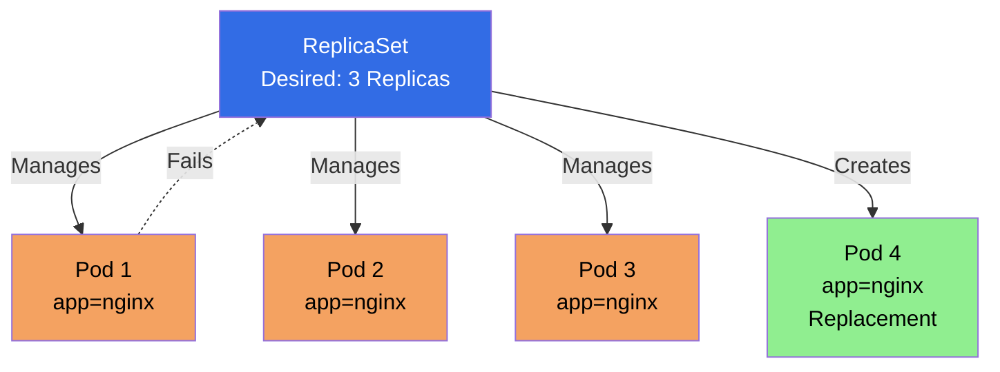

#### ReplicaSet Structure

```yaml
apiVersion: apps/v1
kind: ReplicaSet
metadata:
  name: my-replicaset
spec:
  replicas: 3                    # Desired number of replicas
  selector:                       # Label selector
    matchLabels:
      app: nginx
  template:                       # Pod template
    metadata:
      labels:
        app: nginx
    spec:
      containers:
      - name: nginx
        image: nginx:latest
```

#### ReplicaSet Spec Fields Explained

**apiVersion:**
- API version for ReplicaSet
- Required: `apps/v1`

**kind:**
- Object type
- Required: `ReplicaSet`

**metadata:**
- Object metadata (name, namespace, labels, annotations)
- **name:** ReplicaSet name (required)
- **namespace:** Namespace (optional, defaults to default)
- **labels:** Key-value pairs for organization
- **annotations:** Additional metadata

**spec:**
- ReplicaSet specification
- **replicas:** Desired number of pod replicas (default: 1)
- **selector:** Label selector to identify pods
  - **matchLabels:** Equality-based selector (key-value pairs)
  - **matchExpressions:** Set-based selector (operators: In, NotIn, Exists, DoesNotExist)
- **template:** Pod template (required)
  - **metadata:** Pod metadata (labels must match selector)
  - **spec:** Pod specification (containers, volumes, etc.)

**Important Notes:**
- Template labels **must match** selector labels
- ReplicaSet manages pods matching the selector
- If pods exist with matching labels, ReplicaSet adopts them

#### Creating ReplicaSet

**Method 1: Using YAML**

```yaml
apiVersion: apps/v1
kind: ReplicaSet
metadata:
  name: nginx-replicaset
  namespace: nginx
spec:
  replicas: 3
  selector:
    matchLabels:
      app: nginx
  template:
    metadata:
      labels:
        app: nginx
    spec:
      containers:
      - name: nginx
        image: nginx
```

```bash
kubectl apply -f replicaset.yaml
```

**Method 2: Using kubectl**

```bash
# Create ReplicaSet imperatively
kubectl create replicaset nginx-rs --image=nginx:latest --replicas=3
```

#### Managing ReplicaSet

```bash
# List ReplicaSets
kubectl get replicasets
kubectl get rs

# Get ReplicaSet details
kubectl get rs <replicaset-name>

# Describe ReplicaSet
kubectl describe rs <replicaset-name>

# Scale ReplicaSet
kubectl scale rs <replicaset-name> --replicas=5

# Delete ReplicaSet (pods are also deleted)
kubectl delete rs <replicaset-name>

# Delete ReplicaSet but keep pods
kubectl delete rs <replicaset-name> --cascade=orphan
```

#### How ReplicaSet Works

1. **ReplicaSet watches for pods** matching its selector
2. **If pods < desired:** Creates new pods
3. **If pods > desired:** Deletes excess pods
4. **If pod fails:** ReplicaSet creates replacement
5. **Continuous reconciliation:** Maintains desired state

#### ReplicaSet Selector

**Label Selector:**
```yaml
selector:
  matchLabels:
    app: nginx
    env: production
```

**Match Expressions:**
```yaml
selector:
  matchExpressions:
  - key: app
    operator: In
    values:
    - nginx
    - apache
```

#### ReplicaSet vs Manual Pod Management

**Without ReplicaSet:**
- Pod fails → Manual intervention needed
- Need to manually create replacement
- No automatic scaling

**With ReplicaSet:**
- Pod fails → Automatically replaced
- Maintains desired count
- Self-healing

#### ReplicaSet Best Practices

1. **Don't create ReplicaSets directly** - Use Deployments instead
2. **Match labels correctly** - Template labels must match selector
3. **Use meaningful labels** - For better organization
4. **Set appropriate replicas** - Based on workload requirements

#### Example Reference

For a practical example of a ReplicaSet YAML file, check out:

- **[nginx/replicaset.yml](./nginx/replicaset.yml)** - Example ReplicaSet definition

This example demonstrates:
- ReplicaSet structure with replicas
- Label selector configuration
- Pod template definition
- Basic ReplicaSet pattern

**To use this example:**
```bash
# Apply the ReplicaSet
kubectl apply -f nginx/replicaset.yml

# View the ReplicaSet
kubectl get rs -n nginx

# View pods created by ReplicaSet
kubectl get pods -n nginx -l app=nginx

# Scale the ReplicaSet
kubectl scale rs nginx-replicaset --replicas=5 -n nginx
```

#### Key Takeaways

1. **ReplicaSet maintains pod replicas** - Ensures desired count
2. **Self-healing** - Automatically replaces failed pods
3. **Label-based selection** - Uses selectors to identify pods
4. **Usually managed by Deployments** - Don't create directly
5. **Template must match selector** - Labels in template must match selector

---

### Deployments

**Deployment** is a higher-level concept that manages ReplicaSets and provides declarative updates for Pods. It's the recommended way to manage stateless applications in Kubernetes.

#### What is a Deployment?

A Deployment provides:
- **Declarative updates** for Pods and ReplicaSets
- **Rolling updates** and rollbacks
- **Replica management** (via ReplicaSet)
- **Self-healing** capabilities

**Key Characteristics:**
- **Manages ReplicaSets:** Creates and manages ReplicaSets
- **Rolling Updates:** Updates pods with zero downtime
- **Rollback:** Can rollback to previous versions
- **History:** Maintains revision history
- **Recommended:** Preferred way to manage stateless apps

#### Deployment Diagram

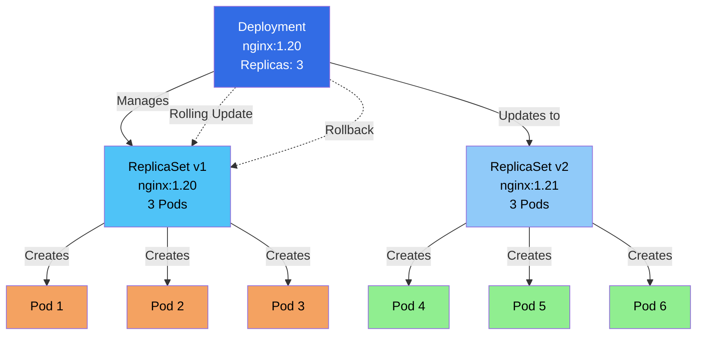

#### Deployment Structure

```yaml
apiVersion: apps/v1
kind: Deployment
metadata:
  name: nginx-deployment
spec:
  replicas: 3
  selector:
    matchLabels:
      app: nginx
  template:
    metadata:
      labels:
        app: nginx
    spec:
      containers:
      - name: nginx
        image: nginx:1.21
        ports:
        - containerPort: 80
  strategy:
    type: RollingUpdate
    rollingUpdate:
      maxSurge: 1
      maxUnavailable: 0
```

#### Deployment Spec Fields Explained

**apiVersion:**
- API version for Deployment
- Required: `apps/v1`

**kind:**
- Object type
- Required: `Deployment`

**metadata:**
- Object metadata (name, namespace, labels, annotations)
- **name:** Deployment name (required)
- **namespace:** Namespace (optional, defaults to default)
- **labels:** Key-value pairs for organization
- **annotations:** Additional metadata

**spec:**
- Deployment specification
- **replicas:** Desired number of pod replicas (default: 1)
- **selector:** Label selector to identify pods
  - **matchLabels:** Equality-based selector (key-value pairs)
  - **matchExpressions:** Set-based selector (operators: In, NotIn, Exists, DoesNotExist)
- **template:** Pod template (required)
  - **metadata:** Pod metadata (labels must match selector)
  - **spec:** Pod specification (containers, volumes, etc.)
- **strategy:** Update strategy (optional)
  - **type:** `RollingUpdate` (default) or `Recreate`
  - **rollingUpdate:** Rolling update configuration
    - **maxSurge:** Maximum number of pods that can be created above desired (default: 25%)
    - **maxUnavailable:** Maximum number of pods that can be unavailable (default: 25%)
- **revisionHistoryLimit:** Number of old ReplicaSets to retain (default: 10)
- **progressDeadlineSeconds:** Maximum time to wait for Deployment to progress (default: 600s)
- **minReadySeconds:** Minimum seconds a pod must be ready (default: 0)

**Important Notes:**
- Template labels **must match** selector labels
- Deployment creates and manages ReplicaSets
- Each update creates a new ReplicaSet
- Old ReplicaSets are kept for rollback

#### Creating Deployments

**Method 1: Using YAML (Recommended)**

```yaml
apiVersion: apps/v1
kind: Deployment
metadata:
  name: nginx-deployment
  namespace: nginx
spec:
  replicas: 3
  selector:
    matchLabels:
      app: nginx
  template:
    metadata:
      labels:
        app: nginx
    spec:
      containers:
      - name: nginx
        image: nginx
```

```bash
kubectl apply -f deployment.yaml
```

**Method 2: Using kubectl**

```bash
# Create deployment
kubectl create deployment nginx --image=nginx:latest

# Create with replicas
kubectl create deployment nginx --image=nginx:latest --replicas=3
```

#### Managing Deployments

```bash
# List deployments
kubectl get deployments
kubectl get deploy

# Get deployment details
kubectl get deployment <deployment-name>

# Describe deployment
kubectl describe deployment <deployment-name>

# Scale deployment
kubectl scale deployment <deployment-name> --replicas=5

# Update deployment (change image)
kubectl set image deployment/<deployment-name> nginx=nginx:1.21

# Rollout status
kubectl rollout status deployment/<deployment-name>

# Rollout history
kubectl rollout history deployment/<deployment-name>

# Rollback to previous version
kubectl rollout undo deployment/<deployment-name>

# Rollback to specific revision
kubectl rollout undo deployment/<deployment-name> --to-revision=2

# Pause rollout
kubectl rollout pause deployment/<deployment-name>

# Resume rollout
kubectl rollout resume deployment/<deployment-name>

# Delete deployment
kubectl delete deployment <deployment-name>
```

#### Deployment Update Strategies

**Rolling Update (Default):**

```yaml
spec:
  strategy:
    type: RollingUpdate
    rollingUpdate:
      maxSurge: 1           # Can have 1 extra pod during update
      maxUnavailable: 0    # No pods unavailable during update
```

**Recreate:**

```yaml
spec:
  strategy:
    type: Recreate         # Terminates old pods before creating new ones
```

#### Rolling Update Process

```
Current State: 3 pods running nginx:1.20
    ↓
Update to nginx:1.21
    ↓
1. Create new ReplicaSet with nginx:1.21
2. Scale up new ReplicaSet (1 pod)
3. Scale down old ReplicaSet (1 pod)
4. Continue until all pods updated
    ↓
Final State: 3 pods running nginx:1.21
```

#### Deployment Rollback

```bash
# View rollout history
kubectl rollout history deployment/nginx-deployment

# Rollback to previous version
kubectl rollout undo deployment/nginx-deployment

# Rollback to specific revision
kubectl rollout undo deployment/nginx-deployment --to-revision=2

# View specific revision
kubectl rollout history deployment/nginx-deployment --revision=2
```

#### Deployment Status

```bash
# Check deployment status
kubectl get deployment <deployment-name>

# Output shows:
# NAME               READY   UP-TO-DATE   AVAILABLE   AGE
# nginx-deployment   3/3     3            3           5m

# READY: Current/Desired replicas
# UP-TO-DATE: Replicas updated to latest
# AVAILABLE: Replicas available for traffic
```

#### Deployment Conditions

Deployments have conditions:
- **Available:** Deployment has minimum availability
- **Progressing:** Deployment is progressing
- **ReplicaFailure:** ReplicaSet creation failed

#### Deployment Best Practices

1. **Use Deployments for stateless apps** - Not for stateful applications
2. **Set resource limits** - In pod template
3. **Use health checks** - Liveness and readiness probes
4. **Use specific image tags** - Not `latest`
5. **Set update strategy** - RollingUpdate or Recreate
6. **Use labels consistently** - For selection and organization
7. **Monitor rollout status** - Check during updates

#### Example Reference

For a practical example of a Deployment YAML file, check out:

- **[nginx/deployment.yml](./nginx/deployment.yml)** - Example Deployment definition

This example demonstrates:
- Deployment structure with replicas
- Label selector configuration
- Pod template definition
- Basic Deployment pattern

**To use this example:**
```bash
# Apply the Deployment
kubectl apply -f nginx/deployment.yml

# View the Deployment
kubectl get deployment -n nginx

# View pods created by Deployment
kubectl get pods -n nginx -l app=nginx

# Scale the Deployment
kubectl scale deployment nginx-deployment --replicas=5 -n nginx

# Update the image
kubectl set image deployment/nginx-deployment nginx=nginx:1.21 -n nginx

# Check rollout status
kubectl rollout status deployment/nginx-deployment -n nginx
```

#### Key Takeaways

1. **Deployments manage ReplicaSets** - Higher-level abstraction
2. **Rolling updates** - Zero-downtime updates
3. **Rollback capability** - Can revert to previous versions
4. **Recommended for stateless apps** - Standard way to deploy
5. **Self-healing** - Automatically replaces failed pods
6. **Revision history** - Tracks changes for rollback

---

### StatefulSet

**StatefulSet** manages stateful applications and provides guarantees about the ordering and uniqueness of Pods. Unlike Deployments, StatefulSets maintain a sticky identity for each Pod.

#### What is a StatefulSet?

A StatefulSet provides:
- **Stable network identity** - Each pod gets stable hostname
- **Stable storage** - Each pod gets persistent storage
- **Ordered deployment** - Pods created in order
- **Ordered scaling** - Pods scaled up/down in order
- **Ordered updates** - Pods updated in reverse order

**Key Characteristics:**
- **Stable Identity:** Pod name and hostname don't change
- **Persistent Storage:** Each pod gets its own volume
- **Ordered Operations:** Deploy, scale, update in order
- **Stateful Apps:** Designed for databases, queues, etc.

#### StatefulSet Diagram

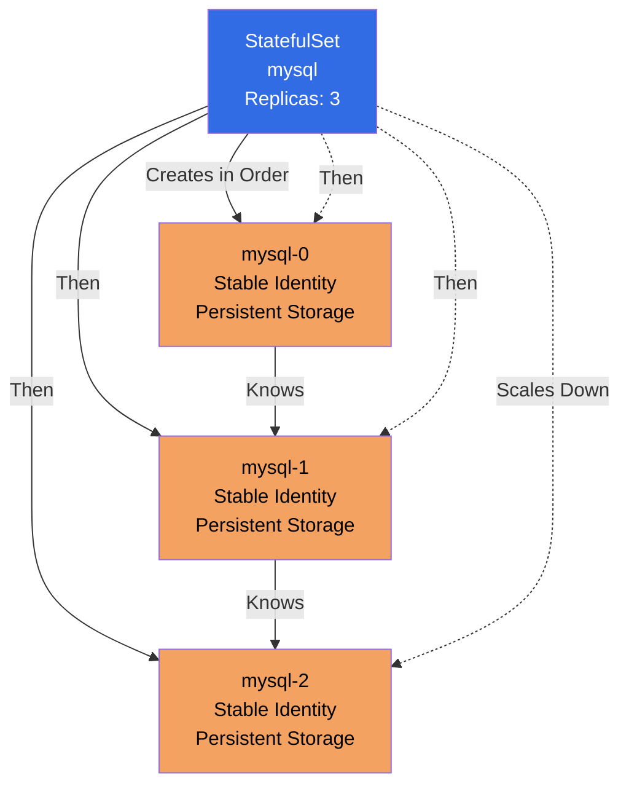

#### StatefulSet Structure

```yaml
apiVersion: apps/v1
kind: StatefulSet
metadata:
  name: mysql
spec:
  serviceName: mysql-headless    # Headless service name
  replicas: 3
  selector:
    matchLabels:
      app: mysql
  template:
    metadata:
      labels:
        app: mysql
    spec:
      containers:
      - name: mysql
        image: mysql:8.0
        volumeMounts:
        - name: data
          mountPath: /var/lib/mysql
  volumeClaimTemplates:          # Persistent volume for each pod
  - metadata:
      name: data
    spec:
      accessModes: ["ReadWriteOnce"]
      resources:
        requests:
          storage: 10Gi
```

#### StatefulSet Spec Fields Explained

**apiVersion:**
- API version for StatefulSet
- Required: `apps/v1`

**kind:**
- Object type
- Required: `StatefulSet`

**metadata:**
- Object metadata (name, namespace, labels, annotations)
- **name:** StatefulSet name (required)
- **namespace:** Namespace (optional, defaults to default)
- **labels:** Key-value pairs for organization
- **annotations:** Additional metadata

**spec:**
- StatefulSet specification
- **serviceName:** Name of headless service (required) - Provides stable network identity
- **replicas:** Desired number of pod replicas (default: 1)
- **selector:** Label selector to identify pods
  - **matchLabels:** Equality-based selector (key-value pairs)
  - **matchExpressions:** Set-based selector (operators: In, NotIn, Exists, DoesNotExist)
- **template:** Pod template (required)
  - **metadata:** Pod metadata (labels must match selector)
  - **spec:** Pod specification (containers, volumes, etc.)
- **volumeClaimTemplates:** Persistent volume claim templates (optional)
  - Creates a PVC for each pod
  - Each pod gets its own persistent volume
  - PVC name format: `<volumeClaimTemplate-name>-<pod-name>`
- **updateStrategy:** Update strategy (optional)
  - **type:** `RollingUpdate` (default) or `OnDelete`
  - **rollingUpdate:** Rolling update configuration
    - **partition:** Pods with index >= partition are updated (default: 0)
- **podManagementPolicy:** Pod management policy (optional)
  - `OrderedReady` (default): Pods created/terminated in order
  - `Parallel`: Pods created/terminated in parallel
- **revisionHistoryLimit:** Number of old ControllerRevisions to retain (default: 10)

**Important Notes:**
- **serviceName is required** - Must reference a headless Service
- Template labels **must match** selector labels
- Pods get stable names: `<statefulset-name>-<ordinal>` (e.g., mysql-0, mysql-1)
- Each pod gets its own PVC from volumeClaimTemplates
- Pods are created/updated/deleted in order

#### Creating StatefulSet

```yaml
apiVersion: apps/v1
kind: StatefulSet
metadata:
  name: mysql
spec:
  serviceName: mysql
  replicas: 3
  selector:
    matchLabels:
      app: mysql
  template:
    metadata:
      labels:
        app: mysql
    spec:
      containers:
      - name: mysql
        image: mysql:8.0
        env:
        - name: MYSQL_ROOT_PASSWORD
          value: "password"
        volumeMounts:
        - name: data
          mountPath: /var/lib/mysql
  volumeClaimTemplates:
  - metadata:
      name: data
    spec:
      accessModes: ["ReadWriteOnce"]
      resources:
        requests:
          storage: 10Gi
```

#### Managing StatefulSet

```bash
# List StatefulSets
kubectl get statefulsets
kubectl get sts

# Get StatefulSet details
kubectl get sts <statefulset-name>

# Describe StatefulSet
kubectl describe sts <statefulset-name>

# Scale StatefulSet
kubectl scale sts <statefulset-name> --replicas=5

# Update StatefulSet
kubectl set image sts/<statefulset-name> mysql=mysql:8.0.28

# Delete StatefulSet
kubectl delete sts <statefulset-name>

# Delete StatefulSet but keep pods
kubectl delete sts <statefulset-name> --cascade=orphan
```

#### StatefulSet Pod Identity

**Stable Network Identity:**

```bash
# Pods get stable names
mysql-0
mysql-1
mysql-2

# Stable hostname
mysql-0.mysql.default.svc.cluster.local
mysql-1.mysql.default.svc.cluster.local
mysql-2.mysql.default.svc.cluster.local
```

**Stable Storage:**

```bash
# Each pod gets its own PVC
data-mysql-0
data-mysql-1
data-mysql-2
```

#### StatefulSet Ordering

**Deployment Order:**
1. Create mysql-0, wait for Ready
2. Create mysql-1, wait for Ready
3. Create mysql-2, wait for Ready

**Scaling Down Order:**
1. Terminate mysql-2
2. Terminate mysql-1
3. Terminate mysql-0

**Scaling Up Order:**
1. Create mysql-3
2. Create mysql-4
3. etc.

#### Headless Service

StatefulSets require a Headless Service:

```yaml
apiVersion: v1
kind: Service
metadata:
  name: mysql
spec:
  clusterIP: None              # Headless service
  selector:
    app: mysql
  ports:
  - port: 3306
```

**Why Headless Service?**
- Provides stable network identity
- Each pod gets DNS entry
- Enables direct pod-to-pod communication

#### StatefulSet Update Strategies

**Rolling Update (Default):**

```yaml
spec:
  updateStrategy:
    type: RollingUpdate
    rollingUpdate:
      partition: 2    # Update pods with index >= 2
```

**OnDelete:**

```yaml
spec:
  updateStrategy:
    type: OnDelete    # Update only when pod is deleted
```

#### StatefulSet Use Cases

**Databases:**
- MySQL, PostgreSQL, MongoDB
- Need stable identity and storage
- Ordered operations

**Message Queues:**
- RabbitMQ, Kafka
- Need stable identity
- Ordered scaling

**Distributed Systems:**
- Elasticsearch, Cassandra
- Need stable network identity
- Ordered operations

#### StatefulSet Best Practices

1. **Use for stateful applications** - Databases, queues, etc.
2. **Create Headless Service first** - Required for StatefulSet
3. **Use volumeClaimTemplates** - For persistent storage
4. **Plan scaling carefully** - Ordered operations take time
5. **Use init containers** - For initialization logic
6. **Set resource limits** - In pod template
7. **Use health checks** - Liveness and readiness probes

#### Key Takeaways

1. **StatefulSets for stateful apps** - Databases, queues, etc.
2. **Stable identity** - Pod names and hostnames don't change
3. **Persistent storage** - Each pod gets its own volume
4. **Ordered operations** - Deploy, scale, update in order
5. **Requires Headless Service** - For stable network identity
6. **Slower than Deployments** - Due to ordering requirements

---

### Comparison: ReplicaSet vs Deployment vs StatefulSet

#### Quick Comparison Table

| Feature | ReplicaSet | Deployment | StatefulSet |
|---------|-----------|------------|-------------|
| **Purpose** | Maintain pod replicas | Manage stateless apps | Manage stateful apps |
| **Updates** | Manual | Rolling updates | Ordered updates |
| **Rollback** | ❌ No | ✅ Yes | ✅ Yes |
| **Pod Identity** | Random | Random | Stable |
| **Storage** | Ephemeral | Ephemeral | Persistent |
| **Ordering** | ❌ No | ❌ No | ✅ Yes |
| **Use Case** | Lower-level | Stateless apps | Stateful apps |
| **Service** | Regular/Headless | Regular | Headless required |
| **Scaling** | Instant | Instant | Ordered |
| **Naming** | Random | Random | Sequential (app-0, app-1) |

#### Detailed Differences

**1. Purpose and Abstraction Level**

- **ReplicaSet:** Low-level, maintains pod count
- **Deployment:** High-level, manages ReplicaSets with updates
- **StatefulSet:** High-level, manages stateful applications

**2. Pod Identity**

- **ReplicaSet:** Random pod names (e.g., `nginx-abc123`)
- **Deployment:** Random pod names (e.g., `nginx-deployment-abc123`)
- **StatefulSet:** Stable, sequential names (e.g., `mysql-0`, `mysql-1`)

**3. Storage**

- **ReplicaSet:** Ephemeral storage only
- **Deployment:** Ephemeral storage only
- **StatefulSet:** Persistent storage per pod (via volumeClaimTemplates)

**4. Updates**

- **ReplicaSet:** Manual pod replacement
- **Deployment:** Automatic rolling updates
- **StatefulSet:** Ordered rolling updates

**5. Rollback**

- **ReplicaSet:** ❌ No rollback capability
- **Deployment:** ✅ Rollback to previous revisions
- **StatefulSet:** ✅ Rollback capability

**6. Scaling**

- **ReplicaSet:** Instant, no ordering
- **Deployment:** Instant, no ordering
- **StatefulSet:** Ordered (one at a time)

**7. Network Identity**

- **ReplicaSet:** Random IP, no stable DNS
- **Deployment:** Random IP, no stable DNS
- **StatefulSet:** Stable hostname, stable DNS

**8. Use Cases**

- **ReplicaSet:** Lower-level pod management (usually via Deployment)
- **Deployment:** Web servers, APIs, stateless microservices
- **StatefulSet:** Databases, message queues, distributed systems

#### When to Use What?

**Use ReplicaSet when:**
- ⚠️ **Don't use directly** - Use Deployment instead
- Only if you need very basic pod management
- Lower-level control needed

**Use Deployment when:**
- ✅ **Stateless applications** - Web servers, APIs
- ✅ **Need rolling updates** - Zero-downtime updates
- ✅ **Need rollback** - Ability to revert changes
- ✅ **Most common use case** - Default for stateless apps

**Use StatefulSet when:**
- ✅ **Stateful applications** - Databases, queues
- ✅ **Need stable identity** - Pod names must be stable
- ✅ **Need persistent storage** - Each pod needs its own storage
- ✅ **Need ordered operations** - Deploy/scale in order

#### Relationship Diagram

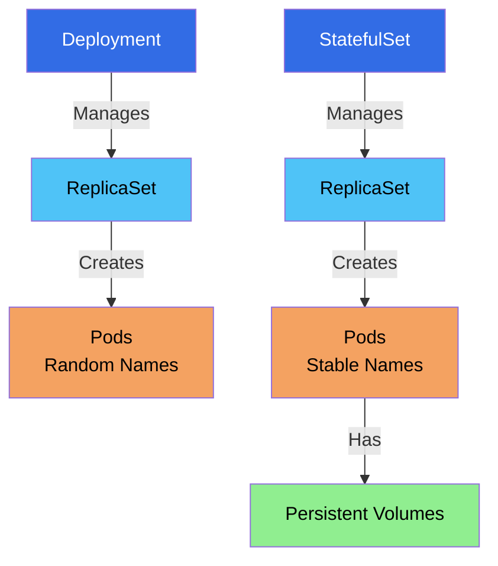

#### Summary

- **ReplicaSet:** Basic pod replica management (low-level)
- **Deployment:** Stateless app management with updates (recommended for most cases)
- **StatefulSet:** Stateful app management with stable identity (for databases, queues)

**Best Practice:** Use Deployments for stateless applications and StatefulSets for stateful applications. ReplicaSets are typically managed by Deployments and StatefulSets, not created directly.

---

### DaemonSet

**DaemonSet** ensures that a copy of a Pod runs on all (or specific) nodes in the cluster. It's used for system-level services that need to run on every node.

#### What is a DaemonSet?

A DaemonSet ensures that:
- A copy of a Pod runs on **all nodes** in the cluster
- Or on **selected nodes** (using node selectors)
- Pods are automatically added when new nodes join
- Pods are automatically removed when nodes are removed

**Key Characteristics:**
- **One Pod per Node:** Ensures one pod on each node
- **Node-Specific:** Pods are tied to specific nodes
- **Automatic Management:** Adds/removes pods as nodes join/leave
- **System Services:** Perfect for logging, monitoring, networking

#### DaemonSet Diagram

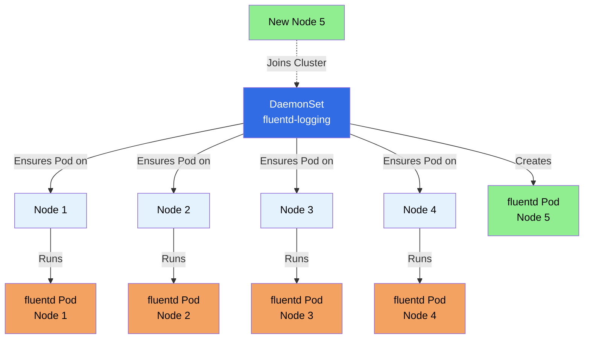

#### DaemonSet Structure

```yaml
apiVersion: apps/v1
kind: DaemonSet
metadata:
  name: fluentd-logging
spec:
  selector:
    matchLabels:
      name: fluentd-logging
  template:
    metadata:
      labels:
        name: fluentd-logging
    spec:
      containers:
      - name: fluentd
        image: fluent/fluentd:latest
        volumeMounts:
        - name: varlog
          mountPath: /var/log
        - name: varlibdockercontainers
          mountPath: /var/lib/docker/containers
          readOnly: true
      volumes:
      - name: varlog
        hostPath:
          path: /var/log
      - name: varlibdockercontainers
        hostPath:
          path: /var/lib/docker/containers
```

#### DaemonSet Spec Fields Explained

**apiVersion:**
- API version for DaemonSet
- Required: `apps/v1`

**kind:**
- Object type
- Required: `DaemonSet`

**metadata:**
- Object metadata (name, namespace, labels, annotations)
- **name:** DaemonSet name (required)
- **namespace:** Namespace (optional, defaults to default)
- **labels:** Key-value pairs for organization
- **annotations:** Additional metadata

**spec:**
- DaemonSet specification
- **selector:** Label selector to identify pods (required)
  - **matchLabels:** Equality-based selector (key-value pairs)
  - **matchExpressions:** Set-based selector (operators: In, NotIn, Exists, DoesNotExist)
- **template:** Pod template (required)
  - **metadata:** Pod metadata (labels must match selector)
  - **spec:** Pod specification (containers, volumes, etc.)
    - Can include **nodeSelector** to run on specific nodes
    - Can include **affinity** for node affinity rules
    - Can include **tolerations** to run on tainted nodes
- **updateStrategy:** Update strategy (optional)
  - **type:** `RollingUpdate` (default) or `OnDelete`
  - **rollingUpdate:** Rolling update configuration
    - **maxUnavailable:** Maximum number of pods unavailable during update (default: 1)
- **revisionHistoryLimit:** Number of old ControllerRevisions to retain (default: 10)
- **minReadySeconds:** Minimum seconds a pod must be ready (default: 0)

**Important Notes:**
- **No replicas field** - Number of pods = number of nodes (or selected nodes)
- Template labels **must match** selector labels
- DaemonSet ensures one pod per node (or per selected node)
- Pods are automatically created when nodes join
- Pods are automatically deleted when nodes are removed
- Use **nodeSelector** or **affinity** to run on specific nodes
- Use **tolerations** to run on tainted nodes (e.g., master nodes)

#### Creating DaemonSet

**Method 1: Using YAML (Recommended)**

```yaml
apiVersion: apps/v1
kind: DaemonSet
metadata:
  name: nginx-daemonset
  namespace: nginx
spec:
  selector:
    matchLabels:
      app: nginx
  template:
    metadata:
      labels:
        app: nginx
    spec:
      containers:
      - name: nginx
        image: nginx
```

```bash
kubectl apply -f daemonset.yaml
```

**Method 2: Using kubectl**

```bash
# Create DaemonSet imperatively
kubectl create daemonset nginx-ds --image=nginx:latest
```

#### Managing DaemonSet

```bash
# List DaemonSets
kubectl get daemonsets
kubectl get ds

# Get DaemonSet details
kubectl get ds <daemonset-name>

# Describe DaemonSet
kubectl describe ds <daemonset-name>

# View pods created by DaemonSet
kubectl get pods -l app=nginx

# Update DaemonSet (change image)
kubectl set image ds/<daemonset-name> nginx=nginx:1.21

# Delete DaemonSet
kubectl delete ds <daemonset-name>

# Delete DaemonSet but keep pods
kubectl delete ds <daemonset-name> --cascade=orphan
```

#### Node Selection

**Run on All Nodes (Default):**

```yaml
spec:
  template:
    spec:
      containers:
      - name: nginx
        image: nginx:latest
```

**Run on Specific Nodes (Node Selector):**

```yaml
spec:
  template:
    spec:
      nodeSelector:
        disktype: ssd
      containers:
      - name: nginx
        image: nginx:latest
```

**Run on Specific Nodes (Node Affinity):**

```yaml
spec:
  template:
    spec:
      affinity:
        nodeAffinity:
          requiredDuringSchedulingIgnoredDuringExecution:
            nodeSelectorTerms:
            - matchExpressions:
              - key: zone
                operator: In
                values:
                - us-east-1a
      containers:
      - name: nginx
        image: nginx:latest
```

#### DaemonSet Use Cases

**1. Logging Agents**
- Fluentd, Filebeat, Logstash
- Collect logs from all nodes
- Centralized logging

**2. Monitoring Agents**
- Prometheus Node Exporter
- Datadog Agent
- Collect metrics from all nodes

**3. Network Plugins**
- CNI plugins
- Network policy agents
- Run on every node

**4. Storage Daemons**
- GlusterFS, Ceph
- Storage management
- Run on storage nodes

**5. Security Agents**
- Security scanners
- Antivirus agents
- Run on all nodes

#### DaemonSet vs Deployment

| Aspect | DaemonSet | Deployment |
|--------|-----------|------------|
| **Pods per Node** | One pod per node | Fixed number of pods |
| **Scaling** | Automatic (based on nodes) | Manual scaling |
| **Node Selection** | All or selected nodes | Any available node |
| **Use Case** | System services | Application services |
| **Replicas** | Not specified | Specified in spec |

#### DaemonSet Update Strategy

**Rolling Update (Default):**

```yaml
spec:
  updateStrategy:
    type: RollingUpdate
    rollingUpdate:
      maxUnavailable: 1    # Max pods unavailable during update
```

**OnDelete:**

```yaml
spec:
  updateStrategy:
    type: OnDelete    # Update only when pod is deleted manually
```

#### DaemonSet Status

```bash
# Check DaemonSet status
kubectl get ds <daemonset-name>

# Output shows:
# NAME              DESIRED   CURRENT   READY   UP-TO-DATE   AVAILABLE   NODE SELECTOR   AGE
# fluentd-logging   3         3         3       3            3           <none>          5m

# DESIRED: Number of nodes that should have pod
# CURRENT: Number of pods currently running
# READY: Number of pods ready
# UP-TO-DATE: Number of pods updated to latest
# AVAILABLE: Number of pods available
```

#### DaemonSet Best Practices

1. **Use for system services** - Logging, monitoring, networking
2. **Set resource limits** - Prevent resource exhaustion
3. **Use hostPath volumes carefully** - Security implications
4. **Set node selectors** - Run only on specific nodes when needed
5. **Use tolerations** - Run on tainted nodes if needed
6. **Set update strategy** - RollingUpdate or OnDelete
7. **Use labels consistently** - For organization

#### Tolerations for Tainted Nodes

DaemonSets can run on tainted nodes using tolerations:

```yaml
spec:
  template:
    spec:
      tolerations:
      - key: "node-role.kubernetes.io/master"
        operator: "Exists"
        effect: "NoSchedule"
      containers:
      - name: nginx
        image: nginx:latest
```

#### DaemonSet Example: Logging Agent

```yaml
apiVersion: apps/v1
kind: DaemonSet
metadata:
  name: fluentd-logging
  namespace: kube-system
spec:
  selector:
    matchLabels:
      name: fluentd-logging
  template:
    metadata:
      labels:
        name: fluentd-logging
    spec:
      tolerations:
      - key: node-role.kubernetes.io/master
        effect: NoSchedule
      containers:
      - name: fluentd
        image: fluent/fluentd:latest
        resources:
          limits:
            memory: 200Mi
          requests:
            cpu: 100m
            memory: 200Mi
        volumeMounts:
        - name: varlog
          mountPath: /var/log
        - name: varlibdockercontainers
          mountPath: /var/lib/docker/containers
          readOnly: true
      terminationGracePeriodSeconds: 30
      volumes:
      - name: varlog
        hostPath:
          path: /var/log
      - name: varlibdockercontainers
        hostPath:
          path: /var/lib/docker/containers
```

#### DaemonSet Commands Summary

```bash
# Create
kubectl create -f daemonset.yaml
kubectl create daemonset <name> --image=<image>

# Get
kubectl get daemonsets
kubectl get ds
kubectl describe ds <name>

# Update
kubectl set image ds/<name> <container>=<image>
kubectl edit ds <name>

# Delete
kubectl delete ds <name>
kubectl delete -f daemonset.yaml
```

#### Example Reference

For a practical example of a DaemonSet YAML file, check out:

- **[nginx/daemonset.yml](./nginx/daemonset.yml)** - Example DaemonSet definition

This example demonstrates:
- DaemonSet structure with selector
- Pod template definition
- Basic DaemonSet pattern for nginx
- Namespace configuration

**To use this example:**
```bash
# Apply the DaemonSet
kubectl apply -f nginx/daemonset.yml

# View the DaemonSet
kubectl get ds -n nginx

# View pods created by DaemonSet (one per node)
kubectl get pods -n nginx -l app=nginx

# Check which nodes have the pod
kubectl get pods -n nginx -l app=nginx -o wide

# Update the DaemonSet
kubectl set image ds/nginx-daemonset nginx=nginx:1.21 -n nginx

# Check DaemonSet status
kubectl get ds nginx-daemonset -n nginx
```

#### Key Takeaways

1. **DaemonSet runs one pod per node** - Ensures pod on all/selected nodes
2. **Automatic management** - Adds pods when nodes join, removes when nodes leave
3. **Perfect for system services** - Logging, monitoring, networking agents
4. **Node selection** - Can run on all nodes or selected nodes
5. **No replicas field** - Number of pods = number of nodes (or selected nodes)
6. **Use tolerations** - To run on tainted nodes (like master nodes)
7. **Update strategies** - RollingUpdate or OnDelete
8. **HostPath volumes** - Common for accessing node filesystem

DaemonSets are essential for running system-level services that need to be present on every node in your cluster.

---

### Jobs

**Jobs** create one or more Pods and ensure that a specified number of them successfully terminate. Jobs are used for batch processing, one-time tasks, and workloads that need to run to completion.

#### What is a Job?

A Job creates Pods that run until completion (success or failure). Unlike Deployments, Jobs are designed for:
- **One-time tasks** - Tasks that run once and complete
- **Batch processing** - Processing data in batches
- **Workloads that must complete** - Tasks that need to finish successfully

**Key Characteristics:**
- **Runs to completion** - Pods run until they succeed or fail
- **Retry on failure** - Can retry failed pods
- **Parallel execution** - Can run multiple pods in parallel
- **Completion tracking** - Tracks successful completions

#### Job Diagram

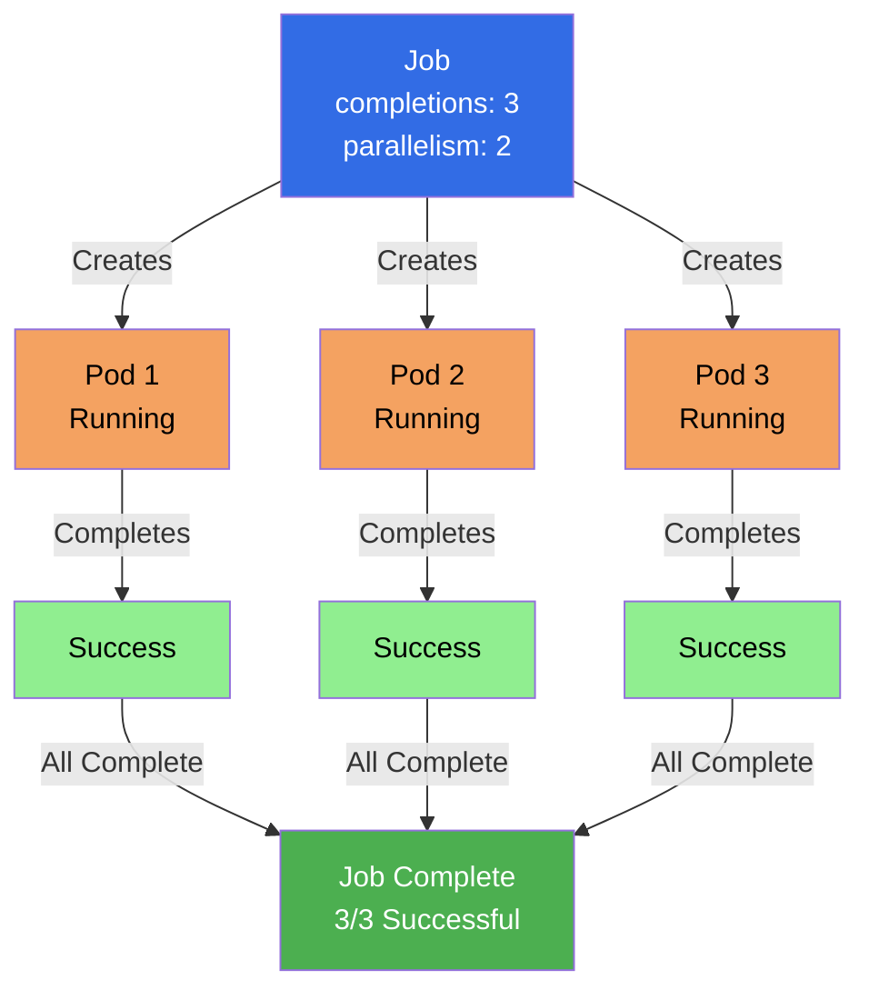

#### Job YAML Structure

```yaml
apiVersion: batch/v1
kind: Job
metadata:
  name: my-job
  namespace: default
spec:
  completions: 1          # Number of successful completions needed
  parallelism: 1         # Number of pods to run in parallel
  backoffLimit: 6        # Number of retries before marking as failed
  activeDeadlineSeconds: 300  # Maximum time job can run (seconds)
  template:
    metadata:
      labels:
        app: batch-task
    spec:
      restartPolicy: Never  # Never, OnFailure, Always
      containers:
      - name: task-container
        image: busybox:latest
        command: ["sh", "-c", "echo Hello World && sleep 10"]
```

#### Job Spec Fields Explained

**completions:**
- Number of successful completions required
- Job completes when this many pods succeed
- Default: 1

**parallelism:**
- Number of pods to run in parallel
- Can be less than or equal to completions
- Default: 1

**backoffLimit:**
- Number of retries before marking job as failed
- Default: 6

**activeDeadlineSeconds:**
- Maximum time (seconds) the job can run
- Job is terminated if exceeded
- Optional

**restartPolicy:**
- **Never:** Don't restart (default for Jobs)
- **OnFailure:** Restart only on failure
- **Always:** Always restart (not recommended for Jobs)

#### Creating Jobs

**Method 1: Using YAML (Recommended)**

```yaml
apiVersion: batch/v1
kind: Job
metadata:
  name: demo-job
  namespace: nginx
spec:
  completions: 1
  parallelism: 1
  template:
    metadata:
      labels:
        app: batch-task
    spec:
      containers:
      - name: batch-container
        image: busybox:latest
        command: ["sh", "-c", "echo Hello Dosto! && sleep 10"]
      restartPolicy: Never
```

```bash
kubectl apply -f job.yaml
```

**Method 2: Using kubectl**

```bash
# Create job imperatively
kubectl create job my-job --image=busybox -- echo "Hello World"

# Create job with command
kubectl create job my-job --image=busybox -- sh -c "echo Hello && sleep 10"
```

#### Managing Jobs

```bash
# List jobs
kubectl get jobs
kubectl get job

# Get job details
kubectl get job <job-name>

# Describe job
kubectl describe job <job-name>

# View pods created by job
kubectl get pods -l job-name=<job-name>

# View job logs
kubectl logs job/<job-name>

# Delete job (pods are also deleted)
kubectl delete job <job-name>

# Delete job but keep pods
kubectl delete job <job-name> --cascade=orphan
```

#### Job Types

**1. Non-Parallel Job (completions: 1, parallelism: 1)**
- Runs one pod until completion
- Simplest job type

```yaml
spec:
  completions: 1
  parallelism: 1
```

**2. Fixed Completion Count Job (completions: N, parallelism: 1)**
- Runs N pods sequentially
- Each pod must complete successfully

```yaml
spec:
  completions: 5
  parallelism: 1
```

**3. Parallel Job with Fixed Completion (completions: N, parallelism: M)**
- Runs M pods in parallel
- Continues until N completions

```yaml
spec:
  completions: 10
  parallelism: 3
```

**4. Parallel Job with Work Queue (completions: null, parallelism: M)**
- Runs M pods in parallel
- Continues until all work is done
- Pods coordinate via work queue

```yaml
spec:
  completions: null
  parallelism: 3
```

#### Job Status

```bash
# Check job status
kubectl get job <job-name>

# Output shows:
# NAME      COMPLETIONS   DURATION   AGE
# my-job    1/1           30s         5m

# COMPLETIONS: Successful/Required
# DURATION: Time taken to complete
```

**Job Conditions:**
- **Complete:** Job completed successfully
- **Failed:** Job failed (exceeded backoffLimit)

#### Job Use Cases

**1. Batch Processing**
- Process data files
- Generate reports
- Data transformation

**2. One-Time Tasks**
- Database migrations
- Data imports
- Cleanup tasks

**3. Parallel Processing**
- Process multiple items in parallel
- Distributed computations

**4. Work Queue**
- Process items from a queue
- Distributed task processing

#### Job Best Practices

1. **Set restartPolicy to Never or OnFailure** - Jobs should complete, not restart indefinitely
2. **Set appropriate backoffLimit** - Prevent infinite retries
3. **Set activeDeadlineSeconds** - Prevent jobs from running too long
4. **Use completions and parallelism** - Control job execution
5. **Handle errors properly** - Exit with appropriate codes
6. **Clean up completed jobs** - Delete old jobs to save resources

#### Example Reference

For a practical example of a Job YAML file, check out:

- **[nginx/jobs.yml](./nginx/jobs.yml)** - Example Job definition

This example demonstrates:
- Job structure with completions and parallelism
- Pod template with container specification
- Command execution in container
- RestartPolicy configuration
- Basic Job pattern

**To use this example:**
```bash
# Apply the Job
kubectl apply -f nginx/jobs.yml

# View the Job
kubectl get job -n nginx

# View pods created by Job
kubectl get pods -n nginx -l app=batch-task

# View job logs
kubectl logs -n nginx -l app=batch-task

# Check job status
kubectl describe job demo-job -n nginx

# Delete the Job
kubectl delete job demo-job -n nginx
```

#### Key Takeaways

1. **Jobs run to completion** - Pods run until they succeed or fail
2. **Use for batch tasks** - One-time tasks, batch processing
3. **Set restartPolicy** - Never or OnFailure (not Always)
4. **Control parallelism** - Use parallelism to run multiple pods
5. **Track completions** - Use completions to specify required successes
6. **Set backoffLimit** - Prevent infinite retries
7. **Clean up jobs** - Delete completed jobs

---

### CronJobs

**CronJob** creates Jobs on a time-based schedule. It's like a cron job in Linux, but for Kubernetes Pods. CronJobs are used for periodic tasks, scheduled backups, and recurring batch jobs.

#### What is a CronJob?

A CronJob creates Jobs on a schedule defined by a cron expression. It:
- **Runs on schedule** - Executes jobs at specified times
- **Creates Job objects** - Each execution creates a new Job
- **Maintains history** - Keeps record of successful and failed jobs
- **Time-based execution** - Uses cron syntax for scheduling

**Key Characteristics:**
- **Scheduled execution** - Runs jobs on a schedule
- **Creates Jobs** - Each run creates a new Job
- **History management** - Maintains job history
- **Time zones** - Can specify timezone

#### CronJob Diagram

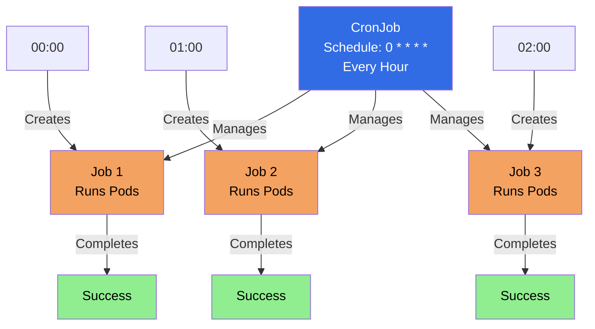

#### CronJob YAML Structure

```yaml
apiVersion: batch/v1
kind: CronJob
metadata:
  name: my-cronjob
  namespace: default
spec:
  schedule: "0 * * * *"        # Cron schedule
  timeZone: "America/New_York" # Optional timezone
  startingDeadlineSeconds: 200 # Optional deadline
  concurrencyPolicy: Allow      # Allow, Forbid, Replace
  successfulJobsHistoryLimit: 3 # Keep 3 successful jobs
  failedJobsHistoryLimit: 1     # Keep 1 failed job
  suspend: false                # Set to true to suspend
  jobTemplate:
    spec:
      completions: 1
      parallelism: 1
      template:
        metadata:
          labels:
            app: scheduled-task
        spec:
          restartPolicy: OnFailure
          containers:
          - name: task-container
            image: busybox:latest
            command: ["sh", "-c", "echo Scheduled task && date"]
```

#### Cron Schedule Format

**Cron Expression:**
```
┌───────────── minute (0 - 59)
│ ┌───────────── hour (0 - 23)
│ │ ┌───────────── day of month (1 - 31)
│ │ │ ┌───────────── month (1 - 12)
│ │ │ │ ┌───────────── day of week (0 - 6) (Sunday to Saturday)
│ │ │ │ │
* * * * *
```

**Common Examples:**

```yaml
# Every minute
schedule: "* * * * *"

# Every hour (at minute 0)
schedule: "0 * * * *"

# Every day at midnight
schedule: "0 0 * * *"

# Every day at 2:30 AM
schedule: "30 2 * * *"

# Every Monday at 9:00 AM
schedule: "0 9 * * 1"

# Every first day of month at midnight
schedule: "0 0 1 * *"

# Every 15 minutes
schedule: "*/15 * * * *"

# Every 5 minutes
schedule: "*/5 * * * *"

# Every weekday at 9 AM
schedule: "0 9 * * 1-5"
```

#### CronJob Spec Fields Explained

**schedule:**
- Cron expression defining when to run
- Required field
- Format: `minute hour day month day-of-week`

**timeZone:**
- Timezone for the schedule
- Optional (defaults to kube-controller-manager timezone)
- Example: `"America/New_York"`, `"UTC"`

**startingDeadlineSeconds:**
- Deadline for starting the job
- If missed, job is skipped
- Optional

**concurrencyPolicy:**
- **Allow:** Allow concurrent jobs (default)
- **Forbid:** Don't allow concurrent jobs
- **Replace:** Replace currently running job

**successfulJobsHistoryLimit:**
- Number of successful jobs to keep
- Default: 3
- Set to 0 to not keep any

**failedJobsHistoryLimit:**
- Number of failed jobs to keep
- Default: 1
- Set to 0 to not keep any

**suspend:**
- Set to true to suspend the CronJob
- Default: false
- Jobs won't be created when suspended

**jobTemplate:**
- Template for creating Jobs
- Same structure as Job spec

#### Creating CronJobs

**Method 1: Using YAML (Recommended)**

```yaml
apiVersion: batch/v1
kind: CronJob
metadata:
  name: minute-backup
  namespace: nginx
spec:
  schedule: "* * * * *"
  jobTemplate:
    spec:
      template:
        metadata:
          labels:
            app: minute-backup
        spec:
          containers:
          - name: backup-container
            image: busybox
            command:
            - sh
            - -c
            - >
              echo "Backup Started" ;
              mkdir -p /backups &&
              mkdir -p /demo-data &&
              cp -r /demo-data /backups &&
              echo "Backup Completed" ;
            volumeMounts:
            - name: data-volume
              mountPath: /demo-data
            - name: backup-volume
              mountPath: /backups
          restartPolicy: OnFailure
          volumes:
          - name: data-volume
            hostPath:
              path: /demo-data
              type: DirectoryOrCreate
          - name: backup-volume
            hostPath:
              path: /backups
              type: DirectoryOrCreate
```

```bash
kubectl apply -f cronjob.yaml
```

**Method 2: Using kubectl**

```bash
# Create CronJob imperatively
kubectl create cronjob my-cronjob --image=busybox --schedule="0 * * * *" -- echo "Hello"
```

#### Managing CronJobs

```bash
# List CronJobs
kubectl get cronjobs
kubectl get cj

# Get CronJob details
kubectl get cronjob <cronjob-name>

# Describe CronJob
kubectl describe cronjob <cronjob-name>

# View jobs created by CronJob
kubectl get jobs -l app=<label>

# Suspend CronJob
kubectl patch cronjob <cronjob-name> -p '{"spec":{"suspend":true}}'

# Resume CronJob
kubectl patch cronjob <cronjob-name> -p '{"spec":{"suspend":false}}'

# Delete CronJob
kubectl delete cronjob <cronjob-name>
```

#### CronJob Concurrency Policies

**Allow (Default):**
```yaml
spec:
  concurrencyPolicy: Allow
```
- Allows multiple jobs to run concurrently
- Use when jobs are independent

**Forbid:**
```yaml
spec:
  concurrencyPolicy: Forbid
```
- Prevents new job if previous is still running
- Use when jobs must not overlap

**Replace:**
```yaml
spec:
  concurrencyPolicy: Replace
```
- Replaces currently running job with new one
- Use when only latest job matters

#### CronJob Use Cases

**1. Scheduled Backups**
- Database backups
- File system backups
- Configuration backups

**2. Periodic Cleanup**
- Clean old logs
- Remove temporary files
- Archive old data

**3. Scheduled Reports**
- Daily reports
- Weekly summaries
- Monthly analytics

**4. Health Checks**
- Periodic health checks
- System monitoring
- Status updates

**5. Data Synchronization**
- Sync data between systems
- Update caches
- Refresh data

#### CronJob Best Practices

1. **Use appropriate schedule** - Don't schedule too frequently
2. **Set concurrencyPolicy** - Choose based on job requirements
3. **Set history limits** - Clean up old jobs
4. **Handle timezones** - Specify timeZone if needed
5. **Set startingDeadlineSeconds** - Handle missed schedules
6. **Test schedules** - Verify cron expressions
7. **Monitor jobs** - Check job success/failure
8. **Use suspend** - Temporarily disable without deleting

#### CronJob Status

```bash
# Check CronJob status
kubectl get cronjob <cronjob-name>

# Output shows:
# NAME           SCHEDULE      SUSPEND   ACTIVE   LAST SCHEDULE   AGE
# minute-backup   * * * * *     False     0        30s ago         5m

# SCHEDULE: Cron expression
# SUSPEND: Whether suspended
# ACTIVE: Number of active jobs
# LAST SCHEDULE: When last job was created
```

#### Example Reference

For a practical example of a CronJob YAML file, check out:

- **[nginx/cron-job.yaml](./nginx/cron-job.yaml)** - Example CronJob definition

This example demonstrates:
- CronJob structure with schedule
- Job template specification
- Container with command execution
- Volume mounts for data and backups
- HostPath volumes configuration
- RestartPolicy for job containers
- Complete backup task example

**To use this example:**
```bash
# Apply the CronJob
kubectl apply -f nginx/cron-job.yaml

# View the CronJob
kubectl get cronjob -n nginx

# View jobs created by CronJob
kubectl get jobs -n nginx -l app=minute-backup

# View pods created by jobs
kubectl get pods -n nginx -l app=minute-backup

# View logs from latest job
kubectl logs -n nginx -l app=minute-backup --tail=50

# Suspend the CronJob
kubectl patch cronjob minute-backup -n nginx -p '{"spec":{"suspend":true}}'

# Resume the CronJob
kubectl patch cronjob minute-backup -n nginx -p '{"spec":{"suspend":false}}'

# Check CronJob status
kubectl describe cronjob minute-backup -n nginx

# Delete the CronJob
kubectl delete cronjob minute-backup -n nginx
```

#### Key Takeaways

1. **CronJobs create Jobs on schedule** - Time-based job execution
2. **Use cron syntax** - Standard cron expression format
3. **Each run creates a Job** - CronJob manages Job creation
4. **Set concurrencyPolicy** - Control concurrent executions
5. **Manage history** - Set limits for successful/failed jobs
6. **Use suspend** - Temporarily disable without deletion
7. **Specify timezone** - For accurate scheduling
8. **Monitor execution** - Check job success/failure

CronJobs are essential for running periodic tasks, scheduled backups, and recurring batch jobs in Kubernetes.

---

### Comparison: Jobs vs CronJobs

| Aspect | Job | CronJob |
|--------|-----|---------|
| **Execution** | One-time | Scheduled (recurring) |
| **Trigger** | Manual creation | Time-based schedule |
| **Use Case** | Batch tasks, one-time | Periodic tasks, backups |
| **Creates** | Pods directly | Creates Jobs |
| **Schedule** | N/A | Cron expression |
| **History** | Manual cleanup | Automatic history management |
| **Concurrency** | Controlled by parallelism | Controlled by concurrencyPolicy |

**When to Use:**
- **Job:** One-time tasks, batch processing, manual execution
- **CronJob:** Scheduled tasks, periodic backups, recurring jobs

---

## Storage

Kubernetes provides several storage abstractions to manage persistent data for applications. Understanding storage concepts is essential for stateful applications.

### Storage Overview

Kubernetes storage system provides:
- **Persistent Volumes (PV)** - Cluster-wide storage resources
- **Persistent Volume Claims (PVC)** - User requests for storage
- **Storage Classes** - Dynamic provisioning of storage
- **Volume Types** - Various storage backends (local, cloud, network)

**Key Concepts:**
- **Static Provisioning:** Admin creates PVs manually
- **Dynamic Provisioning:** StorageClass automatically creates PVs
- **Binding:** PVC binds to available PV
- **Lifecycle:** PV and PVC have independent lifecycles

### Storage Architecture Diagram

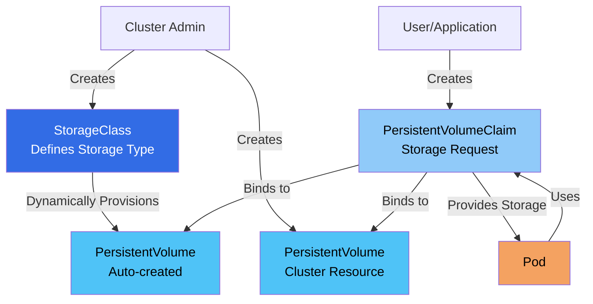

---

### StorageClass

**StorageClass** provides a way to describe different classes of storage. It enables dynamic provisioning of PersistentVolumes.

#### What is a StorageClass?

A StorageClass:
- **Defines storage types** - Different classes of storage (fast, slow, SSD, HDD)
- **Enables dynamic provisioning** - Automatically creates PVs when PVCs are created
- **Provides parameters** - Storage-specific configuration
- **Abstracts storage backends** - Works with various storage systems

**Key Characteristics:**
- **Dynamic Provisioning:** Automatically creates PVs
- **Storage Abstraction:** Works with different storage backends
- **Parameters:** Storage-specific configuration
- **Default Class:** Can be marked as default

#### StorageClass Diagram

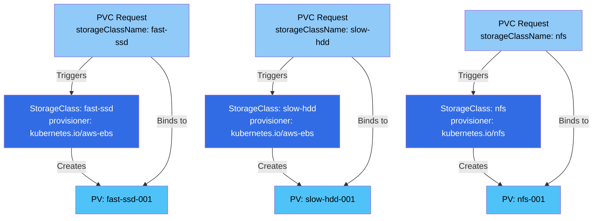

#### StorageClass Structure

```yaml
apiVersion: storage.k8s.io/v1
kind: StorageClass
metadata:
  name: fast-ssd
provisioner: kubernetes.io/aws-ebs    # Provisioner plugin
parameters:
  type: gp3
  iops: "3000"
  encrypted: "true"
volumeBindingMode: Immediate         # Immediate or WaitForFirstConsumer
allowVolumeExpansion: true           # Allow volume expansion
reclaimPolicy: Delete                # Delete or Retain
```

#### StorageClass Fields Explained

**apiVersion:**
- API version for StorageClass
- Required: `storage.k8s.io/v1`

**kind:**
- Object type
- Required: `StorageClass`

**metadata:**
- Object metadata
- **name:** StorageClass name (required)
- **annotations:** Additional metadata
  - `storageclass.kubernetes.io/is-default-class: "true"` - Mark as default

**provisioner:**
- Provisioner plugin name (required)
- Examples:
  - `kubernetes.io/aws-ebs` - AWS EBS
  - `kubernetes.io/gce-pd` - Google Cloud Persistent Disk
  - `kubernetes.io/azure-disk` - Azure Disk
  - `kubernetes.io/cinder` - OpenStack Cinder
  - `kubernetes.io/nfs` - NFS

**parameters:**
- Storage-specific parameters
- Varies by provisioner
- Examples: type, iops, encrypted, zone

**volumeBindingMode:**
- **Immediate:** Bind immediately when PVC is created
- **WaitForFirstConsumer:** Wait until pod uses PVC

**allowVolumeExpansion:**
- Allow volume expansion (default: false)
- PVC can request more storage

**reclaimPolicy:**
- **Delete:** Delete PV when PVC is deleted (default for dynamic)
- **Retain:** Keep PV when PVC is deleted

#### Creating StorageClass

```yaml
apiVersion: storage.k8s.io/v1
kind: StorageClass
metadata:
  name: fast-ssd
  annotations:
    storageclass.kubernetes.io/is-default-class: "true"
provisioner: kubernetes.io/aws-ebs
parameters:
  type: gp3
  iops: "3000"
volumeBindingMode: Immediate
allowVolumeExpansion: true
reclaimPolicy: Delete
```

```bash
kubectl apply -f storageclass.yaml
```

#### Managing StorageClass

```bash
# List StorageClasses
kubectl get storageclass
kubectl get sc

# Get StorageClass details
kubectl get sc <storageclass-name>

# Describe StorageClass
kubectl describe sc <storageclass-name>

# Set default StorageClass
kubectl patch storageclass <name> -p '{"metadata":{"annotations":{"storageclass.kubernetes.io/is-default-class":"true"}}}'

# Delete StorageClass
kubectl delete sc <storageclass-name>
```

#### Common StorageClass Examples

**AWS EBS:**
```yaml
apiVersion: storage.k8s.io/v1
kind: StorageClass
metadata:
  name: aws-gp3
provisioner: kubernetes.io/aws-ebs
parameters:
  type: gp3
  iops: "3000"
  encrypted: "true"
```

**Google Cloud:**
```yaml
apiVersion: storage.k8s.io/v1
kind: StorageClass
metadata:
  name: gce-ssd
provisioner: kubernetes.io/gce-pd
parameters:
  type: pd-ssd
  replication-type: regional-pd
```

**Azure:**
```yaml
apiVersion: storage.k8s.io/v1
kind: StorageClass
metadata:
  name: azure-premium
provisioner: kubernetes.io/azure-disk
parameters:
  storageaccounttype: Premium_LRS
```

#### Key Takeaways

1. **StorageClass enables dynamic provisioning** - Automatically creates PVs
2. **Defines storage types** - Different classes for different needs
3. **Provisioner-specific** - Each cloud provider has its own provisioner
4. **Can be default** - Mark one as default for automatic selection
5. **Volume binding modes** - Immediate or WaitForFirstConsumer

---

### PersistentVolume (PV)

**PersistentVolume (PV)** is a cluster-wide storage resource provisioned by an administrator or dynamically by a StorageClass.

#### What is a PersistentVolume?

A PersistentVolume:
- **Cluster resource** - Available to all namespaces
- **Storage abstraction** - Works with various storage backends
- **Lifecycle independent** - Exists independently of Pods
- **Bound to PVC** - Claimed by PersistentVolumeClaim

**Key Characteristics:**
- **Cluster-scoped** - Not namespaced
- **Static or Dynamic** - Created manually or automatically
- **Storage backend** - Can use various storage types
- **Reclaim policy** - What happens when released

#### PersistentVolume Diagram

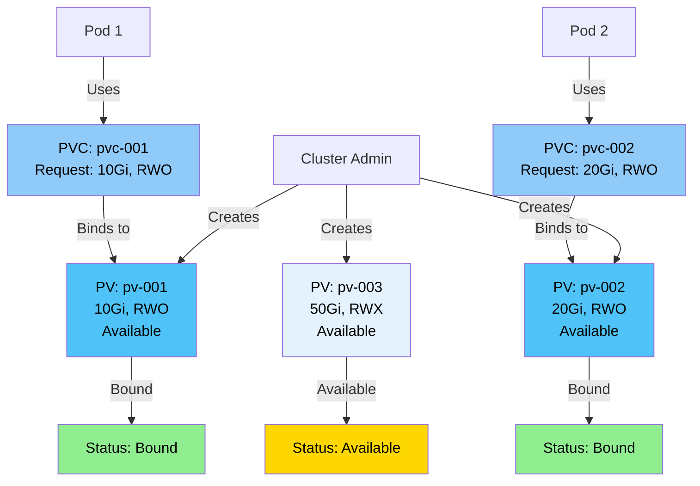

#### PersistentVolume Structure

```yaml
apiVersion: v1
kind: PersistentVolume
metadata:
  name: local-pv
  labels:
    app: local
spec:
  capacity:
    storage: 1Gi
  accessModes:
    - ReadWriteOnce
  persistentVolumeReclaimPolicy: Retain
  storageClassName: local-storage
  hostPath:
    path: /mnt/data
```

#### PersistentVolume Spec Fields Explained

**apiVersion:**
- API version for PersistentVolume
- Required: `v1`

**kind:**
- Object type
- Required: `PersistentVolume`

**metadata:**
- Object metadata
- **name:** PV name (required)
- **labels:** Key-value pairs for selection
- **annotations:** Additional metadata

**spec:**
- PersistentVolume specification
- **capacity:** Storage capacity
  - **storage:** Amount of storage (e.g., "10Gi", "100Mi")
- **accessModes:** How volume can be mounted
  - **ReadWriteOnce (RWO):** Single node read-write
  - **ReadOnlyMany (ROX):** Multiple nodes read-only
  - **ReadWriteMany (RWX):** Multiple nodes read-write
  - **ReadWriteOncePod (RWOP):** Single pod read-write
- **persistentVolumeReclaimPolicy:** What happens when released
  - **Retain:** Keep volume and data (manual cleanup)
  - **Recycle:** Delete data (deprecated)
  - **Delete:** Delete volume (for dynamic provisioning)
- **storageClassName:** StorageClass name (optional)
- **volumeMode:** Volume mode
  - **Filesystem:** Mount as filesystem (default)
  - **Block:** Use as raw block device
- **volume source:** Storage backend (one of):
  - **hostPath:** Local directory
  - **nfs:** NFS share
  - **awsElasticBlockStore:** AWS EBS
  - **gcePersistentDisk:** Google Cloud PD
  - **azureDisk:** Azure Disk
  - **cinder:** OpenStack Cinder
  - **local:** Local storage

#### PV States

**Available:**
- PV is available but not bound to any PVC

**Bound:**
- PV is bound to a PVC

**Released:**
- PVC is deleted but PV is not yet reclaimed

**Failed:**
- PV has failed its automatic reclamation

#### Creating PersistentVolume

**Method 1: Using YAML (Static Provisioning)**

```yaml
apiVersion: v1
kind: PersistentVolume
metadata:
  name: local-pv
  labels:
    app: local
spec:
  capacity:
    storage: 1Gi
  accessModes:
    - ReadWriteOnce
  persistentVolumeReclaimPolicy: Retain
  storageClassName: local-storage
  hostPath:
    path: /mnt/data
```

```bash
kubectl apply -f pv.yaml
```

**Method 2: Dynamic Provisioning**

PVs are automatically created by StorageClass when PVC is created.

#### Managing PersistentVolume

```bash
# List PersistentVolumes
kubectl get persistentvolumes
kubectl get pv

# Get PV details
kubectl get pv <pv-name>

# Describe PV
kubectl describe pv <pv-name>

# Delete PV
kubectl delete pv <pv-name>
```

#### Example Reference

For a practical example of a PersistentVolume YAML file, check out:

- **[nginx/persistentVolume.yml](./nginx/persistentVolume.yml)** - Example PersistentVolume definition

This example demonstrates:
- PV structure with capacity and access modes
- HostPath volume source (local storage)
- StorageClass assignment
- Reclaim policy configuration
- Basic PV pattern for local storage

**To use this example:**
```bash
# Apply the PersistentVolume
kubectl apply -f nginx/persistentVolume.yml

# View the PV
kubectl get pv -n nginx

# Check PV status
kubectl describe pv local-pv -n nginx

# View PV details
kubectl get pv local-pv -n nginx -o yaml
```

#### Key Takeaways

1. **PV is cluster-scoped** - Available to all namespaces
2. **Static or dynamic** - Created manually or by StorageClass
3. **Access modes** - Define how volume can be mounted
4. **Reclaim policy** - What happens when released
5. **Storage backend** - Various volume sources supported

---

### PersistentVolumeClaim (PVC)

**PersistentVolumeClaim (PVC)** is a request for storage by a user. It's like a "pod" for storage - it consumes PV resources.

#### What is a PersistentVolumeClaim?

A PersistentVolumeClaim:
- **Requests storage** - User requests storage with specific requirements
- **Binds to PV** - Automatically binds to matching PV
- **Namespaced** - Belongs to a namespace
- **Used by Pods** - Pods reference PVCs in volume mounts

**Key Characteristics:**
- **Namespaced resource** - Belongs to a namespace
- **Storage request** - Specifies size and access mode
- **Automatic binding** - Binds to matching PV
- **Dynamic provisioning** - Can trigger PV creation via StorageClass

#### PersistentVolumeClaim Diagram

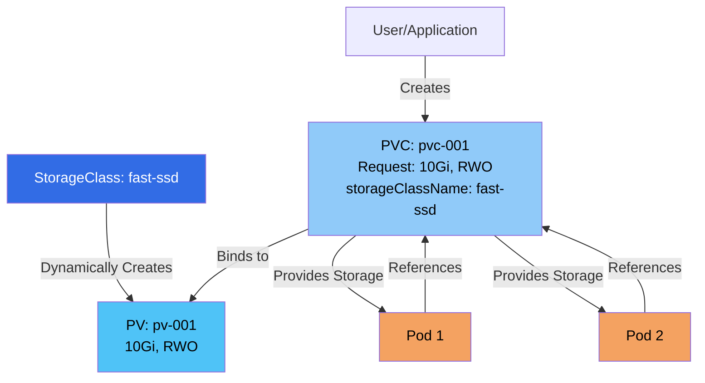

#### PersistentVolumeClaim Structure

```yaml
apiVersion: v1
kind: PersistentVolumeClaim
metadata:
  name: local-pvc
  namespace: nginx
spec:
  accessModes:
    - ReadWriteOnce
  resources:
    requests:
      storage: 1Gi
  storageClassName: local-storage
```

#### PersistentVolumeClaim Spec Fields Explained

**apiVersion:**
- API version for PersistentVolumeClaim
- Required: `v1`

**kind:**
- Object type
- Required: `PersistentVolumeClaim`

**metadata:**
- Object metadata
- **name:** PVC name (required)
- **namespace:** Namespace (required)
- **labels:** Key-value pairs for organization
- **annotations:** Additional metadata

**spec:**
- PersistentVolumeClaim specification
- **accessModes:** How volume can be mounted (required)
  - **ReadWriteOnce (RWO):** Single node read-write
  - **ReadOnlyMany (ROX):** Multiple nodes read-only
  - **ReadWriteMany (RWX):** Multiple nodes read-write
  - **ReadWriteOncePod (RWOP):** Single pod read-write
- **resources:** Resource requests (required)
  - **requests:** Minimum resources required
    - **storage:** Amount of storage (e.g., "10Gi", "100Mi")
- **storageClassName:** StorageClass name (optional)
  - If specified, uses that StorageClass
  - If empty, uses default StorageClass
  - If `""`, uses static provisioning only
- **selector:** Label selector for PV binding (optional)
  - **matchLabels:** Match PV labels
  - **matchExpressions:** Match expressions
- **volumeName:** Specific PV name to bind to (optional)
- **volumeMode:** Volume mode (optional)
  - **Filesystem:** Mount as filesystem (default)
  - **Block:** Use as raw block device

#### PVC States

**Pending:**
- PVC is waiting for a PV to bind to

**Bound:**
- PVC is bound to a PV

**Lost:**
- PV that PVC was bound to no longer exists

#### Creating PersistentVolumeClaim

**Method 1: Using YAML**

```yaml
apiVersion: v1
kind: PersistentVolumeClaim
metadata:
  name: local-pvc
  namespace: nginx
spec:
  accessModes:
    - ReadWriteOnce
  resources:
    requests:
      storage: 1Gi
  storageClassName: local-storage
```

```bash
kubectl apply -f pvc.yaml
```

**Method 2: Using kubectl**

```bash
# Create PVC imperatively
kubectl create pvc my-pvc --storageclass=fast-ssd --size=10Gi --access-mode=ReadWriteOnce
```

#### Managing PersistentVolumeClaim

```bash
# List PVCs
kubectl get persistentvolumeclaims
kubectl get pvc

# List PVCs in namespace
kubectl get pvc -n <namespace>

# Get PVC details
kubectl get pvc <pvc-name>

# Describe PVC
kubectl describe pvc <pvc-name>

# Delete PVC
kubectl delete pvc <pvc-name>
```

#### Using PVC in Pods

```yaml
apiVersion: v1
kind: Pod
metadata:
  name: my-pod
spec:
  containers:
  - name: app
    image: nginx:latest
    volumeMounts:
    - name: data
      mountPath: /data
  volumes:
  - name: data
    persistentVolumeClaim:
      claimName: local-pvc
```

#### Example Reference

For a practical example of a PersistentVolumeClaim YAML file, check out:

- **[nginx/persistentVolumeClaim.yml](./nginx/persistentVolumeClaim.yml)** - Example PersistentVolumeClaim definition

This example demonstrates:
- PVC structure with access modes
- Storage resource request
- StorageClass assignment
- Basic PVC pattern for storage request

**To use this example:**
```bash
# Apply the PersistentVolumeClaim
kubectl apply -f nginx/persistentVolumeClaim.yml

# View the PVC
kubectl get pvc -n nginx

# Check PVC status
kubectl describe pvc local-pvc -n nginx

# View PVC details
kubectl get pvc local-pvc -n nginx -o yaml

# Check if PVC is bound
kubectl get pvc local-pvc -n nginx
```

#### Key Takeaways

1. **PVC is namespaced** - Belongs to a namespace
2. **Requests storage** - Specifies size and access mode
3. **Binds to PV** - Automatically binds to matching PV
4. **Dynamic provisioning** - Can trigger PV creation via StorageClass
5. **Used by Pods** - Pods reference PVCs in volume mounts

---

### Storage Workflow

**Static Provisioning:**
1. Admin creates PV
2. User creates PVC
3. PVC binds to PV
4. Pod uses PVC

**Dynamic Provisioning:**
1. Admin creates StorageClass
2. User creates PVC (with storageClassName)
3. StorageClass creates PV automatically
4. PVC binds to PV
5. Pod uses PVC

### Storage Best Practices

1. **Use StorageClass** - Prefer dynamic provisioning
2. **Set appropriate access modes** - Based on use case
3. **Set reclaim policy** - Retain for important data
4. **Use labels** - For PV selection
5. **Monitor storage** - Check PV/PVC status
6. **Clean up** - Delete unused PVCs and PVs

---

## Services

**Services** provide a stable network endpoint to access Pods. They abstract away the dynamic nature of Pods and provide a consistent way to communicate with applications running in Kubernetes.

### What is a Service?

Think of a Service as a **stable front door** to your application. Here's why we need Services:

**The Problem:**
- Pods are **ephemeral** - They can be created, destroyed, or moved
- Pods get **new IP addresses** each time they're created
- How do you connect to an application when its IP keeps changing?

**The Solution:**
- Service provides a **stable IP address** and DNS name
- Service **load balances** traffic to multiple Pods
- Service **abstracts** the underlying Pods
- Other applications connect to the Service, not directly to Pods

**Simple Analogy:**
Imagine a restaurant:
- **Pods** = Individual waiters (they come and go)
- **Service** = The host/hostess desk (always there, directs you to available waiters)
- You don't need to know which waiter will serve you - you just go to the desk!

### Why Do We Need Services?

**1. Pod IPs are Dynamic**
```
Pod 1: 10.244.1.5  → Gets deleted
Pod 2: 10.244.1.6  → Gets new IP: 10.244.1.10
Pod 3: 10.244.1.7  → Gets new IP: 10.244.1.11
```
Without Service: Application breaks when Pod IPs change
With Service: Service IP stays the same, routes to new Pod IPs

**2. Load Balancing**
- Multiple Pods running the same application
- Service distributes traffic across all Pods
- Automatic load balancing

**3. Service Discovery**
- Services get DNS names
- Other Pods can find services by name
- No need to hardcode IP addresses

### Service Diagram

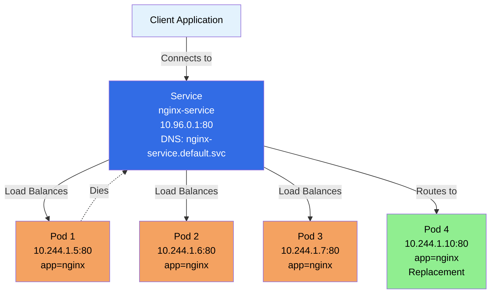

### Service Types

Kubernetes provides different Service types for different use cases:

**1. ClusterIP (Default)**
- **Internal only** - Accessible only within the cluster
- **Stable IP** - Gets a cluster-internal IP
- **Use case:** Communication between Pods in the cluster

**2. NodePort**
- **External access** - Accessible from outside the cluster
- **Opens port** - Opens a port on each node
- **Use case:** Development, testing, simple external access

**3. LoadBalancer**
- **Cloud provider** - Creates external load balancer
- **Public IP** - Gets a public IP address
- **Use case:** Production applications with cloud providers

**4. ExternalName**
- **External service** - Maps to external DNS name
- **No proxy** - Returns CNAME record
- **Use case:** Accessing external services

### Service Structure

```yaml
apiVersion: v1
kind: Service
metadata:
  name: nginx-service
  namespace: nginx
spec:
  selector:
    app: nginx
  ports:
    - protocol: TCP
      port: 80
      targetPort: 80
  type: ClusterIP
```

### Service Spec Fields Explained

**apiVersion:**
- API version for Service
- Required: `v1`

**kind:**
- Object type
- Required: `Service`

**metadata:**
- Object metadata
- **name:** Service name (required) - Used for DNS
- **namespace:** Namespace (optional, defaults to default)
- **labels:** Key-value pairs for organization
- **annotations:** Additional metadata

**spec:**
- Service specification
- **selector:** Label selector to find Pods (required)
  - **matchLabels:** Key-value pairs matching Pod labels
  - Service routes traffic to Pods with matching labels
- **ports:** Port configuration (required)
  - **port:** Port exposed by Service
  - **targetPort:** Port on Pods (defaults to port if not specified)
  - **protocol:** TCP (default), UDP, or SCTP
  - **name:** Port name (optional, for named ports)
- **type:** Service type (optional, default: ClusterIP)
  - **ClusterIP:** Internal cluster IP
  - **NodePort:** Exposes on node IPs
  - **LoadBalancer:** Creates external load balancer
  - **ExternalName:** Maps to external DNS
- **clusterIP:** Specific cluster IP (optional, auto-assigned if not specified)
- **sessionAffinity:** Session affinity (optional)
  - **None:** No session affinity (default)
  - **ClientIP:** Route same client to same Pod

### Service Types Explained

#### 1. ClusterIP Service

**What it is:**
- Default Service type
- Internal cluster IP address
- Accessible only within the cluster

**Use Case:**
- Communication between Pods
- Internal services
- Database connections

**Example:**
```yaml
apiVersion: v1
kind: Service
metadata:
  name: nginx-service
spec:
  type: ClusterIP  # Default, can be omitted
  selector:
    app: nginx
  ports:
    - port: 80
      targetPort: 80
```

**Access:**
- From within cluster: `http://nginx-service:80`
- DNS: `nginx-service.default.svc.cluster.local`

#### 2. NodePort Service

**What it is:**
- Opens a port on each node
- Accessible from outside cluster via `<NodeIP>:<NodePort>`
- Also accessible via ClusterIP

**Use Case:**
- Development and testing
- Simple external access
- When LoadBalancer is not available

**Example:**
```yaml
apiVersion: v1
kind: Service
metadata:
  name: nginx-service
spec:
  type: NodePort
  selector:
    app: nginx
  ports:
    - port: 80
      targetPort: 80
      nodePort: 30080  # Optional, auto-assigned if not specified (30000-32767)
```

**Access:**
- From outside: `http://<NodeIP>:30080`
- From inside: `http://nginx-service:80`

#### 3. LoadBalancer Service

**What it is:**
- Creates external load balancer (cloud provider)
- Gets a public IP address
- Automatically includes NodePort and ClusterIP

**Use Case:**
- Production applications
- Public-facing services
- Cloud environments (AWS, GCP, Azure)

**Example:**
```yaml
apiVersion: v1
kind: Service
metadata:
  name: nginx-service
spec:
  type: LoadBalancer
  selector:
    app: nginx
  ports:
    - port: 80
      targetPort: 80
```

**Access:**
- Public IP provided by cloud provider
- Automatically routes to Pods

#### 4. ExternalName Service

**What it is:**
- Maps Service to external DNS name
- Returns CNAME record
- No proxy, no load balancing

**Use Case:**
- Accessing external services
- Migrating to Kubernetes
- Service abstraction

**Example:**
```yaml
apiVersion: v1
kind: Service
metadata:
  name: external-db
spec:
  type: ExternalName
  externalName: database.example.com
```

**Access:**
- DNS resolves to external name
- No proxy involved

### Service Discovery

**DNS Names:**
- Services get DNS names automatically
- Format: `<service-name>.<namespace>.svc.cluster.local`
- Short form: `<service-name>` (same namespace)
- Short form: `<service-name>.<namespace>` (different namespace)

**Examples:**
```bash
# Same namespace
http://nginx-service:80

# Different namespace
http://nginx-service.nginx:80

# Full DNS name
http://nginx-service.nginx.svc.cluster.local:80
```

### Creating Services

**Method 1: Using YAML (Recommended)**

```yaml
apiVersion: v1
kind: Service
metadata:
  name: nginx-service
  namespace: nginx
spec:
  selector:
    app: nginx
  ports:
    - protocol: TCP
      port: 80
      targetPort: 80
  type: ClusterIP
```

```bash
kubectl apply -f service.yaml
```

**Method 2: Using kubectl**

```bash
# Create Service from Deployment
kubectl expose deployment nginx-deployment --port=80 --target-port=80

# Create Service with specific type
kubectl expose deployment nginx-deployment --type=NodePort --port=80

# Create Service with LoadBalancer
kubectl expose deployment nginx-deployment --type=LoadBalancer --port=80
```

### Managing Services

```bash
# List Services
kubectl get services
kubectl get svc

# List Services in namespace
kubectl get svc -n <namespace>

# Get Service details
kubectl get svc <service-name>

# Describe Service
kubectl describe svc <service-name>

# Get Service endpoints
kubectl get endpoints <service-name>

# Delete Service
kubectl delete svc <service-name>
```

### Service Endpoints

**Endpoints:**
- Service automatically creates Endpoints object
- Contains list of Pod IPs matching selector
- Updated automatically when Pods change

```bash
# View endpoints
kubectl get endpoints <service-name>

# Output shows:
# NAME            ENDPOINTS
# nginx-service   10.244.1.5:80,10.244.1.6:80,10.244.1.7:80
```

### Service Load Balancing

**How it Works:**
1. Service receives request
2. kube-proxy routes to one of the Pods
3. Uses round-robin by default
4. Can use session affinity for sticky sessions

**Load Balancing Methods:**
- **Round-robin (default):** Distributes evenly
- **Session affinity:** Same client to same Pod

### Service Best Practices

1. **Use meaningful names** - Service names become DNS names
2. **Match selector labels** - Ensure selector matches Pod labels
3. **Use ClusterIP for internal** - Default for internal communication
4. **Use LoadBalancer for external** - For public-facing services
5. **Set targetPort correctly** - Match container port
6. **Use named ports** - For flexibility
7. **Monitor endpoints** - Check if Pods are healthy

### Common Service Patterns

**Pattern 1: Basic Service**
```yaml
apiVersion: v1
kind: Service
metadata:
  name: web-service
spec:
  selector:
    app: web
  ports:
    - port: 80
      targetPort: 8080
```

**Pattern 2: Multiple Ports**
```yaml
apiVersion: v1
kind: Service
metadata:
  name: app-service
spec:
  selector:
    app: myapp
  ports:
    - name: http
      port: 80
      targetPort: 8080
    - name: https
      port: 443
      targetPort: 8443
```

**Pattern 3: Headless Service**
```yaml
apiVersion: v1
kind: Service
metadata:
  name: headless-service
spec:
  clusterIP: None  # Headless service
  selector:
    app: stateful
  ports:
    - port: 80
```

### Example Reference

For a practical example of a Service YAML file, check out:

- **[nginx/service.yml](./nginx/service.yml)** - Example Service definition

This example demonstrates:
- Service structure with selector
- Port configuration (port and targetPort)
- ClusterIP service type (default)
- Basic Service pattern for nginx

**To use this example:**
```bash
# Apply the Service
kubectl apply -f nginx/service.yml

# View the Service
kubectl get svc -n nginx

# Check Service details
kubectl describe svc nginx-service -n nginx

# View Service endpoints (Pods it routes to)
kubectl get endpoints nginx-service -n nginx

# Test Service from within cluster
kubectl run test-pod --image=busybox -it --rm --restart=Never -n nginx -- wget -qO- http://nginx-service:80

# Get Service cluster IP
kubectl get svc nginx-service -n nginx -o jsonpath='{.spec.clusterIP}'
```

### Key Takeaways

1. **Services provide stable endpoints** - Stable IP and DNS name
2. **Load balancing** - Distributes traffic across Pods
3. **Service discovery** - DNS names for easy access
4. **Different types** - ClusterIP, NodePort, LoadBalancer, ExternalName
5. **Selector-based** - Routes to Pods matching labels
6. **Automatic updates** - Endpoints update when Pods change
7. **Internal by default** - ClusterIP for internal communication
8. **Essential for Pod communication** - Pods communicate via Services

Services are essential for networking in Kubernetes. They provide the stable, reliable way to access your applications regardless of Pod changes.

---

## Ingress

**Ingress** is an API object that manages external HTTP and HTTPS access to Services in a cluster. It provides HTTP/HTTPS routing, SSL/TLS termination, and name-based virtual hosting.

### What is Ingress?

**Simple Explanation:**
Ingress is like a **smart traffic director** at the entrance of your cluster. It:
- **Routes traffic** based on URL paths and hostnames
- **Terminates SSL/TLS** - Handles HTTPS certificates
- **Provides a single entry point** - One IP for multiple services
- **Works with Services** - Routes to ClusterIP Services

**Analogy:**
Think of Ingress as a **receptionist** in a building:
- **Services** = Individual offices (ClusterIP services are internal)
- **Ingress** = Receptionist who directs visitors to the right office based on who they're looking for
- **Ingress Controller** = The actual person/system doing the directing

### Why Do We Need Ingress?

**The Problem with Services:**
- **LoadBalancer:** Creates one load balancer per service (expensive)
- **NodePort:** Requires managing ports and firewall rules
- **No path-based routing:** Can't route based on URL paths
- **No SSL termination:** Each service needs to handle SSL
- **No name-based routing:** Can't route based on domain names

**The Solution - Ingress:**
- **Single entry point** - One load balancer for multiple services
- **Path-based routing** - Route `/api` to one service, `/web` to another
- **Host-based routing** - Route `api.example.com` to one service, `web.example.com` to another
- **SSL/TLS termination** - Handle certificates at Ingress level
- **Cost-effective** - One load balancer instead of many

### Ingress vs Services

| Feature | Service | Ingress |
|---------|---------|---------|
| **Layer** | L4 (TCP/UDP) | L7 (HTTP/HTTPS) |
| **Routing** | IP/Port based | Path/Host based |
| **SSL/TLS** | No termination | SSL/TLS termination |
| **External Access** | NodePort/LoadBalancer | HTTP/HTTPS routing |
| **Cost** | One LB per service | One LB for all |
| **Use Case** | Internal/external access | HTTP/HTTPS routing |

### Ingress Architecture Diagram

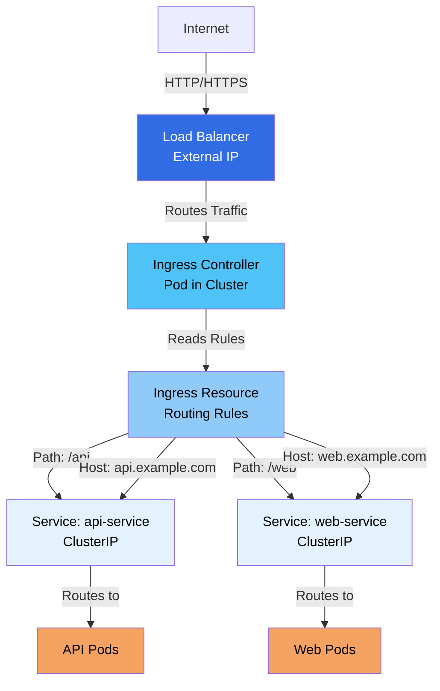

### Ingress Controller

**What is an Ingress Controller?**

An Ingress Controller is the **actual implementation** that processes Ingress rules. It's a Pod that:
- **Watches Ingress resources** - Monitors for Ingress changes
- **Implements routing rules** - Processes routing logic
- **Handles SSL/TLS** - Terminates SSL connections
- **Manages load balancer** - Configures external load balancer

**Popular Ingress Controllers:**
- **NGINX Ingress Controller** - Most popular
- **Traefik** - Modern, feature-rich
- **HAProxy** - High performance
- **Istio Gateway** - Service mesh integration
- **AWS ALB Ingress Controller** - AWS-specific
- **GKE Ingress** - Google Cloud

**Important:**
- Ingress Controller must be **installed separately**
- Kubernetes doesn't provide a default Ingress Controller
- You need to deploy one before using Ingress

### Ingress Structure

```yaml
apiVersion: networking.k8s.io/v1
kind: Ingress
metadata:
  name: example-ingress
  namespace: default
  annotations:
    nginx.ingress.kubernetes.io/rewrite-target: /
spec:
  ingressClassName: nginx
  rules:
  - host: api.example.com
    http:
      paths:
      - path: /api
        pathType: Prefix
        backend:
          service:
            name: api-service
            port:
              number: 80
  - host: web.example.com
    http:
      paths:
      - path: /
        pathType: Prefix
        backend:
          service:
            name: web-service
            port:
              number: 80
  tls:
  - hosts:
    - api.example.com
    - web.example.com
    secretName: tls-secret
```

### Ingress Spec Fields Explained

**apiVersion:**
- API version for Ingress
- Required: `networking.k8s.io/v1` (v1.19+)
- Older: `networking.k8s.io/v1beta1` (deprecated)

**kind:**
- Object type
- Required: `Ingress`

**metadata:**
- Object metadata
- **name:** Ingress name (required)
- **namespace:** Namespace (optional, defaults to default)
- **labels:** Key-value pairs for organization
- **annotations:** Ingress Controller-specific settings
  - Controller-specific annotations for configuration

**spec:**
- Ingress specification
- **ingressClassName:** Ingress class name (v1.19+)
  - Specifies which Ingress Controller to use
  - Alternative to `kubernetes.io/ingress.class` annotation
- **rules:** List of routing rules (required)
  - **host:** Hostname (optional, matches all if not specified)
  - **http:** HTTP rules
    - **paths:** List of path rules
      - **path:** URL path (e.g., `/api`, `/web`)
      - **pathType:** Path matching type
        - **Exact:** Exact match
        - **Prefix:** Prefix match (most common)
        - **ImplementationSpecific:** Controller-specific
      - **backend:** Backend service
        - **service:** Service backend
          - **name:** Service name
          - **port:** Service port
            - **number:** Port number
            - **name:** Named port
- **tls:** TLS configuration (optional)
  - **hosts:** List of hostnames
  - **secretName:** Secret containing TLS certificate

### Ingress Routing Types

#### 1. Host-Based Routing

Routes traffic based on the **hostname** (domain name).

**Example:**
```yaml
apiVersion: networking.k8s.io/v1
kind: Ingress
metadata:
  name: host-based-ingress
spec:
  ingressClassName: nginx
  rules:
  - host: api.example.com
    http:
      paths:
      - path: /
        pathType: Prefix
        backend:
          service:
            name: api-service
            port:
              number: 80
  - host: web.example.com
    http:
      paths:
      - path: /
        pathType: Prefix
        backend:
          service:
            name: web-service
            port:
              number: 80
```

**How it works:**
- `api.example.com` → routes to `api-service`
- `web.example.com` → routes to `web-service`

#### 2. Path-Based Routing

Routes traffic based on the **URL path**.

**Example:**
```yaml
apiVersion: networking.k8s.io/v1
kind: Ingress
metadata:
  name: path-based-ingress
spec:
  ingressClassName: nginx
  rules:
  - http:
      paths:
      - path: /api
        pathType: Prefix
        backend:
          service:
            name: api-service
            port:
              number: 80
      - path: /web
        pathType: Prefix
        backend:
          service:
            name: web-service
            port:
              number: 80
      - path: /
        pathType: Prefix
        backend:
          service:
            name: default-service
            port:
              number: 80
```

**How it works:**
- `/api/*` → routes to `api-service`
- `/web/*` → routes to `web-service`
- `/*` → routes to `default-service`

**Important:** Order matters! More specific paths should come first.

#### 3. Combined Host and Path Routing

Combines both hostname and path for routing.

**Example:**
```yaml
apiVersion: networking.k8s.io/v1
kind: Ingress
metadata:
  name: combined-ingress
spec:
  ingressClassName: nginx
  rules:
  - host: example.com
    http:
      paths:
      - path: /api
        pathType: Prefix
        backend:
          service:
            name: api-service
            port:
              number: 80
      - path: /web
        pathType: Prefix
        backend:
          service:
            name: web-service
            port:
              number: 80
```

### Path Types Explained

**1. Exact:**
- Exact match of the path
- `/api` matches only `/api`, not `/api/v1`

**2. Prefix:**
- Matches path prefix
- `/api` matches `/api`, `/api/v1`, `/api/users`
- Most commonly used

**3. ImplementationSpecific:**
- Controller-specific matching
- Behavior depends on Ingress Controller

### Ingress Routing Diagram

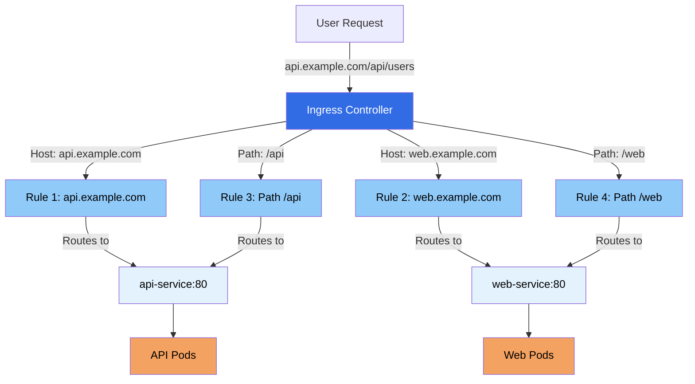

### TLS/SSL Termination

Ingress can handle SSL/TLS termination, so your Services don't need to.

**How it works:**
1. Client connects via HTTPS
2. Ingress Controller terminates SSL
3. Forwards HTTP to backend Service
4. Service receives plain HTTP

**Example:**
```yaml
apiVersion: networking.k8s.io/v1
kind: Ingress
metadata:
  name: tls-ingress
spec:
  ingressClassName: nginx
  tls:
  - hosts:
    - api.example.com
    - web.example.com
    secretName: tls-secret
  rules:
  - host: api.example.com
    http:
      paths:
      - path: /
        pathType: Prefix
        backend:
          service:
            name: api-service
            port:
              number: 80
```

**Creating TLS Secret:**
```bash
# Create TLS secret
kubectl create secret tls tls-secret \
  --cert=tls.crt \
  --key=tls.key
```

### Ingress Annotations

Ingress Controllers use annotations for additional configuration.

**NGINX Ingress Controller Annotations:**

```yaml
apiVersion: networking.k8s.io/v1
kind: Ingress
metadata:
  name: annotated-ingress
  annotations:
    # Rewrite target
    nginx.ingress.kubernetes.io/rewrite-target: /
    
    # SSL redirect
    nginx.ingress.kubernetes.io/ssl-redirect: "true"
    
    # Rate limiting
    nginx.ingress.kubernetes.io/limit-rps: "100"
    
    # CORS
    nginx.ingress.kubernetes.io/enable-cors: "true"
    
    # Authentication
    nginx.ingress.kubernetes.io/auth-type: basic
    nginx.ingress.kubernetes.io/auth-secret: basic-auth
    
    # Custom headers
    nginx.ingress.kubernetes.io/configuration-snippet: |
      more_set_headers "X-Custom-Header: value";
spec:
  ingressClassName: nginx
  rules:
  - http:
      paths:
      - path: /
        pathType: Prefix
        backend:
          service:
            name: web-service
            port:
              number: 80
```

### Ingress Class

**What is Ingress Class?**

Ingress Class allows you to have multiple Ingress Controllers in the same cluster.

**IngressClass Resource:**
```yaml
apiVersion: networking.k8s.io/v1
kind: IngressClass
metadata:
  name: nginx
spec:
  controller: k8s.io/ingress-nginx
```

**Using IngressClass:**
```yaml
apiVersion: networking.k8s.io/v1
kind: Ingress
metadata:
  name: example-ingress
spec:
  ingressClassName: nginx  # References IngressClass
  rules:
  - http:
      paths:
      - path: /
        pathType: Prefix
        backend:
          service:
            name: web-service
            port:
              number: 80
```

### Creating Ingress

**Method 1: Using YAML**

```yaml
apiVersion: networking.k8s.io/v1
kind: Ingress
metadata:
  name: example-ingress
spec:
  ingressClassName: nginx
  rules:
  - host: api.example.com
    http:
      paths:
      - path: /
        pathType: Prefix
        backend:
          service:
            name: api-service
            port:
              number: 80
```

```bash
kubectl apply -f ingress.yaml
```

**Method 2: Using kubectl**

```bash
# Create Ingress from Service
kubectl create ingress example-ingress \
  --class=nginx \
  --rule="api.example.com/*=api-service:80" \
  --rule="web.example.com/*=web-service:80"
```

### Managing Ingress

```bash
# List Ingresses
kubectl get ingress
kubectl get ing

# List Ingresses in namespace
kubectl get ing -n <namespace>

# Get Ingress details
kubectl get ing <ingress-name>

# Describe Ingress
kubectl describe ing <ingress-name>

# Get Ingress YAML
kubectl get ing <ingress-name> -o yaml

# Delete Ingress
kubectl delete ing <ingress-name>
```

### Installing Ingress Controller

**NGINX Ingress Controller (Example):**

```bash
# Using kubectl
kubectl apply -f https://raw.githubusercontent.com/kubernetes/ingress-nginx/controller-v1.8.1/deploy/static/provider/cloud/deploy.yaml

# Using Helm
helm repo add ingress-nginx https://kubernetes.github.io/ingress-nginx
helm install ingress-nginx ingress-nginx/ingress-nginx

# Check installation
kubectl get pods -n ingress-nginx
kubectl get svc -n ingress-nginx
```

### Ingress Controller Architecture

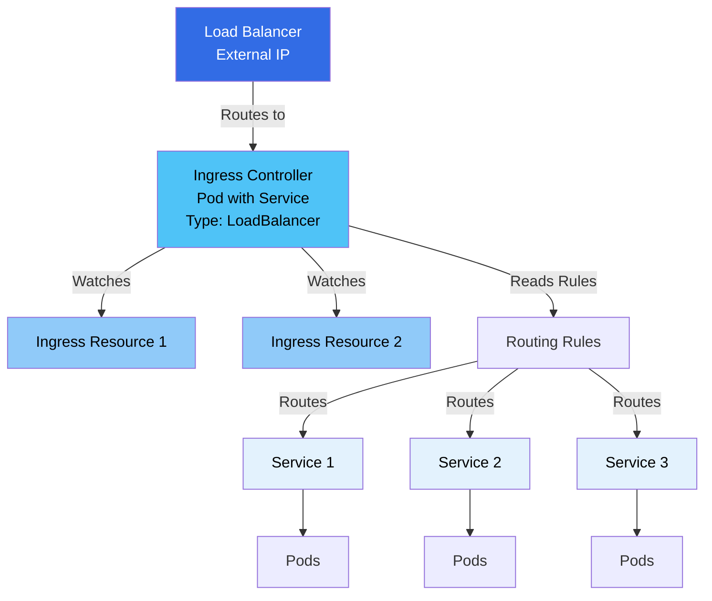

### Complete Ingress Example

```yaml
apiVersion: networking.k8s.io/v1
kind: Ingress
metadata:
  name: complete-ingress
  namespace: production
  annotations:
    nginx.ingress.kubernetes.io/rewrite-target: /
    nginx.ingress.kubernetes.io/ssl-redirect: "true"
    nginx.ingress.kubernetes.io/rate-limit: "100"
spec:
  ingressClassName: nginx
  rules:
  # Host-based routing
  - host: api.example.com
    http:
      paths:
      - path: /v1
        pathType: Prefix
        backend:
          service:
            name: api-v1-service
            port:
              number: 80
      - path: /v2
        pathType: Prefix
        backend:
          service:
            name: api-v2-service
            port:
              number: 80
  # Path-based routing
  - http:
      paths:
      - path: /web
        pathType: Prefix
        backend:
          service:
            name: web-service
            port:
              number: 80
      - path: /admin
        pathType: Prefix
        backend:
          service:
            name: admin-service
            port:
              number: 80
  # TLS configuration
  tls:
  - hosts:
    - api.example.com
    secretName: api-tls-secret
```

### Ingress Best Practices

1. **Install Ingress Controller first** - Required before using Ingress
2. **Use ingressClassName** - Specify which controller to use
3. **Order paths correctly** - More specific paths first
4. **Use pathType: Prefix** - Most common and flexible
5. **Handle TLS at Ingress** - Don't handle SSL in Services
6. **Use annotations wisely** - Controller-specific features
7. **Monitor Ingress Controller** - Check controller health
8. **Use meaningful names** - For better organization
9. **Test routing rules** - Verify paths work correctly
10. **Secure with TLS** - Use TLS for production

### Common Ingress Patterns

**Pattern 1: Simple Path Routing**
```yaml
apiVersion: networking.k8s.io/v1
kind: Ingress
metadata:
  name: simple-ingress
spec:
  ingressClassName: nginx
  rules:
  - http:
      paths:
      - path: /
        pathType: Prefix
        backend:
          service:
            name: web-service
            port:
              number: 80
```

**Pattern 2: Multiple Services**
```yaml
apiVersion: networking.k8s.io/v1
kind: Ingress
metadata:
  name: multi-service-ingress
spec:
  ingressClassName: nginx
  rules:
  - http:
      paths:
      - path: /api
        pathType: Prefix
        backend:
          service:
            name: api-service
            port:
              number: 80
      - path: /web
        pathType: Prefix
        backend:
          service:
            name: web-service
            port:
              number: 80
```

**Pattern 3: Host-Based with TLS**
```yaml
apiVersion: networking.k8s.io/v1
kind: Ingress
metadata:
  name: tls-host-ingress
spec:
  ingressClassName: nginx
  tls:
  - hosts:
    - api.example.com
    secretName: api-tls-secret
  rules:
  - host: api.example.com
    http:
      paths:
      - path: /
        pathType: Prefix
        backend:
          service:
            name: api-service
            port:
              number: 80
```

### Troubleshooting Ingress

**Common Issues:**

1. **Ingress not working:**
   ```bash
   # Check Ingress Controller
   kubectl get pods -n ingress-nginx
   
   # Check Ingress status
   kubectl describe ing <ingress-name>
   
   # Check Service
   kubectl get svc <service-name>
   ```

2. **404 errors:**
   - Check path matching
   - Verify pathType
   - Check Service name and port

3. **SSL errors:**
   - Verify TLS secret exists
   - Check certificate validity
   - Verify secret name matches

4. **Routing not working:**
   - Check Ingress Controller logs
   - Verify rules are correct
   - Check Service endpoints

### Example Reference

For a practical example of an Ingress YAML file, check out:

- **[nginx/ingress.yml](./nginx/ingress.yml)** - Example Ingress definition

This example demonstrates:
- Ingress structure with multiple path-based routing rules
- Path-based routing for different services (`/nginx` and `/`)
- NGINX Ingress Controller annotations (rewrite-target)
- Multiple backend services (nginx-service and notes-app-service)
- Different port configurations (80 and 8000)
- Path ordering (more specific path `/nginx` before default path `/`)

**To use this example:**
```bash
# Apply the Ingress
kubectl apply -f nginx/ingress.yml

# View the Ingress
kubectl get ingress -n nginx

# Check Ingress details
kubectl describe ingress nginx-notes-ingress -n nginx

# View Ingress YAML
kubectl get ingress nginx-notes-ingress -n nginx -o yaml

# Check Ingress status
kubectl get ingress nginx-notes-ingress -n nginx

# Test routing (if Ingress Controller is installed)
# /nginx path should route to nginx-service
# / path should route to notes-app-service
```

**Important Notes:**
- Ensure Ingress Controller is installed before applying
- Verify that `nginx-service` and `notes-app-service` exist in the nginx namespace
- The rewrite-target annotation rewrites the URL path
- Path order matters - `/nginx` must come before `/` to work correctly

### Key Takeaways

1. **Ingress provides HTTP/HTTPS routing** - Layer 7 routing
2. **Requires Ingress Controller** - Must be installed separately
3. **Path and host-based routing** - Flexible routing options
4. **SSL/TLS termination** - Handle certificates at Ingress
5. **Single entry point** - One load balancer for multiple services
6. **Works with Services** - Routes to ClusterIP Services
7. **Controller-specific** - Annotations vary by controller
8. **Cost-effective** - One LB instead of many
9. **Use ingressClassName** - Specify controller (v1.19+)
10. **Order matters** - More specific paths first

Ingress is essential for managing external HTTP/HTTPS access to your Kubernetes services. It provides a powerful, flexible way to route traffic based on paths and hostnames while handling SSL/TLS termination.
