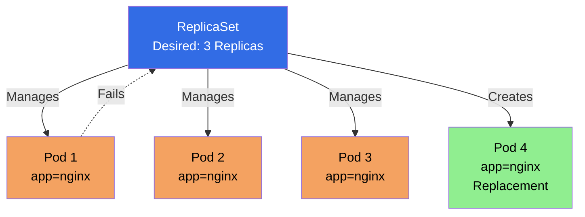
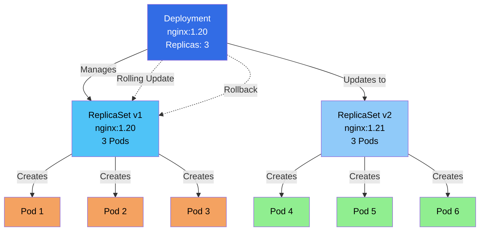
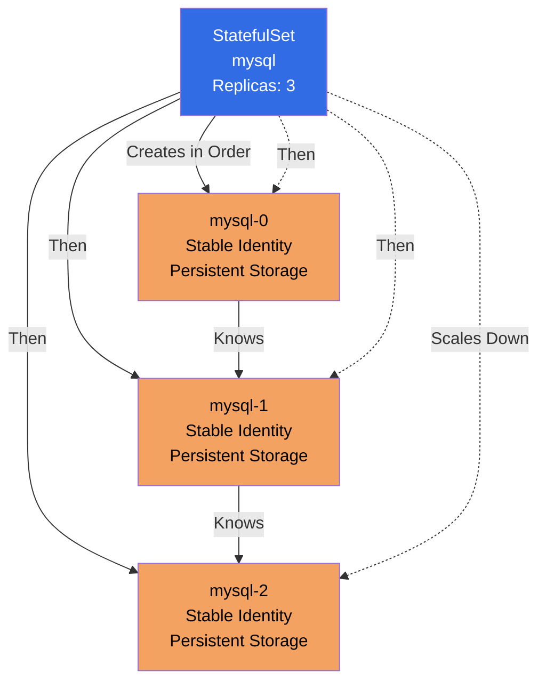
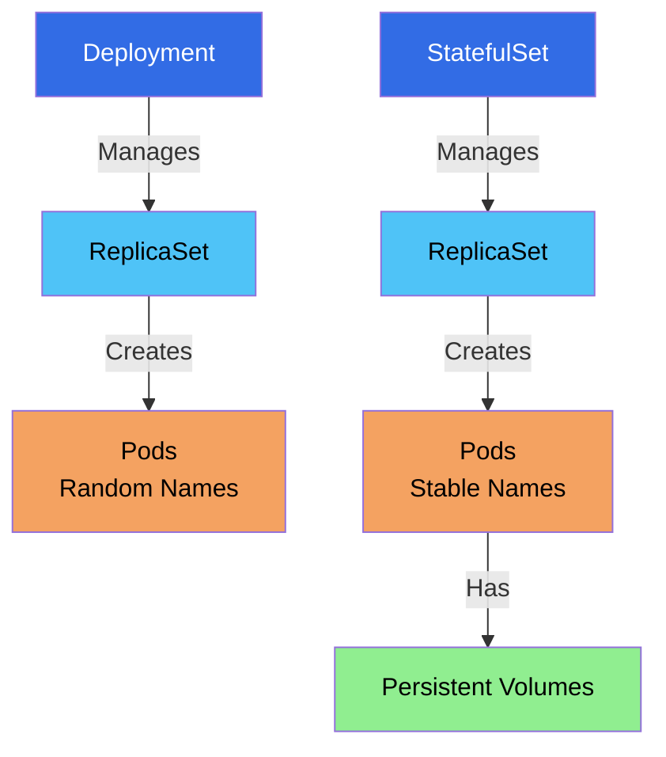
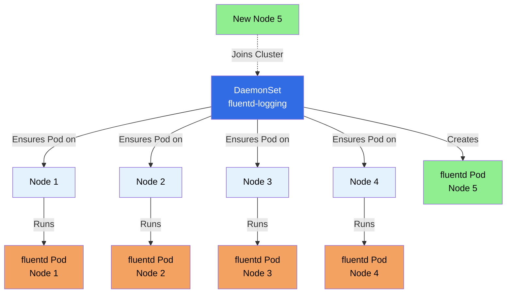

# Kubernetes Notes

## Table of Contents

1. [Introduction & Overview of Kubernetes Concepts](#introduction--overview-of-kubernetes-concepts)
2. [Kubernetes History](#kubernetes-history)
3. [Why Should We Learn Kubernetes?](#why-should-we-learn-kubernetes)
4. [Monolithic vs Microservices Architecture](#monolithic-vs-microservices-architecture)
5. [Kubernetes Architecture](#kubernetes-architecture)
6. [Kubernetes Setup](#kubernetes-setup)
7. [Kubernetes Concepts](#kubernetes-concepts)
   - [Kubernetes Objects and its Management](#kubernetes-objects-and-its-management)
   - [Field Selectors](#field-selectors)
   - [Namespaces](#namespaces)
   - [Pods](#pods)
   - [Labels and Selectors](#labels-and-selectors)
   - [ReplicaSet](#replicaset)
   - [Deployments](#deployments)
   - [StatefulSet](#statefulset)
   - [DaemonSet](#daemonset)

---

## Introduction & Overview of Kubernetes Concepts

### What is Kubernetes?

**Kubernetes** (often abbreviated as **K8s**) is an open-source container orchestration platform that automates the deployment, scaling, and management of containerized applications.

#### Key Concepts:

- **Container Orchestration:** Manages multiple containers across multiple hosts
- **Automated Deployment:** Deploys and updates applications automatically
- **Scaling:** Automatically scales applications up or down based on demand
- **Self-Healing:** Automatically restarts failed containers, replaces containers, and reschedules containers when nodes die
- **Service Discovery:** Automatically assigns IP addresses and DNS names to containers
- **Load Balancing:** Distributes traffic across containers
- **Rolling Updates:** Updates applications with zero downtime

#### Kubernetes in Simple Terms:

**Think of Kubernetes as:**
- A **conductor** for an orchestra of containers
- A **manager** that ensures your applications are running, healthy, and accessible
- An **autopilot** for containerized applications

**Without Kubernetes:**
- You manually manage containers
- You handle scaling manually
- You manage failures manually
- You configure networking manually

**With Kubernetes:**
- Kubernetes manages everything automatically
- It scales based on demand
- It heals failures automatically
- It handles networking automatically

---

## Kubernetes History

### The Origin Story

**2013-2014: Google's Internal System**
- Kubernetes was inspired by **Borg**, Google's internal container orchestration system
- Google had been running containers at scale for over a decade
- They decided to open-source their container orchestration knowledge

**2014: Kubernetes is Born**
- **June 2014:** Kubernetes was announced by Google at DockerCon
- Initially developed by Google engineers
- Written in Go language
- Designed to work with Docker containers

**2015: Cloud Native Computing Foundation (CNCF)**
- **July 2015:** Kubernetes v1.0 was released
- **July 2015:** Google donated Kubernetes to the **Cloud Native Computing Foundation (CNCF)**
- CNCF was founded to advance container technology
- Kubernetes became the first CNCF project

**2016-2017: Rapid Growth**
- Major cloud providers adopted Kubernetes
- AWS, Azure, and GCP all launched managed Kubernetes services
- Community grew rapidly
- Many companies contributed to the project

**2018: Industry Standard**
- Kubernetes became the de facto standard for container orchestration
- **March 2018:** Kubernetes won the container orchestration war
- Docker Swarm and other competitors faded
- Enterprise adoption increased significantly

**2019-Present: Maturity and Innovation**
- Kubernetes reached maturity with stable releases
- New features: Operators, Service Mesh integration, Serverless
- Kubernetes 1.20+ with enhanced security and performance
- Widespread enterprise adoption

### Key Milestones

| Year | Milestone |
|------|-----------|
| **2014** | Kubernetes announced by Google |
| **2015** | v1.0 released, donated to CNCF |
| **2016** | Major cloud providers launch managed K8s |
| **2017** | Kubernetes becomes mainstream |
| **2018** | Industry standard established |
| **2019+** | Maturity, innovation, enterprise adoption |

### Why "Kubernetes"?

- **Greek origin:** "Kubernetes" means "helmsman" or "pilot" (someone who steers a ship)
- **Abbreviation:** Often called **K8s** (K + 8 letters + s)
- **Symbolism:** Represents steering/guiding containerized applications

---

## Why Should We Learn Kubernetes?

### 1. Industry Standard

- **De Facto Standard:** Kubernetes is the industry standard for container orchestration
- **Widespread Adoption:** Used by 83% of organizations running containers (CNCF survey)
- **Job Market:** High demand for Kubernetes skills in the job market
- **Future-Proof:** Skills will remain relevant for years to come

### 2. Career Opportunities

- **High Demand:** Kubernetes skills are in high demand
- **Good Salaries:** Kubernetes engineers command high salaries
- **Career Growth:** Opens doors to DevOps, SRE, and Cloud Engineering roles
- **Versatility:** Skills transfer across companies and industries

### 3. Scalability and Reliability

- **Auto-Scaling:** Automatically scales applications based on demand
- **High Availability:** Ensures applications are always available
- **Self-Healing:** Automatically recovers from failures
- **Zero Downtime:** Rolling updates with no service interruption

### 4. Cloud-Native Development

- **Cloud Agnostic:** Works on AWS, Azure, GCP, and on-premises
- **Microservices:** Perfect for microservices architecture
- **Modern Applications:** Essential for modern, cloud-native applications
- **CI/CD Integration:** Integrates seamlessly with CI/CD pipelines

### 5. Cost Efficiency

- **Resource Optimization:** Efficiently uses compute resources
- **Multi-Tenancy:** Run multiple applications on same infrastructure
- **Cost Reduction:** Reduces infrastructure costs through better resource utilization

### 6. Developer Productivity

- **Declarative Configuration:** Define desired state, Kubernetes makes it happen
- **Automation:** Reduces manual operations
- **Consistency:** Same environment from dev to production
- **Faster Deployments:** Deploy applications faster and more reliably

### 7. Ecosystem and Community

- **Large Community:** Massive open-source community
- **Rich Ecosystem:** Thousands of tools and extensions
- **Continuous Innovation:** Regular updates and new features
- **Extensive Documentation:** Great learning resources available

### 8. Enterprise Adoption

- **Fortune 500:** Used by most Fortune 500 companies
- **Startups:** Also adopted by startups for scalability
- **Government:** Used by government organizations
- **Global:** Worldwide adoption across industries

### Who Should Learn Kubernetes?

✅ **DevOps Engineers** - Essential skill for modern DevOps
✅ **Software Engineers** - For deploying and managing applications
✅ **System Administrators** - For managing infrastructure
✅ **Cloud Engineers** - For cloud-native development
✅ **Site Reliability Engineers (SRE)** - For ensuring reliability
✅ **Anyone in Tech** - Valuable skill for career growth

---

## Monolithic vs Microservices Architecture

Understanding the difference between monolithic and microservices architecture is crucial for understanding why Kubernetes is important.

### Monolithic Architecture

**Definition:** A monolithic application is built as a single, unified unit where all components are tightly coupled and deployed together.

**Characteristics:**
- Single codebase, single deployment
- Tight coupling between components
- Shared database
- Single technology stack

**Advantages:** ✅ Simple development, easy testing, simple deployment, no network latency

**Disadvantages:** ❌ Must scale entire app, technology lock-in, single point of failure, difficult team collaboration

### Microservices Architecture

**Definition:** A microservices architecture is an approach where an application is built as a collection of small, independent services that communicate over well-defined APIs.

**Characteristics:**
- Multiple independent services
- Independent deployment per service
- Loose coupling via APIs
- Database per service
- Technology diversity

**Advantages:** ✅ Independent scaling, technology flexibility, fault isolation, team autonomy

**Disadvantages:** ❌ More complexity, network latency, distributed transactions, operational overhead

### Comparison Table

| Aspect | Monolithic | Microservices |
|--------|-----------|---------------|
| **Structure** | Single unified application | Collection of independent services |
| **Deployment** | Single deployment unit | Multiple independent deployments |
| **Scaling** | Scale entire application | Scale individual services |
| **Technology** | Single technology stack | Multiple technologies possible |
| **Database** | Usually single database | Database per service |
| **Complexity** | Simple initially | Complex from start |
| **Fault Tolerance** | Single point of failure | Isolated failures |

### When to Use?

**Monolithic:** Small applications, small teams, simple requirements, rapid prototyping

**Microservices:** Large applications, large teams, scalability needs, technology diversity, cloud-native

### Kubernetes and Microservices

**Kubernetes is Perfect for Microservices:**
- Manages multiple services easily
- Independent scaling per service
- Automatic service discovery
- Load balancing across instances
- Health monitoring and rolling updates

**Example:**
```
Kubernetes Cluster
├── User Service (3 pods)
├── Order Service (5 pods)
├── Payment Service (2 pods)
└── Inventory Service (4 pods)
```

### Key Takeaways

1. **Monolithic** is simpler for small applications and teams
2. **Microservices** are better for large, complex applications
3. **Kubernetes** makes managing microservices much easier
4. **Choose architecture** based on your specific needs and scale

---

## Kubernetes Architecture

Kubernetes follows a master-worker (control plane-worker node) architecture where the control plane manages the cluster and worker nodes run the applications.

### Architecture Overview

Kubernetes cluster consists of:
- **Control Plane (Master Nodes):** Manages the cluster
- **Worker Nodes:** Run the application workloads
- **etcd:** Distributed key-value store for cluster state
- **Networking:** Pod network for communication

### Architecture Diagram

```mermaid
graph TB
    subgraph "Control Plane (Master Node)"
        API[API Server<br/>Entry Point for all Operations]
        Scheduler[Scheduler<br/>Assigns Pods to Nodes]
        CM[Controller Manager<br/>Manages Controllers]
        etcd[etcd<br/>Cluster State Store]
        CC[Cloud Controller<br/>Cloud Provider Integration]
    end
    
    subgraph "Worker Node 1"
        Kubelet1[kubelet<br/>Node Agent]
        KubeProxy1[kube-proxy<br/>Network Proxy]
        Runtime1[Container Runtime<br/>Docker/containerd/CRI-O]
        Pod1[Pods<br/>Application Containers]
    end
    
    subgraph "Worker Node 2"
        Kubelet2[kubelet<br/>Node Agent]
        KubeProxy2[kube-proxy<br/>Network Proxy]
        Runtime2[Container Runtime<br/>Docker/containerd/CRI-O]
        Pod2[Pods<br/>Application Containers]
    end
    
    subgraph "Worker Node N"
        KubeletN[kubelet<br/>Node Agent]
        KubeProxyN[kube-proxy<br/>Network Proxy]
        RuntimeN[Container Runtime<br/>Docker/containerd/CRI-O]
        PodN[Pods<br/>Application Containers]
    end
    
    API --> etcd
    API --> Scheduler
    API --> CM
    API --> CC
    
    API --> Kubelet1
    API --> Kubelet2
    API --> KubeletN
    
    Kubelet1 --> Runtime1
    Kubelet1 --> Pod1
    KubeProxy1 --> Pod1
    
    Kubelet2 --> Runtime2
    Kubelet2 --> Pod2
    KubeProxy2 --> Pod2
    
    KubeletN --> RuntimeN
    KubeletN --> PodN
    KubeProxyN --> PodN
    
    style API fill:#326ce5,color:#fff
    style Scheduler fill:#326ce5,color:#fff
    style CM fill:#326ce5,color:#fff
    style etcd fill:#326ce5,color:#fff
    style CC fill:#326ce5,color:#fff
    style Kubelet1 fill:#00d4aa,color:#fff
    style Kubelet2 fill:#00d4aa,color:#fff
    style KubeletN fill:#00d4aa,color:#fff
    style Pod1 fill:#f4a261,color:#000
    style Pod2 fill:#f4a261,color:#000
    style PodN fill:#f4a261,color:#000
```



### Control Plane Components

The control plane (formerly called master node) is the brain of the Kubernetes cluster. It makes global decisions about the cluster and responds to cluster events.

#### 1. API Server (kube-apiserver)

**What it is:** The front-end for the Kubernetes control plane.

**Responsibilities:**
- Exposes Kubernetes API (REST API)
- Validates and processes API requests
- Authenticates and authorizes requests
- Updates etcd with cluster state
- Serves as the only component that talks to etcd

**Key Features:**
- RESTful API
- Horizontal scaling (can run multiple instances)
- Stateless (can be load balanced)

**Example:**
```bash
# All kubectl commands go through API Server
kubectl get pods
# → kubectl → API Server → etcd → Response
```

#### 2. etcd

**What it is:** Distributed, consistent key-value store used as Kubernetes' backing store.

**Responsibilities:**
- Stores all cluster data (configurations, state, metadata)
- Provides watch functionality for change notifications
- Ensures consistency across the cluster

**Key Features:**
- Highly available (can run in HA mode)
- Persistent storage
- Fast reads and writes
- Watch API for real-time updates

**Important:**
- ⚠️ **Backup etcd regularly** - Contains all cluster state
- ⚠️ **etcd is the source of truth** - If lost, cluster state is lost

#### 3. Scheduler (kube-scheduler)

**What it is:** Control plane component that watches for newly created Pods with no assigned node, and selects a node for them to run on.

**Responsibilities:**
- Assigns Pods to Nodes
- Considers resource requirements
- Considers hardware/software constraints
- Considers affinity and anti-affinity rules
- Considers data locality

**Scheduling Process:**
1. Filter nodes (find nodes that can run the pod)
2. Score nodes (rank nodes by preference)
3. Select best node
4. Bind pod to node

**Example:**
```
New Pod Created → Scheduler → Evaluates Nodes → Assigns to Best Node
```

#### 4. Controller Manager (kube-controller-manager)

**What it is:** Runs controller processes that regulate the state of the cluster.

**Controllers:**
- **Replication Controller:** Maintains correct number of pod replicas
- **Deployment Controller:** Manages deployments
- **StatefulSet Controller:** Manages stateful applications
- **DaemonSet Controller:** Ensures pods run on all/some nodes
- **Job Controller:** Manages job completion
- **Node Controller:** Monitors node health
- **Service Controller:** Manages load balancers
- **Endpoint Controller:** Populates endpoint objects

**How it works:**
- Watches desired state vs actual state
- Takes corrective action to match desired state
- Continuously reconciles state

#### 5. Cloud Controller Manager (cloud-controller-manager)

**What it is:** Links your cluster into your cloud provider's API.

**Responsibilities:**
- Node controller (cloud-specific)
- Route controller (cloud-specific)
- Service controller (load balancers)
- Volume controller (storage)

**Note:** Only runs when cloud provider integration is enabled.

### Worker Node Components

Worker nodes (formerly called minions) run your application workloads. Each node must have the components below.

#### 1. kubelet

**What it is:** An agent that runs on each node in the cluster.

**Responsibilities:**
- Communicates with API Server
- Manages Pods and their containers
- Reports node and pod status
- Executes health checks
- Mounts volumes
- Downloads secrets

**Key Features:**
- Registers node with API Server
- Monitors pod health
- Restarts failed containers
- Reports resource usage

**Communication:**
- Receives Pod specifications from API Server
- Ensures containers are running and healthy
- Reports back to API Server

#### 2. kube-proxy

**What it is:** Network proxy that runs on each node in your cluster.

**Responsibilities:**
- Maintains network rules on nodes
- Enables Service abstraction
- Load balances traffic to pods
- Implements Service types (ClusterIP, NodePort, LoadBalancer)

**Modes:**
- **iptables mode (default):** Uses iptables rules
- **IPVS mode:** Uses IPVS for better performance
- **userspace mode (legacy):** Proxy in userspace

**How it works:**
```
Service → kube-proxy → Routes to Pods
```

#### 3. Container Runtime

**What it is:** Software responsible for running containers.

**Supported Runtimes:**
- **containerd:** Industry-standard container runtime
- **CRI-O:** Lightweight container runtime
- **Docker:** Via containerd (Docker Engine uses containerd)
- **Mirantis Container Runtime:** Docker alternative

**Responsibilities:**
- Pulling container images
- Starting and stopping containers
- Managing container lifecycle
- Container isolation

**Container Runtime Interface (CRI):**
- Standard interface for container runtimes
- Allows Kubernetes to work with different runtimes
- Abstraction layer between kubelet and runtime

### How Components Work Together

#### Example: Deploying a Pod

```
1. User runs: kubectl create -f pod.yaml
   ↓
2. kubectl sends request to API Server
   ↓
3. API Server validates and stores in etcd
   ↓
4. Scheduler watches for unscheduled pods
   ↓
5. Scheduler selects node and updates pod spec
   ↓
6. API Server updates etcd
   ↓
7. kubelet on selected node watches for new pods
   ↓
8. kubelet instructs Container Runtime to create container
   ↓
9. Container Runtime pulls image and starts container
   ↓
10. kubelet reports pod status to API Server
    ↓
11. API Server updates etcd
```

### High Availability (HA) Architecture

For production, the control plane should be highly available:

```
Control Plane (HA Setup)
├── API Server (3+ instances, load balanced)
├── etcd (3+ instances, clustered)
├── Scheduler (3+ instances, leader election)
└── Controller Manager (3+ instances, leader election)
```

**Benefits:**
- No single point of failure
- Automatic failover
- Continuous availability

### Key Architecture Concepts

#### Declarative Model

- **You declare desired state** (YAML files)
- **Kubernetes makes it happen** (controllers reconcile)
- **Kubernetes maintains state** (self-healing)

#### API-Driven

- **Everything is an API call** to API Server
- **kubectl is just a client** - Makes API calls
- **Other tools can use API** - CI/CD, monitoring, etc.

#### Event-Driven

- **Components watch for changes** (etcd watch API)
- **Controllers react to events** (pod created, node failed)
- **Real-time reconciliation** (continuous monitoring)

### Architecture Best Practices

1. **Separate Control Plane and Worker Nodes**
   - Control plane nodes should be dedicated
   - Worker nodes can be shared

2. **High Availability**
   - Run multiple control plane nodes
   - Use load balancer for API Server
   - Cluster etcd for redundancy

3. **Resource Allocation**
   - Control plane needs sufficient resources
   - Worker nodes sized for workloads

4. **Security**
   - Secure API Server (TLS, authentication)
   - Secure etcd (encryption at rest)
   - Network policies for pod communication

5. **Monitoring**
   - Monitor control plane components
   - Monitor worker node health
   - Monitor etcd performance

---

## Kubernetes Setup

There are several ways to set up a Kubernetes cluster, each suited for different use cases. This section provides an overview of the main setup methods.

### Setup Methods Overview

| Method | Use Case | Complexity | Best For |
|--------|----------|------------|----------|
| **Minikube** | Local development | Low | Learning, local testing |
| **KIND** | Local development | Low | CI/CD, local testing |
| **kubeadm** | On-premises/Cloud | Medium | Production, custom setups |
| **Cloud Managed** | Production | Low | Production, enterprise |

---

### 1. Minikube

**What it is:** Tool that runs a single-node Kubernetes cluster inside a VM on your local machine.

**Characteristics:**
- ✅ Simple setup and installation
- ✅ Runs on Windows, macOS, and Linux
- ✅ Good for learning Kubernetes
- ✅ Supports multiple container runtimes (Docker, containerd, CRI-O)
- ⚠️ Single node only (not for production)
- ⚠️ Requires virtualization support

**When to Use:**
- Learning Kubernetes concepts
- Local development and testing
- Quick experimentation
- Testing Kubernetes features

**Installation:**
- Download from: https://minikube.sigs.k8s.io/docs/start/
- Supports multiple drivers (Docker, VirtualBox, Hyper-V, etc.)

**Basic Commands:**
```bash
minikube start
minikube stop
minikube delete
minikube status
```

---

### 2. KIND (Kubernetes in Docker)

**What it is:** Tool for running local Kubernetes clusters using Docker container "nodes".

**Characteristics:**
- ✅ Very fast startup
- ✅ Lightweight (uses Docker containers)
- ✅ Can run multiple clusters
- ✅ Great for CI/CD pipelines
- ✅ No VM required
- ⚠️ Limited to Docker runtime
- ⚠️ Not for production workloads

**When to Use:**
- CI/CD pipeline testing
- Local development
- Quick cluster testing
- Multi-cluster scenarios

**Installation:**
- Install via: `go install` or download binaries
- Requires Docker to be running

**Basic Commands:**
```bash
kind create cluster
kind delete cluster
kind get clusters
```

---

### 3. kubeadm

**What it is:** Tool that provides a simple way to create a Kubernetes cluster by following best practices.

**Characteristics:**
- ✅ Production-ready setup
- ✅ Full control over cluster configuration
- ✅ Can create multi-node clusters
- ✅ Works on any Linux machine
- ⚠️ Requires manual setup and configuration
- ⚠️ More complex than managed solutions
- ⚠️ You manage cluster lifecycle

**When to Use:**
- On-premises deployments
- Custom infrastructure requirements
- Learning cluster internals
- Production environments (when managed services aren't suitable)

**Installation:**
- Install kubeadm, kubelet, and kubectl on each node
- Initialize control plane node
- Join worker nodes to cluster

**Basic Commands:**
```bash
kubeadm init
kubeadm join
kubeadm reset
```

---

### 4. Cloud Managed Kubernetes Services

Cloud providers offer fully managed Kubernetes services that handle cluster setup, upgrades, and maintenance.

#### Amazon EKS (Elastic Kubernetes Service)

**What it is:** AWS managed Kubernetes service.

**Characteristics:**
- ✅ Fully managed control plane
- ✅ Integrates with AWS services (IAM, VPC, ELB)
- ✅ High availability
- ✅ Automatic updates
- ⚠️ Cost: Pay for control plane + worker nodes
- ⚠️ AWS-specific

**When to Use:**
- Production workloads on AWS
- Need AWS service integration
- Want managed control plane

**Setup:**
- Create cluster via AWS Console, CLI, or Terraform
- Configure worker nodes (EC2 or Fargate)
- Connect using kubectl

---

#### Azure AKS (Azure Kubernetes Service)

**What it is:** Azure managed Kubernetes service.

**Characteristics:**
- ✅ Fully managed control plane
- ✅ Integrates with Azure services (Active Directory, Azure Monitor)
- ✅ High availability
- ✅ Automatic scaling
- ⚠️ Cost: Pay for worker nodes (control plane free)
- ⚠️ Azure-specific

**When to Use:**
- Production workloads on Azure
- Need Azure service integration
- Enterprise Azure environments

**Setup:**
- Create cluster via Azure Portal, CLI, or ARM/Terraform
- Configure node pools
- Connect using kubectl

---

#### Google GKE (Google Kubernetes Engine)

**What it is:** Google Cloud managed Kubernetes service.

**Characteristics:**
- ✅ Fully managed (original Kubernetes creator)
- ✅ Integrates with GCP services
- ✅ Advanced features (Autopilot mode)
- ✅ High availability
- ⚠️ Cost: Pay for cluster resources
- ⚠️ GCP-specific

**When to Use:**
- Production workloads on GCP
- Need GCP service integration
- Want latest Kubernetes features

**Setup:**
- Create cluster via GCP Console, gcloud CLI, or Terraform
- Configure node pools
- Connect using kubectl

---

### Comparison Summary

| Feature | Minikube | KIND | kubeadm | Cloud Managed |
|---------|----------|------|---------|---------------|
| **Setup Time** | Minutes | Seconds | Hours | Minutes |
| **Cost** | Free | Free | Free (infrastructure) | Pay per use |
| **Production Ready** | ❌ No | ❌ No | ✅ Yes | ✅ Yes |
| **Multi-Node** | ❌ No | ✅ Yes | ✅ Yes | ✅ Yes |
| **Managed** | ❌ No | ❌ No | ❌ No | ✅ Yes |
| **Learning** | ✅ Excellent | ✅ Good | ✅ Good | ⚠️ Less control |
| **CI/CD** | ⚠️ Limited | ✅ Excellent | ⚠️ Complex | ✅ Good |

---

### Choosing the Right Setup Method

**For Learning:**
- Start with **Minikube** or **KIND** for local development

**For Development:**
- Use **Minikube**, **KIND**, or cloud managed service

**For CI/CD:**
- Use **KIND** for fast, lightweight testing

**For Production:**
- Use **Cloud Managed** services (EKS/AKS/GKE) for ease of management
- Use **kubeadm** for on-premises or custom requirements

**For On-Premises:**
- Use **kubeadm** for full control
- Consider managed solutions like Rancher, OpenShift

---

### Quick Start Recommendations

1. **Beginners:** Start with Minikube for hands-on learning
2. **Developers:** Use KIND for fast local development
3. **Production:** Use cloud managed services (EKS/AKS/GKE)
4. **Custom Needs:** Use kubeadm for full control

Each method has its place in the Kubernetes ecosystem, and you may use different methods for different purposes.

---

## Kubernetes Concepts

This section covers fundamental Kubernetes concepts that you need to understand to work effectively with Kubernetes clusters.

### Kubernetes Objects and its Management

Kubernetes objects are persistent entities in the Kubernetes system that represent the state of your cluster. They describe what containerized applications are running, what resources they're using, and policies around how those applications behave.

#### What are Kubernetes Objects?

**Kubernetes Objects** are records of intent - you create objects to describe the desired state of your cluster. Kubernetes continuously works to ensure the actual state matches your desired state.

**Key Characteristics:**
- **Persistent:** Objects persist in etcd (cluster state store)
- **Declarative:** You describe desired state, Kubernetes makes it happen
- **Managed:** Kubernetes controllers manage object lifecycle
- **Namespaced or Cluster-scoped:** Objects belong to namespaces or cluster-wide

#### Object Spec and Status

Every Kubernetes object has two important fields:

1. **spec:** Describes the desired state
   - What you want the object to look like
   - Defined by you when creating the object

2. **status:** Describes the actual state
   - Current state of the object
   - Managed by Kubernetes

**Example:**
```yaml
apiVersion: v1
kind: Pod
metadata:
  name: my-pod
spec:                    # Desired state
  containers:
  - name: nginx
    image: nginx:latest
status:                  # Actual state (managed by Kubernetes)
  phase: Running
  conditions: [...]
```

#### Common Kubernetes Objects

**Workload Objects:**
- **Pod:** Smallest deployable unit (one or more containers)
- **Deployment:** Manages pod replicas and updates
- **ReplicaSet:** Ensures specified number of pod replicas
- **StatefulSet:** Manages stateful applications
- **DaemonSet:** Ensures pod runs on all/some nodes
- **Job:** Runs a task to completion
- **CronJob:** Runs jobs on a schedule

**Service Objects:**
- **Service:** Exposes pods as network service
- **Ingress:** Manages external HTTP/HTTPS access

**Configuration Objects:**
- **ConfigMap:** Stores configuration data
- **Secret:** Stores sensitive data
- **Namespace:** Logical grouping of resources

**Storage Objects:**
- **PersistentVolume:** Cluster-wide storage
- **PersistentVolumeClaim:** Request for storage
- **StorageClass:** Defines storage classes

**Policy Objects:**
- **ResourceQuota:** Limits resource usage
- **LimitRange:** Constraints on resources
- **NetworkPolicy:** Network access control

#### Object Management Methods

Kubernetes provides three ways to manage objects:

**1. Imperative Commands**
- Direct commands that immediately perform operations
- Good for learning and quick tasks
- Not recommended for production

```bash
# Create object
kubectl create deployment myapp --image=nginx

# Update object
kubectl scale deployment myapp --replicas=3

# Delete object
kubectl delete deployment myapp
```

**2. Imperative Object Configuration**
- Commands that specify the operation and configuration
- Configuration stored in files
- Operations are explicit

```bash
# Create from file
kubectl create -f deployment.yaml

# Replace object
kubectl replace -f deployment.yaml

# Delete object
kubectl delete -f deployment.yaml
```

**3. Declarative Object Configuration (Recommended)**
- You describe desired state in files
- Kubernetes determines operations needed
- Best for production and version control

```bash
# Apply configuration
kubectl apply -f deployment.yaml

# Kubernetes automatically:
# - Creates object if it doesn't exist
# - Updates object if it exists
# - Maintains desired state
```

#### Object YAML Structure

All Kubernetes objects follow a similar YAML structure:

```yaml
apiVersion: v1          # API version
kind: Pod              # Object type
metadata:              # Object metadata
  name: my-pod         # Object name
  namespace: default   # Namespace (optional)
  labels:              # Labels (optional)
    app: nginx
spec:                  # Desired state
  # Object-specific configuration
status:                # Actual state (read-only, managed by K8s)
  # Current state
```

**Required Fields:**
- `apiVersion`: Which version of Kubernetes API
- `kind`: What kind of object
- `metadata`: Object identification (name, namespace, labels)
- `spec`: Desired state (varies by object type)

#### Object Metadata

**Common Metadata Fields:**

```yaml
metadata:
  name: my-pod                    # Object name (required)
  namespace: default              # Namespace (optional)
  labels:                         # Key-value pairs for selection
    app: nginx
    env: production
  annotations:                    # Non-identifying metadata
    description: "Web server pod"
  uid: "123e4567-e89b-12d3..."   # Unique ID (auto-generated)
  resourceVersion: "12345"        # Version for optimistic concurrency
  generation: 1                   # Generation number
  creationTimestamp: "2024-01-01T00:00:00Z"
```

**Labels:**
- Key-value pairs attached to objects
- Used for selection and organization
- Example: `app=nginx`, `env=production`

**Annotations:**
- Key-value pairs for metadata
- Not used for selection
- Example: `description`, `contact-info`

#### Object Lifecycle

**Lifecycle Stages:**

1. **Creation:** Object created via API
2. **Validation:** Kubernetes validates the object
3. **Storage:** Object stored in etcd
4. **Reconciliation:** Controllers reconcile desired vs actual state
5. **Deletion:** Object marked for deletion
6. **Finalization:** Finalizers run (if any)
7. **Removal:** Object removed from etcd

#### Managing Objects with kubectl

**Viewing Objects:**

```bash
# List objects
kubectl get <object-type>
kubectl get pods
kubectl get deployments

# Get specific object
kubectl get <object-type> <object-name>
kubectl get pod my-pod

# Describe object (detailed info)
kubectl describe <object-type> <object-name>
kubectl describe pod my-pod

# Get object YAML
kubectl get <object-type> <object-name> -o yaml

# Get object JSON
kubectl get <object-type> <object-name> -o json
```

**Creating Objects:**

```bash
# From YAML file
kubectl apply -f object.yaml
kubectl create -f object.yaml

# From stdin
cat object.yaml | kubectl apply -f -

# Multiple files
kubectl apply -f file1.yaml -f file2.yaml

# Directory
kubectl apply -f ./manifests/
```

**Updating Objects:**

```bash
# Apply changes (declarative)
kubectl apply -f updated-object.yaml

# Edit object interactively
kubectl edit <object-type> <object-name>

# Patch object
kubectl patch <object-type> <object-name> -p '{"spec":{"replicas":3}}'

# Replace object
kubectl replace -f object.yaml
```

**Deleting Objects:**

```bash
# Delete by name
kubectl delete <object-type> <object-name>

# Delete from file
kubectl delete -f object.yaml

# Delete by label
kubectl delete <object-type> -l app=nginx

# Delete all objects of type
kubectl delete <object-type> --all
```

#### Object Relationships

Objects in Kubernetes often relate to each other:

**Owner References:**
- Objects can have owners
- Deleting owner deletes owned objects (cascading deletion)
- Example: ReplicaSet owns Pods

**Labels and Selectors:**
- Objects use labels to identify related objects
- Selectors match labels
- Example: Service selects Pods by labels

**Dependencies:**
- Some objects depend on others
- Example: Pod depends on ConfigMap/Secret

#### Best Practices for Object Management

**1. Use Declarative Configuration**
```bash
# ✅ Good: Declarative
kubectl apply -f deployment.yaml

# ⚠️ Avoid: Imperative
kubectl create deployment myapp --image=nginx
```

**2. Version Control Your Configurations**
- Store YAML files in Git
- Track changes over time
- Enable rollback capability

**3. Use Meaningful Names**
```yaml
# ✅ Good
name: frontend-deployment

# ⚠️ Avoid
name: app1
```

**4. Use Labels Consistently**
```yaml
labels:
  app: frontend
  env: production
  team: web
```

**5. Organize with Namespaces**
- Group related objects in namespaces
- Separate environments
- Apply policies per namespace

**6. Use kubectl apply**
- Idempotent operations
- Handles creation and updates
- Better for automation

#### Common kubectl Commands

```bash
# Get objects
kubectl get <resource>
kubectl get pods
kubectl get deployments
kubectl get services

# Describe object
kubectl describe <resource> <name>

# Create/Apply
kubectl apply -f <file>
kubectl create -f <file>

# Edit
kubectl edit <resource> <name>

# Delete
kubectl delete <resource> <name>
kubectl delete -f <file>

# Watch
kubectl get <resource> -w

# Output formats
kubectl get <resource> -o yaml
kubectl get <resource> -o json
kubectl get <resource> -o wide
```

#### Key Takeaways

1. **Objects are persistent entities** - Represent cluster state
2. **Declarative approach** - Describe desired state, Kubernetes makes it happen
3. **spec vs status** - spec is desired, status is actual
4. **Use kubectl apply** - Recommended for object management
5. **Version control** - Store YAML files in Git
6. **Labels and selectors** - Organize and select objects
7. **Namespaces** - Organize objects logically
8. **Object relationships** - Objects relate through owners and selectors

Understanding Kubernetes objects and their management is fundamental to working with Kubernetes effectively.

---

### Field Selectors

**Field Selectors** allow you to filter Kubernetes objects based on field values. They provide a way to select objects using specific field values rather than labels.

#### What are Field Selectors?

Field selectors let you select Kubernetes objects based on the values of one or more resource fields. Unlike label selectors, field selectors filter by actual field values in the object.

**Key Characteristics:**
- Filter objects by field values
- Different from label selectors
- Support different fields per resource type
- Used with `kubectl get` commands

#### Field Selector Syntax

```bash
# Basic syntax
kubectl get <resource> --field-selector <field>=<value>

# Multiple selectors (AND logic)
kubectl get <resource> --field-selector <field1>=<value1>,<field2>=<value2>
```

#### Common Field Selectors

**For Pods:**

```bash
# Select pods by node
kubectl get pods --field-selector spec.nodeName=node-1

# Select pods by phase (Running, Pending, Succeeded, Failed)
kubectl get pods --field-selector status.phase=Running

# Select pods not assigned to any node
kubectl get pods --field-selector spec.nodeName=

# Multiple selectors
kubectl get pods --field-selector status.phase=Running,spec.nodeName=node-1
```

**For Nodes:**

```bash
# Select nodes by condition
kubectl get nodes --field-selector status.conditions[?(@.type=="Ready")].status=True

# Select nodes by unschedulable status
kubectl get nodes --field-selector spec.unschedulable=false
```

**For PersistentVolumes:**

```bash
# Select by phase
kubectl get pv --field-selector status.phase=Available

# Select by storage class
kubectl get pv --field-selector spec.storageClassName=fast-ssd
```

#### Field Selector vs Label Selector

| Aspect | Field Selector | Label Selector |
|--------|---------------|----------------|
| **Syntax** | `--field-selector` | `-l` or `--selector` |
| **Filters by** | Object field values | Label key-value pairs |
| **Use Case** | System fields (status, spec) | Custom organization |
| **Examples** | `status.phase=Running` | `app=nginx` |
| **Flexibility** | Limited to specific fields | Any custom labels |

**When to Use Field Selectors:**
- Filter by system fields (status, phase, node assignment)
- Find objects in specific states
- Filter by infrastructure-related fields

**When to Use Label Selectors:**
- Filter by application/team/environment
- Custom organization and grouping
- Application-specific filtering

#### Practical Examples

**Example 1: Find Running Pods**

```bash
# Get all running pods
kubectl get pods --field-selector status.phase=Running

# Get running pods in specific namespace
kubectl get pods -n production --field-selector status.phase=Running
```

**Example 2: Find Pods on Specific Node**

```bash
# Get all pods on node-1
kubectl get pods --field-selector spec.nodeName=node-1

# Get pods on node-1 that are running
kubectl get pods --field-selector spec.nodeName=node-1,status.phase=Running
```

**Example 3: Find Unassigned Pods**

```bash
# Pods not yet assigned to a node
kubectl get pods --field-selector spec.nodeName=

# Useful for debugging scheduling issues
```

**Example 4: Find Available PersistentVolumes**

```bash
# Get available persistent volumes
kubectl get pv --field-selector status.phase=Available

# Get bound persistent volumes
kubectl get pv --field-selector status.phase=Bound
```

**Example 5: Combine with Other Filters**

```bash
# Running pods in production namespace on node-1
kubectl get pods -n production \
  --field-selector status.phase=Running,spec.nodeName=node-1

# With label selector
kubectl get pods -l app=nginx \
  --field-selector status.phase=Running
```

#### Available Field Selectors by Resource

**Pods:**
- `spec.nodeName` - Node name
- `spec.restartPolicy` - Restart policy
- `status.phase` - Pod phase (Pending, Running, Succeeded, Failed)
- `status.podIP` - Pod IP address
- `metadata.namespace` - Namespace

**Nodes:**
- `metadata.name` - Node name
- `spec.unschedulable` - Schedulable status

**PersistentVolumes:**
- `status.phase` - Volume phase (Available, Bound, Released, Failed)
- `spec.storageClassName` - Storage class name

**PersistentVolumeClaims:**
- `status.phase` - Claim phase
- `spec.storageClassName` - Storage class name

#### Field Selector Limitations

**Not All Fields are Supported:**
- Only specific fields can be used in field selectors
- Complex fields (arrays, nested objects) may not be supported
- Field selector support varies by resource type

**Comparison Operators:**
- Field selectors support equality (`=`) only
- No support for `!=`, `>`, `<`, `in`, `notin` like label selectors
- For complex filtering, use label selectors or `jq`/`grep`

#### Combining Field and Label Selectors

You can combine both selectors for powerful filtering:

```bash
# Pods with label app=nginx that are running
kubectl get pods -l app=nginx --field-selector status.phase=Running

# Pods with label env=production on node-1
kubectl get pods -l env=production --field-selector spec.nodeName=node-1
```

#### Field Selector Best Practices

1. **Use for System Fields**
   - Status, phase, node assignment
   - Infrastructure-related filtering

2. **Combine with Labels**
   - Use field selectors for system state
   - Use label selectors for application logic

3. **Know the Limitations**
   - Not all fields are supported
   - Only equality comparison

4. **Use for Debugging**
   - Find pods in specific states
   - Debug scheduling issues
   - Monitor resource status

#### Field Selector Commands Summary

```bash
# Basic field selector
kubectl get <resource> --field-selector <field>=<value>

# Multiple field selectors
kubectl get <resource> --field-selector <field1>=<value1>,<field2>=<value2>

# Combine with label selector
kubectl get <resource> -l <label> --field-selector <field>=<value>

# Common pod field selectors
kubectl get pods --field-selector status.phase=Running
kubectl get pods --field-selector spec.nodeName=node-1
kubectl get pods --field-selector spec.nodeName=

# Common PV field selectors
kubectl get pv --field-selector status.phase=Available
```

#### Key Takeaways

1. **Field selectors filter by field values** - Not labels
2. **Use for system fields** - Status, phase, node assignment
3. **Limited to equality** - Only `=` operator supported
4. **Combine with labels** - Use both for powerful filtering
5. **Not all fields supported** - Check documentation for available fields
6. **Useful for debugging** - Find objects in specific states
7. **Different from label selectors** - Each has its use case

Field selectors are a powerful tool for filtering Kubernetes objects based on their actual field values, especially useful for system-level filtering and debugging.

---

### Namespaces

**Namespaces** in Kubernetes provide a way to divide cluster resources between multiple users, teams, or projects. Think of namespaces as virtual clusters within a physical Kubernetes cluster.

#### What are Namespaces?

Namespaces are a mechanism for organizing and isolating resources in a Kubernetes cluster. They provide:

- **Resource Isolation:** Resources in different namespaces are isolated from each other
- **Resource Quotas:** Set resource limits per namespace
- **Access Control:** Apply RBAC policies per namespace
- **Organization:** Group related resources together

#### Default Namespaces

Kubernetes comes with several built-in namespaces:

1. **default**
   - Default namespace for resources when no namespace is specified
   - Where your resources go if you don't specify a namespace

2. **kube-system**
   - System namespace for Kubernetes system components
   - Contains system pods (kube-proxy, kube-dns, etc.)
   - ⚠️ **Don't create user resources here**

3. **kube-public**
   - Publicly accessible namespace
   - Contains cluster information readable by all users
   - Rarely used

4. **kube-node-lease**
   - Used for node heartbeat
   - Helps detect node failures
   - Managed by Kubernetes automatically

#### Why Use Namespaces?

**1. Resource Organization**
```
Production Environment
├── production namespace
│   ├── frontend pods
│   ├── backend pods
│   └── database pods
└── staging namespace
    ├── frontend pods
    ├── backend pods
    └── database pods
```

**2. Resource Quotas**
- Limit CPU and memory per namespace
- Prevent one team from consuming all resources
- Enforce resource limits per project

**3. Access Control**
- Different teams can have access to different namespaces
- Isolate sensitive environments (production)
- Apply different security policies

**4. Environment Separation**
- Separate development, staging, and production
- Avoid conflicts between environments
- Easy to clean up (delete namespace)

#### Creating Namespaces

**Method 1: Using kubectl**

```bash
# Create namespace
kubectl create namespace <namespace-name>

# Example
kubectl create namespace development
kubectl create namespace production
```

**Method 2: Using YAML**

```yaml
apiVersion: v1
kind: Namespace
metadata:
  name: development
```

```bash
# Apply YAML
kubectl apply -f namespace.yaml
```

**Example Reference:**
- **[nginx/namespace.yml](./nginx/namespace.yml)** - Example namespace YAML file for nginx namespace

**Method 3: Using kubectl with YAML (one-liner)**

```bash
kubectl create namespace development --dry-run=client -o yaml | kubectl apply -f -
```

#### Viewing Namespaces

```bash
# List all namespaces
kubectl get namespaces
# or
kubectl get ns

# View specific namespace
kubectl get namespace <namespace-name>
# or
kubectl get ns <namespace-name>

# Describe namespace
kubectl describe namespace <namespace-name>
```

#### Working with Namespaces

**Creating Resources in a Namespace**

```bash
# Method 1: Use --namespace or -n flag
kubectl create deployment myapp --image=nginx -n development

# Method 2: Set default namespace context
kubectl config set-context --current --namespace=development
kubectl create deployment myapp --image=nginx

# Method 3: Specify in YAML
```

**YAML Example:**
```yaml
apiVersion: v1
kind: Pod
metadata:
  name: my-pod
  namespace: development  # Specify namespace here
spec:
  containers:
  - name: nginx
    image: nginx:latest
```

**Viewing Resources in Namespaces**

```bash
# List pods in specific namespace
kubectl get pods -n development

# List all resources in namespace
kubectl get all -n development

# List resources across all namespaces
kubectl get pods --all-namespaces
# or
kubectl get pods -A
```

**Switching Namespace Context**

```bash
# Set default namespace for current context
kubectl config set-context --current --namespace=development

# Verify current namespace
kubectl config view --minify | grep namespace

# List current namespace
kubectl config view --minify -o jsonpath='{..namespace}'
```

#### Deleting Namespaces

```bash
# Delete namespace (deletes all resources in it)
kubectl delete namespace <namespace-name>

# Example
kubectl delete namespace development

# ⚠️ Warning: This deletes ALL resources in the namespace!
```

**Important Notes:**
- ⚠️ Deleting a namespace deletes **all resources** in that namespace
- ⚠️ Default and kube-system namespaces **cannot be deleted**
- ⚠️ Namespace deletion is asynchronous (may take time)

#### Namespace Best Practices

**1. Use Namespaces for Environments**
```
development namespace → Development environment
staging namespace → Staging environment
production namespace → Production environment
```

**2. Use Namespaces for Teams**
```
team-a namespace → Team A's resources
team-b namespace → Team B's resources
```

**3. Use Namespaces for Applications**
```
app-frontend namespace → Frontend application
app-backend namespace → Backend application
```

**4. Set Resource Quotas**
```yaml
apiVersion: v1
kind: ResourceQuota
metadata:
  name: compute-quota
  namespace: development
spec:
  hard:
    requests.cpu: "4"
    requests.memory: 8Gi
    limits.cpu: "8"
    limits.memory: 16Gi
```

**5. Apply RBAC Policies**
- Use Role and RoleBinding for namespace-level permissions
- Grant access only to necessary namespaces

#### Common Namespace Patterns

**Pattern 1: Environment-Based**
```
production
staging
development
testing
```

**Pattern 2: Team-Based**
```
team-frontend
team-backend
team-devops
```

**Pattern 3: Application-Based**
```
app-user-service
app-order-service
app-payment-service
```

**Pattern 4: Hybrid**
```
production-frontend
production-backend
staging-frontend
staging-backend
```

#### Namespace Limitations

**What Namespaces DON'T Provide:**
- ❌ **Network Isolation:** Pods in different namespaces can still communicate
- ❌ **Complete Security:** Not a security boundary by itself
- ❌ **Resource Isolation:** Resources are still in the same cluster

**What You Need for True Isolation:**
- Network Policies (for network isolation)
- RBAC (for access control)
- Resource Quotas (for resource limits)

#### Namespace Commands Summary

```bash
# Create
kubectl create namespace <name>

# List
kubectl get namespaces
kubectl get ns

# Describe
kubectl describe namespace <name>

# Delete
kubectl delete namespace <name>

# Set default
kubectl config set-context --current --namespace=<name>

# View resources in namespace
kubectl get <resource> -n <namespace>

# View resources in all namespaces
kubectl get <resource> --all-namespaces
kubectl get <resource> -A
```

#### Practical Examples

**Example 1: Create Development Environment**

```bash
# Create namespace
kubectl create namespace development

# Create deployment in development namespace
kubectl create deployment myapp --image=nginx -n development

# View pods in development
kubectl get pods -n development
```

**Example 2: Switch Between Namespaces**

```bash
# Work in development
kubectl config set-context --current --namespace=development
kubectl get pods

# Switch to production
kubectl config set-context --current --namespace=production
kubectl get pods
```

**Example 3: Compare Resources Across Namespaces**

```bash
# View all pods across namespaces
kubectl get pods --all-namespaces

# View deployments in specific namespaces
kubectl get deployments -n development
kubectl get deployments -n production
```

#### Example Reference

For a practical example of a namespace YAML file, check out:

- **[nginx/namespace.yml](./nginx/namespace.yml)** - Example namespace definition for creating an nginx namespace

This example demonstrates:
- Basic namespace YAML structure
- How to define a namespace with metadata
- Simple namespace creation pattern

#### Key Takeaways

1. **Namespaces organize resources** - Group related resources together
2. **Namespaces provide isolation** - Separate environments, teams, or applications
3. **Use --namespace or -n flag** - Specify namespace in commands
4. **Set default namespace** - Use `kubectl config set-context` for convenience
5. **Namespaces don't provide network isolation** - Use Network Policies for that
6. **Delete namespace carefully** - It deletes all resources in it
7. **Use Resource Quotas** - Limit resources per namespace
8. **Apply RBAC** - Control access per namespace

Namespaces are a fundamental concept in Kubernetes that help you organize and manage resources effectively in your cluster.

---

### Pods

**Pods** are the smallest deployable units in Kubernetes. A Pod represents a single instance of a running process in your cluster and can contain one or more containers.

#### What is a Pod?

A Pod is a group of one or more containers that:
- Share the same network namespace (same IP address)
- Share the same storage volumes
- Are scheduled together on the same node
- Have the same lifecycle (created, started, stopped together)

**Key Characteristics:**
- **Smallest unit:** Cannot split a Pod across nodes
- **Ephemeral:** Pods are created and destroyed, not updated
- **One IP per Pod:** All containers in a Pod share the same IP
- **Localhost communication:** Containers in same Pod can communicate via localhost

#### Pod Structure

```yaml
apiVersion: v1
kind: Pod
metadata:
  name: my-pod
  namespace: default
  labels:
    app: nginx
spec:
  containers:
  - name: nginx
    image: nginx:latest
    ports:
    - containerPort: 80
```

#### Single Container Pods

Most common use case - one container per Pod:

```yaml
apiVersion: v1
kind: Pod
metadata:
  name: nginx-pod
spec:
  containers:
  - name: nginx
    image: nginx:latest
```

#### Multi-Container Pods

Pods can contain multiple containers that work together:

```yaml
apiVersion: v1
kind: Pod
metadata:
  name: multi-container-pod
spec:
  containers:
  - name: nginx
    image: nginx:latest
  - name: sidecar
    image: busybox:latest
    command: ['sh', '-c', 'while true; do echo hello; sleep 10; done']
```

**Use Cases for Multi-Container Pods:**
- **Sidecar pattern:** Helper container (logging, monitoring)
- **Adapter pattern:** Transform data format
- **Ambassador pattern:** Proxy network requests

#### Pod Lifecycle

**Pod Phases:**

1. **Pending:** Pod accepted by cluster, but containers not created
2. **Running:** Pod bound to node, all containers created, at least one running
3. **Succeeded:** All containers terminated successfully
4. **Failed:** At least one container terminated with failure
5. **Unknown:** Pod state cannot be determined

**Pod States:**

```bash
# View pod phases
kubectl get pods

# Output shows:
# NAME        READY   STATUS    RESTARTS   AGE
# my-pod      1/1     Running   0          5m
```

#### Creating Pods

**Method 1: Using kubectl**

```bash
# Create pod from YAML
kubectl create -f pod.yaml

# Create pod imperatively
kubectl run nginx-pod --image=nginx:latest

# Create pod with namespace
kubectl create -f pod.yaml -n my-namespace
```

**Method 2: Using YAML (Recommended)**

```yaml
apiVersion: v1
kind: Pod
metadata:
  name: nginx-pod
  namespace: nginx
spec:
  containers:
  - name: nginx
    image: nginx
    ports:
    - containerPort: 80
```

```bash
kubectl apply -f pod.yaml
```

**Method 3: Using kubectl run**

```bash
# Basic pod
kubectl run my-pod --image=nginx:latest

# With labels
kubectl run my-pod --image=nginx:latest --labels="app=nginx,env=prod"

# With namespace
kubectl run my-pod --image=nginx:latest -n my-namespace
```

#### Viewing Pods

```bash
# List all pods
kubectl get pods

# List pods in namespace
kubectl get pods -n my-namespace

# List pods across all namespaces
kubectl get pods --all-namespaces
kubectl get pods -A

# Get pod details
kubectl get pod <pod-name>

# Describe pod (detailed information)
kubectl describe pod <pod-name>

# Get pod YAML
kubectl get pod <pod-name> -o yaml

# Get pod JSON
kubectl get pod <pod-name> -o json

# Watch pods
kubectl get pods -w
```

#### Pod Logs

```bash
# View pod logs
kubectl logs <pod-name>

# View logs from specific container (multi-container pod)
kubectl logs <pod-name> -c <container-name>

# Follow logs (like tail -f)
kubectl logs -f <pod-name>

# View logs from previous container instance (if crashed)
kubectl logs <pod-name> --previous

# View last N lines
kubectl logs <pod-name> --tail=100

# View logs since timestamp
kubectl logs <pod-name> --since=10m
```

#### Executing Commands in Pods

```bash
# Execute command in pod
kubectl exec <pod-name> -- <command>

# Example
kubectl exec nginx-pod -- ls /usr/share/nginx/html

# Interactive shell
kubectl exec -it <pod-name> -- /bin/bash

# Execute in specific container (multi-container pod)
kubectl exec -it <pod-name> -c <container-name> -- /bin/bash
```

#### Pod Configuration

**Container Image:**

```yaml
spec:
  containers:
  - name: nginx
    image: nginx:latest          # Use specific tag
    imagePullPolicy: Always     # Always, IfNotPresent, Never
```

**Container Ports:**

```yaml
spec:
  containers:
  - name: nginx
    ports:
    - containerPort: 80
      protocol: TCP
      name: http
    - containerPort: 443
      protocol: TCP
      name: https
```

**Environment Variables:**

```yaml
spec:
  containers:
  - name: nginx
    env:
    - name: ENV_VAR
      value: "value"
    - name: DB_HOST
      valueFrom:
        configMapKeyRef:
          name: my-config
          key: db-host
    - name: SECRET_KEY
      valueFrom:
        secretKeyRef:
          name: my-secret
          key: password
```

**Resource Limits:**

```yaml
spec:
  containers:
  - name: nginx
    resources:
      requests:
        memory: "64Mi"
        cpu: "250m"
      limits:
        memory: "128Mi"
        cpu: "500m"
```

**Volume Mounts:**

```yaml
spec:
  containers:
  - name: nginx
    volumeMounts:
    - name: config-volume
      mountPath: /etc/nginx
  volumes:
  - name: config-volume
    configMap:
      name: nginx-config
```

#### Pod Restart Policy

```yaml
spec:
  restartPolicy: Always    # Always, OnFailure, Never
  containers:
  - name: nginx
    image: nginx:latest
```

**Restart Policies:**
- **Always:** Always restart container (default for Pods)
- **OnFailure:** Restart only on failure
- **Never:** Never restart container

#### Pod Health Checks

**Liveness Probe:**

```yaml
spec:
  containers:
  - name: nginx
    livenessProbe:
      httpGet:
        path: /health
        port: 80
      initialDelaySeconds: 30
      periodSeconds: 10
      timeoutSeconds: 5
      failureThreshold: 3
```

**Readiness Probe:**

```yaml
spec:
  containers:
  - name: nginx
    readinessProbe:
      httpGet:
        path: /ready
        port: 80
      initialDelaySeconds: 5
      periodSeconds: 5
```

**Startup Probe:**

```yaml
spec:
  containers:
  - name: nginx
    startupProbe:
      httpGet:
        path: /startup
        port: 80
      failureThreshold: 30
      periodSeconds: 10
```

**Probe Types:**
- **httpGet:** HTTP GET request
- **tcpSocket:** TCP connection check
- **exec:** Execute command

#### Pod Status and Conditions

**View Pod Status:**

```bash
# Get pod status
kubectl get pod <pod-name> -o jsonpath='{.status.phase}'

# Get pod conditions
kubectl get pod <pod-name> -o jsonpath='{.status.conditions}'

# Get pod IP
kubectl get pod <pod-name> -o jsonpath='{.status.podIP}'

# Get node name
kubectl get pod <pod-name> -o jsonpath='{.spec.nodeName}'
```

**Pod Conditions:**
- **PodScheduled:** Pod assigned to node
- **Initialized:** Init containers completed
- **ContainersReady:** All containers ready
- **Ready:** Pod ready to serve traffic

#### Pod Networking

**Pod IP:**
- Each Pod gets its own IP address
- Containers in same Pod share the same IP
- Pods can communicate using Pod IPs

**Port Forwarding:**

```bash
# Forward local port to pod
kubectl port-forward <pod-name> 8080:80

# Access pod on localhost:8080
curl http://localhost:8080
```

**Pod-to-Pod Communication:**
- Pods can communicate using Pod IPs
- Use Service for stable networking
- Network policies control access

#### Pod Storage

**Ephemeral Storage:**
- Pods have ephemeral storage
- Data lost when Pod is deleted
- Use volumes for persistence

**Volume Types:**

```yaml
spec:
  containers:
  - name: nginx
    volumeMounts:
    - name: data
      mountPath: /data
  volumes:
  - name: data
    emptyDir: {}              # Temporary storage
  # - name: data
  #   persistentVolumeClaim:
  #     claimName: my-pvc     # Persistent storage
```

#### Pod Security

**Security Context:**

```yaml
spec:
  securityContext:
    runAsUser: 1000
    runAsGroup: 3000
    fsGroup: 2000
  containers:
  - name: nginx
    securityContext:
      allowPrivilegeEscalation: false
      capabilities:
        drop:
        - ALL
        add:
        - NET_BIND_SERVICE
      readOnlyRootFilesystem: true
```

**Service Account:**

```yaml
spec:
  serviceAccountName: my-service-account
  containers:
  - name: nginx
    image: nginx:latest
```

#### Pod Scheduling

**Node Selection:**

```yaml
spec:
  nodeSelector:
    disktype: ssd
    zone: us-east-1a
```

**Node Affinity:**

```yaml
spec:
  affinity:
    nodeAffinity:
      requiredDuringSchedulingIgnoredDuringExecution:
        nodeSelectorTerms:
        - matchExpressions:
          - key: zone
            operator: In
            values:
            - us-east-1a
```

**Pod Affinity:**

```yaml
spec:
  affinity:
    podAffinity:
      requiredDuringSchedulingIgnoredDuringExecution:
      - labelSelector:
          matchExpressions:
          - key: app
            operator: In
            values:
            - nginx
        topologyKey: kubernetes.io/hostname
```

**Taints and Tolerations:**

```yaml
spec:
  tolerations:
  - key: "key1"
    operator: "Equal"
    value: "value1"
    effect: "NoSchedule"
```

#### Init Containers

Init containers run before the main containers:

```yaml
spec:
  initContainers:
  - name: init-db
    image: busybox
    command: ['sh', '-c', 'until nslookup db-service; do echo waiting; sleep 2; done']
  containers:
  - name: nginx
    image: nginx:latest
```

**Use Cases:**
- Wait for dependencies
- Initialize data
- Run setup scripts

#### Pod Deletion

```bash
# Delete pod
kubectl delete pod <pod-name>

# Delete pod by file
kubectl delete -f pod.yaml

# Force delete (immediate)
kubectl delete pod <pod-name> --force --grace-period=0

# Delete all pods in namespace
kubectl delete pods --all -n my-namespace
```

**Graceful Termination:**
- Pod receives SIGTERM signal
- Grace period (default 30 seconds)
- Then SIGKILL if not terminated

#### Pod Best Practices

**1. Don't Create Pods Directly**
- Use Deployments, StatefulSets, or DaemonSets
- Pods are ephemeral and not self-healing

**2. Use Specific Image Tags**
```yaml
# ✅ Good
image: nginx:1.21.6

# ⚠️ Avoid
image: nginx:latest
```

**3. Set Resource Limits**
```yaml
resources:
  requests:
    memory: "64Mi"
    cpu: "250m"
  limits:
    memory: "128Mi"
    cpu: "500m"
```

**4. Use Health Checks**
```yaml
livenessProbe:
  httpGet:
    path: /health
    port: 80
readinessProbe:
  httpGet:
    path: /ready
    port: 80
```

**5. Use Labels**
```yaml
metadata:
  labels:
    app: nginx
    env: production
    version: v1.0
```

**6. Use Namespaces**
```yaml
metadata:
  namespace: production
```

**7. Set Security Context**
```yaml
securityContext:
  runAsNonRoot: true
  runAsUser: 1000
```

#### Common Pod Issues and Troubleshooting

**Pod Pending:**
```bash
# Check why pod is pending
kubectl describe pod <pod-name>

# Common causes:
# - Insufficient resources
# - Node selector/affinity not matching
# - Taints without tolerations
```

**Pod CrashLoopBackOff:**
```bash
# Check pod logs
kubectl logs <pod-name>

# Check previous container logs
kubectl logs <pod-name> --previous

# Describe pod for events
kubectl describe pod <pod-name>
```

**Pod Not Ready:**
```bash
# Check readiness probe
kubectl describe pod <pod-name>

# Check container status
kubectl get pod <pod-name> -o jsonpath='{.status.containerStatuses}'
```

**Image Pull Errors:**
```bash
# Check image pull policy
kubectl get pod <pod-name> -o jsonpath='{.spec.containers[0].imagePullPolicy}'

# Common issues:
# - Image doesn't exist
# - Image pull secrets missing
# - Network issues
```

#### Advanced Pod Features

**Pod Disruption Budget:**

```yaml
apiVersion: policy/v1
kind: PodDisruptionBudget
metadata:
  name: my-pdb
spec:
  minAvailable: 2
  selector:
    matchLabels:
      app: nginx
```

**Pod Priority:**

```yaml
apiVersion: v1
kind: PriorityClass
metadata:
  name: high-priority
value: 1000
---
spec:
  priorityClassName: high-priority
```

**Pod Preset (Deprecated):**
- Pod Presets are deprecated
- Use Init Containers or Admission Controllers instead

#### Pod Commands Summary

```bash
# Create
kubectl create -f pod.yaml
kubectl run <name> --image=<image>

# Get
kubectl get pods
kubectl get pod <name>
kubectl describe pod <name>

# Logs
kubectl logs <pod-name>
kubectl logs -f <pod-name>

# Exec
kubectl exec -it <pod-name> -- /bin/bash

# Port forward
kubectl port-forward <pod-name> 8080:80

# Delete
kubectl delete pod <name>
kubectl delete -f pod.yaml

# Edit
kubectl edit pod <name>
```

#### Example Reference

For a practical example of a Pod YAML file, check out:

- **[nginx/pod.yml](./nginx/pod.yml)** - Example Pod definition for nginx

This example demonstrates:
- Basic Pod structure with metadata
- Container specification with image
- Port configuration
- Namespace assignment
- Simple single-container Pod pattern

**To use this example:**
```bash
# Apply the pod
kubectl apply -f nginx/pod.yml

# View the pod
kubectl get pods -n nginx

# Check pod status
kubectl describe pod nginx-pod -n nginx

# View logs
kubectl logs nginx-pod -n nginx

# Access pod
kubectl exec -it nginx-pod -n nginx -- /bin/bash
```

#### Key Takeaways

1. **Pods are the smallest deployable unit** - Cannot split across nodes
2. **Pods are ephemeral** - Created and destroyed, not updated
3. **Containers in Pod share network and storage** - Same IP, shared volumes
4. **Don't create Pods directly** - Use Deployments, StatefulSets, or DaemonSets
5. **Set resource limits** - Prevent resource exhaustion
6. **Use health checks** - Liveness and readiness probes
7. **Pods get their own IP** - All containers in Pod share the IP
8. **Use labels** - For organization and selection
9. **Pods are not self-healing** - Use controllers for reliability
10. **One container per Pod is common** - Multi-container Pods for specific use cases

Pods are the fundamental building blocks of Kubernetes applications. Understanding Pods is essential for working with Kubernetes effectively.

---

### Labels and Selectors

**Labels** and **Selectors** are fundamental concepts in Kubernetes that enable you to organize and select groups of objects. They are key-value pairs attached to objects for identification and selection.

#### What are Labels?

**Labels** are key-value pairs attached to Kubernetes objects (Pods, Services, Deployments, etc.) that are used to:
- **Organize objects** - Group related objects
- **Identify objects** - Mark objects with meaningful attributes
- **Select objects** - Find and operate on groups of objects
- **Filter objects** - Query and filter based on labels

**Key Characteristics:**
- **Key-Value Pairs:** Simple string key-value pairs
- **Attached to Objects:** Part of object metadata
- **Not Unique:** Multiple objects can have same labels
- **Queryable:** Can be used to select objects

#### Label Syntax

**Label Format:**
- **Key:** Alphanumeric, hyphens, underscores, dots
- **Value:** Alphanumeric, hyphens, underscores, dots
- **Length:** Max 63 characters each
- **Prefix:** Optional prefix (e.g., `kubernetes.io/`, `app.kubernetes.io/`)

**Valid Examples:**
```yaml
labels:
  app: nginx
  env: production
  version: "1.0"
  tier: frontend
  app.kubernetes.io/name: nginx
  app.kubernetes.io/version: "1.21"
```

**Invalid Examples:**
```yaml
labels:
  app/name: nginx        # ❌ Slash not allowed in key (unless prefix)
  app name: nginx        # ❌ Space not allowed
  app: nginx:latest      # ❌ Colon not allowed in value
```

#### Adding Labels to Objects

**Method 1: In YAML**

```yaml
apiVersion: v1
kind: Pod
metadata:
  name: nginx-pod
  labels:
    app: nginx
    env: production
    version: "1.0"
    tier: frontend
spec:
  containers:
  - name: nginx
    image: nginx:latest
```

**Method 2: Using kubectl**

```bash
# Add label to existing object
kubectl label pod nginx-pod env=production

# Add multiple labels
kubectl label pod nginx-pod env=production tier=frontend

# Overwrite existing label
kubectl label pod nginx-pod env=staging --overwrite

# Remove label
kubectl label pod nginx-pod env-
```

#### Viewing Labels

```bash
# List objects with labels
kubectl get pods --show-labels

# Show specific labels
kubectl get pods -L app,env

# Get label value
kubectl get pod nginx-pod -o jsonpath='{.metadata.labels.app}'
```

#### Common Label Conventions

**Recommended Labels (by Kubernetes):**

```yaml
labels:
  app.kubernetes.io/name: nginx
  app.kubernetes.io/instance: nginx-prod
  app.kubernetes.io/version: "1.21"
  app.kubernetes.io/component: web
  app.kubernetes.io/part-of: myapp
  app.kubernetes.io/managed-by: kubectl
```

**Common Custom Labels:**

```yaml
labels:
  app: nginx
  env: production
  version: "1.0"
  tier: frontend
  team: web
  region: us-east-1
```

#### What are Selectors?

**Selectors** are expressions used to select objects based on their labels. They allow you to:
- **Find objects** - Query objects by labels
- **Group objects** - Operate on groups of objects
- **Link objects** - Connect related objects (e.g., Service to Pods)

**Types of Selectors:**
1. **Equality-based** - Match exact label values
2. **Set-based** - Match using operators (In, NotIn, Exists, DoesNotExist)

#### Label Selectors

**Equality-Based Selectors:**

```yaml
selector:
  matchLabels:
    app: nginx
    env: production
```

**Set-Based Selectors:**

```yaml
selector:
  matchExpressions:
  - key: app
    operator: In
    values:
    - nginx
    - apache
  - key: env
    operator: NotIn
    values:
    - test
    - dev
  - key: tier
    operator: Exists
  - key: version
    operator: DoesNotExist
```

**Operators:**
- **In:** Value in list
- **NotIn:** Value not in list
- **Exists:** Key exists (no values needed)
- **DoesNotExist:** Key doesn't exist (no values needed)

#### Using Selectors with kubectl

**Equality-Based:**

```bash
# Select pods with label app=nginx
kubectl get pods -l app=nginx

# Select pods with multiple labels
kubectl get pods -l app=nginx,env=production

# Select pods without label
kubectl get pods -l '!env'

# Select pods with env not equal to test
kubectl get pods -l 'env!=test'
```

**Set-Based:**

```bash
# Select pods where app is nginx or apache
kubectl get pods -l 'app in (nginx,apache)'

# Select pods where env is not test or dev
kubectl get pods -l 'env notin (test,dev)'

# Select pods where tier exists
kubectl get pods -l 'tier'

# Select pods where version doesn't exist
kubectl get pods -l '!version'
```

#### Selectors in Kubernetes Objects

**ReplicaSet Selector:**

```yaml
apiVersion: apps/v1
kind: ReplicaSet
spec:
  selector:
    matchLabels:
      app: nginx
  template:
    metadata:
      labels:
        app: nginx  # Must match selector
```

**Service Selector:**

```yaml
apiVersion: v1
kind: Service
spec:
  selector:
    app: nginx
    tier: frontend
```

**Deployment Selector:**

```yaml
apiVersion: apps/v1
kind: Deployment
spec:
  selector:
    matchLabels:
      app: nginx
    matchExpressions:
    - key: env
      operator: In
      values:
      - production
      - staging
```

#### Label Selector Examples

**Example 1: Simple Selection**

```yaml
# Pod with labels
metadata:
  labels:
    app: nginx
    env: production

# Service selecting the pod
spec:
  selector:
    app: nginx
    env: production
```

**Example 2: Complex Selection**

```yaml
# Deployment with set-based selector
spec:
  selector:
    matchLabels:
      app: nginx
    matchExpressions:
    - key: env
      operator: In
      values:
      - production
      - staging
    - key: version
      operator: Exists
```

#### Label Best Practices

**1. Use Standard Labels**

```yaml
labels:
  app.kubernetes.io/name: nginx
  app.kubernetes.io/version: "1.21"
```

**2. Use Consistent Naming**

```yaml
# ✅ Good - Consistent
labels:
  app: nginx
  env: production

# ⚠️ Avoid - Inconsistent
labels:
  application: nginx
  environment: production
```

**3. Use Meaningful Labels**

```yaml
# ✅ Good
labels:
  app: frontend
  tier: web
  env: production

# ⚠️ Avoid
labels:
  a: f
  t: w
  e: p
```

**4. Don't Over-Label**

```yaml
# ✅ Good - Essential labels
labels:
  app: nginx
  env: production

# ⚠️ Avoid - Too many labels
labels:
  app: nginx
  env: production
  team: web
  region: us-east-1
  zone: us-east-1a
  instance: nginx-1
  # ... many more
```

**5. Use Labels for Organization**

```yaml
# Organize by application
labels:
  app: nginx

# Organize by environment
labels:
  env: production

# Organize by team
labels:
  team: frontend
```

#### Label Selector Matching

**Important Rules:**

1. **Selector must match labels** - Objects selected must have matching labels
2. **Template labels must match selector** - In ReplicaSet/Deployment, pod template labels must match selector
3. **Service selector matches pod labels** - Service selects pods by matching labels

**Example - ReplicaSet:**

```yaml
spec:
  selector:
    matchLabels:
      app: nginx        # Selector
  template:
    metadata:
      labels:
        app: nginx      # Must match selector
```

#### Label Selector Commands

```bash
# Get objects by label
kubectl get pods -l app=nginx
kubectl get pods -l app=nginx,env=production

# Get objects without label
kubectl get pods -l '!env'

# Get objects with label not equal
kubectl get pods -l 'env!=test'

# Get objects with set-based selector
kubectl get pods -l 'app in (nginx,apache)'
kubectl get pods -l 'env notin (test,dev)'
kubectl get pods -l 'tier'
kubectl get pods -l '!version'

# Add label
kubectl label pod nginx-pod env=production

# Remove label
kubectl label pod nginx-pod env-

# Update label
kubectl label pod nginx-pod env=staging --overwrite
```

#### Label Selector Use Cases

**1. Service to Pod Selection**

```yaml
# Service
spec:
  selector:
    app: nginx

# Pods (selected by service)
metadata:
  labels:
    app: nginx
```

**2. Deployment to Pod Selection**

```yaml
# Deployment
spec:
  selector:
    matchLabels:
      app: nginx
  template:
    metadata:
      labels:
        app: nginx
```

**3. Filtering and Querying**

```bash
# Get all production pods
kubectl get pods -l env=production

# Get all frontend pods
kubectl get pods -l tier=frontend

# Get pods in production or staging
kubectl get pods -l 'env in (production,staging)'
```

#### Key Takeaways

1. **Labels are key-value pairs** - Attached to objects for organization
2. **Selectors match labels** - Used to find and select objects
3. **Equality and set-based** - Two types of selectors
4. **Template labels must match selector** - In ReplicaSet/Deployment
5. **Use standard labels** - Follow Kubernetes conventions
6. **Be consistent** - Use consistent label names across objects
7. **Labels enable selection** - Services, Deployments use selectors
8. **Labels are queryable** - Use with kubectl -l flag

Labels and selectors are fundamental to how Kubernetes organizes and connects objects. Understanding them is essential for working with Kubernetes effectively.

---

### ReplicaSet

**ReplicaSet** ensures that a specified number of pod replicas are running at any given time. It's a lower-level concept that is typically managed by Deployments.

#### What is a ReplicaSet?

A ReplicaSet is a Kubernetes object that:
- Maintains a stable set of pod replicas
- Ensures desired number of pods are running
- Replaces pods that fail or are deleted
- Uses label selectors to identify pods

**Key Characteristics:**
- **Replica Management:** Maintains desired number of replicas
- **Self-Healing:** Automatically replaces failed pods
- **Label-Based:** Uses label selectors to manage pods
- **Lower-Level:** Usually managed by Deployments

#### ReplicaSet Diagram



#### ReplicaSet Structure

```yaml
apiVersion: apps/v1
kind: ReplicaSet
metadata:
  name: my-replicaset
spec:
  replicas: 3                    # Desired number of replicas
  selector:                       # Label selector
    matchLabels:
      app: nginx
  template:                       # Pod template
    metadata:
      labels:
        app: nginx
    spec:
      containers:
      - name: nginx
        image: nginx:latest
```

#### Creating ReplicaSet

**Method 1: Using YAML**

```yaml
apiVersion: apps/v1
kind: ReplicaSet
metadata:
  name: nginx-replicaset
  namespace: nginx
spec:
  replicas: 3
  selector:
    matchLabels:
      app: nginx
  template:
    metadata:
      labels:
        app: nginx
    spec:
      containers:
      - name: nginx
        image: nginx
```

```bash
kubectl apply -f replicaset.yaml
```

**Method 2: Using kubectl**

```bash
# Create ReplicaSet imperatively
kubectl create replicaset nginx-rs --image=nginx:latest --replicas=3
```

#### Managing ReplicaSet

```bash
# List ReplicaSets
kubectl get replicasets
kubectl get rs

# Get ReplicaSet details
kubectl get rs <replicaset-name>

# Describe ReplicaSet
kubectl describe rs <replicaset-name>

# Scale ReplicaSet
kubectl scale rs <replicaset-name> --replicas=5

# Delete ReplicaSet (pods are also deleted)
kubectl delete rs <replicaset-name>

# Delete ReplicaSet but keep pods
kubectl delete rs <replicaset-name> --cascade=orphan
```

#### How ReplicaSet Works

1. **ReplicaSet watches for pods** matching its selector
2. **If pods < desired:** Creates new pods
3. **If pods > desired:** Deletes excess pods
4. **If pod fails:** ReplicaSet creates replacement
5. **Continuous reconciliation:** Maintains desired state

#### ReplicaSet Selector

**Label Selector:**
```yaml
selector:
  matchLabels:
    app: nginx
    env: production
```

**Match Expressions:**
```yaml
selector:
  matchExpressions:
  - key: app
    operator: In
    values:
    - nginx
    - apache
```

#### ReplicaSet vs Manual Pod Management

**Without ReplicaSet:**
- Pod fails → Manual intervention needed
- Need to manually create replacement
- No automatic scaling

**With ReplicaSet:**
- Pod fails → Automatically replaced
- Maintains desired count
- Self-healing

#### ReplicaSet Best Practices

1. **Don't create ReplicaSets directly** - Use Deployments instead
2. **Match labels correctly** - Template labels must match selector
3. **Use meaningful labels** - For better organization
4. **Set appropriate replicas** - Based on workload requirements

#### Example Reference

For a practical example of a ReplicaSet YAML file, check out:

- **[nginx/replicaset.yml](./nginx/replicaset.yml)** - Example ReplicaSet definition

This example demonstrates:
- ReplicaSet structure with replicas
- Label selector configuration
- Pod template definition
- Basic ReplicaSet pattern

**To use this example:**
```bash
# Apply the ReplicaSet
kubectl apply -f nginx/replicaset.yml

# View the ReplicaSet
kubectl get rs -n nginx

# View pods created by ReplicaSet
kubectl get pods -n nginx -l app=nginx

# Scale the ReplicaSet
kubectl scale rs nginx-replicaset --replicas=5 -n nginx
```

#### Key Takeaways

1. **ReplicaSet maintains pod replicas** - Ensures desired count
2. **Self-healing** - Automatically replaces failed pods
3. **Label-based selection** - Uses selectors to identify pods
4. **Usually managed by Deployments** - Don't create directly
5. **Template must match selector** - Labels in template must match selector

---

### Deployments

**Deployment** is a higher-level concept that manages ReplicaSets and provides declarative updates for Pods. It's the recommended way to manage stateless applications in Kubernetes.

#### What is a Deployment?

A Deployment provides:
- **Declarative updates** for Pods and ReplicaSets
- **Rolling updates** and rollbacks
- **Replica management** (via ReplicaSet)
- **Self-healing** capabilities

**Key Characteristics:**
- **Manages ReplicaSets:** Creates and manages ReplicaSets
- **Rolling Updates:** Updates pods with zero downtime
- **Rollback:** Can rollback to previous versions
- **History:** Maintains revision history
- **Recommended:** Preferred way to manage stateless apps

#### Deployment Diagram



#### Deployment Structure

```yaml
apiVersion: apps/v1
kind: Deployment
metadata:
  name: nginx-deployment
spec:
  replicas: 3
  selector:
    matchLabels:
      app: nginx
  template:
    metadata:
      labels:
        app: nginx
    spec:
      containers:
      - name: nginx
        image: nginx:1.21
        ports:
        - containerPort: 80
  strategy:
    type: RollingUpdate
    rollingUpdate:
      maxSurge: 1
      maxUnavailable: 0
```

#### Creating Deployments

**Method 1: Using YAML (Recommended)**

```yaml
apiVersion: apps/v1
kind: Deployment
metadata:
  name: nginx-deployment
  namespace: nginx
spec:
  replicas: 3
  selector:
    matchLabels:
      app: nginx
  template:
    metadata:
      labels:
        app: nginx
    spec:
      containers:
      - name: nginx
        image: nginx
```

```bash
kubectl apply -f deployment.yaml
```

**Method 2: Using kubectl**

```bash
# Create deployment
kubectl create deployment nginx --image=nginx:latest

# Create with replicas
kubectl create deployment nginx --image=nginx:latest --replicas=3
```

#### Managing Deployments

```bash
# List deployments
kubectl get deployments
kubectl get deploy

# Get deployment details
kubectl get deployment <deployment-name>

# Describe deployment
kubectl describe deployment <deployment-name>

# Scale deployment
kubectl scale deployment <deployment-name> --replicas=5

# Update deployment (change image)
kubectl set image deployment/<deployment-name> nginx=nginx:1.21

# Rollout status
kubectl rollout status deployment/<deployment-name>

# Rollout history
kubectl rollout history deployment/<deployment-name>

# Rollback to previous version
kubectl rollout undo deployment/<deployment-name>

# Rollback to specific revision
kubectl rollout undo deployment/<deployment-name> --to-revision=2

# Pause rollout
kubectl rollout pause deployment/<deployment-name>

# Resume rollout
kubectl rollout resume deployment/<deployment-name>

# Delete deployment
kubectl delete deployment <deployment-name>
```

#### Deployment Update Strategies

**Rolling Update (Default):**

```yaml
spec:
  strategy:
    type: RollingUpdate
    rollingUpdate:
      maxSurge: 1           # Can have 1 extra pod during update
      maxUnavailable: 0    # No pods unavailable during update
```

**Recreate:**

```yaml
spec:
  strategy:
    type: Recreate         # Terminates old pods before creating new ones
```

#### Rolling Update Process

```
Current State: 3 pods running nginx:1.20
    ↓
Update to nginx:1.21
    ↓
1. Create new ReplicaSet with nginx:1.21
2. Scale up new ReplicaSet (1 pod)
3. Scale down old ReplicaSet (1 pod)
4. Continue until all pods updated
    ↓
Final State: 3 pods running nginx:1.21
```

#### Deployment Rollback

```bash
# View rollout history
kubectl rollout history deployment/nginx-deployment

# Rollback to previous version
kubectl rollout undo deployment/nginx-deployment

# Rollback to specific revision
kubectl rollout undo deployment/nginx-deployment --to-revision=2

# View specific revision
kubectl rollout history deployment/nginx-deployment --revision=2
```

#### Deployment Status

```bash
# Check deployment status
kubectl get deployment <deployment-name>

# Output shows:
# NAME               READY   UP-TO-DATE   AVAILABLE   AGE
# nginx-deployment   3/3     3            3           5m

# READY: Current/Desired replicas
# UP-TO-DATE: Replicas updated to latest
# AVAILABLE: Replicas available for traffic
```

#### Deployment Conditions

Deployments have conditions:
- **Available:** Deployment has minimum availability
- **Progressing:** Deployment is progressing
- **ReplicaFailure:** ReplicaSet creation failed

#### Deployment Best Practices

1. **Use Deployments for stateless apps** - Not for stateful applications
2. **Set resource limits** - In pod template
3. **Use health checks** - Liveness and readiness probes
4. **Use specific image tags** - Not `latest`
5. **Set update strategy** - RollingUpdate or Recreate
6. **Use labels consistently** - For selection and organization
7. **Monitor rollout status** - Check during updates

#### Example Reference

For a practical example of a Deployment YAML file, check out:

- **[nginx/deployment.yml](./nginx/deployment.yml)** - Example Deployment definition

This example demonstrates:
- Deployment structure with replicas
- Label selector configuration
- Pod template definition
- Basic Deployment pattern

**To use this example:**
```bash
# Apply the Deployment
kubectl apply -f nginx/deployment.yml

# View the Deployment
kubectl get deployment -n nginx

# View pods created by Deployment
kubectl get pods -n nginx -l app=nginx

# Scale the Deployment
kubectl scale deployment nginx-deployment --replicas=5 -n nginx

# Update the image
kubectl set image deployment/nginx-deployment nginx=nginx:1.21 -n nginx

# Check rollout status
kubectl rollout status deployment/nginx-deployment -n nginx
```

#### Key Takeaways

1. **Deployments manage ReplicaSets** - Higher-level abstraction
2. **Rolling updates** - Zero-downtime updates
3. **Rollback capability** - Can revert to previous versions
4. **Recommended for stateless apps** - Standard way to deploy
5. **Self-healing** - Automatically replaces failed pods
6. **Revision history** - Tracks changes for rollback

---

### StatefulSet

**StatefulSet** manages stateful applications and provides guarantees about the ordering and uniqueness of Pods. Unlike Deployments, StatefulSets maintain a sticky identity for each Pod.

#### What is a StatefulSet?

A StatefulSet provides:
- **Stable network identity** - Each pod gets stable hostname
- **Stable storage** - Each pod gets persistent storage
- **Ordered deployment** - Pods created in order
- **Ordered scaling** - Pods scaled up/down in order
- **Ordered updates** - Pods updated in reverse order

**Key Characteristics:**
- **Stable Identity:** Pod name and hostname don't change
- **Persistent Storage:** Each pod gets its own volume
- **Ordered Operations:** Deploy, scale, update in order
- **Stateful Apps:** Designed for databases, queues, etc.

#### StatefulSet Diagram



#### StatefulSet Structure

```yaml
apiVersion: apps/v1
kind: StatefulSet
metadata:
  name: mysql
spec:
  serviceName: mysql-headless    # Headless service name
  replicas: 3
  selector:
    matchLabels:
      app: mysql
  template:
    metadata:
      labels:
        app: mysql
    spec:
      containers:
      - name: mysql
        image: mysql:8.0
        volumeMounts:
        - name: data
          mountPath: /var/lib/mysql
  volumeClaimTemplates:          # Persistent volume for each pod
  - metadata:
      name: data
    spec:
      accessModes: ["ReadWriteOnce"]
      resources:
        requests:
          storage: 10Gi
```

#### Creating StatefulSet

```yaml
apiVersion: apps/v1
kind: StatefulSet
metadata:
  name: mysql
spec:
  serviceName: mysql
  replicas: 3
  selector:
    matchLabels:
      app: mysql
  template:
    metadata:
      labels:
        app: mysql
    spec:
      containers:
      - name: mysql
        image: mysql:8.0
        env:
        - name: MYSQL_ROOT_PASSWORD
          value: "password"
        volumeMounts:
        - name: data
          mountPath: /var/lib/mysql
  volumeClaimTemplates:
  - metadata:
      name: data
    spec:
      accessModes: ["ReadWriteOnce"]
      resources:
        requests:
          storage: 10Gi
```

#### Managing StatefulSet

```bash
# List StatefulSets
kubectl get statefulsets
kubectl get sts

# Get StatefulSet details
kubectl get sts <statefulset-name>

# Describe StatefulSet
kubectl describe sts <statefulset-name>

# Scale StatefulSet
kubectl scale sts <statefulset-name> --replicas=5

# Update StatefulSet
kubectl set image sts/<statefulset-name> mysql=mysql:8.0.28

# Delete StatefulSet
kubectl delete sts <statefulset-name>

# Delete StatefulSet but keep pods
kubectl delete sts <statefulset-name> --cascade=orphan
```

#### StatefulSet Pod Identity

**Stable Network Identity:**

```bash
# Pods get stable names
mysql-0
mysql-1
mysql-2

# Stable hostname
mysql-0.mysql.default.svc.cluster.local
mysql-1.mysql.default.svc.cluster.local
mysql-2.mysql.default.svc.cluster.local
```

**Stable Storage:**

```bash
# Each pod gets its own PVC
data-mysql-0
data-mysql-1
data-mysql-2
```

#### StatefulSet Ordering

**Deployment Order:**
1. Create mysql-0, wait for Ready
2. Create mysql-1, wait for Ready
3. Create mysql-2, wait for Ready

**Scaling Down Order:**
1. Terminate mysql-2
2. Terminate mysql-1
3. Terminate mysql-0

**Scaling Up Order:**
1. Create mysql-3
2. Create mysql-4
3. etc.

#### Headless Service

StatefulSets require a Headless Service:

```yaml
apiVersion: v1
kind: Service
metadata:
  name: mysql
spec:
  clusterIP: None              # Headless service
  selector:
    app: mysql
  ports:
  - port: 3306
```

**Why Headless Service?**
- Provides stable network identity
- Each pod gets DNS entry
- Enables direct pod-to-pod communication

#### StatefulSet Update Strategies

**Rolling Update (Default):**

```yaml
spec:
  updateStrategy:
    type: RollingUpdate
    rollingUpdate:
      partition: 2    # Update pods with index >= 2
```

**OnDelete:**

```yaml
spec:
  updateStrategy:
    type: OnDelete    # Update only when pod is deleted
```

#### StatefulSet Use Cases

**Databases:**
- MySQL, PostgreSQL, MongoDB
- Need stable identity and storage
- Ordered operations

**Message Queues:**
- RabbitMQ, Kafka
- Need stable identity
- Ordered scaling

**Distributed Systems:**
- Elasticsearch, Cassandra
- Need stable network identity
- Ordered operations

#### StatefulSet Best Practices

1. **Use for stateful applications** - Databases, queues, etc.
2. **Create Headless Service first** - Required for StatefulSet
3. **Use volumeClaimTemplates** - For persistent storage
4. **Plan scaling carefully** - Ordered operations take time
5. **Use init containers** - For initialization logic
6. **Set resource limits** - In pod template
7. **Use health checks** - Liveness and readiness probes

#### Key Takeaways

1. **StatefulSets for stateful apps** - Databases, queues, etc.
2. **Stable identity** - Pod names and hostnames don't change
3. **Persistent storage** - Each pod gets its own volume
4. **Ordered operations** - Deploy, scale, update in order
5. **Requires Headless Service** - For stable network identity
6. **Slower than Deployments** - Due to ordering requirements

---

### Comparison: ReplicaSet vs Deployment vs StatefulSet

#### Quick Comparison Table

| Feature | ReplicaSet | Deployment | StatefulSet |
|---------|-----------|------------|-------------|
| **Purpose** | Maintain pod replicas | Manage stateless apps | Manage stateful apps |
| **Updates** | Manual | Rolling updates | Ordered updates |
| **Rollback** | ❌ No | ✅ Yes | ✅ Yes |
| **Pod Identity** | Random | Random | Stable |
| **Storage** | Ephemeral | Ephemeral | Persistent |
| **Ordering** | ❌ No | ❌ No | ✅ Yes |
| **Use Case** | Lower-level | Stateless apps | Stateful apps |
| **Service** | Regular/Headless | Regular | Headless required |
| **Scaling** | Instant | Instant | Ordered |
| **Naming** | Random | Random | Sequential (app-0, app-1) |

#### Detailed Differences

**1. Purpose and Abstraction Level**

- **ReplicaSet:** Low-level, maintains pod count
- **Deployment:** High-level, manages ReplicaSets with updates
- **StatefulSet:** High-level, manages stateful applications

**2. Pod Identity**

- **ReplicaSet:** Random pod names (e.g., `nginx-abc123`)
- **Deployment:** Random pod names (e.g., `nginx-deployment-abc123`)
- **StatefulSet:** Stable, sequential names (e.g., `mysql-0`, `mysql-1`)

**3. Storage**

- **ReplicaSet:** Ephemeral storage only
- **Deployment:** Ephemeral storage only
- **StatefulSet:** Persistent storage per pod (via volumeClaimTemplates)

**4. Updates**

- **ReplicaSet:** Manual pod replacement
- **Deployment:** Automatic rolling updates
- **StatefulSet:** Ordered rolling updates

**5. Rollback**

- **ReplicaSet:** ❌ No rollback capability
- **Deployment:** ✅ Rollback to previous revisions
- **StatefulSet:** ✅ Rollback capability

**6. Scaling**

- **ReplicaSet:** Instant, no ordering
- **Deployment:** Instant, no ordering
- **StatefulSet:** Ordered (one at a time)

**7. Network Identity**

- **ReplicaSet:** Random IP, no stable DNS
- **Deployment:** Random IP, no stable DNS
- **StatefulSet:** Stable hostname, stable DNS

**8. Use Cases**

- **ReplicaSet:** Lower-level pod management (usually via Deployment)
- **Deployment:** Web servers, APIs, stateless microservices
- **StatefulSet:** Databases, message queues, distributed systems

#### When to Use What?

**Use ReplicaSet when:**
- ⚠️ **Don't use directly** - Use Deployment instead
- Only if you need very basic pod management
- Lower-level control needed

**Use Deployment when:**
- ✅ **Stateless applications** - Web servers, APIs
- ✅ **Need rolling updates** - Zero-downtime updates
- ✅ **Need rollback** - Ability to revert changes
- ✅ **Most common use case** - Default for stateless apps

**Use StatefulSet when:**
- ✅ **Stateful applications** - Databases, queues
- ✅ **Need stable identity** - Pod names must be stable
- ✅ **Need persistent storage** - Each pod needs its own storage
- ✅ **Need ordered operations** - Deploy/scale in order

#### Relationship Diagram



#### Summary

- **ReplicaSet:** Basic pod replica management (low-level)
- **Deployment:** Stateless app management with updates (recommended for most cases)
- **StatefulSet:** Stateful app management with stable identity (for databases, queues)

**Best Practice:** Use Deployments for stateless applications and StatefulSets for stateful applications. ReplicaSets are typically managed by Deployments and StatefulSets, not created directly.

---

### DaemonSet

**DaemonSet** ensures that a copy of a Pod runs on all (or specific) nodes in the cluster. It's used for system-level services that need to run on every node.

#### What is a DaemonSet?

A DaemonSet ensures that:
- A copy of a Pod runs on **all nodes** in the cluster
- Or on **selected nodes** (using node selectors)
- Pods are automatically added when new nodes join
- Pods are automatically removed when nodes are removed

**Key Characteristics:**
- **One Pod per Node:** Ensures one pod on each node
- **Node-Specific:** Pods are tied to specific nodes
- **Automatic Management:** Adds/removes pods as nodes join/leave
- **System Services:** Perfect for logging, monitoring, networking

#### DaemonSet Diagram



#### DaemonSet Structure

```yaml
apiVersion: apps/v1
kind: DaemonSet
metadata:
  name: fluentd-logging
spec:
  selector:
    matchLabels:
      name: fluentd-logging
  template:
    metadata:
      labels:
        name: fluentd-logging
    spec:
      containers:
      - name: fluentd
        image: fluent/fluentd:latest
        volumeMounts:
        - name: varlog
          mountPath: /var/log
        - name: varlibdockercontainers
          mountPath: /var/lib/docker/containers
          readOnly: true
      volumes:
      - name: varlog
        hostPath:
          path: /var/log
      - name: varlibdockercontainers
        hostPath:
          path: /var/lib/docker/containers
```

#### Creating DaemonSet

**Method 1: Using YAML (Recommended)**

```yaml
apiVersion: apps/v1
kind: DaemonSet
metadata:
  name: nginx-daemonset
  namespace: nginx
spec:
  selector:
    matchLabels:
      app: nginx
  template:
    metadata:
      labels:
        app: nginx
    spec:
      containers:
      - name: nginx
        image: nginx
```

```bash
kubectl apply -f daemonset.yaml
```

**Method 2: Using kubectl**

```bash
# Create DaemonSet imperatively
kubectl create daemonset nginx-ds --image=nginx:latest
```

#### Managing DaemonSet

```bash
# List DaemonSets
kubectl get daemonsets
kubectl get ds

# Get DaemonSet details
kubectl get ds <daemonset-name>

# Describe DaemonSet
kubectl describe ds <daemonset-name>

# View pods created by DaemonSet
kubectl get pods -l app=nginx

# Update DaemonSet (change image)
kubectl set image ds/<daemonset-name> nginx=nginx:1.21

# Delete DaemonSet
kubectl delete ds <daemonset-name>

# Delete DaemonSet but keep pods
kubectl delete ds <daemonset-name> --cascade=orphan
```

#### Node Selection

**Run on All Nodes (Default):**

```yaml
spec:
  template:
    spec:
      containers:
      - name: nginx
        image: nginx:latest
```

**Run on Specific Nodes (Node Selector):**

```yaml
spec:
  template:
    spec:
      nodeSelector:
        disktype: ssd
      containers:
      - name: nginx
        image: nginx:latest
```

**Run on Specific Nodes (Node Affinity):**

```yaml
spec:
  template:
    spec:
      affinity:
        nodeAffinity:
          requiredDuringSchedulingIgnoredDuringExecution:
            nodeSelectorTerms:
            - matchExpressions:
              - key: zone
                operator: In
                values:
                - us-east-1a
      containers:
      - name: nginx
        image: nginx:latest
```

#### DaemonSet Use Cases

**1. Logging Agents**
- Fluentd, Filebeat, Logstash
- Collect logs from all nodes
- Centralized logging

**2. Monitoring Agents**
- Prometheus Node Exporter
- Datadog Agent
- Collect metrics from all nodes

**3. Network Plugins**
- CNI plugins
- Network policy agents
- Run on every node

**4. Storage Daemons**
- GlusterFS, Ceph
- Storage management
- Run on storage nodes

**5. Security Agents**
- Security scanners
- Antivirus agents
- Run on all nodes

#### DaemonSet vs Deployment

| Aspect | DaemonSet | Deployment |
|--------|-----------|------------|
| **Pods per Node** | One pod per node | Fixed number of pods |
| **Scaling** | Automatic (based on nodes) | Manual scaling |
| **Node Selection** | All or selected nodes | Any available node |
| **Use Case** | System services | Application services |
| **Replicas** | Not specified | Specified in spec |

#### DaemonSet Update Strategy

**Rolling Update (Default):**

```yaml
spec:
  updateStrategy:
    type: RollingUpdate
    rollingUpdate:
      maxUnavailable: 1    # Max pods unavailable during update
```

**OnDelete:**

```yaml
spec:
  updateStrategy:
    type: OnDelete    # Update only when pod is deleted manually
```

#### DaemonSet Status

```bash
# Check DaemonSet status
kubectl get ds <daemonset-name>

# Output shows:
# NAME              DESIRED   CURRENT   READY   UP-TO-DATE   AVAILABLE   NODE SELECTOR   AGE
# fluentd-logging   3         3         3       3            3           <none>          5m

# DESIRED: Number of nodes that should have pod
# CURRENT: Number of pods currently running
# READY: Number of pods ready
# UP-TO-DATE: Number of pods updated to latest
# AVAILABLE: Number of pods available
```

#### DaemonSet Best Practices

1. **Use for system services** - Logging, monitoring, networking
2. **Set resource limits** - Prevent resource exhaustion
3. **Use hostPath volumes carefully** - Security implications
4. **Set node selectors** - Run only on specific nodes when needed
5. **Use tolerations** - Run on tainted nodes if needed
6. **Set update strategy** - RollingUpdate or OnDelete
7. **Use labels consistently** - For organization

#### Tolerations for Tainted Nodes

DaemonSets can run on tainted nodes using tolerations:

```yaml
spec:
  template:
    spec:
      tolerations:
      - key: "node-role.kubernetes.io/master"
        operator: "Exists"
        effect: "NoSchedule"
      containers:
      - name: nginx
        image: nginx:latest
```

#### DaemonSet Example: Logging Agent

```yaml
apiVersion: apps/v1
kind: DaemonSet
metadata:
  name: fluentd-logging
  namespace: kube-system
spec:
  selector:
    matchLabels:
      name: fluentd-logging
  template:
    metadata:
      labels:
        name: fluentd-logging
    spec:
      tolerations:
      - key: node-role.kubernetes.io/master
        effect: NoSchedule
      containers:
      - name: fluentd
        image: fluent/fluentd:latest
        resources:
          limits:
            memory: 200Mi
          requests:
            cpu: 100m
            memory: 200Mi
        volumeMounts:
        - name: varlog
          mountPath: /var/log
        - name: varlibdockercontainers
          mountPath: /var/lib/docker/containers
          readOnly: true
      terminationGracePeriodSeconds: 30
      volumes:
      - name: varlog
        hostPath:
          path: /var/log
      - name: varlibdockercontainers
        hostPath:
          path: /var/lib/docker/containers
```

#### DaemonSet Commands Summary

```bash
# Create
kubectl create -f daemonset.yaml
kubectl create daemonset <name> --image=<image>

# Get
kubectl get daemonsets
kubectl get ds
kubectl describe ds <name>

# Update
kubectl set image ds/<name> <container>=<image>
kubectl edit ds <name>

# Delete
kubectl delete ds <name>
kubectl delete -f daemonset.yaml
```

#### Example Reference

For a practical example of a DaemonSet YAML file, check out:

- **[nginx/daemonset.yml](./nginx/daemonset.yml)** - Example DaemonSet definition

This example demonstrates:
- DaemonSet structure with selector
- Pod template definition
- Basic DaemonSet pattern for nginx
- Namespace configuration

**To use this example:**
```bash
# Apply the DaemonSet
kubectl apply -f nginx/daemonset.yml

# View the DaemonSet
kubectl get ds -n nginx

# View pods created by DaemonSet (one per node)
kubectl get pods -n nginx -l app=nginx

# Check which nodes have the pod
kubectl get pods -n nginx -l app=nginx -o wide

# Update the DaemonSet
kubectl set image ds/nginx-daemonset nginx=nginx:1.21 -n nginx

# Check DaemonSet status
kubectl get ds nginx-daemonset -n nginx
```

#### Key Takeaways

1. **DaemonSet runs one pod per node** - Ensures pod on all/selected nodes
2. **Automatic management** - Adds pods when nodes join, removes when nodes leave
3. **Perfect for system services** - Logging, monitoring, networking agents
4. **Node selection** - Can run on all nodes or selected nodes
5. **No replicas field** - Number of pods = number of nodes (or selected nodes)
6. **Use tolerations** - To run on tainted nodes (like master nodes)
7. **Update strategies** - RollingUpdate or OnDelete
8. **HostPath volumes** - Common for accessing node filesystem

DaemonSets are essential for running system-level services that need to be present on every node in your cluster.
