# Kubernetes Notes

## Introduction & Overview of Kubernetes Concepts

### What is Kubernetes?

**Kubernetes** (often abbreviated as **K8s**) is an open-source container orchestration platform that automates the deployment, scaling, and management of containerized applications.

#### Key Concepts:

- **Container Orchestration:** Manages multiple containers across multiple hosts
- **Automated Deployment:** Deploys and updates applications automatically
- **Scaling:** Automatically scales applications up or down based on demand
- **Self-Healing:** Automatically restarts failed containers, replaces containers, and reschedules containers when nodes die
- **Service Discovery:** Automatically assigns IP addresses and DNS names to containers
- **Load Balancing:** Distributes traffic across containers
- **Rolling Updates:** Updates applications with zero downtime

#### Kubernetes in Simple Terms:

**Think of Kubernetes as:**
- A **conductor** for an orchestra of containers
- A **manager** that ensures your applications are running, healthy, and accessible
- An **autopilot** for containerized applications

**Without Kubernetes:**
- You manually manage containers
- You handle scaling manually
- You manage failures manually
- You configure networking manually

**With Kubernetes:**
- Kubernetes manages everything automatically
- It scales based on demand
- It heals failures automatically
- It handles networking automatically

---

## Kubernetes History

### The Origin Story

**2013-2014: Google's Internal System**
- Kubernetes was inspired by **Borg**, Google's internal container orchestration system
- Google had been running containers at scale for over a decade
- They decided to open-source their container orchestration knowledge

**2014: Kubernetes is Born**
- **June 2014:** Kubernetes was announced by Google at DockerCon
- Initially developed by Google engineers
- Written in Go language
- Designed to work with Docker containers

**2015: Cloud Native Computing Foundation (CNCF)**
- **July 2015:** Kubernetes v1.0 was released
- **July 2015:** Google donated Kubernetes to the **Cloud Native Computing Foundation (CNCF)**
- CNCF was founded to advance container technology
- Kubernetes became the first CNCF project

**2016-2017: Rapid Growth**
- Major cloud providers adopted Kubernetes
- AWS, Azure, and GCP all launched managed Kubernetes services
- Community grew rapidly
- Many companies contributed to the project

**2018: Industry Standard**
- Kubernetes became the de facto standard for container orchestration
- **March 2018:** Kubernetes won the container orchestration war
- Docker Swarm and other competitors faded
- Enterprise adoption increased significantly

**2019-Present: Maturity and Innovation**
- Kubernetes reached maturity with stable releases
- New features: Operators, Service Mesh integration, Serverless
- Kubernetes 1.20+ with enhanced security and performance
- Widespread enterprise adoption

### Key Milestones

| Year | Milestone |
|------|-----------|
| **2014** | Kubernetes announced by Google |
| **2015** | v1.0 released, donated to CNCF |
| **2016** | Major cloud providers launch managed K8s |
| **2017** | Kubernetes becomes mainstream |
| **2018** | Industry standard established |
| **2019+** | Maturity, innovation, enterprise adoption |

### Why "Kubernetes"?

- **Greek origin:** "Kubernetes" means "helmsman" or "pilot" (someone who steers a ship)
- **Abbreviation:** Often called **K8s** (K + 8 letters + s)
- **Symbolism:** Represents steering/guiding containerized applications

---

## Why Should We Learn Kubernetes?

### 1. Industry Standard

- **De Facto Standard:** Kubernetes is the industry standard for container orchestration
- **Widespread Adoption:** Used by 83% of organizations running containers (CNCF survey)
- **Job Market:** High demand for Kubernetes skills in the job market
- **Future-Proof:** Skills will remain relevant for years to come

### 2. Career Opportunities

- **High Demand:** Kubernetes skills are in high demand
- **Good Salaries:** Kubernetes engineers command high salaries
- **Career Growth:** Opens doors to DevOps, SRE, and Cloud Engineering roles
- **Versatility:** Skills transfer across companies and industries

### 3. Scalability and Reliability

- **Auto-Scaling:** Automatically scales applications based on demand
- **High Availability:** Ensures applications are always available
- **Self-Healing:** Automatically recovers from failures
- **Zero Downtime:** Rolling updates with no service interruption

### 4. Cloud-Native Development

- **Cloud Agnostic:** Works on AWS, Azure, GCP, and on-premises
- **Microservices:** Perfect for microservices architecture
- **Modern Applications:** Essential for modern, cloud-native applications
- **CI/CD Integration:** Integrates seamlessly with CI/CD pipelines

### 5. Cost Efficiency

- **Resource Optimization:** Efficiently uses compute resources
- **Multi-Tenancy:** Run multiple applications on same infrastructure
- **Cost Reduction:** Reduces infrastructure costs through better resource utilization

### 6. Developer Productivity

- **Declarative Configuration:** Define desired state, Kubernetes makes it happen
- **Automation:** Reduces manual operations
- **Consistency:** Same environment from dev to production
- **Faster Deployments:** Deploy applications faster and more reliably

### 7. Ecosystem and Community

- **Large Community:** Massive open-source community
- **Rich Ecosystem:** Thousands of tools and extensions
- **Continuous Innovation:** Regular updates and new features
- **Extensive Documentation:** Great learning resources available

### 8. Enterprise Adoption

- **Fortune 500:** Used by most Fortune 500 companies
- **Startups:** Also adopted by startups for scalability
- **Government:** Used by government organizations
- **Global:** Worldwide adoption across industries

### Who Should Learn Kubernetes?

✅ **DevOps Engineers** - Essential skill for modern DevOps
✅ **Software Engineers** - For deploying and managing applications
✅ **System Administrators** - For managing infrastructure
✅ **Cloud Engineers** - For cloud-native development
✅ **Site Reliability Engineers (SRE)** - For ensuring reliability
✅ **Anyone in Tech** - Valuable skill for career growth

---

## Monolithic vs Microservices Architecture

Understanding the difference between monolithic and microservices architecture is crucial for understanding why Kubernetes is important.

### Monolithic Architecture

**Definition:** A monolithic application is built as a single, unified unit where all components are tightly coupled and deployed together.

**Characteristics:**
- Single codebase, single deployment
- Tight coupling between components
- Shared database
- Single technology stack

**Advantages:** ✅ Simple development, easy testing, simple deployment, no network latency

**Disadvantages:** ❌ Must scale entire app, technology lock-in, single point of failure, difficult team collaboration

### Microservices Architecture

**Definition:** A microservices architecture is an approach where an application is built as a collection of small, independent services that communicate over well-defined APIs.

**Characteristics:**
- Multiple independent services
- Independent deployment per service
- Loose coupling via APIs
- Database per service
- Technology diversity

**Advantages:** ✅ Independent scaling, technology flexibility, fault isolation, team autonomy

**Disadvantages:** ❌ More complexity, network latency, distributed transactions, operational overhead

### Comparison Table

| Aspect | Monolithic | Microservices |
|--------|-----------|---------------|
| **Structure** | Single unified application | Collection of independent services |
| **Deployment** | Single deployment unit | Multiple independent deployments |
| **Scaling** | Scale entire application | Scale individual services |
| **Technology** | Single technology stack | Multiple technologies possible |
| **Database** | Usually single database | Database per service |
| **Complexity** | Simple initially | Complex from start |
| **Fault Tolerance** | Single point of failure | Isolated failures |

### When to Use?

**Monolithic:** Small applications, small teams, simple requirements, rapid prototyping

**Microservices:** Large applications, large teams, scalability needs, technology diversity, cloud-native

### Kubernetes and Microservices

**Kubernetes is Perfect for Microservices:**
- Manages multiple services easily
- Independent scaling per service
- Automatic service discovery
- Load balancing across instances
- Health monitoring and rolling updates

**Example:**
```
Kubernetes Cluster
├── User Service (3 pods)
├── Order Service (5 pods)
├── Payment Service (2 pods)
└── Inventory Service (4 pods)
```

### Key Takeaways

1. **Monolithic** is simpler for small applications and teams
2. **Microservices** are better for large, complex applications
3. **Kubernetes** makes managing microservices much easier
4. **Choose architecture** based on your specific needs and scale

---

## Kubernetes Architecture

Kubernetes follows a master-worker (control plane-worker node) architecture where the control plane manages the cluster and worker nodes run the applications.

### Architecture Overview

Kubernetes cluster consists of:
- **Control Plane (Master Nodes):** Manages the cluster
- **Worker Nodes:** Run the application workloads
- **etcd:** Distributed key-value store for cluster state
- **Networking:** Pod network for communication

### Architecture Diagram

```mermaid
graph TB
    subgraph "Control Plane (Master Node)"
        API[API Server<br/>Entry Point for all Operations]
        Scheduler[Scheduler<br/>Assigns Pods to Nodes]
        CM[Controller Manager<br/>Manages Controllers]
        etcd[etcd<br/>Cluster State Store]
        CC[Cloud Controller<br/>Cloud Provider Integration]
    end
    
    subgraph "Worker Node 1"
        Kubelet1[kubelet<br/>Node Agent]
        KubeProxy1[kube-proxy<br/>Network Proxy]
        Runtime1[Container Runtime<br/>Docker/containerd/CRI-O]
        Pod1[Pods<br/>Application Containers]
    end
    
    subgraph "Worker Node 2"
        Kubelet2[kubelet<br/>Node Agent]
        KubeProxy2[kube-proxy<br/>Network Proxy]
        Runtime2[Container Runtime<br/>Docker/containerd/CRI-O]
        Pod2[Pods<br/>Application Containers]
    end
    
    subgraph "Worker Node N"
        KubeletN[kubelet<br/>Node Agent]
        KubeProxyN[kube-proxy<br/>Network Proxy]
        RuntimeN[Container Runtime<br/>Docker/containerd/CRI-O]
        PodN[Pods<br/>Application Containers]
    end
    
    API --> etcd
    API --> Scheduler
    API --> CM
    API --> CC
    
    API --> Kubelet1
    API --> Kubelet2
    API --> KubeletN
    
    Kubelet1 --> Runtime1
    Kubelet1 --> Pod1
    KubeProxy1 --> Pod1
    
    Kubelet2 --> Runtime2
    Kubelet2 --> Pod2
    KubeProxy2 --> Pod2
    
    KubeletN --> RuntimeN
    KubeletN --> PodN
    KubeProxyN --> PodN
    
    style API fill:#326ce5,color:#fff
    style Scheduler fill:#326ce5,color:#fff
    style CM fill:#326ce5,color:#fff
    style etcd fill:#326ce5,color:#fff
    style CC fill:#326ce5,color:#fff
    style Kubelet1 fill:#00d4aa,color:#fff
    style Kubelet2 fill:#00d4aa,color:#fff
    style KubeletN fill:#00d4aa,color:#fff
    style Pod1 fill:#f4a261,color:#000
    style Pod2 fill:#f4a261,color:#000
    style PodN fill:#f4a261,color:#000
```



### Control Plane Components

The control plane (formerly called master node) is the brain of the Kubernetes cluster. It makes global decisions about the cluster and responds to cluster events.

#### 1. API Server (kube-apiserver)

**What it is:** The front-end for the Kubernetes control plane.

**Responsibilities:**
- Exposes Kubernetes API (REST API)
- Validates and processes API requests
- Authenticates and authorizes requests
- Updates etcd with cluster state
- Serves as the only component that talks to etcd

**Key Features:**
- RESTful API
- Horizontal scaling (can run multiple instances)
- Stateless (can be load balanced)

**Example:**
```bash
# All kubectl commands go through API Server
kubectl get pods
# → kubectl → API Server → etcd → Response
```

#### 2. etcd

**What it is:** Distributed, consistent key-value store used as Kubernetes' backing store.

**Responsibilities:**
- Stores all cluster data (configurations, state, metadata)
- Provides watch functionality for change notifications
- Ensures consistency across the cluster

**Key Features:**
- Highly available (can run in HA mode)
- Persistent storage
- Fast reads and writes
- Watch API for real-time updates

**Important:**
- ⚠️ **Backup etcd regularly** - Contains all cluster state
- ⚠️ **etcd is the source of truth** - If lost, cluster state is lost

#### 3. Scheduler (kube-scheduler)

**What it is:** Control plane component that watches for newly created Pods with no assigned node, and selects a node for them to run on.

**Responsibilities:**
- Assigns Pods to Nodes
- Considers resource requirements
- Considers hardware/software constraints
- Considers affinity and anti-affinity rules
- Considers data locality

**Scheduling Process:**
1. Filter nodes (find nodes that can run the pod)
2. Score nodes (rank nodes by preference)
3. Select best node
4. Bind pod to node

**Example:**
```
New Pod Created → Scheduler → Evaluates Nodes → Assigns to Best Node
```

#### 4. Controller Manager (kube-controller-manager)

**What it is:** Runs controller processes that regulate the state of the cluster.

**Controllers:**
- **Replication Controller:** Maintains correct number of pod replicas
- **Deployment Controller:** Manages deployments
- **StatefulSet Controller:** Manages stateful applications
- **DaemonSet Controller:** Ensures pods run on all/some nodes
- **Job Controller:** Manages job completion
- **Node Controller:** Monitors node health
- **Service Controller:** Manages load balancers
- **Endpoint Controller:** Populates endpoint objects

**How it works:**
- Watches desired state vs actual state
- Takes corrective action to match desired state
- Continuously reconciles state

#### 5. Cloud Controller Manager (cloud-controller-manager)

**What it is:** Links your cluster into your cloud provider's API.

**Responsibilities:**
- Node controller (cloud-specific)
- Route controller (cloud-specific)
- Service controller (load balancers)
- Volume controller (storage)

**Note:** Only runs when cloud provider integration is enabled.

### Worker Node Components

Worker nodes (formerly called minions) run your application workloads. Each node must have the components below.

#### 1. kubelet

**What it is:** An agent that runs on each node in the cluster.

**Responsibilities:**
- Communicates with API Server
- Manages Pods and their containers
- Reports node and pod status
- Executes health checks
- Mounts volumes
- Downloads secrets

**Key Features:**
- Registers node with API Server
- Monitors pod health
- Restarts failed containers
- Reports resource usage

**Communication:**
- Receives Pod specifications from API Server
- Ensures containers are running and healthy
- Reports back to API Server

#### 2. kube-proxy

**What it is:** Network proxy that runs on each node in your cluster.

**Responsibilities:**
- Maintains network rules on nodes
- Enables Service abstraction
- Load balances traffic to pods
- Implements Service types (ClusterIP, NodePort, LoadBalancer)

**Modes:**
- **iptables mode (default):** Uses iptables rules
- **IPVS mode:** Uses IPVS for better performance
- **userspace mode (legacy):** Proxy in userspace

**How it works:**
```
Service → kube-proxy → Routes to Pods
```

#### 3. Container Runtime

**What it is:** Software responsible for running containers.

**Supported Runtimes:**
- **containerd:** Industry-standard container runtime
- **CRI-O:** Lightweight container runtime
- **Docker:** Via containerd (Docker Engine uses containerd)
- **Mirantis Container Runtime:** Docker alternative

**Responsibilities:**
- Pulling container images
- Starting and stopping containers
- Managing container lifecycle
- Container isolation

**Container Runtime Interface (CRI):**
- Standard interface for container runtimes
- Allows Kubernetes to work with different runtimes
- Abstraction layer between kubelet and runtime

### How Components Work Together

#### Example: Deploying a Pod

```
1. User runs: kubectl create -f pod.yaml
   ↓
2. kubectl sends request to API Server
   ↓
3. API Server validates and stores in etcd
   ↓
4. Scheduler watches for unscheduled pods
   ↓
5. Scheduler selects node and updates pod spec
   ↓
6. API Server updates etcd
   ↓
7. kubelet on selected node watches for new pods
   ↓
8. kubelet instructs Container Runtime to create container
   ↓
9. Container Runtime pulls image and starts container
   ↓
10. kubelet reports pod status to API Server
    ↓
11. API Server updates etcd
```

### High Availability (HA) Architecture

For production, the control plane should be highly available:

```
Control Plane (HA Setup)
├── API Server (3+ instances, load balanced)
├── etcd (3+ instances, clustered)
├── Scheduler (3+ instances, leader election)
└── Controller Manager (3+ instances, leader election)
```

**Benefits:**
- No single point of failure
- Automatic failover
- Continuous availability

### Key Architecture Concepts

#### Declarative Model

- **You declare desired state** (YAML files)
- **Kubernetes makes it happen** (controllers reconcile)
- **Kubernetes maintains state** (self-healing)

#### API-Driven

- **Everything is an API call** to API Server
- **kubectl is just a client** - Makes API calls
- **Other tools can use API** - CI/CD, monitoring, etc.

#### Event-Driven

- **Components watch for changes** (etcd watch API)
- **Controllers react to events** (pod created, node failed)
- **Real-time reconciliation** (continuous monitoring)

### Architecture Best Practices

1. **Separate Control Plane and Worker Nodes**
   - Control plane nodes should be dedicated
   - Worker nodes can be shared

2. **High Availability**
   - Run multiple control plane nodes
   - Use load balancer for API Server
   - Cluster etcd for redundancy

3. **Resource Allocation**
   - Control plane needs sufficient resources
   - Worker nodes sized for workloads

4. **Security**
   - Secure API Server (TLS, authentication)
   - Secure etcd (encryption at rest)
   - Network policies for pod communication

5. **Monitoring**
   - Monitor control plane components
   - Monitor worker node health
   - Monitor etcd performance
