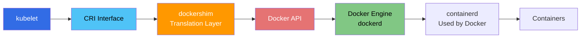
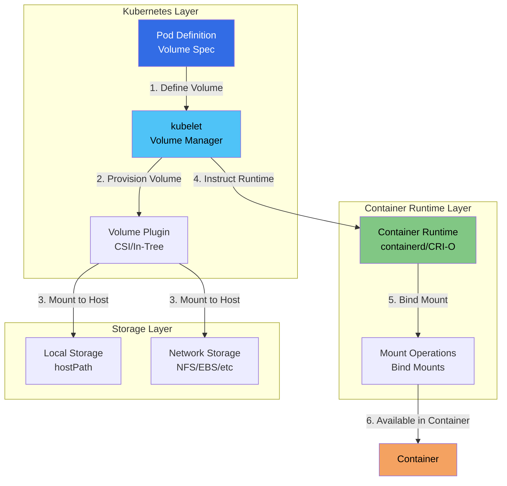

### What is Kubernetes Architecture?

**Simple Explanation:**
Kubernetes architecture is like a **company structure**:
- **Control Plane (Management):** Like the management team that makes decisions
- **Worker Nodes (Employees):** Like workers who do the actual work
- **Communication:** Management gives instructions, workers report back

**Key Concept:**
Kubernetes separates **management** (control plane) from **execution** (worker nodes). This separation allows:
- Scalability: Add more worker nodes without changing management
- Reliability: Control plane can be highly available
- Flexibility: Different types of worker nodes for different workloads

### Architecture Overview

A Kubernetes cluster consists of two main parts:

**1. Control Plane (Master Nodes):**
- The **brain** of the cluster
- Makes all decisions about the cluster
- Manages cluster state
- Coordinates all activities

**2. Worker Nodes:**
- The **workers** that run your applications
- Execute the work assigned by control plane
- Report status back to control plane
- Can scale independently

**Additional Components:**
- **etcd:** Distributed key-value store for cluster state
- **Networking:** Pod network for communication between components

### Architecture Diagram

```mermaid
graph TB
    subgraph "Control Plane (Master Node)"
        API[API Server<br/>Entry Point for all Operations]
        Scheduler[Scheduler<br/>Assigns Pods to Nodes]
        CM[Controller Manager<br/>Manages Controllers]
        etcd[etcd<br/>Cluster State Store]
        CC[Cloud Controller<br/>Cloud Provider Integration]
    end
    
    subgraph "Worker Node 1"
        Kubelet1[kubelet<br/>Node Agent]
        KubeProxy1[kube-proxy<br/>Network Proxy]
        Runtime1[Container Runtime<br/>Docker/containerd/CRI-O]
        Pod1[Pods<br/>Application Containers]
    end
    
    subgraph "Worker Node 2"
        Kubelet2[kubelet<br/>Node Agent]
        KubeProxy2[kube-proxy<br/>Network Proxy]
        Runtime2[Container Runtime<br/>Docker/containerd/CRI-O]
        Pod2[Pods<br/>Application Containers]
    end
    
    subgraph "Worker Node N"
        KubeletN[kubelet<br/>Node Agent]
        KubeProxyN[kube-proxy<br/>Network Proxy]
        RuntimeN[Container Runtime<br/>Docker/containerd/CRI-O]
        PodN[Pods<br/>Application Containers]
    end
    
    API --> etcd
    API --> Scheduler
    API --> CM
    API --> CC
    
    API --> Kubelet1
    API --> Kubelet2
    API --> KubeletN
    
    Kubelet1 --> Runtime1
    Kubelet1 --> Pod1
    KubeProxy1 --> Pod1
    
    Kubelet2 --> Runtime2
    Kubelet2 --> Pod2
    KubeProxy2 --> Pod2
    
    KubeletN --> RuntimeN
    KubeletN --> PodN
    KubeProxyN --> PodN
    
    style API fill:#326ce5,color:#fff
    style Scheduler fill:#326ce5,color:#fff
    style CM fill:#326ce5,color:#fff
    style etcd fill:#326ce5,color:#fff
    style CC fill:#326ce5,color:#fff
    style Kubelet1 fill:#00d4aa,color:#fff
    style Kubelet2 fill:#00d4aa,color:#fff
    style KubeletN fill:#00d4aa,color:#fff
    style Pod1 fill:#f4a261,color:#000
    style Pod2 fill:#f4a261,color:#000
    style PodN fill:#f4a261,color:#000
```



### Control Plane Components

The **control plane** (formerly called master node) is the **brain of the Kubernetes cluster**. It makes global decisions about the cluster and responds to cluster events.

**What it does:**
- Makes decisions about the cluster
- Maintains desired state
- Responds to cluster events
- Manages cluster resources
- Coordinates worker nodes

**Key Characteristics:**
- Can run on dedicated machines or on worker nodes
- Should be highly available in production
- All components communicate through API Server
- Stateless design allows horizontal scaling

#### 1. API Server (kube-apiserver)

**What it is:**
The **API Server** is the **front-end for the Kubernetes control plane**. It's the central management point for the entire cluster.

**Simple Analogy:**
Think of API Server as a **reception desk**:
- All requests come through here
- Validates and processes requests
- Routes requests to appropriate components
- Returns responses to clients

**Responsibilities:**
- **Exposes Kubernetes API:** RESTful API for all operations
- **Validates Requests:** Ensures requests are valid
- **Authenticates & Authorizes:** Security layer for requests
- **Updates etcd:** Stores cluster state in etcd
- **Serves as Gateway:** Only component that talks to etcd directly
- **Watches & Notifies:** Watches for changes and notifies components

**Key Features:**
- **RESTful API:** Standard HTTP/JSON API
- **Horizontal Scaling:** Can run multiple instances
- **Stateless:** Can be load balanced
- **Secure:** Authentication and authorization built-in
- **Extensible:** Supports custom resources and extensions

**How it Works:**
```
User/Component → API Server → Validates → etcd → Response
```

**Example:**
```bash
# All kubectl commands go through API Server
kubectl get pods
# → kubectl → API Server → etcd → Response

kubectl create deployment
# → kubectl → API Server → Validates → etcd → Scheduler notified
```

**Important Notes:**
- ⚠️ **All communication** goes through API Server
- ⚠️ **Single point of entry** for all operations
- ⚠️ **Should be highly available** in production
- ✅ **Can be scaled** horizontally for performance

#### 2. etcd

**What it is:**
**etcd** is a **distributed, consistent key-value store** used as Kubernetes' backing store. It's the **database** of the Kubernetes cluster.

**Simple Analogy:**
Think of etcd as a **filing cabinet**:
- Stores all important information
- Only API Server can access it directly
- Contains the current state of everything
- If lost, you lose all records

**Responsibilities:**
- **Stores Cluster Data:** All configurations, state, metadata
- **Provides Watch Functionality:** Real-time change notifications
- **Ensures Consistency:** Distributed consensus algorithm
- **Source of Truth:** Single source of truth for cluster state

**Key Features:**
- **Highly Available:** Can run in HA mode (3+ nodes)
- **Persistent Storage:** Data survives restarts
- **Fast Reads/Writes:** Optimized for performance
- **Watch API:** Real-time updates for components
- **Consistent:** Strong consistency guarantees

**What it Stores:**
- Pod definitions and states
- Service definitions
- Deployment configurations
- Node information
- Secrets and ConfigMaps
- All cluster metadata

**Important:**
- ⚠️ **Backup etcd regularly** - Contains all cluster state
- ⚠️ **etcd is the source of truth** - If lost, cluster state is lost
- ⚠️ **Only API Server** talks to etcd directly
- ✅ **Highly available** setup recommended for production

#### 3. Scheduler (kube-scheduler)

**What it is:**
The **Scheduler** is a control plane component that watches for newly created Pods with no assigned node, and **selects a node for them to run on**.

**Simple Analogy:**
Think of Scheduler as a **job assignment manager**:
- New tasks (Pods) need to be assigned
- Evaluates all available workers (Nodes)
- Chooses the best worker for each task
- Considers skills, availability, and preferences

**Responsibilities:**
- **Assigns Pods to Nodes:** Decides where Pods run
- **Considers Resource Requirements:** CPU, memory, storage needs
- **Considers Constraints:** Hardware/software requirements
- **Considers Affinity Rules:** Pod/node affinity and anti-affinity
- **Considers Data Locality:** Places Pods near their data
- **Load Balancing:** Distributes Pods across nodes

**Scheduling Process:**
The scheduler uses a two-phase approach:

**Phase 1: Filtering**
- Filters out nodes that can't run the Pod
- Checks resource availability
- Checks node constraints
- Checks taints and tolerations

**Phase 2: Scoring**
- Scores remaining nodes
- Considers resource balance
- Considers affinity rules
- Considers data locality
- Selects highest-scoring node

**Detailed Process:**
```
1. Filter nodes (find nodes that can run the pod)
   ↓
2. Score nodes (rank nodes by preference)
   ↓
3. Select best node (highest score)
   ↓
4. Bind pod to node (assign pod to selected node)
```

**Example:**
```
New Pod Created (needs 2 CPU, 4GB RAM)
   ↓
Scheduler evaluates all nodes
   ↓
Filters: Node 1 (has resources), Node 2 (has resources), Node 3 (insufficient)
   ↓
Scores: Node 1 (score: 85), Node 2 (score: 92)
   ↓
Selects: Node 2 (highest score)
   ↓
Assigns Pod to Node 2
```

**Key Features:**
- **Intelligent Placement:** Considers multiple factors
- **Load Balancing:** Distributes Pods evenly
- **Extensible:** Can add custom scheduling logic
- **Efficient:** Fast scheduling decisions

#### 4. Controller Manager (kube-controller-manager)

**What it is:**
The **Controller Manager** runs controller processes that **regulate the state of the cluster**. It ensures the actual state matches the desired state.

**Simple Analogy:**
Think of Controller Manager as a **quality control supervisor**:
- Monitors what should be (desired state)
- Checks what actually is (actual state)
- Takes action when they don't match
- Continuously ensures everything is correct

**Responsibilities:**
- **Watches Cluster State:** Monitors desired vs actual state
- **Takes Corrective Action:** Fixes discrepancies
- **Manages Controllers:** Runs multiple controllers
- **Reconciles State:** Continuously ensures consistency

**Controllers:**
The Controller Manager runs multiple controllers:

**Workload Controllers:**
- **Replication Controller:** Maintains correct number of pod replicas
- **Deployment Controller:** Manages deployments and rolling updates
- **StatefulSet Controller:** Manages stateful applications
- **DaemonSet Controller:** Ensures pods run on all/some nodes
- **Job Controller:** Manages job completion
- **CronJob Controller:** Manages scheduled jobs

**Cluster Controllers:**
- **Node Controller:** Monitors node health and availability
- **Service Controller:** Manages cloud load balancers
- **Endpoint Controller:** Populates endpoint objects for Services
- **Namespace Controller:** Manages namespace lifecycle
- **ResourceQuota Controller:** Enforces resource quotas

**How it Works:**
The Controller Manager follows a **reconciliation loop**:

```
1. Watch desired state (from API Server/etcd)
   ↓
2. Check actual state (from API Server/etcd)
   ↓
3. Compare desired vs actual
   ↓
4. If different → Take corrective action
   ↓
5. Repeat continuously
```

**Example:**
```
Desired: 3 replicas of nginx
Actual: 2 replicas running
   ↓
Controller detects mismatch
   ↓
Creates 1 new Pod
   ↓
Actual: 3 replicas running ✅
```

**Key Features:**
- **Continuous Monitoring:** Always watching cluster state
- **Automatic Correction:** Fixes issues automatically
- **Self-Healing:** Maintains desired state
- **Multiple Controllers:** Manages different aspects

#### 5. Cloud Controller Manager (cloud-controller-manager)

**What it is:** Links your cluster into your cloud provider's API.

**Responsibilities:**
- Node controller (cloud-specific)
- Route controller (cloud-specific)
- Service controller (load balancers)
- Volume controller (storage)

**Note:** Only runs when cloud provider integration is enabled.

### Worker Node Components

**Worker nodes** (formerly called minions) run your **application workloads**. Each node must have the components below.

**What Worker Nodes Do:**
- Execute application workloads (Pods)
- Report status to control plane
- Run container runtime
- Handle networking for Pods

**Key Characteristics:**
- Can scale independently (add/remove nodes)
- Each node is independent
- Can have different resources (CPU, memory)
- Can be in different zones/regions

#### 1. kubelet

**What it is:**
**kubelet** is an **agent that runs on each node** in the cluster. It's the primary node agent that communicates with the control plane.

**Simple Analogy:**
Think of kubelet as a **foreman on a construction site**:
- Receives instructions from management (API Server)
- Manages workers (containers) on the site
- Reports progress back to management
- Ensures work is done correctly

**Responsibilities:**
- **Communicates with API Server:** Receives instructions and reports status
- **Manages Pods:** Creates, updates, and deletes Pods
- **Manages Containers:** Ensures containers are running
- **Reports Status:** Reports node and pod status to API Server
- **Executes Health Checks:** Runs liveness and readiness probes
- **Mounts Volumes:** Attaches storage volumes to Pods
- **Downloads Secrets:** Retrieves secrets for Pods
- **Registers Node:** Registers the node with the cluster

**Key Features:**
- **Node Registration:** Registers node with API Server
- **Health Monitoring:** Monitors pod and container health
- **Auto-Recovery:** Restarts failed containers
- **Resource Reporting:** Reports CPU, memory, disk usage
- **Volume Management:** Manages volume mounts
- **Secret Management:** Handles secret retrieval

**Communication Flow:**
```
API Server → kubelet → Container Runtime → Containers
   ↑                                              ↓
   └────────── Status Reports ────────────────────┘
```

**How it Works:**
1. **Receives Pod Spec:** Gets Pod specification from API Server
2. **Creates Pod:** Instructs Container Runtime to create containers
3. **Monitors Health:** Continuously monitors Pod health
4. **Reports Status:** Sends status updates to API Server
5. **Takes Action:** Restarts containers if they fail

**Example:**
```
API Server: "Create Pod with nginx container"
   ↓
kubelet: "Received, creating Pod"
   ↓
kubelet → Container Runtime: "Pull nginx image and start container"
   ↓
Container Runtime: "Container running"
   ↓
kubelet → API Server: "Pod is Running"
```

#### 2. kube-proxy

**What it is:**
**kube-proxy** is a **network proxy that runs on each node** in your cluster. It maintains network rules that allow communication to Pods from inside or outside the cluster.

**Simple Analogy:**
Think of kube-proxy as a **traffic director**:
- Routes traffic to the right destination
- Maintains routing rules
- Load balances traffic
- Handles network abstraction

**Responsibilities:**
- **Maintains Network Rules:** Sets up iptables/IPVS rules
- **Enables Service Abstraction:** Makes Services work
- **Load Balances Traffic:** Distributes traffic to Pods
- **Implements Service Types:** ClusterIP, NodePort, LoadBalancer
- **Service Discovery:** Enables Pod-to-Pod communication

**Why We Need It:**
- Pods have dynamic IPs (change when recreated)
- Services provide stable endpoints
- kube-proxy routes Service traffic to Pods
- Handles load balancing across Pods

**Modes:**
kube-proxy can run in different modes:

**1. iptables Mode (Default):**
- Uses Linux iptables rules
- Better performance than userspace
- No user-space switching
- Most common in production

**2. IPVS Mode:**
- Uses IPVS (IP Virtual Server)
- Better performance for large clusters
- More load balancing algorithms
- Recommended for high-traffic clusters

**3. userspace Mode (Legacy):**
- Proxy runs in userspace
- Older implementation
- Less efficient
- Not recommended for production

**How it Works:**
```
External Request → Service (ClusterIP: 10.96.0.1)
   ↓
kube-proxy (iptables rules)
   ↓
Routes to Pod IPs (10.244.1.5, 10.244.1.6, 10.244.1.7)
   ↓
Load balanced across Pods
```

**Example:**
```
Service: nginx-service (ClusterIP: 10.96.0.1:80)
   ↓
kube-proxy creates iptables rules:
   - 10.96.0.1:80 → 10.244.1.5:80 (Pod 1)
   - 10.96.0.1:80 → 10.244.1.6:80 (Pod 2)
   - 10.96.0.1:80 → 10.244.1.7:80 (Pod 3)
   ↓
Traffic to Service is load balanced across Pods
```

**Key Features:**
- **Automatic Updates:** Updates rules when Pods change
- **Load Balancing:** Distributes traffic evenly
- **Service Types:** Supports all Service types
- **High Performance:** Efficient routing

#### 3. Container Runtime

**What it is:**
The **Container Runtime** is software responsible for **running containers**. It's the component that actually executes containers on the node.

**Simple Analogy:**
Think of Container Runtime as a **factory machine**:
- Receives instructions (from kubelet)
- Pulls materials (container images)
- Produces products (running containers)
- Manages the production process

**Responsibilities:**
- **Pulling Images:** Downloads container images from registries
- **Starting Containers:** Creates and starts containers
- **Stopping Containers:** Stops and removes containers
- **Managing Lifecycle:** Handles container lifecycle
- **Container Isolation:** Provides isolation and security
- **Resource Management:** Manages container resources

**Supported Runtimes:**
Kubernetes supports multiple container runtimes through CRI:

**1. containerd:**
- Industry-standard container runtime
- Used by Docker Engine
- Lightweight and efficient
- Most common in production

**2. CRI-O:**
- Lightweight container runtime
- Designed specifically for Kubernetes
- OCI-compliant
- Good for resource-constrained environments

**3. Docker (Deprecated in K8s 1.24+):**
- ⚠️ **No longer directly supported** in Kubernetes 1.24+
- Previously supported via dockershim (removed in 1.24)
- Docker Engine internally uses containerd
- **Migration recommended:** Use containerd directly
- **Note:** Docker images still work (OCI-compliant)

**4. Mirantis Container Runtime:**
- Docker alternative
- Compatible with Docker
- Enterprise-focused

**Container Runtime Interface (CRI):**
**What is CRI?**
- **Standard interface** for container runtimes
- Allows Kubernetes to work with different runtimes
- Abstraction layer between kubelet and runtime

**Why CRI?**
- **Flexibility:** Can use different runtimes
- **Standardization:** Common interface for all runtimes
- **Innovation:** New runtimes can be added easily
- **Abstraction:** kubelet doesn't need to know runtime details

**How it Works:**
```
kubelet → CRI → Container Runtime → Containers
```

**Example:**
```
kubelet: "Create container with nginx:latest image"
   ↓
CRI Interface
   ↓
Container Runtime (containerd): "Pulling image, creating container"
   ↓
Container: "nginx container running"
   ↓
Container Runtime → kubelet: "Container started successfully"
```

**Key Features:**
- **OCI Compliant:** Follows Open Container Initiative standards
- **Secure:** Container isolation and security
- **Efficient:** Optimized for performance
- **Flexible:** Multiple runtime options

#### CRI History and Docker Support Evolution

**The CRI Standard and Docker's Journey:**

**1. Early Days - Docker Without CRI (Pre-1.5):**
- Kubernetes was initially built to work **directly with Docker**
- Docker was the **only supported runtime**
- Kubernetes code had **hardcoded Docker-specific calls**
- This created a **tight coupling** between Kubernetes and Docker

**Problem:**
- Kubernetes couldn't easily support other container runtimes
- Any changes to Docker required changes in Kubernetes code
- Limited flexibility and innovation

**2. Introduction of CRI (Kubernetes 1.5 - 2016):**
- Kubernetes introduced **Container Runtime Interface (CRI)**
- CRI is a **plugin interface** that enables kubelet to use different container runtimes
- Standardized the communication between kubelet and container runtimes
- Allows Kubernetes to work with **any CRI-compliant runtime**

**What CRI Provides:**
- **Standard API:** Common interface for all runtimes
- **gRPC Protocol:** Efficient communication protocol
- **Runtime Services:** Image management, container lifecycle, streaming
- **Sandbox Management:** Pod-level isolation

**3. Docker's Initial Problem:**
- **Docker did NOT implement CRI natively**
- Docker had its own API (Docker API)
- Docker was not CRI-compliant
- Kubernetes needed a way to support Docker

**4. Docker Shim Solution (Kubernetes 1.6 - 2017):**
To support Docker without native CRI support, Kubernetes introduced **dockershim**:

**What is dockershim?**
- **Translation layer** between CRI and Docker API
- Converts CRI calls to Docker API calls
- Allows Docker to work with Kubernetes through CRI
- Built into kubelet as a **temporary workaround**

**How dockershim Worked:**
```
kubelet → CRI Interface → dockershim → Docker API → Docker Engine → Containers
```

**Architecture with dockershim:**


**Why dockershim was needed:**
- Docker was the **most popular** container runtime
- Many users were already using Docker
- Docker didn't implement CRI natively
- Kubernetes needed to support Docker for adoption

**Problems with dockershim:**
- **Extra layer:** Added complexity and overhead
- **Maintenance burden:** Kubernetes team had to maintain Docker-specific code
- **Not ideal:** Docker was using containerd internally anyway
- **Dependency:** Kubernetes depended on Docker's API stability

**5. Docker's Evolution:**
- Docker Engine **internally uses containerd** (since Docker 1.11)
- containerd **is CRI-compliant**
- Docker Engine is essentially a **wrapper** around containerd
- This created redundancy: Docker → containerd → containers

**6. Removal of Docker Support (Kubernetes 1.24 - 2022):**

**Decision:**
- Kubernetes **removed dockershim** in version 1.24
- Docker is **no longer directly supported** as a container runtime
- Users must migrate to **CRI-compliant runtimes**

**Why was Docker support removed?**
1. **Maintenance burden:** Maintaining dockershim was costly
2. **Redundancy:** Docker uses containerd anyway
3. **Standardization:** CRI-compliant runtimes are better
4. **Simplicity:** Direct CRI support is cleaner
5. **Future-proofing:** Focus on CRI-compliant runtimes

**What this means:**
- ❌ **Cannot use Docker Engine directly** with Kubernetes 1.24+
- ✅ **Can still use Docker images** (OCI-compliant)
- ✅ **Can use containerd** (what Docker uses internally)
- ✅ **Can use CRI-O** (lightweight alternative)
- ✅ **Docker Desktop** still works (uses containerd)

**7. Migration Path:**

**Important Clarification: "Do I Need to Do Anything?"**

This is a **common misconception**. Let's clarify:

**The Situation:**
- ✅ **Yes, containerd is already installed** if you have Docker Engine
- ✅ **Docker Engine uses containerd internally**
- ❌ **BUT kubelet was configured to use dockershim** (not containerd directly)
- ❌ **dockershim talked to Docker API**, not containerd directly

**What Changed:**
- **Before 1.24:** kubelet → dockershim → Docker API → dockerd → containerd
- **After 1.24:** kubelet → CRI → containerd (directly)

**So, What Do Users Need to Do?**

**For Cloud-Managed Clusters (EKS, AKS, GKE):**
- ✅ **Nothing!** Cloud providers already migrated to containerd
- ✅ They handled the migration before 1.24
- ✅ Users were automatically migrated
- ✅ No action required from users

**For Self-Managed Clusters:**
- ⚠️ **Yes, you need to reconfigure kubelet**
- ⚠️ Even though containerd is installed, kubelet needs to be told to use it directly
- ⚠️ You need to update kubelet configuration

**Why Reconfiguration is Needed:**
1. **kubelet was configured to use dockershim** (which is now removed)
2. **kubelet needs to be reconfigured** to use containerd directly via CRI
3. **Docker Engine can stay or be removed** (your choice)
4. **containerd must be properly configured** for Kubernetes

**Option 1: Use containerd Directly (Recommended)**

**Migration Steps:**
```bash
# 1. Ensure containerd is installed and running
systemctl status containerd

# 2. Configure containerd for Kubernetes (if not already done)
# Edit /etc/containerd/config.toml
# Enable CRI plugin

# 3. Update kubelet configuration
# Edit /var/lib/kubelet/config.yaml or /etc/kubernetes/kubelet.conf
# Change runtime to containerd:
# runtimeRequestTimeout: "10m"
# containerRuntimeEndpoint: "unix:///run/containerd/containerd.sock"

# Or set environment variable:
# KUBELET_KUBEADM_ARGS="--container-runtime=remote --container-runtime-endpoint=unix:///run/containerd/containerd.sock"

# 4. Restart kubelet
systemctl restart kubelet

# 5. Verify kubelet is using containerd
kubectl get nodes -o wide
# Check runtime version in node info

# 6. (Optional) Stop Docker Engine if not needed elsewhere
systemctl stop docker
systemctl disable docker
```

**What About Docker Engine?**

**You have two options:**

**Option A: Keep Docker Engine (if you use it elsewhere)**
- ✅ Docker Engine can stay installed
- ✅ You can still use `docker` commands for building images
- ✅ kubelet will use containerd directly (not Docker)
- ✅ Both can coexist on the same machine

**Option B: Remove Docker Engine (if only used for Kubernetes)**
- ✅ Remove Docker Engine to save resources
- ✅ Use `nerdctl` or `ctr` instead of `docker` commands
- ✅ Cleaner setup with just containerd

**Key Point:**
- **containerd was already there** (installed with Docker)
- **But kubelet wasn't using it directly** - it was using dockershim
- **You need to reconfigure kubelet** to bypass Docker and use containerd directly
- **Docker Engine itself is optional** - you can keep it or remove it

**Option 2: Use CRI-O**
- Lightweight, CRI-compliant runtime
- Designed specifically for Kubernetes
- Good for resource-constrained environments

**Option 3: Use Mirantis Container Runtime**
- Docker Engine alternative
- Maintains Docker API compatibility
- Includes dockershim for Kubernetes

**8. Current State (Post-1.24):**

**Supported Runtimes:**
- ✅ **containerd** (most common, recommended)
- ✅ **CRI-O** (lightweight alternative)
- ✅ **Mirantis Container Runtime** (Docker alternative)

**Not Supported:**
- ❌ **Docker Engine directly** (via dockershim)
- ✅ **Docker images** still work (OCI-compliant)

**9. Impact on Users:**

**For Docker Users:**
- **Container images:** Still work (OCI-compliant) ✅
- **Dockerfiles:** Still work ✅
- **Docker commands:** Can still use for building images ✅
- **Runtime:** Need to reconfigure kubelet to use containerd directly ⚠️

**For Kubernetes Clusters:**

**Cloud-Managed Clusters (EKS, AKS, GKE):**
- ✅ **No action required** - Cloud providers handled migration
- ✅ Already using containerd before 1.24
- ✅ Users were automatically migrated
- ✅ Seamless upgrade experience

**Self-Managed Clusters:**
- ⚠️ **Action required** - Need to reconfigure kubelet
- ⚠️ Even though containerd is installed (via Docker), kubelet needs reconfiguration
- ⚠️ Must migrate before upgrading to 1.24+
- ⚠️ Update kubelet config to use containerd directly

**New Clusters:**
- ✅ Use containerd or CRI-O from start
- ✅ No Docker/dockershim involved
- ✅ Cleaner setup

**Common Misconception Clarified:**

**❌ Wrong Understanding:**
- "Docker uses containerd, so I don't need to do anything"

**✅ Correct Understanding:**
- "Docker uses containerd, BUT kubelet was using dockershim (not containerd directly)"
- "I need to reconfigure kubelet to use containerd directly via CRI"
- "Docker Engine can stay or be removed - my choice"

**10. Timeline Summary:**

```
2014-2016: Kubernetes uses Docker directly
   ↓
2016: CRI introduced (Kubernetes 1.5)
   ↓
2017: dockershim added (Kubernetes 1.6)
   ↓
2018-2021: Docker uses containerd internally
   ↓
2021: Announcement of dockershim removal
   ↓
2022: dockershim removed (Kubernetes 1.24)
   ↓
2022+: Use containerd, CRI-O, or Mirantis
```

**Key Takeaways:**
1. **CRI is the standard** - All runtimes must be CRI-compliant
2. **Docker shim was temporary** - Bridge solution until CRI adoption
3. **containerd is recommended** - What Docker uses internally
4. **Images still work** - OCI-compliant images are universal
5. **Migration is straightforward** - Most users already use containerd via Docker

#### Container Runtime CLI Tools

When working with container runtimes in Kubernetes, you need command-line tools to interact with them. There are three main tools, each with different purposes and capabilities.

**1. ctr - containerd CLI**

**What it is:**
- **Native CLI tool** for containerd
- **Low-level** tool for direct containerd operations
- Part of the containerd project
- **Not Docker-compatible** syntax

**Use Cases:**
- Direct containerd operations
- Debugging containerd issues
- Low-level container management
- When you need raw containerd access

**Key Features:**
- Direct containerd API access
- Namespace management
- Image management
- Container lifecycle operations
- Snapshot management

**Common Commands:**
```bash
# List containers
ctr containers list

# List images
ctr images list

# Pull an image
ctr images pull docker.io/library/nginx:latest

# Create a container
ctr containers create docker.io/library/nginx:latest nginx-container

# Start a container
ctr containers start nginx-container

# Stop a container
ctr containers stop nginx-container

# Remove a container
ctr containers delete nginx-container

# List namespaces
ctr namespaces list

# Create a namespace
ctr namespaces create mynamespace
```

**Limitations:**
- ❌ **Not Docker-compatible** - Different syntax from Docker
- ❌ **No Docker Compose support**
- ❌ **Limited user-friendly features**
- ❌ **No build capabilities** (use buildkit separately)

**2. nerdctl - Docker-compatible CLI for containerd**

**What it is:**
- **Docker-compatible CLI** for containerd
- **High-level** tool with Docker-like commands
- Part of the containerd project
- **Drop-in replacement** for Docker CLI

**Use Cases:**
- Docker users migrating to containerd
- Development workflows
- Docker Compose support
- Familiar Docker commands

**Key Features:**
- **Docker-compatible** command syntax
- Docker Compose support
- Image build support (via buildkit)
- Volume management
- Network management
- More user-friendly than ctr

**Common Commands:**
```bash
# List containers (Docker syntax)
nerdctl ps
nerdctl ps -a

# List images (Docker syntax)
nerdctl images

# Pull an image
nerdctl pull nginx:latest

# Run a container
nerdctl run -d --name nginx nginx:latest

# Stop a container
nerdctl stop nginx

# Remove a container
nerdctl rm nginx

# Build an image
nerdctl build -t myapp:latest .

# Docker Compose support
nerdctl compose up -d
nerdctl compose down

# Volume management
nerdctl volume create myvolume
nerdctl volume ls

# Network management
nerdctl network create mynetwork
nerdctl network ls
```

**Advantages:**
- ✅ **Docker-compatible** - Same commands as Docker
- ✅ **Docker Compose support**
- ✅ **Build support** - Can build images
- ✅ **User-friendly** - Better than ctr
- ✅ **Easy migration** - For Docker users

**3. crictl - CRI-compatible Runtime CLI**

**What it is:**
- **CRI-compatible** CLI tool
- Works with **any CRI-compatible runtime** (containerd, CRI-O)
- Part of Kubernetes project
- **Kubernetes-focused** tool

**Use Cases:**
- Debugging Kubernetes containers
- Inspecting pods and containers
- Troubleshooting runtime issues
- Working with Kubernetes-managed containers

**Key Features:**
- **CRI-compatible** - Works with any CRI runtime
- **Kubernetes-aware** - Understands pods, containers
- **Debugging focused** - Great for troubleshooting
- **Runtime agnostic** - Works with containerd, CRI-O, etc.

**Common Commands:**
```bash
# List pods
crictl pods

# List containers
crictl ps
crictl ps -a

# List images
crictl images

# Pull an image
crictl pull nginx:latest

# Inspect a pod
crictl inspectp <pod-id>

# Inspect a container
crictl inspect <container-id>

# Get container logs
crictl logs <container-id>

# Execute command in container
crictl exec <container-id> ls

# Get container stats
crictl stats

# Remove a container
crictl rm <container-id>

# Remove an image
crictl rmi <image-id>

# Get runtime info
crictl info

# Get runtime version
crictl version
```

**Configuration:**
```bash
# Set runtime endpoint (for containerd)
crictl config --set runtime-endpoint=unix:///run/containerd/containerd.sock

# Set runtime endpoint (for CRI-O)
crictl config --set runtime-endpoint=unix:///var/run/crio/crio.sock

# Set image endpoint
crictl config --set image-endpoint=unix:///run/containerd/containerd.sock
```

**Advantages:**
- ✅ **Runtime agnostic** - Works with any CRI runtime
- ✅ **Kubernetes-focused** - Understands pods
- ✅ **Great for debugging** - Inspect Kubernetes containers
- ✅ **Standard tool** - Part of Kubernetes project

**Comparison Table:**

| Feature | ctr | nerdctl | crictl |
|---------|-----|---------|--------|
| **Runtime** | containerd only | containerd only | Any CRI runtime |
| **Docker Compatible** | ❌ No | ✅ Yes | ❌ No |
| **Docker Compose** | ❌ No | ✅ Yes | ❌ No |
| **Image Build** | ❌ No | ✅ Yes | ❌ No |
| **Kubernetes Aware** | ❌ No | ❌ No | ✅ Yes |
| **User Friendly** | ⚠️ Low | ✅ High | ⚠️ Medium |
| **Use Case** | Low-level ops | Development | Debugging K8s |
| **Syntax** | containerd-specific | Docker-like | CRI-specific |
| **Pod Support** | ❌ No | ❌ No | ✅ Yes |
| **Volume Management** | ⚠️ Basic | ✅ Full | ❌ No |
| **Network Management** | ⚠️ Basic | ✅ Full | ❌ No |

**When to Use Which Tool:**

**Use `ctr` when:**
- You need direct containerd access
- Debugging containerd issues
- Low-level container operations
- Working with containerd namespaces directly

**Use `nerdctl` when:**
- You're a Docker user migrating to containerd
- You need Docker-compatible commands
- You want to use Docker Compose
- You need to build images
- Development workflows

**Use `crictl` when:**
- Debugging Kubernetes containers
- Inspecting pods and containers in K8s
- Troubleshooting runtime issues
- You need runtime-agnostic tool
- Working with CRI-O or containerd in K8s

**Real-World Example:**

**Scenario: Debugging a Kubernetes Pod**

```bash
# 1. Find the pod using kubectl
kubectl get pods
# NAME                    READY   STATUS    RESTARTS   AGE
# nginx-7d4b8c9f5-abc123   0/1     CrashLoopBackOff   3    5m

# 2. Get container ID using crictl
crictl pods
# POD ID              CREATED             STATE    NAME                NAMESPACE
# abc123def456        5 minutes ago       Ready    nginx-7d4b9c9f5     default

# 3. Get container details
crictl ps -a | grep nginx
# CONTAINER ID        IMAGE               CREATED             STATE
# def789ghi012        nginx:latest        5 minutes ago       Exited

# 4. Inspect the container
crictl inspect def789ghi012

# 5. Get logs
crictl logs def789ghi012

# 6. Execute command in container (if running)
crictl exec def789ghi012 ls /etc/nginx
```

**Installation:**

**ctr:**
- Comes with containerd installation
- Usually at `/usr/bin/ctr`

**nerdctl:**
```bash
# Install from GitHub releases
wget https://github.com/containerd/nerdctl/releases/download/v1.7.0/nerdctl-1.7.0-linux-amd64.tar.gz
tar -xzf nerdctl-1.7.0-linux-amd64.tar.gz
sudo mv nerdctl /usr/local/bin/

# Or using package managers
# macOS
brew install nerdctl

# Linux (some distributions)
# Check containerd releases
```

**crictl:**
```bash
# Download from Kubernetes releases
wget https://github.com/kubernetes-sigs/cri-tools/releases/download/v1.28.0/crictl-v1.28.0-linux-amd64.tar.gz
tar -xzf crictl-v1.28.0-linux-amd64.tar.gz
sudo mv crictl /usr/local/bin/

# Or using package managers
# macOS
brew install crictl

# Ubuntu/Debian
sudo apt-get install -y cri-tools
```

**Summary:**

- **ctr:** Low-level containerd tool, not Docker-compatible
- **nerdctl:** Docker-compatible CLI for containerd, great for development
- **crictl:** CRI-compatible tool, perfect for Kubernetes debugging

**Recommendation:**
- **For Kubernetes debugging:** Use `crictl`
- **For development:** Use `nerdctl` (if you need Docker compatibility)
- **For low-level operations:** Use `ctr`

#### Container Runtime Volumes vs Kubernetes Volumes

**Important Question: "Do Container Runtimes Have Their Own Volume Functionality?"**

Yes! This is an important distinction. Let's clarify how volumes work at different levels:

**1. Container Runtime Level (Low-Level):**

**What Container Runtimes Provide:**
- **Basic volume mounting** - Mount host directories/files into containers
- **Local storage** - Direct access to host filesystem
- **Bind mounts** - Mount host paths into containers
- **Volume drivers** - Basic volume management (Docker volumes, containerd snapshots)

**Examples:**
```bash
# Docker/nerdctl - Runtime-level volumes
docker run -v /host/path:/container/path nginx
nerdctl run -v /host/path:/container/path nginx

# containerd/ctr - Runtime-level volumes
ctr run --mount type=bind,src=/host/path,dst=/container/path nginx
```

**Limitations of Runtime-Level Volumes:**
- ❌ **No orchestration** - No automatic provisioning
- ❌ **No lifecycle management** - Manual creation/deletion
- ❌ **No multi-node support** - Only local to the node
- ❌ **No abstraction** - Direct host path dependencies
- ❌ **No dynamic provisioning** - Manual setup required

**2. Kubernetes Level (High-Level Abstraction):**

**What Kubernetes Provides:**
- **Volume abstraction** - Decouples storage from containers
- **Volume types** - Many volume types (emptyDir, hostPath, PV, PVC, etc.)
- **Lifecycle management** - Automatic creation/deletion
- **Multi-node support** - Network-attached storage
- **Dynamic provisioning** - Automatic volume creation
- **Storage classes** - Policy-based provisioning

**How They Work Together:**



**The Flow:**

**Step 1: Kubernetes Defines Volume**
```yaml
apiVersion: v1
kind: Pod
spec:
  volumes:
    - name: my-volume
      persistentVolumeClaim:
        claimName: my-pvc
  containers:
    - name: app
      volumeMounts:
        - name: my-volume
          mountPath: /data
```

**Step 2: kubelet Manages Volume**
- kubelet's **Volume Manager** reads the volume spec
- Determines volume type (PVC, emptyDir, hostPath, etc.)
- Calls appropriate **Volume Plugin** (CSI driver, in-tree plugin)

**Step 3: Volume Plugin Provisions/Mounts**
- **CSI Driver** or **In-Tree Plugin** provisions the volume
- Mounts volume to a **host path** (e.g., `/var/lib/kubelet/pods/.../volumes/...`)
- Volume is now available on the **host filesystem**

**Step 4: Container Runtime Mounts**
- kubelet instructs **Container Runtime** (containerd/CRI-O) to create container
- Container Runtime performs **bind mount** from host path to container path
- This is a **runtime-level operation** - simple bind mount

**Key Point:**
- **Kubernetes handles:** Volume provisioning, lifecycle, abstraction, multi-node
- **Container Runtime handles:** Simple bind mount from host to container
- **Runtime doesn't know** about Kubernetes volumes - it just mounts what kubelet tells it

**Example Breakdown:**

**Scenario: Pod with PersistentVolumeClaim**

```yaml
apiVersion: v1
kind: Pod
spec:
  volumes:
    - name: data
      persistentVolumeClaim:
        claimName: my-pvc
  containers:
    - name: app
      volumeMounts:
        - name: data
          mountPath: /app/data
```

**What Happens:**

1. **Kubernetes Layer:**
   - PVC → PV → Storage backend (e.g., EBS volume)
   - CSI driver attaches EBS volume to node
   - CSI driver mounts EBS to host path: `/var/lib/kubelet/pods/abc123/volumes/kubernetes.io~csi/pvc-def456`

2. **Container Runtime Layer:**
   - kubelet tells containerd: "Create container with bind mount"
   - containerd performs: `mount --bind /var/lib/kubelet/pods/abc123/volumes/.../mount /app/data`
   - Container sees `/app/data` with EBS volume contents

**Comparison:**

| Aspect | Container Runtime Volumes | Kubernetes Volumes |
|--------|---------------------------|-------------------|
| **Level** | Low-level (runtime) | High-level (orchestration) |
| **Scope** | Single container | Pod-level (shared across containers) |
| **Provisioning** | Manual | Automatic |
| **Lifecycle** | Manual management | Automatic (tied to Pod lifecycle) |
| **Multi-node** | ❌ No (local only) | ✅ Yes (network storage) |
| **Types** | Basic (bind mount, tmpfs) | Many (emptyDir, hostPath, PV, PVC, ConfigMap, Secret, etc.) |
| **Abstraction** | Direct host paths | Abstracted (PVC, StorageClass) |
| **Orchestration** | ❌ No | ✅ Yes |
| **Dynamic Provisioning** | ❌ No | ✅ Yes |

**Real-World Analogy:**

**Container Runtime Volumes = Direct File Access**
- Like directly accessing a USB drive
- You mount it, use it, unmount it
- Simple, direct, manual

**Kubernetes Volumes = Cloud Storage Service**
- Like using Google Drive or Dropbox
- Automatic provisioning, lifecycle management
- Abstracted, orchestrated, multi-node

**Important Points:**

1. **Container runtimes have basic volume functionality:**
   - Bind mounts (host path → container path)
   - Basic volume drivers
   - Local storage only

2. **Kubernetes adds orchestration layer:**
   - Volume abstraction
   - Lifecycle management
   - Multi-node support
   - Dynamic provisioning
   - Many volume types

3. **They work together:**
   - Kubernetes provisions and mounts volume to host
   - Container runtime performs final bind mount to container
   - Runtime doesn't need to know about Kubernetes volume types

4. **Separation of concerns:**
   - **Kubernetes:** "What volume to use, where to mount it"
   - **Container Runtime:** "How to mount host path into container"

**Summary:**

- ✅ **Container runtimes have their own volume functionality** - Basic bind mounts, local storage
- ✅ **Kubernetes has its own volume functionality** - Orchestration, abstraction, multi-node
- ✅ **They work together** - Kubernetes provisions, runtime mounts
- ✅ **Different levels** - Runtime = low-level, Kubernetes = high-level
- ✅ **Kubernetes adds value** - Orchestration, lifecycle, abstraction on top of runtime capabilities

### How Components Work Together

#### Example: Deploying a Pod

```
1. User runs: kubectl create -f pod.yaml
   ↓
2. kubectl sends request to API Server
   ↓
3. API Server validates and stores in etcd
   ↓
4. Scheduler watches for unscheduled pods
   ↓
5. Scheduler selects node and updates pod spec
   ↓
6. API Server updates etcd
   ↓
7. kubelet on selected node watches for new pods
   ↓
8. kubelet instructs Container Runtime to create container
   ↓
9. Container Runtime pulls image and starts container
   ↓
10. kubelet reports pod status to API Server
    ↓
11. API Server updates etcd
```

### High Availability (HA) Architecture

For production, the control plane should be highly available:

```
Control Plane (HA Setup)
├── API Server (3+ instances, load balanced)
├── etcd (3+ instances, clustered)
├── Scheduler (3+ instances, leader election)
└── Controller Manager (3+ instances, leader election)
```

**Benefits:**
- No single point of failure
- Automatic failover
- Continuous availability

### Key Architecture Concepts

#### Declarative Model

- **You declare desired state** (YAML files)
- **Kubernetes makes it happen** (controllers reconcile)
- **Kubernetes maintains state** (self-healing)

#### API-Driven

- **Everything is an API call** to API Server
- **kubectl is just a client** - Makes API calls
- **Other tools can use API** - CI/CD, monitoring, etc.

#### Event-Driven

- **Components watch for changes** (etcd watch API)
- **Controllers react to events** (pod created, node failed)
- **Real-time reconciliation** (continuous monitoring)

### Architecture Best Practices

1. **Separate Control Plane and Worker Nodes**
   - Control plane nodes should be dedicated
   - Worker nodes can be shared

2. **High Availability**
   - Run multiple control plane nodes
   - Use load balancer for API Server
   - Cluster etcd for redundancy

3. **Resource Allocation**
   - Control plane needs sufficient resources
   - Worker nodes sized for workloads

4. **Security**
   - Secure API Server (TLS, authentication)
   - Secure etcd (encryption at rest)
   - Network policies for pod communication

5. **Monitoring**
   - Monitor control plane components
   - Monitor worker node health
   - Monitor etcd performance

</details>

---

<details>
<summary><h2>Kubernetes Setup</h2></summary>


### Setup Methods Overview

| Method | Use Case | Complexity | Best For |
|--------|----------|------------|----------|
| **Minikube** | Local development | Low | Learning, local testing |
| **KIND** | Local development | Low | CI/CD, local testing |
| **kubeadm** | On-premises/Cloud | Medium | Production, custom setups |
| **Cloud Managed** | Production | Low | Production, enterprise |

---

### 1. Minikube

**What it is:** Tool that runs a single-node Kubernetes cluster inside a VM on your local machine.

**Characteristics:**
- ✅ Simple setup and installation
- ✅ Runs on Windows, macOS, and Linux
- ✅ Good for learning Kubernetes
- ✅ Supports multiple container runtimes (Docker, containerd, CRI-O)
- ⚠️ Single node only (not for production)
- ⚠️ Requires virtualization support

**When to Use:**
- Learning Kubernetes concepts
- Local development and testing
- Quick experimentation
- Testing Kubernetes features

**Installation:**
- Download from: https://minikube.sigs.k8s.io/docs/start/
- Supports multiple drivers (Docker, VirtualBox, Hyper-V, etc.)

**Basic Commands:**
```bash
minikube start
minikube stop
minikube delete
minikube status
```

---

### 2. KIND (Kubernetes in Docker)

**What it is:** Tool for running local Kubernetes clusters using Docker container "nodes".

**Characteristics:**
- ✅ Very fast startup
- ✅ Lightweight (uses Docker containers)
- ✅ Can run multiple clusters
- ✅ Great for CI/CD pipelines
- ✅ No VM required
- ⚠️ Limited to Docker runtime
- ⚠️ Not for production workloads

**When to Use:**
- CI/CD pipeline testing
- Local development
- Quick cluster testing
- Multi-cluster scenarios

**Installation:**
- Install via: `go install` or download binaries
- Requires Docker to be running

**Basic Commands:**
```bash
kind create cluster
kind delete cluster
kind get clusters
```

---

### 3. kubeadm

**What it is:** Tool that provides a simple way to create a Kubernetes cluster by following best practices.

**Characteristics:**
- ✅ Production-ready setup
- ✅ Full control over cluster configuration
- ✅ Can create multi-node clusters
- ✅ Works on any Linux machine
- ⚠️ Requires manual setup and configuration
- ⚠️ More complex than managed solutions
- ⚠️ You manage cluster lifecycle

**When to Use:**
- On-premises deployments
- Custom infrastructure requirements
- Learning cluster internals
- Production environments (when managed services aren't suitable)

**Installation:**
- Install kubeadm, kubelet, and kubectl on each node
- Initialize control plane node
- Join worker nodes to cluster

**Basic Commands:**
```bash
kubeadm init
kubeadm join
kubeadm reset
```

---

### 4. Cloud Managed Kubernetes Services

Cloud providers offer fully managed Kubernetes services that handle cluster setup, upgrades, and maintenance.

#### Amazon EKS (Elastic Kubernetes Service)

**What it is:** AWS managed Kubernetes service.

**Characteristics:**
- ✅ Fully managed control plane
- ✅ Integrates with AWS services (IAM, VPC, ELB)
- ✅ High availability
- ✅ Automatic updates
- ⚠️ Cost: Pay for control plane + worker nodes
- ⚠️ AWS-specific

**When to Use:**
- Production workloads on AWS
- Need AWS service integration
- Want managed control plane

**Setup:**
- Create cluster via AWS Console, CLI, or Terraform
- Configure worker nodes (EC2 or Fargate)
- Connect using kubectl

---

#### Azure AKS (Azure Kubernetes Service)

**What it is:** Azure managed Kubernetes service.

**Characteristics:**
- ✅ Fully managed control plane
- ✅ Integrates with Azure services (Active Directory, Azure Monitor)
- ✅ High availability
- ✅ Automatic scaling
- ⚠️ Cost: Pay for worker nodes (control plane free)
- ⚠️ Azure-specific

**When to Use:**
- Production workloads on Azure
- Need Azure service integration
- Enterprise Azure environments

**Setup:**
- Create cluster via Azure Portal, CLI, or ARM/Terraform
- Configure node pools
- Connect using kubectl

---

#### Google GKE (Google Kubernetes Engine)

**What it is:** Google Cloud managed Kubernetes service.

**Characteristics:**
- ✅ Fully managed (original Kubernetes creator)
- ✅ Integrates with GCP services
- ✅ Advanced features (Autopilot mode)
- ✅ High availability
- ⚠️ Cost: Pay for cluster resources
- ⚠️ GCP-specific

**When to Use:**
- Production workloads on GCP
- Need GCP service integration
- Want latest Kubernetes features

**Setup:**
- Create cluster via GCP Console, gcloud CLI, or Terraform
- Configure node pools
- Connect using kubectl

---

### Comparison Summary

| Feature | Minikube | KIND | kubeadm | Cloud Managed |
|---------|----------|------|---------|---------------|
| **Setup Time** | Minutes | Seconds | Hours | Minutes |
| **Cost** | Free | Free | Free (infrastructure) | Pay per use |
| **Production Ready** | ❌ No | ❌ No | ✅ Yes | ✅ Yes |
| **Multi-Node** | ❌ No | ✅ Yes | ✅ Yes | ✅ Yes |
| **Managed** | ❌ No | ❌ No | ❌ No | ✅ Yes |
| **Learning** | ✅ Excellent | ✅ Good | ✅ Good | ⚠️ Less control |
| **CI/CD** | ⚠️ Limited | ✅ Excellent | ⚠️ Complex | ✅ Good |

---

### Choosing the Right Setup Method

**For Learning:**
- Start with **Minikube** or **KIND** for local development

**For Development:**
- Use **Minikube**, **KIND**, or cloud managed service

**For CI/CD:**
- Use **KIND** for fast, lightweight testing

**For Production:**
- Use **Cloud Managed** services (EKS/AKS/GKE) for ease of management
- Use **kubeadm** for on-premises or custom requirements

**For On-Premises:**
- Use **kubeadm** for full control
- Consider managed solutions like Rancher, OpenShift

---

### Quick Start Recommendations

1. **Beginners:** Start with Minikube for hands-on learning
2. **Developers:** Use KIND for fast local development
3. **Production:** Use cloud managed services (EKS/AKS/GKE)
4. **Custom Needs:** Use kubeadm for full control

Each method has its place in the Kubernetes ecosystem, and you may use different methods for different purposes.

</details>

---

<details>
<summary><h2>Kubernetes Concepts</h2></summary>

