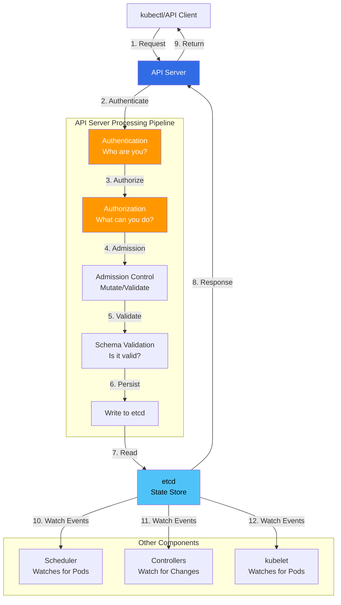
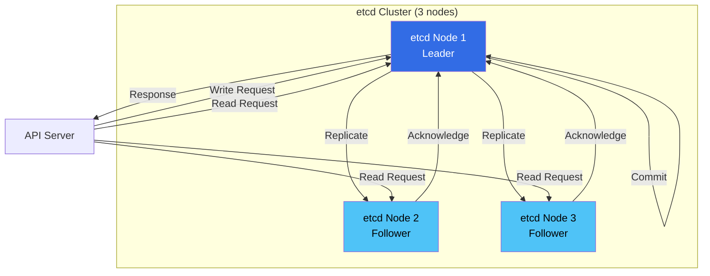
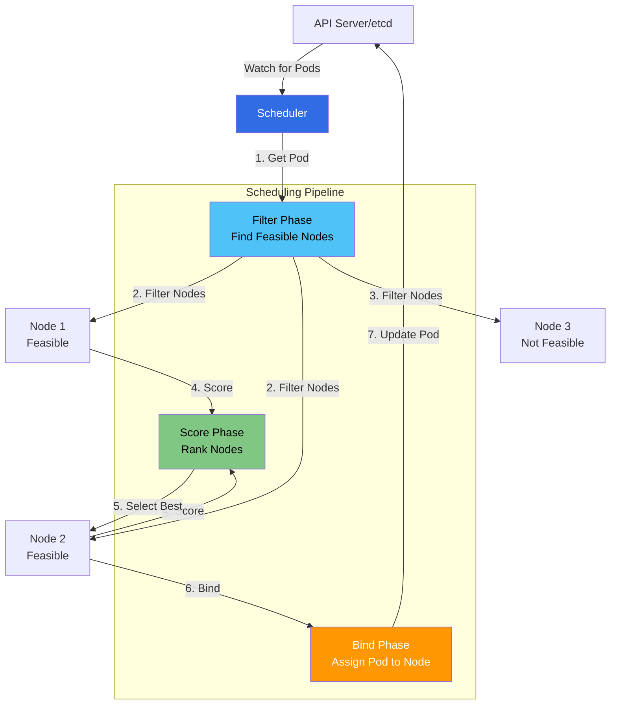
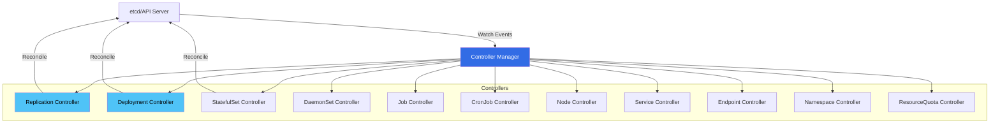
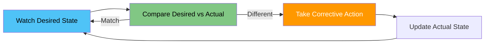
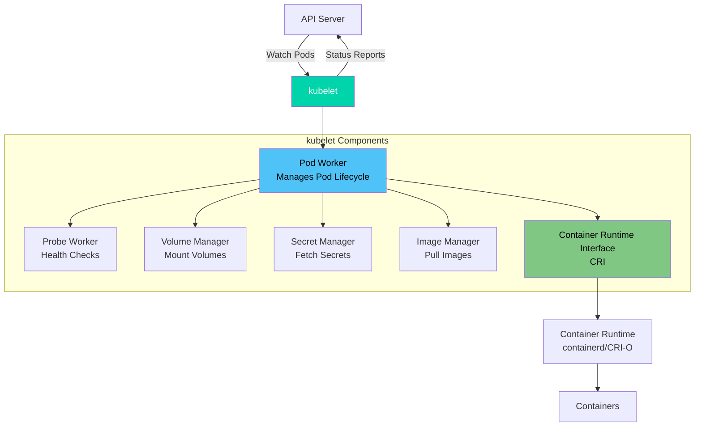
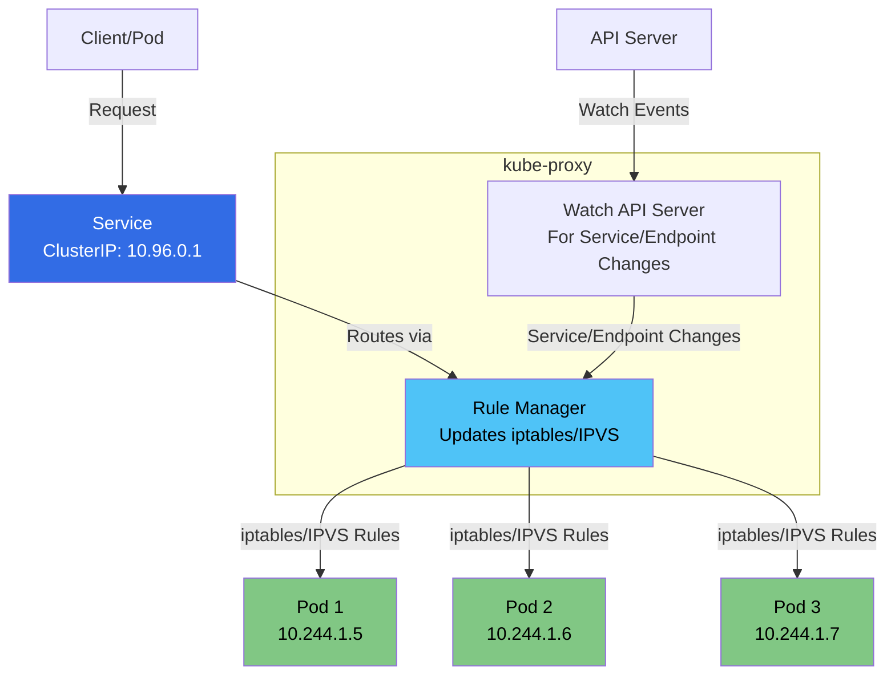
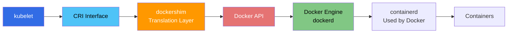
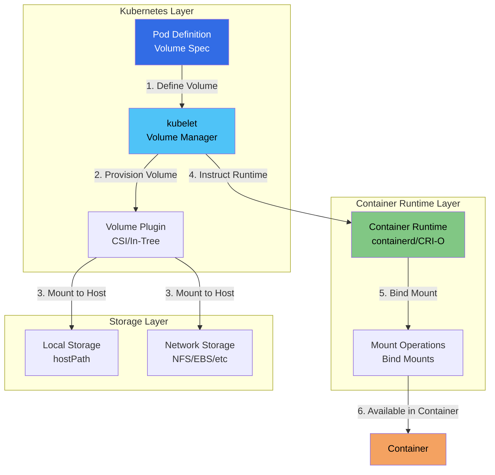

### What is Kubernetes Architecture?

**Simple Explanation:**
Kubernetes architecture is like a **company structure**:
- **Control Plane (Management):** Like the management team that makes decisions
- **Worker Nodes (Employees):** Like workers who do the actual work
- **Communication:** Management gives instructions, workers report back

**Key Concept:**
Kubernetes separates **management** (control plane) from **execution** (worker nodes). This separation allows:
- Scalability: Add more worker nodes without changing management
- Reliability: Control plane can be highly available
- Flexibility: Different types of worker nodes for different workloads

### Architecture Overview

A Kubernetes cluster consists of two main parts:

**1. Control Plane (Master Nodes):**
- The **brain** of the cluster
- Makes all decisions about the cluster
- Manages cluster state
- Coordinates all activities

**2. Worker Nodes:**
- The **workers** that run your applications
- Execute the work assigned by control plane
- Report status back to control plane
- Can scale independently

**Additional Components:**
- **etcd:** Distributed key-value store for cluster state
- **Networking:** Pod network for communication between components

### Architecture Diagram

```mermaid
graph TB
    subgraph "Control Plane (Master Node)"
        API[API Server<br/>Entry Point for all Operations]
        Scheduler[Scheduler<br/>Assigns Pods to Nodes]
        CM[Controller Manager<br/>Manages Controllers]
        etcd[etcd<br/>Cluster State Store]
        CC[Cloud Controller<br/>Cloud Provider Integration]
    end
    
    subgraph "Worker Node 1"
        Kubelet1[kubelet<br/>Node Agent]
        KubeProxy1[kube-proxy<br/>Network Proxy]
        Runtime1[Container Runtime<br/>Docker/containerd/CRI-O]
        Pod1[Pods<br/>Application Containers]
    end
    
    subgraph "Worker Node 2"
        Kubelet2[kubelet<br/>Node Agent]
        KubeProxy2[kube-proxy<br/>Network Proxy]
        Runtime2[Container Runtime<br/>Docker/containerd/CRI-O]
        Pod2[Pods<br/>Application Containers]
    end
    
    subgraph "Worker Node N"
        KubeletN[kubelet<br/>Node Agent]
        KubeProxyN[kube-proxy<br/>Network Proxy]
        RuntimeN[Container Runtime<br/>Docker/containerd/CRI-O]
        PodN[Pods<br/>Application Containers]
    end
    
    API --> etcd
    API --> Scheduler
    API --> CM
    API --> CC
    
    API --> Kubelet1
    API --> Kubelet2
    API --> KubeletN
    
    Kubelet1 --> Runtime1
    Kubelet1 --> Pod1
    KubeProxy1 --> Pod1
    
    Kubelet2 --> Runtime2
    Kubelet2 --> Pod2
    KubeProxy2 --> Pod2
    
    KubeletN --> RuntimeN
    KubeletN --> PodN
    KubeProxyN --> PodN
    
    style API fill:#326ce5,color:#fff
    style Scheduler fill:#326ce5,color:#fff
    style CM fill:#326ce5,color:#fff
    style etcd fill:#326ce5,color:#fff
    style CC fill:#326ce5,color:#fff
    style Kubelet1 fill:#00d4aa,color:#fff
    style Kubelet2 fill:#00d4aa,color:#fff
    style KubeletN fill:#00d4aa,color:#fff
    style Pod1 fill:#f4a261,color:#000
    style Pod2 fill:#f4a261,color:#000
    style PodN fill:#f4a261,color:#000
```



### Control Plane Components

The **control plane** (formerly called master node) is the **brain of the Kubernetes cluster**. It makes global decisions about the cluster and responds to cluster events.

**What it does:**
- Makes decisions about the cluster
- Maintains desired state
- Responds to cluster events
- Manages cluster resources
- Coordinates worker nodes

**Key Characteristics:**
- Can run on dedicated machines or on worker nodes
- Should be highly available in production
- All components communicate through API Server
- Stateless design allows horizontal scaling

#### 1. API Server (kube-apiserver)

**What it is:**
The **API Server** is the **front-end for the Kubernetes control plane**. It's the central management point for the entire cluster and the **only component that directly communicates with etcd**.

**Simple Analogy:**
Think of API Server as a **reception desk**:
- All requests come through here
- Validates and processes requests
- Routes requests to appropriate components
- Returns responses to clients
- Only authorized personnel can access the filing cabinet (etcd)

**Responsibilities:**
- **Exposes Kubernetes API:** RESTful API for all operations
- **Validates Requests:** Ensures requests are valid (schema validation)
- **Authenticates & Authorizes:** Security layer for requests
- **Admission Control:** Mutates/validates requests before persistence
- **Updates etcd:** Stores cluster state in etcd
- **Serves as Gateway:** Only component that talks to etcd directly
- **Watches & Notifies:** Watches for changes and notifies components
- **API Versioning:** Manages multiple API versions
- **Rate Limiting:** Prevents API abuse

**Key Features:**
- **RESTful API:** Standard HTTP/JSON API
- **Horizontal Scaling:** Can run multiple instances (load balanced)
- **Stateless:** Can be load balanced
- **Secure:** Authentication and authorization built-in
- **Extensible:** Supports custom resources and extensions
- **Versioned API:** Multiple API versions (v1, apps/v1, etc.)

**API Server Architecture:**



**Request Processing Flow:**

**Step 1: Authentication**
- **Purpose:** Verify who is making the request
- **Methods:** Client certificates, bearer tokens, service accounts
- **Result:** User identity (username, groups)

**Step 2: Authorization**
- **Purpose:** Determine what the user can do
- **Methods:** RBAC, ABAC, Node authorization, Webhook
- **Result:** Allow or deny the request

**Step 3: Admission Control**
- **Purpose:** Mutate or validate requests before persistence
- **Types:**
  - **Mutating:** Modify requests (e.g., add default values)
  - **Validating:** Validate requests (e.g., enforce policies)
- **Examples:** ResourceQuota, LimitRange, PodSecurityPolicy

**Step 4: Schema Validation**
- **Purpose:** Validate request against Kubernetes schema
- **Checks:** Required fields, data types, constraints
- **Result:** Valid or invalid request

**Step 5: Persist to etcd**
- **Purpose:** Store the object in etcd
- **Operation:** Create, Update, or Delete
- **Result:** Object stored in etcd

**Step 6: Watch Events**
- **Purpose:** Notify watching components
- **Components:** Scheduler, Controllers, kubelet
- **Result:** Components react to changes

**API Versions:**

Kubernetes supports multiple API versions for backward compatibility:

**Core API Group (`/api/v1`):**
- Pods, Services, ConfigMaps, Secrets, Namespaces
- Most stable, widely used

**Named API Groups:**
- `apps/v1`: Deployments, ReplicaSets, StatefulSets, DaemonSets
- `networking.k8s.io/v1`: Ingress, NetworkPolicy
- `storage.k8s.io/v1`: StorageClass, PersistentVolume
- `autoscaling/v2`: HorizontalPodAutoscaler

**API Version Lifecycle:**
```
alpha → beta → stable (v1) → deprecated → removed
```

**Example Request Flow:**

```bash
# User runs: kubectl create -f pod.yaml

# 1. kubectl sends HTTP POST to API Server
POST /api/v1/namespaces/default/pods
{
  "apiVersion": "v1",
  "kind": "Pod",
  "metadata": { "name": "my-pod" },
  "spec": { ... }
}

# 2. API Server processes:
#    - Authenticates: Validates client certificate
#    - Authorizes: Checks RBAC permissions
#    - Admission: Mutates/validates (adds defaults)
#    - Schema: Validates YAML structure
#    - etcd: Stores in etcd

# 3. etcd stores the Pod object

# 4. API Server returns success response

# 5. Scheduler watches etcd, sees new Pod, schedules it
```

**Authentication Methods:**

**1. Client Certificates:**
```yaml
# kubeconfig file
users:
- name: admin
  user:
    client-certificate: /path/to/cert.crt
    client-key: /path/to/key.key
```

**2. Bearer Tokens:**
```yaml
users:
- name: user
  user:
    token: "eyJhbGciOiJSUzI1NiIs..."
```

**3. Service Accounts:**
- Automatically created for Pods
- Token mounted in Pod at `/var/run/secrets/kubernetes.io/serviceaccount/token`

**Authorization Methods:**

**1. RBAC (Role-Based Access Control):**
```yaml
apiVersion: rbac.authorization.k8s.io/v1
kind: Role
metadata:
  name: pod-reader
rules:
- apiGroups: [""]
  resources: ["pods"]
  verbs: ["get", "watch", "list"]
```

**2. ABAC (Attribute-Based Access Control):**
- Policy file-based
- Less common, more complex

**3. Node Authorization:**
- Allows kubelet to access its own node's resources

**4. Webhook Authorization:**
- External authorization service
- Custom authorization logic

**Admission Controllers:**

**Mutating Admission Controllers:**
- **DefaultStorageClass:** Adds default StorageClass to PVCs
- **DefaultTolerationSeconds:** Adds default toleration
- **MutatingAdmissionWebhook:** Custom mutation logic

**Validating Admission Controllers:**
- **ResourceQuota:** Enforces resource quotas
- **LimitRange:** Enforces resource limits
- **PodSecurityPolicy:** Enforces security policies
- **ValidatingAdmissionWebhook:** Custom validation logic

**Example:**
```yaml
# User creates Pod without resource limits
apiVersion: v1
kind: Pod
spec:
  containers:
  - name: app
    image: nginx

# LimitRange admission controller adds default limits:
spec:
  containers:
  - name: app
    image: nginx
    resources:
      limits:
        cpu: 500m
        memory: 512Mi
      requests:
        cpu: 250m
        memory: 256Mi
```

**Watch Mechanism:**

API Server provides a **watch API** for real-time updates:

```bash
# Watch for Pod changes
kubectl get pods --watch

# Components use watch API:
# - Scheduler watches for unscheduled Pods
# - Controllers watch for resource changes
# - kubelet watches for Pods assigned to its node
```

**How Watch Works:**
1. Client sends watch request to API Server
2. API Server watches etcd for changes
3. When etcd changes, API Server sends event to client
4. Client processes event and continues watching

**API Server High Availability:**

**Load Balancing:**
- Multiple API Server instances
- Load balancer in front
- All instances are stateless

**Configuration:**
```yaml
# kubeconfig points to load balancer
clusters:
- cluster:
    server: https://api-lb.example.com:6443
```

**Important Notes:**
- ⚠️ **All communication** goes through API Server
- ⚠️ **Single point of entry** for all operations
- ⚠️ **Should be highly available** in production (multiple instances)
- ✅ **Can be scaled** horizontally for performance
- ✅ **Stateless** - Can be load balanced
- ⚠️ **Only component** that talks to etcd directly
- ✅ **Supports multiple API versions** for backward compatibility

#### 2. etcd

**What it is:**
**etcd** is a **distributed, consistent key-value store** used as Kubernetes' backing store. It's the **database** of the Kubernetes cluster and the **single source of truth** for all cluster state.

**Simple Analogy:**
Think of etcd as a **filing cabinet**:
- Stores all important information
- Only API Server can access it directly
- Contains the current state of everything
- If lost, you lose all records
- Multiple copies (replicas) for safety

**Responsibilities:**
- **Stores Cluster Data:** All configurations, state, metadata
- **Provides Watch Functionality:** Real-time change notifications
- **Ensures Consistency:** Distributed consensus algorithm (Raft)
- **Source of Truth:** Single source of truth for cluster state
- **Transaction Support:** ACID transactions for consistency
- **Versioning:** Maintains revision history

**Key Features:**
- **Highly Available:** Can run in HA mode (3+ nodes)
- **Persistent Storage:** Data survives restarts
- **Fast Reads/Writes:** Optimized for performance
- **Watch API:** Real-time updates for components
- **Consistent:** Strong consistency guarantees (Raft consensus)
- **Transactional:** ACID-compliant transactions
- **Versioned:** Maintains revision history

**etcd Architecture:**



**Raft Consensus Algorithm:**

etcd uses **Raft** for distributed consensus:

**Raft Roles:**
- **Leader:** Handles all client requests, replicates to followers
- **Follower:** Receives updates from leader, votes in elections
- **Candidate:** Temporary role during leader election

**How Raft Works:**

**1. Leader Election:**
- If leader fails, followers become candidates
- Candidates request votes from other nodes
- Node with majority votes becomes leader
- Ensures only one leader at a time

**2. Log Replication:**
- Leader receives write request
- Leader appends to its log
- Leader replicates to all followers
- Leader waits for majority acknowledgment
- Leader commits the entry
- Leader responds to client

**3. Safety:**
- Only committed entries are applied
- Majority consensus ensures consistency
- Network partitions handled gracefully

**What it Stores:**

**Key Structure:**
```
/registry/pods/default/my-pod
/registry/services/default/my-service
/registry/deployments/default/my-deployment
/registry/nodes/node-1
/registry/secrets/default/my-secret
```

**Storage Categories:**

**1. Workload Objects:**
- Pods: `/registry/pods/{namespace}/{pod-name}`
- Deployments: `/registry/deployments/{namespace}/{deployment-name}`
- Services: `/registry/services/{namespace}/{service-name}`
- ReplicaSets, StatefulSets, DaemonSets, Jobs, CronJobs

**2. Cluster Objects:**
- Nodes: `/registry/minions/{node-name}`
- Namespaces: `/registry/namespaces/{namespace-name}`
- ResourceQuotas: `/registry/resourcequotas/{namespace}/{quota-name}`

**3. Configuration:**
- ConfigMaps: `/registry/configmaps/{namespace}/{configmap-name}`
- Secrets: `/registry/secrets/{namespace}/{secret-name}`

**4. Storage:**
- PersistentVolumes: `/registry/persistentvolumes/{pv-name}`
- PersistentVolumeClaims: `/registry/persistentvolumeclaims/{namespace}/{pvc-name}`
- StorageClasses: `/registry/storageclasses/{sc-name}`

**5. RBAC:**
- Roles: `/registry/roles/{namespace}/{role-name}`
- ClusterRoles: `/registry/clusterroles/{role-name}`
- RoleBindings: `/registry/rolebindings/{namespace}/{binding-name}`

**Watch Mechanism:**

**How Watch Works:**
1. Client sends watch request to API Server
2. API Server forwards watch to etcd
3. etcd maintains watch connection
4. When key changes, etcd sends event to API Server
5. API Server forwards event to client
6. Client processes event and continues watching

**Watch Events:**
- **PUT:** Object created or updated
- **DELETE:** Object deleted

**Example:**
```bash
# Scheduler watches for unscheduled Pods
watch /registry/pods/default/* where spec.nodeName == ""

# When Pod created:
# etcd sends: PUT /registry/pods/default/my-pod
# Scheduler receives event, schedules Pod
```

**Data Persistence:**

**Storage Backend:**
- **Default:** BoltDB (embedded key-value store)
- **Location:** `/var/lib/etcd/` (configurable)
- **Format:** Binary format, optimized for performance

**Backup and Restore:**

**Why Backup:**
- etcd contains **all cluster state**
- If lost, cluster state is lost
- Critical for disaster recovery

**Backup Methods:**

**1. etcdctl snapshot:**
```bash
# Create snapshot
etcdctl snapshot save /backup/etcd-snapshot.db \
  --endpoints=https://etcd-1:2379 \
  --cacert=/etc/etcd/ca.crt \
  --cert=/etc/etcd/etcd.crt \
  --key=/etc/etcd/etcd.key

# Restore from snapshot
etcdctl snapshot restore /backup/etcd-snapshot.db \
  --data-dir=/var/lib/etcd-restore
```

**2. Automated Backup:**
- Schedule regular backups (cron job)
- Store backups in external storage
- Test restore procedures regularly

**High Availability Setup:**

**Recommended Configuration:**
- **3 nodes minimum** for production
- **5 nodes** for larger clusters
- **Odd number** of nodes (3, 5, 7) for quorum
- **Distributed across zones** for fault tolerance

**Quorum:**
- **Quorum = (n/2) + 1** where n = number of nodes
- **3 nodes:** Quorum = 2 (can tolerate 1 failure)
- **5 nodes:** Quorum = 3 (can tolerate 2 failures)

**Example HA Setup:**
```
Zone A: etcd-1 (Leader)
Zone B: etcd-2 (Follower)
Zone C: etcd-3 (Follower)
```

**Performance Considerations:**

**1. Disk I/O:**
- etcd is **disk-intensive**
- Use **SSD** for etcd data directory
- Separate etcd disk from OS disk

**2. Network:**
- etcd requires **low-latency network**
- Keep etcd nodes in same region
- Use dedicated network for etcd traffic

**3. Resource Limits:**
- **CPU:** 2-4 cores per etcd node
- **Memory:** 8-16 GB per etcd node
- **Disk:** Fast SSD, sufficient space

**4. Monitoring:**
- Monitor etcd performance metrics
- Alert on high latency
- Monitor disk space

**Security:**

**1. TLS Encryption:**
- Enable TLS for etcd communication
- Use client certificates for authentication
- Encrypt data in transit

**2. Access Control:**
- Only API Server should access etcd
- Use firewall rules to restrict access
- Enable authentication

**3. Encryption at Rest:**
- Encrypt etcd data directory
- Use encryption keys
- Rotate keys regularly

**Important:**
- ⚠️ **Backup etcd regularly** - Contains all cluster state
- ⚠️ **etcd is the source of truth** - If lost, cluster state is lost
- ⚠️ **Only API Server** talks to etcd directly
- ✅ **Highly available** setup recommended for production (3+ nodes)
- ⚠️ **Use SSD** for etcd data directory
- ⚠️ **Monitor performance** - etcd is critical for cluster health
- ✅ **Encrypt etcd** - Contains sensitive data (Secrets)

#### 3. Scheduler (kube-scheduler)

**What it is:**
The **Scheduler** is a control plane component that watches for newly created Pods with no assigned node, and **selects a node for them to run on**. It's responsible for **optimal placement** of Pods across the cluster.

**Simple Analogy:**
Think of Scheduler as a **job assignment manager**:
- New tasks (Pods) need to be assigned
- Evaluates all available workers (Nodes)
- Chooses the best worker for each task
- Considers skills, availability, and preferences
- Ensures fair distribution of work

**Responsibilities:**
- **Assigns Pods to Nodes:** Decides where Pods run
- **Considers Resource Requirements:** CPU, memory, storage needs
- **Considers Constraints:** Hardware/software requirements
- **Considers Affinity Rules:** Pod/node affinity and anti-affinity
- **Considers Data Locality:** Places Pods near their data
- **Load Balancing:** Distributes Pods across nodes
- **Respects Taints and Tolerations:** Only schedules Pods on compatible nodes
- **Handles Pod Priority:** Prioritizes high-priority Pods

**Scheduler Architecture:**



**Scheduling Process:**

The scheduler uses a **two-phase approach**:

**Phase 1: Filtering (Predicates)**
- **Purpose:** Find nodes that **can** run the Pod
- **Filters out:** Nodes that can't run the Pod
- **Checks:**
  - Resource availability (CPU, memory)
  - Node constraints (taints, unschedulable)
  - Pod constraints (node selectors, affinity)
  - Volume availability
  - Port conflicts

**Phase 2: Scoring (Priorities)**
- **Purpose:** Rank feasible nodes by preference
- **Scores:** Each node gets a score (0-100)
- **Considers:**
  - Resource balance
  - Affinity rules
  - Data locality
  - Inter-pod affinity
  - Node preferences
- **Selects:** Highest-scoring node

**Detailed Scheduling Flow:**

```
1. Watch for Pods
   ↓
2. Pod created with spec.nodeName = "" (unscheduled)
   ↓
3. Filter Phase:
   - Get all nodes
   - Apply predicate functions
   - Get list of feasible nodes
   ↓
4. Score Phase:
   - Score each feasible node
   - Apply priority functions
   - Calculate final scores
   ↓
5. Select Best Node:
   - Choose highest-scoring node
   ↓
6. Bind Phase:
   - Update Pod spec.nodeName
   - Write to etcd via API Server
   ↓
7. kubelet on selected node:
   - Watches for Pods assigned to its node
   - Creates containers
```

**Filtering Predicates (Examples):**

**1. PodFitsResources:**
- Checks if node has enough CPU/memory
- Compares Pod requests with node available resources

**2. PodFitsHost:**
- Checks if Pod's nodeSelector matches node labels

**3. PodFitsHostPorts:**
- Checks if required host ports are available

**4. MatchInterPodAffinity:**
- Checks pod affinity/anti-affinity rules

**5. CheckVolumeBinding:**
- Checks if volumes can be bound to node

**6. NoDiskConflict:**
- Checks for volume conflicts

**Scoring Priorities (Examples):**

**1. LeastRequestedPriority:**
- Favors nodes with fewer requested resources
- Formula: `(cpu((capacity-sum(requested))×10/capacity) + memory((capacity-sum(requested))×10/capacity))/2`
- **Goal:** Distribute Pods evenly

**2. BalancedResourceAllocation:**
- Favors nodes with balanced CPU and memory usage
- **Goal:** Avoid resource imbalance

**3. ImageLocalityPriority:**
- Favors nodes that already have required container images
- **Goal:** Reduce image pull time

**4. NodeAffinityPriority:**
- Favors nodes matching preferred affinity rules
- **Goal:** Respect user preferences

**5. InterPodAffinityPriority:**
- Favors nodes that satisfy pod affinity rules
- **Goal:** Co-locate related Pods

**6. TaintTolerationPriority:**
- Favors nodes with matching tolerations
- **Goal:** Respect taint/toleration rules

**Example Scheduling Scenario:**

**Pod Requirements:**
```yaml
apiVersion: v1
kind: Pod
spec:
  containers:
  - name: app
    resources:
      requests:
        cpu: "2"
        memory: "4Gi"
  nodeSelector:
    disktype: ssd
  affinity:
    nodeAffinity:
      preferredDuringSchedulingIgnoredDuringExecution:
      - weight: 100
        preference:
          matchExpressions:
          - key: zone
            operator: In
            values: ["us-west-1a"]
```

**Cluster State:**
- **Node 1:** 4 CPU, 8GB RAM, HDD, zone: us-west-1b
- **Node 2:** 8 CPU, 16GB RAM, SSD, zone: us-west-1a
- **Node 3:** 2 CPU, 4GB RAM, SSD, zone: us-west-1a

**Filtering Phase:**
1. **PodFitsResources:**
   - Node 1: ✅ Has 4 CPU, 8GB RAM (sufficient)
   - Node 2: ✅ Has 8 CPU, 16GB RAM (sufficient)
   - Node 3: ❌ Only 2 CPU, 4GB RAM (insufficient)

2. **PodFitsHost (nodeSelector):**
   - Node 1: ❌ HDD (doesn't match "disktype: ssd")
   - Node 2: ✅ SSD (matches)
   - Node 3: ✅ SSD (matches, but already filtered)

**Feasible Nodes:** Node 2 only

**Scoring Phase:**
- **Node 2:**
  - LeastRequestedPriority: 75 (good resource availability)
  - NodeAffinityPriority: 100 (matches preferred zone)
  - **Final Score:** 87.5

**Result:** Pod scheduled to Node 2

**Scheduler Extensibility:**

**Scheduler Framework:**
- **Plugins:** Extend scheduling logic
- **Profiles:** Customize scheduler behavior
- **Multiple Schedulers:** Run multiple schedulers

**Custom Schedulers:**
- Deploy custom scheduler alongside default
- Specify scheduler in Pod spec:
```yaml
spec:
  schedulerName: my-custom-scheduler
```

**Scheduler Performance:**

**Optimizations:**
- **Parallel Filtering:** Filters nodes in parallel
- **Caching:** Caches node information
- **Batch Processing:** Processes multiple Pods efficiently

**Performance Metrics:**
- **Scheduling Latency:** Time to schedule Pod
- **Throughput:** Pods scheduled per second
- **Scheduling Attempts:** Number of scheduling cycles

**Scheduler High Availability:**

**Leader Election:**
- Multiple scheduler instances
- Only leader schedules Pods
- Automatic failover if leader fails

**Configuration:**
```yaml
# Scheduler can run multiple instances
# Leader election ensures only one active scheduler
```

**Key Features:**
- **Intelligent Placement:** Considers multiple factors
- **Load Balancing:** Distributes Pods evenly
- **Extensible:** Can add custom scheduling logic
- **Efficient:** Fast scheduling decisions
- **Highly Available:** Leader election for HA
- **Pluggable:** Framework for custom plugins

#### 4. Controller Manager (kube-controller-manager)

**What it is:**
The **Controller Manager** runs controller processes that **regulate the state of the cluster**. It ensures the actual state matches the desired state through **continuous reconciliation**.

**Simple Analogy:**
Think of Controller Manager as a **quality control supervisor**:
- Monitors what should be (desired state)
- Checks what actually is (actual state)
- Takes action when they don't match
- Continuously ensures everything is correct
- Multiple supervisors for different areas

**Responsibilities:**
- **Watches Cluster State:** Monitors desired vs actual state
- **Takes Corrective Action:** Fixes discrepancies
- **Manages Controllers:** Runs multiple controllers
- **Reconciles State:** Continuously ensures consistency
- **Self-Healing:** Automatically recovers from failures

**Controller Manager Architecture:**



**Controllers:**

The Controller Manager runs multiple controllers, each responsible for specific resources:

**Workload Controllers:**

**1. Replication Controller:**
- **Purpose:** Maintains correct number of pod replicas
- **Watches:** ReplicationController objects
- **Action:** Creates/deletes Pods to match replica count
- **Status:** Legacy (use Deployment instead)

**2. Deployment Controller:**
- **Purpose:** Manages deployments and rolling updates
- **Watches:** Deployment objects
- **Action:** 
  - Creates/updates ReplicaSets
  - Manages rolling updates
  - Handles rollbacks
- **Key Feature:** Declarative updates

**3. StatefulSet Controller:**
- **Purpose:** Manages stateful applications
- **Watches:** StatefulSet objects
- **Action:**
  - Maintains ordered Pod creation/deletion
  - Manages stable network identities
  - Handles persistent storage
- **Key Feature:** Ordered, predictable Pod management

**4. DaemonSet Controller:**
- **Purpose:** Ensures pods run on all/some nodes
- **Watches:** DaemonSet objects
- **Action:**
  - Creates Pods on all nodes (or selected nodes)
  - Maintains Pod per node
  - Handles node additions/removals
- **Key Feature:** One Pod per node

**5. Job Controller:**
- **Purpose:** Manages job completion
- **Watches:** Job objects
- **Action:**
  - Creates Pods for job execution
  - Monitors job completion
  - Cleans up completed jobs
- **Key Feature:** One-time task execution

**6. CronJob Controller:**
- **Purpose:** Manages scheduled jobs
- **Watches:** CronJob objects
- **Action:**
  - Creates Jobs based on schedule
  - Manages job history
  - Handles concurrency policies
- **Key Feature:** Scheduled task execution

**Cluster Controllers:**

**1. Node Controller:**
- **Purpose:** Monitors node health and availability
- **Watches:** Node objects
- **Action:**
  - Monitors node heartbeats
  - Marks nodes as unreachable
  - Evicts Pods from failed nodes
- **Key Feature:** Node lifecycle management

**2. Service Controller:**
- **Purpose:** Manages cloud load balancers
- **Watches:** Service objects (type: LoadBalancer)
- **Action:**
  - Creates/updates cloud load balancers
  - Manages load balancer lifecycle
  - Handles cloud provider integration
- **Key Feature:** Cloud integration

**3. Endpoint Controller:**
- **Purpose:** Populates endpoint objects for Services
- **Watches:** Service and Pod objects
- **Action:**
  - Creates/updates Endpoints objects
  - Maintains Pod-to-Service mapping
  - Updates when Pods change
- **Key Feature:** Service discovery

**4. Namespace Controller:**
- **Purpose:** Manages namespace lifecycle
- **Watches:** Namespace objects
- **Action:**
  - Handles namespace deletion
  - Cascades deletion to resources
  - Finalizes namespace deletion
- **Key Feature:** Namespace lifecycle

**5. ResourceQuota Controller:**
- **Purpose:** Enforces resource quotas
- **Watches:** ResourceQuota and resource objects
- **Action:**
  - Tracks resource usage
  - Enforces quota limits
  - Rejects requests exceeding quota
- **Key Feature:** Resource management

**Reconciliation Loop:**

Every controller follows the same **reconciliation pattern**:



**Detailed Reconciliation Process:**

```
1. Watch Desired State
   - Controller watches for changes to desired state
   - Example: Deployment with replicas: 3
   ↓
2. Get Actual State
   - Controller checks current state
   - Example: Only 2 Pods running
   ↓
3. Compare
   - Desired: 3 replicas
   - Actual: 2 replicas
   - Difference: Need 1 more Pod
   ↓
4. Take Action
   - Create 1 new Pod
   - Update ReplicaSet
   ↓
5. Verify
   - Check if action succeeded
   - Reconcile again if needed
   ↓
6. Repeat
   - Continuously monitor and reconcile
```

**Example: Deployment Controller Reconciliation**

**Scenario:**
```yaml
apiVersion: apps/v1
kind: Deployment
metadata:
  name: nginx
spec:
  replicas: 3
  template:
    spec:
      containers:
      - name: nginx
        image: nginx:1.20
```

**Reconciliation Steps:**

**1. Initial State:**
- Desired: 3 replicas, nginx:1.20
- Actual: 0 Pods
- Action: Create ReplicaSet, create 3 Pods

**2. Pod Creation:**
- Desired: 3 replicas
- Actual: 3 Pods (creating)
- Action: Wait for Pods to be ready

**3. Pod Ready:**
- Desired: 3 replicas
- Actual: 3 Pods (running)
- Action: No action needed ✅

**4. Pod Failure:**
- Desired: 3 replicas
- Actual: 2 Pods (1 failed)
- Action: Create 1 new Pod

**5. Image Update:**
- Desired: 3 replicas, nginx:1.21
- Actual: 3 Pods, nginx:1.20
- Action: Rolling update to nginx:1.21

**Controller Communication:**

**How Controllers Watch:**
- Controllers use **watch API** to monitor resources
- Watch for changes in etcd via API Server
- React to events (ADD, UPDATE, DELETE)

**Event-Driven:**
```
Resource Created → etcd → API Server → Controller → Action
Resource Updated → etcd → API Server → Controller → Action
Resource Deleted → etcd → API Server → Controller → Action
```

**Leader Election:**

**High Availability:**
- Multiple Controller Manager instances
- Only leader runs controllers
- Automatic failover if leader fails

**Configuration:**
```yaml
# Controller Manager can run multiple instances
# Leader election ensures only one active controller manager
```

**Controller Performance:**

**Optimizations:**
- **Informer Pattern:** Efficient watch mechanism
- **Work Queues:** Batch processing of events
- **Rate Limiting:** Prevents API Server overload
- **Caching:** Caches resource state

**Rate Limiting:**
- Controllers use rate limiting to avoid overwhelming API Server
- Configurable per controller
- Prevents thundering herd

**Key Features:**
- **Continuous Monitoring:** Always watching cluster state
- **Automatic Correction:** Fixes issues automatically
- **Self-Healing:** Maintains desired state
- **Multiple Controllers:** Manages different aspects
- **Event-Driven:** Reacts to changes immediately
- **Highly Available:** Leader election for HA
- **Efficient:** Uses informer pattern and work queues

#### 5. Cloud Controller Manager (cloud-controller-manager)

**What it is:** Links your cluster into your cloud provider's API.

**Responsibilities:**
- Node controller (cloud-specific)
- Route controller (cloud-specific)
- Service controller (load balancers)
- Volume controller (storage)

**Note:** Only runs when cloud provider integration is enabled.

### Worker Node Components

**Worker nodes** (formerly called minions) run your **application workloads**. Each node must have the components below.

**What Worker Nodes Do:**
- Execute application workloads (Pods)
- Report status to control plane
- Run container runtime
- Handle networking for Pods

**Key Characteristics:**
- Can scale independently (add/remove nodes)
- Each node is independent
- Can have different resources (CPU, memory)
- Can be in different zones/regions

#### 1. kubelet

**What it is:**
**kubelet** is an **agent that runs on each node** in the cluster. It's the primary node agent that communicates with the control plane and manages the Pod lifecycle on the node.

**Simple Analogy:**
Think of kubelet as a **foreman on a construction site**:
- Receives instructions from management (API Server)
- Manages workers (containers) on the site
- Reports progress back to management
- Ensures work is done correctly
- Monitors worker health and performance

**Responsibilities:**
- **Communicates with API Server:** Receives instructions and reports status
- **Manages Pods:** Creates, updates, and deletes Pods
- **Manages Containers:** Ensures containers are running
- **Reports Status:** Reports node and pod status to API Server
- **Executes Health Checks:** Runs liveness and readiness probes
- **Mounts Volumes:** Attaches storage volumes to Pods
- **Downloads Secrets:** Retrieves secrets for Pods
- **Registers Node:** Registers the node with the cluster
- **Manages Pod Lifecycle:** Handles Pod creation, updates, deletion
- **Resource Management:** Enforces resource limits and requests

**kubelet Architecture:**



**Key Features:**
- **Node Registration:** Registers node with API Server
- **Health Monitoring:** Monitors pod and container health
- **Auto-Recovery:** Restarts failed containers
- **Resource Reporting:** Reports CPU, memory, disk usage
- **Volume Management:** Manages volume mounts
- **Secret Management:** Handles secret retrieval
- **Image Management:** Pulls and manages container images
- **Pod Lifecycle:** Manages complete Pod lifecycle

**Communication Flow:**

**1. Watch Mode (Default):**
```
API Server → Watch API → kubelet → Pods assigned to node
   ↑                                              ↓
   └────────── Status Reports (Heartbeat) ────────┘
```

**2. HTTP Mode (Legacy):**
```
API Server → HTTP → kubelet → Pods
   ↑                          ↓
   └────────── Status Reports ─┘
```

**Pod Lifecycle Management:**

**1. Pod Creation:**
```
API Server: Pod assigned to node (spec.nodeName = this-node)
   ↓
kubelet: Watches for Pods assigned to its node
   ↓
kubelet: Receives Pod spec
   ↓
kubelet: Validates Pod spec
   ↓
kubelet: Downloads Secrets and ConfigMaps
   ↓
kubelet: Mounts volumes to host
   ↓
kubelet: Pulls container images (if needed)
   ↓
kubelet: Creates Pod sandbox (pause container)
   ↓
kubelet: Creates containers via CRI
   ↓
kubelet: Starts containers
   ↓
kubelet: Runs startup probes
   ↓
kubelet: Runs readiness probes
   ↓
kubelet: Reports Pod status to API Server
```

**2. Pod Updates:**
```
API Server: Pod spec updated
   ↓
kubelet: Detects change
   ↓
kubelet: Updates Pod accordingly
   ↓
kubelet: Reports status
```

**3. Pod Deletion:**
```
API Server: Pod marked for deletion
   ↓
kubelet: Receives deletion request
   ↓
kubelet: Stops containers gracefully
   ↓
kubelet: Waits for termination grace period
   ↓
kubelet: Kills containers if still running
   ↓
kubelet: Unmounts volumes
   ↓
kubelet: Removes Pod sandbox
   ↓
kubelet: Reports Pod deleted
```

**Sync Loops:**

kubelet runs multiple sync loops:

**1. Pod Sync Loop:**
- **Frequency:** Every 10 seconds (configurable)
- **Purpose:** Sync Pod state with API Server
- **Actions:** Create, update, delete Pods

**2. Status Sync Loop:**
- **Frequency:** Every 10 seconds
- **Purpose:** Report Pod and node status
- **Actions:** Update status in API Server

**3. Probe Sync Loop:**
- **Frequency:** Based on probe intervals
- **Purpose:** Execute health probes
- **Actions:** Liveness, readiness, startup probes

**4. Volume Sync Loop:**
- **Frequency:** Every 1 minute
- **Purpose:** Mount/unmount volumes
- **Actions:** Attach volumes, mount to host

**Health Checks:**

**1. Liveness Probe:**
- **Purpose:** Determine if container is alive
- **Action:** Restart container if probe fails
- **Types:** HTTP, TCP, Exec

**2. Readiness Probe:**
- **Purpose:** Determine if container is ready
- **Action:** Remove from Service endpoints if fails
- **Types:** HTTP, TCP, Exec

**3. Startup Probe:**
- **Purpose:** Determine if container has started
- **Action:** Disables liveness/readiness until passes
- **Types:** HTTP, TCP, Exec

**Example:**
```yaml
apiVersion: v1
kind: Pod
spec:
  containers:
  - name: app
    image: nginx
    livenessProbe:
      httpGet:
        path: /health
        port: 8080
      initialDelaySeconds: 30
      periodSeconds: 10
    readinessProbe:
      httpGet:
        path: /ready
        port: 8080
      initialDelaySeconds: 5
      periodSeconds: 5
```

**Volume Management:**

**Volume Mount Process:**
1. kubelet receives Pod with volume spec
2. Volume Manager determines volume type
3. Volume Plugin provisions/mounts volume to host
4. kubelet instructs Container Runtime to bind mount
5. Volume available in container

**Example:**
```yaml
volumes:
- name: data
  persistentVolumeClaim:
    claimName: my-pvc
volumeMounts:
- name: data
  mountPath: /data
```

**Resource Management:**

**Resource Limits:**
- kubelet enforces CPU and memory limits
- Uses cgroups to limit resources
- Kills containers that exceed limits

**Resource Reporting:**
- Reports node capacity to API Server
- Reports Pod resource usage
- Used by Scheduler for placement decisions

**Node Status:**

kubelet reports node status:

**1. Conditions:**
- **Ready:** Node is ready to accept Pods
- **MemoryPressure:** Node has memory pressure
- **DiskPressure:** Node has disk pressure
- **PIDPressure:** Node has PID pressure

**2. Capacity:**
- CPU, memory, storage capacity
- Maximum Pods per node

**3. Allocatable:**
- Available resources for Pods
- Capacity minus system reserved

**Example:**
```bash
kubectl describe node node-1
# Conditions:
#   Ready: True
#   MemoryPressure: False
#   DiskPressure: False
# Capacity:
#   cpu: 4
#   memory: 16Gi
# Allocatable:
#   cpu: 3.5
#   memory: 15Gi
```

**Static Pods:**

kubelet can run **static Pods** from local files:

**Location:** `/etc/kubernetes/manifests/` or `--pod-manifest-path`

**Use Case:** Control plane components (API Server, etcd, Scheduler)

**Example:**
```yaml
# /etc/kubernetes/manifests/kube-apiserver.yaml
apiVersion: v1
kind: Pod
metadata:
  name: kube-apiserver
spec:
  containers:
  - name: kube-apiserver
    image: k8s.gcr.io/kube-apiserver:v1.28.0
```

**kubelet Configuration:**

**Key Configuration Options:**
- `--pod-manifest-path`: Path to static Pod manifests
- `--kubeconfig`: Path to kubeconfig file
- `--node-ip`: IP address of the node
- `--hostname-override`: Override node hostname
- `--pod-cidr`: CIDR for Pod IPs
- `--container-runtime-endpoint`: CRI endpoint

**Example:**
```bash
kubelet \
  --kubeconfig=/etc/kubernetes/kubelet.conf \
  --pod-manifest-path=/etc/kubernetes/manifests \
  --container-runtime-endpoint=unix:///run/containerd/containerd.sock
```

**Communication Flow:**
```
API Server → kubelet → Container Runtime → Containers
   ↑                                              ↓
   └────────── Status Reports ────────────────────┘
```

**How it Works:**
1. **Receives Pod Spec:** Gets Pod specification from API Server (via watch)
2. **Creates Pod:** Instructs Container Runtime to create containers
3. **Monitors Health:** Continuously monitors Pod health
4. **Reports Status:** Sends status updates to API Server
5. **Takes Action:** Restarts containers if they fail

**Example:**
```
API Server: "Create Pod with nginx container"
   ↓
kubelet: "Received, creating Pod"
   ↓
kubelet → Container Runtime: "Pull nginx image and start container"
   ↓
Container Runtime: "Container running"
   ↓
kubelet → API Server: "Pod is Running"
```

#### 2. kube-proxy

**What it is:**
**kube-proxy** is a **network proxy that runs on each node** in your cluster. It maintains network rules that allow communication to Pods from inside or outside the cluster.

**Simple Analogy:**
Think of kube-proxy as a **traffic director**:
- Routes traffic to the right destination
- Maintains routing rules
- Load balances traffic
- Handles network abstraction
- Updates routes automatically when Pods change

**Responsibilities:**
- **Maintains Network Rules:** Sets up iptables/IPVS rules
- **Enables Service Abstraction:** Makes Services work
- **Load Balances Traffic:** Distributes traffic to Pods
- **Implements Service Types:** ClusterIP, NodePort, LoadBalancer
- **Service Discovery:** Enables Pod-to-Pod communication
- **Session Affinity:** Maintains session stickiness
- **Health Checking:** Removes unhealthy Pods from load balancing

**Why We Need It:**
- Pods have dynamic IPs (change when recreated)
- Services provide stable endpoints
- kube-proxy routes Service traffic to Pods
- Handles load balancing across Pods
- Abstracts Pod IP changes from clients

**kube-proxy Architecture:**



**Modes:**

kube-proxy can run in different modes:

**1. iptables Mode (Default):**

**How it Works:**
- Uses Linux **iptables** rules for routing
- No proxy process in data path
- Kernel-level routing (very fast)
- Most common in production

**Advantages:**
- ✅ **High Performance:** Kernel-level routing
- ✅ **No User-Space Overhead:** Direct kernel routing
- ✅ **Scalable:** Handles many Services efficiently
- ✅ **Low Latency:** No proxy process delay

**Disadvantages:**
- ⚠️ **Limited Load Balancing:** Only round-robin
- ⚠️ **No Session Affinity:** Can't maintain sessions
- ⚠️ **iptables Complexity:** Many rules for large clusters

**Example iptables Rules:**
```bash
# Service ClusterIP rule
-A KUBE-SERVICES -d 10.96.0.1/32 -p tcp -m tcp --dport 80 -j KUBE-SVC-XXXXX

# Load balancing rules
-A KUBE-SVC-XXXXX -m statistic --mode random --probability 0.333 -j KUBE-SEP-AAAAA
-A KUBE-SVC-XXXXX -m statistic --mode random --probability 0.500 -j KUBE-SEP-BBBBB
-A KUBE-SVC-XXXXX -j KUBE-SEP-CCCCC

# Endpoint rules
-A KUBE-SEP-AAAAA -p tcp -m tcp -j DNAT --to-destination 10.244.1.5:80
-A KUBE-SEP-BBBBB -p tcp -m tcp -j DNAT --to-destination 10.244.1.6:80
-A KUBE-SEP-CCCCC -p tcp -m tcp -j DNAT --to-destination 10.244.1.7:80
```

**2. IPVS Mode:**

**How it Works:**
- Uses **IPVS** (IP Virtual Server) for routing
- More advanced load balancing algorithms
- Better performance for large clusters
- Recommended for high-traffic clusters

**Advantages:**
- ✅ **Better Performance:** Optimized for large clusters
- ✅ **More Algorithms:** Round-robin, least-connection, source-hash, etc.
- ✅ **Session Affinity:** Supports session persistence
- ✅ **Lower Latency:** Efficient kernel-level routing

**Disadvantages:**
- ⚠️ **Requires IPVS Kernel Module:** Must be loaded
- ⚠️ **More Complex Setup:** Additional configuration

**Load Balancing Algorithms:**
- **rr (Round Robin):** Distributes requests evenly
- **lc (Least Connection):** Routes to Pod with fewest connections
- **sh (Source Hashing):** Routes based on source IP
- **dh (Destination Hashing):** Routes based on destination IP

**3. userspace Mode (Legacy):**

**How it Works:**
- Proxy runs in **userspace**
- Traffic goes through proxy process
- Older implementation
- Not recommended for production

**Advantages:**
- ✅ **Simple:** Easy to understand
- ✅ **Session Affinity:** Can maintain sessions

**Disadvantages:**
- ❌ **Low Performance:** User-space overhead
- ❌ **High Latency:** Proxy process delay
- ❌ **Not Scalable:** Limited by proxy process

**Service Types Implementation:**

**1. ClusterIP:**
- **Default Service type**
- **Internal cluster access only**
- kube-proxy creates iptables/IPVS rules
- Routes to Pod IPs

**2. NodePort:**
- **Exposes Service on node IP**
- kube-proxy opens port on all nodes
- Routes external traffic to Service
- Then routes to Pod IPs

**3. LoadBalancer:**
- **Cloud provider load balancer**
- kube-proxy handles internal routing
- Cloud controller creates external LB
- Routes external traffic to nodes

**4. ExternalName:**
- **DNS CNAME**
- No kube-proxy rules needed
- Returns external DNS name

**How it Works:**

**Service Creation Flow:**
```
1. User creates Service
   ↓
2. API Server stores Service
   ↓
3. Endpoint Controller creates Endpoints
   ↓
4. kube-proxy watches for Service/Endpoint changes
   ↓
5. kube-proxy updates iptables/IPVS rules
   ↓
6. Traffic routes to Pods
```

**Traffic Flow (iptables Mode):**
```
Client Request → Service ClusterIP (10.96.0.1:80)
   ↓
iptables PREROUTING chain
   ↓
KUBE-SERVICES chain (matches Service)
   ↓
KUBE-SVC-XXXXX chain (load balancing)
   ↓
KUBE-SEP-AAAAA chain (endpoint)
   ↓
DNAT to Pod IP (10.244.1.5:80)
   ↓
Pod receives request
```

**Example:**
```
Service: nginx-service (ClusterIP: 10.96.0.1:80)
   ↓
kube-proxy creates iptables rules:
   - 10.96.0.1:80 → 10.244.1.5:80 (Pod 1)
   - 10.96.0.1:80 → 10.244.1.6:80 (Pod 2)
   - 10.96.0.1:80 → 10.244.1.7:80 (Pod 3)
   ↓
Traffic to Service is load balanced across Pods
```

**Session Affinity:**

**How it Works:**
- Client requests with same source IP
- Route to same Pod (sticky session)
- Useful for stateful applications

**Configuration:**
```yaml
apiVersion: v1
kind: Service
spec:
  sessionAffinity: ClientIP
  sessionAffinityConfig:
    clientIP:
      timeoutSeconds: 10800
```

**Health Checking:**

**Endpoint Health:**
- kube-proxy removes unhealthy Pods from routing
- Uses Endpoints object (managed by Endpoint Controller)
- Only healthy Pods receive traffic

**Example:**
```
Pod 1: Healthy ✅ → Receives traffic
Pod 2: Unhealthy ❌ → Removed from routing
Pod 3: Healthy ✅ → Receives traffic
```

**Performance Considerations:**

**1. iptables Mode:**
- **Best for:** Most production clusters
- **Performance:** Very high
- **Scalability:** Good (up to thousands of Services)

**2. IPVS Mode:**
- **Best for:** Large clusters, high traffic
- **Performance:** Excellent
- **Scalability:** Excellent (handles 10k+ Services)

**3. userspace Mode:**
- **Best for:** Development/testing
- **Performance:** Low
- **Scalability:** Limited

**Configuration:**

**Enable IPVS Mode:**
```yaml
apiVersion: kubeproxy.config.k8s.io/v1alpha1
kind: KubeProxyConfiguration
mode: ipvs
ipvs:
  scheduler: "rr"  # round-robin
```

**Key Features:**
- **Automatic Updates:** Updates rules when Pods change
- **Load Balancing:** Distributes traffic evenly
- **Service Types:** Supports all Service types
- **High Performance:** Efficient routing
- **Health Aware:** Removes unhealthy Pods
- **Session Affinity:** Maintains sticky sessions (IPVS mode)

#### 3. Container Runtime

**What it is:**
The **Container Runtime** is software responsible for **running containers**. It's the component that actually executes containers on the node.

**Simple Analogy:**
Think of Container Runtime as a **factory machine**:
- Receives instructions (from kubelet)
- Pulls materials (container images)
- Produces products (running containers)
- Manages the production process

**Responsibilities:**
- **Pulling Images:** Downloads container images from registries
- **Starting Containers:** Creates and starts containers
- **Stopping Containers:** Stops and removes containers
- **Managing Lifecycle:** Handles container lifecycle
- **Container Isolation:** Provides isolation and security
- **Resource Management:** Manages container resources

**Supported Runtimes:**
Kubernetes supports multiple container runtimes through CRI:

**1. containerd:**
- Industry-standard container runtime
- Used by Docker Engine
- Lightweight and efficient
- Most common in production

**2. CRI-O:**
- Lightweight container runtime
- Designed specifically for Kubernetes
- OCI-compliant
- Good for resource-constrained environments

**3. Docker (Deprecated in K8s 1.24+):**
- ⚠️ **No longer directly supported** in Kubernetes 1.24+
- Previously supported via dockershim (removed in 1.24)
- Docker Engine internally uses containerd
- **Migration recommended:** Use containerd directly
- **Note:** Docker images still work (OCI-compliant)

**4. Mirantis Container Runtime:**
- Docker alternative
- Compatible with Docker
- Enterprise-focused

**Container Runtime Interface (CRI):**
**What is CRI?**
- **Standard interface** for container runtimes
- Allows Kubernetes to work with different runtimes
- Abstraction layer between kubelet and runtime

**Why CRI?**
- **Flexibility:** Can use different runtimes
- **Standardization:** Common interface for all runtimes
- **Innovation:** New runtimes can be added easily
- **Abstraction:** kubelet doesn't need to know runtime details

**How it Works:**
```
kubelet → CRI → Container Runtime → Containers
```

**Example:**
```
kubelet: "Create container with nginx:latest image"
   ↓
CRI Interface
   ↓
Container Runtime (containerd): "Pulling image, creating container"
   ↓
Container: "nginx container running"
   ↓
Container Runtime → kubelet: "Container started successfully"
```

**Key Features:**
- **OCI Compliant:** Follows Open Container Initiative standards
- **Secure:** Container isolation and security
- **Efficient:** Optimized for performance
- **Flexible:** Multiple runtime options

#### CRI History and Docker Support Evolution

**The CRI Standard and Docker's Journey:**

**1. Early Days - Docker Without CRI (Pre-1.5):**
- Kubernetes was initially built to work **directly with Docker**
- Docker was the **only supported runtime**
- Kubernetes code had **hardcoded Docker-specific calls**
- This created a **tight coupling** between Kubernetes and Docker

**Problem:**
- Kubernetes couldn't easily support other container runtimes
- Any changes to Docker required changes in Kubernetes code
- Limited flexibility and innovation

**2. Introduction of CRI (Kubernetes 1.5 - 2016):**
- Kubernetes introduced **Container Runtime Interface (CRI)**
- CRI is a **plugin interface** that enables kubelet to use different container runtimes
- Standardized the communication between kubelet and container runtimes
- Allows Kubernetes to work with **any CRI-compliant runtime**

**What CRI Provides:**
- **Standard API:** Common interface for all runtimes
- **gRPC Protocol:** Efficient communication protocol
- **Runtime Services:** Image management, container lifecycle, streaming
- **Sandbox Management:** Pod-level isolation

**3. Docker's Initial Problem:**
- **Docker did NOT implement CRI natively**
- Docker had its own API (Docker API)
- Docker was not CRI-compliant
- Kubernetes needed a way to support Docker

**4. Docker Shim Solution (Kubernetes 1.6 - 2017):**
To support Docker without native CRI support, Kubernetes introduced **dockershim**:

**What is dockershim?**
- **Translation layer** between CRI and Docker API
- Converts CRI calls to Docker API calls
- Allows Docker to work with Kubernetes through CRI
- Built into kubelet as a **temporary workaround**

**How dockershim Worked:**
```
kubelet → CRI Interface → dockershim → Docker API → Docker Engine → Containers
```

**Architecture with dockershim:**


**Why dockershim was needed:**
- Docker was the **most popular** container runtime
- Many users were already using Docker
- Docker didn't implement CRI natively
- Kubernetes needed to support Docker for adoption

**Problems with dockershim:**
- **Extra layer:** Added complexity and overhead
- **Maintenance burden:** Kubernetes team had to maintain Docker-specific code
- **Not ideal:** Docker was using containerd internally anyway
- **Dependency:** Kubernetes depended on Docker's API stability

**5. Docker's Evolution:**
- Docker Engine **internally uses containerd** (since Docker 1.11)
- containerd **is CRI-compliant**
- Docker Engine is essentially a **wrapper** around containerd
- This created redundancy: Docker → containerd → containers

**6. Removal of Docker Support (Kubernetes 1.24 - 2022):**

**Decision:**
- Kubernetes **removed dockershim** in version 1.24
- Docker is **no longer directly supported** as a container runtime
- Users must migrate to **CRI-compliant runtimes**

**Why was Docker support removed?**
1. **Maintenance burden:** Maintaining dockershim was costly
2. **Redundancy:** Docker uses containerd anyway
3. **Standardization:** CRI-compliant runtimes are better
4. **Simplicity:** Direct CRI support is cleaner
5. **Future-proofing:** Focus on CRI-compliant runtimes

**What this means:**
- ❌ **Cannot use Docker Engine directly** with Kubernetes 1.24+
- ✅ **Can still use Docker images** (OCI-compliant)
- ✅ **Can use containerd** (what Docker uses internally)
- ✅ **Can use CRI-O** (lightweight alternative)
- ✅ **Docker Desktop** still works (uses containerd)

**7. Migration Path:**

**Important Clarification: "Do I Need to Do Anything?"**

This is a **common misconception**. Let's clarify:

**The Situation:**
- ✅ **Yes, containerd is already installed** if you have Docker Engine
- ✅ **Docker Engine uses containerd internally**
- ❌ **BUT kubelet was configured to use dockershim** (not containerd directly)
- ❌ **dockershim talked to Docker API**, not containerd directly

**What Changed:**
- **Before 1.24:** kubelet → dockershim → Docker API → dockerd → containerd
- **After 1.24:** kubelet → CRI → containerd (directly)

**So, What Do Users Need to Do?**

**For Cloud-Managed Clusters (EKS, AKS, GKE):**
- ✅ **Nothing!** Cloud providers already migrated to containerd
- ✅ They handled the migration before 1.24
- ✅ Users were automatically migrated
- ✅ No action required from users

**For Self-Managed Clusters:**
- ⚠️ **Yes, you need to reconfigure kubelet**
- ⚠️ Even though containerd is installed, kubelet needs to be told to use it directly
- ⚠️ You need to update kubelet configuration

**Why Reconfiguration is Needed:**
1. **kubelet was configured to use dockershim** (which is now removed)
2. **kubelet needs to be reconfigured** to use containerd directly via CRI
3. **Docker Engine can stay or be removed** (your choice)
4. **containerd must be properly configured** for Kubernetes

**Option 1: Use containerd Directly (Recommended)**

**Migration Steps:**
```bash
# 1. Ensure containerd is installed and running
systemctl status containerd

# 2. Configure containerd for Kubernetes (if not already done)
# Edit /etc/containerd/config.toml
# Enable CRI plugin

# 3. Update kubelet configuration
# Edit /var/lib/kubelet/config.yaml or /etc/kubernetes/kubelet.conf
# Change runtime to containerd:
# runtimeRequestTimeout: "10m"
# containerRuntimeEndpoint: "unix:///run/containerd/containerd.sock"

# Or set environment variable:
# KUBELET_KUBEADM_ARGS="--container-runtime=remote --container-runtime-endpoint=unix:///run/containerd/containerd.sock"

# 4. Restart kubelet
systemctl restart kubelet

# 5. Verify kubelet is using containerd
kubectl get nodes -o wide
# Check runtime version in node info

# 6. (Optional) Stop Docker Engine if not needed elsewhere
systemctl stop docker
systemctl disable docker
```

**What About Docker Engine?**

**You have two options:**

**Option A: Keep Docker Engine (if you use it elsewhere)**
- ✅ Docker Engine can stay installed
- ✅ You can still use `docker` commands for building images
- ✅ kubelet will use containerd directly (not Docker)
- ✅ Both can coexist on the same machine

**Option B: Remove Docker Engine (if only used for Kubernetes)**
- ✅ Remove Docker Engine to save resources
- ✅ Use `nerdctl` or `ctr` instead of `docker` commands
- ✅ Cleaner setup with just containerd

**Key Point:**
- **containerd was already there** (installed with Docker)
- **But kubelet wasn't using it directly** - it was using dockershim
- **You need to reconfigure kubelet** to bypass Docker and use containerd directly
- **Docker Engine itself is optional** - you can keep it or remove it

**Option 2: Use CRI-O**
- Lightweight, CRI-compliant runtime
- Designed specifically for Kubernetes
- Good for resource-constrained environments

**Option 3: Use Mirantis Container Runtime**
- Docker Engine alternative
- Maintains Docker API compatibility
- Includes dockershim for Kubernetes

**8. Current State (Post-1.24):**

**Supported Runtimes:**
- ✅ **containerd** (most common, recommended)
- ✅ **CRI-O** (lightweight alternative)
- ✅ **Mirantis Container Runtime** (Docker alternative)

**Not Supported:**
- ❌ **Docker Engine directly** (via dockershim)
- ✅ **Docker images** still work (OCI-compliant)

**9. Impact on Users:**

**For Docker Users:**
- **Container images:** Still work (OCI-compliant) ✅
- **Dockerfiles:** Still work ✅
- **Docker commands:** Can still use for building images ✅
- **Runtime:** Need to reconfigure kubelet to use containerd directly ⚠️

**For Kubernetes Clusters:**

**Cloud-Managed Clusters (EKS, AKS, GKE):**
- ✅ **No action required** - Cloud providers handled migration
- ✅ Already using containerd before 1.24
- ✅ Users were automatically migrated
- ✅ Seamless upgrade experience

**Self-Managed Clusters:**
- ⚠️ **Action required** - Need to reconfigure kubelet
- ⚠️ Even though containerd is installed (via Docker), kubelet needs reconfiguration
- ⚠️ Must migrate before upgrading to 1.24+
- ⚠️ Update kubelet config to use containerd directly

**New Clusters:**
- ✅ Use containerd or CRI-O from start
- ✅ No Docker/dockershim involved
- ✅ Cleaner setup

**Common Misconception Clarified:**

**❌ Wrong Understanding:**
- "Docker uses containerd, so I don't need to do anything"

**✅ Correct Understanding:**
- "Docker uses containerd, BUT kubelet was using dockershim (not containerd directly)"
- "I need to reconfigure kubelet to use containerd directly via CRI"
- "Docker Engine can stay or be removed - my choice"

**10. Timeline Summary:**

```
2014-2016: Kubernetes uses Docker directly
   ↓
2016: CRI introduced (Kubernetes 1.5)
   ↓
2017: dockershim added (Kubernetes 1.6)
   ↓
2018-2021: Docker uses containerd internally
   ↓
2021: Announcement of dockershim removal
   ↓
2022: dockershim removed (Kubernetes 1.24)
   ↓
2022+: Use containerd, CRI-O, or Mirantis
```

**Key Takeaways:**
1. **CRI is the standard** - All runtimes must be CRI-compliant
2. **Docker shim was temporary** - Bridge solution until CRI adoption
3. **containerd is recommended** - What Docker uses internally
4. **Images still work** - OCI-compliant images are universal
5. **Migration is straightforward** - Most users already use containerd via Docker

#### Container Runtime CLI Tools

When working with container runtimes in Kubernetes, you need command-line tools to interact with them. There are three main tools, each with different purposes and capabilities.

**1. ctr - containerd CLI**

**What it is:**
- **Native CLI tool** for containerd
- **Low-level** tool for direct containerd operations
- Part of the containerd project
- **Not Docker-compatible** syntax

**Use Cases:**
- Direct containerd operations
- Debugging containerd issues
- Low-level container management
- When you need raw containerd access

**Key Features:**
- Direct containerd API access
- Namespace management
- Image management
- Container lifecycle operations
- Snapshot management

**Common Commands:**
```bash
# List containers
ctr containers list

# List images
ctr images list

# Pull an image
ctr images pull docker.io/library/nginx:latest

# Create a container
ctr containers create docker.io/library/nginx:latest nginx-container

# Start a container
ctr containers start nginx-container

# Stop a container
ctr containers stop nginx-container

# Remove a container
ctr containers delete nginx-container

# List namespaces
ctr namespaces list

# Create a namespace
ctr namespaces create mynamespace
```

**Limitations:**
- ❌ **Not Docker-compatible** - Different syntax from Docker
- ❌ **No Docker Compose support**
- ❌ **Limited user-friendly features**
- ❌ **No build capabilities** (use buildkit separately)

**2. nerdctl - Docker-compatible CLI for containerd**

**What it is:**
- **Docker-compatible CLI** for containerd
- **High-level** tool with Docker-like commands
- Part of the containerd project
- **Drop-in replacement** for Docker CLI

**Use Cases:**
- Docker users migrating to containerd
- Development workflows
- Docker Compose support
- Familiar Docker commands

**Key Features:**
- **Docker-compatible** command syntax
- Docker Compose support
- Image build support (via buildkit)
- Volume management
- Network management
- More user-friendly than ctr

**Common Commands:**
```bash
# List containers (Docker syntax)
nerdctl ps
nerdctl ps -a

# List images (Docker syntax)
nerdctl images

# Pull an image
nerdctl pull nginx:latest

# Run a container
nerdctl run -d --name nginx nginx:latest

# Stop a container
nerdctl stop nginx

# Remove a container
nerdctl rm nginx

# Build an image
nerdctl build -t myapp:latest .

# Docker Compose support
nerdctl compose up -d
nerdctl compose down

# Volume management
nerdctl volume create myvolume
nerdctl volume ls

# Network management
nerdctl network create mynetwork
nerdctl network ls
```

**Advantages:**
- ✅ **Docker-compatible** - Same commands as Docker
- ✅ **Docker Compose support**
- ✅ **Build support** - Can build images
- ✅ **User-friendly** - Better than ctr
- ✅ **Easy migration** - For Docker users

**3. crictl - CRI-compatible Runtime CLI**

**What it is:**
- **CRI-compatible** CLI tool
- Works with **any CRI-compatible runtime** (containerd, CRI-O)
- Part of Kubernetes project
- **Kubernetes-focused** tool

**Use Cases:**
- Debugging Kubernetes containers
- Inspecting pods and containers
- Troubleshooting runtime issues
- Working with Kubernetes-managed containers

**Key Features:**
- **CRI-compatible** - Works with any CRI runtime
- **Kubernetes-aware** - Understands pods, containers
- **Debugging focused** - Great for troubleshooting
- **Runtime agnostic** - Works with containerd, CRI-O, etc.

**Common Commands:**
```bash
# List pods
crictl pods

# List containers
crictl ps
crictl ps -a

# List images
crictl images

# Pull an image
crictl pull nginx:latest

# Inspect a pod
crictl inspectp <pod-id>

# Inspect a container
crictl inspect <container-id>

# Get container logs
crictl logs <container-id>

# Execute command in container
crictl exec <container-id> ls

# Get container stats
crictl stats

# Remove a container
crictl rm <container-id>

# Remove an image
crictl rmi <image-id>

# Get runtime info
crictl info

# Get runtime version
crictl version
```

**Configuration:**
```bash
# Set runtime endpoint (for containerd)
crictl config --set runtime-endpoint=unix:///run/containerd/containerd.sock

# Set runtime endpoint (for CRI-O)
crictl config --set runtime-endpoint=unix:///var/run/crio/crio.sock

# Set image endpoint
crictl config --set image-endpoint=unix:///run/containerd/containerd.sock
```

**Advantages:**
- ✅ **Runtime agnostic** - Works with any CRI runtime
- ✅ **Kubernetes-focused** - Understands pods
- ✅ **Great for debugging** - Inspect Kubernetes containers
- ✅ **Standard tool** - Part of Kubernetes project

**Comparison Table:**

| Feature | ctr | nerdctl | crictl |
|---------|-----|---------|--------|
| **Runtime** | containerd only | containerd only | Any CRI runtime |
| **Docker Compatible** | ❌ No | ✅ Yes | ❌ No |
| **Docker Compose** | ❌ No | ✅ Yes | ❌ No |
| **Image Build** | ❌ No | ✅ Yes | ❌ No |
| **Kubernetes Aware** | ❌ No | ❌ No | ✅ Yes |
| **User Friendly** | ⚠️ Low | ✅ High | ⚠️ Medium |
| **Use Case** | Low-level ops | Development | Debugging K8s |
| **Syntax** | containerd-specific | Docker-like | CRI-specific |
| **Pod Support** | ❌ No | ❌ No | ✅ Yes |
| **Volume Management** | ⚠️ Basic | ✅ Full | ❌ No |
| **Network Management** | ⚠️ Basic | ✅ Full | ❌ No |

**When to Use Which Tool:**

**Use `ctr` when:**
- You need direct containerd access
- Debugging containerd issues
- Low-level container operations
- Working with containerd namespaces directly

**Use `nerdctl` when:**
- You're a Docker user migrating to containerd
- You need Docker-compatible commands
- You want to use Docker Compose
- You need to build images
- Development workflows

**Use `crictl` when:**
- Debugging Kubernetes containers
- Inspecting pods and containers in K8s
- Troubleshooting runtime issues
- You need runtime-agnostic tool
- Working with CRI-O or containerd in K8s

**Real-World Example:**

**Scenario: Debugging a Kubernetes Pod**

```bash
# 1. Find the pod using kubectl
kubectl get pods
# NAME                    READY   STATUS    RESTARTS   AGE
# nginx-7d4b8c9f5-abc123   0/1     CrashLoopBackOff   3    5m

# 2. Get container ID using crictl
crictl pods
# POD ID              CREATED             STATE    NAME                NAMESPACE
# abc123def456        5 minutes ago       Ready    nginx-7d4b9c9f5     default

# 3. Get container details
crictl ps -a | grep nginx
# CONTAINER ID        IMAGE               CREATED             STATE
# def789ghi012        nginx:latest        5 minutes ago       Exited

# 4. Inspect the container
crictl inspect def789ghi012

# 5. Get logs
crictl logs def789ghi012

# 6. Execute command in container (if running)
crictl exec def789ghi012 ls /etc/nginx
```

**Installation:**

**ctr:**
- Comes with containerd installation
- Usually at `/usr/bin/ctr`

**nerdctl:**
```bash
# Install from GitHub releases
wget https://github.com/containerd/nerdctl/releases/download/v1.7.0/nerdctl-1.7.0-linux-amd64.tar.gz
tar -xzf nerdctl-1.7.0-linux-amd64.tar.gz
sudo mv nerdctl /usr/local/bin/

# Or using package managers
# macOS
brew install nerdctl

# Linux (some distributions)
# Check containerd releases
```

**crictl:**
```bash
# Download from Kubernetes releases
wget https://github.com/kubernetes-sigs/cri-tools/releases/download/v1.28.0/crictl-v1.28.0-linux-amd64.tar.gz
tar -xzf crictl-v1.28.0-linux-amd64.tar.gz
sudo mv crictl /usr/local/bin/

# Or using package managers
# macOS
brew install crictl

# Ubuntu/Debian
sudo apt-get install -y cri-tools
```

**Summary:**

- **ctr:** Low-level containerd tool, not Docker-compatible
- **nerdctl:** Docker-compatible CLI for containerd, great for development
- **crictl:** CRI-compatible tool, perfect for Kubernetes debugging

**Recommendation:**
- **For Kubernetes debugging:** Use `crictl`
- **For development:** Use `nerdctl` (if you need Docker compatibility)
- **For low-level operations:** Use `ctr`

#### Container Runtime Volumes vs Kubernetes Volumes

**Important Question: "Do Container Runtimes Have Their Own Volume Functionality?"**

Yes! This is an important distinction. Let's clarify how volumes work at different levels:

**1. Container Runtime Level (Low-Level):**

**What Container Runtimes Provide:**
- **Basic volume mounting** - Mount host directories/files into containers
- **Local storage** - Direct access to host filesystem
- **Bind mounts** - Mount host paths into containers
- **Volume drivers** - Basic volume management (Docker volumes, containerd snapshots)

**Examples:**
```bash
# Docker/nerdctl - Runtime-level volumes
docker run -v /host/path:/container/path nginx
nerdctl run -v /host/path:/container/path nginx

# containerd/ctr - Runtime-level volumes
ctr run --mount type=bind,src=/host/path,dst=/container/path nginx
```

**Limitations of Runtime-Level Volumes:**
- ❌ **No orchestration** - No automatic provisioning
- ❌ **No lifecycle management** - Manual creation/deletion
- ❌ **No multi-node support** - Only local to the node
- ❌ **No abstraction** - Direct host path dependencies
- ❌ **No dynamic provisioning** - Manual setup required

**2. Kubernetes Level (High-Level Abstraction):**

**What Kubernetes Provides:**
- **Volume abstraction** - Decouples storage from containers
- **Volume types** - Many volume types (emptyDir, hostPath, PV, PVC, etc.)
- **Lifecycle management** - Automatic creation/deletion
- **Multi-node support** - Network-attached storage
- **Dynamic provisioning** - Automatic volume creation
- **Storage classes** - Policy-based provisioning

**How They Work Together:**



**The Flow:**

**Step 1: Kubernetes Defines Volume**
```yaml
apiVersion: v1
kind: Pod
spec:
  volumes:
    - name: my-volume
      persistentVolumeClaim:
        claimName: my-pvc
  containers:
    - name: app
      volumeMounts:
        - name: my-volume
          mountPath: /data
```

**Step 2: kubelet Manages Volume**
- kubelet's **Volume Manager** reads the volume spec
- Determines volume type (PVC, emptyDir, hostPath, etc.)
- Calls appropriate **Volume Plugin** (CSI driver, in-tree plugin)

**Step 3: Volume Plugin Provisions/Mounts**
- **CSI Driver** or **In-Tree Plugin** provisions the volume
- Mounts volume to a **host path** (e.g., `/var/lib/kubelet/pods/.../volumes/...`)
- Volume is now available on the **host filesystem**

**Step 4: Container Runtime Mounts**
- kubelet instructs **Container Runtime** (containerd/CRI-O) to create container
- Container Runtime performs **bind mount** from host path to container path
- This is a **runtime-level operation** - simple bind mount

**Key Point:**
- **Kubernetes handles:** Volume provisioning, lifecycle, abstraction, multi-node
- **Container Runtime handles:** Simple bind mount from host to container
- **Runtime doesn't know** about Kubernetes volumes - it just mounts what kubelet tells it

**Example Breakdown:**

**Scenario: Pod with PersistentVolumeClaim**

```yaml
apiVersion: v1
kind: Pod
spec:
  volumes:
    - name: data
      persistentVolumeClaim:
        claimName: my-pvc
  containers:
    - name: app
      volumeMounts:
        - name: data
          mountPath: /app/data
```

**What Happens:**

1. **Kubernetes Layer:**
   - PVC → PV → Storage backend (e.g., EBS volume)
   - CSI driver attaches EBS volume to node
   - CSI driver mounts EBS to host path: `/var/lib/kubelet/pods/abc123/volumes/kubernetes.io~csi/pvc-def456`

2. **Container Runtime Layer:**
   - kubelet tells containerd: "Create container with bind mount"
   - containerd performs: `mount --bind /var/lib/kubelet/pods/abc123/volumes/.../mount /app/data`
   - Container sees `/app/data` with EBS volume contents

**Comparison:**

| Aspect | Container Runtime Volumes | Kubernetes Volumes |
|--------|---------------------------|-------------------|
| **Level** | Low-level (runtime) | High-level (orchestration) |
| **Scope** | Single container | Pod-level (shared across containers) |
| **Provisioning** | Manual | Automatic |
| **Lifecycle** | Manual management | Automatic (tied to Pod lifecycle) |
| **Multi-node** | ❌ No (local only) | ✅ Yes (network storage) |
| **Types** | Basic (bind mount, tmpfs) | Many (emptyDir, hostPath, PV, PVC, ConfigMap, Secret, etc.) |
| **Abstraction** | Direct host paths | Abstracted (PVC, StorageClass) |
| **Orchestration** | ❌ No | ✅ Yes |
| **Dynamic Provisioning** | ❌ No | ✅ Yes |

**Real-World Analogy:**

**Container Runtime Volumes = Direct File Access**
- Like directly accessing a USB drive
- You mount it, use it, unmount it
- Simple, direct, manual

**Kubernetes Volumes = Cloud Storage Service**
- Like using Google Drive or Dropbox
- Automatic provisioning, lifecycle management
- Abstracted, orchestrated, multi-node

**Important Points:**

1. **Container runtimes have basic volume functionality:**
   - Bind mounts (host path → container path)
   - Basic volume drivers
   - Local storage only

2. **Kubernetes adds orchestration layer:**
   - Volume abstraction
   - Lifecycle management
   - Multi-node support
   - Dynamic provisioning
   - Many volume types

3. **They work together:**
   - Kubernetes provisions and mounts volume to host
   - Container runtime performs final bind mount to container
   - Runtime doesn't need to know about Kubernetes volume types

4. **Separation of concerns:**
   - **Kubernetes:** "What volume to use, where to mount it"
   - **Container Runtime:** "How to mount host path into container"

**Summary:**

- ✅ **Container runtimes have their own volume functionality** - Basic bind mounts, local storage
- ✅ **Kubernetes has its own volume functionality** - Orchestration, abstraction, multi-node
- ✅ **They work together** - Kubernetes provisions, runtime mounts
- ✅ **Different levels** - Runtime = low-level, Kubernetes = high-level
- ✅ **Kubernetes adds value** - Orchestration, lifecycle, abstraction on top of runtime capabilities

### How Components Work Together

#### Example: Deploying a Pod

```
1. User runs: kubectl create -f pod.yaml
   ↓
2. kubectl sends request to API Server
   ↓
3. API Server validates and stores in etcd
   ↓
4. Scheduler watches for unscheduled pods
   ↓
5. Scheduler selects node and updates pod spec
   ↓
6. API Server updates etcd
   ↓
7. kubelet on selected node watches for new pods
   ↓
8. kubelet instructs Container Runtime to create container
   ↓
9. Container Runtime pulls image and starts container
   ↓
10. kubelet reports pod status to API Server
    ↓
11. API Server updates etcd
```

### High Availability (HA) Architecture

For production, the control plane should be highly available:

```
Control Plane (HA Setup)
├── API Server (3+ instances, load balanced)
├── etcd (3+ instances, clustered)
├── Scheduler (3+ instances, leader election)
└── Controller Manager (3+ instances, leader election)
```

**Benefits:**
- No single point of failure
- Automatic failover
- Continuous availability

### Key Architecture Concepts

#### Declarative Model

- **You declare desired state** (YAML files)
- **Kubernetes makes it happen** (controllers reconcile)
- **Kubernetes maintains state** (self-healing)

#### API-Driven

- **Everything is an API call** to API Server
- **kubectl is just a client** - Makes API calls
- **Other tools can use API** - CI/CD, monitoring, etc.

#### Event-Driven

- **Components watch for changes** (etcd watch API)
- **Controllers react to events** (pod created, node failed)
- **Real-time reconciliation** (continuous monitoring)

### Architecture Best Practices

1. **Separate Control Plane and Worker Nodes**
   - Control plane nodes should be dedicated
   - Worker nodes can be shared

2. **High Availability**
   - Run multiple control plane nodes
   - Use load balancer for API Server
   - Cluster etcd for redundancy

3. **Resource Allocation**
   - Control plane needs sufficient resources
   - Worker nodes sized for workloads

4. **Security**
   - Secure API Server (TLS, authentication)
   - Secure etcd (encryption at rest)
   - Network policies for pod communication

5. **Monitoring**
   - Monitor control plane components
   - Monitor worker node health
   - Monitor etcd performance

</details>

---

<details>
<summary><h2>Kubernetes Setup</h2></summary>


### Setup Methods Overview

| Method | Use Case | Complexity | Best For |
|--------|----------|------------|----------|
| **Minikube** | Local development | Low | Learning, local testing |
| **KIND** | Local development | Low | CI/CD, local testing |
| **kubeadm** | On-premises/Cloud | Medium | Production, custom setups |
| **Cloud Managed** | Production | Low | Production, enterprise |

---

### 1. Minikube

**What it is:** Tool that runs a single-node Kubernetes cluster inside a VM on your local machine.

**Characteristics:**
- ✅ Simple setup and installation
- ✅ Runs on Windows, macOS, and Linux
- ✅ Good for learning Kubernetes
- ✅ Supports multiple container runtimes (Docker, containerd, CRI-O)
- ⚠️ Single node only (not for production)
- ⚠️ Requires virtualization support

**When to Use:**
- Learning Kubernetes concepts
- Local development and testing
- Quick experimentation
- Testing Kubernetes features

**Installation:**
- Download from: https://minikube.sigs.k8s.io/docs/start/
- Supports multiple drivers (Docker, VirtualBox, Hyper-V, etc.)

**Basic Commands:**
```bash
minikube start
minikube stop
minikube delete
minikube status
```

---

### 2. KIND (Kubernetes in Docker)

**What it is:** Tool for running local Kubernetes clusters using Docker container "nodes".

**Characteristics:**
- ✅ Very fast startup
- ✅ Lightweight (uses Docker containers)
- ✅ Can run multiple clusters
- ✅ Great for CI/CD pipelines
- ✅ No VM required
- ⚠️ Limited to Docker runtime
- ⚠️ Not for production workloads

**When to Use:**
- CI/CD pipeline testing
- Local development
- Quick cluster testing
- Multi-cluster scenarios

**Installation:**
- Install via: `go install` or download binaries
- Requires Docker to be running

**Basic Commands:**
```bash
kind create cluster
kind delete cluster
kind get clusters
```

---

### 3. kubeadm

**What it is:** Tool that provides a simple way to create a Kubernetes cluster by following best practices.

**Characteristics:**
- ✅ Production-ready setup
- ✅ Full control over cluster configuration
- ✅ Can create multi-node clusters
- ✅ Works on any Linux machine
- ⚠️ Requires manual setup and configuration
- ⚠️ More complex than managed solutions
- ⚠️ You manage cluster lifecycle

**When to Use:**
- On-premises deployments
- Custom infrastructure requirements
- Learning cluster internals
- Production environments (when managed services aren't suitable)

**Installation:**
- Install kubeadm, kubelet, and kubectl on each node
- Initialize control plane node
- Join worker nodes to cluster

**Basic Commands:**
```bash
kubeadm init
kubeadm join
kubeadm reset
```

---

### 4. Cloud Managed Kubernetes Services

Cloud providers offer fully managed Kubernetes services that handle cluster setup, upgrades, and maintenance.

#### Amazon EKS (Elastic Kubernetes Service)

**What it is:** AWS managed Kubernetes service.

**Characteristics:**
- ✅ Fully managed control plane
- ✅ Integrates with AWS services (IAM, VPC, ELB)
- ✅ High availability
- ✅ Automatic updates
- ⚠️ Cost: Pay for control plane + worker nodes
- ⚠️ AWS-specific

**When to Use:**
- Production workloads on AWS
- Need AWS service integration
- Want managed control plane

**Setup:**
- Create cluster via AWS Console, CLI, or Terraform
- Configure worker nodes (EC2 or Fargate)
- Connect using kubectl

---

#### Azure AKS (Azure Kubernetes Service)

**What it is:** Azure managed Kubernetes service.

**Characteristics:**
- ✅ Fully managed control plane
- ✅ Integrates with Azure services (Active Directory, Azure Monitor)
- ✅ High availability
- ✅ Automatic scaling
- ⚠️ Cost: Pay for worker nodes (control plane free)
- ⚠️ Azure-specific

**When to Use:**
- Production workloads on Azure
- Need Azure service integration
- Enterprise Azure environments

**Setup:**
- Create cluster via Azure Portal, CLI, or ARM/Terraform
- Configure node pools
- Connect using kubectl

---

#### Google GKE (Google Kubernetes Engine)

**What it is:** Google Cloud managed Kubernetes service.

**Characteristics:**
- ✅ Fully managed (original Kubernetes creator)
- ✅ Integrates with GCP services
- ✅ Advanced features (Autopilot mode)
- ✅ High availability
- ⚠️ Cost: Pay for cluster resources
- ⚠️ GCP-specific

**When to Use:**
- Production workloads on GCP
- Need GCP service integration
- Want latest Kubernetes features

**Setup:**
- Create cluster via GCP Console, gcloud CLI, or Terraform
- Configure node pools
- Connect using kubectl

---

### Comparison Summary

| Feature | Minikube | KIND | kubeadm | Cloud Managed |
|---------|----------|------|---------|---------------|
| **Setup Time** | Minutes | Seconds | Hours | Minutes |
| **Cost** | Free | Free | Free (infrastructure) | Pay per use |
| **Production Ready** | ❌ No | ❌ No | ✅ Yes | ✅ Yes |
| **Multi-Node** | ❌ No | ✅ Yes | ✅ Yes | ✅ Yes |
| **Managed** | ❌ No | ❌ No | ❌ No | ✅ Yes |
| **Learning** | ✅ Excellent | ✅ Good | ✅ Good | ⚠️ Less control |
| **CI/CD** | ⚠️ Limited | ✅ Excellent | ⚠️ Complex | ✅ Good |

---

### Choosing the Right Setup Method

**For Learning:**
- Start with **Minikube** or **KIND** for local development

**For Development:**
- Use **Minikube**, **KIND**, or cloud managed service

**For CI/CD:**
- Use **KIND** for fast, lightweight testing

**For Production:**
- Use **Cloud Managed** services (EKS/AKS/GKE) for ease of management
- Use **kubeadm** for on-premises or custom requirements

**For On-Premises:**
- Use **kubeadm** for full control
- Consider managed solutions like Rancher, OpenShift

---

### Quick Start Recommendations

1. **Beginners:** Start with Minikube for hands-on learning
2. **Developers:** Use KIND for fast local development
3. **Production:** Use cloud managed services (EKS/AKS/GKE)
4. **Custom Needs:** Use kubeadm for full control

Each method has its place in the Kubernetes ecosystem, and you may use different methods for different purposes.

</details>

---

<details>
<summary><h2>Kubernetes Concepts</h2></summary>

