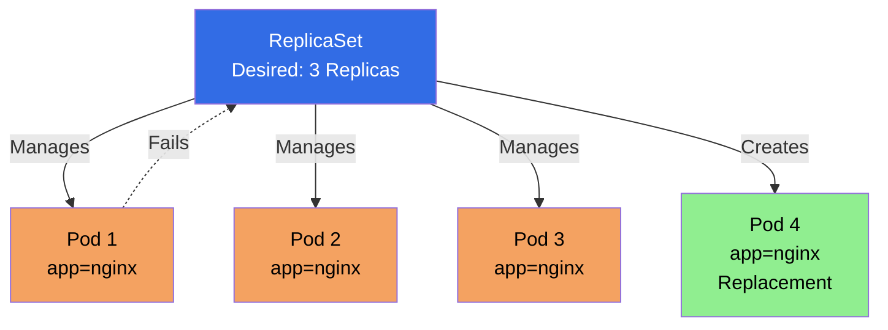
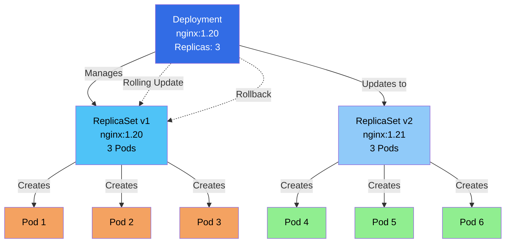
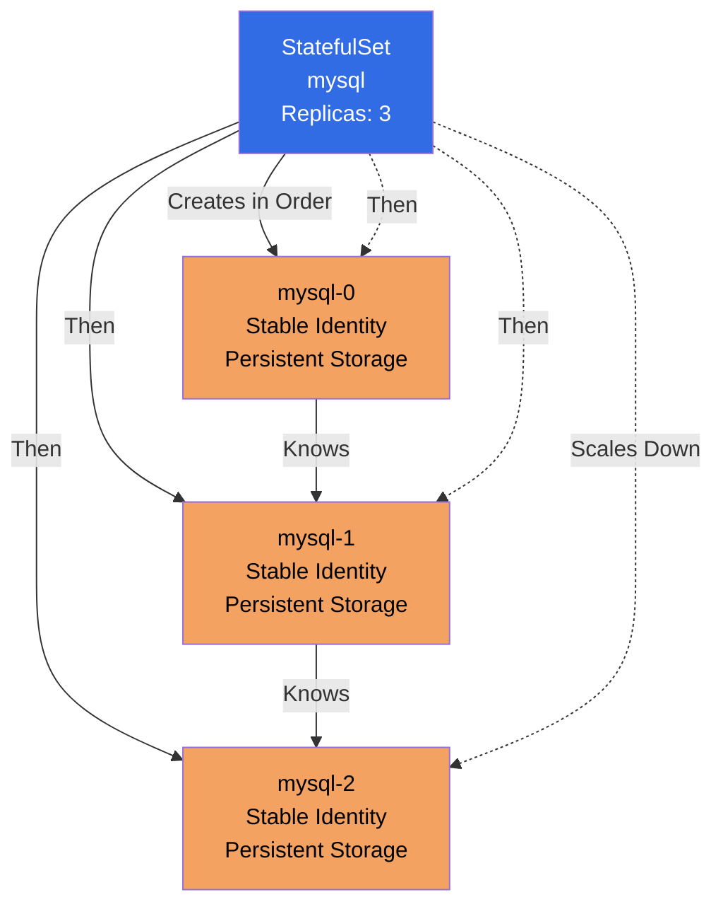
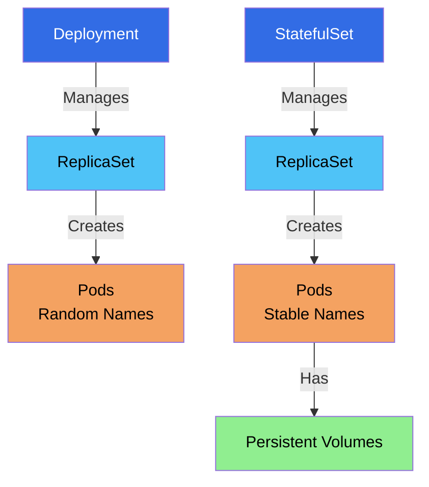
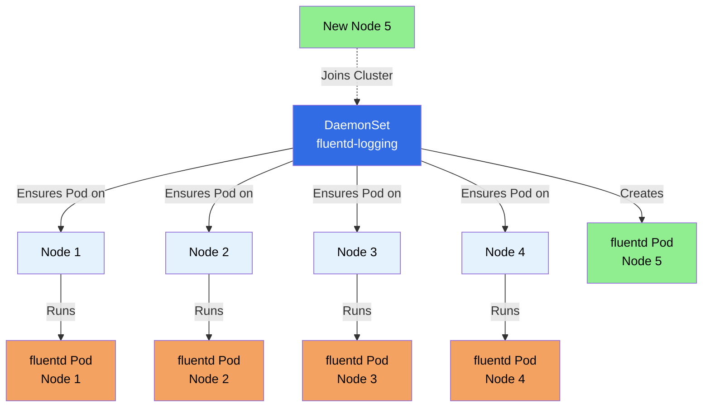
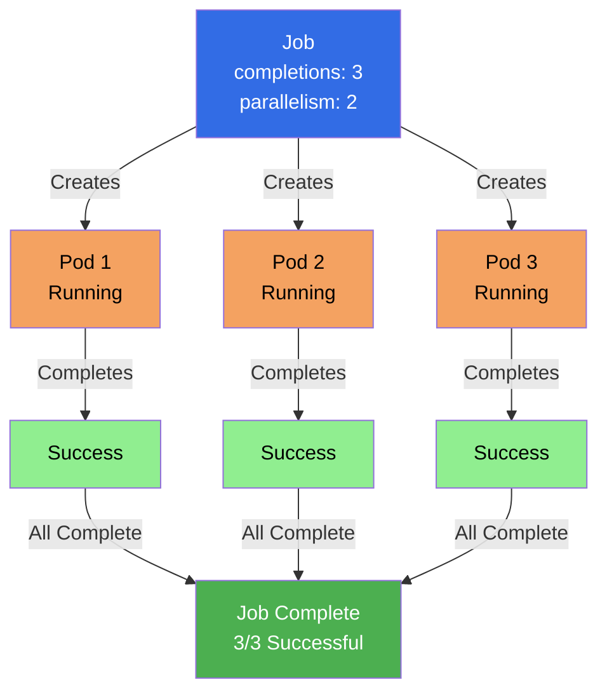
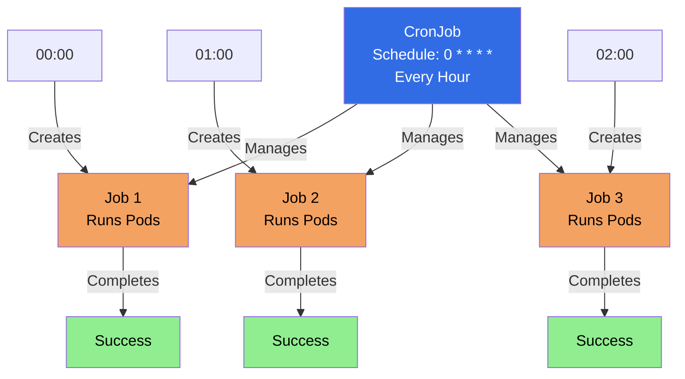

#### ReplicaSet Structure

```yaml
apiVersion: apps/v1
kind: ReplicaSet
metadata:
  name: my-replicaset
spec:
  replicas: 3                    # Desired number of replicas
  selector:                       # Label selector
    matchLabels:
      app: nginx
  template:                       # Pod template
    metadata:
      labels:
        app: nginx
    spec:
      containers:
      - name: nginx
        image: nginx:latest
```

#### ReplicaSet Spec Fields Explained

**apiVersion:**
- API version for ReplicaSet
- Required: `apps/v1`

**kind:**
- Object type
- Required: `ReplicaSet`

**metadata:**
- Object metadata (name, namespace, labels, annotations)
- **name:** ReplicaSet name (required)
- **namespace:** Namespace (optional, defaults to default)
- **labels:** Key-value pairs for organization
- **annotations:** Additional metadata

**spec:**
- ReplicaSet specification
- **replicas:** Desired number of pod replicas (default: 1)
- **selector:** Label selector to identify pods
  - **matchLabels:** Equality-based selector (key-value pairs)
  - **matchExpressions:** Set-based selector (operators: In, NotIn, Exists, DoesNotExist)
- **template:** Pod template (required)
  - **metadata:** Pod metadata (labels must match selector)
  - **spec:** Pod specification (containers, volumes, etc.)

**Important Notes:**
- Template labels **must match** selector labels
- ReplicaSet manages pods matching the selector
- If pods exist with matching labels, ReplicaSet adopts them

#### Creating ReplicaSet

**Method 1: Using YAML**

```yaml
apiVersion: apps/v1
kind: ReplicaSet
metadata:
  name: nginx-replicaset
  namespace: nginx
spec:
  replicas: 3
  selector:
    matchLabels:
      app: nginx
  template:
    metadata:
      labels:
        app: nginx
    spec:
      containers:
      - name: nginx
        image: nginx
```

```bash
kubectl apply -f replicaset.yaml
```

**Method 2: Using kubectl**

```bash
# Create ReplicaSet imperatively
kubectl create replicaset nginx-rs --image=nginx:latest --replicas=3
```

#### Managing ReplicaSet

```bash
# List ReplicaSets
kubectl get replicasets
kubectl get rs

# Get ReplicaSet details
kubectl get rs <replicaset-name>

# Describe ReplicaSet
kubectl describe rs <replicaset-name>

# Scale ReplicaSet
kubectl scale rs <replicaset-name> --replicas=5

# Delete ReplicaSet (pods are also deleted)
kubectl delete rs <replicaset-name>

# Delete ReplicaSet but keep pods
kubectl delete rs <replicaset-name> --cascade=orphan
```

#### How ReplicaSet Works

1. **ReplicaSet watches for pods** matching its selector
2. **If pods < desired:** Creates new pods
3. **If pods > desired:** Deletes excess pods
4. **If pod fails:** ReplicaSet creates replacement
5. **Continuous reconciliation:** Maintains desired state

#### ReplicaSet Selector

**Label Selector:**
```yaml
selector:
  matchLabels:
    app: nginx
    env: production
```

**Match Expressions:**
```yaml
selector:
  matchExpressions:
  - key: app
    operator: In
    values:
    - nginx
    - apache
```

#### ReplicaSet vs Manual Pod Management

**Without ReplicaSet:**
- Pod fails → Manual intervention needed
- Need to manually create replacement
- No automatic scaling

**With ReplicaSet:**
- Pod fails → Automatically replaced
- Maintains desired count
- Self-healing

#### ReplicaSet Best Practices

1. **Don't create ReplicaSets directly** - Use Deployments instead
2. **Match labels correctly** - Template labels must match selector
3. **Use meaningful labels** - For better organization
4. **Set appropriate replicas** - Based on workload requirements

#### Example Reference

For a practical example of a ReplicaSet YAML file, check out:

- **[nginx/replicaset.yml](https://github.com/jayeshjd555/Kubernetes/blob/main/nginx/replicaset.yml)** - Example ReplicaSet definition

This example demonstrates:
- ReplicaSet structure with replicas
- Label selector configuration
- Pod template definition

**📚 Tutorial:**
- **[Workloads Tutorial](https://github.com/jayeshjd555/Kubernetes/blob/main/tutorials/02-workloads/README.md)** - Hands-on tutorial covering Deployments and ReplicaSets
- Basic ReplicaSet pattern

**To use this example:**
```bash
# Apply the ReplicaSet
kubectl apply -f nginx/replicaset.yml

# View the ReplicaSet
kubectl get rs -n nginx

# View pods created by ReplicaSet
kubectl get pods -n nginx -l app=nginx

# Scale the ReplicaSet
kubectl scale rs nginx-replicaset --replicas=5 -n nginx
```

#### Key Takeaways

1. **ReplicaSet maintains pod replicas** - Ensures desired count
2. **Self-healing** - Automatically replaces failed pods
3. **Label-based selection** - Uses selectors to identify pods
4. **Usually managed by Deployments** - Don't create directly
5. **Template must match selector** - Labels in template must match selector

---

### Deployments

**Deployment** is a higher-level concept that manages ReplicaSets and provides declarative updates for Pods. It's the recommended way to manage stateless applications in Kubernetes.

#### What is a Deployment?

A Deployment provides:
- **Declarative updates** for Pods and ReplicaSets
- **Rolling updates** and rollbacks
- **Replica management** (via ReplicaSet)
- **Self-healing** capabilities

**Key Characteristics:**
- **Manages ReplicaSets:** Creates and manages ReplicaSets
- **Rolling Updates:** Updates pods with zero downtime
- **Rollback:** Can rollback to previous versions
- **History:** Maintains revision history
- **Recommended:** Preferred way to manage stateless apps

#### Deployment Diagram



#### Deployment Structure

```yaml
apiVersion: apps/v1
kind: Deployment
metadata:
  name: nginx-deployment
spec:
  replicas: 3
  selector:
    matchLabels:
      app: nginx
  template:
    metadata:
      labels:
        app: nginx
    spec:
      containers:
      - name: nginx
        image: nginx:1.21
        ports:
        - containerPort: 80
  strategy:
    type: RollingUpdate
    rollingUpdate:
      maxSurge: 1
      maxUnavailable: 0
```

#### Deployment Spec Fields Explained

**apiVersion:**
- API version for Deployment
- Required: `apps/v1`

**kind:**
- Object type
- Required: `Deployment`

**metadata:**
- Object metadata (name, namespace, labels, annotations)
- **name:** Deployment name (required)
- **namespace:** Namespace (optional, defaults to default)
- **labels:** Key-value pairs for organization
- **annotations:** Additional metadata

**spec:**
- Deployment specification
- **replicas:** Desired number of pod replicas (default: 1)
- **selector:** Label selector to identify pods
  - **matchLabels:** Equality-based selector (key-value pairs)
  - **matchExpressions:** Set-based selector (operators: In, NotIn, Exists, DoesNotExist)
- **template:** Pod template (required)
  - **metadata:** Pod metadata (labels must match selector)
  - **spec:** Pod specification (containers, volumes, etc.)
- **strategy:** Update strategy (optional)
  - **type:** `RollingUpdate` (default) or `Recreate`
  - **rollingUpdate:** Rolling update configuration
    - **maxSurge:** Maximum number of pods that can be created above desired (default: 25%)
    - **maxUnavailable:** Maximum number of pods that can be unavailable (default: 25%)
- **revisionHistoryLimit:** Number of old ReplicaSets to retain (default: 10)
- **progressDeadlineSeconds:** Maximum time to wait for Deployment to progress (default: 600s)
- **minReadySeconds:** Minimum seconds a pod must be ready (default: 0)

**Important Notes:**
- Template labels **must match** selector labels
- Deployment creates and manages ReplicaSets
- Each update creates a new ReplicaSet
- Old ReplicaSets are kept for rollback

#### Creating Deployments

**Method 1: Using YAML (Recommended)**

```yaml
apiVersion: apps/v1
kind: Deployment
metadata:
  name: nginx-deployment
  namespace: nginx
spec:
  replicas: 3
  selector:
    matchLabels:
      app: nginx
  template:
    metadata:
      labels:
        app: nginx
    spec:
      containers:
      - name: nginx
        image: nginx
```

```bash
kubectl apply -f deployment.yaml
```

**Method 2: Using kubectl**

```bash
# Create deployment
kubectl create deployment nginx --image=nginx:latest

# Create with replicas
kubectl create deployment nginx --image=nginx:latest --replicas=3
```

#### Managing Deployments

```bash
# List deployments
kubectl get deployments
kubectl get deploy

# Get deployment details
kubectl get deployment <deployment-name>

# Describe deployment
kubectl describe deployment <deployment-name>

# Scale deployment
kubectl scale deployment <deployment-name> --replicas=5

# Update deployment (change image)
kubectl set image deployment/<deployment-name> nginx=nginx:1.21

# Rollout status
kubectl rollout status deployment/<deployment-name>

# Rollout history
kubectl rollout history deployment/<deployment-name>

# Rollback to previous version
kubectl rollout undo deployment/<deployment-name>

# Rollback to specific revision
kubectl rollout undo deployment/<deployment-name> --to-revision=2

# Pause rollout
kubectl rollout pause deployment/<deployment-name>

# Resume rollout
kubectl rollout resume deployment/<deployment-name>

# Delete deployment
kubectl delete deployment <deployment-name>
```

#### Deployment Update Strategies

**Rolling Update (Default):**

```yaml
spec:
  strategy:
    type: RollingUpdate
    rollingUpdate:
      maxSurge: 1           # Can have 1 extra pod during update
      maxUnavailable: 0    # No pods unavailable during update
```

**Recreate:**

```yaml
spec:
  strategy:
    type: Recreate         # Terminates old pods before creating new ones
```

#### Rolling Update Process

```
Current State: 3 pods running nginx:1.20
    ↓
Update to nginx:1.21
    ↓
1. Create new ReplicaSet with nginx:1.21
2. Scale up new ReplicaSet (1 pod)
3. Scale down old ReplicaSet (1 pod)
4. Continue until all pods updated
    ↓
Final State: 3 pods running nginx:1.21
```

#### Deployment Rollback

```bash
# View rollout history
kubectl rollout history deployment/nginx-deployment

# Rollback to previous version
kubectl rollout undo deployment/nginx-deployment

# Rollback to specific revision
kubectl rollout undo deployment/nginx-deployment --to-revision=2

# View specific revision
kubectl rollout history deployment/nginx-deployment --revision=2
```

#### Deployment Status

```bash
# Check deployment status
kubectl get deployment <deployment-name>

# Output shows:
# NAME               READY   UP-TO-DATE   AVAILABLE   AGE
# nginx-deployment   3/3     3            3           5m

# READY: Current/Desired replicas
# UP-TO-DATE: Replicas updated to latest
# AVAILABLE: Replicas available for traffic
```

#### Deployment Conditions

Deployments have conditions:
- **Available:** Deployment has minimum availability
- **Progressing:** Deployment is progressing
- **ReplicaFailure:** ReplicaSet creation failed

#### Deployment Best Practices

1. **Use Deployments for stateless apps** - Not for stateful applications
2. **Set resource limits** - In pod template
3. **Use health checks** - Liveness and readiness probes
4. **Use specific image tags** - Not `latest`
5. **Set update strategy** - RollingUpdate or Recreate
6. **Use labels consistently** - For selection and organization
7. **Monitor rollout status** - Check during updates

#### Example Reference

For a practical example of a Deployment YAML file, check out:

- **[nginx/deployment.yml](https://github.com/jayeshjd555/Kubernetes/blob/main/nginx/deployment.yml)** - Example Deployment definition

This example demonstrates:
- Deployment structure with replicas
- Label selector configuration

**📚 Tutorial:**
- **[Workloads Tutorial](https://github.com/jayeshjd555/Kubernetes/blob/main/tutorials/02-workloads/README.md)** - Step-by-step tutorial to create, scale, and update Deployments
- Pod template definition
- Basic Deployment pattern

**To use this example:**
```bash
# Apply the Deployment
kubectl apply -f nginx/deployment.yml

# View the Deployment
kubectl get deployment -n nginx

# View pods created by Deployment
kubectl get pods -n nginx -l app=nginx

# Scale the Deployment
kubectl scale deployment nginx-deployment --replicas=5 -n nginx

# Update the image
kubectl set image deployment/nginx-deployment nginx=nginx:1.21 -n nginx

# Check rollout status
kubectl rollout status deployment/nginx-deployment -n nginx
```

#### Key Takeaways

1. **Deployments manage ReplicaSets** - Higher-level abstraction
2. **Rolling updates** - Zero-downtime updates
3. **Rollback capability** - Can revert to previous versions
4. **Recommended for stateless apps** - Standard way to deploy
5. **Self-healing** - Automatically replaces failed pods
6. **Revision history** - Tracks changes for rollback

---

### StatefulSet

**StatefulSet** manages stateful applications and provides guarantees about the ordering and uniqueness of Pods. Unlike Deployments, StatefulSets maintain a sticky identity for each Pod.

#### What is a StatefulSet?

A StatefulSet provides:
- **Stable network identity** - Each pod gets stable hostname
- **Stable storage** - Each pod gets persistent storage
- **Ordered deployment** - Pods created in order
- **Ordered scaling** - Pods scaled up/down in order
- **Ordered updates** - Pods updated in reverse order

**Key Characteristics:**
- **Stable Identity:** Pod name and hostname don't change
- **Persistent Storage:** Each pod gets its own volume
- **Ordered Operations:** Deploy, scale, update in order
- **Stateful Apps:** Designed for databases, queues, etc.

#### StatefulSet Diagram



#### StatefulSet Structure

```yaml
apiVersion: apps/v1
kind: StatefulSet
metadata:
  name: mysql
spec:
  serviceName: mysql-headless    # Headless service name
  replicas: 3
  selector:
    matchLabels:
      app: mysql
  template:
    metadata:
      labels:
        app: mysql
    spec:
      containers:
      - name: mysql
        image: mysql:8.0
        volumeMounts:
        - name: data
          mountPath: /var/lib/mysql
  volumeClaimTemplates:          # Persistent volume for each pod
  - metadata:
      name: data
    spec:
      accessModes: ["ReadWriteOnce"]
      resources:
        requests:
          storage: 10Gi
```

#### StatefulSet Spec Fields Explained

**apiVersion:**
- API version for StatefulSet
- Required: `apps/v1`

**kind:**
- Object type
- Required: `StatefulSet`

**metadata:**
- Object metadata (name, namespace, labels, annotations)
- **name:** StatefulSet name (required)
- **namespace:** Namespace (optional, defaults to default)
- **labels:** Key-value pairs for organization
- **annotations:** Additional metadata

**spec:**
- StatefulSet specification
- **serviceName:** Name of headless service (required) - Provides stable network identity
- **replicas:** Desired number of pod replicas (default: 1)
- **selector:** Label selector to identify pods
  - **matchLabels:** Equality-based selector (key-value pairs)
  - **matchExpressions:** Set-based selector (operators: In, NotIn, Exists, DoesNotExist)
- **template:** Pod template (required)
  - **metadata:** Pod metadata (labels must match selector)
  - **spec:** Pod specification (containers, volumes, etc.)
- **volumeClaimTemplates:** Persistent volume claim templates (optional)
  - Creates a PVC for each pod
  - Each pod gets its own persistent volume
  - PVC name format: `<volumeClaimTemplate-name>-<pod-name>`
- **updateStrategy:** Update strategy (optional)
  - **type:** `RollingUpdate` (default) or `OnDelete`
  - **rollingUpdate:** Rolling update configuration
    - **partition:** Pods with index >= partition are updated (default: 0)
- **podManagementPolicy:** Pod management policy (optional)
  - `OrderedReady` (default): Pods created/terminated in order
  - `Parallel`: Pods created/terminated in parallel
- **revisionHistoryLimit:** Number of old ControllerRevisions to retain (default: 10)

**Important Notes:**
- **serviceName is required** - Must reference a headless Service
- Template labels **must match** selector labels
- Pods get stable names: `<statefulset-name>-<ordinal>` (e.g., mysql-0, mysql-1)
- Each pod gets its own PVC from volumeClaimTemplates
- Pods are created/updated/deleted in order

#### Creating StatefulSet

```yaml
apiVersion: apps/v1
kind: StatefulSet
metadata:
  name: mysql
spec:
  serviceName: mysql
  replicas: 3
  selector:
    matchLabels:
      app: mysql
  template:
    metadata:
      labels:
        app: mysql
    spec:
      containers:
      - name: mysql
        image: mysql:8.0
        env:
        - name: MYSQL_ROOT_PASSWORD
          value: "password"
        volumeMounts:
        - name: data
          mountPath: /var/lib/mysql
  volumeClaimTemplates:
  - metadata:
      name: data
    spec:
      accessModes: ["ReadWriteOnce"]
      resources:
        requests:
          storage: 10Gi
```

#### Managing StatefulSet

```bash
# List StatefulSets
kubectl get statefulsets
kubectl get sts

# Get StatefulSet details
kubectl get sts <statefulset-name>

# Describe StatefulSet
kubectl describe sts <statefulset-name>

# Scale StatefulSet
kubectl scale sts <statefulset-name> --replicas=5

# Update StatefulSet
kubectl set image sts/<statefulset-name> mysql=mysql:8.0.28

# Delete StatefulSet
kubectl delete sts <statefulset-name>

# Delete StatefulSet but keep pods
kubectl delete sts <statefulset-name> --cascade=orphan
```

#### StatefulSet Pod Identity

**Stable Network Identity:**

```bash
# Pods get stable names
mysql-0
mysql-1
mysql-2

# Stable hostname
mysql-0.mysql.default.svc.cluster.local
mysql-1.mysql.default.svc.cluster.local
mysql-2.mysql.default.svc.cluster.local
```

**Stable Storage:**

```bash
# Each pod gets its own PVC
data-mysql-0
data-mysql-1
data-mysql-2
```

#### StatefulSet Ordering

**Deployment Order:**
1. Create mysql-0, wait for Ready
2. Create mysql-1, wait for Ready
3. Create mysql-2, wait for Ready

**Scaling Down Order:**
1. Terminate mysql-2
2. Terminate mysql-1
3. Terminate mysql-0

**Scaling Up Order:**
1. Create mysql-3
2. Create mysql-4
3. etc.

#### Headless Service

StatefulSets require a Headless Service:

```yaml
apiVersion: v1
kind: Service
metadata:
  name: mysql
spec:
  clusterIP: None              # Headless service
  selector:
    app: mysql
  ports:
  - port: 3306
```

**Why Headless Service?**
- Provides stable network identity
- Each pod gets DNS entry
- Enables direct pod-to-pod communication

#### StatefulSet Update Strategies

**Rolling Update (Default):**

```yaml
spec:
  updateStrategy:
    type: RollingUpdate
    rollingUpdate:
      partition: 2    # Update pods with index >= 2
```

**OnDelete:**

```yaml
spec:
  updateStrategy:
    type: OnDelete    # Update only when pod is deleted
```

#### StatefulSet Use Cases

**Databases:**
- MySQL, PostgreSQL, MongoDB
- Need stable identity and storage
- Ordered operations

**Message Queues:**
- RabbitMQ, Kafka
- Need stable identity
- Ordered scaling

**Distributed Systems:**
- Elasticsearch, Cassandra
- Need stable network identity
- Ordered operations

#### StatefulSet Best Practices

1. **Use for stateful applications** - Databases, queues, etc.
2. **Create Headless Service first** - Required for StatefulSet
3. **Use volumeClaimTemplates** - For persistent storage
4. **Plan scaling carefully** - Ordered operations take time
5. **Use init containers** - For initialization logic
6. **Set resource limits** - In pod template
7. **Use health checks** - Liveness and readiness probes

#### Key Takeaways

1. **StatefulSets for stateful apps** - Databases, queues, etc.
2. **Stable identity** - Pod names and hostnames don't change
3. **Persistent storage** - Each pod gets its own volume
4. **Ordered operations** - Deploy, scale, update in order
5. **Requires Headless Service** - For stable network identity
6. **Slower than Deployments** - Due to ordering requirements

---

### Comparison: ReplicaSet vs Deployment vs StatefulSet

#### Quick Comparison Table

| Feature | ReplicaSet | Deployment | StatefulSet |
|---------|-----------|------------|-------------|
| **Purpose** | Maintain pod replicas | Manage stateless apps | Manage stateful apps |
| **Updates** | Manual | Rolling updates | Ordered updates |
| **Rollback** | ❌ No | ✅ Yes | ✅ Yes |
| **Pod Identity** | Random | Random | Stable |
| **Storage** | Ephemeral | Ephemeral | Persistent |
| **Ordering** | ❌ No | ❌ No | ✅ Yes |
| **Use Case** | Lower-level | Stateless apps | Stateful apps |
| **Service** | Regular/Headless | Regular | Headless required |
| **Scaling** | Instant | Instant | Ordered |
| **Naming** | Random | Random | Sequential (app-0, app-1) |

#### Detailed Differences

**1. Purpose and Abstraction Level**

- **ReplicaSet:** Low-level, maintains pod count
- **Deployment:** High-level, manages ReplicaSets with updates
- **StatefulSet:** High-level, manages stateful applications

**2. Pod Identity**

- **ReplicaSet:** Random pod names (e.g., `nginx-abc123`)
- **Deployment:** Random pod names (e.g., `nginx-deployment-abc123`)
- **StatefulSet:** Stable, sequential names (e.g., `mysql-0`, `mysql-1`)

**3. Storage**

- **ReplicaSet:** Ephemeral storage only
- **Deployment:** Ephemeral storage only
- **StatefulSet:** Persistent storage per pod (via volumeClaimTemplates)

**4. Updates**

- **ReplicaSet:** Manual pod replacement
- **Deployment:** Automatic rolling updates
- **StatefulSet:** Ordered rolling updates

**5. Rollback**

- **ReplicaSet:** ❌ No rollback capability
- **Deployment:** ✅ Rollback to previous revisions
- **StatefulSet:** ✅ Rollback capability

**6. Scaling**

- **ReplicaSet:** Instant, no ordering
- **Deployment:** Instant, no ordering
- **StatefulSet:** Ordered (one at a time)

**7. Network Identity**

- **ReplicaSet:** Random IP, no stable DNS
- **Deployment:** Random IP, no stable DNS
- **StatefulSet:** Stable hostname, stable DNS

**8. Use Cases**

- **ReplicaSet:** Lower-level pod management (usually via Deployment)
- **Deployment:** Web servers, APIs, stateless microservices
- **StatefulSet:** Databases, message queues, distributed systems

#### When to Use What?

**Use ReplicaSet when:**
- ⚠️ **Don't use directly** - Use Deployment instead
- Only if you need very basic pod management
- Lower-level control needed

**Use Deployment when:**
- ✅ **Stateless applications** - Web servers, APIs
- ✅ **Need rolling updates** - Zero-downtime updates
- ✅ **Need rollback** - Ability to revert changes
- ✅ **Most common use case** - Default for stateless apps

**Use StatefulSet when:**
- ✅ **Stateful applications** - Databases, queues
- ✅ **Need stable identity** - Pod names must be stable
- ✅ **Need persistent storage** - Each pod needs its own storage
- ✅ **Need ordered operations** - Deploy/scale in order

#### Relationship Diagram



#### Summary

- **ReplicaSet:** Basic pod replica management (low-level)
- **Deployment:** Stateless app management with updates (recommended for most cases)
- **StatefulSet:** Stateful app management with stable identity (for databases, queues)

**Best Practice:** Use Deployments for stateless applications and StatefulSets for stateful applications. ReplicaSets are typically managed by Deployments and StatefulSets, not created directly.

---

### DaemonSet

**DaemonSet** ensures that a copy of a Pod runs on all (or specific) nodes in the cluster. It's used for system-level services that need to run on every node.

#### What is a DaemonSet?

A DaemonSet ensures that:
- A copy of a Pod runs on **all nodes** in the cluster
- Or on **selected nodes** (using node selectors)
- Pods are automatically added when new nodes join
- Pods are automatically removed when nodes are removed

**Key Characteristics:**
- **One Pod per Node:** Ensures one pod on each node
- **Node-Specific:** Pods are tied to specific nodes
- **Automatic Management:** Adds/removes pods as nodes join/leave
- **System Services:** Perfect for logging, monitoring, networking

#### DaemonSet Diagram



#### DaemonSet Structure

```yaml
apiVersion: apps/v1
kind: DaemonSet
metadata:
  name: fluentd-logging
spec:
  selector:
    matchLabels:
      name: fluentd-logging
  template:
    metadata:
      labels:
        name: fluentd-logging
    spec:
      containers:
      - name: fluentd
        image: fluent/fluentd:latest
        volumeMounts:
        - name: varlog
          mountPath: /var/log
        - name: varlibdockercontainers
          mountPath: /var/lib/docker/containers
          readOnly: true
      volumes:
      - name: varlog
        hostPath:
          path: /var/log
      - name: varlibdockercontainers
        hostPath:
          path: /var/lib/docker/containers
```

#### DaemonSet Spec Fields Explained

**apiVersion:**
- API version for DaemonSet
- Required: `apps/v1`

**kind:**
- Object type
- Required: `DaemonSet`

**metadata:**
- Object metadata (name, namespace, labels, annotations)
- **name:** DaemonSet name (required)
- **namespace:** Namespace (optional, defaults to default)
- **labels:** Key-value pairs for organization
- **annotations:** Additional metadata

**spec:**
- DaemonSet specification
- **selector:** Label selector to identify pods (required)
  - **matchLabels:** Equality-based selector (key-value pairs)
  - **matchExpressions:** Set-based selector (operators: In, NotIn, Exists, DoesNotExist)
- **template:** Pod template (required)
  - **metadata:** Pod metadata (labels must match selector)
  - **spec:** Pod specification (containers, volumes, etc.)
    - Can include **nodeSelector** to run on specific nodes
    - Can include **affinity** for node affinity rules
    - Can include **tolerations** to run on tainted nodes
- **updateStrategy:** Update strategy (optional)
  - **type:** `RollingUpdate` (default) or `OnDelete`
  - **rollingUpdate:** Rolling update configuration
    - **maxUnavailable:** Maximum number of pods unavailable during update (default: 1)
- **revisionHistoryLimit:** Number of old ControllerRevisions to retain (default: 10)
- **minReadySeconds:** Minimum seconds a pod must be ready (default: 0)

**Important Notes:**
- **No replicas field** - Number of pods = number of nodes (or selected nodes)
- Template labels **must match** selector labels
- DaemonSet ensures one pod per node (or per selected node)
- Pods are automatically created when nodes join
- Pods are automatically deleted when nodes are removed
- Use **nodeSelector** or **affinity** to run on specific nodes
- Use **tolerations** to run on tainted nodes (e.g., master nodes)

#### Creating DaemonSet

**Method 1: Using YAML (Recommended)**

```yaml
apiVersion: apps/v1
kind: DaemonSet
metadata:
  name: nginx-daemonset
  namespace: nginx
spec:
  selector:
    matchLabels:
      app: nginx
  template:
    metadata:
      labels:
        app: nginx
    spec:
      containers:
      - name: nginx
        image: nginx
```

```bash
kubectl apply -f daemonset.yaml
```

**Method 2: Using kubectl**

```bash
# Create DaemonSet imperatively
kubectl create daemonset nginx-ds --image=nginx:latest
```

#### Managing DaemonSet

```bash
# List DaemonSets
kubectl get daemonsets
kubectl get ds

# Get DaemonSet details
kubectl get ds <daemonset-name>

# Describe DaemonSet
kubectl describe ds <daemonset-name>

# View pods created by DaemonSet
kubectl get pods -l app=nginx

# Update DaemonSet (change image)
kubectl set image ds/<daemonset-name> nginx=nginx:1.21

# Delete DaemonSet
kubectl delete ds <daemonset-name>

# Delete DaemonSet but keep pods
kubectl delete ds <daemonset-name> --cascade=orphan
```

#### Node Selection

**Run on All Nodes (Default):**

```yaml
spec:
  template:
    spec:
      containers:
      - name: nginx
        image: nginx:latest
```

**Run on Specific Nodes (Node Selector):**

```yaml
spec:
  template:
    spec:
      nodeSelector:
        disktype: ssd
      containers:
      - name: nginx
        image: nginx:latest
```

**Run on Specific Nodes (Node Affinity):**

```yaml
spec:
  template:
    spec:
      affinity:
        nodeAffinity:
          requiredDuringSchedulingIgnoredDuringExecution:
            nodeSelectorTerms:
            - matchExpressions:
              - key: zone
                operator: In
                values:
                - us-east-1a
      containers:
      - name: nginx
        image: nginx:latest
```

#### DaemonSet Use Cases

**1. Logging Agents**
- Fluentd, Filebeat, Logstash
- Collect logs from all nodes
- Centralized logging

**2. Monitoring Agents**
- Prometheus Node Exporter
- Datadog Agent
- Collect metrics from all nodes

**3. Network Plugins**
- CNI plugins
- Network policy agents
- Run on every node

**4. Storage Daemons**
- GlusterFS, Ceph
- Storage management
- Run on storage nodes

**5. Security Agents**
- Security scanners
- Antivirus agents
- Run on all nodes

#### DaemonSet vs Deployment

| Aspect | DaemonSet | Deployment |
|--------|-----------|------------|
| **Pods per Node** | One pod per node | Fixed number of pods |
| **Scaling** | Automatic (based on nodes) | Manual scaling |
| **Node Selection** | All or selected nodes | Any available node |
| **Use Case** | System services | Application services |
| **Replicas** | Not specified | Specified in spec |

#### DaemonSet Update Strategy

**Rolling Update (Default):**

```yaml
spec:
  updateStrategy:
    type: RollingUpdate
    rollingUpdate:
      maxUnavailable: 1    # Max pods unavailable during update
```

**OnDelete:**

```yaml
spec:
  updateStrategy:
    type: OnDelete    # Update only when pod is deleted manually
```

#### DaemonSet Status

```bash
# Check DaemonSet status
kubectl get ds <daemonset-name>

# Output shows:
# NAME              DESIRED   CURRENT   READY   UP-TO-DATE   AVAILABLE   NODE SELECTOR   AGE
# fluentd-logging   3         3         3       3            3           <none>          5m

# DESIRED: Number of nodes that should have pod
# CURRENT: Number of pods currently running
# READY: Number of pods ready
# UP-TO-DATE: Number of pods updated to latest
# AVAILABLE: Number of pods available
```

#### DaemonSet Best Practices

1. **Use for system services** - Logging, monitoring, networking
2. **Set resource limits** - Prevent resource exhaustion
3. **Use hostPath volumes carefully** - Security implications
4. **Set node selectors** - Run only on specific nodes when needed
5. **Use tolerations** - Run on tainted nodes if needed
6. **Set update strategy** - RollingUpdate or OnDelete
7. **Use labels consistently** - For organization

#### Tolerations for Tainted Nodes

DaemonSets can run on tainted nodes using tolerations:

```yaml
spec:
  template:
    spec:
      tolerations:
      - key: "node-role.kubernetes.io/master"
        operator: "Exists"
        effect: "NoSchedule"
      containers:
      - name: nginx
        image: nginx:latest
```

#### DaemonSet Example: Logging Agent

```yaml
apiVersion: apps/v1
kind: DaemonSet
metadata:
  name: fluentd-logging
  namespace: kube-system
spec:
  selector:
    matchLabels:
      name: fluentd-logging
  template:
    metadata:
      labels:
        name: fluentd-logging
    spec:
      tolerations:
      - key: node-role.kubernetes.io/master
        effect: NoSchedule
      containers:
      - name: fluentd
        image: fluent/fluentd:latest
        resources:
          limits:
            memory: 200Mi
          requests:
            cpu: 100m
            memory: 200Mi
        volumeMounts:
        - name: varlog
          mountPath: /var/log
        - name: varlibdockercontainers
          mountPath: /var/lib/docker/containers
          readOnly: true
      terminationGracePeriodSeconds: 30
      volumes:
      - name: varlog
        hostPath:
          path: /var/log
      - name: varlibdockercontainers
        hostPath:
          path: /var/lib/docker/containers
```

#### DaemonSet Commands Summary

```bash
# Create
kubectl create -f daemonset.yaml
kubectl create daemonset <name> --image=<image>

# Get
kubectl get daemonsets
kubectl get ds
kubectl describe ds <name>

# Update
kubectl set image ds/<name> <container>=<image>
kubectl edit ds <name>

# Delete
kubectl delete ds <name>
kubectl delete -f daemonset.yaml
```

#### Example Reference

For a practical example of a DaemonSet YAML file, check out:

- **[nginx/daemonset.yml](https://github.com/jayeshjd555/Kubernetes/blob/main/nginx/daemonset.yml)** - Example DaemonSet definition

This example demonstrates:
- DaemonSet structure with selector
- Pod template definition
- Basic DaemonSet pattern for nginx
- Namespace configuration

**To use this example:**
```bash
# Apply the DaemonSet
kubectl apply -f nginx/daemonset.yml

# View the DaemonSet
kubectl get ds -n nginx

# View pods created by DaemonSet (one per node)
kubectl get pods -n nginx -l app=nginx

# Check which nodes have the pod
kubectl get pods -n nginx -l app=nginx -o wide

# Update the DaemonSet
kubectl set image ds/nginx-daemonset nginx=nginx:1.21 -n nginx

# Check DaemonSet status
kubectl get ds nginx-daemonset -n nginx
```

#### Key Takeaways

1. **DaemonSet runs one pod per node** - Ensures pod on all/selected nodes
2. **Automatic management** - Adds pods when nodes join, removes when nodes leave
3. **Perfect for system services** - Logging, monitoring, networking agents
4. **Node selection** - Can run on all nodes or selected nodes
5. **No replicas field** - Number of pods = number of nodes (or selected nodes)
6. **Use tolerations** - To run on tainted nodes (like master nodes)
7. **Update strategies** - RollingUpdate or OnDelete
8. **HostPath volumes** - Common for accessing node filesystem

DaemonSets are essential for running system-level services that need to be present on every node in your cluster.

---

### Jobs

**Jobs** create one or more Pods and ensure that a specified number of them successfully terminate. Jobs are used for batch processing, one-time tasks, and workloads that need to run to completion.

#### What is a Job?

A Job creates Pods that run until completion (success or failure). Unlike Deployments, Jobs are designed for:
- **One-time tasks** - Tasks that run once and complete
- **Batch processing** - Processing data in batches
- **Workloads that must complete** - Tasks that need to finish successfully

**Key Characteristics:**
- **Runs to completion** - Pods run until they succeed or fail
- **Retry on failure** - Can retry failed pods
- **Parallel execution** - Can run multiple pods in parallel
- **Completion tracking** - Tracks successful completions

#### Job Diagram



#### Job YAML Structure

```yaml
apiVersion: batch/v1
kind: Job
metadata:
  name: my-job
  namespace: default
spec:
  completions: 1          # Number of successful completions needed
  parallelism: 1         # Number of pods to run in parallel
  backoffLimit: 6        # Number of retries before marking as failed
  activeDeadlineSeconds: 300  # Maximum time job can run (seconds)
  template:
    metadata:
      labels:
        app: batch-task
    spec:
      restartPolicy: Never  # Never, OnFailure, Always
      containers:
      - name: task-container
        image: busybox:latest
        command: ["sh", "-c", "echo Hello World && sleep 10"]
```

#### Job Spec Fields Explained

**completions:**
- Number of successful completions required
- Job completes when this many pods succeed
- Default: 1

**parallelism:**
- Number of pods to run in parallel
- Can be less than or equal to completions
- Default: 1

**backoffLimit:**
- Number of retries before marking job as failed
- Default: 6

**activeDeadlineSeconds:**
- Maximum time (seconds) the job can run
- Job is terminated if exceeded
- Optional

**restartPolicy:**
- **Never:** Don't restart (default for Jobs)
- **OnFailure:** Restart only on failure
- **Always:** Always restart (not recommended for Jobs)

#### Creating Jobs

**Method 1: Using YAML (Recommended)**

```yaml
apiVersion: batch/v1
kind: Job
metadata:
  name: demo-job
  namespace: nginx
spec:
  completions: 1
  parallelism: 1
  template:
    metadata:
      labels:
        app: batch-task
    spec:
      containers:
      - name: batch-container
        image: busybox:latest
        command: ["sh", "-c", "echo Hello Dosto! && sleep 10"]
      restartPolicy: Never
```

```bash
kubectl apply -f job.yaml
```

**Method 2: Using kubectl**

```bash
# Create job imperatively
kubectl create job my-job --image=busybox -- echo "Hello World"

# Create job with command
kubectl create job my-job --image=busybox -- sh -c "echo Hello && sleep 10"
```

#### Managing Jobs

```bash
# List jobs
kubectl get jobs
kubectl get job

# Get job details
kubectl get job <job-name>

# Describe job
kubectl describe job <job-name>

# View pods created by job
kubectl get pods -l job-name=<job-name>

# View job logs
kubectl logs job/<job-name>

# Delete job (pods are also deleted)
kubectl delete job <job-name>

# Delete job but keep pods
kubectl delete job <job-name> --cascade=orphan
```

#### Job Types

**1. Non-Parallel Job (completions: 1, parallelism: 1)**
- Runs one pod until completion
- Simplest job type

```yaml
spec:
  completions: 1
  parallelism: 1
```

**2. Fixed Completion Count Job (completions: N, parallelism: 1)**
- Runs N pods sequentially
- Each pod must complete successfully

```yaml
spec:
  completions: 5
  parallelism: 1
```

**3. Parallel Job with Fixed Completion (completions: N, parallelism: M)**
- Runs M pods in parallel
- Continues until N completions

```yaml
spec:
  completions: 10
  parallelism: 3
```

**4. Parallel Job with Work Queue (completions: null, parallelism: M)**
- Runs M pods in parallel
- Continues until all work is done
- Pods coordinate via work queue

```yaml
spec:
  completions: null
  parallelism: 3
```

#### Job Status

```bash
# Check job status
kubectl get job <job-name>

# Output shows:
# NAME      COMPLETIONS   DURATION   AGE
# my-job    1/1           30s         5m

# COMPLETIONS: Successful/Required
# DURATION: Time taken to complete
```

**Job Conditions:**
- **Complete:** Job completed successfully
- **Failed:** Job failed (exceeded backoffLimit)

#### Job Use Cases

**1. Batch Processing**
- Process data files
- Generate reports
- Data transformation

**2. One-Time Tasks**
- Database migrations
- Data imports
- Cleanup tasks

**3. Parallel Processing**
- Process multiple items in parallel
- Distributed computations

**4. Work Queue**
- Process items from a queue
- Distributed task processing

#### Job Best Practices

1. **Set restartPolicy to Never or OnFailure** - Jobs should complete, not restart indefinitely
2. **Set appropriate backoffLimit** - Prevent infinite retries
3. **Set activeDeadlineSeconds** - Prevent jobs from running too long
4. **Use completions and parallelism** - Control job execution
5. **Handle errors properly** - Exit with appropriate codes
6. **Clean up completed jobs** - Delete old jobs to save resources

#### Example Reference

For a practical example of a Job YAML file, check out:

- **[nginx/jobs.yml](https://github.com/jayeshjd555/Kubernetes/blob/main/nginx/jobs.yml)** - Example Job definition

This example demonstrates:
- Job structure with completions and parallelism
- Pod template with container specification
- Command execution in container
- RestartPolicy configuration
- Basic Job pattern

**To use this example:**
```bash
# Apply the Job
kubectl apply -f nginx/jobs.yml

# View the Job
kubectl get job -n nginx

# View pods created by Job
kubectl get pods -n nginx -l app=batch-task

# View job logs
kubectl logs -n nginx -l app=batch-task

# Check job status
kubectl describe job demo-job -n nginx

# Delete the Job
kubectl delete job demo-job -n nginx
```

#### Key Takeaways

1. **Jobs run to completion** - Pods run until they succeed or fail
2. **Use for batch tasks** - One-time tasks, batch processing
3. **Set restartPolicy** - Never or OnFailure (not Always)
4. **Control parallelism** - Use parallelism to run multiple pods
5. **Track completions** - Use completions to specify required successes
6. **Set backoffLimit** - Prevent infinite retries
7. **Clean up jobs** - Delete completed jobs

---

### CronJobs

**CronJob** creates Jobs on a time-based schedule. It's like a cron job in Linux, but for Kubernetes Pods. CronJobs are used for periodic tasks, scheduled backups, and recurring batch jobs.

#### What is a CronJob?

A CronJob creates Jobs on a schedule defined by a cron expression. It:
- **Runs on schedule** - Executes jobs at specified times
- **Creates Job objects** - Each execution creates a new Job
- **Maintains history** - Keeps record of successful and failed jobs
- **Time-based execution** - Uses cron syntax for scheduling

**Key Characteristics:**
- **Scheduled execution** - Runs jobs on a schedule
- **Creates Jobs** - Each run creates a new Job
- **History management** - Maintains job history
- **Time zones** - Can specify timezone

#### CronJob Diagram



#### CronJob YAML Structure

```yaml
apiVersion: batch/v1
kind: CronJob
metadata:
  name: my-cronjob
  namespace: default
spec:
  schedule: "0 * * * *"        # Cron schedule
  timeZone: "America/New_York" # Optional timezone
  startingDeadlineSeconds: 200 # Optional deadline
  concurrencyPolicy: Allow      # Allow, Forbid, Replace
  successfulJobsHistoryLimit: 3 # Keep 3 successful jobs
  failedJobsHistoryLimit: 1     # Keep 1 failed job
  suspend: false                # Set to true to suspend
  jobTemplate:
    spec:
      completions: 1
      parallelism: 1
      template:
        metadata:
          labels:
            app: scheduled-task
        spec:
          restartPolicy: OnFailure
          containers:
          - name: task-container
            image: busybox:latest
            command: ["sh", "-c", "echo Scheduled task && date"]
```

#### Cron Schedule Format

**Cron Expression:**
```
┌───────────── minute (0 - 59)
│ ┌───────────── hour (0 - 23)
│ │ ┌───────────── day of month (1 - 31)
│ │ │ ┌───────────── month (1 - 12)
│ │ │ │ ┌───────────── day of week (0 - 6) (Sunday to Saturday)
│ │ │ │ │
* * * * *
```

**Common Examples:**

```yaml
# Every minute
schedule: "* * * * *"

# Every hour (at minute 0)
schedule: "0 * * * *"

# Every day at midnight
schedule: "0 0 * * *"

# Every day at 2:30 AM
schedule: "30 2 * * *"

# Every Monday at 9:00 AM
schedule: "0 9 * * 1"

# Every first day of month at midnight
schedule: "0 0 1 * *"

# Every 15 minutes
schedule: "*/15 * * * *"

# Every 5 minutes
schedule: "*/5 * * * *"

# Every weekday at 9 AM
schedule: "0 9 * * 1-5"
```

#### CronJob Spec Fields Explained

**schedule:**
- Cron expression defining when to run
- Required field
- Format: `minute hour day month day-of-week`

**timeZone:**
- Timezone for the schedule
- Optional (defaults to kube-controller-manager timezone)
- Example: `"America/New_York"`, `"UTC"`

**startingDeadlineSeconds:**
- Deadline for starting the job
- If missed, job is skipped
- Optional

**concurrencyPolicy:**
- **Allow:** Allow concurrent jobs (default)
- **Forbid:** Don't allow concurrent jobs
- **Replace:** Replace currently running job

**successfulJobsHistoryLimit:**
- Number of successful jobs to keep
- Default: 3
- Set to 0 to not keep any

**failedJobsHistoryLimit:**
- Number of failed jobs to keep
- Default: 1
- Set to 0 to not keep any

**suspend:**
- Set to true to suspend the CronJob
- Default: false
- Jobs won't be created when suspended

**jobTemplate:**
- Template for creating Jobs
- Same structure as Job spec

#### Creating CronJobs

**Method 1: Using YAML (Recommended)**

```yaml
apiVersion: batch/v1
kind: CronJob
metadata:
  name: minute-backup
  namespace: nginx
spec:
  schedule: "* * * * *"
  jobTemplate:
    spec:
      template:
        metadata:
          labels:
            app: minute-backup
        spec:
          containers:
          - name: backup-container
            image: busybox
            command:
            - sh
            - -c
            - >
              echo "Backup Started" ;
              mkdir -p /backups &&
              mkdir -p /demo-data &&
              cp -r /demo-data /backups &&
              echo "Backup Completed" ;
            volumeMounts:
            - name: data-volume
              mountPath: /demo-data
            - name: backup-volume
              mountPath: /backups
          restartPolicy: OnFailure
          volumes:
          - name: data-volume
            hostPath:
              path: /demo-data
              type: DirectoryOrCreate
          - name: backup-volume
            hostPath:
              path: /backups
              type: DirectoryOrCreate
```

```bash
kubectl apply -f cronjob.yaml
```

**Method 2: Using kubectl**

```bash
# Create CronJob imperatively
kubectl create cronjob my-cronjob --image=busybox --schedule="0 * * * *" -- echo "Hello"
```

#### Managing CronJobs

```bash
# List CronJobs
kubectl get cronjobs
kubectl get cj

# Get CronJob details
kubectl get cronjob <cronjob-name>

# Describe CronJob
kubectl describe cronjob <cronjob-name>

# View jobs created by CronJob
kubectl get jobs -l app=<label>

# Suspend CronJob
kubectl patch cronjob <cronjob-name> -p '{"spec":{"suspend":true}}'

# Resume CronJob
kubectl patch cronjob <cronjob-name> -p '{"spec":{"suspend":false}}'

# Delete CronJob
kubectl delete cronjob <cronjob-name>
```

#### CronJob Concurrency Policies

**Allow (Default):**
```yaml
spec:
  concurrencyPolicy: Allow
```
- Allows multiple jobs to run concurrently
- Use when jobs are independent

**Forbid:**
```yaml
spec:
  concurrencyPolicy: Forbid
```
- Prevents new job if previous is still running
- Use when jobs must not overlap

**Replace:**
```yaml
spec:
  concurrencyPolicy: Replace
```
- Replaces currently running job with new one
- Use when only latest job matters

#### CronJob Use Cases

**1. Scheduled Backups**
- Database backups
- File system backups
- Configuration backups

**2. Periodic Cleanup**
- Clean old logs
- Remove temporary files
- Archive old data

**3. Scheduled Reports**
- Daily reports
- Weekly summaries
- Monthly analytics

**4. Health Checks**
- Periodic health checks
- System monitoring
- Status updates

**5. Data Synchronization**
- Sync data between systems
- Update caches
- Refresh data

#### CronJob Best Practices

1. **Use appropriate schedule** - Don't schedule too frequently
2. **Set concurrencyPolicy** - Choose based on job requirements
3. **Set history limits** - Clean up old jobs
4. **Handle timezones** - Specify timeZone if needed
5. **Set startingDeadlineSeconds** - Handle missed schedules
6. **Test schedules** - Verify cron expressions
7. **Monitor jobs** - Check job success/failure
8. **Use suspend** - Temporarily disable without deleting

#### CronJob Status

```bash
# Check CronJob status
kubectl get cronjob <cronjob-name>

# Output shows:
# NAME           SCHEDULE      SUSPEND   ACTIVE   LAST SCHEDULE   AGE
# minute-backup   * * * * *     False     0        30s ago         5m

# SCHEDULE: Cron expression
# SUSPEND: Whether suspended
# ACTIVE: Number of active jobs
# LAST SCHEDULE: When last job was created
```

#### Example Reference

For a practical example of a CronJob YAML file, check out:

- **[nginx/cron-job.yaml](https://github.com/jayeshjd555/Kubernetes/blob/main/nginx/cron-job.yaml)** - Example CronJob definition

This example demonstrates:
- CronJob structure with schedule
- Job template specification
- Container with command execution
- Volume mounts for data and backups
- HostPath volumes configuration
- RestartPolicy for job containers
- Complete backup task example

**To use this example:**
```bash
# Apply the CronJob
kubectl apply -f nginx/cron-job.yaml

# View the CronJob
kubectl get cronjob -n nginx

# View jobs created by CronJob
kubectl get jobs -n nginx -l app=minute-backup

# View pods created by jobs
kubectl get pods -n nginx -l app=minute-backup

# View logs from latest job
kubectl logs -n nginx -l app=minute-backup --tail=50

# Suspend the CronJob
kubectl patch cronjob minute-backup -n nginx -p '{"spec":{"suspend":true}}'

# Resume the CronJob
kubectl patch cronjob minute-backup -n nginx -p '{"spec":{"suspend":false}}'

# Check CronJob status
kubectl describe cronjob minute-backup -n nginx

# Delete the CronJob
kubectl delete cronjob minute-backup -n nginx
```

#### Key Takeaways

1. **CronJobs create Jobs on schedule** - Time-based job execution
2. **Use cron syntax** - Standard cron expression format
3. **Each run creates a Job** - CronJob manages Job creation
4. **Set concurrencyPolicy** - Control concurrent executions
5. **Manage history** - Set limits for successful/failed jobs
6. **Use suspend** - Temporarily disable without deletion
7. **Specify timezone** - For accurate scheduling
8. **Monitor execution** - Check job success/failure

CronJobs are essential for running periodic tasks, scheduled backups, and recurring batch jobs in Kubernetes.

---

### Comparison: Jobs vs CronJobs

| Aspect | Job | CronJob |
|--------|-----|---------|
| **Execution** | One-time | Scheduled (recurring) |
| **Trigger** | Manual creation | Time-based schedule |
| **Use Case** | Batch tasks, one-time | Periodic tasks, backups |
| **Creates** | Pods directly | Creates Jobs |
| **Schedule** | N/A | Cron expression |
| **History** | Manual cleanup | Automatic history management |
| **Concurrency** | Controlled by parallelism | Controlled by concurrencyPolicy |

**When to Use:**
- **Job:** One-time tasks, batch processing, manual execution
- **CronJob:** Scheduled tasks, periodic backups, recurring jobs

</details>

---

<details>
<summary><h2>Storage</h2></summary>

## Storage

Kubernetes provides several storage abstractions to manage persistent data for applications. Understanding storage concepts is essential for stateful applications.
