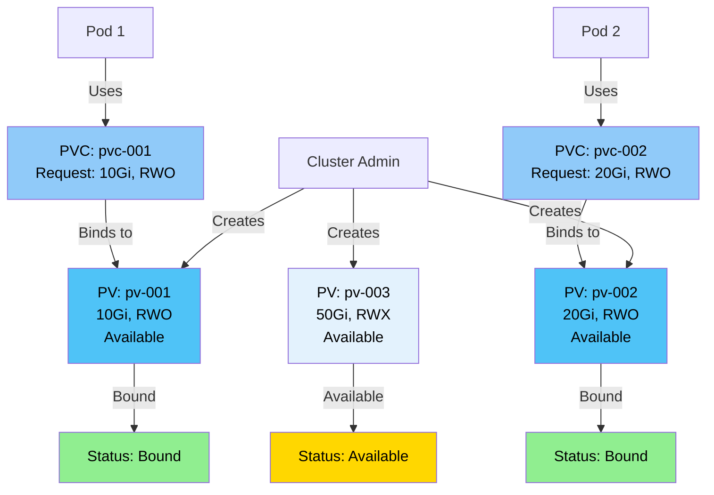

### Storage Overview

Kubernetes storage system provides:
- **Persistent Volumes (PV)** - Cluster-wide storage resources
- **Persistent Volume Claims (PVC)** - User requests for storage
- **Storage Classes** - Dynamic provisioning of storage
- **Volume Types** - Various storage backends (local, cloud, network)

**Key Concepts:**
- **Static Provisioning:** Admin creates PVs manually
- **Dynamic Provisioning:** StorageClass automatically creates PVs
- **Binding:** PVC binds to available PV
- **Lifecycle:** PV and PVC have independent lifecycles

### Storage Architecture Diagram


---

### StorageClass

**StorageClass** provides a way to describe different classes of storage. It enables dynamic provisioning of PersistentVolumes.

#### What is a StorageClass?

A StorageClass:
- **Defines storage types** - Different classes of storage (fast, slow, SSD, HDD)
- **Enables dynamic provisioning** - Automatically creates PVs when PVCs are created
- **Provides parameters** - Storage-specific configuration
- **Abstracts storage backends** - Works with various storage systems

**Key Characteristics:**
- **Dynamic Provisioning:** Automatically creates PVs
- **Storage Abstraction:** Works with different storage backends
- **Parameters:** Storage-specific configuration
- **Default Class:** Can be marked as default

#### StorageClass Diagram


#### StorageClass Structure

```yaml
apiVersion: storage.k8s.io/v1
kind: StorageClass
metadata:
  name: fast-ssd
provisioner: kubernetes.io/aws-ebs    # Provisioner plugin
parameters:
  type: gp3
  iops: "3000"
  encrypted: "true"
volumeBindingMode: Immediate         # Immediate or WaitForFirstConsumer
allowVolumeExpansion: true           # Allow volume expansion
reclaimPolicy: Delete                # Delete or Retain
```

#### StorageClass Fields Explained

**apiVersion:**
- API version for StorageClass
- Required: `storage.k8s.io/v1`

**kind:**
- Object type
- Required: `StorageClass`

**metadata:**
- Object metadata
- **name:** StorageClass name (required)
- **annotations:** Additional metadata
  - `storageclass.kubernetes.io/is-default-class: "true"` - Mark as default

**provisioner:**
- Provisioner plugin name (required)
- Examples:
  - `kubernetes.io/aws-ebs` - AWS EBS
  - `kubernetes.io/gce-pd` - Google Cloud Persistent Disk
  - `kubernetes.io/azure-disk` - Azure Disk
  - `kubernetes.io/cinder` - OpenStack Cinder
  - `kubernetes.io/nfs` - NFS

**parameters:**
- Storage-specific parameters
- Varies by provisioner
- Examples: type, iops, encrypted, zone

**volumeBindingMode:**
- **Immediate:** Bind immediately when PVC is created
- **WaitForFirstConsumer:** Wait until pod uses PVC

**allowVolumeExpansion:**
- Allow volume expansion (default: false)
- PVC can request more storage

**reclaimPolicy:**
- **Delete:** Delete PV when PVC is deleted (default for dynamic)
- **Retain:** Keep PV when PVC is deleted

#### Creating StorageClass

```yaml
apiVersion: storage.k8s.io/v1
kind: StorageClass
metadata:
  name: fast-ssd
  annotations:
    storageclass.kubernetes.io/is-default-class: "true"
provisioner: kubernetes.io/aws-ebs
parameters:
  type: gp3
  iops: "3000"
volumeBindingMode: Immediate
allowVolumeExpansion: true
reclaimPolicy: Delete
```

```bash
kubectl apply -f storageclass.yaml
```

#### Managing StorageClass

```bash
# List StorageClasses
kubectl get storageclass
kubectl get sc

# Get StorageClass details
kubectl get sc <storageclass-name>

# Describe StorageClass
kubectl describe sc <storageclass-name>

# Set default StorageClass
kubectl patch storageclass <name> -p '{"metadata":{"annotations":{"storageclass.kubernetes.io/is-default-class":"true"}}}'

# Delete StorageClass
kubectl delete sc <storageclass-name>
```

#### Common StorageClass Examples

**AWS EBS:**
```yaml
apiVersion: storage.k8s.io/v1
kind: StorageClass
metadata:
  name: aws-gp3
provisioner: kubernetes.io/aws-ebs
parameters:
  type: gp3
  iops: "3000"
  encrypted: "true"
```

**Google Cloud:**
```yaml
apiVersion: storage.k8s.io/v1
kind: StorageClass
metadata:
  name: gce-ssd
provisioner: kubernetes.io/gce-pd
parameters:
  type: pd-ssd
  replication-type: regional-pd
```

**Azure:**
```yaml
apiVersion: storage.k8s.io/v1
kind: StorageClass
metadata:
  name: azure-premium
provisioner: kubernetes.io/azure-disk
parameters:
  storageaccounttype: Premium_LRS
```

#### Key Takeaways

1. **StorageClass enables dynamic provisioning** - Automatically creates PVs
2. **Defines storage types** - Different classes for different needs
3. **Provisioner-specific** - Each cloud provider has its own provisioner
4. **Can be default** - Mark one as default for automatic selection
5. **Volume binding modes** - Immediate or WaitForFirstConsumer

---

### PersistentVolume (PV)

**PersistentVolume (PV)** is a cluster-wide storage resource provisioned by an administrator or dynamically by a StorageClass.

#### What is a PersistentVolume?

A PersistentVolume:
- **Cluster resource** - Available to all namespaces
- **Storage abstraction** - Works with various storage backends
- **Lifecycle independent** - Exists independently of Pods
- **Bound to PVC** - Claimed by PersistentVolumeClaim

**Key Characteristics:**
- **Cluster-scoped** - Not namespaced
- **Static or Dynamic** - Created manually or automatically
- **Storage backend** - Can use various storage types
- **Reclaim policy** - What happens when released

#### PersistentVolume Diagram



#### PersistentVolume Structure

```yaml
apiVersion: v1
kind: PersistentVolume
metadata:
  name: local-pv
  labels:
    app: local
spec:
  capacity:
    storage: 1Gi
  accessModes:
    - ReadWriteOnce
  persistentVolumeReclaimPolicy: Retain
  storageClassName: local-storage
  hostPath:
    path: /mnt/data
```

#### PersistentVolume Spec Fields Explained

**apiVersion:**
- API version for PersistentVolume
- Required: `v1`

**kind:**
- Object type
- Required: `PersistentVolume`

**metadata:**
- Object metadata
- **name:** PV name (required)
- **labels:** Key-value pairs for selection
- **annotations:** Additional metadata

**spec:**
- PersistentVolume specification
- **capacity:** Storage capacity
  - **storage:** Amount of storage (e.g., "10Gi", "100Mi")
- **accessModes:** How volume can be mounted
  - **ReadWriteOnce (RWO):** Single node read-write
  - **ReadOnlyMany (ROX):** Multiple nodes read-only
  - **ReadWriteMany (RWX):** Multiple nodes read-write
  - **ReadWriteOncePod (RWOP):** Single pod read-write
- **persistentVolumeReclaimPolicy:** What happens when released
  - **Retain:** Keep volume and data (manual cleanup)
  - **Recycle:** Delete data (deprecated)
  - **Delete:** Delete volume (for dynamic provisioning)
- **storageClassName:** StorageClass name (optional)
- **volumeMode:** Volume mode
  - **Filesystem:** Mount as filesystem (default)
  - **Block:** Use as raw block device
- **volume source:** Storage backend (one of):
  - **hostPath:** Local directory
  - **nfs:** NFS share
  - **awsElasticBlockStore:** AWS EBS
  - **gcePersistentDisk:** Google Cloud PD
  - **azureDisk:** Azure Disk
  - **cinder:** OpenStack Cinder
  - **local:** Local storage

#### PV States

**Available:**
- PV is available but not bound to any PVC

**Bound:**
- PV is bound to a PVC

**Released:**
- PVC is deleted but PV is not yet reclaimed

**Failed:**
- PV has failed its automatic reclamation

#### Creating PersistentVolume

**Method 1: Using YAML (Static Provisioning)**

```yaml
apiVersion: v1
kind: PersistentVolume
metadata:
  name: local-pv
  labels:
    app: local
spec:
  capacity:
    storage: 1Gi
  accessModes:
    - ReadWriteOnce
  persistentVolumeReclaimPolicy: Retain
  storageClassName: local-storage
  hostPath:
    path: /mnt/data
```

```bash
kubectl apply -f pv.yaml
```

**Method 2: Dynamic Provisioning**

PVs are automatically created by StorageClass when PVC is created.

#### Managing PersistentVolume

```bash
# List PersistentVolumes
kubectl get persistentvolumes
kubectl get pv

# Get PV details
kubectl get pv <pv-name>

# Describe PV
kubectl describe pv <pv-name>

# Delete PV
kubectl delete pv <pv-name>
```

#### Example Reference

For a practical example of a PersistentVolume YAML file, check out:

- **[nginx/persistentVolume.yml](https://github.com/jayeshjd555/Kubernetes/blob/main/nginx/persistentVolume.yml)** - Example PersistentVolume definition

This example demonstrates:
- PV structure with capacity and access modes
- HostPath volume source (local storage)
- StorageClass assignment
- Reclaim policy configuration

**📚 Tutorial:**
- **[Storage Tutorial](https://github.com/jayeshjd555/Kubernetes/blob/main/tutorials/03-storage/README.md)** - Hands-on tutorial covering PVs, PVCs, and data persistence
- Basic PV pattern for local storage

**To use this example:**
```bash
# Apply the PersistentVolume
kubectl apply -f nginx/persistentVolume.yml

# View the PV
kubectl get pv -n nginx

# Check PV status
kubectl describe pv local-pv -n nginx

# View PV details
kubectl get pv local-pv -n nginx -o yaml
```

#### Key Takeaways

1. **PV is cluster-scoped** - Available to all namespaces
2. **Static or dynamic** - Created manually or by StorageClass
3. **Access modes** - Define how volume can be mounted
4. **Reclaim policy** - What happens when released
5. **Storage backend** - Various volume sources supported

---

### PersistentVolumeClaim (PVC)

**PersistentVolumeClaim (PVC)** is a request for storage by a user. It's like a "pod" for storage - it consumes PV resources.

#### What is a PersistentVolumeClaim?

A PersistentVolumeClaim:
- **Requests storage** - User requests storage with specific requirements
- **Binds to PV** - Automatically binds to matching PV
- **Namespaced** - Belongs to a namespace
- **Used by Pods** - Pods reference PVCs in volume mounts

**Key Characteristics:**
- **Namespaced resource** - Belongs to a namespace
- **Storage request** - Specifies size and access mode
- **Automatic binding** - Binds to matching PV
- **Dynamic provisioning** - Can trigger PV creation via StorageClass

#### PersistentVolumeClaim Diagram


#### PersistentVolumeClaim Structure

```yaml
apiVersion: v1
kind: PersistentVolumeClaim
metadata:
  name: local-pvc
  namespace: nginx
spec:
  accessModes:
    - ReadWriteOnce
  resources:
    requests:
      storage: 1Gi
  storageClassName: local-storage
```

#### PersistentVolumeClaim Spec Fields Explained

**apiVersion:**
- API version for PersistentVolumeClaim
- Required: `v1`

**kind:**
- Object type
- Required: `PersistentVolumeClaim`

**metadata:**
- Object metadata
- **name:** PVC name (required)
- **namespace:** Namespace (required)
- **labels:** Key-value pairs for organization
- **annotations:** Additional metadata

**spec:**
- PersistentVolumeClaim specification
- **accessModes:** How volume can be mounted (required)
  - **ReadWriteOnce (RWO):** Single node read-write
  - **ReadOnlyMany (ROX):** Multiple nodes read-only
  - **ReadWriteMany (RWX):** Multiple nodes read-write
  - **ReadWriteOncePod (RWOP):** Single pod read-write
- **resources:** Resource requests (required)
  - **requests:** Minimum resources required
    - **storage:** Amount of storage (e.g., "10Gi", "100Mi")
- **storageClassName:** StorageClass name (optional)
  - If specified, uses that StorageClass
  - If empty, uses default StorageClass
  - If `""`, uses static provisioning only
- **selector:** Label selector for PV binding (optional)
  - **matchLabels:** Match PV labels
  - **matchExpressions:** Match expressions
- **volumeName:** Specific PV name to bind to (optional)
- **volumeMode:** Volume mode (optional)
  - **Filesystem:** Mount as filesystem (default)
  - **Block:** Use as raw block device

#### PVC States

**Pending:**
- PVC is waiting for a PV to bind to

**Bound:**
- PVC is bound to a PV

**Lost:**
- PV that PVC was bound to no longer exists

#### Creating PersistentVolumeClaim

**Method 1: Using YAML**

```yaml
apiVersion: v1
kind: PersistentVolumeClaim
metadata:
  name: local-pvc
  namespace: nginx
spec:
  accessModes:
    - ReadWriteOnce
  resources:
    requests:
      storage: 1Gi
  storageClassName: local-storage
```

```bash
kubectl apply -f pvc.yaml
```

**Method 2: Using kubectl**

```bash
# Create PVC imperatively
kubectl create pvc my-pvc --storageclass=fast-ssd --size=10Gi --access-mode=ReadWriteOnce
```

#### Managing PersistentVolumeClaim

```bash
# List PVCs
kubectl get persistentvolumeclaims
kubectl get pvc

# List PVCs in namespace
kubectl get pvc -n <namespace>

# Get PVC details
kubectl get pvc <pvc-name>

# Describe PVC
kubectl describe pvc <pvc-name>

# Delete PVC
kubectl delete pvc <pvc-name>
```

#### Using PVC in Pods

```yaml
apiVersion: v1
kind: Pod
metadata:
  name: my-pod
spec:
  containers:
  - name: app
    image: nginx:latest
    volumeMounts:
    - name: data
      mountPath: /data
  volumes:
  - name: data
    persistentVolumeClaim:
      claimName: local-pvc
```

#### Example Reference

For a practical example of a PersistentVolumeClaim YAML file, check out:

- **[nginx/persistentVolumeClaim.yml](https://github.com/jayeshjd555/Kubernetes/blob/main/nginx/persistentVolumeClaim.yml)** - Example PersistentVolumeClaim definition

This example demonstrates:
- PVC structure with access modes
- Storage resource request
- StorageClass assignment
- Basic PVC pattern for storage request

**📚 Tutorial:**
- **[Storage Tutorial](https://github.com/jayeshjd555/Kubernetes/blob/main/tutorials/03-storage/README.md)** - Step-by-step tutorial to create and use PVs and PVCs

**To use this example:**
```bash
# Apply the PersistentVolumeClaim
kubectl apply -f nginx/persistentVolumeClaim.yml

# View the PVC
kubectl get pvc -n nginx

# Check PVC status
kubectl describe pvc local-pvc -n nginx

# View PVC details
kubectl get pvc local-pvc -n nginx -o yaml

# Check if PVC is bound
kubectl get pvc local-pvc -n nginx
```

#### Key Takeaways

1. **PVC is namespaced** - Belongs to a namespace
2. **Requests storage** - Specifies size and access mode
3. **Binds to PV** - Automatically binds to matching PV
4. **Dynamic provisioning** - Can trigger PV creation via StorageClass
5. **Used by Pods** - Pods reference PVCs in volume mounts

---

### Storage Workflow

**Static Provisioning:**
1. Admin creates PV
2. User creates PVC
3. PVC binds to PV
4. Pod uses PVC

**Dynamic Provisioning:**
1. Admin creates StorageClass
2. User creates PVC (with storageClassName)
3. StorageClass creates PV automatically
4. PVC binds to PV
5. Pod uses PVC

### Storage Best Practices

1. **Use StorageClass** - Prefer dynamic provisioning
2. **Set appropriate access modes** - Based on use case
3. **Set reclaim policy** - Retain for important data
4. **Use labels** - For PV selection
5. **Monitor storage** - Check PV/PVC status
6. **Clean up** - Delete unused PVCs and PVs

</details>

---

<details>
<summary><h2>Services</h2></summary>

## Services

**Services** provide a stable network endpoint to access Pods. They abstract away the dynamic nature of Pods and provide a consistent way to communicate with applications running in Kubernetes.
