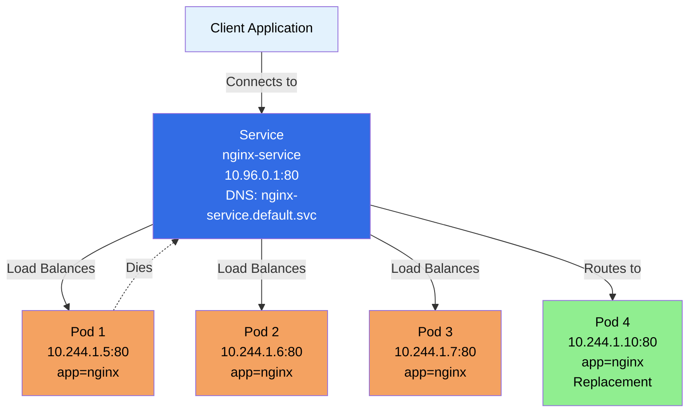
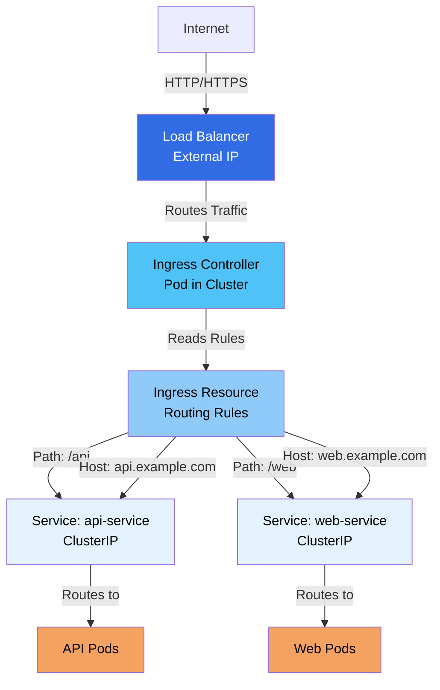
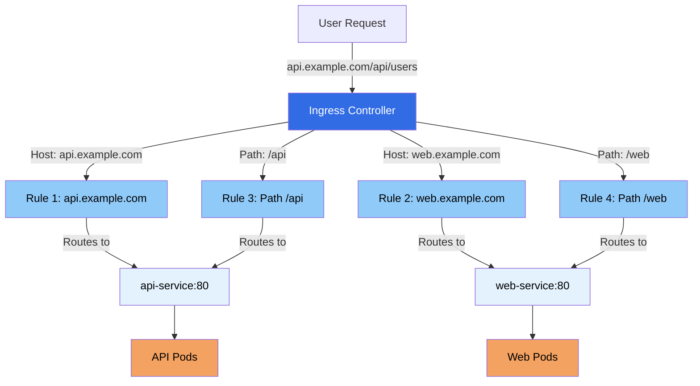
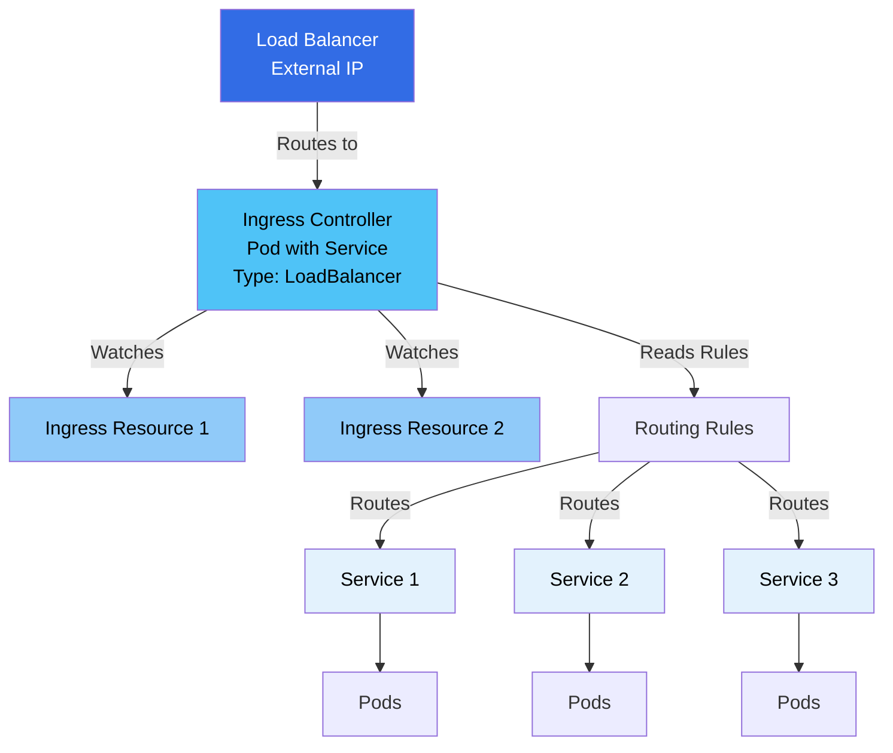

### What is a Service?

Think of a Service as a **stable front door** to your application. Here's why we need Services:

**The Problem:**
- Pods are **ephemeral** - They can be created, destroyed, or moved
- Pods get **new IP addresses** each time they're created
- How do you connect to an application when its IP keeps changing?

**The Solution:**
- Service provides a **stable IP address** and DNS name
- Service **load balances** traffic to multiple Pods
- Service **abstracts** the underlying Pods
- Other applications connect to the Service, not directly to Pods

**Simple Analogy:**
Imagine a restaurant:
- **Pods** = Individual waiters (they come and go)
- **Service** = The host/hostess desk (always there, directs you to available waiters)
- You don't need to know which waiter will serve you - you just go to the desk!

### Why Do We Need Services?

**1. Pod IPs are Dynamic**
```
Pod 1: 10.244.1.5  → Gets deleted
Pod 2: 10.244.1.6  → Gets new IP: 10.244.1.10
Pod 3: 10.244.1.7  → Gets new IP: 10.244.1.11
```
Without Service: Application breaks when Pod IPs change
With Service: Service IP stays the same, routes to new Pod IPs

**2. Load Balancing**
- Multiple Pods running the same application
- Service distributes traffic across all Pods
- Automatic load balancing

**3. Service Discovery**
- Services get DNS names
- Other Pods can find services by name
- No need to hardcode IP addresses

### Service Diagram



### Service Types

Kubernetes provides different Service types for different use cases:

**1. ClusterIP (Default)**
- **Internal only** - Accessible only within the cluster
- **Stable IP** - Gets a cluster-internal IP
- **Use case:** Communication between Pods in the cluster

**2. NodePort**
- **External access** - Accessible from outside the cluster
- **Opens port** - Opens a port on each node
- **Use case:** Development, testing, simple external access

**3. LoadBalancer**
- **Cloud provider** - Creates external load balancer
- **Public IP** - Gets a public IP address
- **Use case:** Production applications with cloud providers

**4. ExternalName**
- **External service** - Maps to external DNS name
- **No proxy** - Returns CNAME record
- **Use case:** Accessing external services

### Service Structure

```yaml
apiVersion: v1
kind: Service
metadata:
  name: nginx-service
  namespace: nginx
spec:
  selector:
    app: nginx
  ports:
    - protocol: TCP
      port: 80
      targetPort: 80
  type: ClusterIP
```

### Service Spec Fields Explained

**apiVersion:**
- API version for Service
- Required: `v1`

**kind:**
- Object type
- Required: `Service`

**metadata:**
- Object metadata
- **name:** Service name (required) - Used for DNS
- **namespace:** Namespace (optional, defaults to default)
- **labels:** Key-value pairs for organization
- **annotations:** Additional metadata

**spec:**
- Service specification
- **selector:** Label selector to find Pods (required)
  - **matchLabels:** Key-value pairs matching Pod labels
  - Service routes traffic to Pods with matching labels
- **ports:** Port configuration (required)
  - **port:** Port exposed by Service
  - **targetPort:** Port on Pods (defaults to port if not specified)
  - **protocol:** TCP (default), UDP, or SCTP
  - **name:** Port name (optional, for named ports)
- **type:** Service type (optional, default: ClusterIP)
  - **ClusterIP:** Internal cluster IP
  - **NodePort:** Exposes on node IPs
  - **LoadBalancer:** Creates external load balancer
  - **ExternalName:** Maps to external DNS
- **clusterIP:** Specific cluster IP (optional, auto-assigned if not specified)
- **sessionAffinity:** Session affinity (optional)
  - **None:** No session affinity (default)
  - **ClientIP:** Route same client to same Pod

### Service Types Explained

#### 1. ClusterIP Service

**What it is:**
- Default Service type
- Internal cluster IP address
- Accessible only within the cluster

**Use Case:**
- Communication between Pods
- Internal services
- Database connections

**Example:**
```yaml
apiVersion: v1
kind: Service
metadata:
  name: nginx-service
spec:
  type: ClusterIP  # Default, can be omitted
  selector:
    app: nginx
  ports:
    - port: 80
      targetPort: 80
```

**Access:**
- From within cluster: `http://nginx-service:80`
- DNS: `nginx-service.default.svc.cluster.local`

#### 2. NodePort Service

**What it is:**
- Opens a port on each node
- Accessible from outside cluster via `<NodeIP>:<NodePort>`
- Also accessible via ClusterIP

**Use Case:**
- Development and testing
- Simple external access
- When LoadBalancer is not available

**Example:**
```yaml
apiVersion: v1
kind: Service
metadata:
  name: nginx-service
spec:
  type: NodePort
  selector:
    app: nginx
  ports:
    - port: 80
      targetPort: 80
      nodePort: 30080  # Optional, auto-assigned if not specified (30000-32767)
```

**Access:**
- From outside: `http://<NodeIP>:30080`
- From inside: `http://nginx-service:80`

#### 3. LoadBalancer Service

**What it is:**
- Creates external load balancer (cloud provider)
- Gets a public IP address
- Automatically includes NodePort and ClusterIP

**Use Case:**
- Production applications
- Public-facing services
- Cloud environments (AWS, GCP, Azure)

**Example:**
```yaml
apiVersion: v1
kind: Service
metadata:
  name: nginx-service
spec:
  type: LoadBalancer
  selector:
    app: nginx
  ports:
    - port: 80
      targetPort: 80
```

**Access:**
- Public IP provided by cloud provider
- Automatically routes to Pods

#### 4. ExternalName Service

**What it is:**
- Maps Service to external DNS name
- Returns CNAME record
- No proxy, no load balancing

**Use Case:**
- Accessing external services
- Migrating to Kubernetes
- Service abstraction

**Example:**
```yaml
apiVersion: v1
kind: Service
metadata:
  name: external-db
spec:
  type: ExternalName
  externalName: database.example.com
```

**Access:**
- DNS resolves to external name
- No proxy involved

### Service Discovery

**DNS Names:**
- Services get DNS names automatically
- Format: `<service-name>.<namespace>.svc.cluster.local`
- Short form: `<service-name>` (same namespace)
- Short form: `<service-name>.<namespace>` (different namespace)

**Examples:**
```bash
# Same namespace
http://nginx-service:80

# Different namespace
http://nginx-service.nginx:80

# Full DNS name
http://nginx-service.nginx.svc.cluster.local:80
```

### Creating Services

**Method 1: Using YAML (Recommended)**

```yaml
apiVersion: v1
kind: Service
metadata:
  name: nginx-service
  namespace: nginx
spec:
  selector:
    app: nginx
  ports:
    - protocol: TCP
      port: 80
      targetPort: 80
  type: ClusterIP
```

```bash
kubectl apply -f service.yaml
```

**Method 2: Using kubectl**

```bash
# Create Service from Deployment
kubectl expose deployment nginx-deployment --port=80 --target-port=80

# Create Service with specific type
kubectl expose deployment nginx-deployment --type=NodePort --port=80

# Create Service with LoadBalancer
kubectl expose deployment nginx-deployment --type=LoadBalancer --port=80
```

### Managing Services

```bash
# List Services
kubectl get services
kubectl get svc

# List Services in namespace
kubectl get svc -n <namespace>

# Get Service details
kubectl get svc <service-name>

# Describe Service
kubectl describe svc <service-name>

# Get Service endpoints
kubectl get endpoints <service-name>

# Delete Service
kubectl delete svc <service-name>
```

### Service Endpoints

**Endpoints:**
- Service automatically creates Endpoints object
- Contains list of Pod IPs matching selector
- Updated automatically when Pods change

```bash
# View endpoints
kubectl get endpoints <service-name>

# Output shows:
# NAME            ENDPOINTS
# nginx-service   10.244.1.5:80,10.244.1.6:80,10.244.1.7:80
```

### Service Load Balancing

**How it Works:**
1. Service receives request
2. kube-proxy routes to one of the Pods
3. Uses round-robin by default
4. Can use session affinity for sticky sessions

**Load Balancing Methods:**
- **Round-robin (default):** Distributes evenly
- **Session affinity:** Same client to same Pod

### Service Best Practices

1. **Use meaningful names** - Service names become DNS names
2. **Match selector labels** - Ensure selector matches Pod labels
3. **Use ClusterIP for internal** - Default for internal communication
4. **Use LoadBalancer for external** - For public-facing services
5. **Set targetPort correctly** - Match container port
6. **Use named ports** - For flexibility
7. **Monitor endpoints** - Check if Pods are healthy

### Common Service Patterns

**Pattern 1: Basic Service**
```yaml
apiVersion: v1
kind: Service
metadata:
  name: web-service
spec:
  selector:
    app: web
  ports:
    - port: 80
      targetPort: 8080
```

**Pattern 2: Multiple Ports**
```yaml
apiVersion: v1
kind: Service
metadata:
  name: app-service
spec:
  selector:
    app: myapp
  ports:
    - name: http
      port: 80
      targetPort: 8080
    - name: https
      port: 443
      targetPort: 8443
```

**Pattern 3: Headless Service**
```yaml
apiVersion: v1
kind: Service
metadata:
  name: headless-service
spec:
  clusterIP: None  # Headless service
  selector:
    app: stateful
  ports:
    - port: 80
```

### Example Reference

For a practical example of a Service YAML file, check out:

- **[nginx/service.yml](https://github.com/jayeshjd555/Kubernetes/blob/main/nginx/service.yml)** - Example Service definition

This example demonstrates:
- Service structure with selector
- Port configuration (port and targetPort)
- ClusterIP service type (default)

**📚 Tutorial:**
- **[Networking Tutorial](https://github.com/jayeshjd555/Kubernetes/blob/main/tutorials/04-networking/README.md)** - Hands-on tutorial covering Services and Ingress
- Basic Service pattern for nginx

**To use this example:**
```bash
# Apply the Service
kubectl apply -f nginx/service.yml

# View the Service
kubectl get svc -n nginx

# Check Service details
kubectl describe svc nginx-service -n nginx

# View Service endpoints (Pods it routes to)
kubectl get endpoints nginx-service -n nginx

# Test Service from within cluster
kubectl run test-pod --image=busybox -it --rm --restart=Never -n nginx -- wget -qO- http://nginx-service:80

# Get Service cluster IP
kubectl get svc nginx-service -n nginx -o jsonpath='{.spec.clusterIP}'
```

### Key Takeaways

1. **Services provide stable endpoints** - Stable IP and DNS name
2. **Load balancing** - Distributes traffic across Pods
3. **Service discovery** - DNS names for easy access
4. **Different types** - ClusterIP, NodePort, LoadBalancer, ExternalName
5. **Selector-based** - Routes to Pods matching labels
6. **Automatic updates** - Endpoints update when Pods change
7. **Internal by default** - ClusterIP for internal communication
8. **Essential for Pod communication** - Pods communicate via Services

Services are essential for networking in Kubernetes. They provide the stable, reliable way to access your applications regardless of Pod changes.

</details>

---

<details>
<summary><h2>Ingress</h2></summary>

## Ingress

**Ingress** is an API object that manages external HTTP and HTTPS access to Services in a cluster. It provides HTTP/HTTPS routing, SSL/TLS termination, and name-based virtual hosting.

### What is Ingress?

**Simple Explanation:**
Ingress is like a **smart traffic director** at the entrance of your cluster. It:
- **Routes traffic** based on URL paths and hostnames
- **Terminates SSL/TLS** - Handles HTTPS certificates
- **Provides a single entry point** - One IP for multiple services
- **Works with Services** - Routes to ClusterIP Services

**Analogy:**
Think of Ingress as a **receptionist** in a building:
- **Services** = Individual offices (ClusterIP services are internal)
- **Ingress** = Receptionist who directs visitors to the right office based on who they're looking for
- **Ingress Controller** = The actual person/system doing the directing

### Why Do We Need Ingress?

**The Problem with Services:**
- **LoadBalancer:** Creates one load balancer per service (expensive)
- **NodePort:** Requires managing ports and firewall rules
- **No path-based routing:** Can't route based on URL paths
- **No SSL termination:** Each service needs to handle SSL
- **No name-based routing:** Can't route based on domain names

**The Solution - Ingress:**
- **Single entry point** - One load balancer for multiple services
- **Path-based routing** - Route `/api` to one service, `/web` to another
- **Host-based routing** - Route `api.example.com` to one service, `web.example.com` to another
- **SSL/TLS termination** - Handle certificates at Ingress level
- **Cost-effective** - One load balancer instead of many

### Ingress vs Services

| Feature | Service | Ingress |
|---------|---------|---------|
| **Layer** | L4 (TCP/UDP) | L7 (HTTP/HTTPS) |
| **Routing** | IP/Port based | Path/Host based |
| **SSL/TLS** | No termination | SSL/TLS termination |
| **External Access** | NodePort/LoadBalancer | HTTP/HTTPS routing |
| **Cost** | One LB per service | One LB for all |
| **Use Case** | Internal/external access | HTTP/HTTPS routing |

### Ingress Architecture Diagram



### Ingress Controller

**What is an Ingress Controller?**

An Ingress Controller is the **actual implementation** that processes Ingress rules. It's a Pod that:
- **Watches Ingress resources** - Monitors for Ingress changes
- **Implements routing rules** - Processes routing logic
- **Handles SSL/TLS** - Terminates SSL connections
- **Manages load balancer** - Configures external load balancer

**Popular Ingress Controllers:**
- **NGINX Ingress Controller** - Most popular
- **Traefik** - Modern, feature-rich
- **HAProxy** - High performance
- **Istio Gateway** - Service mesh integration
- **AWS ALB Ingress Controller** - AWS-specific
- **GKE Ingress** - Google Cloud

**Important:**
- Ingress Controller must be **installed separately**
- Kubernetes doesn't provide a default Ingress Controller
- You need to deploy one before using Ingress

### Ingress Structure

```yaml
apiVersion: networking.k8s.io/v1
kind: Ingress
metadata:
  name: example-ingress
  namespace: default
  annotations:
    nginx.ingress.kubernetes.io/rewrite-target: /
spec:
  ingressClassName: nginx
  rules:
  - host: api.example.com
    http:
      paths:
      - path: /api
        pathType: Prefix
        backend:
          service:
            name: api-service
            port:
              number: 80
  - host: web.example.com
    http:
      paths:
      - path: /
        pathType: Prefix
        backend:
          service:
            name: web-service
            port:
              number: 80
  tls:
  - hosts:
    - api.example.com
    - web.example.com
    secretName: tls-secret
```

### Ingress Spec Fields Explained

**apiVersion:**
- API version for Ingress
- Required: `networking.k8s.io/v1` (v1.19+)
- Older: `networking.k8s.io/v1beta1` (deprecated)

**kind:**
- Object type
- Required: `Ingress`

**metadata:**
- Object metadata
- **name:** Ingress name (required)
- **namespace:** Namespace (optional, defaults to default)
- **labels:** Key-value pairs for organization
- **annotations:** Ingress Controller-specific settings
  - Controller-specific annotations for configuration

**spec:**
- Ingress specification
- **ingressClassName:** Ingress class name (v1.19+)
  - Specifies which Ingress Controller to use
  - Alternative to `kubernetes.io/ingress.class` annotation
- **rules:** List of routing rules (required)
  - **host:** Hostname (optional, matches all if not specified)
  - **http:** HTTP rules
    - **paths:** List of path rules
      - **path:** URL path (e.g., `/api`, `/web`)
      - **pathType:** Path matching type
        - **Exact:** Exact match
        - **Prefix:** Prefix match (most common)
        - **ImplementationSpecific:** Controller-specific
      - **backend:** Backend service
        - **service:** Service backend
          - **name:** Service name
          - **port:** Service port
            - **number:** Port number
            - **name:** Named port
- **tls:** TLS configuration (optional)
  - **hosts:** List of hostnames
  - **secretName:** Secret containing TLS certificate

### Ingress Routing Types

#### 1. Host-Based Routing

Routes traffic based on the **hostname** (domain name).

**Example:**
```yaml
apiVersion: networking.k8s.io/v1
kind: Ingress
metadata:
  name: host-based-ingress
spec:
  ingressClassName: nginx
  rules:
  - host: api.example.com
    http:
      paths:
      - path: /
        pathType: Prefix
        backend:
          service:
            name: api-service
            port:
              number: 80
  - host: web.example.com
    http:
      paths:
      - path: /
        pathType: Prefix
        backend:
          service:
            name: web-service
            port:
              number: 80
```

**How it works:**
- `api.example.com` → routes to `api-service`
- `web.example.com` → routes to `web-service`

#### 2. Path-Based Routing

Routes traffic based on the **URL path**.

**Example:**
```yaml
apiVersion: networking.k8s.io/v1
kind: Ingress
metadata:
  name: path-based-ingress
spec:
  ingressClassName: nginx
  rules:
  - http:
      paths:
      - path: /api
        pathType: Prefix
        backend:
          service:
            name: api-service
            port:
              number: 80
      - path: /web
        pathType: Prefix
        backend:
          service:
            name: web-service
            port:
              number: 80
      - path: /
        pathType: Prefix
        backend:
          service:
            name: default-service
            port:
              number: 80
```

**How it works:**
- `/api/*` → routes to `api-service`
- `/web/*` → routes to `web-service`
- `/*` → routes to `default-service`

**Important:** Order matters! More specific paths should come first.

#### 3. Combined Host and Path Routing

Combines both hostname and path for routing.

**Example:**
```yaml
apiVersion: networking.k8s.io/v1
kind: Ingress
metadata:
  name: combined-ingress
spec:
  ingressClassName: nginx
  rules:
  - host: example.com
    http:
      paths:
      - path: /api
        pathType: Prefix
        backend:
          service:
            name: api-service
            port:
              number: 80
      - path: /web
        pathType: Prefix
        backend:
          service:
            name: web-service
            port:
              number: 80
```

### Path Types Explained

**1. Exact:**
- Exact match of the path
- `/api` matches only `/api`, not `/api/v1`

**2. Prefix:**
- Matches path prefix
- `/api` matches `/api`, `/api/v1`, `/api/users`
- Most commonly used

**3. ImplementationSpecific:**
- Controller-specific matching
- Behavior depends on Ingress Controller

### Ingress Routing Diagram



### TLS/SSL Termination

Ingress can handle SSL/TLS termination, so your Services don't need to.

**How it works:**
1. Client connects via HTTPS
2. Ingress Controller terminates SSL
3. Forwards HTTP to backend Service
4. Service receives plain HTTP

**Example:**
```yaml
apiVersion: networking.k8s.io/v1
kind: Ingress
metadata:
  name: tls-ingress
spec:
  ingressClassName: nginx
  tls:
  - hosts:
    - api.example.com
    - web.example.com
    secretName: tls-secret
  rules:
  - host: api.example.com
    http:
      paths:
      - path: /
        pathType: Prefix
        backend:
          service:
            name: api-service
            port:
              number: 80
```

**Creating TLS Secret:**
```bash
# Create TLS secret
kubectl create secret tls tls-secret \
  --cert=tls.crt \
  --key=tls.key
```

### Ingress Annotations

Ingress Controllers use annotations for additional configuration.

**NGINX Ingress Controller Annotations:**

```yaml
apiVersion: networking.k8s.io/v1
kind: Ingress
metadata:
  name: annotated-ingress
  annotations:
    # Rewrite target
    nginx.ingress.kubernetes.io/rewrite-target: /
    
    # SSL redirect
    nginx.ingress.kubernetes.io/ssl-redirect: "true"
    
    # Rate limiting
    nginx.ingress.kubernetes.io/limit-rps: "100"
    
    # CORS
    nginx.ingress.kubernetes.io/enable-cors: "true"
    
    # Authentication
    nginx.ingress.kubernetes.io/auth-type: basic
    nginx.ingress.kubernetes.io/auth-secret: basic-auth
    
    # Custom headers
    nginx.ingress.kubernetes.io/configuration-snippet: |
      more_set_headers "X-Custom-Header: value";
spec:
  ingressClassName: nginx
  rules:
  - http:
      paths:
      - path: /
        pathType: Prefix
        backend:
          service:
            name: web-service
            port:
              number: 80
```

### Ingress Class

**What is Ingress Class?**

Ingress Class allows you to have multiple Ingress Controllers in the same cluster.

**IngressClass Resource:**
```yaml
apiVersion: networking.k8s.io/v1
kind: IngressClass
metadata:
  name: nginx
spec:
  controller: k8s.io/ingress-nginx
```

**Using IngressClass:**
```yaml
apiVersion: networking.k8s.io/v1
kind: Ingress
metadata:
  name: example-ingress
spec:
  ingressClassName: nginx  # References IngressClass
  rules:
  - http:
      paths:
      - path: /
        pathType: Prefix
        backend:
          service:
            name: web-service
            port:
              number: 80
```

### Creating Ingress

**Method 1: Using YAML**

```yaml
apiVersion: networking.k8s.io/v1
kind: Ingress
metadata:
  name: example-ingress
spec:
  ingressClassName: nginx
  rules:
  - host: api.example.com
    http:
      paths:
      - path: /
        pathType: Prefix
        backend:
          service:
            name: api-service
            port:
              number: 80
```

```bash
kubectl apply -f ingress.yaml
```

**Method 2: Using kubectl**

```bash
# Create Ingress from Service
kubectl create ingress example-ingress \
  --class=nginx \
  --rule="api.example.com/*=api-service:80" \
  --rule="web.example.com/*=web-service:80"
```

### Managing Ingress

```bash
# List Ingresses
kubectl get ingress
kubectl get ing

# List Ingresses in namespace
kubectl get ing -n <namespace>

# Get Ingress details
kubectl get ing <ingress-name>

# Describe Ingress
kubectl describe ing <ingress-name>

# Get Ingress YAML
kubectl get ing <ingress-name> -o yaml

# Delete Ingress
kubectl delete ing <ingress-name>
```

### Installing Ingress Controller

**NGINX Ingress Controller (Example):**

```bash
# Using kubectl
kubectl apply -f https://raw.githubusercontent.com/kubernetes/ingress-nginx/controller-v1.8.1/deploy/static/provider/cloud/deploy.yaml

# Using Helm
helm repo add ingress-nginx https://kubernetes.github.io/ingress-nginx
helm install ingress-nginx ingress-nginx/ingress-nginx

# Check installation
kubectl get pods -n ingress-nginx
kubectl get svc -n ingress-nginx
```

### Ingress Controller Architecture



### Complete Ingress Example

```yaml
apiVersion: networking.k8s.io/v1
kind: Ingress
metadata:
  name: complete-ingress
  namespace: production
  annotations:
    nginx.ingress.kubernetes.io/rewrite-target: /
    nginx.ingress.kubernetes.io/ssl-redirect: "true"
    nginx.ingress.kubernetes.io/rate-limit: "100"
spec:
  ingressClassName: nginx
  rules:
  # Host-based routing
  - host: api.example.com
    http:
      paths:
      - path: /v1
        pathType: Prefix
        backend:
          service:
            name: api-v1-service
            port:
              number: 80
      - path: /v2
        pathType: Prefix
        backend:
          service:
            name: api-v2-service
            port:
              number: 80
  # Path-based routing
  - http:
      paths:
      - path: /web
        pathType: Prefix
        backend:
          service:
            name: web-service
            port:
              number: 80
      - path: /admin
        pathType: Prefix
        backend:
          service:
            name: admin-service
            port:
              number: 80
  # TLS configuration
  tls:
  - hosts:
    - api.example.com
    secretName: api-tls-secret
```

### Ingress Best Practices

1. **Install Ingress Controller first** - Required before using Ingress
2. **Use ingressClassName** - Specify which controller to use
3. **Order paths correctly** - More specific paths first
4. **Use pathType: Prefix** - Most common and flexible
5. **Handle TLS at Ingress** - Don't handle SSL in Services
6. **Use annotations wisely** - Controller-specific features
7. **Monitor Ingress Controller** - Check controller health
8. **Use meaningful names** - For better organization
9. **Test routing rules** - Verify paths work correctly
10. **Secure with TLS** - Use TLS for production

### Common Ingress Patterns

**Pattern 1: Simple Path Routing**
```yaml
apiVersion: networking.k8s.io/v1
kind: Ingress
metadata:
  name: simple-ingress
spec:
  ingressClassName: nginx
  rules:
  - http:
      paths:
      - path: /
        pathType: Prefix
        backend:
          service:
            name: web-service
            port:
              number: 80
```

**Pattern 2: Multiple Services**
```yaml
apiVersion: networking.k8s.io/v1
kind: Ingress
metadata:
  name: multi-service-ingress
spec:
  ingressClassName: nginx
  rules:
  - http:
      paths:
      - path: /api
        pathType: Prefix
        backend:
          service:
            name: api-service
            port:
              number: 80
      - path: /web
        pathType: Prefix
        backend:
          service:
            name: web-service
            port:
              number: 80
```

**Pattern 3: Host-Based with TLS**
```yaml
apiVersion: networking.k8s.io/v1
kind: Ingress
metadata:
  name: tls-host-ingress
spec:
  ingressClassName: nginx
  tls:
  - hosts:
    - api.example.com
    secretName: api-tls-secret
  rules:
  - host: api.example.com
    http:
      paths:
      - path: /
        pathType: Prefix
        backend:
          service:
            name: api-service
            port:
              number: 80
```

### Troubleshooting Ingress

**Common Issues:**

1. **Ingress not working:**
   ```bash
   # Check Ingress Controller
   kubectl get pods -n ingress-nginx
   
   # Check Ingress status
   kubectl describe ing <ingress-name>
   
   # Check Service
   kubectl get svc <service-name>
   ```

2. **404 errors:**
   - Check path matching
   - Verify pathType
   - Check Service name and port

3. **SSL errors:**
   - Verify TLS secret exists
   - Check certificate validity
   - Verify secret name matches

4. **Routing not working:**
   - Check Ingress Controller logs
   - Verify rules are correct
   - Check Service endpoints

### Example Reference

For a practical example of an Ingress YAML file, check out:

- **[nginx/ingress.yml](https://github.com/jayeshjd555/Kubernetes/blob/main/nginx/ingress.yml)** - Example Ingress definition

This example demonstrates:
- Ingress structure with multiple path-based routing rules
- Path-based routing for different services (`/nginx` and `/`)
- NGINX Ingress Controller annotations (rewrite-target)
- Multiple backend services (nginx-service and notes-app-service)
- Different port configurations (80 and 8000)
- Path ordering (more specific path `/nginx` before default path `/`)

**📚 Tutorial:**
- **[Networking Tutorial](https://github.com/jayeshjd555/Kubernetes/blob/main/tutorials/04-networking/README.md)** - Step-by-step tutorial to create Services and configure Ingress

**To use this example:**
```bash
# Apply the Ingress
kubectl apply -f nginx/ingress.yml

# View the Ingress
kubectl get ingress -n nginx

# Check Ingress details
kubectl describe ingress nginx-notes-ingress -n nginx

# View Ingress YAML
kubectl get ingress nginx-notes-ingress -n nginx -o yaml

# Check Ingress status
kubectl get ingress nginx-notes-ingress -n nginx

# Test routing (if Ingress Controller is installed)
# /nginx path should route to nginx-service
# / path should route to notes-app-service
```

**Important Notes:**
- Ensure Ingress Controller is installed before applying
- Verify that `nginx-service` and `notes-app-service` exist in the nginx namespace
- The rewrite-target annotation rewrites the URL path
- Path order matters - `/nginx` must come before `/` to work correctly

### Key Takeaways

1. **Ingress provides HTTP/HTTPS routing** - Layer 7 routing
2. **Requires Ingress Controller** - Must be installed separately
3. **Path and host-based routing** - Flexible routing options
4. **SSL/TLS termination** - Handle certificates at Ingress
5. **Single entry point** - One load balancer for multiple services
6. **Works with Services** - Routes to ClusterIP Services
7. **Controller-specific** - Annotations vary by controller
8. **Cost-effective** - One LB instead of many
9. **Use ingressClassName** - Specify controller (v1.19+)
10. **Order matters** - More specific paths first

Ingress is essential for managing external HTTP/HTTPS access to your Kubernetes services. It provides a powerful, flexible way to route traffic based on paths and hostnames while handling SSL/TLS termination.

</details>

---

<details>
<summary><h2>ConfigMap and Secrets</h2></summary>

## ConfigMap and Secrets

**ConfigMap** and **Secrets** are Kubernetes objects used to store configuration data and sensitive information separately from application code. They allow you to decouple configuration from container images.
