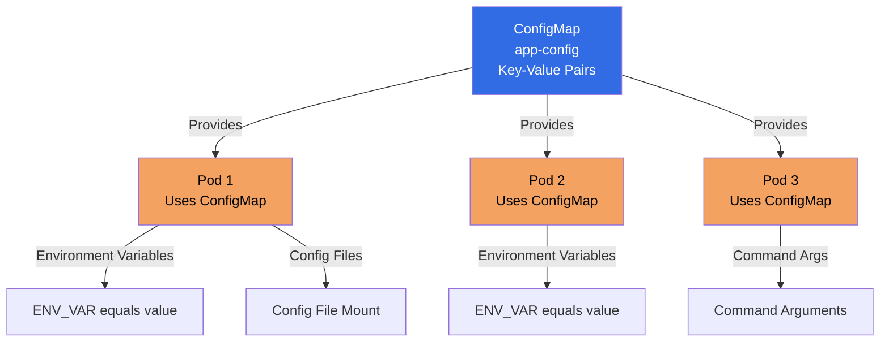
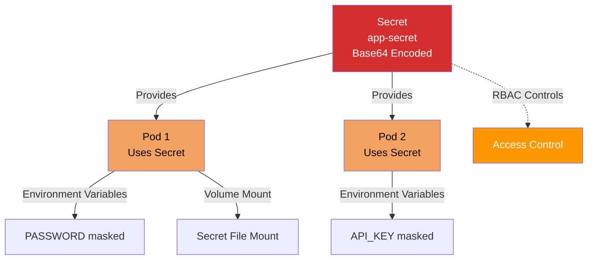

### ConfigMap

**ConfigMap** is an API object used to store non-confidential data in key-value pairs. Pods can consume ConfigMaps as environment variables, configuration files, or command-line arguments.

#### What is a ConfigMap?

**Simple Explanation:**
ConfigMap is like a **configuration file** that lives outside your application code. It stores:
- **Configuration data** - Settings, parameters, URLs
- **Non-sensitive data** - Database names, feature flags, API endpoints
- **Environment-specific values** - Different values for dev, staging, prod

**Why Use ConfigMap?**
- **Separate config from code** - Change config without rebuilding images
- **Environment-specific** - Same image, different configs
- **Reusable** - Share config across multiple Pods
- **Version control** - Track config changes

#### ConfigMap Diagram



#### ConfigMap Structure

```yaml
apiVersion: v1
kind: ConfigMap
metadata:
  name: app-config
  namespace: default
data:
  # Simple key-value pairs
  database_url: "mysql://db.example.com:3306"
  api_endpoint: "https://api.example.com"
  log_level: "info"
  
  # Multi-line values
  config.yaml: |
    server:
      port: 8080
      host: 0.0.0.0
    database:
      name: myapp
      pool_size: 10
```

#### ConfigMap Spec Fields Explained

**apiVersion:**
- API version for ConfigMap
- Required: `v1`

**kind:**
- Object type
- Required: `ConfigMap`

**metadata:**
- Object metadata
- **name:** ConfigMap name (required)
- **namespace:** Namespace (optional, defaults to default)
- **labels:** Key-value pairs for organization
- **annotations:** Additional metadata

**data:**
- Configuration data (key-value pairs)
- **Keys:** String keys
- **Values:** String values (can be multi-line)
- All values are treated as strings

**binaryData:**
- Binary data (optional)
- Base64-encoded binary data
- Use for binary files (images, certificates)

#### Creating ConfigMap

**Method 1: Using YAML**

```yaml
apiVersion: v1
kind: ConfigMap
metadata:
  name: mysql-config-map
  namespace: mysql
data:
  MYSQL_DATABASE: devops
```

```bash
kubectl apply -f configmap.yaml
```

**Method 2: Using kubectl**

```bash
# Create from literal values
kubectl create configmap app-config \
  --from-literal=database_url=mysql://localhost:3306 \
  --from-literal=log_level=info

# Create from file
kubectl create configmap app-config \
  --from-file=config.properties

# Create from directory
kubectl create configmap app-config \
  --from-file=/path/to/config/dir

# Create from env file
kubectl create configmap app-config \
  --from-env-file=config.env
```

#### Using ConfigMap in Pods

**Method 1: Environment Variables**

```yaml
apiVersion: v1
kind: Pod
metadata:
  name: my-pod
spec:
  containers:
  - name: app
    image: nginx:latest
    env:
    - name: DATABASE_URL
      valueFrom:
        configMapKeyRef:
          name: app-config
          key: database_url
    - name: LOG_LEVEL
      valueFrom:
        configMapKeyRef:
          name: app-config
          key: log_level
```

**Method 2: All Keys as Environment Variables**

```yaml
apiVersion: v1
kind: Pod
metadata:
  name: my-pod
spec:
  containers:
  - name: app
    image: nginx:latest
    envFrom:
    - configMapRef:
        name: app-config
```

**Method 3: Volume Mount (Config File)**

```yaml
apiVersion: v1
kind: Pod
metadata:
  name: my-pod
spec:
  containers:
  - name: app
    image: nginx:latest
    volumeMounts:
    - name: config-volume
      mountPath: /etc/config
  volumes:
  - name: config-volume
    configMap:
      name: app-config
```

**Method 4: Specific Keys as Files**

```yaml
apiVersion: v1
kind: Pod
metadata:
  name: my-pod
spec:
  containers:
  - name: app
    image: nginx:latest
    volumeMounts:
    - name: config-volume
      mountPath: /etc/config
  volumes:
  - name: config-volume
    configMap:
      name: app-config
      items:
      - key: config.yaml
        path: app.yaml
```

#### Managing ConfigMap

```bash
# List ConfigMaps
kubectl get configmaps
kubectl get cm

# List ConfigMaps in namespace
kubectl get cm -n <namespace>

# Get ConfigMap details
kubectl get cm <configmap-name>

# Describe ConfigMap
kubectl describe cm <configmap-name>

# View ConfigMap data
kubectl get cm <configmap-name> -o yaml

# Edit ConfigMap
kubectl edit cm <configmap-name>

# Delete ConfigMap
kubectl delete cm <configmap-name>
```

#### ConfigMap Best Practices

1. **Store non-sensitive data only** - Use Secrets for sensitive data
2. **Use meaningful names** - Clear, descriptive names
3. **Keep values small** - ConfigMaps have size limits (1MB)
4. **Use namespaces** - Organize by namespace
5. **Version control** - Store ConfigMaps in Git
6. **Immutable ConfigMaps** - Set `immutable: true` for stability
7. **Use labels** - For organization and selection

#### Example Reference

For a practical example of a ConfigMap YAML file, check out:

- **[mysql/configmap.yml](../mysql/configmap.yml)** - Example ConfigMap definition

This example demonstrates:
- ConfigMap structure with data field
- Simple key-value configuration
- Database configuration pattern
- Namespace assignment

**📚 Tutorial:**
- **[Configuration Tutorial](../../tutorials/05-configuration/README.md)** - Hands-on tutorial covering ConfigMaps and Secrets

**To use this example:**
```bash
# Apply the ConfigMap
kubectl apply -f mysql/configmap.yml

# View the ConfigMap
kubectl get cm -n mysql

# Check ConfigMap details
kubectl describe cm mysql-config-map -n mysql

# View ConfigMap data
kubectl get cm mysql-config-map -n mysql -o yaml

# Use in Pod (example)
# Reference this ConfigMap in Pod spec using configMapKeyRef or envFrom
```

#### Key Takeaways

1. **ConfigMap stores non-sensitive data** - Configuration, not secrets
2. **Key-value pairs** - Simple string key-value storage
3. **Multiple usage methods** - Env vars, files, command args
4. **Namespace-scoped** - Belongs to a namespace
5. **Separate config from code** - Change without rebuilding
6. **Reusable** - Share across multiple Pods
7. **Size limit** - 1MB per ConfigMap

---

### Secrets

**Secret** is an API object used to store sensitive data, such as passwords, OAuth tokens, and SSH keys. Secrets are base64-encoded but not encrypted by default.

#### What is a Secret?

**Simple Explanation:**
Secret is like a **secure vault** for sensitive information. It stores:
- **Passwords** - Database passwords, API keys
- **Tokens** - OAuth tokens, API tokens
- **Certificates** - TLS certificates, SSH keys
- **Sensitive config** - Any data that shouldn't be visible

**Why Use Secrets?**
- **Security** - Separate sensitive data from code
- **Base64 encoding** - At least some obfuscation
- **Access control** - RBAC can control access
- **Encryption at rest** - Can be encrypted in etcd

**Important:**
- Secrets are **base64-encoded**, not encrypted
- Anyone with access can decode them
- Use RBAC to restrict access
- Consider external secret management for production

#### Secret Diagram



#### Secret Structure

```yaml
apiVersion: v1
kind: Secret
metadata:
  name: app-secret
  namespace: default
type: Opaque
data:
  # Base64-encoded values
  password: cGFzc3dvcmQxMjM=  # "password123"
  api_key: YWJjZGVmZ2hpams=    # "abcdefghij"
stringData:
  # Plain text (automatically encoded)
  username: admin
  token: my-secret-token
```

#### Secret Types

**1. Opaque (Default)**
- Arbitrary user-defined data
- Most common type

**2. kubernetes.io/dockerconfigjson**
- Docker registry credentials
- For pulling private images

**3. kubernetes.io/tls**
- TLS certificate and key
- For TLS/SSL

**4. kubernetes.io/service-account-token**
- Service account token
- Created automatically

#### Secret Spec Fields Explained

**apiVersion:**
- API version for Secret
- Required: `v1`

**kind:**
- Object type
- Required: `Secret`

**metadata:**
- Object metadata
- **name:** Secret name (required)
- **namespace:** Namespace (optional, defaults to default)
- **labels:** Key-value pairs for organization
- **annotations:** Additional metadata

**type:**
- Secret type (optional, default: Opaque)
- **Opaque:** User-defined data
- **kubernetes.io/dockerconfigjson:** Docker config
- **kubernetes.io/tls:** TLS certificate
- **kubernetes.io/service-account-token:** Service account token

**data:**
- Base64-encoded data (key-value pairs)
- **Keys:** String keys
- **Values:** Base64-encoded strings
- Must be base64-encoded

**stringData:**
- Plain text data (optional)
- Automatically base64-encoded
- Convenient for plain text input
- Merged into data field

#### Creating Secrets

**Method 1: Using YAML**

```yaml
apiVersion: v1
kind: Secret
metadata:
  name: mysql-secret
  namespace: mysql
data:
  MYSQL_ROOT_PASSWORD: cm9vdAo=  # base64 encoded
```

```bash
kubectl apply -f secret.yaml
```

**Method 2: Using kubectl**

```bash
# Create from literal values (auto-encodes)
kubectl create secret generic app-secret \
  --from-literal=password=secret123 \
  --from-literal=api_key=abc123

# Create from file
kubectl create secret generic app-secret \
  --from-file=password.txt

# Create from directory
kubectl create secret generic app-secret \
  --from-file=/path/to/secrets

# Create TLS secret
kubectl create secret tls tls-secret \
  --cert=tls.crt \
  --key=tls.key

# Create Docker registry secret
kubectl create secret docker-registry regcred \
  --docker-server=registry.example.com \
  --docker-username=user \
  --docker-password=pass \
  --docker-email=user@example.com
```

**Method 3: Using stringData (Plain Text)**

```yaml
apiVersion: v1
kind: Secret
metadata:
  name: app-secret
stringData:
  password: secret123  # Plain text, auto-encoded
  api_key: abc123
```

#### Encoding/Decoding Secrets

**Encode to Base64:**
```bash
# Encode string
echo -n "password123" | base64
# Output: cGFzc3dvcmQxMjM=

# Encode file
base64 -i password.txt -o password.b64
```

**Decode from Base64:**
```bash
# Decode string
echo "cGFzc3dvcmQxMjM=" | base64 -d
# Output: password123

# Decode from Secret
kubectl get secret app-secret -o jsonpath='{.data.password}' | base64 -d
```

#### Using Secrets in Pods

**Method 1: Environment Variables**

```yaml
apiVersion: v1
kind: Pod
metadata:
  name: my-pod
spec:
  containers:
  - name: app
    image: nginx:latest
    env:
    - name: PASSWORD
      valueFrom:
        secretKeyRef:
          name: app-secret
          key: password
    - name: API_KEY
      valueFrom:
        secretKeyRef:
          name: app-secret
          key: api_key
```

**Method 2: All Keys as Environment Variables**

```yaml
apiVersion: v1
kind: Pod
metadata:
  name: my-pod
spec:
  containers:
  - name: app
    image: nginx:latest
    envFrom:
    - secretRef:
        name: app-secret
```

**Method 3: Volume Mount (Secret File)**

```yaml
apiVersion: v1
kind: Pod
metadata:
  name: my-pod
spec:
  containers:
  - name: app
    image: nginx:latest
    volumeMounts:
    - name: secret-volume
      mountPath: /etc/secrets
      readOnly: true
  volumes:
  - name: secret-volume
    secret:
      secretName: app-secret
```

**Method 4: Specific Keys as Files**

```yaml
apiVersion: v1
kind: Pod
metadata:
  name: my-pod
spec:
  containers:
  - name: app
    image: nginx:latest
    volumeMounts:
    - name: secret-volume
      mountPath: /etc/secrets
  volumes:
  - name: secret-volume
    secret:
      secretName: app-secret
      items:
      - key: password
        path: db-password
        mode: 0400  # Read-only for owner
```

#### Managing Secrets

```bash
# List Secrets
kubectl get secrets
kubectl get secret

# List Secrets in namespace
kubectl get secret -n <namespace>

# Get Secret details (values are hidden)
kubectl get secret <secret-name>

# Describe Secret (values are hidden)
kubectl describe secret <secret-name>

# View Secret data (base64-encoded)
kubectl get secret <secret-name> -o yaml

# Decode Secret value
kubectl get secret <secret-name> -o jsonpath='{.data.password}' | base64 -d

# Edit Secret
kubectl edit secret <secret-name>

# Delete Secret
kubectl delete secret <secret-name>
```

#### Secret Best Practices

1. **Use for sensitive data only** - Passwords, tokens, keys
2. **Enable encryption at rest** - Encrypt etcd
3. **Use RBAC** - Restrict access to Secrets
4. **Rotate regularly** - Change secrets periodically
5. **Don't commit to Git** - Never commit secrets
6. **Use external secret management** - For production (Vault, AWS Secrets Manager)
7. **Use stringData for convenience** - Easier than encoding
8. **Set appropriate file permissions** - When mounting as files

#### Example Reference

For a practical example of a Secret YAML file, check out:

- **[mysql/secrets.yml](../mysql/secrets.yml)** - Example Secret definition

This example demonstrates:
- Secret structure with data field
- Base64-encoded sensitive data (MYSQL_ROOT_PASSWORD)
- Database password pattern
- Namespace assignment

**📚 Tutorial:**
- **[Configuration Tutorial](../../tutorials/05-configuration/README.md)** - Step-by-step tutorial to create and use ConfigMaps and Secrets

**To use this example:**
```bash
# Apply the Secret
kubectl apply -f mysql/secrets.yml

# View the Secret (values are hidden)
kubectl get secret -n mysql

# Check Secret details
kubectl describe secret mysql-secret -n mysql

# View Secret data (base64-encoded)
kubectl get secret mysql-secret -n mysql -o yaml

# Decode the password
kubectl get secret mysql-secret -n mysql -o jsonpath='{.data.MYSQL_ROOT_PASSWORD}' | base64 -d

# Use in Pod (example)
# Reference this Secret in Pod spec using secretKeyRef or envFrom
```

**Security Note:**
- The password in the example is base64-encoded "root"
- In production, use strong passwords
- Consider using external secret management systems
- Enable encryption at rest for etcd

#### Key Takeaways

1. **Secrets store sensitive data** - Passwords, tokens, keys
2. **Base64-encoded** - Not encrypted, just encoded
3. **Use RBAC** - Control access to Secrets
4. **Multiple usage methods** - Env vars, files, command args
5. **Namespace-scoped** - Belongs to a namespace
6. **Don't commit to Git** - Never version control secrets
7. **Enable encryption at rest** - For production
8. **Consider external management** - For enterprise use

---

### ConfigMap vs Secrets

| Aspect | ConfigMap | Secret |
|--------|-----------|--------|
| **Purpose** | Non-sensitive config | Sensitive data |
| **Encoding** | Plain text | Base64-encoded |
| **Size Limit** | 1MB | 1MB |
| **Use Case** | URLs, feature flags | Passwords, tokens |
| **Security** | No special protection | RBAC, encryption |
| **Visibility** | Visible in YAML | Hidden in describe |

**When to Use:**
- **ConfigMap:** Configuration data, URLs, feature flags, non-sensitive settings
- **Secret:** Passwords, API keys, tokens, certificates, any sensitive data

Both ConfigMap and Secrets are essential for managing configuration and sensitive data in Kubernetes applications.

</details>

---

<details>
<summary><h2>Resource Quotas and Limits</h2></summary>

## Resource Quotas and Limits

**Resource Quotas and Limits** are mechanisms in Kubernetes to control resource consumption. They ensure fair resource allocation and prevent any single application from consuming all cluster resources.
