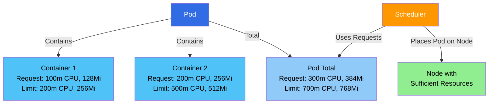
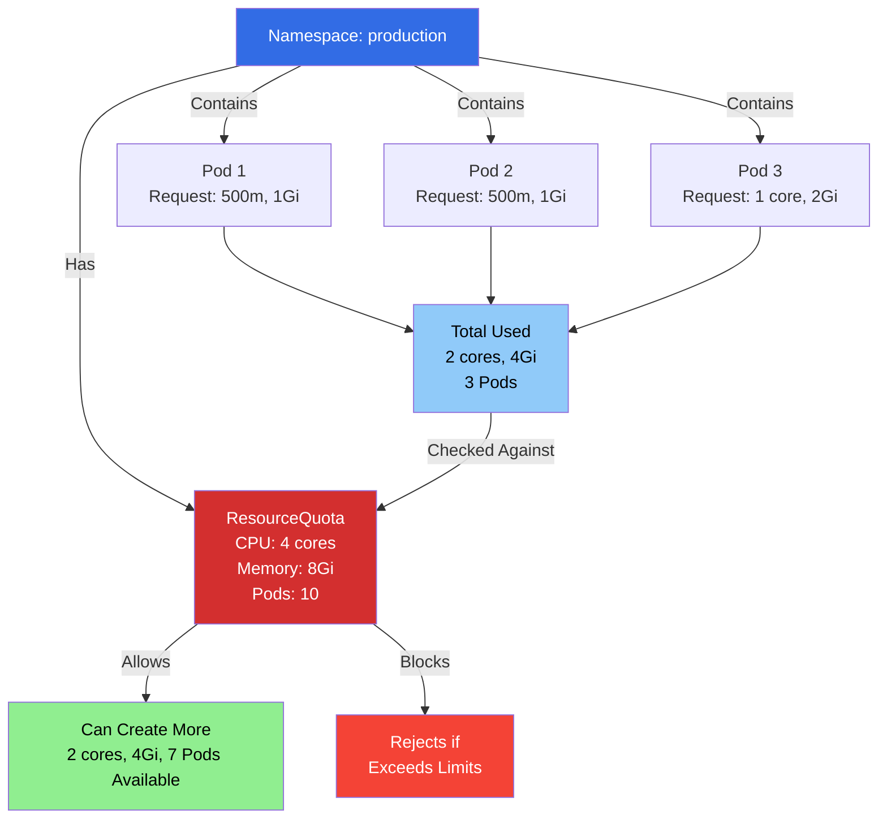
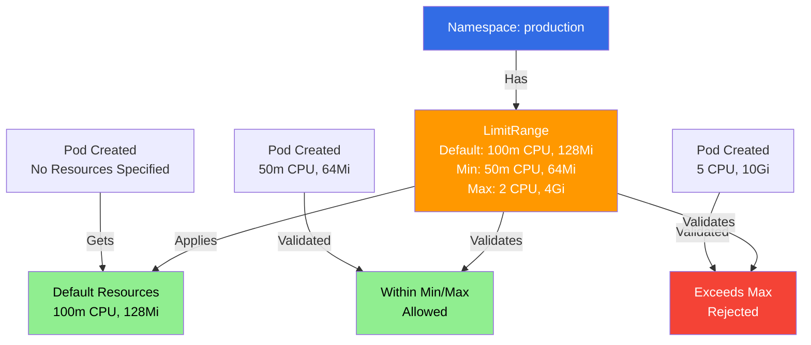
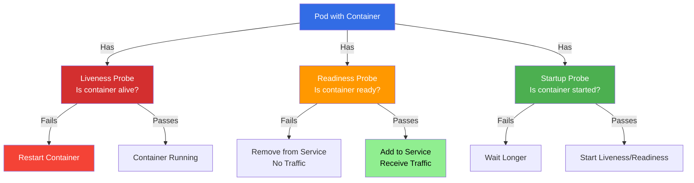
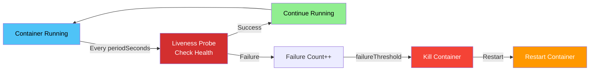
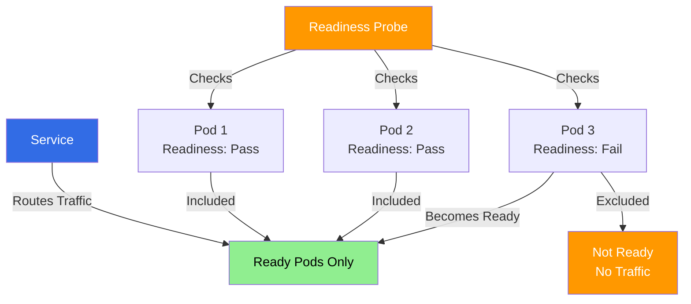
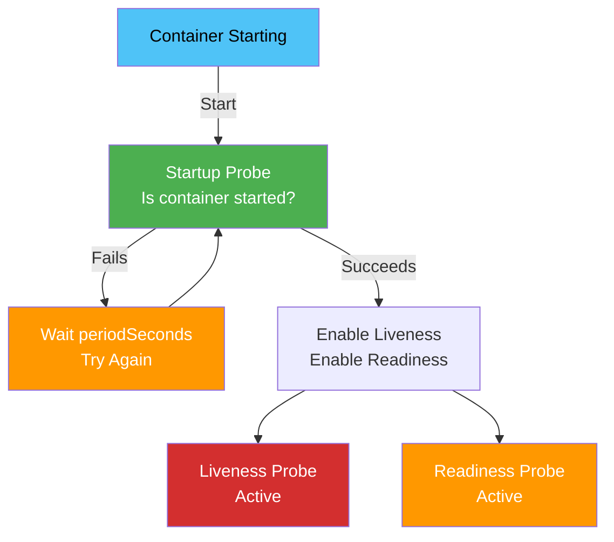
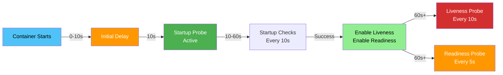

### Resource Management Overview

Kubernetes provides multiple levels of resource management:

1. **Container Level** - Requests and Limits for individual containers
2. **Pod Level** - Sum of all container resources
3. **Namespace Level** - Resource Quotas for entire namespace
4. **Cluster Level** - Total cluster capacity

**📚 Tutorial:**
- **[Resource Management Tutorial](https://github.com/jayeshjd555/Kubernetes/blob/main/tutorials/06-resource-management/README.md)** - Hands-on tutorial covering Resource Quotas and LimitRange

### Resource Requests and Limits

**Requests** and **Limits** are specified at the container level and control CPU and memory allocation.

#### What are Requests and Limits?

**Requests:**
- **Guaranteed resources** - Minimum resources reserved for container
- **Scheduling decision** - Scheduler uses requests to place Pods
- **Guaranteed allocation** - Container gets at least this amount

**Limits:**
- **Maximum resources** - Container cannot exceed this
- **Enforcement** - Container is throttled/killed if exceeded
- **Protection** - Prevents resource exhaustion

**Simple Analogy:**
- **Request** = "I need at least 1GB RAM" (guaranteed)
- **Limit** = "I can use up to 2GB RAM" (maximum)

#### Resource Units

**CPU:**
- **1 CPU** = 1 vCPU/core = 1000m (millicores)
- Examples: `100m`, `0.5`, `1`, `2`
- Can be specified as: `100m`, `0.1`, `1`

**Memory:**
- Units: `Ki`, `Mi`, `Gi`, `Ti` (binary) or `K`, `M`, `G`, `T` (decimal)
- Examples: `128Mi`, `1Gi`, `512Mi`
- Always specify units (no bare numbers)

#### Resource Requests and Limits Diagram



#### Setting Resource Requests and Limits

**In Pod Spec:**

```yaml
apiVersion: v1
kind: Pod
metadata:
  name: resource-pod
spec:
  containers:
  - name: app
    image: nginx:latest
    resources:
      requests:
        memory: "64Mi"
        cpu: "250m"
      limits:
        memory: "128Mi"
        cpu: "500m"
```

**In Deployment:**

```yaml
apiVersion: apps/v1
kind: Deployment
metadata:
  name: nginx-deployment
spec:
  replicas: 3
  template:
    spec:
      containers:
      - name: nginx
        image: nginx:latest
        resources:
          requests:
            memory: "64Mi"
            cpu: "100m"
          limits:
            memory: "128Mi"
            cpu: "200m"
```

#### Resource QoS Classes

Kubernetes assigns Quality of Service (QoS) classes based on resource settings:

**1. Guaranteed:**
- All containers have requests = limits
- Highest priority
- Last to be evicted

```yaml
resources:
  requests:
    memory: "128Mi"
    cpu: "200m"
  limits:
    memory: "128Mi"  # Same as request
    cpu: "200m"      # Same as request
```

**2. Burstable:**
- At least one container has request < limit
- Medium priority
- Evicted if BestEffort pods exist

```yaml
resources:
  requests:
    memory: "64Mi"
    cpu: "100m"
  limits:
    memory: "128Mi"  # Higher than request
    cpu: "200m"      # Higher than request
```

**3. BestEffort:**
- No requests or limits specified
- Lowest priority
- First to be evicted

```yaml
# No resources specified
```

#### Resource Enforcement

**CPU Limits:**
- Container throttled if exceeds limit
- CPU is compressible (can be throttled)
- Container continues running

**Memory Limits:**
- Container killed (OOMKilled) if exceeds limit
- Memory is incompressible
- Pod may be restarted

### Resource Quotas

**ResourceQuota** restricts the total resource consumption per namespace. It prevents a namespace from consuming all cluster resources.

#### What is a ResourceQuota?

A ResourceQuota:
- **Limits namespace resources** - Total CPU, memory, storage
- **Limits object counts** - Number of Pods, Services, etc.
- **Namespace-scoped** - Applies to entire namespace
- **Enforced** - Prevents exceeding limits

#### ResourceQuota Diagram



#### ResourceQuota Structure

```yaml
apiVersion: v1
kind: ResourceQuota
metadata:
  name: compute-quota
  namespace: production
spec:
  hard:
    # Compute resources
    requests.cpu: "4"
    requests.memory: 8Gi
    limits.cpu: "8"
    limits.memory: 16Gi
    
    # Storage resources
    requests.storage: 100Gi
    persistentvolumeclaims: "10"
    
    # Object counts
    pods: "10"
    services: "5"
    deployments.apps: "5"
    replicasets.apps: "10"
    secrets: "10"
    configmaps: "10"
```

#### ResourceQuota Spec Fields Explained

**apiVersion:**
- API version for ResourceQuota
- Required: `v1`

**kind:**
- Object type
- Required: `ResourceQuota`

**metadata:**
- Object metadata
- **name:** ResourceQuota name (required)
- **namespace:** Namespace (required)

**spec:**
- ResourceQuota specification
- **hard:** Hard limits (required)
  - **requests.cpu:** Total CPU requests
  - **requests.memory:** Total memory requests
  - **limits.cpu:** Total CPU limits
  - **limits.memory:** Total memory limits
  - **requests.storage:** Total storage requests
  - **persistentvolumeclaims:** Number of PVCs
  - **pods:** Number of Pods
  - **services:** Number of Services
  - **deployments.apps:** Number of Deployments
  - **replicasets.apps:** Number of ReplicaSets
  - **secrets:** Number of Secrets
  - **configmaps:** Number of ConfigMaps
  - And many more...

#### Creating ResourceQuota

```yaml
apiVersion: v1
kind: ResourceQuota
metadata:
  name: compute-quota
  namespace: production
spec:
  hard:
    requests.cpu: "4"
    requests.memory: 8Gi
    limits.cpu: "8"
    limits.memory: 16Gi
    pods: "10"
```

```bash
kubectl apply -f resourcequota.yaml
```

#### Managing ResourceQuota

```bash
# List ResourceQuotas
kubectl get resourcequotas
kubectl get quota

# List in namespace
kubectl get quota -n <namespace>

# Get ResourceQuota details
kubectl get quota <quota-name> -n <namespace>

# Describe ResourceQuota
kubectl describe quota <quota-name> -n <namespace>

# View ResourceQuota YAML
kubectl get quota <quota-name> -n <namespace> -o yaml

# Delete ResourceQuota
kubectl delete quota <quota-name> -n <namespace>
```

### LimitRange

**LimitRange** sets default resource requests and limits for Pods and containers in a namespace. It also sets min/max constraints.

#### What is a LimitRange?

A LimitRange:
- **Sets defaults** - Default requests/limits if not specified
- **Enforces min/max** - Validates resource requests/limits
- **Namespace-scoped** - Applies to entire namespace
- **Prevents issues** - Ensures all Pods have resources

#### LimitRange Diagram



#### LimitRange Structure

```yaml
apiVersion: v1
kind: LimitRange
metadata:
  name: mem-limit-range
  namespace: production
spec:
  limits:
  - default:
      memory: "512Mi"
      cpu: "500m"
    defaultRequest:
      memory: "256Mi"
      cpu: "250m"
    max:
      memory: "1Gi"
      cpu: "1"
    min:
      memory: "128Mi"
      cpu: "100m"
    type: Container
```

#### LimitRange Spec Fields Explained

**apiVersion:**
- API version for LimitRange
- Required: `v1`

**kind:**
- Object type
- Required: `LimitRange`

**metadata:**
- Object metadata
- **name:** LimitRange name (required)
- **namespace:** Namespace (required)

**spec:**
- LimitRange specification
- **limits:** List of limit rules
  - **type:** Resource type
    - **Container:** For containers
    - **Pod:** For entire Pod
    - **PersistentVolumeClaim:** For PVCs
  - **default:** Default limits (if not specified)
  - **defaultRequest:** Default requests (if not specified)
  - **max:** Maximum allowed
  - **min:** Minimum required
  - **maxLimitRequestRatio:** Max ratio of limit to request

#### Creating LimitRange

```yaml
apiVersion: v1
kind: LimitRange
metadata:
  name: mem-limit-range
  namespace: production
spec:
  limits:
  - default:
      memory: "512Mi"
      cpu: "500m"
    defaultRequest:
      memory: "256Mi"
      cpu: "250m"
    max:
      memory: "1Gi"
      cpu: "1"
    min:
      memory: "128Mi"
      cpu: "100m"
    type: Container
```

```bash
kubectl apply -f limitrange.yaml
```

#### Managing LimitRange

```bash
# List LimitRanges
kubectl get limitranges
kubectl get limits

# List in namespace
kubectl get limits -n <namespace>

# Get LimitRange details
kubectl get limits <limitrange-name> -n <namespace>

# Describe LimitRange
kubectl describe limits <limitrange-name> -n <namespace>

# View LimitRange YAML
kubectl get limits <limitrange-name> -n <namespace> -o yaml

# Delete LimitRange
kubectl delete limits <limitrange-name> -n <namespace>
```

### How They Work Together

**Resource Management Hierarchy:**

```
Cluster Resources
    ↓
ResourceQuota (Namespace Level)
    ↓
LimitRange (Default/Min/Max)
    ↓
Pod Resources (Sum of Containers)
    ↓
Container Resources (Requests/Limits)
```

**Example Flow:**

1. **LimitRange** sets defaults: 100m CPU, 128Mi memory
2. **Pod created** without resources → Gets defaults from LimitRange
3. **ResourceQuota** checks: Total namespace resources < quota
4. **If exceeds quota** → Pod creation rejected
5. **If within quota** → Pod created with resources

### Best Practices

**Resource Requests and Limits:**

1. **Always set requests** - Helps scheduler place Pods
2. **Set appropriate limits** - Prevent resource exhaustion
3. **Requests ≤ Limits** - Limits should be >= requests
4. **Monitor usage** - Adjust based on actual usage
5. **Use meaningful units** - Be specific with units

**ResourceQuota:**

1. **Set per namespace** - Different quotas for different namespaces
2. **Start conservative** - Adjust based on needs
3. **Monitor usage** - Check quota utilization
4. **Include object counts** - Limit number of objects
5. **Review regularly** - Update as needs change

**LimitRange:**

1. **Set defaults** - Ensure all Pods have resources
2. **Set min/max** - Prevent too small/large resources
3. **Namespace-specific** - Different limits per namespace
4. **Use with ResourceQuota** - Works together
5. **Test limits** - Verify they work correctly

### Common Patterns

**Pattern 1: Development Namespace**

```yaml
# ResourceQuota - Generous limits
apiVersion: v1
kind: ResourceQuota
metadata:
  name: dev-quota
  namespace: development
spec:
  hard:
    requests.cpu: "2"
    requests.memory: 4Gi
    limits.cpu: "4"
    limits.memory: 8Gi
    pods: "20"

---
# LimitRange - Small defaults
apiVersion: v1
kind: LimitRange
metadata:
  name: dev-limits
  namespace: development
spec:
  limits:
  - default:
      memory: "256Mi"
      cpu: "200m"
    defaultRequest:
      memory: "128Mi"
      cpu: "100m"
    type: Container
```

**Pattern 2: Production Namespace**

```yaml
# ResourceQuota - Strict limits
apiVersion: v1
kind: ResourceQuota
metadata:
  name: prod-quota
  namespace: production
spec:
  hard:
    requests.cpu: "8"
    requests.memory: 16Gi
    limits.cpu: "16"
    limits.memory: 32Gi
    pods: "10"
    deployments.apps: "5"

---
# LimitRange - Enforced limits
apiVersion: v1
kind: LimitRange
metadata:
  name: prod-limits
  namespace: production
spec:
  limits:
  - default:
      memory: "512Mi"
      cpu: "500m"
    defaultRequest:
      memory: "256Mi"
      cpu: "250m"
    max:
      memory: "2Gi"
      cpu: "2"
    min:
      memory: "128Mi"
      cpu: "100m"
    type: Container
```

### Troubleshooting

**Common Issues:**

1. **Pod creation fails:**
   ```bash
   # Check ResourceQuota
   kubectl describe quota -n <namespace>
   
   # Check usage
   kubectl get quota -n <namespace> -o yaml
   ```

2. **Resource limit exceeded:**
   ```bash
   # Check container limits
   kubectl describe pod <pod-name>
   
   # Check for OOMKilled
   kubectl get pod <pod-name>
   ```

3. **Scheduling failures:**
   ```bash
   # Check node resources
   kubectl describe node <node-name>
   
   # Check pod requests
   kubectl describe pod <pod-name>
   ```

### Key Takeaways

1. **Requests = Guaranteed resources** - Minimum allocation
2. **Limits = Maximum resources** - Cannot exceed
3. **ResourceQuota = Namespace limits** - Total resources per namespace
4. **LimitRange = Defaults and constraints** - Min/max/default values
5. **QoS classes** - Guaranteed, Burstable, BestEffort
6. **CPU is compressible** - Can be throttled
7. **Memory is incompressible** - Container killed if exceeded
8. **Always set resources** - Helps with scheduling and stability
9. **Monitor usage** - Adjust based on actual consumption
10. **Use together** - ResourceQuota + LimitRange for complete control

Resource Quotas and Limits are essential for managing resources in Kubernetes clusters, ensuring fair allocation and preventing resource exhaustion.

</details>

---

<details>
<summary><h2>Probes</h2></summary>

## Probes

**Probes** are health checks that Kubernetes performs on containers to determine their state. They help Kubernetes make decisions about container lifecycle and traffic routing.

### What are Probes?

**Simple Explanation:**
Probes are like **health checkups** for your containers. Kubernetes periodically checks:
- **Is the container alive?** - Should it be restarted?
- **Is the container ready?** - Can it receive traffic?
- **Has the container started?** - Is it still starting up?

**Why Use Probes?**
- **Self-healing** - Automatically restart unhealthy containers
- **Traffic management** - Only send traffic to ready containers
- **Startup handling** - Wait for slow-starting containers
- **Better reliability** - Catch issues before they affect users

**Analogy:**
Think of a restaurant:
- **Liveness Probe** = "Is the waiter still alive/working?" (restart if not)
- **Readiness Probe** = "Is the waiter ready to serve?" (don't send customers if not)
- **Startup Probe** = "Is the waiter still getting ready?" (wait before checking readiness)

### Types of Probes

Kubernetes provides three types of probes:

1. **Liveness Probe** - Is the container running?
2. **Readiness Probe** - Is the container ready to serve traffic?
3. **Startup Probe** - Has the container finished starting?

### Probe Types

Each probe can use one of three mechanisms:

1. **HTTP GET** - HTTP request to container
2. **TCP Socket** - TCP connection to container
3. **Exec** - Execute command in container

### Probes Overview Diagram



---

### Liveness Probe

**Liveness Probe** determines if a container is running. If it fails, Kubernetes kills and restarts the container.

#### What is a Liveness Probe?

A Liveness Probe:
- **Checks if container is alive** - Is the application running?
- **Restarts on failure** - Kills and restarts container if probe fails
- **Prevents dead containers** - Removes containers that are stuck
- **Continuous monitoring** - Runs throughout container lifetime

**Use Case:**
- Application is running but stuck (deadlock, infinite loop)
- Application crashed but process still running
- Container needs restart to recover

#### Liveness Probe Diagram



#### Liveness Probe Configuration

```yaml
apiVersion: v1
kind: Pod
metadata:
  name: liveness-pod
spec:
  containers:
  - name: app
    image: nginx:latest
    livenessProbe:
      httpGet:
        path: /health
        port: 80
      initialDelaySeconds: 30
      periodSeconds: 10
      timeoutSeconds: 5
      successThreshold: 1
      failureThreshold: 3
```

#### Liveness Probe Parameters

**initialDelaySeconds:**
- Time to wait before first probe (default: 0)
- Give container time to start
- Example: `30` (wait 30 seconds)

**periodSeconds:**
- How often to perform probe (default: 10)
- Frequency of health checks
- Example: `10` (every 10 seconds)

**timeoutSeconds:**
- Probe timeout (default: 1)
- Maximum time to wait for response
- Example: `5` (5 seconds timeout)

**successThreshold:**
- Consecutive successes needed (default: 1)
- For liveness: must be 1
- Example: `1`

**failureThreshold:**
- Consecutive failures before action (default: 3)
- Number of failures before restart
- Example: `3` (restart after 3 failures)

#### Liveness Probe Examples

**Example 1: HTTP GET Probe**

```yaml
apiVersion: v1
kind: Pod
metadata:
  name: http-liveness
spec:
  containers:
  - name: app
    image: nginx:latest
    livenessProbe:
      httpGet:
        path: /health
        port: 8080
        scheme: HTTP
        httpHeaders:
        - name: Custom-Header
          value: HealthCheck
      initialDelaySeconds: 30
      periodSeconds: 10
      failureThreshold: 3
```

**Example 2: TCP Socket Probe**

```yaml
apiVersion: v1
kind: Pod
metadata:
  name: tcp-liveness
spec:
  containers:
  - name: app
    image: nginx:latest
    livenessProbe:
      tcpSocket:
        port: 80
      initialDelaySeconds: 15
      periodSeconds: 20
      failureThreshold: 3
```

**Example 3: Exec Probe**

```yaml
apiVersion: v1
kind: Pod
metadata:
  name: exec-liveness
spec:
  containers:
  - name: app
    image: nginx:latest
    livenessProbe:
      exec:
        command:
        - /bin/sh
        - -c
        - "ps aux | grep nginx | grep -v grep"
      initialDelaySeconds: 30
      periodSeconds: 10
      failureThreshold: 3
```

---

### Readiness Probe

**Readiness Probe** determines if a container is ready to accept traffic. If it fails, the container is removed from Service endpoints.

#### What is a Readiness Probe?

A Readiness Probe:
- **Checks if container is ready** - Can it handle requests?
- **Removes from Service** - Container not included in load balancing
- **Doesn't restart** - Container keeps running, just no traffic
- **Traffic management** - Only ready containers receive traffic

**Use Case:**
- Application is starting but not ready
- Application is temporarily overloaded
- Application needs to load data before serving
- Database connection not ready

#### Readiness Probe Diagram



#### Readiness Probe Configuration

```yaml
apiVersion: v1
kind: Pod
metadata:
  name: readiness-pod
spec:
  containers:
  - name: app
    image: nginx:latest
    readinessProbe:
      httpGet:
        path: /ready
        port: 80
      initialDelaySeconds: 5
      periodSeconds: 5
      timeoutSeconds: 3
      successThreshold: 1
      failureThreshold: 3
```

#### Readiness Probe Examples

**Example 1: HTTP GET Probe**

```yaml
apiVersion: v1
kind: Pod
metadata:
  name: http-readiness
spec:
  containers:
  - name: app
    image: nginx:latest
    readinessProbe:
      httpGet:
        path: /ready
        port: 8080
      initialDelaySeconds: 5
      periodSeconds: 5
      failureThreshold: 3
```

**Example 2: TCP Socket Probe**

```yaml
apiVersion: v1
kind: Pod
metadata:
  name: tcp-readiness
spec:
  containers:
  - name: app
    image: nginx:latest
    readinessProbe:
      tcpSocket:
        port: 80
      initialDelaySeconds: 5
      periodSeconds: 5
```

**Example 3: Exec Probe**

```yaml
apiVersion: v1
kind: Pod
metadata:
  name: exec-readiness
spec:
  containers:
  - name: app
    image: nginx:latest
    readinessProbe:
      exec:
        command:
        - /bin/sh
        - -c
        - "curl -f http://localhost:80/ready || exit 1"
      initialDelaySeconds: 5
      periodSeconds: 5
```

---

### Startup Probe

**Startup Probe** determines if a container has finished starting. It disables liveness and readiness probes until it succeeds.

#### What is a Startup Probe?

A Startup Probe:
- **Checks if container started** - Has initialization completed?
- **Disables other probes** - Liveness/readiness wait until startup succeeds
- **Handles slow starts** - For applications that take time to start
- **One-time check** - Once successful, liveness/readiness take over

**Use Case:**
- Applications with long startup times
- Applications that need initialization
- Legacy applications
- Applications loading large datasets

#### Startup Probe Diagram



#### Startup Probe Configuration

```yaml
apiVersion: v1
kind: Pod
metadata:
  name: startup-pod
spec:
  containers:
  - name: app
    image: nginx:latest
    startupProbe:
      httpGet:
        path: /startup
        port: 80
      initialDelaySeconds: 10
      periodSeconds: 10
      timeoutSeconds: 5
      successThreshold: 1
      failureThreshold: 30
    livenessProbe:
      httpGet:
        path: /health
        port: 80
      periodSeconds: 10
    readinessProbe:
      httpGet:
        path: /ready
        port: 80
      periodSeconds: 5
```

#### Startup Probe Examples

**Example 1: HTTP GET Probe**

```yaml
apiVersion: v1
kind: Pod
metadata:
  name: http-startup
spec:
  containers:
  - name: app
    image: nginx:latest
    startupProbe:
      httpGet:
        path: /startup
        port: 8080
      initialDelaySeconds: 10
      periodSeconds: 10
      failureThreshold: 30  # Allow up to 5 minutes (30 * 10s)
    livenessProbe:
      httpGet:
        path: /health
        port: 8080
      periodSeconds: 10
    readinessProbe:
      httpGet:
        path: /ready
        port: 8080
      periodSeconds: 5
```

**Example 2: Exec Probe for Database**

```yaml
apiVersion: v1
kind: Pod
metadata:
  name: db-startup
spec:
  containers:
  - name: mysql
    image: mysql:8.0
    startupProbe:
      exec:
        command:
        - /bin/sh
        - -c
        - "mysqladmin ping -h localhost"
      initialDelaySeconds: 30
      periodSeconds: 10
      failureThreshold: 30
    livenessProbe:
      exec:
        command:
        - /bin/sh
        - -c
        - "mysqladmin ping -h localhost"
      periodSeconds: 30
```

---

### Probe Types Explained

#### 1. HTTP GET Probe

**What it does:**
- Sends HTTP GET request to container
- Checks HTTP status code
- Success if status code is 200-399

**Configuration:**
```yaml
httpGet:
  path: /health
  port: 80
  scheme: HTTP  # or HTTPS
  httpHeaders:
  - name: Custom-Header
    value: Value
```

**Use Case:**
- Web applications
- REST APIs
- Applications with HTTP endpoints

#### 2. TCP Socket Probe

**What it does:**
- Attempts TCP connection to container
- Success if connection succeeds
- Doesn't send any data

**Configuration:**
```yaml
tcpSocket:
  port: 80
```

**Use Case:**
- Applications without HTTP endpoints
- Database connections
- Custom protocols

#### 3. Exec Probe

**What it does:**
- Executes command in container
- Success if command exits with code 0
- Failure if command exits with non-zero code

**Configuration:**
```yaml
exec:
  command:
  - /bin/sh
  - -c
  - "command to execute"
```

**Use Case:**
- Custom health check logic
- Script-based checks
- Complex validation

### Complete Probe Example

```yaml
apiVersion: v1
kind: Pod
metadata:
  name: complete-probe-example
spec:
  containers:
  - name: app
    image: nginx:latest
    ports:
    - containerPort: 80
    
    # Startup Probe - Wait for app to start
    startupProbe:
      httpGet:
        path: /startup
        port: 80
      initialDelaySeconds: 10
      periodSeconds: 10
      timeoutSeconds: 5
      failureThreshold: 30  # 5 minutes max
    
    # Liveness Probe - Is app alive?
    livenessProbe:
      httpGet:
        path: /health
        port: 80
      initialDelaySeconds: 30
      periodSeconds: 10
      timeoutSeconds: 5
      failureThreshold: 3  # Restart after 3 failures
    
    # Readiness Probe - Is app ready?
    readinessProbe:
      httpGet:
        path: /ready
        port: 80
      initialDelaySeconds: 5
      periodSeconds: 5
      timeoutSeconds: 3
      failureThreshold: 3  # Remove from service after 3 failures
```

### Probe Timing Diagram



### Probe Best Practices

**1. Use All Three Probes**
```yaml
startupProbe:    # For slow-starting apps
livenessProbe:   # To restart dead containers
readinessProbe:  # To manage traffic
```

**2. Set Appropriate Delays**
```yaml
startupProbe:
  initialDelaySeconds: 10  # Wait for startup
livenessProbe:
  initialDelaySeconds: 30  # Wait longer for liveness
readinessProbe:
  initialDelaySeconds: 5   # Check readiness quickly
```

**3. Use HTTP for Web Apps**
```yaml
readinessProbe:
  httpGet:
    path: /ready
    port: 8080
```

**4. Use TCP for Non-HTTP**
```yaml
livenessProbe:
  tcpSocket:
    port: 3306
```

**5. Set Reasonable Thresholds**
```yaml
startupProbe:
  failureThreshold: 30  # Allow time for startup
livenessProbe:
  failureThreshold: 3   # Restart quickly if dead
readinessProbe:
  failureThreshold: 3   # Remove from service quickly
```

**6. Use Startup Probe for Slow Apps**
- Prevents premature restarts
- Allows long initialization
- Disables liveness/readiness until ready

**7. Make Probes Lightweight**
- Don't do heavy operations
- Keep response times fast
- Use dedicated health endpoints

**8. Test Your Probes**
- Verify they work correctly
- Test failure scenarios
- Monitor probe behavior

### Common Patterns

**Pattern 1: Web Application**

```yaml
apiVersion: v1
kind: Pod
metadata:
  name: web-app
spec:
  containers:
  - name: app
    image: web-app:latest
    startupProbe:
      httpGet:
        path: /startup
        port: 8080
      failureThreshold: 30
    livenessProbe:
      httpGet:
        path: /health
        port: 8080
      periodSeconds: 10
    readinessProbe:
      httpGet:
        path: /ready
        port: 8080
      periodSeconds: 5
```

**Pattern 2: Database**

```yaml
apiVersion: v1
kind: Pod
metadata:
  name: database
spec:
  containers:
  - name: mysql
    image: mysql:8.0
    startupProbe:
      exec:
        command:
        - mysqladmin
        - ping
        - -h
        - localhost
      failureThreshold: 30
    livenessProbe:
      exec:
        command:
        - mysqladmin
        - ping
        - -h
        - localhost
      periodSeconds: 30
    readinessProbe:
      exec:
        command:
        - mysqladmin
        - ping
        - -h
        - localhost
      periodSeconds: 10
```

**Pattern 3: Simple Application**

```yaml
apiVersion: v1
kind: Pod
metadata:
  name: simple-app
spec:
  containers:
  - name: app
    image: app:latest
    livenessProbe:
      tcpSocket:
        port: 8080
      periodSeconds: 10
    readinessProbe:
      tcpSocket:
        port: 8080
      periodSeconds: 5
```

### Troubleshooting Probes

**Common Issues:**

1. **Container restarts frequently:**
   ```bash
   # Check liveness probe
   kubectl describe pod <pod-name>
   
   # Check probe logs
   kubectl logs <pod-name>
   
   # Verify health endpoint
   kubectl exec <pod-name> -- curl http://localhost:80/health
   ```

2. **Container not receiving traffic:**
   ```bash
   # Check readiness probe
   kubectl describe pod <pod-name>
   
   # Check endpoints
   kubectl get endpoints <service-name>
   
   # Verify ready endpoint
   kubectl exec <pod-name> -- curl http://localhost:80/ready
   ```

3. **Container takes too long to start:**
   ```bash
   # Add startup probe
   # Increase failureThreshold
   # Check application logs
   ```

### Key Takeaways

1. **Liveness Probe** - Restarts container if unhealthy
2. **Readiness Probe** - Controls traffic routing
3. **Startup Probe** - Handles slow-starting applications
4. **Three probe types** - HTTP GET, TCP Socket, Exec
5. **Set appropriate delays** - Give containers time to start
6. **Use all three probes** - For best reliability
7. **Make probes lightweight** - Fast response times
8. **Test your probes** - Verify they work correctly
9. **Monitor probe behavior** - Check for issues
10. **Startup probe disables others** - Until it succeeds

Probes are essential for maintaining application health and reliability in Kubernetes. They enable self-healing and intelligent traffic management.

</details>

---

<details>
<summary><h2>Autoscaling</h2></summary>

## Autoscaling

**Autoscaling** in Kubernetes allows your applications and infrastructure to automatically adjust resources based on demand. This ensures optimal performance while minimizing costs.
