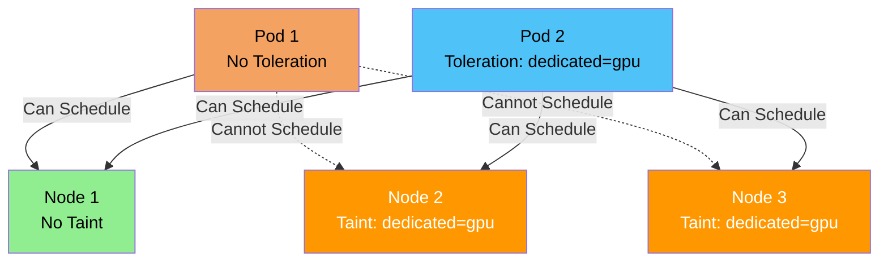

### What are Taints and Tolerations?

**Simple Explanation:**
- **Taint** = A "no entry" sign on a node - prevents pods from being scheduled
- **Toleration** = A "permission slip" for a pod - allows it to ignore the taint

**Analogy:**
Think of a parking lot:
- **Taint** = "Reserved for VIPs only" sign (regular cars can't park)
- **Toleration** = VIP pass (allows you to park in reserved spots)
- **Regular pods** = Regular cars (can't park in reserved spots)
- **Pods with toleration** = VIP cars (can park in reserved spots)

### Taints and Tolerations Diagram



### Taints

**Taint** is a property of a node that repels pods from being scheduled on it, unless the pod has a matching toleration.

#### Taint Structure

A taint has three parts:
- **Key:** Identifier for the taint
- **Value:** Optional value for the taint
- **Effect:** What happens when pod doesn't have toleration
  - **NoSchedule:** Pod won't be scheduled (hard constraint)
  - **PreferNoSchedule:** Try not to schedule (soft constraint)
  - **NoExecute:** Evict existing pods without toleration

#### Taint Effects Explained

**NoSchedule:**
- Pods without matching toleration **cannot be scheduled**
- Existing pods without toleration **remain running**
- Hard constraint - scheduler won't place pods

**PreferNoSchedule:**
- Scheduler **tries to avoid** scheduling pods without toleration
- Will schedule if no other nodes available
- Soft constraint - preference, not requirement

**NoExecute:**
- Pods without matching toleration **cannot be scheduled**
- Existing pods without toleration **are evicted**
- Most restrictive - affects existing pods

#### Adding Taints to Nodes

```bash
# Add taint to node
kubectl taint nodes <node-name> key=value:effect

# Examples
kubectl taint nodes node1 dedicated=gpu:NoSchedule
kubectl taint nodes node1 app=special:PreferNoSchedule
kubectl taint nodes node1 maintenance=true:NoExecute
```

#### Viewing Taints

```bash
# View node taints
kubectl describe node <node-name>

# Get taints in YAML
kubectl get node <node-name> -o yaml | grep taint
```

#### Removing Taints

```bash
# Remove taint from node
kubectl taint nodes <node-name> key=value:effect-

# Remove all taints with key
kubectl taint nodes <node-name> key-

# Example
kubectl taint nodes node1 dedicated=gpu:NoSchedule-
```

### Tolerations

**Toleration** is a property of a pod that allows it to be scheduled on a node with a matching taint.

#### Toleration Structure

```yaml
tolerations:
- key: "dedicated"
  operator: "Equal"
  value: "gpu"
  effect: "NoSchedule"
```

#### Toleration Fields Explained

**key:**
- Taint key to match (required)
- Example: `"dedicated"`, `"app"`

**operator:**
- **Equal:** Key and value must match exactly
- **Exists:** Key must exist (value ignored)

**value:**
- Taint value to match (required if operator is Equal)
- Ignored if operator is Exists

**effect:**
- Taint effect to match (optional)
- **NoSchedule**, **PreferNoSchedule**, **NoExecute**
- If not specified, matches all effects

**tolerationSeconds:**
- For NoExecute effect only
- How long to wait before evicting pod
- Only applies to NoExecute taints

#### Adding Tolerations to Pods

**Method 1: In Pod Spec**

```yaml
apiVersion: v1
kind: Pod
metadata:
  name: gpu-pod
spec:
  tolerations:
  - key: "dedicated"
    operator: "Equal"
    value: "gpu"
    effect: "NoSchedule"
  containers:
  - name: app
    image: nginx:latest
```

**Method 2: In Deployment**

```yaml
apiVersion: apps/v1
kind: Deployment
metadata:
  name: gpu-deployment
spec:
  replicas: 3
  template:
    spec:
      tolerations:
      - key: "dedicated"
        operator: "Equal"
        value: "gpu"
        effect: "NoSchedule"
      containers:
      - name: app
        image: nginx:latest
```

#### Common Toleration Patterns

**Pattern 1: Match Specific Taint**

```yaml
tolerations:
- key: "dedicated"
  operator: "Equal"
  value: "gpu"
  effect: "NoSchedule"
```

**Pattern 2: Match Any Value for Key**

```yaml
tolerations:
- key: "dedicated"
  operator: "Exists"
  effect: "NoSchedule"
```

**Pattern 3: Match Any Effect**

```yaml
tolerations:
- key: "dedicated"
  operator: "Equal"
  value: "gpu"
  # No effect specified - matches all effects
```

**Pattern 4: Tolerate All Taints (Master Node)**

```yaml
tolerations:
- key: "node-role.kubernetes.io/master"
  operator: "Exists"
  effect: "NoSchedule"
- key: "node-role.kubernetes.io/control-plane"
  operator: "Exists"
  effect: "NoSchedule"
```

### Taints and Tolerations Use Cases

**1. Dedicated Nodes**

```bash
# Taint node for GPU workloads
kubectl taint nodes gpu-node-1 dedicated=gpu:NoSchedule

# Pod with toleration can use GPU node
```

**2. Master/Control Plane Nodes**

```bash
# Master nodes are tainted by default
# System pods have tolerations
# User pods cannot schedule on master
```

**3. Maintenance Mode**

```bash
# Taint node for maintenance
kubectl taint nodes node1 maintenance=true:NoExecute

# Existing pods are evicted
# New pods won't schedule
```

**4. Specialized Workloads**

```bash
# Taint nodes for specific workloads
kubectl taint nodes node1 app=special:PreferNoSchedule

# Prefer not to schedule regular pods
# But will if needed
```

### Taints and Tolerations Examples

#### Example 1: GPU Node

**Taint the Node:**
```bash
kubectl taint nodes gpu-node-1 dedicated=gpu:NoSchedule
```

**Pod with Toleration:**
```yaml
apiVersion: v1
kind: Pod
metadata:
  name: gpu-pod
spec:
  tolerations:
  - key: "dedicated"
    operator: "Equal"
    value: "gpu"
    effect: "NoSchedule"
  nodeSelector:
    accelerator: nvidia-tesla-k80
  containers:
  - name: gpu-app
    image: nvidia/cuda:latest
```

#### Example 2: Master Node Pod

**Master nodes are automatically tainted:**
```bash
# Master node has taint
node-role.kubernetes.io/master:NoSchedule
```

**System Pod with Toleration:**
```yaml
apiVersion: v1
kind: Pod
metadata:
  name: system-pod
spec:
  tolerations:
  - key: "node-role.kubernetes.io/master"
    operator: "Exists"
    effect: "NoSchedule"
  containers:
  - name: system-app
    image: system-image:latest
```

#### Example 3: Maintenance Mode

**Taint for Maintenance:**
```bash
kubectl taint nodes node1 maintenance=true:NoExecute
```

**Pod with Temporary Toleration:**
```yaml
apiVersion: v1
kind: Pod
metadata:
  name: maintenance-pod
spec:
  tolerations:
  - key: "maintenance"
    operator: "Equal"
    value: "true"
    effect: "NoExecute"
    tolerationSeconds: 3600  # Wait 1 hour before eviction
  containers:
  - name: app
    image: nginx:latest
```

### Taints vs Node Selectors

| Feature | Taints | Node Selectors |
|---------|--------|----------------|
| **Purpose** | Repel pods | Attract pods |
| **Direction** | Node → Pod | Pod → Node |
| **Default Behavior** | Pods can't schedule | Pods can schedule anywhere |
| **Use Case** | Dedicated nodes, maintenance | Specific hardware, zones |

**They Work Together:**
- Use **taints** to repel pods from nodes
- Use **tolerations** to allow specific pods
- Use **node selectors** to attract pods to nodes

### Managing Taints and Tolerations

**Node Taints:**
```bash
# Add taint
kubectl taint nodes <node> key=value:effect

# Remove taint
kubectl taint nodes <node> key=value:effect-

# List node taints
kubectl describe node <node>
```

**Pod Tolerations:**
```bash
# View pod tolerations
kubectl get pod <pod-name> -o yaml | grep -A 5 tolerations

# View deployment tolerations
kubectl get deployment <deployment-name> -o yaml | grep -A 5 tolerations
```

### Taints and Tolerations Best Practices

1. **Use for dedicated nodes** - GPU nodes, specialized hardware
2. **Master node taints** - System pods need tolerations
3. **Maintenance mode** - Use NoExecute to drain nodes
4. **Combine with node selectors** - For precise scheduling
5. **Document taints** - Keep track of node taints
6. **Use meaningful keys** - Clear, descriptive taint keys
7. **Test tolerations** - Verify pods can schedule correctly
8. **Monitor scheduling** - Check if pods are being blocked

### Common Taint Patterns

**Pattern 1: Dedicated GPU Nodes**
```bash
kubectl taint nodes gpu-node-1 dedicated=gpu:NoSchedule
```

**Pattern 2: Maintenance Mode**
```bash
kubectl taint nodes node1 maintenance=true:NoExecute
```

**Pattern 3: Special Workloads**
```bash
kubectl taint nodes node1 workload=special:PreferNoSchedule
```

**Pattern 4: Zone-Based**
```bash
kubectl taint nodes node1 zone=production:NoSchedule
```

### Troubleshooting

**Pod Not Scheduling:**
```bash
# Check node taints
kubectl describe node <node-name>

# Check pod tolerations
kubectl get pod <pod-name> -o yaml | grep tolerations

# Check events
kubectl describe pod <pod-name>
```

**Pod Evicted:**
```bash
# Check for NoExecute taints
kubectl describe node <node-name>

# Check pod tolerations
kubectl get pod <pod-name> -o yaml
```

### Key Takeaways

1. **Taints repel pods** - Prevent scheduling on nodes
2. **Tolerations allow pods** - Override taints
3. **Three effects** - NoSchedule, PreferNoSchedule, NoExecute
4. **Use for dedicated nodes** - GPU, specialized hardware
5. **Master nodes are tainted** - System pods need tolerations
6. **Combine with selectors** - For precise scheduling
7. **NoExecute evicts pods** - Removes existing pods
8. **Document your taints** - Keep track of node configurations

Taints and Tolerations are essential for controlling pod placement and ensuring specialized workloads run on appropriate nodes.

</details>
