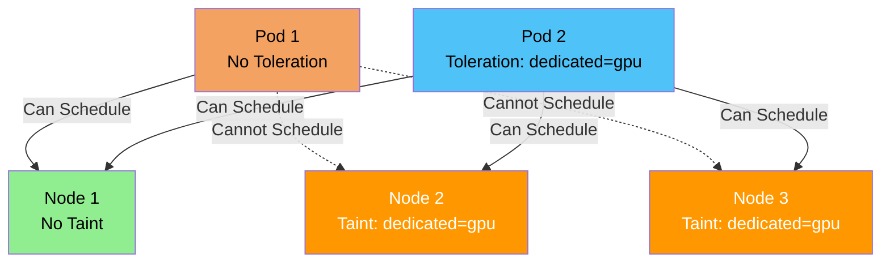
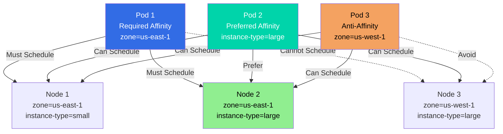
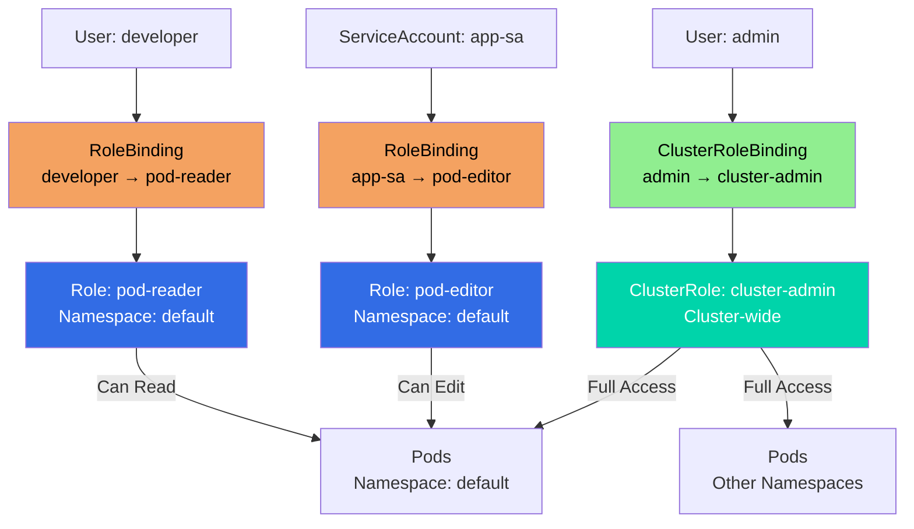

### What are Taints and Tolerations?

**Simple Explanation:**
- **Taint** = A "no entry" sign on a node - prevents pods from being scheduled
- **Toleration** = A "permission slip" for a pod - allows it to ignore the taint

**Analogy:**
Think of a parking lot:
- **Taint** = "Reserved for VIPs only" sign (regular cars can't park)
- **Toleration** = VIP pass (allows you to park in reserved spots)
- **Regular pods** = Regular cars (can't park in reserved spots)
- **Pods with toleration** = VIP cars (can park in reserved spots)

### Taints and Tolerations Diagram



### Taints

**Taint** is a property of a node that repels pods from being scheduled on it, unless the pod has a matching toleration.

#### Taint Structure

A taint has three parts:
- **Key:** Identifier for the taint
- **Value:** Optional value for the taint
- **Effect:** What happens when pod doesn't have toleration
  - **NoSchedule:** Pod won't be scheduled (hard constraint)
  - **PreferNoSchedule:** Try not to schedule (soft constraint)
  - **NoExecute:** Evict existing pods without toleration

#### Taint Effects Explained

**NoSchedule:**
- Pods without matching toleration **cannot be scheduled**
- Existing pods without toleration **remain running**
- Hard constraint - scheduler won't place pods

**PreferNoSchedule:**
- Scheduler **tries to avoid** scheduling pods without toleration
- Will schedule if no other nodes available
- Soft constraint - preference, not requirement

**NoExecute:**
- Pods without matching toleration **cannot be scheduled**
- Existing pods without toleration **are evicted**
- Most restrictive - affects existing pods

#### Adding Taints to Nodes

```bash
# Add taint to node
kubectl taint nodes <node-name> key=value:effect

# Examples
kubectl taint nodes node1 dedicated=gpu:NoSchedule
kubectl taint nodes node1 app=special:PreferNoSchedule
kubectl taint nodes node1 maintenance=true:NoExecute
```

#### Viewing Taints

```bash
# View node taints
kubectl describe node <node-name>

# Get taints in YAML
kubectl get node <node-name> -o yaml | grep taint
```

#### Removing Taints

```bash
# Remove taint from node
kubectl taint nodes <node-name> key=value:effect-

# Remove all taints with key
kubectl taint nodes <node-name> key-

# Example
kubectl taint nodes node1 dedicated=gpu:NoSchedule-
```

### Tolerations

**Toleration** is a property of a pod that allows it to be scheduled on a node with a matching taint.

#### Toleration Structure

```yaml
tolerations:
- key: "dedicated"
  operator: "Equal"
  value: "gpu"
  effect: "NoSchedule"
```

#### Toleration Fields Explained

**key:**
- Taint key to match (required)
- Example: `"dedicated"`, `"app"`

**operator:**
- **Equal:** Key and value must match exactly
- **Exists:** Key must exist (value ignored)

**value:**
- Taint value to match (required if operator is Equal)
- Ignored if operator is Exists

**effect:**
- Taint effect to match (optional)
- **NoSchedule**, **PreferNoSchedule**, **NoExecute**
- If not specified, matches all effects

**tolerationSeconds:**
- For NoExecute effect only
- How long to wait before evicting pod
- Only applies to NoExecute taints

#### Adding Tolerations to Pods

**Method 1: In Pod Spec**

```yaml
apiVersion: v1
kind: Pod
metadata:
  name: gpu-pod
spec:
  tolerations:
  - key: "dedicated"
    operator: "Equal"
    value: "gpu"
    effect: "NoSchedule"
  containers:
  - name: app
    image: nginx:latest
```

**Method 2: In Deployment**

```yaml
apiVersion: apps/v1
kind: Deployment
metadata:
  name: gpu-deployment
spec:
  replicas: 3
  template:
    spec:
      tolerations:
      - key: "dedicated"
        operator: "Equal"
        value: "gpu"
        effect: "NoSchedule"
      containers:
      - name: app
        image: nginx:latest
```

#### Common Toleration Patterns

**Pattern 1: Match Specific Taint**

```yaml
tolerations:
- key: "dedicated"
  operator: "Equal"
  value: "gpu"
  effect: "NoSchedule"
```

**Pattern 2: Match Any Value for Key**

```yaml
tolerations:
- key: "dedicated"
  operator: "Exists"
  effect: "NoSchedule"
```

**Pattern 3: Match Any Effect**

```yaml
tolerations:
- key: "dedicated"
  operator: "Equal"
  value: "gpu"
  # No effect specified - matches all effects
```

**Pattern 4: Tolerate All Taints (Master Node)**

```yaml
tolerations:
- key: "node-role.kubernetes.io/master"
  operator: "Exists"
  effect: "NoSchedule"
- key: "node-role.kubernetes.io/control-plane"
  operator: "Exists"
  effect: "NoSchedule"
```

### Taints and Tolerations Use Cases

**1. Dedicated Nodes**

```bash
# Taint node for GPU workloads
kubectl taint nodes gpu-node-1 dedicated=gpu:NoSchedule

# Pod with toleration can use GPU node
```

**2. Master/Control Plane Nodes**

```bash
# Master nodes are tainted by default
# System pods have tolerations
# User pods cannot schedule on master
```

**3. Maintenance Mode**

```bash
# Taint node for maintenance
kubectl taint nodes node1 maintenance=true:NoExecute

# Existing pods are evicted
# New pods won't schedule
```

**4. Specialized Workloads**

```bash
# Taint nodes for specific workloads
kubectl taint nodes node1 app=special:PreferNoSchedule

# Prefer not to schedule regular pods
# But will if needed
```

### Taints and Tolerations Examples

#### Example 1: GPU Node

**Taint the Node:**
```bash
kubectl taint nodes gpu-node-1 dedicated=gpu:NoSchedule
```

**Pod with Toleration:**
```yaml
apiVersion: v1
kind: Pod
metadata:
  name: gpu-pod
spec:
  tolerations:
  - key: "dedicated"
    operator: "Equal"
    value: "gpu"
    effect: "NoSchedule"
  nodeSelector:
    accelerator: nvidia-tesla-k80
  containers:
  - name: gpu-app
    image: nvidia/cuda:latest
```

#### Example 2: Master Node Pod

**Master nodes are automatically tainted:**
```bash
# Master node has taint
node-role.kubernetes.io/master:NoSchedule
```

**System Pod with Toleration:**
```yaml
apiVersion: v1
kind: Pod
metadata:
  name: system-pod
spec:
  tolerations:
  - key: "node-role.kubernetes.io/master"
    operator: "Exists"
    effect: "NoSchedule"
  containers:
  - name: system-app
    image: system-image:latest
```

#### Example 3: Maintenance Mode

**Taint for Maintenance:**
```bash
kubectl taint nodes node1 maintenance=true:NoExecute
```

**Pod with Temporary Toleration:**
```yaml
apiVersion: v1
kind: Pod
metadata:
  name: maintenance-pod
spec:
  tolerations:
  - key: "maintenance"
    operator: "Equal"
    value: "true"
    effect: "NoExecute"
    tolerationSeconds: 3600  # Wait 1 hour before eviction
  containers:
  - name: app
    image: nginx:latest
```

### Taints vs Node Selectors

| Feature | Taints | Node Selectors |
|---------|--------|----------------|
| **Purpose** | Repel pods | Attract pods |
| **Direction** | Node → Pod | Pod → Node |
| **Default Behavior** | Pods can't schedule | Pods can schedule anywhere |
| **Use Case** | Dedicated nodes, maintenance | Specific hardware, zones |

**They Work Together:**
- Use **taints** to repel pods from nodes
- Use **tolerations** to allow specific pods
- Use **node selectors** to attract pods to nodes

### Managing Taints and Tolerations

**Node Taints:**
```bash
# Add taint
kubectl taint nodes <node> key=value:effect

# Remove taint
kubectl taint nodes <node> key=value:effect-

# List node taints
kubectl describe node <node>
```

**Pod Tolerations:**
```bash
# View pod tolerations
kubectl get pod <pod-name> -o yaml | grep -A 5 tolerations

# View deployment tolerations
kubectl get deployment <deployment-name> -o yaml | grep -A 5 tolerations
```

### Taints and Tolerations Best Practices

1. **Use for dedicated nodes** - GPU nodes, specialized hardware
2. **Master node taints** - System pods need tolerations
3. **Maintenance mode** - Use NoExecute to drain nodes
4. **Combine with node selectors** - For precise scheduling
5. **Document taints** - Keep track of node taints
6. **Use meaningful keys** - Clear, descriptive taint keys
7. **Test tolerations** - Verify pods can schedule correctly
8. **Monitor scheduling** - Check if pods are being blocked

### Common Taint Patterns

**Pattern 1: Dedicated GPU Nodes**
```bash
kubectl taint nodes gpu-node-1 dedicated=gpu:NoSchedule
```

**Pattern 2: Maintenance Mode**
```bash
kubectl taint nodes node1 maintenance=true:NoExecute
```

**Pattern 3: Special Workloads**
```bash
kubectl taint nodes node1 workload=special:PreferNoSchedule
```

**Pattern 4: Zone-Based**
```bash
kubectl taint nodes node1 zone=production:NoSchedule
```

### Troubleshooting

**Pod Not Scheduling:**
```bash
# Check node taints
kubectl describe node <node-name>

# Check pod tolerations
kubectl get pod <pod-name> -o yaml | grep tolerations

# Check events
kubectl describe pod <pod-name>
```

**Pod Evicted:**
```bash
# Check for NoExecute taints
kubectl describe node <node-name>

# Check pod tolerations
kubectl get pod <pod-name> -o yaml
```

### Key Takeaways

1. **Taints repel pods** - Prevent scheduling on nodes
2. **Tolerations allow pods** - Override taints
3. **Three effects** - NoSchedule, PreferNoSchedule, NoExecute
4. **Use for dedicated nodes** - GPU, specialized hardware
5. **Master nodes are tainted** - System pods need tolerations
6. **Combine with selectors** - For precise scheduling
7. **NoExecute evicts pods** - Removes existing pods
8. **Document your taints** - Keep track of node configurations

Taints and Tolerations are essential for controlling pod placement and ensuring specialized workloads run on appropriate nodes.

</details>

---

<details>
<summary><h2>Node Affinity</h2></summary>

## Node Affinity

**Node Affinity** is a Kubernetes feature that allows you to constrain which nodes your Pod can be scheduled on based on node labels. It provides more flexible and powerful scheduling rules compared to node selectors.

### What is Node Affinity?

**Simple Explanation:**
Node Affinity lets you tell Kubernetes **which nodes** your Pod should (or shouldn't) be scheduled on based on node characteristics like zone, instance type, or custom labels.

**Analogy:**
Think of Node Affinity as **preferences for job placement**:
- **Required Affinity** = "Must work in New York office" (hard requirement)
- **Preferred Affinity** = "Would prefer to work in New York office" (soft preference)
- **Anti-Affinity** = "Don't want to work in New York office" (avoidance)

**Key Difference:**
- **Node Selector:** Simple key-value matching (hard requirement only)
- **Node Affinity:** Flexible rules with operators, multiple expressions, and soft/hard requirements

### Node Affinity Diagram



### Types of Node Affinity

**1. Required During Scheduling (requiredDuringSchedulingIgnoredDuringExecution)**
- **Hard requirement** - Pod must match to be scheduled
- If no nodes match, Pod stays in Pending state
- Also called "hard affinity"

**2. Preferred During Scheduling (preferredDuringSchedulingIgnoredDuringExecution)**
- **Soft preference** - Scheduler tries to match but not required
- If no nodes match, Pod can still be scheduled elsewhere
- Also called "soft affinity"

**3. Required During Execution (requiredDuringSchedulingRequiredDuringExecution)**
- **Hard requirement** that's enforced during execution
- Pods can be evicted if node labels change
- Used for critical placement requirements

### Node Affinity Structure

**Basic Structure:**
```yaml
apiVersion: v1
kind: Pod
metadata:
  name: my-pod
spec:
  affinity:
    nodeAffinity:
      requiredDuringSchedulingIgnoredDuringExecution:
        nodeSelectorTerms:
        - matchExpressions:
          - key: zone
            operator: In
            values:
            - us-east-1
            - us-east-2
      preferredDuringSchedulingIgnoredDuringExecution:
      - weight: 100
        preference:
          matchExpressions:
          - key: instance-type
            operator: In
            values:
            - large
  containers:
  - name: app
    image: nginx:latest
```

### Match Expressions

**Match Expressions** define the rules for node selection.

**Structure:**
```yaml
matchExpressions:
- key: <label-key>
  operator: <operator>
  values:
  - <value1>
  - <value2>
```

**Operators:**

**1. In:**
- Node label value must be in the specified list
- Example: `zone` must be `us-east-1` OR `us-east-2`

**2. NotIn:**
- Node label value must NOT be in the specified list
- Example: `zone` must NOT be `us-west-1`

**3. Exists:**
- Node must have the label key (value doesn't matter)
- No values field needed

**4. DoesNotExist:**
- Node must NOT have the label key
- No values field needed

**5. Gt (Greater Than):**
- Node label value must be greater than specified value
- Works with numeric values

**6. Lt (Less Than):**
- Node label value must be less than specified value
- Works with numeric values

### Required Node Affinity

**Required Affinity** is a hard requirement - Pod will only be scheduled on nodes that match.

**Example: Pod must be in us-east-1 zone:**
```yaml
apiVersion: v1
kind: Pod
metadata:
  name: required-affinity-pod
spec:
  affinity:
    nodeAffinity:
      requiredDuringSchedulingIgnoredDuringExecution:
        nodeSelectorTerms:
        - matchExpressions:
          - key: zone
            operator: In
            values:
            - us-east-1
  containers:
  - name: app
    image: nginx:latest
```

**Example: Pod must NOT be in us-west-1:**
```yaml
apiVersion: v1
kind: Pod
metadata:
  name: anti-affinity-pod
spec:
  affinity:
    nodeAffinity:
      requiredDuringSchedulingIgnoredDuringExecution:
        nodeSelectorTerms:
        - matchExpressions:
          - key: zone
            operator: NotIn
            values:
            - us-west-1
  containers:
  - name: app
    image: nginx:latest
```

**Example: Multiple Requirements (AND logic):**
```yaml
apiVersion: v1
kind: Pod
metadata:
  name: multi-requirement-pod
spec:
  affinity:
    nodeAffinity:
      requiredDuringSchedulingIgnoredDuringExecution:
        nodeSelectorTerms:
        - matchExpressions:
          - key: zone
            operator: In
            values:
            - us-east-1
          - key: instance-type
            operator: In
            values:
            - large
            - xlarge
  containers:
  - name: app
    image: nginx:latest
```

**Example: Multiple nodeSelectorTerms (OR logic):**
```yaml
apiVersion: v1
kind: Pod
metadata:
  name: or-logic-pod
spec:
  affinity:
    nodeAffinity:
      requiredDuringSchedulingIgnoredDuringExecution:
        nodeSelectorTerms:
        - matchExpressions:
          - key: zone
            operator: In
            values:
            - us-east-1
        - matchExpressions:
          - key: zone
            operator: In
            values:
            - us-east-2
  containers:
  - name: app
    image: nginx:latest
```

### Preferred Node Affinity

**Preferred Affinity** is a soft preference - Scheduler tries to match but Pod can be scheduled elsewhere if needed.

**Structure:**
```yaml
preferredDuringSchedulingIgnoredDuringExecution:
- weight: <1-100>
  preference:
    matchExpressions:
    - key: <label-key>
      operator: <operator>
      values:
      - <value>
```

**Weight:**
- Range: 1-100
- Higher weight = stronger preference
- Used when multiple preferred rules exist

**Example: Prefer large instances:**
```yaml
apiVersion: v1
kind: Pod
metadata:
  name: preferred-affinity-pod
spec:
  affinity:
    nodeAffinity:
      preferredDuringSchedulingIgnoredDuringExecution:
      - weight: 100
        preference:
          matchExpressions:
          - key: instance-type
            operator: In
            values:
            - large
            - xlarge
  containers:
  - name: app
    image: nginx:latest
```

**Example: Multiple Preferences:**
```yaml
apiVersion: v1
kind: Pod
metadata:
  name: multi-preference-pod
spec:
  affinity:
    nodeAffinity:
      preferredDuringSchedulingIgnoredDuringExecution:
      - weight: 100
        preference:
          matchExpressions:
          - key: zone
            operator: In
            values:
            - us-east-1
      - weight: 50
        preference:
          matchExpressions:
          - key: instance-type
            operator: In
            values:
            - large
  containers:
  - name: app
    image: nginx:latest
```

### Combining Required and Preferred

You can combine both required and preferred affinities:

```yaml
apiVersion: v1
kind: Pod
metadata:
  name: combined-affinity-pod
spec:
  affinity:
    nodeAffinity:
      requiredDuringSchedulingIgnoredDuringExecution:
        nodeSelectorTerms:
        - matchExpressions:
          - key: zone
            operator: In
            values:
            - us-east-1
            - us-east-2
      preferredDuringSchedulingIgnoredDuringExecution:
      - weight: 100
        preference:
          matchExpressions:
          - key: instance-type
            operator: In
            values:
            - large
      - weight: 50
        preference:
          matchExpressions:
          - key: disk-type
            operator: In
            values:
            - ssd
  containers:
  - name: app
    image: nginx:latest
```

### Node Affinity in Deployments

**Example: Deployment with Node Affinity:**
```yaml
apiVersion: apps/v1
kind: Deployment
metadata:
  name: nginx-deployment
spec:
  replicas: 3
  selector:
    matchLabels:
      app: nginx
  template:
    metadata:
      labels:
        app: nginx
    spec:
      affinity:
        nodeAffinity:
          requiredDuringSchedulingIgnoredDuringExecution:
            nodeSelectorTerms:
            - matchExpressions:
              - key: zone
                operator: In
                values:
                - us-east-1
          preferredDuringSchedulingIgnoredDuringExecution:
          - weight: 100
            preference:
              matchExpressions:
              - key: instance-type
                operator: In
                values:
                - large
      containers:
      - name: nginx
        image: nginx:latest
```

### Common Use Cases

**1. Zone-Based Placement:**
```yaml
affinity:
  nodeAffinity:
    requiredDuringSchedulingIgnoredDuringExecution:
      nodeSelectorTerms:
      - matchExpressions:
        - key: zone
          operator: In
          values:
          - us-east-1
```

**2. Instance Type Preference:**
```yaml
affinity:
  nodeAffinity:
    preferredDuringSchedulingIgnoredDuringExecution:
    - weight: 100
      preference:
        matchExpressions:
        - key: instance-type
          operator: In
          values:
          - large
          - xlarge
```

**3. Avoiding Specific Nodes:**
```yaml
affinity:
  nodeAffinity:
    requiredDuringSchedulingIgnoredDuringExecution:
      nodeSelectorTerms:
      - matchExpressions:
        - key: maintenance
          operator: DoesNotExist
```

**4. GPU Node Selection:**
```yaml
affinity:
  nodeAffinity:
    requiredDuringSchedulingIgnoredDuringExecution:
      nodeSelectorTerms:
      - matchExpressions:
        - key: accelerator
          operator: In
          values:
          - nvidia-tesla-k80
          - nvidia-tesla-v100
```

**5. Cost Optimization:**
```yaml
affinity:
  nodeAffinity:
    preferredDuringSchedulingIgnoredDuringExecution:
    - weight: 100
      preference:
        matchExpressions:
        - key: cost-tier
          operator: In
          values:
          - low
```

### Node Affinity vs Node Selector

| Feature | Node Selector | Node Affinity |
|---------|---------------|---------------|
| **Complexity** | Simple | More flexible |
| **Operators** | Only equality | In, NotIn, Exists, etc. |
| **Soft Requirements** | No | Yes (preferred) |
| **Multiple Rules** | Limited | Yes (AND/OR logic) |
| **Use Case** | Simple matching | Complex scheduling |

**When to Use Node Selector:**
- Simple key-value matching
- Single requirement
- Hard requirement only

**When to Use Node Affinity:**
- Complex matching rules
- Multiple requirements
- Soft preferences needed
- Need operators (In, NotIn, etc.)

### Node Affinity Operators Examples

**1. In Operator:**
```yaml
matchExpressions:
- key: zone
  operator: In
  values:
  - us-east-1
  - us-east-2
  - us-west-1
```

**2. NotIn Operator:**
```yaml
matchExpressions:
- key: zone
  operator: NotIn
  values:
  - us-west-1
```

**3. Exists Operator:**
```yaml
matchExpressions:
- key: gpu
  operator: Exists
  # No values needed
```

**4. DoesNotExist Operator:**
```yaml
matchExpressions:
- key: maintenance
  operator: DoesNotExist
  # No values needed
```

**5. Gt Operator (Greater Than):**
```yaml
matchExpressions:
- key: cpu-count
  operator: Gt
  values:
  - "4"
```

**6. Lt Operator (Less Than):**
```yaml
matchExpressions:
- key: memory-size
  operator: Lt
  values:
  - "16"
```

### Labeling Nodes

**Before using Node Affinity, label your nodes:**
```bash
# Label a node
kubectl label nodes <node-name> zone=us-east-1

# Label with instance type
kubectl label nodes <node-name> instance-type=large

# Label with custom key
kubectl label nodes <node-name> gpu=nvidia-tesla-k80

# View node labels
kubectl get nodes --show-labels

# View specific node labels
kubectl describe node <node-name>
```

**Example: Labeling Multiple Nodes:**
```bash
# Label nodes by zone
kubectl label nodes node1 zone=us-east-1
kubectl label nodes node2 zone=us-east-1
kubectl label nodes node3 zone=us-west-1

# Label nodes by instance type
kubectl label nodes node1 instance-type=small
kubectl label nodes node2 instance-type=large
kubectl label nodes node3 instance-type=large
```

### Node Affinity Best Practices

**1. Use Required for Critical Placement:**
- Use required affinity for critical requirements
- Example: Must be in specific zone for compliance

**2. Use Preferred for Optimization:**
- Use preferred affinity for optimization
- Example: Prefer large instances but not required

**3. Combine with Node Labels:**
- Label nodes appropriately
- Use meaningful label names
- Document label meanings

**4. Test Affinity Rules:**
- Test required rules to ensure Pods can schedule
- Verify preferred rules work as expected
- Check for Pending Pods

**5. Monitor Scheduling:**
- Monitor Pod scheduling events
- Check for Pending Pods due to affinity
- Adjust rules if needed

**6. Use Weights Wisely:**
- Higher weights for more important preferences
- Balance multiple preferences
- Test weight combinations

**7. Document Affinity Rules:**
- Document why affinity rules exist
- Keep track of node labels
- Update documentation when labels change

### Troubleshooting

**Pod Stuck in Pending:**
```bash
# Check Pod events
kubectl describe pod <pod-name>

# Check node labels
kubectl get nodes --show-labels

# Check Pod affinity rules
kubectl get pod <pod-name> -o yaml | grep -A 20 affinity
```

**Pod Scheduled on Wrong Node:**
```bash
# Verify node labels match affinity
kubectl describe node <node-name>

# Check Pod affinity configuration
kubectl get pod <pod-name> -o yaml | grep -A 20 affinity

# Check scheduler events
kubectl get events --field-selector involvedObject.name=<pod-name>
```

**Preferred Affinity Not Working:**
```bash
# Check if nodes with preference exist
kubectl get nodes -l <label-key>=<label-value>

# Verify weight values
kubectl get pod <pod-name> -o yaml | grep -A 10 preferred

# Check if other constraints prevent scheduling
kubectl describe pod <pod-name>
```

### Node Affinity Examples

#### Example 1: Zone-Based Deployment
```yaml
apiVersion: apps/v1
kind: Deployment
metadata:
  name: zone-deployment
spec:
  replicas: 3
  selector:
    matchLabels:
      app: web
  template:
    metadata:
      labels:
        app: web
    spec:
      affinity:
        nodeAffinity:
          requiredDuringSchedulingIgnoredDuringExecution:
            nodeSelectorTerms:
            - matchExpressions:
              - key: zone
                operator: In
                values:
                - us-east-1
      containers:
      - name: web
        image: nginx:latest
```

#### Example 2: GPU Workload
```yaml
apiVersion: v1
kind: Pod
metadata:
  name: gpu-pod
spec:
  affinity:
    nodeAffinity:
      requiredDuringSchedulingIgnoredDuringExecution:
        nodeSelectorTerms:
        - matchExpressions:
          - key: accelerator
            operator: In
            values:
            - nvidia-tesla-k80
            - nvidia-tesla-v100
          - key: gpu-count
            operator: Gt
            values:
            - "1"
  containers:
  - name: gpu-app
    image: nvidia/cuda:latest
```

#### Example 3: Cost-Optimized Deployment
```yaml
apiVersion: apps/v1
kind: Deployment
metadata:
  name: cost-optimized
spec:
  replicas: 5
  selector:
    matchLabels:
      app: app
  template:
    metadata:
      labels:
        app: app
    spec:
      affinity:
        nodeAffinity:
          preferredDuringSchedulingIgnoredDuringExecution:
          - weight: 100
            preference:
              matchExpressions:
              - key: cost-tier
                operator: In
                values:
                - low
          - weight: 50
            preference:
              matchExpressions:
              - key: instance-type
                operator: In
                values:
                - small
      containers:
      - name: app
        image: nginx:latest
```

### Key Takeaways

1. **Node Affinity controls pod placement** - Based on node labels
2. **Required affinity is hard requirement** - Pod must match to schedule
3. **Preferred affinity is soft preference** - Scheduler tries to match
4. **Multiple operators available** - In, NotIn, Exists, DoesNotExist, Gt, Lt
5. **More flexible than node selector** - Supports complex rules
6. **Combine required and preferred** - For optimal scheduling
7. **Label nodes appropriately** - Before using affinity
8. **Test affinity rules** - Ensure Pods can schedule
9. **Monitor scheduling** - Check for Pending Pods
10. **Use weights for preferences** - Higher weight = stronger preference

Node Affinity provides powerful and flexible control over pod scheduling, allowing you to optimize resource usage, comply with requirements, and ensure workloads run on appropriate nodes.

**📚 Tutorial:**
- **[Advanced Topics Tutorial](https://github.com/jayeshjd555/Kubernetes/blob/main/tutorials/08-advanced/README.md)** - Hands-on tutorial covering Node Affinity and RBAC

</details>

---

<details>
<summary><h2>RBAC - Role-Based Access Control</h2></summary>

## RBAC - Role-Based Access Control

**RBAC (Role-Based Access Control)** is a Kubernetes authorization mechanism that controls who can perform what actions on which resources. It provides fine-grained access control for users, groups, and service accounts.

### What is RBAC?

**Simple Explanation:**
RBAC is like a **security system** that controls who can do what in your Kubernetes cluster. It defines roles (permissions) and assigns them to users or service accounts, ensuring only authorized actions are allowed.

**Analogy:**
Think of RBAC as a **company's access control system**:
- **Role** = Job title with specific permissions (e.g., "Developer" can edit code)
- **RoleBinding** = Assigning the role to a person (e.g., "John is a Developer")
- **User/ServiceAccount** = The person or service that needs access
- **Resources** = What they can access (e.g., Pods, Services, Deployments)
- **Verbs** = What they can do (e.g., get, create, delete, update)

**Key Concepts:**
- **Role:** Defines permissions within a namespace
- **ClusterRole:** Defines permissions cluster-wide
- **RoleBinding:** Binds a Role to users/service accounts in a namespace
- **ClusterRoleBinding:** Binds a ClusterRole to users/service accounts cluster-wide

### RBAC Architecture Diagram



### Why Do We Need RBAC?

**The Problem:**
- Without RBAC, all users have full access (security risk)
- Need to restrict access based on roles
- Different users need different permissions
- Service accounts need limited permissions
- Compliance and security requirements

**The Solution:**
- RBAC provides fine-grained access control
- Define roles with specific permissions
- Assign roles to users/service accounts
- Enforce least privilege principle
- Audit and track access

### RBAC Components

**1. Role (Namespaced)**
- Defines permissions within a single namespace
- Can only grant access to resources in that namespace
- Scoped to one namespace

**2. ClusterRole (Cluster-wide)**
- Defines permissions across all namespaces
- Can grant access to cluster-scoped resources (Nodes, PVs)
- Can grant access to all namespaces

**3. RoleBinding (Namespaced)**
- Binds a Role to users/service accounts
- Scoped to a single namespace
- Can reference Role or ClusterRole

**4. ClusterRoleBinding (Cluster-wide)**
- Binds a ClusterRole to users/service accounts
- Applies cluster-wide
- Can only reference ClusterRole

### Role Structure

**Basic Role:**
```yaml
apiVersion: rbac.authorization.k8s.io/v1
kind: Role
metadata:
  namespace: default
  name: pod-reader
rules:
- apiGroups: [""]  # "" indicates the core API group
  resources: ["pods"]
  verbs: ["get", "watch", "list"]
```

**Key Fields:**

**apiGroups:**
- API group of the resource
- `""` = core API group (Pods, Services, etc.)
- `"apps"` = apps API group (Deployments, ReplicaSets, etc.)
- `"rbac.authorization.k8s.io"` = RBAC API group

**resources:**
- Resource type to grant access to
- Examples: `pods`, `services`, `deployments`, `secrets`
- Can use `*` for all resources

**verbs:**
- Actions allowed on the resource
- Common verbs: `get`, `list`, `watch`, `create`, `update`, `patch`, `delete`
- Can use `*` for all verbs

**resourceNames:**
- Optional: Specific resource names
- Limits access to specific named resources

### ClusterRole Structure

**Basic ClusterRole:**
```yaml
apiVersion: rbac.authorization.k8s.io/v1
kind: ClusterRole
metadata:
  name: cluster-reader
rules:
- apiGroups: [""]
  resources: ["pods", "services"]
  verbs: ["get", "list", "watch"]
- apiGroups: ["apps"]
  resources: ["deployments"]
  verbs: ["get", "list", "watch"]
```

**ClusterRole for Cluster-Scoped Resources:**
```yaml
apiVersion: rbac.authorization.k8s.io/v1
kind: ClusterRole
metadata:
  name: node-reader
rules:
- apiGroups: [""]
  resources: ["nodes"]
  verbs: ["get", "list", "watch"]
```

### RoleBinding Structure

**Basic RoleBinding:**
```yaml
apiVersion: rbac.authorization.k8s.io/v1
kind: RoleBinding
metadata:
  name: read-pods
  namespace: default
subjects:
- kind: User
  name: developer
  apiGroup: rbac.authorization.k8s.io
roleRef:
  kind: Role
  name: pod-reader
  apiGroup: rbac.authorization.k8s.io
```

**Key Fields:**

**subjects:**
- Who gets the permissions
- Can be: User, Group, or ServiceAccount
- `kind`: User, Group, or ServiceAccount
- `name`: Name of the user/group/service account
- `namespace`: For ServiceAccount only

**roleRef:**
- Which role to bind
- `kind`: Role or ClusterRole
- `name`: Name of the role
- `apiGroup`: Always `rbac.authorization.k8s.io`

### ClusterRoleBinding Structure

**Basic ClusterRoleBinding:**
```yaml
apiVersion: rbac.authorization.k8s.io/v1
kind: ClusterRoleBinding
metadata:
  name: cluster-admin-binding
subjects:
- kind: User
  name: admin
  apiGroup: rbac.authorization.k8s.io
roleRef:
  kind: ClusterRole
  name: cluster-admin
  apiGroup: rbac.authorization.k8s.io
```

### Common RBAC Verbs

**Read Operations:**
- `get`: Get a specific resource
- `list`: List all resources of a type
- `watch`: Watch for changes to resources

**Write Operations:**
- `create`: Create new resources
- `update`: Update existing resources
- `patch`: Partially update resources
- `delete`: Delete resources

**Special Operations:**
- `*`: All verbs (full access)
- `use`: For PodSecurityPolicy (deprecated)

### Built-in Roles

Kubernetes provides several built-in roles:

**Cluster Roles:**
- `cluster-admin`: Full access to everything
- `admin`: Full access within a namespace
- `edit`: Read/write access within a namespace
- `view`: Read-only access within a namespace

**System Roles:**
- `system:node`: For kubelet
- `system:kube-scheduler`: For scheduler
- `system:kube-controller-manager`: For controller manager

### Creating Roles

**Example 1: Pod Reader Role**
```yaml
apiVersion: rbac.authorization.k8s.io/v1
kind: Role
metadata:
  namespace: default
  name: pod-reader
rules:
- apiGroups: [""]
  resources: ["pods"]
  verbs: ["get", "list", "watch"]
```

**Example 2: Deployment Manager Role**
```yaml
apiVersion: rbac.authorization.k8s.io/v1
kind: Role
metadata:
  namespace: production
  name: deployment-manager
rules:
- apiGroups: ["apps"]
  resources: ["deployments"]
  verbs: ["get", "list", "watch", "create", "update", "patch", "delete"]
- apiGroups: ["apps"]
  resources: ["deployments/status"]
  verbs: ["get", "update", "patch"]
```

**Example 3: Secret Reader Role**
```yaml
apiVersion: rbac.authorization.k8s.io/v1
kind: Role
metadata:
  namespace: default
  name: secret-reader
rules:
- apiGroups: [""]
  resources: ["secrets"]
  verbs: ["get", "list"]
```

**Example 4: Role with Multiple Resources**
```yaml
apiVersion: rbac.authorization.k8s.io/v1
kind: Role
metadata:
  namespace: default
  name: app-manager
rules:
- apiGroups: [""]
  resources: ["pods", "services", "configmaps"]
  verbs: ["get", "list", "watch", "create", "update", "delete"]
- apiGroups: ["apps"]
  resources: ["deployments", "replicasets"]
  verbs: ["get", "list", "watch", "create", "update", "delete"]
```

### Creating ClusterRoles

**Example 1: Cluster-Wide Pod Reader**
```yaml
apiVersion: rbac.authorization.k8s.io/v1
kind: ClusterRole
metadata:
  name: cluster-pod-reader
rules:
- apiGroups: [""]
  resources: ["pods"]
  verbs: ["get", "list", "watch"]
```

**Example 2: Node Reader**
```yaml
apiVersion: rbac.authorization.k8s.io/v1
kind: ClusterRole
metadata:
  name: node-reader
rules:
- apiGroups: [""]
  resources: ["nodes"]
  verbs: ["get", "list", "watch"]
```

**Example 3: Storage Manager**
```yaml
apiVersion: rbac.authorization.k8s.io/v1
kind: ClusterRole
metadata:
  name: storage-manager
rules:
- apiGroups: [""]
  resources: ["persistentvolumes", "persistentvolumeclaims"]
  verbs: ["get", "list", "watch", "create", "update", "delete"]
- apiGroups: ["storage.k8s.io"]
  resources: ["storageclasses"]
  verbs: ["get", "list", "watch"]
```

### Creating RoleBindings

**Example 1: Bind Role to User**
```yaml
apiVersion: rbac.authorization.k8s.io/v1
kind: RoleBinding
metadata:
  name: read-pods
  namespace: default
subjects:
- kind: User
  name: developer
  apiGroup: rbac.authorization.k8s.io
roleRef:
  kind: Role
  name: pod-reader
  apiGroup: rbac.authorization.k8s.io
```

**Example 2: Bind Role to ServiceAccount**
```yaml
apiVersion: rbac.authorization.k8s.io/v1
kind: RoleBinding
metadata:
  name: app-deployment
  namespace: production
subjects:
- kind: ServiceAccount
  name: app-sa
  namespace: production
roleRef:
  kind: Role
  name: deployment-manager
  apiGroup: rbac.authorization.k8s.io
```

**Example 3: Bind ClusterRole to User (Namespace-scoped)**
```yaml
apiVersion: rbac.authorization.k8s.io/v1
kind: RoleBinding
metadata:
  name: read-pods-global
  namespace: default
subjects:
- kind: User
  name: developer
  apiGroup: rbac.authorization.k8s.io
roleRef:
  kind: ClusterRole
  name: cluster-pod-reader
  apiGroup: rbac.authorization.k8s.io
```

**Example 4: Bind Role to Multiple Subjects**
```yaml
apiVersion: rbac.authorization.k8s.io/v1
kind: RoleBinding
metadata:
  name: team-access
  namespace: production
subjects:
- kind: User
  name: developer1
  apiGroup: rbac.authorization.k8s.io
- kind: User
  name: developer2
  apiGroup: rbac.authorization.k8s.io
- kind: Group
  name: developers
  apiGroup: rbac.authorization.k8s.io
roleRef:
  kind: Role
  name: deployment-manager
  apiGroup: rbac.authorization.k8s.io
```

### Creating ClusterRoleBindings

**Example 1: Cluster Admin Binding**
```yaml
apiVersion: rbac.authorization.k8s.io/v1
kind: ClusterRoleBinding
metadata:
  name: cluster-admin-binding
subjects:
- kind: User
  name: admin
  apiGroup: rbac.authorization.k8s.io
roleRef:
  kind: ClusterRole
  name: cluster-admin
  apiGroup: rbac.authorization.k8s.io
```

**Example 2: Cluster Reader for ServiceAccount**
```yaml
apiVersion: rbac.authorization.k8s.io/v1
kind: ClusterRoleBinding
metadata:
  name: monitoring-reader
subjects:
- kind: ServiceAccount
  name: prometheus
  namespace: monitoring
roleRef:
  kind: ClusterRole
  name: cluster-pod-reader
  apiGroup: rbac.authorization.k8s.io
```

### Service Accounts and RBAC

**Service Accounts** are often used with RBAC to grant permissions to applications running in Pods.

**Step 1: Create ServiceAccount**
```yaml
apiVersion: v1
kind: ServiceAccount
metadata:
  name: app-sa
  namespace: default
```

**Step 2: Create Role**
```yaml
apiVersion: rbac.authorization.k8s.io/v1
kind: Role
metadata:
  namespace: default
  name: app-role
rules:
- apiGroups: [""]
  resources: ["pods"]
  verbs: ["get", "list"]
```

**Step 3: Create RoleBinding**
```yaml
apiVersion: rbac.authorization.k8s.io/v1
kind: RoleBinding
metadata:
  name: app-binding
  namespace: default
subjects:
- kind: ServiceAccount
  name: app-sa
  namespace: default
roleRef:
  kind: Role
  name: app-role
  apiGroup: rbac.authorization.k8s.io
```

**Step 4: Use ServiceAccount in Pod**
```yaml
apiVersion: v1
kind: Pod
metadata:
  name: app-pod
  namespace: default
spec:
  serviceAccountName: app-sa
  containers:
  - name: app
    image: nginx:latest
```

### RBAC Commands

**View Roles:**
```bash
# List roles in namespace
kubectl get roles -n <namespace>

# Describe role
kubectl describe role <role-name> -n <namespace>

# Get role YAML
kubectl get role <role-name> -n <namespace> -o yaml
```

**View ClusterRoles:**
```bash
# List cluster roles
kubectl get clusterroles

# Describe cluster role
kubectl describe clusterrole <clusterrole-name>

# Get cluster role YAML
kubectl get clusterrole <clusterrole-name> -o yaml
```

**View RoleBindings:**
```bash
# List role bindings in namespace
kubectl get rolebindings -n <namespace>

# Describe role binding
kubectl describe rolebinding <binding-name> -n <namespace>

# Get role binding YAML
kubectl get rolebinding <binding-name> -n <namespace> -o yaml
```

**View ClusterRoleBindings:**
```bash
# List cluster role bindings
kubectl get clusterrolebindings

# Describe cluster role binding
kubectl describe clusterrolebinding <binding-name>
```

**Create RBAC Resources:**
```bash
# Create role
kubectl create role <role-name> --verb=get,list --resource=pods -n <namespace>

# Create cluster role
kubectl create clusterrole <clusterrole-name> --verb=get,list --resource=nodes

# Create role binding
kubectl create rolebinding <binding-name> --role=<role-name> --user=<user-name> -n <namespace>

# Create cluster role binding
kubectl create clusterrolebinding <binding-name> --clusterrole=<clusterrole-name> --user=<user-name>
```

**Test Permissions:**
```bash
# Test as a user (requires authentication)
kubectl auth can-i get pods --as=developer -n default

# Test as service account
kubectl auth can-i create deployments --as=system:serviceaccount:default:app-sa -n default

# List all permissions for user
kubectl auth can-i --list --as=developer -n default
```

### Common RBAC Patterns

**Pattern 1: Read-Only Access**
```yaml
apiVersion: rbac.authorization.k8s.io/v1
kind: Role
metadata:
  namespace: default
  name: read-only
rules:
- apiGroups: ["*"]
  resources: ["*"]
  verbs: ["get", "list", "watch"]
```

**Pattern 2: Namespace Admin**
```yaml
apiVersion: rbac.authorization.k8s.io/v1
kind: Role
metadata:
  namespace: production
  name: namespace-admin
rules:
- apiGroups: ["*"]
  resources: ["*"]
  verbs: ["*"]
```

**Pattern 3: Deployment Manager**
```yaml
apiVersion: rbac.authorization.k8s.io/v1
kind: Role
metadata:
  namespace: default
  name: deployment-manager
rules:
- apiGroups: ["apps"]
  resources: ["deployments", "replicasets"]
  verbs: ["*"]
- apiGroups: [""]
  resources: ["pods"]
  verbs: ["get", "list", "watch"]
```

**Pattern 4: Secret Manager**
```yaml
apiVersion: rbac.authorization.k8s.io/v1
kind: Role
metadata:
  namespace: default
  name: secret-manager
rules:
- apiGroups: [""]
  resources: ["secrets"]
  verbs: ["*"]
```

### RBAC Best Practices

**1. Principle of Least Privilege:**
- Grant minimum permissions needed
- Start with read-only, add write as needed
- Review and audit permissions regularly

**2. Use Namespace-Scoped Roles:**
- Prefer Role over ClusterRole when possible
- Limit access to specific namespaces
- Use ClusterRole only when necessary

**3. Service Accounts for Applications:**
- Use ServiceAccounts for Pod permissions
- Don't use default ServiceAccount
- Create dedicated ServiceAccount per application

**4. Regular Audits:**
- Review RBAC configurations regularly
- Remove unused roles and bindings
- Check for overly permissive roles

**5. Use Groups:**
- Bind roles to groups, not individual users
- Easier to manage and maintain
- Better for team-based access

**6. Document Roles:**
- Document purpose of each role
- Keep role definitions in version control
- Review role changes in code reviews

**7. Test Permissions:**
- Use `kubectl auth can-i` to test
- Verify permissions before deployment
- Test with actual users/service accounts

**8. Avoid Cluster Admin:**
- Don't grant cluster-admin unless necessary
- Use namespace admin for namespace access
- Create custom roles for specific needs

### Troubleshooting RBAC

**User Cannot Access Resource:**
```bash
# Check user's permissions
kubectl auth can-i get pods --as=developer -n default

# List all permissions
kubectl auth can-i --list --as=developer -n default

# Check role bindings
kubectl get rolebindings -n default

# Check cluster role bindings
kubectl get clusterrolebindings
```

**ServiceAccount Cannot Access Resource:**
```bash
# Check service account permissions
kubectl auth can-i get pods --as=system:serviceaccount:default:app-sa -n default

# Verify service account exists
kubectl get serviceaccount app-sa -n default

# Check role bindings for service account
kubectl get rolebindings -n default -o yaml | grep -A 10 app-sa
```

**Permission Denied Errors:**
```bash
# Check events
kubectl get events -n default

# Describe the resource
kubectl describe pod <pod-name> -n default

# Check role and role binding
kubectl describe role <role-name> -n default
kubectl describe rolebinding <binding-name> -n default
```

### RBAC Examples

#### Example 1: Developer Access
```yaml
# Role: Developer can manage deployments
apiVersion: rbac.authorization.k8s.io/v1
kind: Role
metadata:
  namespace: development
  name: developer
rules:
- apiGroups: ["apps"]
  resources: ["deployments", "replicasets"]
  verbs: ["*"]
- apiGroups: [""]
  resources: ["pods", "services", "configmaps"]
  verbs: ["get", "list", "watch", "create", "update", "delete"]

---
# RoleBinding: Assign to developer user
apiVersion: rbac.authorization.k8s.io/v1
kind: RoleBinding
metadata:
  name: developer-binding
  namespace: development
subjects:
- kind: User
  name: developer
  apiGroup: rbac.authorization.k8s.io
roleRef:
  kind: Role
  name: developer
  apiGroup: rbac.authorization.k8s.io
```

#### Example 2: Monitoring ServiceAccount
```yaml
# ServiceAccount for monitoring
apiVersion: v1
kind: ServiceAccount
metadata:
  name: prometheus
  namespace: monitoring

---
# ClusterRole: Read all resources
apiVersion: rbac.authorization.k8s.io/v1
kind: ClusterRole
metadata:
  name: prometheus-reader
rules:
- apiGroups: [""]
  resources: ["*"]
  verbs: ["get", "list", "watch"]
- apiGroups: ["apps"]
  resources: ["*"]
  verbs: ["get", "list", "watch"]

---
# ClusterRoleBinding: Bind to ServiceAccount
apiVersion: rbac.authorization.k8s.io/v1
kind: ClusterRoleBinding
metadata:
  name: prometheus-binding
subjects:
- kind: ServiceAccount
  name: prometheus
  namespace: monitoring
roleRef:
  kind: ClusterRole
  name: prometheus-reader
  apiGroup: rbac.authorization.k8s.io
```

#### Example 3: CI/CD ServiceAccount
```yaml
# ServiceAccount for CI/CD
apiVersion: v1
kind: ServiceAccount
metadata:
  name: cicd-sa
  namespace: production

---
# Role: CI/CD can deploy
apiVersion: rbac.authorization.k8s.io/v1
kind: Role
metadata:
  namespace: production
  name: cicd-deployer
rules:
- apiGroups: ["apps"]
  resources: ["deployments"]
  verbs: ["get", "list", "watch", "create", "update", "patch"]
- apiGroups: [""]
  resources: ["pods"]
  verbs: ["get", "list", "watch"]

---
# RoleBinding
apiVersion: rbac.authorization.k8s.io/v1
kind: RoleBinding
metadata:
  name: cicd-binding
  namespace: production
subjects:
- kind: ServiceAccount
  name: cicd-sa
  namespace: production
roleRef:
  kind: Role
  name: cicd-deployer
  apiGroup: rbac.authorization.k8s.io
```

### Key Takeaways

1. **RBAC controls access** - Who can do what on which resources
2. **Role vs ClusterRole** - Namespace-scoped vs cluster-wide
3. **RoleBinding vs ClusterRoleBinding** - Namespace vs cluster bindings
4. **ServiceAccounts** - Used for Pod permissions
5. **Principle of least privilege** - Grant minimum needed permissions
6. **Use namespaces** - Prefer Role over ClusterRole
7. **Test permissions** - Use `kubectl auth can-i`
8. **Regular audits** - Review and clean up permissions
9. **Document roles** - Keep track of permissions
10. **Groups over users** - Easier to manage

RBAC is essential for securing Kubernetes clusters and ensuring proper access control. Always follow the principle of least privilege and regularly audit your RBAC configurations.

**📚 Tutorial:**
- **[Advanced Topics Tutorial](https://github.com/jayeshjd555/Kubernetes/blob/main/tutorials/08-advanced/README.md)** - Step-by-step tutorial to create Roles, RoleBindings, and test RBAC permissions

</details>
