# Kubernetes Logging and Monitoring

<details>
<summary><b>📋 Table of Contents</b></summary>

- [Introduction to Logging and Monitoring](#introduction-to-logging-and-monitoring)
- [Kubernetes Logging](#kubernetes-logging)
  - [Container Logs](#container-logs)
  - [Cluster Component Logs](#cluster-component-logs)
  - [Log Collection Strategies](#log-collection-strategies)
- [Kubernetes Monitoring](#kubernetes-monitoring)
  - [Metrics Types](#metrics-types)
  - [Prometheus](#prometheus)
  - [Grafana](#grafana)
  - [cAdvisor](#cadvisor)
  - [Metrics Server](#metrics-server)
- [Observability Stack](#observability-stack)
  - [ELK Stack (Elasticsearch, Logstash, Kibana)](#elk-stack-elasticsearch-logstash-kibana)
  - [EFK Stack (Elasticsearch, Fluentd, Kibana)](#efk-stack-elasticsearch-fluentd-kibana)
  - [Loki Stack](#loki-stack)
- [Popular Monitoring Tools](#popular-monitoring-tools)
  - [Kubernetes Dashboard](#kubernetes-dashboard)
  - [Datadog](#datadog)
  - [New Relic](#new-relic)
  - [Dynatrace](#dynatrace)
  - [Other Popular Tools](#other-popular-tools)
  - [Tool Selection Guide](#tool-selection-guide)
- [Best Practices](#best-practices)
- [Tutorial References](#tutorial-references)

</details>

---

## Introduction to Logging and Monitoring

### What is Logging and Monitoring?

**Simple Explanation:**
- **Logging** = Recording what happened (events, errors, activities)
- **Monitoring** = Watching system health in real-time (metrics, alerts, dashboards)

**Analogy:**
Think of a hospital:
- **Logging** = Patient records (what happened, when, why)
- **Monitoring** = Vital signs monitor (heart rate, blood pressure in real-time)
- **Alerts** = Alarm when something goes wrong
- **Dashboards** = Control room showing all patients' status

### Why is Logging and Monitoring Important?

1. **Debugging:** Find and fix issues quickly
2. **Performance:** Identify bottlenecks and optimize
3. **Security:** Detect anomalies and attacks
4. **Compliance:** Meet audit and regulatory requirements
5. **Capacity Planning:** Understand resource usage trends
6. **Alerting:** Get notified before users are affected

### Kubernetes Logging and Monitoring Architecture

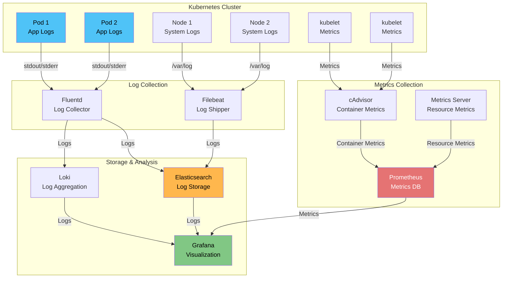

---

## Kubernetes Logging

### Container Logs

**Container logs** are the primary source of application logs in Kubernetes. Containers write logs to `stdout` and `stderr`, which Kubernetes captures and stores.

#### How Container Logging Works

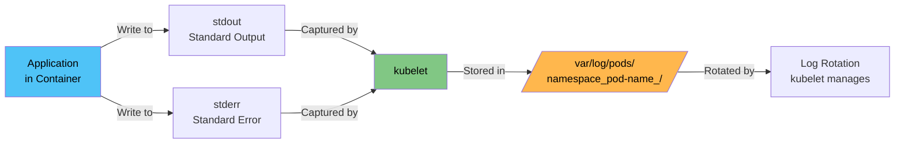

#### Viewing Container Logs

**Basic Commands:**

```bash
# View logs from a pod
kubectl logs <pod-name>

# View logs from a specific container in a pod
kubectl logs <pod-name> -c <container-name>

# View logs from all containers in a pod
kubectl logs <pod-name> --all-containers=true

# Follow logs (like tail -f)
kubectl logs -f <pod-name>

# View logs from previous container instance (if crashed)
kubectl logs <pod-name> --previous

# View logs with timestamps
kubectl logs <pod-name> --timestamps

# View last N lines
kubectl logs <pod-name> --tail=100

# View logs since specific time
kubectl logs <pod-name> --since=1h
```

#### Log Format

Kubernetes logs are stored in JSON format with metadata:

```json
{
  "log": "2024-01-15 10:30:45 [INFO] Request received\n",
  "stream": "stdout",
  "time": "2024-01-15T10:30:45.123456789Z"
}
```

**Fields:**
- **log:** The actual log message
- **stream:** `stdout` or `stderr`
- **time:** Timestamp in RFC3339 format

#### Log Storage Location

Logs are stored on each node at:
```
/var/log/pods/<namespace>_<pod-name>_<pod-uid>/<container-name>/<instance-number>.log
```

**Example:**
```
/var/log/pods/default_nginx-pod_abc123/nginx/0.log
```

#### Log Rotation

Kubernetes automatically rotates logs to prevent disk space issues:

- **Default:** Logs are rotated when they reach 10MB
- **Retention:** Last 5 log files are kept
- **Configuration:** Managed by kubelet via container runtime

**Configure log rotation (kubelet):**
```yaml
# /var/lib/kubelet/config.yaml
containerLogMaxSize: 10Mi
containerLogMaxFiles: 5
```

---

### Cluster Component Logs

Kubernetes cluster components also generate logs that need monitoring:

#### Control Plane Components

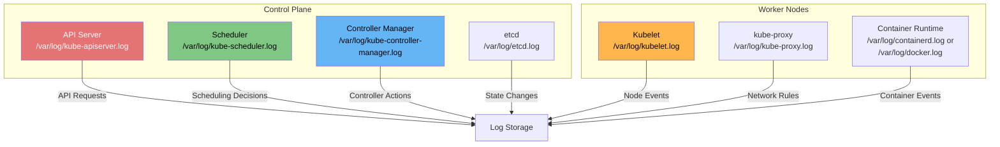

#### Viewing Component Logs

**For systemd-based installations:**

```bash
# API Server logs
journalctl -u kube-apiserver -f

# Scheduler logs
journalctl -u kube-scheduler -f

# Controller Manager logs
journalctl -u kube-controller-manager -f

# Kubelet logs
journalctl -u kubelet -f

# kube-proxy logs
journalctl -u kube-proxy -f
```

**For containerized components (kubeadm):**

```bash
# API Server logs
kubectl logs -n kube-system kube-apiserver-<node-name>

# Scheduler logs
kubectl logs -n kube-system kube-scheduler-<node-name>

# Controller Manager logs
kubectl logs -n kube-system kube-controller-manager-<node-name>

# etcd logs (if running as pod)
kubectl logs -n kube-system etcd-<node-name>
```

---

### Log Collection Strategies

There are several strategies for collecting logs in Kubernetes:

#### 1. Node-Level Logging Agent (DaemonSet)

**Most Common Approach:** Run a log collection agent as a DaemonSet on each node.

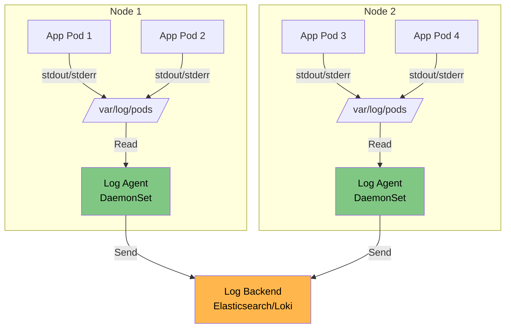

**Advantages:**
- ✅ One agent per node (efficient)
- ✅ Collects all pod logs automatically
- ✅ No application changes needed
- ✅ Handles log rotation

**Tools:**
- Fluentd
- Fluent Bit
- Filebeat
- Logstash

#### 2. Sidecar Container Logging

Run a logging sidecar container alongside your application container.

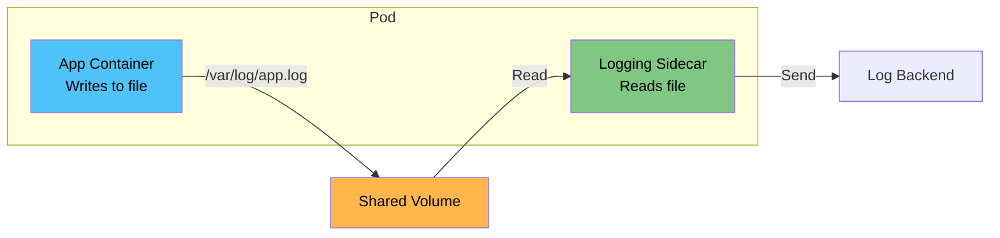

**Use Cases:**
- Applications that write to files instead of stdout
- Need for log transformation before sending
- Legacy applications that can't be modified

**Example Pod with Sidecar:**

```yaml
apiVersion: v1
kind: Pod
metadata:
  name: app-with-sidecar
spec:
  containers:
  - name: app
    image: my-app:latest
    volumeMounts:
    - name: logs
      mountPath: /var/log/app
  - name: log-sidecar
    image: fluent/fluent-bit:latest
    volumeMounts:
    - name: logs
      mountPath: /var/log/app
    - name: config
      mountPath: /fluent-bit/etc
  volumes:
  - name: logs
    emptyDir: {}
  - name: config
    configMap:
      name: fluent-bit-config
```

#### 3. Application-Level Logging

Applications send logs directly to a logging backend.

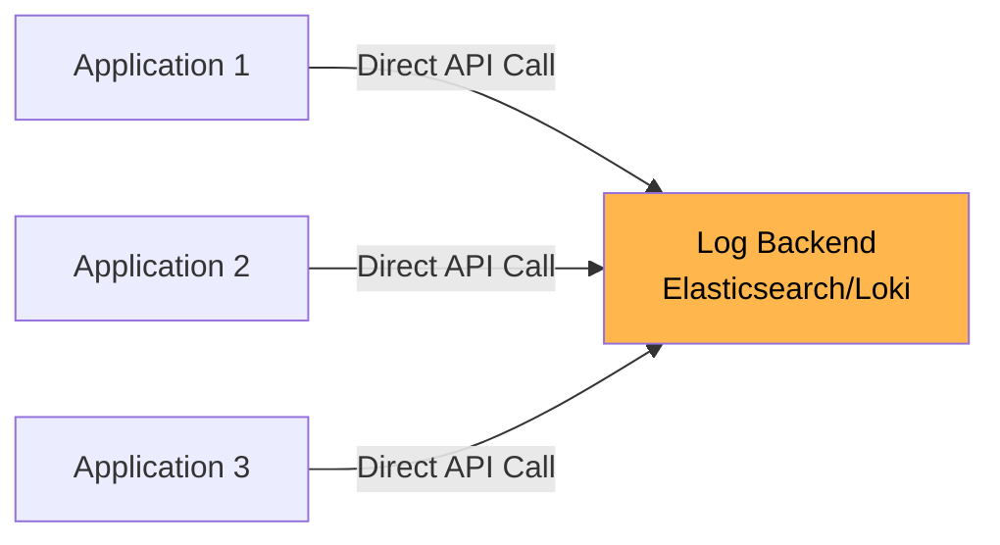

**Advantages:**
- ✅ Full control over log format
- ✅ No intermediate collection layer
- ✅ Can include rich metadata

**Disadvantages:**
- ❌ Requires application changes
- ❌ More complex error handling
- ❌ Network overhead per application

---

## Kubernetes Monitoring

### Metrics Types

Kubernetes monitoring involves different types of metrics:

#### 1. Container Metrics

Metrics about individual containers:
- **CPU Usage:** Current CPU consumption
- **Memory Usage:** Current memory consumption
- **Network I/O:** Bytes sent/received
- **Disk I/O:** Read/write operations

#### 2. Pod Metrics

Aggregated metrics for pods:
- **CPU Requests/Limits:** Resource requests and limits
- **Memory Requests/Limits:** Memory requests and limits
- **Restart Count:** Number of container restarts
- **Status:** Pod phase (Pending, Running, Succeeded, Failed)

#### 3. Node Metrics

Metrics about cluster nodes:
- **CPU Capacity/Usage:** Total and used CPU
- **Memory Capacity/Usage:** Total and used memory
- **Disk Capacity/Usage:** Total and used disk space
- **Network Bandwidth:** Network throughput
- **Pod Count:** Number of pods running

#### 4. Cluster Metrics

Aggregated cluster-wide metrics:
- **Total Pods:** Count of pods across cluster
- **Total Nodes:** Number of nodes
- **Resource Utilization:** Overall cluster resource usage
- **API Server Performance:** Request rate, latency

#### Metrics Hierarchy

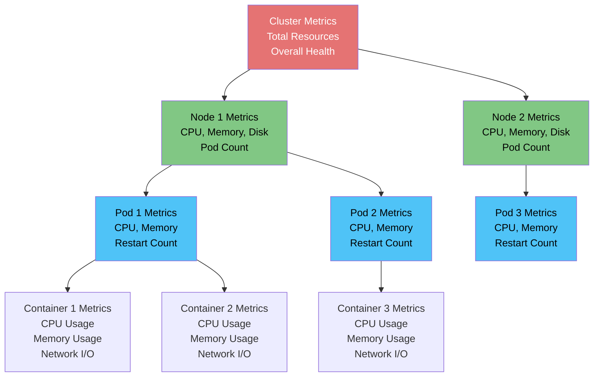

---

### Prometheus

**Prometheus** is the de facto standard for Kubernetes monitoring. It's a time-series database designed for metrics collection and alerting.

#### What is Prometheus?

**Simple Explanation:**
Prometheus is like a "health monitor" that continuously checks and records how your applications and infrastructure are performing.

**Analogy:**
Think of a fitness tracker:
- **Prometheus** = The tracker that measures your heart rate, steps, sleep
- **Metrics** = The data points (heart rate: 72 bpm, steps: 10,000)
- **Scraping** = The tracker checking your stats every few seconds
- **Alerts** = Notification when your heart rate is too high

#### Prometheus Architecture

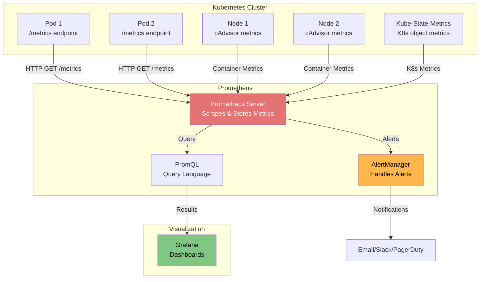

#### How Prometheus Works

1. **Scraping:** Prometheus periodically (default: 15s) pulls metrics from targets
2. **Storage:** Metrics are stored in a time-series database
3. **Querying:** Use PromQL to query and analyze metrics
4. **Alerting:** AlertManager evaluates alert rules and sends notifications

#### Prometheus Metrics Format

Applications expose metrics in Prometheus format:

```
# HELP http_requests_total Total number of HTTP requests
# TYPE http_requests_total counter
http_requests_total{method="GET",status="200"} 1234
http_requests_total{method="POST",status="200"} 567
http_requests_total{method="GET",status="404"} 12

# HELP http_request_duration_seconds HTTP request duration in seconds
# TYPE http_request_duration_seconds histogram
http_request_duration_seconds_bucket{le="0.1"} 1000
http_request_duration_seconds_bucket{le="0.5"} 1500
http_request_duration_seconds_bucket{le="1.0"} 1800
http_request_duration_seconds_bucket{le="+Inf"} 2000
```

**Metric Types:**
- **Counter:** Monotonically increasing value (e.g., total requests)
- **Gauge:** Value that can go up or down (e.g., current memory usage)
- **Histogram:** Distribution of measurements (e.g., request latency)
- **Summary:** Similar to histogram, but with quantiles

#### Prometheus Installation

**Using Helm (Recommended):**

```bash
# Add Prometheus Helm repo
helm repo add prometheus-community https://prometheus-community.github.io/helm-charts
helm repo update

# Install Prometheus Stack (includes Grafana)
helm install prometheus prometheus-community/kube-prometheus-stack \
  --namespace monitoring \
  --create-namespace
```

**Basic Prometheus Deployment:**

```yaml
apiVersion: apps/v1
kind: Deployment
metadata:
  name: prometheus
  namespace: monitoring
spec:
  replicas: 1
  selector:
    matchLabels:
      app: prometheus
  template:
    metadata:
      labels:
        app: prometheus
    spec:
      containers:
      - name: prometheus
        image: prom/prometheus:latest
        ports:
        - containerPort: 9090
        volumeMounts:
        - name: config
          mountPath: /etc/prometheus
        - name: storage
          mountPath: /prometheus
      volumes:
      - name: config
        configMap:
          name: prometheus-config
      - name: storage
        persistentVolumeClaim:
          claimName: prometheus-storage
---
apiVersion: v1
kind: Service
metadata:
  name: prometheus
  namespace: monitoring
spec:
  selector:
    app: prometheus
  ports:
  - port: 9090
    targetPort: 9090
  type: ClusterIP
```

#### Prometheus Configuration

**prometheus-config.yaml:**

```yaml
apiVersion: v1
kind: ConfigMap
metadata:
  name: prometheus-config
  namespace: monitoring
data:
  prometheus.yml: |
    global:
      scrape_interval: 15s
      evaluation_interval: 15s
    
    scrape_configs:
      # Scrape Prometheus itself
      - job_name: 'prometheus'
        static_configs:
          - targets: ['localhost:9090']
      
      # Scrape Kubernetes API server
      - job_name: 'kubernetes-apiserver'
        kubernetes_sd_configs:
          - role: endpoints
        scheme: https
        tls_config:
          ca_file: /var/run/secrets/kubernetes.io/serviceaccount/ca.crt
        bearer_token_file: /var/run/secrets/kubernetes.io/serviceaccount/token
        relabel_configs:
          - source_labels: [__meta_kubernetes_namespace, __meta_kubernetes_service_name, __meta_kubernetes_endpoint_port_name]
            action: keep
            regex: default;kubernetes;https
      
      # Scrape all pods with annotation prometheus.io/scrape: "true"
      - job_name: 'kubernetes-pods'
        kubernetes_sd_configs:
          - role: pod
        relabel_configs:
          - source_labels: [__meta_kubernetes_pod_annotation_prometheus_io_scrape]
            action: keep
            regex: true
          - source_labels: [__meta_kubernetes_pod_annotation_prometheus_io_path]
            action: replace
            target_label: __metrics_path__
            regex: (.+)
          - source_labels: [__address__, __meta_kubernetes_pod_annotation_prometheus_io_port]
            action: replace
            regex: ([^:]+)(?::\d+)?;(\d+)
            replacement: $1:$2
            target_label: __address__
```

#### PromQL (Prometheus Query Language)

**Basic Queries:**

```promql
# CPU usage percentage
100 * (1 - avg(rate(container_cpu_usage_seconds_total[5m])))

# Memory usage in bytes
container_memory_usage_bytes

# HTTP request rate
rate(http_requests_total[5m])

# Pod restart count
kube_pod_container_status_restarts_total

# Available memory on node
node_memory_MemAvailable_bytes

# CPU utilization
100 - (avg(rate(node_cpu_seconds_total{mode="idle"}[5m])) * 100)
```

**Advanced Queries:**

```promql
# Top 5 pods by CPU usage
topk(5, sum(rate(container_cpu_usage_seconds_total[5m])) by (pod))

# Memory usage percentage per pod
sum(container_memory_usage_bytes) by (pod) / sum(container_spec_memory_limit_bytes) by (pod) * 100

# Request rate by endpoint
sum(rate(http_requests_total[5m])) by (endpoint)

# Error rate percentage
sum(rate(http_requests_total{status=~"5.."}[5m])) / sum(rate(http_requests_total[5m])) * 100
```

---

### Grafana

**Grafana** is a visualization and analytics platform that works seamlessly with Prometheus.

#### What is Grafana?

**Simple Explanation:**
Grafana is like a "dashboard" that turns raw metrics into beautiful, understandable charts and graphs.

**Analogy:**
Think of a car dashboard:
- **Prometheus** = The engine sensors collecting data
- **Grafana** = The speedometer, fuel gauge, temperature gauge on your dashboard
- **Dashboards** = The entire dashboard showing all gauges at once
- **Alerts** = Warning lights when something is wrong

#### Grafana Features

1. **Dashboards:** Create custom dashboards with multiple panels
2. **Data Sources:** Connect to Prometheus, Elasticsearch, Loki, and more
3. **Alerting:** Set up alerts based on metrics
4. **Annotations:** Mark events on graphs
5. **Variables:** Dynamic dashboards with variables
6. **Plugins:** Extend functionality with plugins

#### Grafana Installation

**Using Helm:**

```bash
helm install grafana grafana/grafana \
  --namespace monitoring \
  --set persistence.enabled=true \
  --set persistence.size=10Gi
```

**Basic Grafana Deployment:**

```yaml
apiVersion: apps/v1
kind: Deployment
metadata:
  name: grafana
  namespace: monitoring
spec:
  replicas: 1
  selector:
    matchLabels:
      app: grafana
  template:
    metadata:
      labels:
        app: grafana
    spec:
      containers:
      - name: grafana
        image: grafana/grafana:latest
        ports:
        - containerPort: 3000
        env:
        - name: GF_SECURITY_ADMIN_PASSWORD
          value: "admin"
        volumeMounts:
        - name: storage
          mountPath: /var/lib/grafana
      volumes:
      - name: storage
        persistentVolumeClaim:
          claimName: grafana-storage
---
apiVersion: v1
kind: Service
metadata:
  name: grafana
  namespace: monitoring
spec:
  selector:
    app: grafana
  ports:
  - port: 3000
    targetPort: 3000
  type: LoadBalancer
```

#### Connecting Grafana to Prometheus

1. **Access Grafana:** `http://<grafana-service-ip>:3000`
2. **Login:** Default username `admin`, password from secret or env var
3. **Add Data Source:**
   - Go to Configuration → Data Sources
   - Click "Add data source"
   - Select "Prometheus"
   - Enter Prometheus URL: `http://prometheus:9090`
   - Click "Save & Test"

#### Creating Dashboards

**Example Dashboard JSON:**

```json
{
  "dashboard": {
    "title": "Kubernetes Cluster Monitoring",
    "panels": [
      {
        "title": "CPU Usage",
        "targets": [
          {
            "expr": "100 * (1 - avg(rate(container_cpu_usage_seconds_total[5m])))"
          }
        ],
        "type": "graph"
      },
      {
        "title": "Memory Usage",
        "targets": [
          {
            "expr": "container_memory_usage_bytes"
          }
        ],
        "type": "graph"
      }
    ]
  }
}
```

**Popular Grafana Dashboards:**
- **Kubernetes Cluster Monitoring:** Dashboard ID 7249
- **Kubernetes Pod Monitoring:** Dashboard ID 6417
- **Node Exporter Full:** Dashboard ID 1860

**Import Dashboard:**
1. Go to Dashboards → Import
2. Enter Dashboard ID or upload JSON
3. Select Prometheus data source
4. Click "Import"

---

### cAdvisor

**cAdvisor (Container Advisor)** collects, aggregates, and exports container resource usage and performance statistics.

#### What is cAdvisor?

**Simple Explanation:**
cAdvisor is like a "fitness tracker" for containers - it monitors CPU, memory, network, and disk usage for each container.

#### cAdvisor Architecture

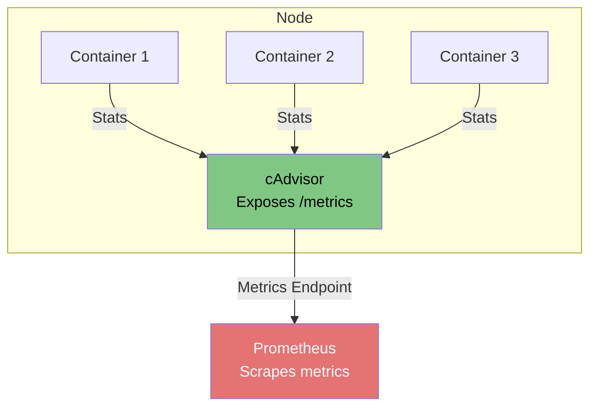

#### cAdvisor Metrics

cAdvisor exposes metrics at `http://<node-ip>:4194/metrics`:

```
# CPU metrics
container_cpu_usage_seconds_total
container_cpu_load_average_10s
container_cpu_system_seconds_total
container_cpu_user_seconds_total

# Memory metrics
container_memory_usage_bytes
container_memory_working_set_bytes
container_memory_cache
container_memory_rss

# Network metrics
container_network_receive_bytes_total
container_network_transmit_bytes_total
container_network_receive_packets_total
container_network_transmit_packets_total

# Filesystem metrics
container_fs_reads_bytes_total
container_fs_writes_bytes_total
container_fs_io_time_seconds_total
```

#### Accessing cAdvisor

cAdvisor is typically integrated into kubelet and accessible via:

```bash
# Access cAdvisor metrics
curl http://<node-ip>:10250/metrics/cadvisor

# Or via kubectl proxy
kubectl proxy --port=8001
curl http://localhost:8001/api/v1/nodes/<node-name>/proxy/metrics/cadvisor
```

---

### Metrics Server

**Metrics Server** is a cluster-wide aggregator of resource usage data. It collects metrics from kubelet and makes them available via the Kubernetes Metrics API.

#### What is Metrics Server?

**Simple Explanation:**
Metrics Server is like a "quick stats counter" that provides current resource usage for pods and nodes, used by `kubectl top` and HPA.

#### Metrics Server Architecture

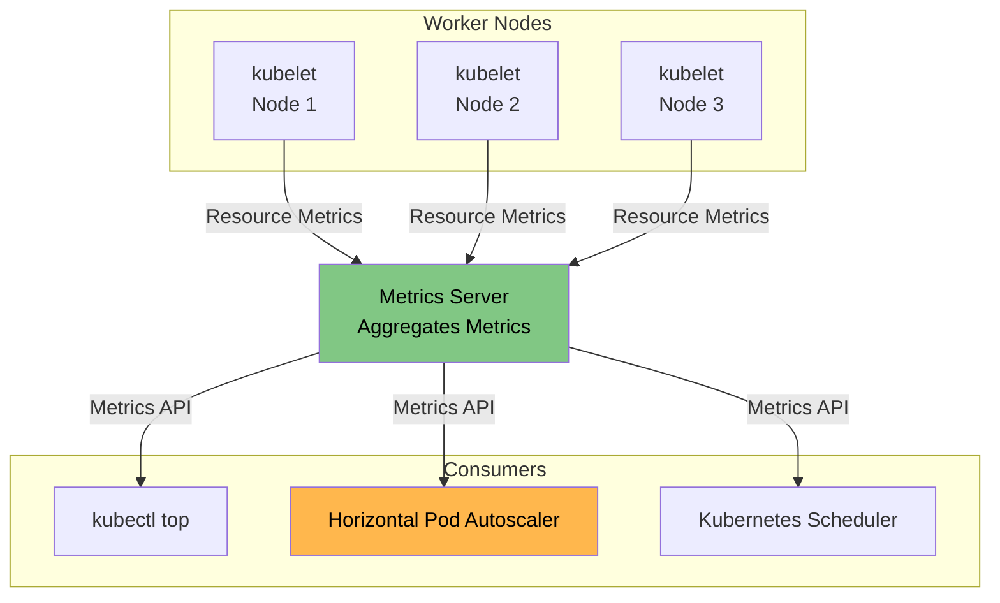

#### Installing Metrics Server

**Using kubectl:**

```bash
kubectl apply -f https://github.com/kubernetes-sigs/metrics-server/releases/latest/download/components.yaml
```

**Manual Installation:**

```yaml
apiVersion: apps/v1
kind: Deployment
metadata:
  name: metrics-server
  namespace: kube-system
spec:
  selector:
    matchLabels:
      k8s-app: metrics-server
  template:
    metadata:
      labels:
        k8s-app: metrics-server
    spec:
      serviceAccountName: metrics-server
      containers:
      - name: metrics-server
        image: k8s.gcr.io/metrics-server/metrics-server:v0.6.1
        args:
          - --cert-dir=/tmp
          - --secure-port=4443
          - --kubelet-preferred-address-types=InternalIP,ExternalIP,Hostname
          - --kubelet-use-node-status-port
          - --metric-resolution=15s
        ports:
        - name: https
          containerPort: 4443
          protocol: TCP
---
apiVersion: v1
kind: Service
metadata:
  name: metrics-server
  namespace: kube-system
spec:
  selector:
    k8s-app: metrics-server
  ports:
  - port: 443
    protocol: TCP
    targetPort: https
```

#### Using Metrics Server

**View Node Metrics:**

```bash
kubectl top nodes
```

**Output:**
```
NAME           CPU(cores)   CPU%   MEMORY(bytes)   MEMORY%
node1          500m         25%    2Gi             50%
node2          300m         15%    1.5Gi           37%
```

**View Pod Metrics:**

```bash
kubectl top pods
kubectl top pods -n <namespace>
kubectl top pods --containers
```

**Output:**
```
NAME                          CPU(cores)   MEMORY(bytes)
nginx-deployment-xxx          10m          50Mi
mysql-pod-xxx                 100m         200Mi
```

**API Access:**

```bash
# Get node metrics
kubectl get --raw /apis/metrics.k8s.io/v1beta1/nodes

# Get pod metrics
kubectl get --raw /apis/metrics.k8s.io/v1beta1/namespaces/default/pods
```

---

## Observability Stack

### ELK Stack (Elasticsearch, Logstash, Kibana)

The **ELK Stack** is a popular solution for log aggregation and analysis.

#### Components

1. **Elasticsearch:** Search and analytics engine (stores logs)
2. **Logstash:** Log processing pipeline (collects, transforms, sends)
3. **Kibana:** Visualization and exploration (dashboards and queries)

#### ELK Stack Architecture

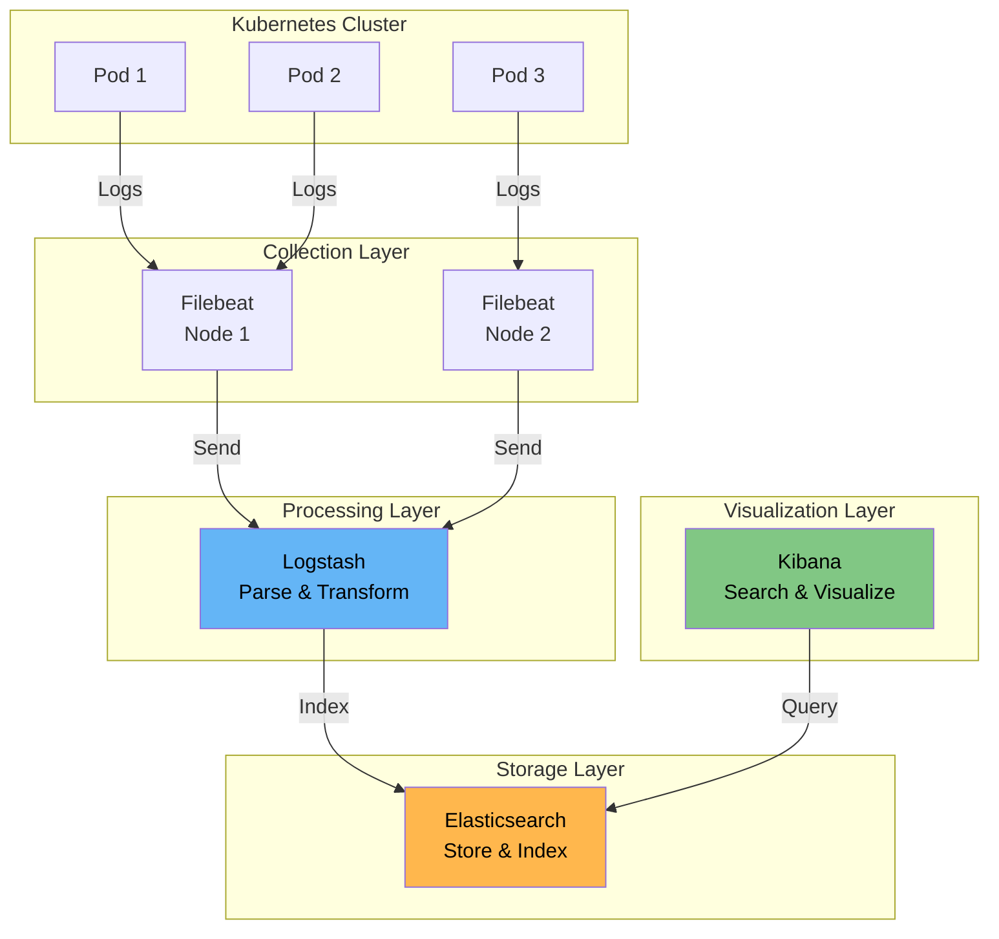

#### Installation

**Using Helm:**

```bash
# Add Elastic Helm repo
helm repo add elastic https://helm.elastic.co
helm repo update

# Install Elasticsearch
helm install elasticsearch elastic/elasticsearch \
  --namespace logging \
  --create-namespace \
  --set replicas=3

# Install Logstash
helm install logstash elastic/logstash \
  --namespace logging

# Install Kibana
helm install kibana elastic/kibana \
  --namespace logging
```

---

### EFK Stack (Elasticsearch, Fluentd, Kibana)

The **EFK Stack** uses Fluentd instead of Logstash for log collection.

#### Why Fluentd over Logstash?

- **Lighter weight:** Lower resource consumption
- **Better Kubernetes integration:** Native Kubernetes support
- **Plugin ecosystem:** Rich plugin library
- **Performance:** Optimized for high-throughput scenarios

#### EFK Stack Architecture

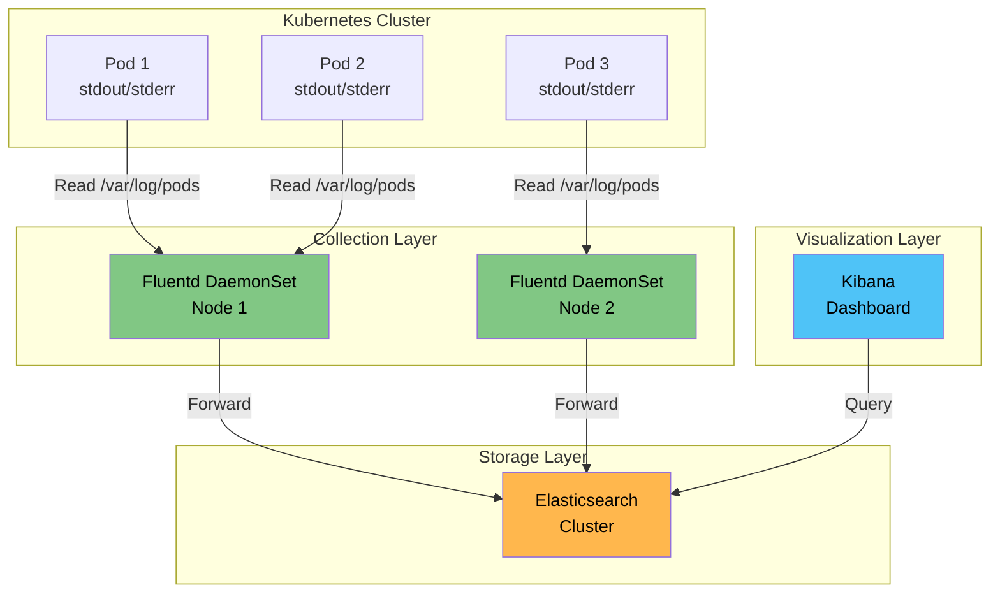

#### Fluentd DaemonSet Example

```yaml
apiVersion: apps/v1
kind: DaemonSet
metadata:
  name: fluentd
  namespace: logging
spec:
  selector:
    matchLabels:
      app: fluentd
  template:
    metadata:
      labels:
        app: fluentd
    spec:
      containers:
      - name: fluentd
        image: fluent/fluentd-kubernetes-daemonset:v1-debian-elasticsearch
        env:
        - name: FLUENT_ELASTICSEARCH_HOST
          value: "elasticsearch.logging.svc.cluster.local"
        - name: FLUENT_ELASTICSEARCH_PORT
          value: "9200"
        volumeMounts:
        - name: varlog
          mountPath: /var/log
        - name: varlibdockercontainers
          mountPath: /var/lib/docker/containers
          readOnly: true
      volumes:
      - name: varlog
        hostPath:
          path: /var/log
      - name: varlibdockercontainers
        hostPath:
          path: /var/lib/docker/containers
```

---

### Loki Stack

**Loki** is a horizontally-scalable, highly-available log aggregation system inspired by Prometheus.

#### Why Loki?

- **Lightweight:** Lower resource usage than Elasticsearch
- **Prometheus Integration:** Uses same labels and service discovery
- **Cost-Effective:** Stores compressed logs efficiently
- **Grafana Native:** Built-in Grafana integration

#### Loki Stack Architecture

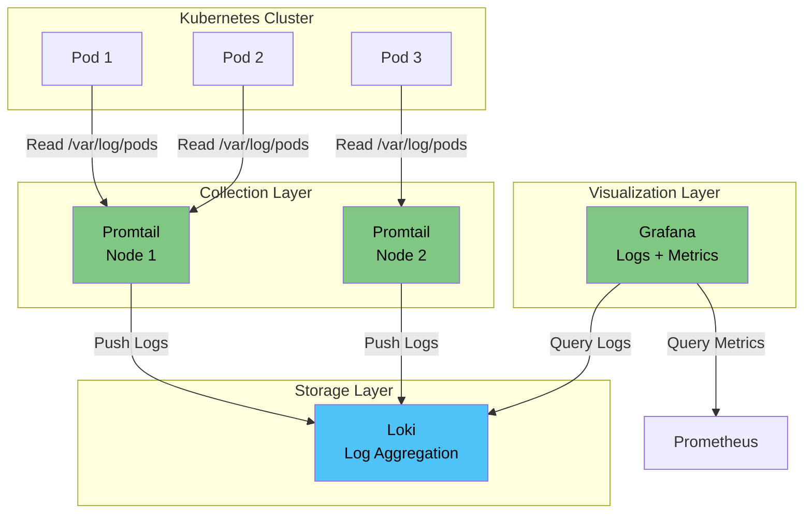

#### Installing Loki Stack

**Using Helm:**

```bash
# Add Grafana Helm repo
helm repo add grafana https://grafana.github.io/helm-charts
helm repo update

# Install Loki
helm install loki grafana/loki-stack \
  --namespace monitoring \
  --create-namespace \
  --set prometheus.enabled=true \
  --set grafana.enabled=true
```

#### Promtail Configuration

Promtail is the log shipper for Loki (similar to Filebeat for Elasticsearch).

**promtail-config.yaml:**

```yaml
apiVersion: v1
kind: ConfigMap
metadata:
  name: promtail-config
  namespace: monitoring
data:
  promtail.yml: |
    server:
      http_listen_port: 3101
      grpc_listen_port: 9096
    
    positions:
      filename: /tmp/positions.yaml
    
    clients:
      - url: http://loki:3100/loki/api/v1/push
    
    scrape_configs:
      - job_name: kubernetes-pods
        kubernetes_sd_configs:
          - role: pod
        relabel_configs:
          - source_labels: [__meta_kubernetes_pod_node_name]
            target_label: __host__
          - action: labelmap
            regex: __meta_kubernetes_pod_label_(.+)
          - action: replace
            replacement: $1
            separator: /
            source_labels:
              - __meta_kubernetes_namespace
              - __meta_kubernetes_pod_name
            target_label: job
          - action: replace
            source_labels:
              - __meta_kubernetes_namespace
            target_label: namespace
          - action: replace
            source_labels:
              - __meta_kubernetes_pod_name
            target_label: pod
          - action: replace
            source_labels:
              - __meta_kubernetes_pod_container_name
            target_label: container
          - replacement: /var/log/pods/*$1/*.log
            separator: /
            source_labels:
              - __meta_kubernetes_pod_uid
              - __meta_kubernetes_pod_container_name
            target_label: __path__
```

#### Querying Logs in Grafana

**LogQL (Loki Query Language):**

```logql
# All logs from a specific pod
{namespace="default", pod="nginx-pod"}

# Logs containing "error"
{namespace="default"} |= "error"

# Logs with rate > 10 per second
rate({namespace="default"}[1m]) > 10

# Logs by container
{container="nginx"}

# Combine with Prometheus metrics
{namespace="default"} | json | line_format "{{.message}}"
```

---

## Popular Monitoring Tools

While Prometheus and Grafana are the most popular open-source monitoring solutions, there are several commercial and alternative tools available for Kubernetes monitoring:

### Kubernetes Dashboard

**Kubernetes Dashboard** is the official web-based UI for Kubernetes clusters. It provides a simple way to manage and monitor your cluster resources.

**Features:**
- View cluster resources (pods, services, deployments, etc.)
- View logs and events
- Execute commands in containers
- Resource usage visualization
- RBAC integration

**Use Cases:**
- Quick cluster overview
- Development and testing environments
- Learning Kubernetes concepts
- Basic resource management

**Installation:**
```bash
kubectl apply -f https://raw.githubusercontent.com/kubernetes/dashboard/v2.7.0/aio/deploy/recommended.yaml
```

**Access:**
```bash
kubectl proxy
# Then access: http://localhost:8001/api/v1/namespaces/kubernetes-dashboard/services/https:kubernetes-dashboard:/proxy/
```

**Tutorial:** [Kubernetes Dashboard Tutorial](../../tutorials/10-kubernetes-dashboard/README.md)

---

### Datadog

**Datadog** is a comprehensive monitoring and observability platform that provides full-stack monitoring for Kubernetes.

**Key Features:**
- **Infrastructure Monitoring:** CPU, memory, network, disk metrics
- **APM (Application Performance Monitoring):** Distributed tracing, application metrics
- **Log Management:** Centralized log aggregation and analysis
- **Real User Monitoring (RUM):** Frontend performance monitoring
- **Synthetic Monitoring:** API and website uptime monitoring
- **Alerting:** Intelligent alerting with machine learning
- **Dashboards:** Pre-built and custom dashboards

**Kubernetes Integration:**
- Automatic service discovery
- Pod and container metrics
- Kubernetes events and logs
- Cluster-level visibility
- Auto-scaling recommendations

**Use Cases:**
- Enterprise monitoring needs
- Multi-cloud environments
- Full-stack observability
- Compliance and security monitoring

**Installation:**
- Deploy Datadog Agent as DaemonSet
- Configure API keys and tags
- Enable integrations for specific services

**Website:** [https://www.datadoghq.com](https://www.datadoghq.com)

---

### New Relic

**New Relic** is an observability platform that provides application performance monitoring, infrastructure monitoring, and log management.

**Key Features:**
- **APM:** Application performance monitoring with code-level visibility
- **Infrastructure Monitoring:** Server, container, and cloud monitoring
- **Browser Monitoring:** Frontend performance and user experience
- **Synthetic Monitoring:** Proactive monitoring of critical user journeys
- **Logs:** Centralized log management with context
- **Alerts:** Intelligent alerting with anomaly detection
- **Dashboards:** Customizable dashboards and visualizations

**Kubernetes Integration:**
- Kubernetes cluster explorer
- Pod and container metrics
- Service mesh observability (Istio, Linkerd)
- Automatic instrumentation
- Kubernetes events correlation

**Use Cases:**
- Application performance optimization
- Full-stack observability
- Business metrics tracking
- DevOps collaboration

**Installation:**
- Deploy New Relic agents (Infrastructure, APM, Logs)
- Configure Kubernetes integration
- Set up service mapping

**Website:** [https://newrelic.com](https://newrelic.com)

---

### Dynatrace

**Dynatrace** is an AI-powered observability platform that provides automatic and intelligent monitoring for Kubernetes environments.

**Key Features:**
- **AI-Powered Monitoring:** Automatic problem detection and root cause analysis
- **Full-Stack Observability:** Infrastructure, applications, and user experience
- **Application Security:** Runtime application security monitoring
- **Cloud Automation:** Automated cloud-native monitoring
- **Service Mesh Observability:** Istio, Linkerd, and Consul support
- **Kubernetes Operator:** Native Kubernetes integration
- **OneAgent:** Automatic instrumentation without code changes

**Kubernetes Integration:**
- Automatic Kubernetes discovery
- Pod, container, and node monitoring
- Service mesh observability
- Kubernetes events and metrics
- Automatic dependency mapping
- AI-powered anomaly detection

**Use Cases:**
- Enterprise-grade monitoring
- AI-driven operations
- Complex microservices architectures
- Cloud-native application monitoring

**Installation:**
- Deploy Dynatrace Operator
- Install OneAgent via DaemonSet or sidecar
- Configure Kubernetes integration

**Website:** [https://www.dynatrace.com](https://www.dynatrace.com)

---

### Other Popular Tools

#### Splunk

**Splunk** is a platform for searching, monitoring, and analyzing machine-generated data.

**Features:**
- Log aggregation and analysis
- Infrastructure monitoring
- Security information and event management (SIEM)
- Application performance monitoring
- Machine learning capabilities

**Kubernetes Integration:**
- Splunk Connect for Kubernetes
- Automatic log collection
- Metrics collection
- Event correlation

**Website:** [https://www.splunk.com](https://www.splunk.com)

---

#### Elastic Observability

**Elastic Observability** combines Elasticsearch, Kibana, and Elastic APM for full-stack observability.

**Features:**
- Log aggregation (Elasticsearch + Kibana)
- Application performance monitoring (APM)
- Infrastructure monitoring
- User experience monitoring
- Security analytics

**Kubernetes Integration:**
- Elastic Cloud on Kubernetes (ECK)
- Beats for log and metric collection
- Elastic APM agents
- Kubernetes metadata enrichment

**Website:** [https://www.elastic.co/observability](https://www.elastic.co/observability)

---

#### Jaeger

**Jaeger** is an open-source distributed tracing system for microservices.

**Features:**
- Distributed tracing
- Service dependency mapping
- Performance bottleneck identification
- OpenTelemetry support

**Kubernetes Integration:**
- Jaeger Operator for Kubernetes
- Automatic service discovery
- Integration with service meshes

**Website:** [https://www.jaegertracing.io](https://www.jaegertracing.io)

---

#### OpenTelemetry

**OpenTelemetry** is a vendor-neutral observability framework for generating, collecting, and exporting telemetry data.

**Features:**
- Unified API for traces, metrics, and logs
- Vendor-neutral instrumentation
- Automatic and manual instrumentation
- Multiple language support

**Kubernetes Integration:**
- OpenTelemetry Operator
- Automatic instrumentation
- Integration with Prometheus, Jaeger, and other backends

**Website:** [https://opentelemetry.io](https://opentelemetry.io)

---

#### Weave Scope

**Weave Scope** is a visualization and monitoring tool for Docker and Kubernetes.

**Features:**
- Real-time application topology
- Container and process visualization
- Resource usage monitoring
- Interactive exploration

**Website:** [https://www.weave.works/oss/scope/](https://www.weave.works/oss/scope/)

---

### Tool Selection Guide

**Choose based on your needs:**

| Tool | Best For | Cost | Complexity |
|------|----------|------|------------|
| **Kubernetes Dashboard** | Quick overview, learning | Free | Low |
| **Prometheus + Grafana** | Open-source, customizable | Free | Medium |
| **Datadog** | Enterprise, full-stack | Paid | Low |
| **New Relic** | APM focus, developer-friendly | Paid | Low |
| **Dynatrace** | AI-powered, enterprise | Paid | Low |
| **Splunk** | Log analysis, SIEM | Paid | High |
| **Elastic Stack** | Log aggregation, open-source | Free/Paid | Medium |
| **Jaeger** | Distributed tracing | Free | Medium |

**Considerations:**
- **Budget:** Open-source vs. commercial solutions
- **Complexity:** Setup and maintenance effort
- **Features:** Required capabilities (APM, logs, traces)
- **Scale:** Cluster size and number of applications
- **Team Expertise:** Learning curve and support needs

---

## Best Practices

### Logging Best Practices

1. **Use Structured Logging:**
   - Use JSON format for logs
   - Include consistent fields (timestamp, level, message, context)
   - Example: `{"timestamp":"2024-01-15T10:30:45Z","level":"INFO","message":"Request processed","request_id":"abc123"}`

2. **Log Levels:**
   - **DEBUG:** Detailed information for debugging
   - **INFO:** General informational messages
   - **WARN:** Warning messages (potential issues)
   - **ERROR:** Error messages (handled errors)
   - **FATAL:** Critical errors (application may stop)

3. **Avoid Logging Sensitive Data:**
   - Don't log passwords, tokens, API keys
   - Don't log PII (Personally Identifiable Information)
   - Use log sanitization

4. **Centralized Logging:**
   - Always use a centralized logging solution
   - Don't rely on `kubectl logs` for production
   - Implement log retention policies

5. **Log Rotation:**
   - Configure appropriate log rotation
   - Set retention periods
   - Monitor disk usage

### Monitoring Best Practices

1. **Key Metrics to Monitor:**
   - **Application Metrics:** Request rate, error rate, latency
   - **Infrastructure Metrics:** CPU, memory, disk, network
   - **Business Metrics:** User actions, transactions, revenue

2. **Alerting Rules:**
   - Set up alerts for critical issues
   - Use appropriate thresholds
   - Avoid alert fatigue (too many alerts)
   - Test alerting regularly

3. **Dashboard Design:**
   - Create dashboards for different audiences (ops, dev, business)
   - Use consistent color schemes
   - Include time ranges
   - Add annotations for deployments/incidents

4. **Resource Monitoring:**
   - Monitor resource requests vs limits
   - Track resource utilization trends
   - Plan capacity based on metrics

5. **Performance Monitoring:**
   - Monitor application performance (APM)
   - Track SLA/SLO metrics
   - Identify bottlenecks early

### Security Considerations

1. **Log Access Control:**
   - Restrict access to sensitive logs
   - Use RBAC for log access
   - Encrypt logs in transit and at rest

2. **Audit Logging:**
   - Enable Kubernetes audit logging
   - Monitor API server access
   - Track configuration changes

3. **Compliance:**
   - Meet regulatory requirements (GDPR, HIPAA, etc.)
   - Implement log retention policies
   - Ensure log integrity

---

## Tutorial References

- **[Logging and Monitoring Tutorial](../../tutorials/09-logging-monitoring/README.md)** - Hands-on tutorial covering log collection with Fluentd and monitoring with Prometheus and Grafana
- **[Kubernetes Dashboard Tutorial](../../tutorials/10-kubernetes-dashboard/README.md)** - Step-by-step guide to install and use Kubernetes Dashboard

---

**Next Steps:**
- Set up a logging stack (EFK or Loki)
- Deploy Prometheus and Grafana
- Create custom dashboards
- Configure alerting rules
- Monitor your applications

