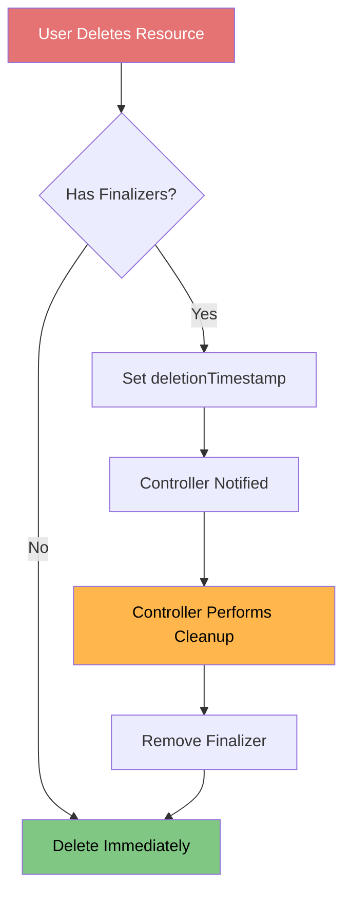
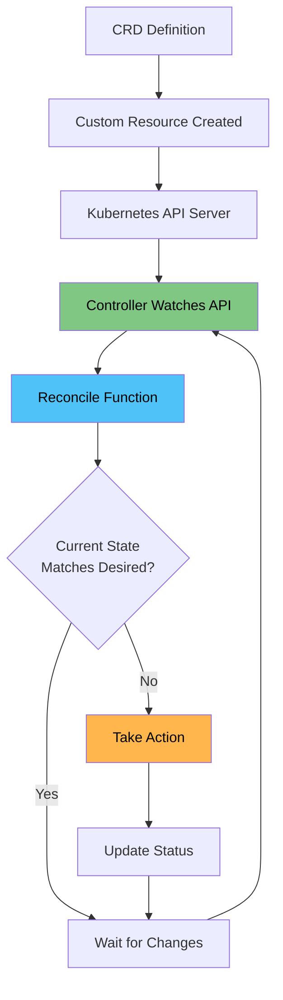
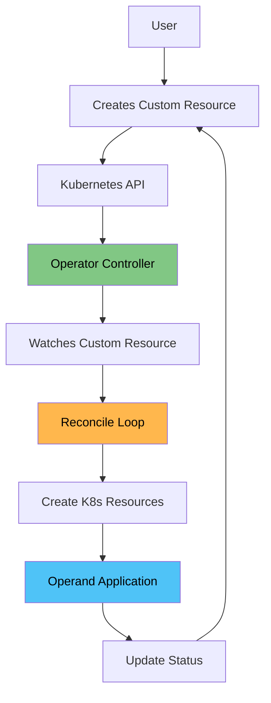

# Custom Resource Definitions (CRDs)

<details>
<summary><b>📋 Table of Contents</b></summary>

- [Introduction to CRDs](#introduction-to-crds)
- [What are CRDs?](#what-are-crds)
- [Why Use CRDs?](#why-use-crds)
- [CRD Structure](#crd-structure)
- [Creating CRDs](#creating-crds)
- [Custom Resources](#custom-resources)
- [CRD Validation](#crd-validation)
- [CRD Versions](#crd-versions)
- [CRD Subresources](#crd-subresources)
- [CRD Finalizers](#crd-finalizers)
- [CRD Status Subresource](#crd-status-subresource)
- [CRD Controllers](#crd-controllers)
- [Operator Pattern](#operator-pattern)
- [Popular CRD Examples](#popular-crd-examples)
- [Best Practices](#best-practices)
- [Tutorial Reference](#tutorial-reference)

</details>

---

## Introduction to CRDs

**Custom Resource Definitions (CRDs)** are one of the most powerful features in Kubernetes, allowing you to extend the Kubernetes API with your own custom resources and controllers.

### What are CRDs?

**Simple Explanation:**
CRDs let you create your own "types" of Kubernetes resources, just like Pods, Deployments, or Services, but customized for your specific needs.

**Analogy:**
Think of Kubernetes as a restaurant:
- **Built-in resources** (Pods, Deployments) = Standard menu items (burger, pizza)
- **CRDs** = Custom menu items you create (special burger with your own recipe)
- **Custom Resources** = Instances of your custom menu items (actual special burger orders)
- **Controllers** = Kitchen staff that prepare your custom items

### CRD vs Custom Resource

**Important Distinction:**
- **CRD (Custom Resource Definition)** = The "template" or "schema" that defines what your custom resource looks like
- **Custom Resource (CR)** = An actual instance of that custom resource type

**Example:**
- **CRD:** Defines what a "Database" resource should look like (fields, types, validation)
- **Custom Resource:** An actual database instance like "mysql-database" or "postgres-database"

---

## Why Use CRDs?

### Use Cases

1. **Domain-Specific Resources:**
   - Create resources that match your application domain
   - Example: `Database`, `Backup`, `Certificate` resources

2. **Abstraction:**
   - Hide complexity behind simple resource definitions
   - Example: `WordPressSite` resource that creates multiple pods, services, and PVCs

3. **Automation:**
   - Automate complex operations through controllers
   - Example: Auto-scaling based on custom metrics

4. **Integration:**
   - Integrate external systems with Kubernetes
   - Example: `GitRepository` resource that syncs with Git

5. **Policy Enforcement:**
   - Enforce organizational policies
   - Example: `SecurityPolicy` resource that validates deployments

### Benefits

- **Native Kubernetes Experience:** Use `kubectl` with your custom resources
- **API Consistency:** Follow Kubernetes API conventions
- **RBAC Support:** Apply Kubernetes RBAC to custom resources
- **Watch Support:** Use Kubernetes watch API for real-time updates
- **Validation:** Built-in schema validation
- **Versioning:** Support multiple API versions

---

## CRD Structure

### Basic CRD YAML Structure

```yaml
apiVersion: apiextensions.k8s.io/v1
kind: CustomResourceDefinition
metadata:
  name: <plural>.<group>
spec:
  group: <group>
  versions:
    - name: <version>
      served: true
      storage: true
      schema:
        openAPIV3Schema:
          type: object
          properties:
            spec:
              type: object
              properties:
                # Define your spec fields here
            status:
              type: object
              properties:
                # Define your status fields here
  scope: Namespaced | Cluster
  names:
    plural: <plural>
    singular: <singular>
    kind: <Kind>
    shortNames:
      - <short-name>
```

### CRD Components

#### 1. Metadata

```yaml
metadata:
  name: databases.example.com
  labels:
    app: database-operator
  annotations:
    description: "Custom resource for managing databases"
```

#### 2. Group

The API group for your CRD:

```yaml
spec:
  group: example.com
```

**Examples:**
- `apps` (for Deployments, ReplicaSets)
- `networking.k8s.io` (for Ingress)
- `example.com` (for your custom resources)

#### 3. Versions

Define API versions for your CRD:

```yaml
spec:
  versions:
    - name: v1alpha1
      served: true
      storage: false
    - name: v1
      served: true
      storage: true
```

**Version Fields:**
- **name:** Version identifier (e.g., `v1`, `v1alpha1`, `v1beta1`)
- **served:** Whether this version is served by the API server
- **storage:** Whether this version is used for storage (only one version can be storage)

#### 4. Scope

Define if the resource is namespaced or cluster-scoped:

```yaml
spec:
  scope: Namespaced  # or Cluster
```

- **Namespaced:** Resource exists within a namespace (like Pods, Deployments)
- **Cluster:** Resource exists at cluster level (like Nodes, PersistentVolumes)

#### 5. Names

Define the resource names:

```yaml
spec:
  names:
    plural: databases
    singular: database
    kind: Database
    shortNames:
      - db
      - dbs
```

**After creation, you can use:**
```bash
kubectl get databases
kubectl get database
kubectl get db
```

---

## Creating CRDs

### Step-by-Step CRD Creation

#### Step 1: Define the CRD

Create a CRD YAML file:

```yaml
apiVersion: apiextensions.k8s.io/v1
kind: CustomResourceDefinition
metadata:
  name: databases.example.com
spec:
  group: example.com
  versions:
    - name: v1
      served: true
      storage: true
      schema:
        openAPIV3Schema:
          type: object
          properties:
            spec:
              type: object
              properties:
                databaseName:
                  type: string
                databaseType:
                  type: string
                  enum: ["mysql", "postgresql", "mongodb"]
                replicas:
                  type: integer
                  minimum: 1
                  maximum: 10
            status:
              type: object
              properties:
                phase:
                  type: string
                message:
                  type: string
  scope: Namespaced
  names:
    plural: databases
    singular: database
    kind: Database
    shortNames:
      - db
```

#### Step 2: Apply the CRD

```bash
kubectl apply -f database-crd.yaml
```

#### Step 3: Verify CRD Creation

```bash
kubectl get crd databases.example.com
kubectl describe crd databases.example.com
```

#### Step 4: Create Custom Resource

```yaml
apiVersion: example.com/v1
kind: Database
metadata:
  name: mysql-database
  namespace: default
spec:
  databaseName: myapp
  databaseType: mysql
  replicas: 3
```

#### Step 5: Verify Custom Resource

```bash
kubectl get databases
kubectl get db
kubectl describe database mysql-database
```

---

## Custom Resources

### Custom Resource Structure

A Custom Resource follows the standard Kubernetes object structure:

```yaml
apiVersion: <group>/<version>
kind: <Kind>
metadata:
  name: <name>
  namespace: <namespace>  # if namespaced
  labels:
    app: <app-name>
  annotations:
    description: <description>
spec:
  # Your custom spec fields
status:
  # Your custom status fields (usually managed by controller)
```

### Example: Database Custom Resource

```yaml
apiVersion: example.com/v1
kind: Database
metadata:
  name: production-db
  namespace: production
  labels:
    environment: production
    team: backend
spec:
  databaseName: production_app
  databaseType: postgresql
  replicas: 3
  storage:
    size: 100Gi
    storageClass: fast-ssd
  backup:
    enabled: true
    schedule: "0 2 * * *"
status:
  phase: Running
  message: "Database is running with 3 replicas"
  endpoints:
    - "production-db-0.example.com:5432"
    - "production-db-1.example.com:5432"
    - "production-db-2.example.com:5432"
```

### Working with Custom Resources

**List all custom resources:**

```bash
kubectl get databases
kubectl get db
```

**Get specific resource:**

```bash
kubectl get database mysql-database
kubectl get db mysql-database -o yaml
```

**Describe resource:**

```bash
kubectl describe database mysql-database
```

**Edit resource:**

```bash
kubectl edit database mysql-database
```

**Delete resource:**

```bash
kubectl delete database mysql-database
```

**Watch resources:**

```bash
kubectl watch databases
```

---

## CRD Validation

### Schema Validation

CRDs support OpenAPI v3 schema validation to ensure data integrity:

```yaml
spec:
  versions:
    - name: v1
      schema:
        openAPIV3Schema:
          type: object
          required: ["spec"]
          properties:
            spec:
              type: object
              required: ["databaseName", "databaseType"]
              properties:
                databaseName:
                  type: string
                  minLength: 3
                  maxLength: 63
                  pattern: '^[a-z0-9-]+$'
                databaseType:
                  type: string
                  enum: ["mysql", "postgresql", "mongodb"]
                replicas:
                  type: integer
                  minimum: 1
                  maximum: 10
                  default: 1
                storage:
                  type: object
                  properties:
                    size:
                      type: string
                      pattern: '^[0-9]+(Gi|Mi)$'
                    storageClass:
                      type: string
```

### Validation Rules

**Supported Validation Types:**

1. **Type Validation:**
   - `string`, `integer`, `number`, `boolean`, `array`, `object`

2. **String Validation:**
   - `minLength`, `maxLength`, `pattern`

3. **Number Validation:**
   - `minimum`, `maximum`, `multipleOf`

4. **Array Validation:**
   - `minItems`, `maxItems`, `uniqueItems`

5. **Object Validation:**
   - `required`, `properties`, `additionalProperties`

### Example: Comprehensive Validation

```yaml
spec:
  versions:
    - name: v1
      schema:
        openAPIV3Schema:
          type: object
          required: ["spec"]
          properties:
            spec:
              type: object
              required: ["databaseName", "databaseType"]
              properties:
                databaseName:
                  type: string
                  minLength: 3
                  maxLength: 63
                  pattern: '^[a-z0-9-]+$'
                  description: "Name of the database"
                databaseType:
                  type: string
                  enum: ["mysql", "postgresql", "mongodb"]
                  description: "Type of database"
                replicas:
                  type: integer
                  minimum: 1
                  maximum: 10
                  default: 1
                  description: "Number of database replicas"
                config:
                  type: object
                  additionalProperties: true
                  description: "Database configuration"
                resources:
                  type: object
                  properties:
                    requests:
                      type: object
                      properties:
                        cpu:
                          type: string
                          pattern: '^[0-9]+m?$'
                        memory:
                          type: string
                          pattern: '^[0-9]+(Gi|Mi)$'
                    limits:
                      type: object
                      properties:
                        cpu:
                          type: string
                        memory:
                          type: string
```

### Validation Errors

When validation fails, Kubernetes will reject the resource:

```bash
$ kubectl apply -f invalid-database.yaml
The Database "invalid-db" is invalid:
* spec.databaseName: Invalid value: "INVALID": spec.databaseName in body should match '^[a-z0-9-]+$'
* spec.replicas: Invalid value: 15: spec.replicas in body should be less than or equal to 10
```

---

## CRD Versions

### Versioning Strategy

Kubernetes uses semantic versioning for CRDs:

- **v1alpha1:** Early development, may change
- **v1beta1:** Beta, may have breaking changes
- **v1:** Stable, backward compatible

### Multiple Versions

You can serve multiple versions simultaneously:

```yaml
spec:
  versions:
    - name: v1alpha1
      served: true
      storage: false
      schema:
        openAPIV3Schema:
          # v1alpha1 schema
    - name: v1
      served: true
      storage: true
      schema:
        openAPIV3Schema:
          # v1 schema
```

**Rules:**
- Only one version can have `storage: true`
- All versions with `served: true` are accessible via API
- Storage version is used for persistence

### Version Conversion (Webhook)

For complex conversions between versions, use conversion webhooks:

```yaml
spec:
  conversion:
    strategy: Webhook
    webhook:
      clientConfig:
        service:
          namespace: default
          name: database-converter
          path: /convert
      conversionReviewVersions: ["v1", "v1beta1"]
```

---

## CRD Subresources

### Status Subresource

The status subresource allows controllers to update status without modifying spec:

```yaml
spec:
  versions:
    - name: v1
      subresources:
        status: {}
```

**Benefits:**
- Status updates don't trigger spec validation
- Status updates don't increment resource version
- Better separation of concerns

**Example:**

```yaml
apiVersion: example.com/v1
kind: Database
metadata:
  name: mysql-db
spec:
  databaseName: myapp
  databaseType: mysql
  replicas: 3
status:
  phase: Running
  replicas: 3
  readyReplicas: 3
  conditions:
    - type: Ready
      status: "True"
      lastTransitionTime: "2024-01-15T10:30:00Z"
```

### Scale Subresource

Enable horizontal scaling (for use with HPA):

```yaml
spec:
  versions:
    - name: v1
      subresources:
        status: {}
        scale:
          specReplicasPath: .spec.replicas
          statusReplicasPath: .status.replicas
          labelSelectorPath: .status.selector
```

**Usage with HPA:**

```yaml
apiVersion: autoscaling/v2
kind: HorizontalPodAutoscaler
metadata:
  name: database-hpa
spec:
  scaleTargetRef:
    apiVersion: example.com/v1
    kind: Database
    name: mysql-db
  minReplicas: 1
  maxReplicas: 10
  metrics:
    - type: Resource
      resource:
        name: cpu
        target:
          type: Utilization
          averageUtilization: 70
```

---

## CRD Finalizers

### What are Finalizers?

Finalizers allow controllers to perform cleanup operations before a resource is deleted.

### Adding Finalizers

```yaml
apiVersion: example.com/v1
kind: Database
metadata:
  name: mysql-db
  finalizers:
    - database.example.com/cleanup
spec:
  databaseName: myapp
  databaseType: mysql
```

### Finalizer Flow



### Example: Database Finalizer

```yaml
apiVersion: example.com/v1
kind: Database
metadata:
  name: mysql-db
  finalizers:
    - database.example.com/backup
    - database.example.com/cleanup
spec:
  databaseName: myapp
  databaseType: mysql
```

**Controller Logic:**
1. When resource is deleted, `deletionTimestamp` is set
2. Controller detects deletion
3. Controller performs backup
4. Controller removes backup finalizer
5. Controller performs cleanup
6. Controller removes cleanup finalizer
7. Resource is deleted

---

## CRD Status Subresource

### Status Management

The status subresource is crucial for controllers to report resource state:

```yaml
spec:
  versions:
    - name: v1
      subresources:
        status: {}
```

### Status Structure

```yaml
status:
  phase: Running | Pending | Failed | Terminating
  conditions:
    - type: Ready
      status: "True" | "False" | "Unknown"
      lastTransitionTime: "2024-01-15T10:30:00Z"
      reason: "AllReplicasReady"
      message: "Database is running"
  observedGeneration: 1
  replicas: 3
  readyReplicas: 3
```

### Updating Status

**Using kubectl:**

```bash
kubectl patch database mysql-db --type merge -p '{"status":{"phase":"Running"}}'
```

**Using API:**

```bash
curl -X PATCH \
  -H "Content-Type: application/merge-patch+json" \
  -d '{"status":{"phase":"Running"}}' \
  https://api-server/apis/example.com/v1/namespaces/default/databases/mysql-db/status
```

---

## CRD Controllers

### What are Controllers?

Controllers are programs that watch Custom Resources and take action to make the actual state match the desired state.

### Controller Pattern



### Controller Responsibilities

1. **Watch Resources:** Monitor Custom Resources for changes
2. **Reconcile:** Compare desired state (spec) with actual state
3. **Take Action:** Create, update, or delete Kubernetes resources
4. **Update Status:** Report current state in status field
5. **Handle Errors:** Retry on failures, report errors

### Example: Database Controller

**Controller Logic:**

```python
# Pseudo-code
def reconcile(database):
    # Get desired state
    desired_replicas = database.spec.replicas
    db_type = database.spec.databaseType
    
    # Get actual state
    actual_pods = get_pods_for_database(database.name)
    actual_replicas = len(actual_pods)
    
    # Reconcile
    if actual_replicas < desired_replicas:
        create_pods(database, desired_replicas - actual_replicas)
    elif actual_replicas > desired_replicas:
        delete_pods(database, actual_replicas - desired_replicas)
    
    # Update status
    update_status(database, {
        'phase': 'Running',
        'replicas': actual_replicas,
        'readyReplicas': count_ready_pods(actual_pods)
    })
```

### Controller Frameworks

**Popular Frameworks:**

1. **Kubebuilder:**
   - Official Kubernetes controller framework
   - Generates boilerplate code
   - Uses controller-runtime library

2. **Operator SDK:**
   - Red Hat's framework for building operators
   - Supports Go, Ansible, Helm
   - Part of Operator Framework

3. **Metacontroller:**
   - Lightweight framework
   - Uses webhooks for logic
   - No code generation needed

4. **KUDO (Kubernetes Universal Declarative Operator):**
   - Declarative operator framework
   - YAML-based plans
   - No programming required

---

## Operator Pattern

### What is an Operator?

An **Operator** is a method of packaging, deploying, and managing a Kubernetes application using CRDs and controllers.

### Operator Components

1. **CRD:** Defines the custom resource
2. **Controller:** Manages the lifecycle
3. **Custom Resource:** User-facing API
4. **Operand:** The application being managed

### Operator Architecture



### Example: Database Operator

**CRD:**

```yaml
apiVersion: apiextensions.k8s.io/v1
kind: CustomResourceDefinition
metadata:
  name: databases.example.com
spec:
  group: example.com
  versions:
    - name: v1
      # ... schema definition
```

**Custom Resource:**

```yaml
apiVersion: example.com/v1
kind: Database
metadata:
  name: mysql-db
spec:
  databaseName: myapp
  databaseType: mysql
  replicas: 3
```

**Controller Actions:**
1. Creates StatefulSet for database
2. Creates Service for database access
3. Creates PersistentVolumeClaims for storage
4. Creates ConfigMap for configuration
5. Creates Secret for credentials
6. Updates status with current state

### Popular Operators

1. **Prometheus Operator:** Manages Prometheus monitoring
2. **Cert-Manager:** Manages TLS certificates
3. **Istio Operator:** Manages Istio service mesh
4. **Elasticsearch Operator:** Manages Elasticsearch clusters
5. **PostgreSQL Operator:** Manages PostgreSQL databases

---

## Popular CRD Examples

### 1. Prometheus Operator

**CRD:** `Prometheus`, `ServiceMonitor`, `Alertmanager`

```yaml
apiVersion: monitoring.coreos.com/v1
kind: Prometheus
metadata:
  name: main
spec:
  replicas: 2
  serviceMonitorSelector:
    matchLabels:
      team: frontend
```

### 2. Cert-Manager

**CRD:** `Certificate`, `Issuer`, `ClusterIssuer`

```yaml
apiVersion: cert-manager.io/v1
kind: Certificate
metadata:
  name: example-com
spec:
  secretName: example-com-tls
  issuerRef:
    name: letsencrypt-prod
    kind: ClusterIssuer
  dnsNames:
    - example.com
    - www.example.com
```

### 3. Istio

**CRD:** `VirtualService`, `DestinationRule`, `Gateway`

```yaml
apiVersion: networking.istio.io/v1beta1
kind: VirtualService
metadata:
  name: reviews
spec:
  hosts:
    - reviews
  http:
    - match:
        - headers:
            end-user:
              exact: jason
      route:
        - destination:
            host: reviews
            subset: v2
    - route:
        - destination:
            host: reviews
            subset: v1
```

### 4. ArgoCD

**CRD:** `Application`, `AppProject`

```yaml
apiVersion: argoproj.io/v1alpha1
kind: Application
metadata:
  name: guestbook
spec:
  project: default
  source:
    repoURL: https://github.com/argoproj/argocd-example-apps
    targetRevision: HEAD
    path: guestbook
  destination:
    server: https://kubernetes.default.svc
    namespace: guestbook
  syncPolicy:
    automated:
      prune: true
      selfHeal: true
```

---

## Best Practices

### CRD Design

1. **Naming:**
   - Use clear, descriptive names
   - Follow Kubernetes naming conventions
   - Use plural for CRD name, singular for resource

2. **Versioning:**
   - Start with `v1alpha1` for new CRDs
   - Promote to `v1beta1` when stable
   - Move to `v1` when production-ready
   - Support multiple versions during migration

3. **Schema:**
   - Define comprehensive validation
   - Use required fields appropriately
   - Provide default values where possible
   - Add descriptions for all fields

4. **Scope:**
   - Use `Namespaced` scope by default
   - Use `Cluster` scope only when necessary
   - Consider multi-tenancy requirements

### Controller Design

1. **Idempotency:**
   - Ensure operations are idempotent
   - Handle concurrent updates gracefully
   - Use optimistic concurrency

2. **Error Handling:**
   - Retry on transient errors
   - Report permanent errors in status
   - Use exponential backoff
   - Set appropriate timeouts

3. **Resource Management:**
   - Clean up resources on deletion
   - Use finalizers for cleanup
   - Set owner references
   - Handle orphaned resources

4. **Status Management:**
   - Always update status subresource
   - Include observedGeneration
   - Use conditions for state tracking
   - Provide meaningful error messages

### Security

1. **RBAC:**
   - Create appropriate RBAC rules
   - Follow principle of least privilege
   - Use service accounts for controllers

2. **Validation:**
   - Validate all user inputs
   - Sanitize data before use
   - Prevent injection attacks

3. **Access Control:**
   - Restrict who can create CRDs
   - Use admission webhooks for complex validation
   - Audit CRD operations

### Performance

1. **Efficient Watching:**
   - Use field selectors when possible
   - Implement proper caching
   - Batch operations when appropriate

2. **Resource Limits:**
   - Set resource limits for controllers
   - Monitor controller resource usage
   - Scale controllers horizontally if needed

3. **Optimization:**
   - Minimize API server calls
   - Use informers for caching
   - Implement rate limiting

---

## Tutorial Reference

- **[CRDs Tutorial](../../tutorials/11-crds/README.md)** - Hands-on tutorial to create and use Custom Resource Definitions

---

**Next Steps:**
- Create your first CRD
- Build a simple controller
- Explore existing operators
- Learn controller frameworks (Kubebuilder, Operator SDK)
- Build your own operator

