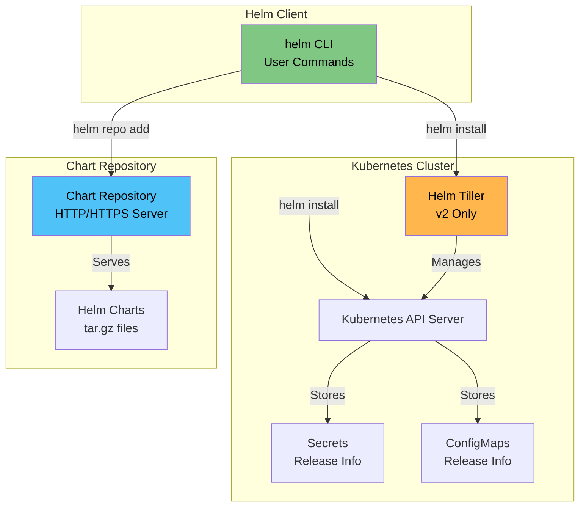
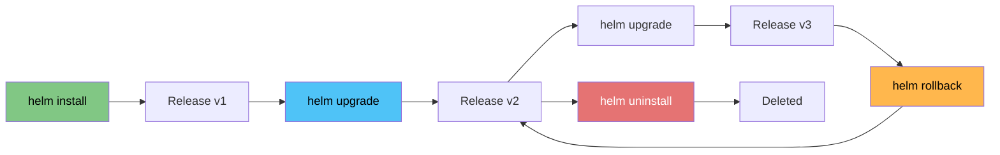
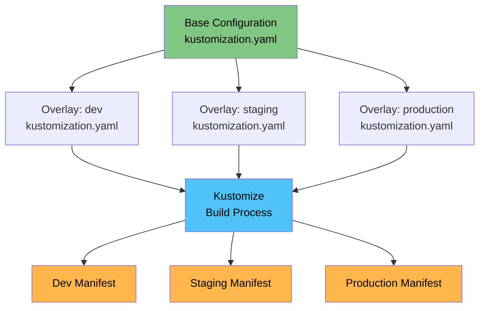

# Package Management and Templating

<details>
<summary><b>📋 Table of Contents</b></summary>

- [Introduction to Package Management](#introduction-to-package-management)
- [Helm - The Package Manager for Kubernetes](#helm---the-package-manager-for-kubernetes)
  - [What is Helm?](#what-is-helm)
  - [Helm Architecture](#helm-architecture)
  - [Helm Components](#helm-components)
  - [Installing Helm](#installing-helm)
  - [Helm Charts](#helm-charts)
  - [Creating Helm Charts](#creating-helm-charts)
  - [Helm Values](#helm-values)
  - [Helm Commands](#helm-commands)
  - [Helm Repositories](#helm-repositories)
  - [Helm Releases](#helm-releases)
  - [Helm Hooks](#helm-hooks)
  - [Helm Templates and Functions](#helm-templates-and-functions)
  - [Helm Best Practices](#helm-best-practices)
- [Kustomize - Kubernetes Native Configuration Management](#kustomize---kubernetes-native-configuration-management)
  - [What is Kustomize?](#what-is-kustomize)
  - [Kustomize Architecture](#kustomize-architecture)
  - [Installing Kustomize](#installing-kustomize)
  - [Kustomize Basics](#kustomize-basics)
  - [Kustomize Overlays](#kustomize-overlays)
  - [Kustomize Transformers](#kustomize-transformers)
  - [Kustomize Generators](#kustomize-generators)
  - [Kustomize Best Practices](#kustomize-best-practices)
- [Helm vs Kustomize](#helm-vs-kustomize)
- [Other Package Management Tools](#other-package-management-tools)
- [Tutorial References](#tutorial-references)

</details>

---

## Introduction to Package Management

### What is Package Management in Kubernetes?

**Simple Explanation:**
Package management in Kubernetes is like using package managers (npm, pip, apt) for applications - it helps you install, manage, and update Kubernetes applications easily.

**Analogy:**
Think of Kubernetes package management like:
- **Helm** = npm/pip (package manager with repositories)
- **Kustomize** = Docker Compose (configuration management)
- **Raw YAML** = Manual installation (copy-paste files)

### Why Do We Need Package Management?

**Challenges with Raw YAML:**
1. **Repetition:** Same configuration across environments
2. **Complexity:** Managing hundreds of YAML files
3. **Updates:** Difficult to upgrade applications
4. **Dependencies:** Hard to manage application dependencies
5. **Reusability:** Can't easily share configurations

**Benefits of Package Management:**
- ✅ **Reusability:** Share and reuse application configurations
- ✅ **Versioning:** Manage different versions of applications
- ✅ **Templating:** Parameterize configurations
- ✅ **Dependencies:** Manage application dependencies
- ✅ **Rollbacks:** Easy rollback to previous versions
- ✅ **Updates:** Simplified upgrade process

---

## Helm - The Package Manager for Kubernetes

### What is Helm?

**Helm** is the most popular package manager for Kubernetes. It helps you manage Kubernetes applications through Helm Charts.

**Simple Explanation:**
Helm is like "apt-get" or "npm" for Kubernetes - it lets you install, upgrade, and manage applications easily.

**Analogy:**
Think of Helm like a recipe book:
- **Helm Chart** = Recipe (template for an application)
- **Helm Release** = Actual dish (deployed application instance)
- **Helm Values** = Ingredients (configuration parameters)
- **Helm Repository** = Recipe book collection

### Helm Architecture



**Note:** Helm v3 removed Tiller and works directly with Kubernetes API server.

### Helm Components

#### 1. Helm Client (helm CLI)

The command-line tool you use to interact with Helm:

```bash
helm version
helm install
helm upgrade
helm uninstall
helm list
```

#### 2. Helm Charts

Packages of pre-configured Kubernetes resources:

- **Chart Structure:** Organized collection of YAML templates
- **Chart Metadata:** Information about the chart (Chart.yaml)
- **Templates:** Kubernetes manifest templates
- **Values:** Default configuration values

#### 3. Helm Releases

An instance of a chart deployed to Kubernetes:

- Each `helm install` creates a release
- Releases are versioned
- Can have multiple releases of the same chart

#### 4. Helm Repository

A collection of published charts:

- Public repositories (Artifact Hub, Bitnami)
- Private repositories
- Local repositories

---

### Installing Helm

#### Install Helm v3 (Recommended)

**macOS:**
```bash
brew install helm
```

**Linux:**
```bash
curl https://raw.githubusercontent.com/helm/helm/main/scripts/get-helm-3 | bash
```

**Windows:**
```powershell
choco install kubernetes-helm
```

**Verify Installation:**
```bash
helm version
```

#### Install via Script

```bash
curl -fsSL -o get_helm.sh https://raw.githubusercontent.com/helm/helm/main/scripts/get-helm-3
chmod 700 get_helm.sh
./get_helm.sh
```

---

### Helm Charts

#### Chart Structure

A Helm chart has the following directory structure:

```
mychart/
├── Chart.yaml          # Chart metadata
├── values.yaml         # Default configuration values
├── templates/          # Template files
│   ├── deployment.yaml
│   ├── service.yaml
│   ├── configmap.yaml
│   └── _helpers.tpl    # Helper templates
├── charts/             # Chart dependencies
├── templates/NOTES.txt # Installation notes
└── .helmignore         # Files to ignore
```

#### Chart.yaml

Metadata about the chart:

```yaml
apiVersion: v2
name: mychart
description: A Helm chart for my application
type: application
version: 0.1.0
appVersion: "1.0.0"
dependencies:
  - name: postgresql
    version: "12.0.0"
    repository: "https://charts.bitnami.com/bitnami"
```

**Fields:**
- **apiVersion:** Chart API version (v2 for Helm 3)
- **name:** Chart name
- **version:** Chart version (SemVer)
- **appVersion:** Application version
- **dependencies:** Chart dependencies

#### values.yaml

Default configuration values:

```yaml
replicaCount: 1

image:
  repository: nginx
  pullPolicy: IfNotPresent
  tag: "latest"

service:
  type: ClusterIP
  port: 80

ingress:
  enabled: false
  className: "nginx"
  annotations: {}
  hosts:
    - host: chart-example.local
      paths:
        - path: /
          pathType: Prefix
  tls: []

resources:
  limits:
    cpu: 200m
    memory: 256Mi
  requests:
    cpu: 100m
    memory: 128Mi
```

---

### Creating Helm Charts

#### Step 1: Create Chart

```bash
helm create mychart
```

This creates a basic chart structure.

#### Step 2: Customize Templates

Edit files in `templates/` directory:

**templates/deployment.yaml:**
```yaml
apiVersion: apps/v1
kind: Deployment
metadata:
  name: {{ include "mychart.fullname" . }}
  labels:
    {{- include "mychart.labels" . | nindent 4 }}
spec:
  replicas: {{ .Values.replicaCount }}
  selector:
    matchLabels:
      {{- include "mychart.selectorLabels" . | nindent 6 }}
  template:
    metadata:
      labels:
        {{- include "mychart.selectorLabels" . | nindent 8 }}
    spec:
      containers:
      - name: {{ .Chart.Name }}
        image: "{{ .Values.image.repository }}:{{ .Values.image.tag | default .Chart.AppVersion }}"
        imagePullPolicy: {{ .Values.image.pullPolicy }}
        ports:
        - name: http
          containerPort: 80
          protocol: TCP
        resources:
          {{- toYaml .Values.resources | nindent 10 }}
```

#### Step 3: Test Chart

```bash
# Dry run
helm install mychart ./mychart --dry-run --debug

# Template rendering
helm template mychart ./mychart
```

#### Step 4: Install Chart

```bash
helm install myrelease ./mychart
```

---

### Helm Values

#### Using Values Files

**Install with custom values:**
```bash
helm install myrelease ./mychart -f myvalues.yaml
```

**myvalues.yaml:**
```yaml
replicaCount: 3
image:
  tag: "1.2.3"
service:
  type: LoadBalancer
```

#### Override Values

**Command-line overrides:**
```bash
helm install myrelease ./mychart \
  --set replicaCount=3 \
  --set image.tag=1.2.3 \
  --set service.type=LoadBalancer
```

**Multiple values files:**
```bash
helm install myrelease ./mychart \
  -f values.yaml \
  -f production-values.yaml
```

**Value precedence (highest to lowest):**
1. Command-line `--set` flags
2. `-f` or `--values` files
3. `values.yaml` in chart
4. Default values in chart templates

---

### Helm Commands

#### Basic Commands

**Install:**
```bash
helm install <release-name> <chart>
helm install myapp ./mychart
helm install myapp bitnami/nginx
```

**List releases:**
```bash
helm list
helm list --all-namespaces
helm list -n production
```

**Get release info:**
```bash
helm status myapp
helm get values myapp
helm get manifest myapp
```

**Upgrade:**
```bash
helm upgrade myapp ./mychart
helm upgrade myapp ./mychart -f new-values.yaml
```

**Rollback:**
```bash
helm rollback myapp
helm rollback myapp 2  # Rollback to revision 2
helm history myapp
```

**Uninstall:**
```bash
helm uninstall myapp
helm uninstall myapp --keep-history
```

#### Repository Commands

**Add repository:**
```bash
helm repo add bitnami https://charts.bitnami.com/bitnami
helm repo add stable https://charts.helm.sh/stable
```

**List repositories:**
```bash
helm repo list
```

**Update repositories:**
```bash
helm repo update
```

**Search charts:**
```bash
helm search repo nginx
helm search repo bitnami/nginx
helm search hub wordpress
```

#### Chart Commands

**Package chart:**
```bash
helm package ./mychart
```

**Verify chart:**
```bash
helm lint ./mychart
```

**Show chart values:**
```bash
helm show values bitnami/nginx
```

**Show chart info:**
```bash
helm show chart bitnami/nginx
```

---

### Helm Repositories

#### Public Repositories

**Artifact Hub (Helm Hub):**
- Official Helm chart repository
- URL: https://artifacthub.io
- Search: `helm search hub <chart-name>`

**Bitnami:**
```bash
helm repo add bitnami https://charts.bitnami.com/bitnami
```

**Prometheus Community:**
```bash
helm repo add prometheus-community https://prometheus-community.github.io/helm-charts
```

#### Private Repositories

**Using ChartMuseum:**
```bash
# Install ChartMuseum
helm repo add chartmuseum https://chartmuseum.github.io/charts
helm install chartmuseum chartmuseum/chartmuseum

# Add your repository
helm repo add myrepo http://chartmuseum.example.com
```

**Using GitHub Pages:**
1. Create `gh-pages` branch
2. Host charts in `docs/` directory
3. Add repository:
```bash
helm repo add myrepo https://username.github.io/charts
```

#### Creating Your Own Repository

**Step 1: Package charts:**
```bash
helm package ./mychart
# Creates mychart-0.1.0.tgz
```

**Step 2: Create index:**
```bash
helm repo index . --url https://charts.example.com
# Creates index.yaml
```

**Step 3: Host files:**
- Upload `.tgz` files and `index.yaml` to web server
- Or use ChartMuseum, GitHub Pages, or S3

---

### Helm Releases

#### Release Lifecycle



#### Release Management

**View release history:**
```bash
helm history myapp
```

**Output:**
```
REVISION	UPDATED                 	STATUS    	CHART          	APP VERSION	DESCRIPTION
1       	Mon Jan 15 10:00:00 2024	deployed  	mychart-0.1.0  	1.0.0      	Install complete
2       	Mon Jan 15 11:00:00 2024	deployed  	mychart-0.2.0  	1.1.0      	Upgrade complete
3       	Mon Jan 15 12:00:00 2024	failed    	mychart-0.3.0  	1.2.0      	Upgrade failed
```

**Rollback to specific revision:**
```bash
helm rollback myapp 2
```

**Release storage:**
- Helm v3 stores releases as Secrets
- Each release has a Secret in the namespace
- Secrets contain release metadata and manifest

---

### Helm Hooks

#### What are Helm Hooks?

Hooks allow you to run jobs at specific points in a release lifecycle.

#### Hook Types

1. **pre-install:** Before templates are installed
2. **post-install:** After all resources are loaded
3. **pre-delete:** Before deletion
4. **post-delete:** After deletion
5. **pre-upgrade:** Before upgrade
6. **post-upgrade:** After upgrade
7. **pre-rollback:** Before rollback
8. **post-rollback:** After rollback

#### Hook Example

**templates/migration-job.yaml:**
```yaml
apiVersion: batch/v1
kind: Job
metadata:
  name: {{ include "mychart.fullname" . }}-migration
  annotations:
    "helm.sh/hook": pre-upgrade
    "helm.sh/hook-weight": "-5"
    "helm.sh/hook-delete-policy": before-hook-creation,hook-succeeded
spec:
  template:
    spec:
      restartPolicy: Never
      containers:
      - name: migration
        image: myapp:migrate
        command: ["/bin/sh", "-c", "run-migrations.sh"]
```

**Hook Annotations:**
- `helm.sh/hook`: Hook type
- `helm.sh/hook-weight`: Execution order (lower = earlier)
- `helm.sh/hook-delete-policy`: When to delete hook
  - `before-hook-creation`: Delete before new hook
  - `hook-succeeded`: Delete on success
  - `hook-failed`: Delete on failure

---

### Helm Templates and Functions

#### Template Syntax

Helm uses Go templates with Sprig functions:

**Basic syntax:**
```yaml
{{ .Values.replicaCount }}
{{ .Chart.Name }}
{{ .Release.Name }}
```

**Conditionals:**
```yaml
{{- if .Values.ingress.enabled }}
apiVersion: networking.k8s.io/v1
kind: Ingress
{{- end }}
```

**Loops:**
```yaml
{{- range .Values.env }}
- name: {{ .name }}
  value: {{ .value }}
{{- end }}
```

#### Built-in Objects

- **.Release:** Release information
  - `.Release.Name`
  - `.Release.Namespace`
  - `.Release.Service`
  - `.Release.Revision`
- **.Chart:** Chart metadata
  - `.Chart.Name`
  - `.Chart.Version`
  - `.Chart.AppVersion`
- **.Values:** Values from values.yaml
- **.Files:** Access to non-template files
- **.Capabilities:** Kubernetes version info
- **.Template:** Current template information

#### Sprig Functions

**String functions:**
```yaml
{{ .Values.name | upper }}
{{ .Values.name | lower }}
{{ .Values.name | title }}
{{ .Values.name | trunc 10 }}
{{ .Values.name | replace "old" "new" }}
```

**Math functions:**
```yaml
{{ add 1 2 }}
{{ sub 5 2 }}
{{ mul 2 3 }}
{{ div 10 2 }}
```

**Date functions:**
```yaml
{{ now | date "2006-01-02" }}
{{ .Values.startDate | date "2006-01-02" }}
```

**List functions:**
```yaml
{{ .Values.items | first }}
{{ .Values.items | last }}
{{ .Values.items | has "item1" }}
```

**Type conversion:**
```yaml
{{ .Values.count | int }}
{{ .Values.enabled | default true | bool }}
{{ .Values.port | toString }}
```

#### Helper Templates

**templates/_helpers.tpl:**
```yaml
{{- define "mychart.fullname" -}}
{{- if .Values.fullnameOverride }}
{{- .Values.fullnameOverride | trunc 63 | trimSuffix "-" }}
{{- else }}
{{- $name := default .Chart.Name .Values.nameOverride }}
{{- printf "%s-%s" .Release.Name $name | trunc 63 | trimSuffix "-" }}
{{- end }}
{{- end }}

{{- define "mychart.labels" -}}
helm.sh/chart: {{ include "mychart.chart" . }}
{{ include "mychart.selectorLabels" . }}
{{- if .Chart.AppVersion }}
app.kubernetes.io/version: {{ .Chart.AppVersion | quote }}
{{- end }}
app.kubernetes.io/managed-by: {{ .Release.Service }}
{{- end }}
```

**Using helpers:**
```yaml
metadata:
  name: {{ include "mychart.fullname" . }}
  labels:
    {{- include "mychart.labels" . | nindent 4 }}
```

---

### Helm Best Practices

#### Chart Structure

1. **Keep charts focused:** One chart per application
2. **Use semantic versioning:** Follow SemVer for chart versions
3. **Document values:** Add comments to values.yaml
4. **Use helpers:** Create reusable template helpers
5. **Validate inputs:** Use schema validation

#### Values Management

1. **Sensible defaults:** Provide working default values
2. **Environment-specific values:** Use separate values files
3. **Documentation:** Document all values in values.yaml
4. **Type safety:** Use proper types in values

#### Templates

1. **DRY principle:** Don't repeat yourself, use helpers
2. **Readability:** Keep templates readable
3. **Error handling:** Handle missing values gracefully
4. **Comments:** Add comments for complex logic

#### Security

1. **Secrets management:** Use external secret management
2. **RBAC:** Set appropriate RBAC permissions
3. **Image security:** Use specific image tags, not "latest"
4. **Resource limits:** Always set resource limits

#### Testing

1. **Lint charts:** Use `helm lint`
2. **Dry run:** Test with `--dry-run`
3. **Template rendering:** Use `helm template` to verify
4. **Integration testing:** Test in staging before production

---

## Kustomize - Kubernetes Native Configuration Management

### What is Kustomize?

**Kustomize** is a template-free way to customize Kubernetes YAML configurations. It's built into `kubectl` since v1.14.

**Simple Explanation:**
Kustomize is like "CSS for Kubernetes YAML" - it lets you customize and compose Kubernetes manifests without templating.

**Analogy:**
Think of Kustomize like photo editing:
- **Base** = Original photo (base configuration)
- **Overlay** = Filters/effects (environment-specific changes)
- **Kustomize** = Photo editor (applies changes)

### Kustomize Architecture



### Installing Kustomize

#### Kustomize is Built into kubectl

Since kubectl v1.14, Kustomize is built-in:

```bash
kubectl kustomize <directory>
kubectl apply -k <directory>
```

#### Standalone Installation

**macOS:**
```bash
brew install kustomize
```

**Linux:**
```bash
curl -s "https://raw.githubusercontent.com/kubernetes-sigs/kustomize/master/hack/install_kustomize.sh" | bash
```

**Verify:**
```bash
kustomize version
```

---

### Kustomize Basics

#### Directory Structure

```
base/
├── kustomization.yaml
├── deployment.yaml
├── service.yaml
└── configmap.yaml

overlays/
├── dev/
│   ├── kustomization.yaml
│   └── replica-patch.yaml
├── staging/
│   ├── kustomization.yaml
│   └── resource-patch.yaml
└── production/
    ├── kustomization.yaml
    └── resource-patch.yaml
```

#### kustomization.yaml

**Base kustomization.yaml:**
```yaml
apiVersion: kustomize.config.k8s.io/v1beta1
kind: Kustomization

resources:
  - deployment.yaml
  - service.yaml
  - configmap.yaml

commonLabels:
  app: myapp
  managed-by: kustomize

commonAnnotations:
  version: v1.0.0
```

**Fields:**
- **resources:** List of YAML files to include
- **commonLabels:** Labels applied to all resources
- **commonAnnotations:** Annotations applied to all resources
- **namespace:** Namespace for all resources
- **namePrefix:** Prefix for all resource names
- **nameSuffix:** Suffix for all resource names

#### Build and Apply

**Build (dry run):**
```bash
kubectl kustomize ./base
kustomize build ./base
```

**Apply:**
```bash
kubectl apply -k ./base
kubectl apply --kustomize ./base
```

---

### Kustomize Overlays

#### What are Overlays?

Overlays allow you to customize the base configuration for different environments.

#### Overlay Structure

**overlays/dev/kustomization.yaml:**
```yaml
apiVersion: kustomize.config.k8s.io/v1beta1
kind: Kustomization

bases:
  - ../../base

replicas:
  - name: myapp
    count: 1

patchesStrategicMerge:
  - replica-patch.yaml

configMapGenerator:
  - name: app-config
    literals:
      - ENV=development
      - DEBUG=true
```

**overlays/production/kustomization.yaml:**
```yaml
apiVersion: kustomize.config.k8s.io/v1beta1
kind: Kustomization

bases:
  - ../../base

replicas:
  - name: myapp
    count: 5

patchesStrategicMerge:
  - resource-patch.yaml

configMapGenerator:
  - name: app-config
    literals:
      - ENV=production
      - DEBUG=false

resources:
  - hpa.yaml
  - pdb.yaml
```

#### Using Overlays

**Build for dev:**
```bash
kubectl kustomize overlays/dev
```

**Build for production:**
```bash
kubectl kustomize overlays/production
```

**Apply to dev:**
```bash
kubectl apply -k overlays/dev
```

**Apply to production:**
```bash
kubectl apply -k overlays/production
```

---

### Kustomize Transformers

#### What are Transformers?

Transformers modify resources during the build process.

#### Common Transformers

**1. replicas:**
```yaml
replicas:
  - name: myapp
    count: 5
```

**2. images:**
```yaml
images:
  - name: nginx
    newName: myregistry/nginx
    newTag: v1.2.3
```

**3. namePrefix:**
```yaml
namePrefix: dev-
# myapp -> dev-myapp
```

**4. nameSuffix:**
```yaml
nameSuffix: -v1
# myapp -> myapp-v1
```

**5. namespace:**
```yaml
namespace: production
# All resources go to production namespace
```

**6. commonLabels:**
```yaml
commonLabels:
  environment: production
  team: backend
```

**7. commonAnnotations:**
```yaml
commonAnnotations:
  version: v1.0.0
  managed-by: kustomize
```

#### Patches

**Strategic Merge Patch:**
```yaml
patchesStrategicMerge:
  - patch.yaml
```

**patch.yaml:**
```yaml
apiVersion: apps/v1
kind: Deployment
metadata:
  name: myapp
spec:
  replicas: 10
  template:
    spec:
      containers:
      - name: myapp
        resources:
          limits:
            cpu: 1000m
            memory: 2Gi
```

**JSON Patch:**
```yaml
patchesJson6902:
  - target:
      group: apps
      version: v1
      kind: Deployment
      name: myapp
    path: patch.json
```

**patch.json:**
```json
[
  {
    "op": "replace",
    "path": "/spec/replicas",
    "value": 10
  }
]
```

---

### Kustomize Generators

#### ConfigMap Generator

**From literals:**
```yaml
configMapGenerator:
  - name: app-config
    literals:
      - ENV=production
      - DEBUG=false
```

**From files:**
```yaml
configMapGenerator:
  - name: app-config
    files:
      - config.properties
      - app.conf
```

**From env files:**
```yaml
configMapGenerator:
  - name: app-config
    envs:
      - .env
```

#### Secret Generator

**From literals:**
```yaml
secretGenerator:
  - name: app-secret
    literals:
      - password=secret123
      - api-key=key456
```

**From files:**
```yaml
secretGenerator:
  - name: app-secret
    files:
      - password.txt
      - api-key.txt
```

**Note:** Secrets are base64 encoded automatically.

#### Resource Generator

**From directories:**
```yaml
resources:
  - ../base
  - ../common
```

**From URLs:**
```yaml
resources:
  - https://github.com/kubernetes/examples/raw/master/guestbook
```

---

### Kustomize Best Practices

#### Structure

1. **Base configuration:** Keep base minimal and reusable
2. **Overlays:** One overlay per environment
3. **Patches:** Use patches for environment-specific changes
4. **Generators:** Use generators for dynamic content

#### Organization

1. **Directory structure:** Follow consistent structure
2. **Naming:** Use clear, descriptive names
3. **Documentation:** Document overlays and patches
4. **Version control:** Track all kustomization files

#### Practices

1. **DRY:** Don't repeat configurations
2. **Composition:** Compose from multiple bases
3. **Testing:** Test builds before applying
4. **Validation:** Validate generated YAML

---

## Helm vs Kustomize

### Comparison Table

| Feature | Helm | Kustomize |
|---------|------|-----------|
| **Type** | Package Manager | Configuration Management |
| **Templating** | Yes (Go templates) | No (declarative) |
| **Learning Curve** | Medium | Low |
| **Built into kubectl** | No | Yes (since v1.14) |
| **Repository Support** | Yes | No |
| **Versioning** | Chart versions | Git-based |
| **Dependencies** | Yes | Limited |
| **Hooks** | Yes | No |
| **Best For** | Applications, packages | Configuration management |

### When to Use Helm

- ✅ Installing third-party applications
- ✅ Managing application packages
- ✅ Need templating capabilities
- ✅ Sharing applications via repositories
- ✅ Complex application lifecycle

### When to Use Kustomize

- ✅ Managing your own applications
- ✅ Environment-specific configurations
- ✅ GitOps workflows
- ✅ Simple configuration management
- ✅ Native Kubernetes tooling

### Using Both Together

You can use Helm and Kustomize together:

```yaml
# kustomization.yaml
resources:
  - helm-chart-output.yaml

patchesStrategicMerge:
  - custom-patch.yaml
```

Or use Helm to generate base, then customize with Kustomize.

---

## Other Package Management Tools

### Skaffold

**Skaffold** is a command-line tool for continuous development of Kubernetes applications.

**Features:**
- Local development workflow
- Automatic rebuild and redeploy
- Multi-stage pipelines
- Integration with Helm, Kustomize, Docker

**Website:** https://skaffold.dev

### Tilt

**Tilt** is a microservice development environment for Kubernetes.

**Features:**
- Live updates
- Resource monitoring
- Development UI
- Fast feedback loops

**Website:** https://tilt.dev

### Draft

**Draft** helps developers get started with Kubernetes by generating Dockerfiles and Helm charts.

**Features:**
- Auto-generate Dockerfiles
- Create Helm charts
- Language detection
- Quick start templates

**Website:** https://draft.sh

### Jsonnet

**Jsonnet** is a data templating language for generating JSON/YAML.

**Features:**
- Powerful templating
- Reusable components
- Type safety
- Used by kubecfg, kapitan

**Website:** https://jsonnet.org

### Kapitan

**Kapitan** is a generic templating solution for managing complex deployments.

**Features:**
- Jsonnet-based
- Secret management
- Inventory management
- Multi-target support

**Website:** https://kapitan.dev

---

## Tutorial References

- **[Helm Tutorial](../../tutorials/12-helm/README.md)** - Hands-on tutorial to create and use Helm charts
- **[Kustomize Tutorial](../../tutorials/13-kustomize/README.md)** - Step-by-step guide to manage configurations with Kustomize

---

**Next Steps:**
- Create your first Helm chart
- Set up Kustomize overlays for environments
- Explore Helm repositories
- Learn advanced Helm templating
- Integrate with CI/CD pipelines

