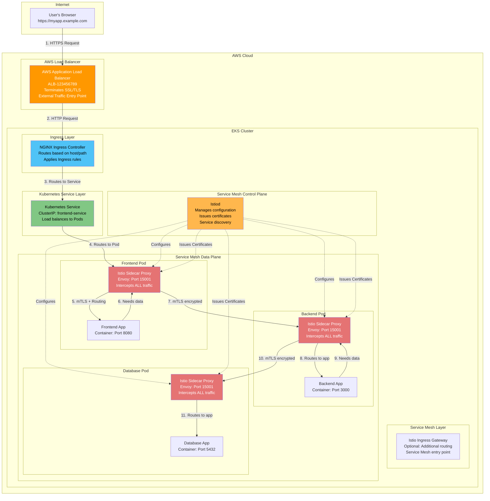
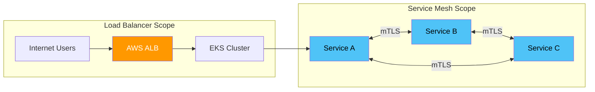
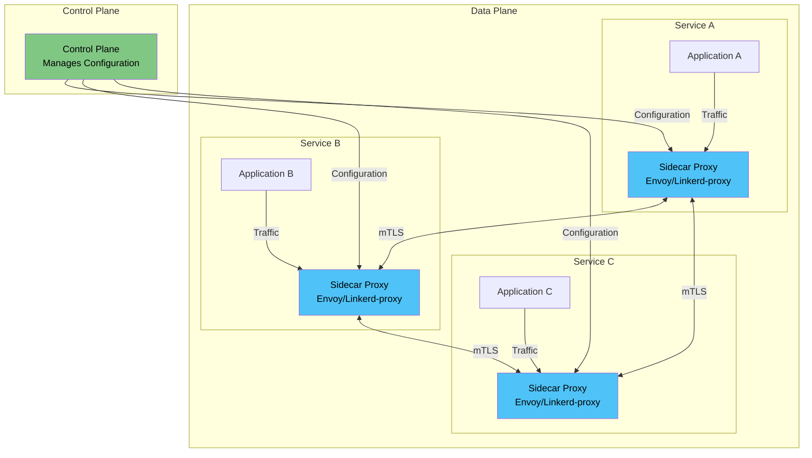
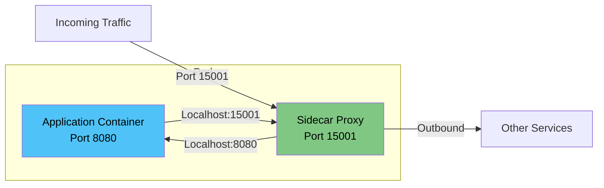
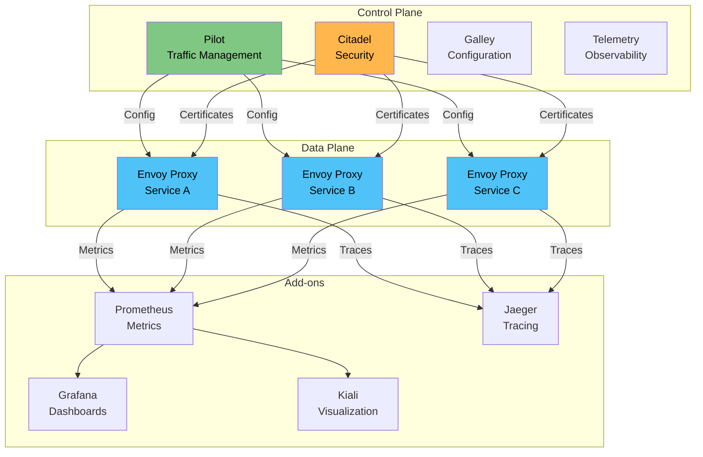
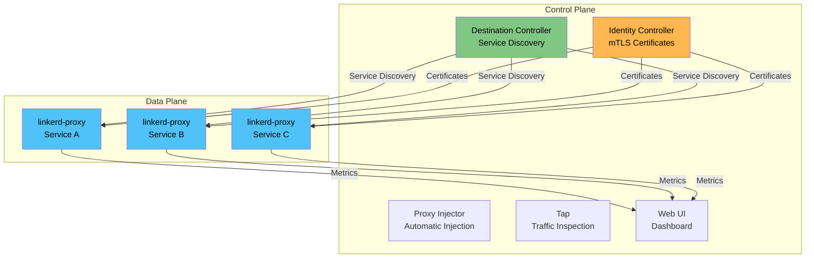

# Service Mesh

<details>
<summary><b>📋 Table of Contents</b></summary>

- [Introduction to Service Mesh](#introduction-to-service-mesh)
  - [Load Balancer vs Service Mesh - Why Do We Need Both?](#load-balancer-vs-service-mesh---why-do-we-need-both)
  - [Full Traffic Flow in EKS (AWS Example)](#full-traffic-flow-in-eks-aws-example)
  - [Detailed Explanation of Each Layer](#detailed-explanation-of-each-layer)
  - [Why Both Load Balancer AND Service Mesh?](#why-both-load-balancer-and-service-mesh)
  - [Real-World Example: E-Commerce Application](#real-world-example-e-commerce-application)
  - [Summary: Load Balancer vs Service Mesh](#summary-load-balancer-vs-service-mesh)
- [What is a Service Mesh?](#what-is-a-service-mesh)
- [Why Do We Need a Service Mesh?](#why-do-we-need-a-service-mesh)
- [Service Mesh Architecture](#service-mesh-architecture)
- [Service Mesh Components](#service-mesh-components)
- [Service Mesh Features](#service-mesh-features)
- [Istio - The Most Popular Service Mesh](#istio---the-most-popular-service-mesh)
  - [Istio Architecture](#istio-architecture)
  - [Istio Components](#istio-components)
  - [Istio Installation](#istio-installation)
  - [Istio Traffic Management](#istio-traffic-management)
  - [Istio Security](#istio-security)
  - [Istio Observability](#istio-observability)
- [Linkerd - Lightweight Service Mesh](#linkerd---lightweight-service-mesh)
  - [Linkerd Architecture](#linkerd-architecture)
  - [Linkerd Components](#linkerd-components)
  - [Linkerd Installation](#linkerd-installation)
  - [Linkerd Features](#linkerd-features)
- [Other Service Mesh Solutions](#other-service-mesh-solutions)
  - [Consul Connect](#consul-connect)
  - [Kuma](#kuma)
  - [AWS App Mesh](#aws-app-mesh)
  - [Open Service Mesh (OSM)](#open-service-mesh-osm)
  - [Traefik Mesh](#traefik-mesh)
  - [NGINX Service Mesh](#nginx-service-mesh)
- [Service Mesh Comparison](#service-mesh-comparison)
- [Choosing a Service Mesh](#choosing-a-service-mesh)
- [Best Practices](#best-practices)
- [Tutorial Reference](#tutorial-reference)

</details>

---

## Introduction to Service Mesh

### Load Balancer vs Service Mesh - Why Do We Need Both?

**Common Confusion:**
Many people ask: "If we already have a Load Balancer (like AWS ALB/NLB), why do we need a Service Mesh?"

**Simple Answer:**
- **Load Balancer** = Handles traffic FROM OUTSIDE (users/internet) TO your cluster
- **Service Mesh** = Handles traffic INSIDE your cluster (service-to-service communication)

**Real-World Analogy:**
Think of a shopping mall:
- **Load Balancer (ALB)** = Main entrance security and reception desk (handles people coming from outside)
- **Service Mesh** = Internal security guards, elevators, and navigation system (handles movement inside the mall between shops)
- **Ingress** = Floor directory and access control (routes external traffic to the right shop)
- **Services** = Individual shops in the mall

**Key Difference:**
- Load Balancer: External → Cluster (one entry point)
- Service Mesh: Service → Service (many internal connections)

### Full Traffic Flow in EKS (AWS Example)

Let's trace a complete request from a user to your application in EKS:

#### Step-by-Step Flow

**1. User Makes Request:**
```
User's Browser
    ↓
    GET https://myapp.example.com/api/users
```

**2. DNS Resolution:**
```
DNS Server
    ↓
    Resolves to: ALB-123456789.us-east-1.elb.amazonaws.com
```

**3. AWS Application Load Balancer (ALB):**
```
AWS ALB (External Load Balancer)
    ↓
    - Receives HTTPS request from internet
    - Terminates SSL/TLS
    - Routes to target group (EKS nodes)
    - Health checks
    - Load balances across multiple nodes
```

**4. EKS Cluster - Ingress Controller:**
```
Ingress Controller (e.g., NGINX Ingress)
    ↓
    - Receives request from ALB
    - Checks Ingress rules
    - Routes based on host/path
    - Applies SSL termination (if needed)
    - Routes to appropriate Service
```

**5. Kubernetes Service:**
```
Kubernetes Service (ClusterIP/NodePort)
    ↓
    - Receives request from Ingress
    - Selects Pods using labels
    - Load balances across Pods
    - Routes to Pod IP
```

**6. Service Mesh (Istio/Linkerd) - Sidecar Proxy:**
```
Sidecar Proxy (istio-proxy/linkerd-proxy)
    ↓
    - Intercepts ALL traffic to/from Pod
    - Applies mTLS encryption
    - Applies routing rules
    - Collects metrics
    - Handles retries/timeouts
    - Routes to application container
```

**7. Application Container:**
```
Application Container
    ↓
    - Receives request
    - Processes business logic
    - May call other services (goes back through sidecar)
```

**8. Service-to-Service Communication (via Service Mesh):**
```
Application → Sidecar Proxy → Service Mesh → Other Service's Sidecar → Other Application
```

### Complete Traffic Flow Diagram (EKS Example)



### Detailed Explanation of Each Layer

#### Layer 1: AWS Application Load Balancer (ALB)

**What it does:**
- Receives traffic from the internet
- Terminates SSL/TLS (HTTPS → HTTP)
- Distributes traffic across multiple EKS nodes
- Performs health checks
- Provides single entry point

**Why we need it:**
- Your EKS cluster has multiple nodes
- Users need one URL to access your app
- ALB handles SSL certificates
- ALB provides high availability

**Example:**
```
User → https://myapp.example.com
     ↓
AWS ALB (myapp-123456789.us-east-1.elb.amazonaws.com)
     ↓
Routes to: EKS Node 1, Node 2, or Node 3
```

#### Layer 2: Ingress Controller

**What it does:**
- Receives traffic from ALB
- Routes based on hostname (myapp.example.com)
- Routes based on path (/api, /web, etc.)
- Can terminate SSL (if ALB doesn't)
- Applies rate limiting, authentication

**Why we need it:**
- Multiple applications in one cluster
- Route different domains to different services
- Path-based routing (/api → backend, /web → frontend)
- Centralized SSL management

**Example:**
```
ALB → Ingress Controller
     ↓
Checks: Host = myapp.example.com, Path = /api/users
     ↓
Routes to: backend-service (ClusterIP)
```

#### Layer 3: Kubernetes Service

**What it does:**
- Provides stable IP address for Pods
- Load balances across Pod replicas
- Selects Pods using labels
- Routes traffic to Pod IPs

**Why we need it:**
- Pods have dynamic IPs (change when restarted)
- Service provides stable endpoint
- Load balances across multiple Pods
- Abstracts Pod details

**Example:**
```
Ingress → Kubernetes Service (backend-service)
         ↓
    Selects Pods with label: app=backend
         ↓
    Routes to: Pod IP 10.244.1.5 or 10.244.2.3
```

#### Layer 4: Service Mesh Sidecar Proxy

**What it does:**
- Intercepts ALL traffic to/from the Pod
- Encrypts traffic with mTLS
- Applies routing rules (canary, A/B testing)
- Handles retries and timeouts
- Collects metrics and traces
- Implements circuit breakers

**Why we need it:**
- Secure service-to-service communication
- Advanced traffic management
- Observability (see what's happening)
- Resilience (retries, circuit breakers)
- No code changes needed

**Example:**
```
Kubernetes Service → Pod IP 10.244.1.5
                    ↓
            Sidecar Proxy (Port 15001)
                    ↓
        Applies: mTLS, routing rules, metrics
                    ↓
            Application Container (Port 3000)
```

#### Layer 5: Application Container

**What it does:**
- Runs your actual application code
- Processes business logic
- May call other services

**When calling other services:**
```
Application → localhost:15001 (sidecar)
             ↓
    Sidecar encrypts with mTLS
             ↓
    Routes through Service Mesh
             ↓
    Other service's sidecar decrypts
             ↓
    Other service's application
```

### Why Both Load Balancer AND Service Mesh?

#### Load Balancer Handles:

1. **External Traffic:**
   - Users from internet → Your cluster
   - Single entry point
   - SSL termination
   - Geographic distribution

2. **High Availability:**
   - Multiple availability zones
   - Health checks
   - Automatic failover

3. **Scalability:**
   - Handles millions of requests
   - Auto-scaling
   - DDoS protection

#### Service Mesh Handles:

1. **Internal Traffic:**
   - Service → Service communication
   - All microservices talking to each other
   - Secure communication (mTLS)

2. **Advanced Features:**
   - Canary deployments
   - A/B testing
   - Circuit breakers
   - Retries and timeouts

3. **Observability:**
   - See all service-to-service calls
   - Distributed tracing
   - Service dependency graph

4. **Security:**
   - Automatic mTLS between services
   - Service identity
   - Fine-grained access control

### Visual Comparison



**Key Point:**
- Load Balancer = External → Internal (one direction, one entry point)
- Service Mesh = Internal → Internal (many directions, all services)

### Real-World Example: E-Commerce Application

**Scenario:** User wants to view their order history

**Flow:**

1. **User → ALB:**
   ```
   User clicks "My Orders"
   → Browser sends: GET https://shop.example.com/api/orders
   → DNS resolves to AWS ALB
   → ALB receives HTTPS request
   ```

2. **ALB → Ingress:**
   ```
   ALB terminates SSL
   → Forwards HTTP to Ingress Controller
   → Ingress checks: host=shop.example.com, path=/api/orders
   → Routes to: orders-service (Kubernetes Service)
   ```

3. **Ingress → Kubernetes Service:**
   ```
   Kubernetes Service (orders-service)
   → Selects Pods with label: app=orders
   → Load balances: Pod 1, Pod 2, or Pod 3
   → Routes to: Pod IP 10.244.1.10
   ```

4. **Kubernetes Service → Sidecar:**
   ```
   Traffic arrives at Pod 10.244.1.10
   → Sidecar proxy (istio-proxy) intercepts
   → Applies mTLS (if calling other services)
   → Applies routing rules
   → Collects metrics
   → Forwards to: Application container (Port 8080)
   ```

5. **Application → Other Services (via Service Mesh):**
   ```
   Orders App needs user data
   → Calls: user-service
   → Request goes to: localhost:15001 (sidecar)
   → Sidecar encrypts with mTLS
   → Routes through Service Mesh
   → user-service's sidecar decrypts
   → user-service processes request
   → Response goes back through sidecars
   → Orders App receives user data
   ```

6. **Response Path:**
   ```
   Orders App → Sidecar → Kubernetes Service → Ingress → ALB → User
   ```

### What Happens Without Service Mesh?

**Without Service Mesh:**
```
Service A → Service B (plain HTTP, no encryption)
Service B → Service C (plain HTTP, no encryption)
- No visibility into service calls
- No automatic retries
- No circuit breakers
- No canary deployments
- Manual configuration in each service
```

**With Service Mesh:**
```
Service A → Sidecar → mTLS encrypted → Service B's Sidecar → Service B
Service B → Sidecar → mTLS encrypted → Service C's Sidecar → Service C
- Full visibility
- Automatic retries
- Circuit breakers
- Canary deployments
- Zero code changes
```

### Summary: Load Balancer vs Service Mesh

| Aspect | Load Balancer (ALB) | Service Mesh (Istio/Linkerd) |
|--------|---------------------|------------------------------|
| **Traffic Type** | External (Internet → Cluster) | Internal (Service → Service) |
| **Scope** | Entry point to cluster | All service-to-service calls |
| **Purpose** | Route external users to cluster | Secure and manage internal communication |
| **Location** | AWS Cloud (outside cluster) | Inside Kubernetes cluster |
| **SSL/TLS** | Terminates HTTPS from users | Provides mTLS between services |
| **Load Balancing** | Across EKS nodes | Across service Pods |
| **Features** | Health checks, SSL termination | mTLS, retries, circuit breakers, observability |
| **Configuration** | AWS Console/CLI | Kubernetes YAML (Istio CRDs) |

**Think of it this way:**
- **Load Balancer** = Front door of your house (handles visitors from outside)
- **Service Mesh** = Internal security system and intercom (handles communication between rooms)

Both are needed because they solve different problems!

### What is a Service Mesh?

**Simple Explanation:**
A Service Mesh is a dedicated infrastructure layer for handling service-to-service communication in microservices architectures. It provides features like load balancing, service discovery, security, and observability without requiring changes to application code.

**Analogy:**
Think of a Service Mesh like a "traffic control system" for your microservices:
- **Microservices** = Cars on the road
- **Service Mesh** = Traffic lights, road signs, GPS navigation, and traffic police
- **Sidecar Proxy** = Each car's navigation system and safety features
- **Control Plane** = Traffic control center that manages all the rules

### Key Concepts

1. **Sidecar Pattern:** A proxy container runs alongside each application container
2. **Control Plane:** Manages and configures the data plane
3. **Data Plane:** The sidecar proxies that handle actual traffic
4. **mTLS:** Mutual TLS for secure service-to-service communication
5. **Service Discovery:** Automatic discovery of services
6. **Traffic Management:** Routing, load balancing, circuit breaking
7. **Observability:** Metrics, logs, and traces

---

## Why Do We Need a Service Mesh?

### Challenges in Microservices

**Without Service Mesh:**
1. **Service Discovery:** Each service needs to implement discovery logic
2. **Load Balancing:** Application code must handle load balancing
3. **Security:** Each service must implement authentication/authorization
4. **Observability:** Difficult to get unified metrics, logs, and traces
5. **Resilience:** Circuit breakers, retries must be implemented per service
6. **Traffic Management:** Canary deployments, A/B testing require custom code

**With Service Mesh:**
- ✅ **Transparent:** No code changes needed
- ✅ **Centralized:** Manage all services from one place
- ✅ **Secure:** Automatic mTLS between services
- ✅ **Observable:** Unified metrics, logs, and traces
- ✅ **Resilient:** Built-in retries, timeouts, circuit breakers
- ✅ **Flexible:** Easy traffic splitting and routing

### Use Cases

1. **Security:** Enforce mTLS across all services
2. **Observability:** Get visibility into service communication
3. **Traffic Management:** Implement canary deployments, A/B testing
4. **Resilience:** Add retries, timeouts, circuit breakers
5. **Multi-cloud:** Connect services across different environments
6. **Compliance:** Meet security and compliance requirements

---

## Service Mesh Architecture

### High-Level Architecture



### Sidecar Pattern



**How it Works:**
1. All traffic to/from the application goes through the sidecar proxy
2. Application sends traffic to `localhost:15001` (sidecar)
3. Sidecar intercepts and processes the traffic
4. Sidecar forwards to destination service's sidecar
5. Destination sidecar forwards to the application

---

## Service Mesh Components

### Control Plane

The control plane is responsible for:
- **Configuration Management:** Distributes policies and routing rules
- **Service Discovery:** Maintains service registry
- **Certificate Management:** Issues and rotates TLS certificates
- **Policy Enforcement:** Validates and applies security policies
- **Observability:** Collects metrics and telemetry

### Data Plane

The data plane consists of:
- **Sidecar Proxies:** Lightweight proxies running alongside each service
- **Traffic Interception:** Captures all inbound and outbound traffic
- **Policy Enforcement:** Applies security and routing policies
- **Telemetry Collection:** Gathers metrics, logs, and traces

### Key Components

1. **Service Registry:** Catalog of all services
2. **Configuration Store:** Policies and routing rules
3. **Certificate Authority:** Issues mTLS certificates
4. **Proxy:** Handles actual traffic (Envoy, Linkerd-proxy, etc.)
5. **API Gateway:** Entry point for external traffic (optional)

---

## Service Mesh Features

### 1. Traffic Management

- **Load Balancing:** Multiple algorithms (round-robin, least-conn, etc.)
- **Traffic Splitting:** Distribute traffic across service versions
- **Canary Deployments:** Gradually shift traffic to new version
- **A/B Testing:** Route traffic based on headers, cookies
- **Circuit Breaking:** Prevent cascading failures
- **Retries:** Automatic retry with backoff
- **Timeouts:** Request timeout management

### 2. Security

- **mTLS:** Automatic mutual TLS between services
- **Authentication:** Service identity and authentication
- **Authorization:** Fine-grained access control
- **Policy Enforcement:** Network policies and security rules
- **Certificate Management:** Automatic certificate rotation

### 3. Observability

- **Metrics:** Request rates, latency, error rates
- **Distributed Tracing:** End-to-end request tracing
- **Logging:** Centralized logging
- **Service Topology:** Visual service dependency graph
- **Performance Monitoring:** Real-time performance metrics

### 4. Resilience

- **Circuit Breakers:** Stop requests to failing services
- **Retries:** Automatic retry with exponential backoff
- **Timeouts:** Prevent hanging requests
- **Health Checks:** Active and passive health checking
- **Fault Injection:** Test failure scenarios

---

## Istio - The Most Popular Service Mesh

### What is Istio?

**Istio** is the most popular and feature-rich service mesh for Kubernetes. It provides a complete solution for managing microservices communication, security, and observability.

**Key Characteristics:**
- **Mature:** Production-ready, widely adopted
- **Feature-Rich:** Comprehensive set of features
- **Flexible:** Highly configurable
- **Complex:** Steeper learning curve
- **Resource Intensive:** Higher resource consumption

### Istio Architecture



### Istio Components

#### Control Plane Components

**1. Istiod (Istio Daemon)**

In Istio 1.5+, all control plane components are unified into `istiod`:

- **Pilot:** Traffic management and service discovery
- **Citadel:** Security and certificate management
- **Galley:** Configuration validation and distribution

**Responsibilities:**
- Service discovery
- Traffic management configuration
- Certificate issuance and rotation
- Policy enforcement

**2. Pilot**

Manages traffic routing and load balancing:

- **Service Discovery:** Integrates with Kubernetes, Consul, etc.
- **Traffic Rules:** VirtualServices, DestinationRules
- **Load Balancing:** Configures load balancing algorithms
- **Health Checks:** Manages health checking

**3. Citadel**

Handles security:

- **Certificate Management:** Issues and rotates mTLS certificates
- **Service Identity:** Manages service identities
- **Policy Enforcement:** Enforces authentication/authorization policies

**4. Galley**

Configuration management:

- **Validation:** Validates Istio configuration
- **Distribution:** Distributes configuration to components
- **Transformation:** Converts configuration formats

#### Data Plane Components

**Envoy Proxy**

Istio uses Envoy as the sidecar proxy:

- **High Performance:** C++ based, very fast
- **Rich Features:** Load balancing, circuit breaking, retries
- **Protocol Support:** HTTP/1.1, HTTP/2, gRPC, TCP
- **Observability:** Built-in metrics and tracing

**Features:**
- Dynamic service discovery
- Load balancing
- TLS termination
- HTTP/2 and gRPC proxying
- Circuit breakers
- Health checks
- Staged rollouts
- Fault injection
- Rich metrics

### Istio Installation

#### Prerequisites

- Kubernetes cluster (v1.19+)
- `kubectl` configured
- Sufficient resources (2 CPU, 4GB RAM minimum)

#### Install Istio CLI

**macOS/Linux:**
```bash
curl -L https://istio.io/downloadIstio | sh -
cd istio-*
export PATH=$PWD/bin:$PATH
```

**Verify:**
```bash
istioctl version
```

#### Install Istio

**Default Installation:**
```bash
istioctl install
```

**With Profile:**
```bash
# List available profiles
istioctl profile list

# Install with demo profile
istioctl install --set profile=demo

# Install with minimal profile
istioctl install --set profile=minimal
```

**Custom Installation:**
```bash
istioctl install \
  --set values.global.proxy.resources.requests.cpu=100m \
  --set values.global.proxy.resources.requests.memory=128Mi
```

#### Verify Installation

```bash
# Check control plane
kubectl get pods -n istio-system

# Check services
kubectl get svc -n istio-system

# Verify Istio version
istioctl version
```

#### Enable Automatic Sidecar Injection

**Label namespace:**
```bash
kubectl label namespace default istio-injection=enabled
```

**Verify:**
```bash
kubectl get namespace -L istio-injection
```

**Manual injection:**
```bash
istioctl kube-inject -f deployment.yaml | kubectl apply -f -
```

### Istio Traffic Management

#### VirtualService

Defines routing rules for services:

```yaml
apiVersion: networking.istio.io/v1beta1
kind: VirtualService
metadata:
  name: reviews
spec:
  hosts:
    - reviews
  http:
    - match:
        - headers:
            end-user:
              exact: jason
      route:
        - destination:
            host: reviews
            subset: v2
    - route:
        - destination:
            host: reviews
            subset: v1
          weight: 50
        - destination:
            host: reviews
            subset: v2
          weight: 50
```

**Features:**
- **Host Matching:** Route based on host
- **Path Matching:** Route based on URL path
- **Header Matching:** Route based on headers
- **Weighted Routing:** Split traffic between versions
- **Fault Injection:** Inject delays and errors
- **Retries:** Configure retry policies
- **Timeouts:** Set request timeouts

#### DestinationRule

Defines policies for traffic to a service:

```yaml
apiVersion: networking.istio.io/v1beta1
kind: DestinationRule
metadata:
  name: reviews
spec:
  host: reviews
  subsets:
    - name: v1
      labels:
        version: v1
    - name: v2
      labels:
        version: v2
      trafficPolicy:
        loadBalancer:
          simple: LEAST_CONN
        connectionPool:
          tcp:
            maxConnections: 100
          http:
            http1MaxPendingRequests: 10
            http2MaxRequests: 100
            maxRequestsPerConnection: 2
        circuitBreaker:
          consecutiveErrors: 3
          interval: 30s
          baseEjectionTime: 30s
          maxEjectionPercent: 50
```

**Features:**
- **Subsets:** Define service versions
- **Load Balancing:** Configure load balancing algorithms
- **Connection Pooling:** Manage connection pools
- **Circuit Breaking:** Configure circuit breakers
- **Outlier Detection:** Detect and eject unhealthy hosts

#### Gateway

Manages ingress and egress traffic:

```yaml
apiVersion: networking.istio.io/v1beta1
kind: Gateway
metadata:
  name: my-gateway
spec:
  selector:
    istio: ingressgateway
  servers:
    - port:
        number: 80
        name: http
        protocol: HTTP
      hosts:
        - "*"
```

#### ServiceEntry

Add external services to the mesh:

```yaml
apiVersion: networking.istio.io/v1beta1
kind: ServiceEntry
metadata:
  name: external-api
spec:
  hosts:
    - api.example.com
  ports:
    - number: 443
      name: https
      protocol: HTTPS
  location: MESH_EXTERNAL
  resolution: DNS
```

### Istio Security

#### PeerAuthentication

Configure mTLS:

```yaml
apiVersion: security.istio.io/v1beta1
kind: PeerAuthentication
metadata:
  name: default
  namespace: istio-system
spec:
  mtls:
    mode: STRICT
```

**Modes:**
- **STRICT:** mTLS required for all traffic
- **PERMISSIVE:** mTLS optional (allows plain text)
- **DISABLE:** mTLS disabled

#### AuthorizationPolicy

Fine-grained access control:

```yaml
apiVersion: security.istio.io/v1beta1
kind: AuthorizationPolicy
metadata:
  name: allow-frontend
spec:
  selector:
    matchLabels:
      app: backend
  action: ALLOW
  rules:
    - from:
        - source:
            principals: ["cluster.local/ns/default/sa/frontend"]
      to:
        - operation:
            methods: ["GET", "POST"]
```

**Actions:**
- **ALLOW:** Allow matching requests
- **DENY:** Deny matching requests
- **AUDIT:** Log matching requests

### Istio Observability

#### Metrics

Istio automatically collects metrics:
- **Request Rate:** Requests per second
- **Request Duration:** Latency percentiles
- **Error Rate:** Percentage of errors
- **TCP Metrics:** Connection metrics

**Access Metrics:**
```bash
# Port-forward to Prometheus
kubectl port-forward -n istio-system svc/prometheus 9090:9090

# Access: http://localhost:9090
```

#### Distributed Tracing

Istio integrates with tracing backends:
- **Jaeger:** Default tracing backend
- **Zipkin:** Alternative tracing backend
- **Lightstep:** Commercial tracing solution

**Access Jaeger:**
```bash
kubectl port-forward -n istio-system svc/tracing 16686:16686

# Access: http://localhost:16686
```

#### Kiali - Service Mesh Visualization

Kiali provides a visual representation of the service mesh:

**Install Kiali:**
```bash
kubectl apply -f https://raw.githubusercontent.com/istio/istio/release-1.17/samples/addons/kiali.yaml
```

**Access Kiali:**
```bash
istioctl dashboard kiali
```

**Features:**
- Service topology graph
- Traffic flow visualization
- Health status
- Metrics and traces
- Configuration validation

---

## Linkerd - Lightweight Service Mesh

### What is Linkerd?

**Linkerd** is a lightweight, ultra-fast service mesh designed for simplicity and performance. It's built in Rust and Go, making it extremely resource-efficient.

**Key Characteristics:**
- **Lightweight:** Minimal resource footprint
- **Fast:** Built in Rust for performance
- **Simple:** Easy to install and use
- **Secure:** Automatic mTLS by default
- **User-Friendly:** Great CLI and dashboard

### Linkerd Architecture



### Linkerd Components

#### Control Plane Components

**1. Destination Controller**

- **Service Discovery:** Discovers services in the cluster
- **Load Balancing:** Manages load balancing decisions
- **Retry Logic:** Handles retry policies
- **Circuit Breaking:** Manages circuit breakers

**2. Identity Controller**

- **Certificate Authority:** Issues mTLS certificates
- **Certificate Rotation:** Automatically rotates certificates
- **Service Identity:** Manages service identities

**3. Proxy Injector**

- **Automatic Injection:** Injects sidecar proxies
- **Webhook:** Kubernetes mutating webhook
- **Configuration:** Manages proxy configuration

**4. Tap**

- **Traffic Inspection:** Inspects live traffic
- **Debugging:** Helps debug service communication
- **Real-time:** Shows real-time request/response data

**5. Web UI**

- **Dashboard:** Visual service mesh dashboard
- **Metrics:** Real-time metrics visualization
- **Topology:** Service topology graph

#### Data Plane Component

**linkerd-proxy**

Linkerd's sidecar proxy, written in Rust:

- **Ultra-Fast:** Extremely low latency
- **Resource Efficient:** Minimal CPU and memory usage
- **Automatic mTLS:** Built-in mTLS by default
- **Transparent:** Zero configuration needed

**Features:**
- Automatic mTLS
- Load balancing
- Retries and timeouts
- Circuit breaking
- Metrics collection
- Distributed tracing

### Linkerd Installation

#### Prerequisites

- Kubernetes cluster (v1.19+)
- `kubectl` configured

#### Install Linkerd CLI

**macOS:**
```bash
brew install linkerd
```

**Linux:**
```bash
curl --proto '=https' --tlsv1.2 -sSfL https://run.linkerd.io/install | sh
export PATH=$PATH:$HOME/.linkerd2/bin
```

**Verify:**
```bash
linkerd version
```

#### Pre-Installation Check

```bash
linkerd check --pre
```

This checks:
- Kubernetes cluster access
- Cluster configuration
- RBAC permissions
- Node resources

#### Install Linkerd

**Install Control Plane:**
```bash
linkerd install | kubectl apply -f -
```

**Verify Installation:**
```bash
linkerd check
```

**Install Viz Extension (for metrics and dashboard):**
```bash
linkerd viz install | kubectl apply -f -
```

**Install Jaeger Extension (for tracing):**
```bash
linkerd jaeger install | kubectl apply -f -
```

#### Enable Automatic Injection

**Inject namespace:**
```bash
kubectl annotate namespace default linkerd.io/inject=enabled
```

**Manual injection:**
```bash
linkerd inject deployment.yaml | kubectl apply -f -
```

### Linkerd Features

#### Automatic mTLS

Linkerd enables mTLS by default - no configuration needed:

```bash
# Check mTLS status
linkerd viz stat deploy -n default
```

#### Traffic Splitting

**ServiceProfile:**
```yaml
apiVersion: linkerd.io/v1alpha2
kind: ServiceProfile
metadata:
  name: web-svc
  namespace: default
spec:
  routes:
    - name: GET /
      condition:
        method: GET
        pathRegex: /
      isRetryable: true
      timeout: 10s
```

**TrafficSplit:**
```yaml
apiVersion: split.smi-spec.io/v1alpha1
kind: TrafficSplit
metadata:
  name: web-split
spec:
  service: web-svc
  backends:
    - service: web-svc-v1
      weight: 50
    - service: web-svc-v2
      weight: 50
```

#### Observability

**Metrics:**
```bash
# Get service metrics
linkerd viz stat deploy

# Get pod metrics
linkerd viz stat pod

# Get namespace metrics
linkerd viz stat ns
```

**Topology:**
```bash
# View service topology
linkerd viz top deploy
```

**Dashboard:**
```bash
# Open dashboard
linkerd viz dashboard
```

**Tap (Traffic Inspection):**
```bash
# Tap a deployment
linkerd viz tap deploy/web

# Tap a service
linkerd viz tap svc/web-svc
```

#### Retries and Timeouts

Configured via ServiceProfile:

```yaml
apiVersion: linkerd.io/v1alpha2
kind: ServiceProfile
metadata:
  name: web-svc
spec:
  routes:
    - name: default
      isRetryable: true
      timeout: 10s
```

#### Circuit Breaking

Automatic circuit breaking based on:
- Success rate
- Latency
- Connection pool exhaustion

---

## Other Service Mesh Solutions

### Consul Connect

**Consul Connect** is HashiCorp's service mesh solution, part of Consul.

**Key Features:**
- **Service Discovery:** Built on Consul's service discovery
- **mTLS:** Automatic certificate management
- **Intentions:** Access control policies
- **Multi-platform:** Works with Kubernetes, VMs, containers

**Characteristics:**
- Integrates with Consul ecosystem
- Good for multi-platform deployments
- Enterprise features available
- Moderate complexity

**Website:** https://www.consul.io/docs/connect

### Kuma

**Kuma** is a universal service mesh from Kong.

**Key Features:**
- **Universal:** Works with Kubernetes, VMs, bare metal
- **Multi-zone:** Connect services across zones
- **Policy-driven:** Policy-based configuration
- **Observability:** Built-in metrics and tracing

**Characteristics:**
- Universal deployment model
- Good for hybrid environments
- Policy-driven approach
- Growing ecosystem

**Website:** https://kuma.io

### AWS App Mesh

**AWS App Mesh** is AWS's managed service mesh.

**Key Features:**
- **Managed Service:** Fully managed by AWS
- **AWS Integration:** Deep integration with AWS services
- **Pay-per-use:** Pay only for what you use
- **Cloud-native:** Built for AWS environments

**Characteristics:**
- AWS-native solution
- Fully managed
- Good for AWS-only deployments
- Vendor lock-in

**Website:** https://aws.amazon.com/app-mesh/

### Open Service Mesh (OSM)

**Open Service Mesh (OSM)** is a lightweight, extensible service mesh.

**Key Features:**
- **Lightweight:** Minimal resource footprint
- **SMI Compliant:** Implements Service Mesh Interface
- **Simple:** Easy to use and understand
- **CNCF Project:** Cloud Native Computing Foundation project

**Characteristics:**
- Simple and lightweight
- SMI standard compliant
- Good for learning
- Less feature-rich than Istio

**Website:** https://openservicemesh.io

### Traefik Mesh

**Traefik Mesh** is a lightweight service mesh from Traefik Labs.

**Key Features:**
- **Lightweight:** Minimal overhead
- **Simple:** Easy to configure
- **Traefik Integration:** Works with Traefik
- **SMI Compliant:** Implements SMI specification

**Characteristics:**
- Very lightweight
- Simple configuration
- Good for small deployments
- Limited features

**Website:** https://mesh.traefik.io

### NGINX Service Mesh

**NGINX Service Mesh** is F5's service mesh solution.

**Key Features:**
- **NGINX Based:** Built on NGINX
- **Performance:** High performance
- **Security:** Strong security features
- **Observability:** Good observability tools

**Characteristics:**
- High performance
- NGINX ecosystem
- Enterprise support
- Moderate complexity

**Website:** https://www.nginx.com/products/nginx-service-mesh/

---

## Service Mesh Comparison

### Feature Comparison

| Feature | Istio | Linkerd | Consul | Kuma | OSM |
|---------|-------|---------|--------|------|-----|
| **Complexity** | High | Low | Medium | Medium | Low |
| **Resource Usage** | High | Low | Medium | Medium | Low |
| **mTLS** | ✅ | ✅ | ✅ | ✅ | ✅ |
| **Traffic Management** | ✅✅ | ✅ | ✅ | ✅ | ✅ |
| **Observability** | ✅✅ | ✅✅ | ✅ | ✅ | ✅ |
| **Multi-platform** | ✅ | ✅ | ✅✅ | ✅✅ | ✅ |
| **Learning Curve** | Steep | Gentle | Medium | Medium | Gentle |
| **Community** | Large | Large | Medium | Growing | Growing |
| **Production Ready** | ✅✅ | ✅✅ | ✅✅ | ✅ | ✅ |

### Performance Comparison

| Metric | Istio | Linkerd | Consul | Kuma |
|--------|-------|---------|--------|------|
| **Latency Overhead** | ~2-5ms | ~1-2ms | ~3-5ms | ~2-4ms |
| **CPU per Proxy** | ~100-200m | ~10-50m | ~50-100m | ~50-100m |
| **Memory per Proxy** | ~50-100MB | ~10-30MB | ~30-60MB | ~30-60MB |

### When to Choose Each

**Choose Istio if:**
- You need comprehensive features
- You have complex routing requirements
- You need fine-grained control
- You have resources for higher overhead

**Choose Linkerd if:**
- You want simplicity
- You need low resource usage
- You want fast performance
- You prefer ease of use

**Choose Consul if:**
- You're already using Consul
- You need multi-platform support
- You want enterprise features
- You need service discovery

**Choose Kuma if:**
- You need universal deployment
- You want multi-zone support
- You prefer policy-driven approach
- You need hybrid cloud support

**Choose OSM if:**
- You want simplicity
- You need SMI compliance
- You're learning service mesh
- You want lightweight solution

---

## Choosing a Service Mesh

### Decision Factors

1. **Complexity vs. Features:**
   - Need many features → Istio
   - Want simplicity → Linkerd or OSM

2. **Resource Constraints:**
   - Limited resources → Linkerd
   - Resources available → Istio

3. **Team Expertise:**
   - Experienced team → Istio
   - Learning phase → Linkerd or OSM

4. **Platform:**
   - Kubernetes only → Istio, Linkerd
   - Multi-platform → Consul, Kuma

5. **Vendor Preference:**
   - AWS only → App Mesh
   - Open source → Istio, Linkerd
   - Enterprise support → Consul, NGINX

### Recommendation

**For Most Users:**
- **Start with Linkerd:** Simple, fast, easy to learn
- **Move to Istio:** If you need advanced features

**For Enterprise:**
- **Istio:** Most features, large community
- **Consul:** If using HashiCorp stack

**For Performance:**
- **Linkerd:** Lowest overhead, fastest

---

## Best Practices

### General Practices

1. **Start Small:**
   - Begin with one namespace
   - Gradually expand
   - Monitor resource usage

2. **Enable mTLS:**
   - Use STRICT mode in production
   - Start with PERMISSIVE mode
   - Monitor certificate rotation

3. **Monitor Resources:**
   - Watch proxy resource usage
   - Set appropriate limits
   - Scale control plane as needed

4. **Use Observability:**
   - Enable metrics collection
   - Set up distributed tracing
   - Use dashboards for visualization

5. **Implement Gradual Rollout:**
   - Use canary deployments
   - Test in staging first
   - Monitor metrics during rollout

### Istio-Specific

1. **Use Profiles:**
   - Start with `demo` or `default`
   - Customize as needed
   - Use `minimal` for production

2. **Optimize Envoy:**
   - Tune connection pools
   - Configure circuit breakers
   - Set appropriate timeouts

3. **Manage Configuration:**
   - Use GitOps for configuration
   - Version control all configs
   - Test changes in staging

### Linkerd-Specific

1. **Use Automatic Injection:**
   - Enable namespace injection
   - Use annotations for exceptions
   - Verify injection with `linkerd check`

2. **Monitor with Viz:**
   - Install viz extension
   - Use dashboard regularly
   - Set up alerts

3. **Use ServiceProfiles:**
   - Define routes explicitly
   - Configure retries and timeouts
   - Enable retries for idempotent operations

### Security Practices

1. **Enable mTLS:**
   - Use STRICT mode in production
   - Monitor certificate expiration
   - Rotate certificates regularly

2. **Use Authorization:**
   - Implement least privilege
   - Use AuthorizationPolicy (Istio)
   - Use Intentions (Consul)

3. **Network Policies:**
   - Combine with Kubernetes NetworkPolicies
   - Restrict ingress/egress
   - Monitor policy violations

---

## Tutorial Reference

- **[Service Mesh Tutorial](https://github.com/jayeshjd555/Kubernetes/blob/main/tutorials/14-service-mesh/README.md)** - Hands-on tutorial to set up and use Istio service mesh

---

**Next Steps:**
- Choose a service mesh for your environment
- Install and configure the service mesh
- Enable automatic sidecar injection
- Set up observability tools
- Implement traffic management policies
- Enable mTLS and security policies

