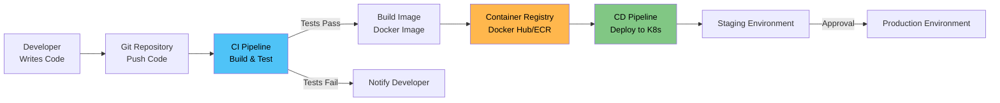
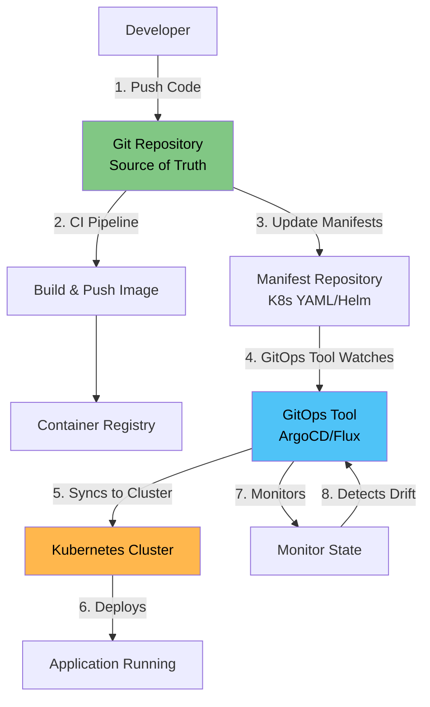
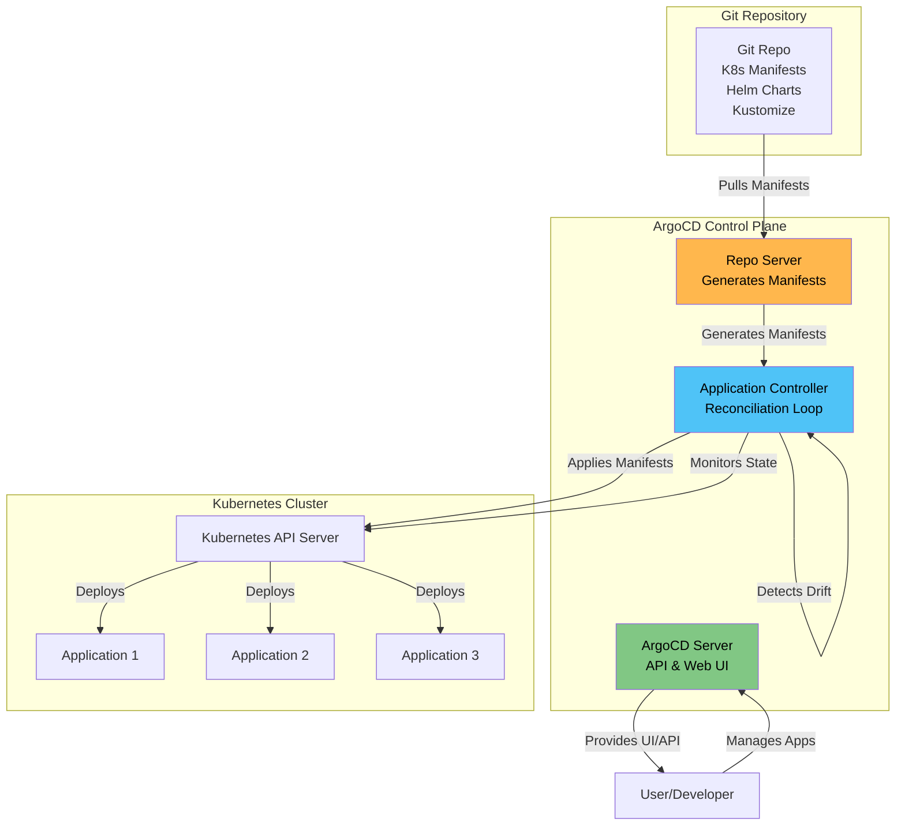
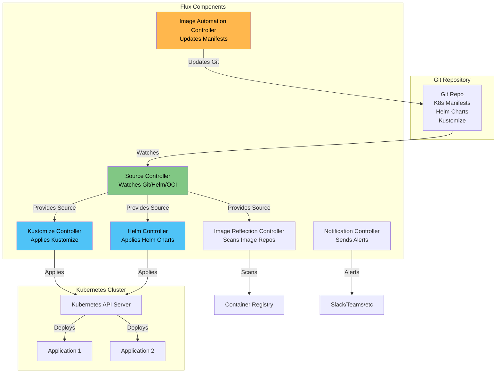

# CI/CD for Kubernetes

<details>
<summary><b>📋 Table of Contents</b></summary>

- [Introduction to CI/CD](#introduction-to-cicd)
- [What is CI/CD?](#what-is-cicd)
- [CI/CD in Kubernetes](#cicd-in-kubernetes)
- [GitOps - The Modern Approach](#gitops---the-modern-approach)
- [ArgoCD - Declarative GitOps Continuous Delivery](#argocd---declarative-gitops-continuous-delivery)
  - [What is ArgoCD?](#what-is-argocd)
  - [ArgoCD Architecture](#argocd-architecture)
  - [ArgoCD Components](#argocd-components)
  - [Installing ArgoCD](#installing-argocd)
  - [ArgoCD Concepts](#argocd-concepts)
  - [Creating Applications](#creating-applications)
  - [ArgoCD Features](#argocd-features)
  - [ArgoCD Best Practices](#argocd-best-practices)
- [Flux - GitOps Continuous Delivery](#flux---gitops-continuous-delivery)
  - [What is Flux?](#what-is-flux)
  - [Flux Architecture](#flux-architecture)
  - [Flux Components](#flux-components)
  - [Installing Flux](#installing-flux)
  - [Flux Concepts](#flux-concepts)
  - [Flux Features](#flux-features)
  - [Flux Best Practices](#flux-best-practices)
- [ArgoCD vs Flux](#argocd-vs-flux)
- [Other CI/CD Tools](#other-cicd-tools)
  - [Jenkins X](#jenkins-x)
  - [Tekton](#tekton)
  - [Spinnaker](#spinnaker)
  - [GitLab CI/CD](#gitlab-cicd)
  - [GitHub Actions](#github-actions)
  - [CircleCI](#circleci)
- [CI/CD Comparison](#cicd-comparison)
- [Choosing a CI/CD Tool](#choosing-a-cicd-tool)
- [Best Practices](#best-practices)
- [Tutorial References](#tutorial-references)

</details>

---

## Introduction to CI/CD

### What is CI/CD?

**CI/CD** stands for **Continuous Integration** and **Continuous Delivery/Deployment**. It's a set of practices and tools that automate the software development and deployment process.

**Simple Explanation:**
CI/CD is like having an automated factory for your software:
- **CI (Continuous Integration)** = Automatic testing and building when code changes
- **CD (Continuous Delivery)** = Automatic deployment to staging/production
- **GitOps** = Using Git as the single source of truth for infrastructure and applications

**Analogy:**
Think of CI/CD like an automated assembly line:
- **Developer writes code** = Raw materials arrive
- **CI Pipeline** = Quality checks and assembly
- **CD Pipeline** = Packaging and shipping
- **GitOps** = Using a master blueprint (Git) that everyone follows

### CI vs CD

**Continuous Integration (CI):**
- Automatically builds and tests code when changes are pushed
- Catches bugs early
- Ensures code quality
- Runs in CI servers (Jenkins, GitHub Actions, etc.)

**Continuous Delivery (CD):**
- Automatically deploys code to environments
- Can be manual approval (Continuous Delivery)
- Or fully automatic (Continuous Deployment)
- Runs in CD tools (ArgoCD, Flux, etc.)

### CI/CD Pipeline Flow



---

## CI/CD in Kubernetes

### Traditional CI/CD vs Kubernetes CI/CD

**Traditional CI/CD:**
- Deploys to servers directly
- Uses SSH, scripts, or configuration management
- Hard to rollback
- Environment drift issues

**Kubernetes CI/CD:**
- Deploys to Kubernetes clusters
- Uses GitOps principles
- Easy rollback
- Declarative configuration
- Version controlled

### Kubernetes CI/CD Challenges

1. **Multiple Environments:** Dev, Staging, Production
2. **Resource Management:** YAML files, Helm charts, Kustomize
3. **Configuration Drift:** Keeping environments in sync
4. **Rollbacks:** Quick recovery from failures
5. **Multi-cluster:** Managing multiple Kubernetes clusters

### GitOps Solution

**GitOps** solves these challenges by:
- Using Git as the single source of truth
- Automatically syncing Git state to clusters
- Continuous reconciliation
- Easy rollback (Git revert)
- Audit trail (Git history)

---

## GitOps - The Modern Approach

### What is GitOps?

**GitOps** is a methodology for managing infrastructure and applications using Git as the single source of truth.

**Core Principles:**
1. **Git as Source of Truth:** All configuration in Git
2. **Declarative:** Describe desired state, not how to achieve it
3. **Automated:** Automatic synchronization from Git to cluster
4. **Continuous Reconciliation:** System continuously ensures cluster matches Git
5. **Observable:** Clear visibility into what's deployed

### GitOps Workflow



### GitOps Benefits

1. **Version Control:** All changes tracked in Git
2. **Rollback:** Easy rollback with Git revert
3. **Audit Trail:** Complete history of changes
4. **Collaboration:** Multiple people can review changes
5. **Consistency:** Same process for all environments
6. **Security:** Git access control and approval workflows

---

## ArgoCD - Declarative GitOps Continuous Delivery

### What is ArgoCD?

**ArgoCD** is a declarative, GitOps continuous delivery tool for Kubernetes. It automatically syncs applications from Git repositories to Kubernetes clusters.

**Simple Explanation:**
ArgoCD is like a "smart assistant" that watches your Git repository and automatically deploys changes to Kubernetes, ensuring your cluster always matches what's in Git.

**Key Characteristics:**
- **Declarative:** Define desired state, ArgoCD makes it happen
- **GitOps:** Git is the single source of truth
- **Automatic Sync:** Continuously reconciles cluster with Git
- **Web UI:** Beautiful dashboard for visualization
- **Multi-cluster:** Manage multiple clusters from one place

### ArgoCD Architecture



### ArgoCD Components

#### 1. ArgoCD Server

The main API server and web UI:

- **API Server:** REST API for managing applications
- **Web UI:** Dashboard for visualizing applications
- **gRPC Server:** For CLI communication
- **Authentication:** RBAC, SSO, OIDC support

#### 2. Application Controller

The brain of ArgoCD:

- **Reconciliation Loop:** Continuously compares Git state with cluster state
- **Sync Operations:** Applies changes when drift detected
- **Health Monitoring:** Monitors application health
- **Status Reporting:** Reports application status

#### 3. Repo Server

Generates Kubernetes manifests:

- **Git Operations:** Clones and pulls from Git repositories
- **Manifest Generation:** Renders Helm charts, Kustomize, etc.
- **Caching:** Caches repository contents
- **Multi-format Support:** Helm, Kustomize, Plain YAML, Jsonnet

#### 4. ApplicationSet Controller

Manages multiple applications:

- **Bulk Operations:** Create multiple applications from templates
- **Multi-cluster:** Deploy to multiple clusters
- **Multi-environment:** Manage dev, staging, production

### Installing ArgoCD

#### Prerequisites

- Kubernetes cluster (v1.19+)
- `kubectl` configured
- Admin access to cluster

#### Installation

**Using kubectl:**
```bash
kubectl create namespace argocd
kubectl apply -n argocd -f https://raw.githubusercontent.com/argoproj/argo-cd/stable/manifests/install.yaml
```

**Using Helm:**
```bash
helm repo add argo https://argoproj.github.io/argo-helm
helm install argocd argo/argo-cd \
  --namespace argocd \
  --create-namespace
```

#### Verify Installation

```bash
# Check pods
kubectl get pods -n argocd

# Check services
kubectl get svc -n argocd
```

#### Access ArgoCD UI

**Port-forward:**
```bash
kubectl port-forward svc/argocd-server -n argocd 8080:443
```

**Access:** https://localhost:8080

**Get initial password:**
```bash
kubectl -n argocd get secret argocd-initial-admin-secret -o jsonpath="{.data.password}" | base64 -d
```

**Default username:** `admin`

#### Install ArgoCD CLI

**macOS:**
```bash
brew install argocd
```

**Linux:**
```bash
curl -sSL -o /usr/local/bin/argocd https://github.com/argoproj/argo-cd/releases/latest/download/argocd-linux-amd64
chmod +x /usr/local/bin/argocd
```

**Login:**
```bash
argocd login localhost:8080
```

### ArgoCD Concepts

#### Application

An **Application** is the core concept in ArgoCD. It represents a connection between a Git repository and a Kubernetes cluster.

**Application Structure:**
```yaml
apiVersion: argoproj.io/v1alpha1
kind: Application
metadata:
  name: myapp
  namespace: argocd
spec:
  project: default
  source:
    repoURL: https://github.com/example/myapp
    targetRevision: HEAD
    path: k8s
  destination:
    server: https://kubernetes.default.svc
    namespace: default
  syncPolicy:
    automated:
      prune: true
      selfHeal: true
    syncOptions:
      - CreateNamespace=true
```

**Key Fields:**
- **source:** Git repository and path
- **destination:** Target cluster and namespace
- **syncPolicy:** How to sync (automatic or manual)

#### Project

A **Project** is a logical grouping of applications with shared configuration:

```yaml
apiVersion: argoproj.io/v1alpha1
kind: AppProject
metadata:
  name: myproject
  namespace: argocd
spec:
  description: My project description
  sourceRepos:
    - 'https://github.com/example/*'
  destinations:
    - namespace: '*'
      server: '*'
  clusterResourceWhitelist:
    - group: '*'
      kind: '*'
```

#### Sync Policy

Defines how applications are synced:

**Manual Sync:**
```yaml
syncPolicy: {}
```

**Automatic Sync:**
```yaml
syncPolicy:
  automated:
    prune: true      # Delete resources removed from Git
    selfHeal: true   # Automatically sync if cluster drifts
```

**Sync Options:**
```yaml
syncOptions:
  - CreateNamespace=true
  - PrunePropagationPolicy=foreground
  - PruneLast=true
```

### Creating Applications

#### Method 1: Using CLI

```bash
argocd app create myapp \
  --repo https://github.com/example/myapp \
  --path k8s \
  --dest-server https://kubernetes.default.svc \
  --dest-namespace default
```

#### Method 2: Using YAML

Create `application.yaml`:

```yaml
apiVersion: argoproj.io/v1alpha1
kind: Application
metadata:
  name: myapp
  namespace: argocd
spec:
  project: default
  source:
    repoURL: https://github.com/example/myapp
    targetRevision: HEAD
    path: k8s
  destination:
    server: https://kubernetes.default.svc
    namespace: default
  syncPolicy:
    automated:
      prune: true
      selfHeal: true
```

Apply:
```bash
kubectl apply -f application.yaml
```

#### Method 3: Using Web UI

1. Open ArgoCD UI
2. Click "New App"
3. Fill in application details
4. Click "Create"

### ArgoCD Features

#### 1. Multi-Source Applications

Support multiple sources:

```yaml
spec:
  sources:
    - repoURL: https://github.com/example/app
      path: base
    - repoURL: https://github.com/example/config
      path: config
      helm:
        valueFiles:
          - values.yaml
```

#### 2. Helm Support

Deploy Helm charts:

```yaml
spec:
  source:
    repoURL: https://charts.example.com
    chart: myapp
    targetRevision: 1.0.0
    helm:
      valueFiles:
        - values.yaml
      values: |
        replicaCount: 3
        image:
          tag: v1.2.3
```

#### 3. Kustomize Support

Deploy Kustomize applications:

```yaml
spec:
  source:
    repoURL: https://github.com/example/myapp
    path: kustomize/base
    kustomize:
      images:
        - myapp:v1.2.3
```

#### 4. Sync Waves

Control sync order:

```yaml
metadata:
  annotations:
    argocd.argoproj.io/sync-wave: "1"  # Sync first
```

#### 5. Hooks

Run jobs before/after sync:

```yaml
apiVersion: batch/v1
kind: Job
metadata:
  name: pre-sync-job
  annotations:
    argocd.argoproj.io/hook: PreSync
    argocd.argoproj.io/hook-delete-policy: HookSucceeded
```

**Hook Types:**
- **PreSync:** Before sync
- **Sync:** During sync
- **PostSync:** After sync
- **SyncFail:** On sync failure

#### 6. Health Checks

Custom health checks:

```yaml
apiVersion: argoproj.io/v1alpha1
kind: Application
metadata:
  name: myapp
spec:
  source:
    # ...
  destination:
    # ...
  healthChecks:
    - apiVersion: v1
      kind: Service
      name: myapp
      namespace: default
```

#### 7. Multi-Cluster Support

Deploy to multiple clusters:

```yaml
spec:
  destination:
    server: https://cluster2.example.com
    namespace: production
```

#### 8. RBAC

Role-based access control:

```yaml
apiVersion: v1
kind: ConfigMap
metadata:
  name: argocd-rbac-cm
  namespace: argocd
data:
  policy.csv: |
    p, role:admin, applications, *, */*, allow
    p, role:developer, applications, get, */*, allow
    p, role:developer, applications, sync, dev/*, allow
```

### ArgoCD Best Practices

1. **Use Projects:**
   - Group related applications
   - Apply policies at project level
   - Control access with RBAC

2. **Enable Auto-Sync Carefully:**
   - Use for non-production environments
   - Consider manual sync for production
   - Use sync windows for maintenance

3. **Use Sync Waves:**
   - Control deployment order
   - Ensure dependencies are ready
   - Use negative waves for cleanup

4. **Implement Health Checks:**
   - Define custom health checks
   - Monitor application health
   - Set up alerts

5. **Use Hooks Wisely:**
   - Pre-sync for migrations
   - Post-sync for notifications
   - Clean up hooks after execution

6. **Version Control:**
   - Tag releases in Git
   - Use semantic versioning
   - Pin chart versions

---

## Flux - GitOps Continuous Delivery

### What is Flux?

**Flux** is a GitOps continuous delivery tool that automatically keeps your Kubernetes clusters in sync with sources of configuration (like Git repositories).

**Simple Explanation:**
Flux is like a "watchdog" that continuously monitors your Git repository and automatically applies any changes to your Kubernetes cluster, ensuring everything stays in sync.

**Key Characteristics:**
- **GitOps Native:** Built from the ground up for GitOps
- **CNCF Project:** Part of Cloud Native Computing Foundation
- **Lightweight:** Minimal resource footprint
- **Kubernetes Native:** Uses Kubernetes controllers
- **Multi-tenant:** Supports multiple tenants

### Flux Architecture



### Flux Components

#### 1. Source Controller

Manages sources of configuration:

- **GitRepository:** Watches Git repositories
- **HelmRepository:** Watches Helm chart repositories
- **Bucket:** Watches S3/GCS buckets
- **OCIRepository:** Watches OCI registries

#### 2. Kustomize Controller

Applies Kustomize configurations:

- **Kustomization:** Applies Kustomize overlays
- **Reconciliation:** Continuously reconciles state
- **Health Assessment:** Monitors resource health
- **Pruning:** Removes resources not in Git

#### 3. Helm Controller

Manages Helm releases:

- **HelmRelease:** Manages Helm chart deployments
- **Chart Management:** Fetches and caches charts
- **Release Management:** Installs, upgrades, uninstalls
- **Rollback:** Supports rollback operations

#### 4. Image Reflection Controller

Scans container registries:

- **Image Scanning:** Scans for new image tags
- **Metadata:** Stores image metadata
- **Caching:** Caches image information

#### 5. Image Automation Controller

Automatically updates manifests:

- **Image Updates:** Updates image tags in Git
- **Policy-based:** Updates based on policies
- **Git Commits:** Commits changes back to Git

#### 6. Notification Controller

Sends notifications:

- **Alerts:** Sends alerts on events
- **Multiple Channels:** Slack, Teams, Discord, etc.
- **Event Filtering:** Filters events to notify

### Installing Flux

#### Prerequisites

- Kubernetes cluster (v1.19+)
- `kubectl` configured
- `flux` CLI installed

#### Install Flux CLI

**macOS:**
```bash
brew install fluxcd/tap/flux
```

**Linux:**
```bash
curl -s https://fluxcd.io/install.sh | sudo bash
```

**Verify:**
```bash
flux --version
```

#### Bootstrap Flux

**Bootstrap to cluster:**
```bash
flux bootstrap github \
  --owner=myusername \
  --repository=myrepo \
  --branch=main \
  --path=clusters/my-cluster \
  --personal
```

**Bootstrap to GitLab:**
```bash
flux bootstrap gitlab \
  --owner=mygroup \
  --repository=myrepo \
  --branch=main \
  --path=clusters/my-cluster \
  --token-auth
```

**Bootstrap to generic Git:**
```bash
flux bootstrap git \
  --url=https://github.com/example/myrepo \
  --branch=main \
  --path=clusters/my-cluster
```

#### Verify Installation

```bash
# Check Flux components
kubectl get pods -n flux-system

# Check Flux resources
flux get sources git
flux get kustomizations
```

### Flux Concepts

#### GitRepository

Defines a Git repository to watch:

```yaml
apiVersion: source.toolkit.fluxcd.io/v1beta2
kind: GitRepository
metadata:
  name: myapp
  namespace: flux-system
spec:
  interval: 1m
  url: https://github.com/example/myapp
  ref:
    branch: main
  secretRef:
    name: git-credentials
```

#### Kustomization

Applies Kustomize configurations:

```yaml
apiVersion: kustomize.toolkit.fluxcd.io/v1beta2
kind: Kustomization
metadata:
  name: myapp
  namespace: flux-system
spec:
  interval: 5m
  path: ./kustomize/base
  prune: true
  sourceRef:
    kind: GitRepository
    name: myapp
  healthChecks:
    - apiVersion: apps/v1
      kind: Deployment
      name: myapp
      namespace: default
```

#### HelmRelease

Manages Helm chart deployments:

```yaml
apiVersion: helm.toolkit.fluxcd.io/v2beta1
kind: HelmRelease
metadata:
  name: myapp
  namespace: default
spec:
  interval: 5m
  chart:
    spec:
      chart: myapp
      sourceRef:
        kind: HelmRepository
        name: myrepo
      version: '1.0.0'
  values:
    replicaCount: 3
    image:
      tag: v1.2.3
```

#### HelmRepository

Defines a Helm chart repository:

```yaml
apiVersion: source.toolkit.fluxcd.io/v1beta2
kind: HelmRepository
metadata:
  name: myrepo
  namespace: flux-system
spec:
  interval: 10m
  url: https://charts.example.com
```

### Flux Features

#### 1. Multi-Tenant Support

Isolate tenants using namespaces:

```yaml
apiVersion: kustomize.toolkit.fluxcd.io/v1beta2
kind: Kustomization
metadata:
  name: tenant-a
  namespace: tenant-a
spec:
  # ...
```

#### 2. Dependency Management

Define dependencies between Kustomizations:

```yaml
spec:
  dependsOn:
    - name: database
      namespace: flux-system
```

#### 3. Health Assessment

Automatic health checking:

```yaml
spec:
  healthChecks:
    - apiVersion: apps/v1
      kind: Deployment
      name: myapp
      namespace: default
    - apiVersion: v1
      kind: Service
      name: myapp
      namespace: default
```

#### 4. Pruning

Automatically remove resources:

```yaml
spec:
  prune: true
  pruneLabels:
    - app=myapp
```

#### 5. Image Automation

Automatically update image tags:

```yaml
apiVersion: image.toolkit.fluxcd.io/v1beta1
kind: ImagePolicy
metadata:
  name: myapp
spec:
  imageRepositoryRef:
    name: myapp
  policy:
    semver:
      range: '1.x'
```

```yaml
apiVersion: image.toolkit.fluxcd.io/v1beta1
kind: ImageUpdateAutomation
metadata:
  name: myapp
spec:
  interval: 5m
  sourceRef:
    kind: GitRepository
    name: myapp
  git:
    checkout:
      ref:
        branch: main
    commit:
      author:
        name: Flux
        email: flux@example.com
      messageTemplate: 'Update image: {{range .Updated.Images}}{{println .}}{{end}}'
  update:
    path: ./kustomize
    strategy: Setters
```

#### 6. Notification

Send alerts on events:

```yaml
apiVersion: notification.toolkit.fluxcd.io/v1beta2
kind: Alert
metadata:
  name: slack-alert
spec:
  providerRef:
    name: slack
  eventSeverity: info
  eventSources:
    - kind: GitRepository
      name: '*'
    - kind: Kustomization
      name: '*'
```

### Flux Best Practices

1. **Use Bootstrap:**
   - Always use `flux bootstrap`
   - Let Flux manage itself
   - Store Flux config in Git

2. **Structure Repositories:**
   ```
   myrepo/
   ├── clusters/
   │   └── production/
   │       └── flux-system/
   ├── apps/
   │   └── myapp/
   └── infrastructure/
   ```

3. **Use Dependencies:**
   - Define clear dependencies
   - Ensure proper order
   - Use `dependsOn` for sequencing

4. **Enable Pruning:**
   - Use `prune: true` carefully
   - Test in non-production first
   - Use labels for safety

5. **Health Checks:**
   - Define health checks
   - Monitor application health
   - Set up alerts

6. **Image Automation:**
   - Use semantic versioning
   - Define update policies
   - Review automated commits

---

## ArgoCD vs Flux

### Comparison Table

| Feature | ArgoCD | Flux |
|---------|--------|------|
| **Web UI** | ✅ Excellent | ❌ No (third-party tools) |
| **CLI** | ✅ Good | ✅ Excellent |
| **Multi-cluster** | ✅ Native | ✅ Via Git |
| **Helm Support** | ✅ Excellent | ✅ Excellent |
| **Kustomize Support** | ✅ Excellent | ✅ Excellent |
| **Image Automation** | ⚠️ Limited | ✅ Excellent |
| **Notification** | ⚠️ Basic | ✅ Excellent |
| **RBAC** | ✅ Excellent | ⚠️ Basic |
| **Learning Curve** | Medium | Medium |
| **Resource Usage** | Higher | Lower |
| **CNCF Project** | ❌ No | ✅ Yes |

### When to Choose ArgoCD

- ✅ Need web UI for visualization
- ✅ Need strong RBAC
- ✅ Multi-cluster management
- ✅ Team prefers GUI

### When to Choose Flux

- ✅ Need image automation
- ✅ Prefer CLI-first approach
- ✅ Want CNCF project
- ✅ Lower resource usage
- ✅ Advanced notification needs

---

## Other CI/CD Tools

### Jenkins X

**Jenkins X** is a cloud-native CI/CD platform built for Kubernetes.

**Features:**
- Automated CI/CD pipelines
- Preview environments
- GitOps workflows
- Built on Jenkins

**Website:** https://jenkins-x.io

### Tekton

**Tekton** is a Kubernetes-native CI/CD framework.

**Features:**
- Kubernetes-native pipelines
- Reusable tasks
- CloudEvents support
- CNCF project

**Website:** https://tekton.dev

### Spinnaker

**Spinnaker** is a multi-cloud continuous delivery platform.

**Features:**
- Multi-cloud support
- Advanced deployment strategies
- Canary deployments
- Netflix open-source

**Website:** https://spinnaker.io

### GitLab CI/CD

**GitLab CI/CD** is integrated CI/CD in GitLab.

**Features:**
- Integrated with GitLab
- Kubernetes executor
- Auto DevOps
- Built-in container registry

**Website:** https://docs.gitlab.com/ee/ci/

### GitHub Actions

**GitHub Actions** is CI/CD integrated with GitHub.

**Features:**
- Integrated with GitHub
- Marketplace actions
- Matrix builds
- Self-hosted runners

**Website:** https://github.com/features/actions

### CircleCI

**CircleCI** is a cloud-based CI/CD platform.

**Features:**
- Cloud and self-hosted
- Orbs (reusable configs)
- Parallel execution
- Docker support

**Website:** https://circleci.com

---

## CI/CD Comparison

### Tool Comparison

| Tool | Type | Best For | Complexity |
|------|------|----------|------------|
| **ArgoCD** | GitOps CD | Kubernetes deployments | Medium |
| **Flux** | GitOps CD | Kubernetes deployments | Medium |
| **Jenkins X** | Full CI/CD | Cloud-native pipelines | High |
| **Tekton** | CI/CD Framework | Custom pipelines | Medium |
| **Spinnaker** | CD Platform | Multi-cloud deployments | High |
| **GitLab CI/CD** | CI/CD | GitLab users | Medium |
| **GitHub Actions** | CI/CD | GitHub users | Low |
| **CircleCI** | CI/CD | Cloud CI/CD | Medium |

---

## Choosing a CI/CD Tool

### Decision Factors

1. **GitOps vs Traditional:**
   - GitOps: ArgoCD, Flux
   - Traditional: Jenkins, GitLab CI

2. **UI vs CLI:**
   - UI: ArgoCD, Spinnaker
   - CLI: Flux, Tekton

3. **Integration:**
   - GitHub: GitHub Actions
   - GitLab: GitLab CI/CD
   - Generic: ArgoCD, Flux

4. **Features:**
   - Image automation: Flux
   - Multi-cluster: ArgoCD
   - Advanced pipelines: Tekton

5. **Complexity:**
   - Simple: GitHub Actions
   - Medium: ArgoCD, Flux
   - Complex: Spinnaker, Jenkins X

### Recommendation

**For GitOps:**
- **Start with ArgoCD:** If you need UI and multi-cluster
- **Start with Flux:** If you need image automation and prefer CLI

**For CI:**
- **GitHub Actions:** If using GitHub
- **GitLab CI:** If using GitLab
- **Tekton:** If you need Kubernetes-native

---

## Best Practices

### General Practices

1. **Use GitOps:**
   - Git as single source of truth
   - Declarative configuration
   - Automated reconciliation

2. **Separate CI and CD:**
   - CI: Build and test
   - CD: Deploy to environments
   - Use appropriate tools for each

3. **Version Everything:**
   - Tag releases
   - Pin versions
   - Use semantic versioning

4. **Test Before Deploy:**
   - Run tests in CI
   - Test in staging
   - Use canary deployments

5. **Monitor and Alert:**
   - Monitor deployments
   - Set up alerts
   - Track metrics

### ArgoCD-Specific

1. **Use Projects:**
   - Group applications
   - Apply policies
   - Control access

2. **Sync Windows:**
   - Prevent syncs during maintenance
   - Use for production
   - Schedule appropriately

3. **Health Checks:**
   - Define custom checks
   - Monitor health
   - Set up alerts

### Flux-Specific

1. **Use Bootstrap:**
   - Let Flux manage itself
   - Store config in Git
   - Use proper structure

2. **Dependencies:**
   - Define clear dependencies
   - Use `dependsOn`
   - Test order

3. **Image Automation:**
   - Use policies
   - Review commits
   - Test updates

---

## Tutorial References

- **[ArgoCD Tutorial](https://github.com/jayeshjd555/Kubernetes/blob/main/tutorials/15-argocd/README.md)** - Hands-on tutorial to set up and use ArgoCD for GitOps
- **[Flux Tutorial](https://github.com/jayeshjd555/Kubernetes/blob/main/tutorials/16-flux/README.md)** - Step-by-step guide to set up and use Flux for GitOps

---

**Next Steps:**
- Choose a GitOps tool (ArgoCD or Flux)
- Set up Git repository structure
- Configure CI pipeline
- Set up CD pipeline
- Implement best practices
- Monitor and optimize

